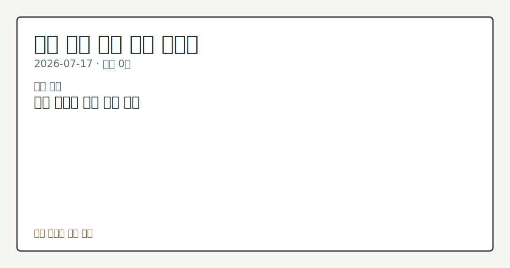

# 2026-07-17 국내 증시 시황
> 정보 제공용 자동 시황이며 매매 권유가 아닙니다.
# 2026-07-17 국내 증시 시황
**기준 시각**: 2026-07-17 KST · 수집창 2026-07-16T15:00Z ~ 2026-07-17T15:00Z (종료 미포함)
| 종목 | 종가 | 변동 | 비고 |
|------|------|------|------|
| ^KOSDAQ | 466.00 | — | — |
**세그먼트**: [국내 증시](2026-07-17.md) | 미국 증시(미발행) | [크립토](../../../crypto/2026/07/2026-07-17.md)
<!-- investo:block visual:domestic-equity.visual.data-confidence -->

*이미지: 데이터 신뢰도 · 출처: investo 자체 생성 · 생성: investo 0.1.0 · 2026-07-22 UTC*
<!-- /investo:block visual:domestic-equity.visual.data-confidence -->
> **내 관심 자산 영향**: 데이터 수집 부족으로 매칭 판단 보류 — 추가 수집 후 재평가됩니다.
> **오늘의 결론**: 코스피(KOSPI, 한국 유가증권시장 종합지수)는 456.00, 코스닥(KOSDAQ, 코스닥종합지수)은 466.00으로 집계됐다(연합뉴스) 본문 참고.
> **핵심 동인**: 삼성전자 관련 정밀 수치는 이번 회차 코어 데이터 미수집으로 확정할 수 없습니다. 같은 날 코스피와 코스닥 양대 지수 모두 외국인과 기관이 동반 본문 참고.
> **주의할 점**: SK하이닉스 관련 정밀 수치는 이번 회차 코어 데이터 미수집으로 확정할 수 없습니다.
## 한눈에 보기
삼성전자와 SK하이닉스가 각각 **-8.77%**, **-11.53%** 급락하며 반도체 대형주 중심의 조정 압력이 뚜렷하게 나타났다.
코스피 개인 순매수는 +36,647억원에 달했지만 외국인은 -13,665억원 순매도해 수급이 엇갈렸다.
SK하이닉스 관련 정밀 수치는 이번 회차 코어 데이터 미수집으로 확정할 수 없습니다.
## ⓪ 오늘의 매크로
**미 국채 수익률** — UST curve 2026-07-17: 10Y 4.55%, 2Y10Y +0.37pp
## ⓪-B 채널 기준선
| 기준선 | 값 |
|------|------|
| 코스피 | 미수집 |
| 코스닥 | 466.00 (—) |
| 원/달러 | 미수집 |
> **크로스마켓 연결 고리**: 금리 이벤트가 할인율/달러 경로의 공통 변수로 남아 있습니다.
> **오늘의 큰 그림:** 이 세그먼트의 공통 신호는 제한적입니다. 본문 수급·지표 항목을 먼저 확인하세요.
## ① 요약

<!-- investo:block visual:domestic-equity.visual.market-snapshot -->

*이미지: 시장 스냅샷 · 출처: investo 자체 생성 · 생성: investo 0.1.0 · 2026-07-22 UTC*
<!-- /investo:block visual:domestic-equity.visual.market-snapshot -->

코스피는 456.00, 코스닥은 466.00으로 집계됐다([연합뉴스](https://www.yna.co.kr/market-plus/all)). 등락률은 이번 회차 입력 데이터에 포함되지 않았고, 원/달러 환율 데이터 미수집이다. 같은 날 삼성전자[005930]와 SK하이닉스[000660]가 각각 **-8.77%**, **-11.53%** 급락하며 대형 반도체주 중심의 하락 압력이 두드러졌고, 코스피·코스닥 모두 외국인·기관이 동반 순매도했다. 전일 미국 3대 지수 관련 수치는 이번 라우팅 데이터셋에 포함되지 않아 국내 개장에 미친 영향을 구체적 수치로 연결하기는 어렵다. [하락 관찰]

## ② 전일 핵심 이슈

### SK하이닉스[000660]·삼성전자[005930], 반도체 대형주 동반 급락

삼성전자 관련 정밀 수치는 이번 회차 코어 데이터 미수집으로 확정할 수 없습니다. 같은 날 코스피와 코스닥 양대 지수 모두 외국인과 기관이 동반 순매도를 기록해 반도체 대형주 조정과 수급 이탈이 겹쳤다. 최근 며칠간의 흐름과 비교할 때 두 대형주의 낙폭이 두드러져, 직전 흐름과는 다른 하락 압력이 새롭게 나타난 모습이다. 전일 미국 3대 지수(다우·S&P500·나스닥) 관련 수치는 이번 라우팅 데이터셋에 포함되지 않아, 국내 개장에 미친 영향을 명시적 수치로 연결하기는 어렵다.

> **그래서 의미는?** 반도체 대장주 동반 급락이 코스피 전반 수급에 부담을 준 하루였다.

## ③ 섹터/수급 동향

### 반도체 섹터, 수급 이탈 속 대형주 조정

반도체 대형주인 삼성전자[005930]와 SK하이닉스[000660]는 이날 각각 **-8.77%**, **-11.53%** 하락하며 섹터 전반에 조정 압력을 더했다. 같은 날 코스피 수급은 개인이 +36,647억원 순매수한 반면 외국인은 -13,665억원, 기관은 -23,831억원 순매도해 수급 공백이 반도체 대형주 낙폭과 겹쳤다([Naver금융](https://finance.naver.com/sise/investorDealTrendDay.naver?bizdate=20260716&sosok=01)). 코스닥에서도 외국인 -2,919억원, 기관 -1,553억원 순매도가 나타났고 개인은 +4,184억원 순매수, 기타 투자자는 +287억원 순매수를 기록했다([Naver금융](https://finance.naver.com/sise/investorDealTrendDay.naver?bizdate=20260716&sosok=02)).

> **그래서 의미는?** 외국인·기관 매도세가 반도체 대형주 조정과 맞물려 수급 부담을 키웠다.

## ④ 지표·이벤트

이번 회차 입력에는 국내 지표·이벤트 관련 수집 항목이 없어 구체적인 발표 일정이나 수치를 제시하기 어렵다.

> **그래서 의미는?** 현재 수집 근거가 부족해 방향보다 확인 필요 항목으로만 봅니다.

## ⑤ 주요 종목

### 관전 분류

- NAVER[035420] 190,000원 (**+0.21%**, +400원, [출처](https://www.data.go.kr/data/15094808/openapi.do)) — 국내 대형 인터넷주 중 상대적으로 낙폭이 제한된 흐름을 보였다.
- 셀트리온[068270] 175,800원 (**+0.06%**, +100원) — 바이오 대형주는 보합권에서 마감했다.
- 현대차(현대자동차)[005380] 425,000원 (**-2.07%**, -9,000원) — 완성차 대형주는 소폭 하락 마감했다.

> **그래서 의미는?** NAVER·셀트리온·현대차는 반도체 대형주 대비 낙폭이 제한적이었다.

## ⑥ 오늘의 관전 포인트

<!-- investo:block visual:domestic-equity.visual.watchlist-relevance -->

*이미지: 관심 자산 관련성 · 출처: investo 자체 생성 · 생성: investo 0.1.0 · 2026-07-22 UTC*
<!-- /investo:block visual:domestic-equity.visual.watchlist-relevance -->

#### 관찰 신호: 삼성전자[005930] 종가

- 출처: 공공데이터포털
- 현재: 공공데이터포털 · 삼성전자[005930] 종가가 255,000원을 상회 마감하면 낙폭 축소 신호로 관찰되고, 255,000원을 하회 마감하면 추가 조정 신호로 해석된다. 관심 영향: 코스피 대형주 전반 방향성을 비교한다.
- 확인 조건: 상방 삼성전자[005930] 종가가 255,000원을 상회 마감하면 낙폭 축소 신호로 관찰되고; 하방 255,000원을 하회 마감하면 추가 조정 신호로 해석된다
- 신뢰도: 높음
- 관심 영향: 코스피 대형주 전반 방향성을 비교한다.

> **데이터 상태**: 제한

수집/품질 진단

> **데이터 상태**: 제한 — 수집 15건 / 소스 3개 / 누락: 뉴스 · 제한 — 핵심 가격 소스 0건/실패/stale, 본문 결론 신뢰도 낮음
> **소스 카운트**: 수집 대상 7 / 성공 3 / 수집 상세는 진단 섹션에서 확인할 수 있습니다. / 수집 상세는 진단 섹션에서 확인할 수 있습니다. / 수집 상세는 진단 섹션에서 확인할 수 있습니다.
> **소스 등급 분포**: S=1 / A=2
> **상세 사유**: 뉴스 카테고리 누락, 일부 소스 수집 실패, 일부 소스 0건 반환, DART 주요 공시 0건, 핵심 가격 소스 0건
> **소스별 상태**: korea-policy-rss 실패 (수집 불가), dart-disclosure 0건, fsc-krx-index-price 0건, yonhap-market 0건, 정상 3개

## ⑦ 면책조항
본 시황은 일반 정보 제공을 목적으로 자동 생성된 자료이며,
특정 종목·자산에 대한 매매 권유나 투자 자문이 아닙니다.
투자 결정과 그 결과에 대한 책임은 전적으로 본인에게 있으며,
본 시황의 내용에 따라 발생한 손실에 대해 작성자는 일체의 책임을 지지 않습니다.