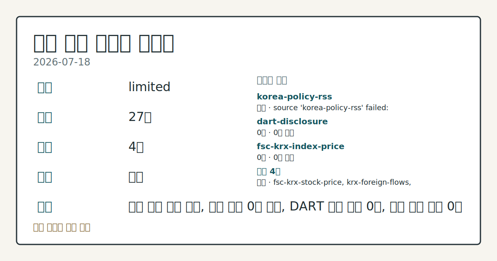
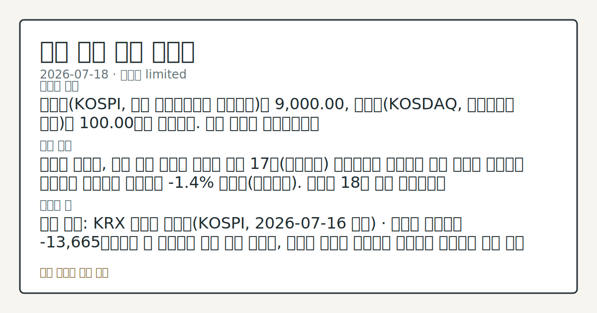

# 2026-07-18 국내 증시 시황
**기준 시각**: 2026-07-18 KST · 수집창 2026-07-17T15:00Z ~ 2026-07-18T15:00Z (종료 미포함)
| 종목 | 종가 | 변동 | 비고 |
|------|------|------|------|
| ^KOSPI | 9,000.00 | — | — |
**세그먼트**: [국내 증시](2026-07-18.md) | [미국 증시](../../../us-equity/2026/07/2026-07-18.md) | [크립토](../../../crypto/2026/07/2026-07-18.md)

*이미지: 데이터 신뢰도 · 출처: investo 자체 생성 · 생성: investo 0.1.0 · 2026-07-19 UTC*
> **내 관심 자산 영향**: 데이터 수집 부족으로 매칭 판단 보류 — 추가 수집 후 재평가됩니다.
> **용어 가이드**: 이번 시황에서 처음 등장한 용어 — 시가총액(시장가치)
> **오늘의 결론**: 코스피(KOSPI, 한국 유가증권시장 종합지수)는 9,000.00, 코스닥(KOSDAQ, 코스닥시장 지수)은 100.00으로 마감했다. 수집 근거가 제한적입니다
> **핵심 동인**: 반도체 대형주, 전일 미국 약세와 엇갈린 상승 17일(현지시간) 뉴욕증시는 인공지능 관련 반도체 매도세가 이어지며 하락했고 나스닥은 본문 참고.
> **주의할 점**: 확인 소스: KRX 외국인 순매도(KOSPI, 2026-07-16 기준) · 외국인 순매도가 -13,665억원보다 더 확대되면 수급 부담 확대로 본문 참고.
> 정보 제공용 자동 시황이며 매매 권유가 아닙니다.
## 한눈에 보기
SK하이닉스 관련 정밀 수치는 이번 회차 코어 데이터 미수집으로 확정할 수 없습니다.
SK하이닉스 관련 정밀 수치는 이번 회차 코어 데이터 미수집으로 확정할 수 없습니다.
KOSPI 외국인 순매도 -13,665억원(2026-07-16 기준)이 이어지는지는 본문 §③ 섹터/수급 동향에서 확인할 수 있다.
## ⓪ 오늘의 매크로
**국제 유가** — CFTC WTI crude oil managed_money net +61974 contracts
**미 국채 수익률** — UST curve 2026-07-17: 10Y 4.55%, 2Y10Y +0.37pp
## ⓪-B 채널 기준선
| 기준선 | 값 |
|------|------|
| 코스피 | 9,000.00 (—) |
| 코스닥 | 미수집 |
| 원/달러 | 미수집 |
> **크로스마켓 연결 고리**: 유가/지정학 이슈가 여러 자산군의 변동성 연결 고리로 관찰됩니다. / 금리 이벤트가 할인율/달러 경로의 공통 변수로 남아 있습니다.
> **오늘의 큰 그림:** 유가와 지정학 변수가 공통 변수지만, 원/달러와 국내 수급를 먼저 확인해야 합니다.
## ① 요약

*이미지: 시장 스냅샷 · 출처: investo 자체 생성 · 생성: investo 0.1.0 · 2026-07-19 UTC*

코스피는 9,000.00, 코스닥은 100.00으로 마감했다. 원/달러 환율은 데이터 미수집이다. SK하이닉스 관련 정밀 수치는 이번 회차 코어 데이터 미수집으로 확정할 수 없습니다. 같은 날 KOSPI에서는 외국인이 -13,665억원, 기관이 -23,831억원 순매도한 반면 개인은 +36,647억원 순매수해 수급 주체별 방향이 엇갈렸다(2026-07-16 기준). 국제유가는 미·이란 확전 우려로 **+4.5%** 올라 브렌트유가 90달러에 근접하며 변동성 요인으로 남아 있다. [혼재]

## ② 전일 핵심 이슈

### 반도체 대형주, 전일 미국 약세와 엇갈린 상승

17일(현지시간) 뉴욕증시는 인공지능 관련 반도체 매도세가 이어지며 하락했고 나스닥은 **-1.4%** 내렸다([연합뉴스](https://www.yna.co.kr/view/AKR20260718007951072)). 그러나 18일 국내 시장에서는 삼성전자[005930]가 279,500원([공공데이터포털](https://www.data.go.kr/data/15094808/openapi.do)), SK하이닉스[000660]가 2,082,000원([공공데이터포털](https://www.data.go.kr/data/15094808/openapi.do))으로 마감하며 전일 미국 반도체주 약세와 다른 방향으로 움직였다. 최근 며칠간 반도체 업종 중심의 강세 흐름이 이어져 온 가운데, 이날도 두 종목이 동반 상승하며 같은 흐름을 이어갔다.

> **그래서 의미는?** 미국 반도체주가 내렸는데도 국내 반도체 대형주는 올라, 국내 수급이 별도로 움직인 하루였습니다.

### 국제유가 급등, 지정학 리스크 부각

국제유가는 미국과 이란의 무력 충돌이 일주일째 이어지며 **+4.5%** 올라 브렌트유가 90달러에 근접했다([연합뉴스](https://www.yna.co.kr/view/AKR20260718006800072)). 원자재 가격 상승은 원/달러 환율 및 수입 물가 경로를 통해 국내 증시 변동성에 영향을 줄 수 있는 배경 변수다.

## ③ 섹터/수급 동향

### 반도체 대형주 강세, 수급 주체는 엇갈림

반도체 대형주는 이번에도 강세를 보였다. 삼성전자[005930]는 279,500원, SK하이닉스[000660]는 2,082,000원으로 마감했다([공공데이터포털](https://www.data.go.kr/data/15094808/openapi.do)). 다만 수급 주체별로는 온도차가 뚜렷했다. KOSPI에서는 개인이 +36,647억원 순매수한 반면 기관은 -23,831억원, 외국인은 -13,665억원 순매도했고, KOSDAQ에서도 개인이 +4,184억원 순매수한 반면 기관은 -1,553억원, 외국인은 -2,919억원 순매도했다(2026-07-16 기준, [KRX 미러](https://finance.naver.com/sise/investorDealTrendDay.naver?bizdate=20260716&sosok=01)). 조정장이 한 달 가까이 이어지는 가운데 지수 하락을 두 배 추종하는 인버스2X(지수 하락 2배 추종 상장지수펀드) ETF(상장지수펀드)의 수익률이 상위권을 차지했다는 보도도 있었다([연합뉴스](https://www.yna.co.kr/view/AKR20260716181800008)).

> **그래서 의미는?** 대형 반도체주는 올랐지만 기관·외국인은 순매도해, 상승의 지속력은 수급으로 다시 확인할 필요가 있습니다.

### 코스닥 반도체 노출 변화 점검와 중소형주 순환

코스닥 시가총액 상위 100종목 중 반도체주 비중이 1년 새 88%까지 늘었다는 분석이 나왔고([연합뉴스](https://www.yna.co.kr/view/AKR20260716201100008)), 이달 약세장에서는 중소형주 수익률이 대형주를 앞질렀다는 보도도 있었다([연합뉴스](https://www.yna.co.kr/view/AKR20260717001000008)).

## ④ 지표·이벤트

### 국제유가 급등

미국과 이란의 무력 충돌이 일주일째 이어지며 국제유가가 **+4.5%** 올랐고, 브렌트유가 90달러에 근접했다([연합뉴스](https://www.yna.co.kr/view/AKR20260718006800072)).

> **그래서 의미는?** 중동발 유가 급등은 물가·환율을 거쳐 국내 증시에 영향을 줄 수 있는 변수입니다.

## ⑤ 주요 종목

### 실적·수급 확인 종목

- NAVER[035420] 189,600원(**+3.49%**, +6,400원)([공공데이터포털](https://www.data.go.kr/data/15094808/openapi.do))
- 셀트리온[068270] 175,700원(**+1.68%**, +2,900원)([공공데이터포털](https://www.data.go.kr/data/15094808/openapi.do))
- 현대차[005380] 434,000원([공공데이터포털](https://www.data.go.kr/data/15094808/openapi.do))

> **그래서 의미는?** NAVER(네이버), 셀트리온, 현대차 등 대형주가 고르게 오른 하루였습니다.

### 신규상장 관전

- 에이치엘지노믹스: 원료의약품(API, 활성의약성분) 전문기업으로 7월 넷째 주(20~24일) 코스닥 상장이 예정되어 있다([연합뉴스](https://www.yna.co.kr/view/AKR20260716187000008)).

## ⑥ 오늘의 관전 포인트

> **관전 포인트**: 구조화 가능한 관찰 신호가 부족합니다 — 본문 §②·§④ 참조

> **데이터 상태**: 제한

수집/품질 진단

> **데이터 상태**: 제한 — 수집 27건 / 소스 4개 / 누락: 없음 · 제한 — 핵심 가격 소스 0건/실패/stale, 본문 결론 신뢰도 낮음
> **소스 카운트**: 수집 대상 7 / 성공 4 / 수집 상세는 진단 섹션에서 확인할 수 있습니다. / 수집 상세는 진단 섹션에서 확인할 수 있습니다. / 수집 상세는 진단 섹션에서 확인할 수 있습니다.
> **소스 등급 분포**: S=1 / A=2 / B=1
> **상세 사유**: 일부 소스 수집 실패, 일부 소스 0건 반환, DART 주요 공시 0건, 핵심 가격 소스 0건
> **소스별 상태**: korea-policy-rss 실패 (수집 불가), dart-disclosure 0건, fsc-krx-index-price 0건, 정상 4개

## ⑦ 면책조항
본 시황은 일반 정보 제공을 목적으로 자동 생성된 자료이며,
특정 종목·자산에 대한 매매 권유나 투자 자문이 아닙니다.
투자 결정과 그 결과에 대한 책임은 전적으로 본인에게 있으며,
본 시황의 내용에 따라 발생한 손실에 대해 작성자는 일체의 책임을 지지 않습니다.