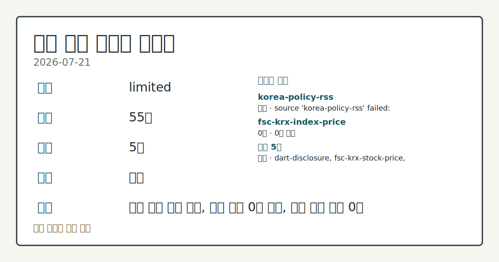
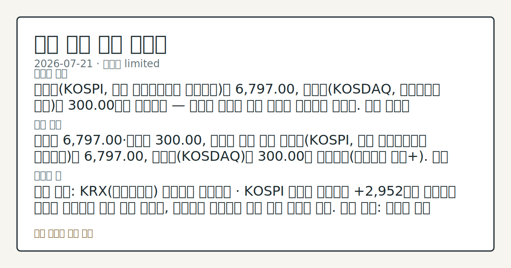
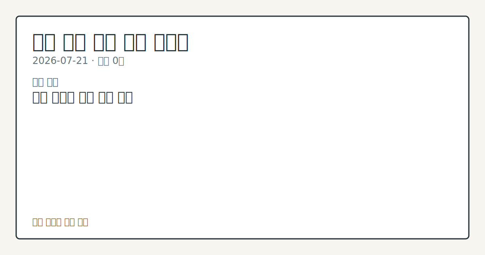

# 2026-07-21 국내 증시 시황
> 정보 제공용 자동 시황이며 매매 권유가 아닙니다.
# 2026-07-21 국내 증시 시황
**기준 시각**: 2026-07-21 KST · 수집창 2026-07-20T15:00Z ~ 2026-07-21T15:00Z (종료 미포함)
| 종목 | 종가 | 변동 | 비고 |
|------|------|------|------|
| ^KOSPI | 6,797.00 | — | — |
| ^KOSDAQ | 300.00 | — | — |
| 005930.KS | 259,000.00 | — | — |
| 000660.KS | 1,836,000.00 | — | — |
**세그먼트**: [국내 증시](2026-07-21.md) | [미국 증시](../../../us-equity/2026/07/2026-07-21.md) | [크립토](../../../crypto/2026/07/2026-07-21.md)
<!-- investo:block visual:domestic-equity.visual.data-confidence -->

*이미지: 데이터 신뢰도 · 출처: investo 자체 생성 · 생성: investo 0.1.0 · 2026-07-22 UTC*
<!-- /investo:block visual:domestic-equity.visual.data-confidence -->
> **내 관심 자산 영향**: 데이터 수집 부족으로 매칭 판단 보류 — 추가 수집 후 재평가됩니다.
> **오늘의 결론**: 코스피(KOSPI, 한국 유가증권시장 종합지수)는 6,797.00, 코스닥(KOSDAQ, 코스닥시장 지수)은 300.00으로 마감했다 — 등락률 본문 참고.
> **핵심 동인**: 코스피 6,797.00·코스닥 300.00, 지난주 레벨 유지 코스피(KOSPI, 한국 유가증권시장 종합지수)는 6,797.00, 코스닥은 본문 참고.
> **주의할 점**: 확인 소스: KRX(한국거래소) 투자자별 매매동향 · KOSPI 외국인 순매수가 +2,952억원 수준에서 추가로 확대되면 수급 개선 신호로 본문 참고.
## 한눈에 보기
삼성전자 **+6.15%**, SK하이닉스 **+4.08%**로 반도체 대형주가 강세를 보이며 코스피 6,797.00 마감을 뒷받침했다.
삼성전자[005930]가 259,000원(**+6.15%**)으로 마감해 이날 개별 종목 중 가장 큰 상승폭을 기록했다.
KOSPI 외국인 순매수 +2,952억원 대 개인 순매도 -16,421억원 수급 엇갈림 — 본문 §③ 참조.
## ⓪ 오늘의 매크로
**미 국채 수익률** — UST curve 2026-07-21: 10Y 4.63%, 2Y10Y +0.37pp
## ⓪-B 채널 기준선
| 기준선 | 값 |
|------|------|
| 코스피 | 6,797.00 (—) |
| 코스닥 | 300.00 (—) |
| 원/달러 | 미수집 |
> **크로스마켓 연결 고리**: 금리 이벤트가 할인율/달러 경로의 공통 변수로 남아 있습니다.
> **오늘의 큰 그림:** 이 세그먼트의 공통 신호는 제한적입니다. 본문 수급·지표 항목을 먼저 확인하세요.
## ① 요약

<!-- investo:block visual:domestic-equity.visual.market-snapshot -->

*이미지: 시장 스냅샷 · 출처: investo 자체 생성 · 생성: investo 0.1.0 · 2026-07-22 UTC*
<!-- /investo:block visual:domestic-equity.visual.market-snapshot -->

코스피는 **6,797.00**, 코스닥은 300.00으로 마감했다 — 등락률 수치는 이번 집계에 포함되지 않았다. 원/달러 환율은 환율 데이터 미수집이다. 전날 뉴욕증시가 반도체주 저가 매수세로 상승 출발한 흐름을 이어받아, 국내 증시에서도 삼성전자가 **+6.15%**, SK하이닉스가 **+4.08%**로 강세를 보이며 지수를 지지했다. 코스피는 지난 17일 집계와 동일한 **6,797.00**을 유지해 큰 변화 없이 흐름을 연장한 모습이다. [상승 관찰]

## ② 전일 핵심 이슈

### 코스피 6,797.00·코스닥 300.00, 지난주 레벨 유지

코스피는 **6,797.00**, 코스닥은 300.00에 마감했다([연합뉴스 마켓+](https://www.yna.co.kr/market-plus/all)). 이는 지난 17일 집계와 동일한 수준으로, 최근 컨텍스트 대비 새로운 방향 전환 없이 흐름이 연장된 것으로 관찰된다.

> **그래서 의미는?** 지수 레벨이 지난주와 같아 새로운 방향성 신호로 보기 어렵습니다.

### 뉴욕증시 반도체주 상승 출발, 국내 반도체 대형주로 확산

전날 뉴욕증시의 3대 주가지수는 반도체주를 중심으로 저가 매수세가 유입되며 상승 출발했다([연합뉴스](https://www.yna.co.kr/view/AKR20260721187100009)). 이 흐름은 국내 개장에도 이어져 삼성전자[005930]가 **+6.15%**, SK하이닉스[000660]가 **+4.08%**로 상승해 국내 반도체 대형주 수급에 우호적인 영향을 준 것으로 관찰된다.

## ③ 섹터/수급 동향

### KRX 투자자별 매매동향 — 코스피·코스닥 수급 엇갈림

코스피에서 외국인이 +2,952억원 순매수, 기관이 +13,744억원 순매수를 기록한 반면 개인은 -16,421억원 순매도로 대응했다([KRX 매매동향](https://finance.naver.com/sise/investorDealTrendDay.naver?bizdate=20260721&sosok=01)). 코스닥에서는 개인이 +1,474억원 순매수한 반면 외국인은 -1,360억원 순매도, 기관은 -129억원 순매도를 나타내 코스피·코스닥 수급 주체가 엇갈렸다([KRX 매매동향](https://finance.naver.com/sise/investorDealTrendDay.naver?bizdate=20260721&sosok=02)).

> **그래서 의미는?** 코스피는 기관·외국인 매수, 코스닥은 개인 매수 중심으로 수급 축이 다릅니다.

### 반도체·2차전지 섹터 흐름

반도체 대형주는 삼성전자[005930]가 259,000원, SK하이닉스[000660]가 1,836,000원으로 나란히 상승해 섹터 전반의 강세를 뒷받침했다. 2차전지 관련 종목은 이번 회차 입력 데이터에 포함되지 않아 흐름을 서술할 근거가 없다.

## ④ 지표·이벤트

### 국고채 금리 혼조 — 단기물 하락, 초장기물 최고치

21일 국고채 금리는 혼조세를 나타내 단기물은 내리고 초장기물은 최고치를 기록했다([연합뉴스](https://www.yna.co.kr/view/AKR20260721155352008)).

> **그래서 의미는?** 단기·장기 금리가 엇갈려 채권시장이 방향을 확정하지 못한 상태로 보입니다.

## ⑤ 주요 종목

### 대형주 확인 항목

- NAVER[035420] 193,000원 
- SK하이닉스[000660] 1,836,000원 
- 삼성전자[005930] 259,000원 
- 셀트리온[068270] 171,600원 (**-0.58%**, -1,000원)
- 현대차[005380] 399,000원 

> **그래서 의미는?** 삼성전자·SK하이닉스 등 반도체 대형주의 상승 폭을 확인할 필요가 있습니다.

### 애프터마켓 변동 관찰

- 클로봇[466100]: 애프터마켓서 10%대 급등 ([연합뉴스](https://www.yna.co.kr/view/AKR20260721174300008))
- 로보스타[090360]: 애프터마켓서 10%대 급등 ([연합뉴스](https://www.yna.co.kr/view/AKR20260721174000008))
- 에스피지[058610]: 애프터마켓서 10%대 급등 ([연합뉴스](https://www.yna.co.kr/view/AKR20260721172600008))
- 삼현[437730]: 애프터마켓서 10%대 급등 ([연합뉴스](https://www.yna.co.kr/view/AKR20260721166200008))

### 공시 체크리스트

- 삼성전자 사장단, 장기성과인센티브(LTI)로 자사주 수령 — 노태문 대표 약 57억원, 전영현 부문장 약 26억원 규모 ([연합뉴스](https://www.yna.co.kr/view/AKR20260721169500003))
- 에넥스[011090]: 제3자배정 유상증자로 50억원 조달 결정 공시 ([연합뉴스](https://www.yna.co.kr/view/AKR20260721163400008))

## ⑥ 오늘의 관전 포인트

<!-- investo:block visual:domestic-equity.visual.watchlist-relevance -->

*이미지: 관심 자산 관련성 · 출처: investo 자체 생성 · 생성: investo 0.1.0 · 2026-07-22 UTC*
<!-- /investo:block visual:domestic-equity.visual.watchlist-relevance -->

#### 관찰 신호: KOSPI 외국인 순매수

- 출처: KRX 투자자별 매매동향
- 현재: KRX 투자자별 매매동향 · KOSPI 외국인 순매수가 +2,952억원 수준에서 추가로 확대되면 수급 개선 신호로, 순매도로 전환되면 수급 이탈 신호로 관찰. 관심 영향: 외국인 수급 방향 점검.
- 확인 조건: 상방 KOSPI 외국인 순매수가 +2,952억원 수준에서 추가로 확대되면 수급 개선 신호로; 하방 순매도로 전환되면 수급 이탈 신호로 관찰
- 신뢰도: 보통
- 관심 영향: 외국인 수급 방향 점검.

#### 관찰 신호: 삼성전자

- 출처: FSC KRX 종목시세
- 현재: FSC KRX 종목시세 · 삼성전자가 당일 고가 263,500원을 상회하면 상승 흐름 지속으로, 당일 시가 247,000원 아래로 이탈하면 되돌림으로 관찰. 관심 영향: 반도체 대형주 수급 흐름 점검.
- 확인 조건: 상방 삼성전자가 당일 고가 263,500원을 상회하면 상승 흐름 지속으로; 하방 당일 시가 247,000원 아래로 이탈하면 되돌림으로 관찰
- 신뢰도: 높음
- 관심 영향: 반도체 대형주 수급 흐름 점검.

#### 관찰 신호: 코스피

- 출처: 스톡(Stooq) 코스피 지수
- 현재: 스톡(Stooq) 코스피 지수 · 코스피가 6,797.00을 상회해 마감하면 추세 유지로, 이를 하회하면 되돌림 국면으로 관찰. 관심 영향: 지수 레벨 유지 확인.
- 확인 조건: 상방 코스피가 6,797.00을 상회해 마감하면 추세 유지로; 하방 이를 하회하면 되돌림 국면으로 관찰
- 신뢰도: 보통
- 관심 영향: 지수 레벨 유지 확인.

> **데이터 상태**: 제한

수집/품질 진단

> **데이터 상태**: 제한 — 수집 55건 / 소스 5개 / 누락: 없음 · 제한 — 핵심 가격 소스 0건/실패/stale, 본문 결론 신뢰도 낮음
> **소스 카운트**: 수집 대상 7 / 성공 5 / 수집 상세는 진단 섹션에서 확인할 수 있습니다. / 수집 상세는 진단 섹션에서 확인할 수 있습니다. / 수집 상세는 진단 섹션에서 확인할 수 있습니다.
> **소스 등급 분포**: S=2 / A=2 / B=1
> **상세 사유**: 일부 소스 수집 실패, 일부 소스 0건 반환, 핵심 가격 소스 0건
> **소스별 상태**: korea-policy-rss 실패 (일시적 수집 오류), fsc-krx-index-price 0건, 정상 5개

## ⑦ 면책조항
본 시황은 일반 정보 제공을 목적으로 자동 생성된 자료이며,
특정 종목·자산에 대한 매매 권유나 투자 자문이 아닙니다.
투자 결정과 그 결과에 대한 책임은 전적으로 본인에게 있으며,
본 시황의 내용에 따라 발생한 손실에 대해 작성자는 일체의 책임을 지지 않습니다.