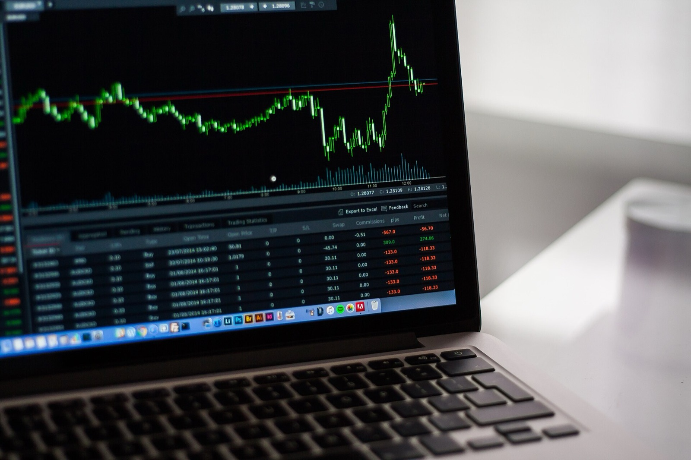
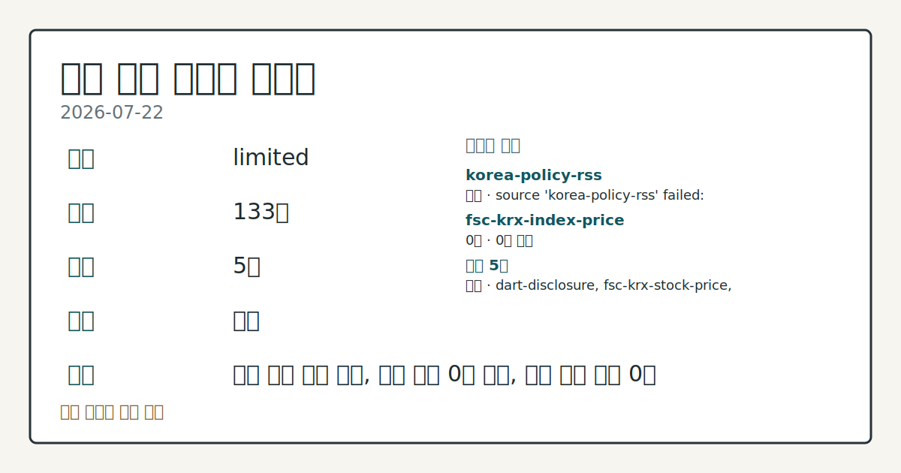
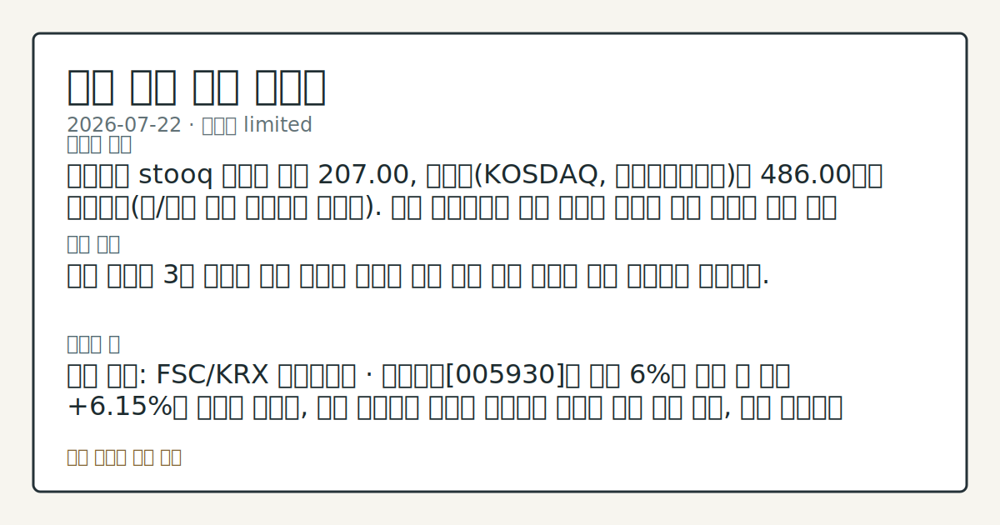
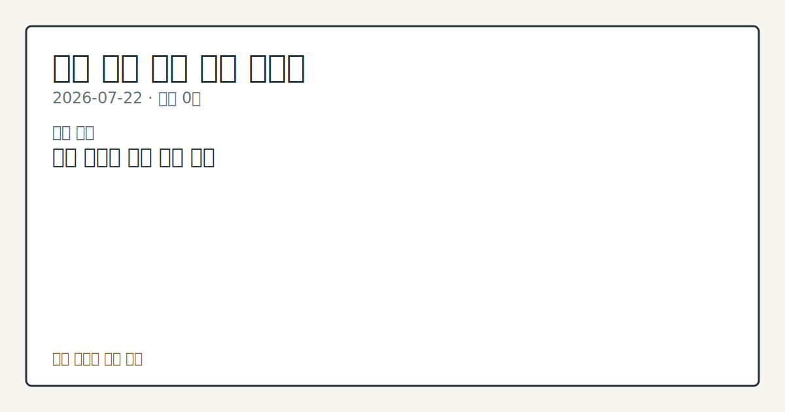

# 2026-07-22 국내 증시 시황
> 정보 제공용 자동 시황이며 매매 권유가 아닙니다.
# 2026-07-22 국내 증시 시황
**기준 시각**: 2026-07-22 KST · 수집창 2026-07-21T15:00Z ~ 2026-07-22T15:00Z (종료 미포함)
| 종목 | 종가 | 변동 | 비고 |
|------|------|------|------|
| ^KOSDAQ | 486.00 | — | — |
**세그먼트**: [국내 증시](2026-07-22.md) | [미국 증시](../../../us-equity/2026/07/2026-07-22.md) | [크립토](../../../crypto/2026/07/2026-07-22.md)
<!-- investo:block visual:domestic-equity.visual.curated-context-image -->

*이미지: 큐레이션 시황 이미지 · 출처: 외부 라이선스 이미지 · 생성: investo 0.1.0 · 2026-07-22 UTC*
<!-- /investo:block visual:domestic-equity.visual.curated-context-image -->
> **내 관심 자산 영향**: 데이터 수집 부족으로 매칭 판단 보류 — 추가 수집 후 재평가됩니다.
> **용어 가이드**: 이번 시황에서 처음 등장한 용어 — ETF(상장지수펀드)
> **오늘의 결론**: 코스피는 stooq 데이터 기준 207.00, 코스닥(KOSDAQ, 코스닥종합지수)은 486.00으로 집계됐다(원/달러 환율 데이터는 미수집) 본문 참고.
> **핵심 동인**: 전일 미국장 3대 지수는 중동 갈등과 빅테크 기업 실적 발표 경계감 속에 혼조세로 출발했다.
> **주의할 점**: 삼성전자 관련 정밀 수치는 이번 회차 코어 데이터 미수집으로 확정할 수 없습니다. 관심 영향: 반도체 대형주 변동성 흐름 점검. 확인 소스: KRX 본문 참고.
## 한눈에 보기
SK하이닉스 관련 정밀 수치는 이번 회차 코어 데이터 미수집으로 확정할 수 없습니다.
코스피 외국인이 2주째 순매수 행보를 이어가며 본격 복귀 기대감을 키웠다.
10년물 국고채 금리가 연고점을 경신해 §④ 지표·이벤트에서 반도체 수급 부담 변수로 확인할 수 있다.
## ⓪ 오늘의 매크로
**미 국채 수익률** — UST curve 2026-07-22: 10Y 4.67%, 2Y10Y +0.36pp
## ⓪-B 채널 기준선
| 기준선 | 값 |
|------|------|
| 코스피 | 미수집 |
| 코스닥 | 486.00 (—) |
| 원/달러 | 미수집 |
> **크로스마켓 연결 고리**: 금리 이벤트가 할인율/달러 경로의 공통 변수로 남아 있습니다.
> **오늘의 큰 그림:** 이 세그먼트의 공통 신호는 제한적입니다. 본문 수급·지표 항목을 먼저 확인하세요.
## ① 요약

<!-- investo:block visual:domestic-equity.visual.data-confidence -->

*이미지: 데이터 신뢰도 · 출처: investo 자체 생성 · 생성: investo 0.1.0 · 2026-07-22 UTC*
<!-- /investo:block visual:domestic-equity.visual.data-confidence -->

<!-- investo:block visual:domestic-equity.visual.market-snapshot -->

*이미지: 시장 스냅샷 · 출처: investo 자체 생성 · 생성: investo 0.1.0 · 2026-07-22 UTC*
<!-- /investo:block visual:domestic-equity.visual.market-snapshot -->

코스피는 stooq 데이터 기준 207.00, 코스닥은 486.00으로 집계됐다. 삼성전자 관련 정밀 수치는 이번 회차 코어 데이터 미수집으로 확정할 수 없습니다. 다만 장중 상승분의 상당폭이 반납되며 단일종목 레버리지 ETF 거래대금도 10조원대로 다소 줄어드는 등 변동성이 확대된 하루였다. [변동성 확대]

## ② 전일 핵심 이슈

[전일 미국장](https://www.yna.co.kr/view/AKR20260722184000009) 3대 지수는 중동 갈등과 빅테크 기업 실적 발표 경계감 속에 혼조세로 출발했다. 코스피 관련 정밀 수치는 이번 회차 코어 데이터 미수집으로 확정할 수 없습니다.

> **그래서 의미는?** 미국 증시의 경계 심리가 국내 개장에 영향을 줬지만 반도체 수급으로 되돌림이 나타났다.

### 반도체 투심 급등 후 되돌림

삼성전자 관련 정밀 수치는 이번 회차 코어 데이터 미수집으로 확정할 수 없습니다. 반도체 투자심리가 아직 완전히 안정되지 않았음을 보여주는 흐름이다.

### 단일종목 레버리지 ETF 정책 대응

[김용범 청와대 정책실장](https://www.yna.co.kr/view/AKR20260722152900001)은 22일 단일종목 레버리지 ETF(상장지수펀드) 제도 관련 대책을 신속히 이행한 뒤 보완을 검토하겠다고 밝혔다. 같은 날 [단일종목 레버리지 ETF](https://www.yna.co.kr/view/AKR20260722146600008)는 급등 출발했다가 상승분 대부분을 반납했고, 거래대금은 10조원대로 다소 줄었다.

## ③ 섹터/수급 동향

22일 KRX 투자자별 매매동향에 따르면 코스피에서는 외국인이 +26,211억원 순매수한 반면 개인과 기관은 각각 -12,176억원, -13,963억원 순매도했다. 코스닥에서는 개인이 +2,636억원 순매수한 반면 기관과 외국인은 각각 -1,914억원, -815억원 순매도했다.

> **그래서 의미는?** 코스피는 외국인 주도, 코스닥은 개인 주도로 수급 축이 서로 다르게 형성됐다.

### 외국인 수급 회복 흐름

[2주째 코스피 '사자' 행보](https://www.yna.co.kr/view/AKR20260722086251008) 보도는 외국인이 이번 주 들어 코스피에서 연일 순매수를 이어가며 본격 복귀 기대감을 키우고 있다고 전했다.

### 반도체 대형주 가격 동향

가격 데이터 기준으로 SK하이닉스[000660]는 1,836,000원(**+4.08%**, +72,000원)에, 삼성전자[005930]는 259,000원에 마감했다. 두 종목 모두 장중 고가(SK하이닉스 1,889,000원, 삼성전자 263,500원) 대비 낮은 수준에서 종가를 형성했다.

## ④ 지표·이벤트

지수 데이터 기준으로 코스피는 207.00, 코스닥은 486.00으로 집계됐다(stooq-kr-market, 출처: 연합뉴스 RSS). 전일 이하 최근 회차 수준과 비교하면 변동 폭이 큰 편이라 지수 데이터 자체의 정합성도 함께 확인이 필요하다.

> **그래서 의미는?** 지수 자체보다 반도체 대형주 등 종목별 가격 흐름이 오늘 수급을 설명하는 데 더 유효하다.

### 국고채 금리 연고점 경신

[유가 등에 국고채 금리 일제히 상승](https://www.yna.co.kr/view/AKR20260722145151008) 보도에 따르면 22일 국고채 금리가 일제히 상승했고 10년물은 연고점을 경신했다. [국고채 금리 일제히 상승](https://www.yna.co.kr/view/AKR20260722145100008) 보도는 3년물 금리가 연 **3.913%**를 기록했다고 전했다.

## ⑤ 주요 종목

가격 데이터가 확인된 종목은 NAVER[035420], 셀트리온[068270], 현대차[005380]다. NAVER는 193,000원, 셀트리온은 171,600원(**-0.58%**, -1,000원), 현대차는 399,000원으로 마감했다.

> **그래서 의미는?** NAVER(네이버)는 상승, 셀트리온(바이오)은 소폭 하락, 현대차는 보합으로 종목별 온도차가 있었다.

### 가격 확인 종목

NAVER\[035420\](네이버)는 **+3.82%** 상승한 193,000원에, 셀트리온[068270]은 **-0.58%** 하락한 171,600원에, 현대차[005380]는 보합인 399,000원에 거래를 마쳤다.

### 애프터마켓 급등 확인 항목

22일 애프터마켓에서 [노타[486990]](https://www.yna.co.kr/view/AKR20260722161800008), [플리토[300080]](https://www.yna.co.kr/view/AKR20260722160800008), [서울반도체[046890]](https://www.yna.co.kr/view/AKR20260722153900008), [인투셀[287840]](https://www.yna.co.kr/view/AKR20260722141000008)이 각각 10%대 급등을 기록했다는 보도가 있었다. 정규장 마감 이후 흐름으로 익일 정규장에서의 지속 여부는 확인이 필요하다.

### 자본거래·공시 체크리스트

SK스퀘어[402340]는 [자사주 430억원 소각](https://www.yna.co.kr/view/AKR20260722155900017)을 결의했다. 넥스틸[092790]은 [미국 법인 지분 50%를 738억원에 취득](https://www.yna.co.kr/view/AKR20260722155800008)했다고 밝혔다. 신동빈 롯데 회장은 [롯데쇼핑[023530] 지분 **1.15%**를 매각](https://www.yna.co.kr/view/AKR20260722144900030)해 유동성을 확보했다고 전해졌다. SK에코플랜트는 [회사채 수요예측에서 약 1조원 수요](https://www.yna.co.kr/view/AKR20260722138300008)를 확보했다. 에이치엘지노믹스는 [코스닥 신규 상장](https://www.yna.co.kr/view/AKR20260722148500008) 승인을 받아 24일 거래를 시작한다. 이 밖에 [그린생명과학 최대주주변경](https://dart.fss.or.kr/dsaf001/main.do?rcpNo=20260722900912), [KC산업 대량보유상황보고서](https://dart.fss.or.kr/dsaf001/main.do?rcpNo=20260722000575), [대한방직 자기주식취득신탁계약](https://dart.fss.or.kr/dsaf001/main.do?rcpNo=20260722000564), [드림시큐리티 전환사채권발행결정](https://dart.fss.or.kr/dsaf001/main.do?rcpNo=20260722000529), [큐로셀 대량보유상황보고서](https://dart.fss.or.kr/dsaf001/main.do?rcpNo=20260722000561), [세종텔레콤 특정증권등거래계획보고서](https://dart.fss.or.kr/dsaf001/main.do?rcpNo=20260722000558) 등 DART(전자공시시스템) 공시가 다수 접수됐다.

## ⑥ 오늘의 관전 포인트

<!-- investo:block visual:domestic-equity.visual.watchlist-relevance -->

*이미지: 관심 자산 관련성 · 출처: investo 자체 생성 · 생성: investo 0.1.0 · 2026-07-22 UTC*
<!-- /investo:block visual:domestic-equity.visual.watchlist-relevance -->

> **관전 포인트**: 오늘은 공개 근거가 충분한 관전 신호만 본문에 남겼습니다.

> **데이터 상태**: 제한

수집/품질 진단

> **데이터 상태**: 제한 — 수집 133건 / 소스 5개 / 누락: 없음 · 제한 — 핵심 가격 소스 0건/실패/stale, 본문 결론 신뢰도 낮음
> **소스 카운트**: 수집 대상 7 / 성공 5 / 수집 상세는 진단 섹션에서 확인할 수 있습니다. / 수집 상세는 진단 섹션에서 확인할 수 있습니다. / 수집 상세는 진단 섹션에서 확인할 수 있습니다.
> **소스 등급 분포**: S=2 / A=2 / B=1
> **상세 사유**: 일부 소스 수집 실패, 일부 소스 0건 반환, 핵심 가격 소스 0건
> **소스별 상태**: korea-policy-rss 실패 (수집 불가), fsc-krx-index-price 0건, 정상 5개

## ⑦ 면책조항
본 시황은 일반 정보 제공을 목적으로 자동 생성된 자료이며,
특정 종목·자산에 대한 매매 권유나 투자 자문이 아닙니다.
투자 결정과 그 결과에 대한 책임은 전적으로 본인에게 있으며,
본 시황의 내용에 따라 발생한 손실에 대해 작성자는 일체의 책임을 지지 않습니다.