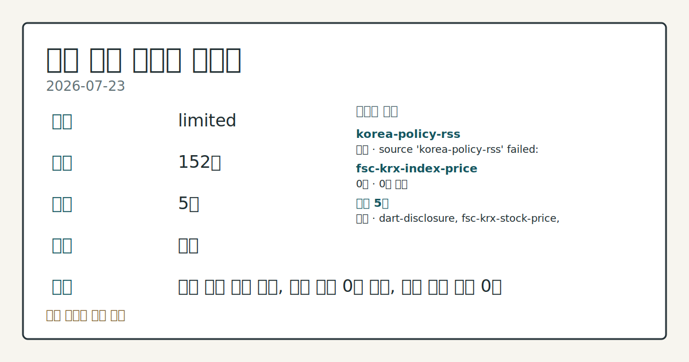
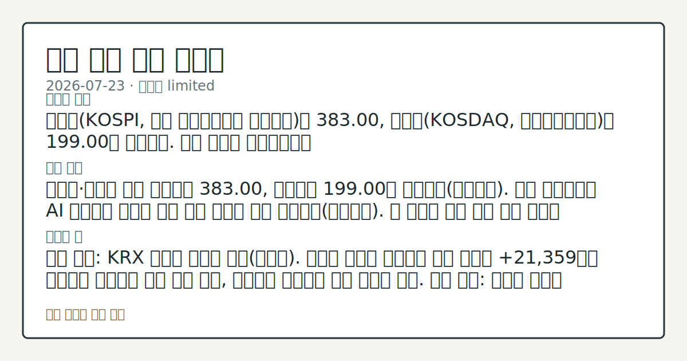
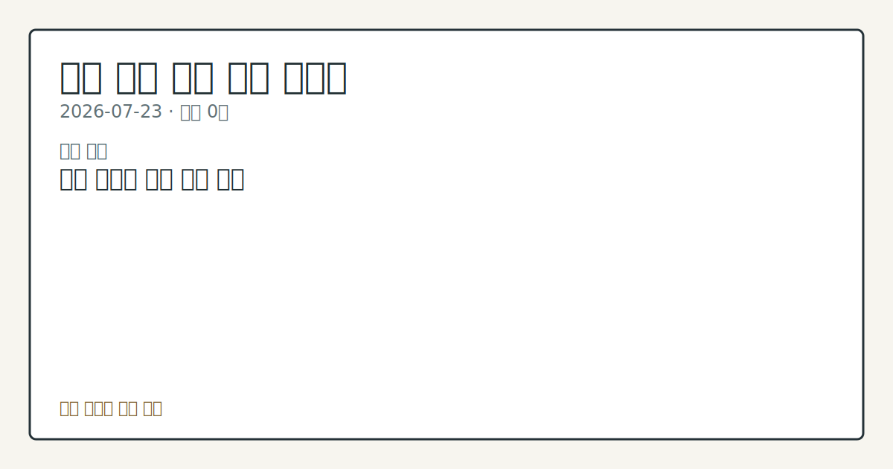

# 2026-07-23 국내 증시 시황
**기준 시각**: 2026-07-23 KST · 수집창 2026-07-22T15:00Z ~ 2026-07-23T15:00Z (종료 미포함)
**세그먼트**: [국내 증시](2026-07-23.md) | [미국 증시](../../../us-equity/2026/07/2026-07-23.md) | [크립토](../../../crypto/2026/07/2026-07-23.md)
<!-- investo:block visual:domestic-equity.visual.curated-context-image -->

*이미지: 큐레이션 시황 이미지 · 출처: 외부 라이선스 이미지 · 생성: investo 0.1.0 · 2026-07-23 UTC*
<!-- /investo:block visual:domestic-equity.visual.curated-context-image -->
> **내 관심 자산 영향**: 데이터 수집 부족으로 매칭 판단 보류 — 추가 수집 후 재평가됩니다.
> **오늘의 결론**: 코스피(KOSPI, 한국 유가증권시장 종합지수)는 383.00, 코스닥(KOSDAQ, 코스닥종합지수)은 199.00을 기록했다. 수집 근거가 제한적입니다
> **핵심 동인**: 코스피·코스닥 시황 코스피는 383.00, 코스닥은 199.00을 기록했다(연합뉴스). 전일 미국증시는 AI 자본지출 우려와 유가 상승 여파로 하락 본문 참고.
> **주의할 점**: 확인 소스: KRX 외국인 순매매 동향(코스피). 코스피 외국인 순매수가 오늘 수준인 +21,359억원 이상으로 유지되면 수급 개선 관찰, 순매도로 본문 참고.
> 정보 제공용 자동 시황이며 매매 권유가 아닙니다.
## 한눈에 보기
코스피는 383.00, 코스닥은 199.00으로 집계됐다.
코스피 외국인 순매수가 +21,359억원으로 집계돼 오늘 수급의 핵심 변수로 부각됐다.
브렌트유가 100달러를 넘어서고 미국채 10년물 금리가 **4.7%**를 돌파해 변동성 변수로 부상 — 본문 §④ 참조.
## ⓪ 오늘의 매크로
**국제 유가** — CFTC WTI crude oil managed_money net +61974 contracts
**미 국채 수익률** — UST curve 2026-07-23: 10Y 4.71%, 2Y10Y +0.34pp
> **크로스마켓 연결 고리**: 유가/지정학 이슈가 여러 자산군의 변동성 연결 고리로 관찰됩니다. / 금리 이벤트가 할인율/달러 경로의 공통 변수로 남아 있습니다.
> **오늘의 큰 그림:** 유가와 지정학 변수가 공통 변수지만, 원/달러와 국내 수급를 먼저 확인해야 합니다.
## ① 요약

<!-- investo:block visual:domestic-equity.visual.data-confidence -->

*이미지: 데이터 신뢰도 · 출처: investo 자체 생성 · 생성: investo 0.1.0 · 2026-07-23 UTC*
<!-- /investo:block visual:domestic-equity.visual.data-confidence -->

<!-- investo:block visual:domestic-equity.visual.market-snapshot -->

*이미지: 시장 스냅샷 · 출처: investo 자체 생성 · 생성: investo 0.1.0 · 2026-07-23 UTC*
<!-- /investo:block visual:domestic-equity.visual.market-snapshot -->

코스피는 383.00, 코스닥은 199.00을 기록했다. 원/달러 환율은 환율 데이터 미수집이다. 전일 미국증시 3대 지수는 인공지능(AI) 자본지출 우려와 유가 상승 여파로 하락 출발했으며, 이는 오늘 국내 개장 심리에 부담 배경으로 관찰된다. 코스피에서는 외국인이 +21,359억원 순매수한 반면 개인은 -22,077억원 순매도해 수급이 엇갈렸다. [혼재]

## ② 전일 핵심 이슈

### 코스피·코스닥 시황

코스피는 383.00, 코스닥은 199.00을 기록했다([연합뉴스](https://www.yna.co.kr/market-plus/all)). 전일 미국증시는 AI 자본지출 우려와 유가 상승 여파로 하락 출발했다([연합뉴스](https://www.yna.co.kr/view/AKR20260723196600009)). 이 흐름은 오늘 국내 개장 심리에 부담을 주는 배경으로 관찰된다.

> **그래서 의미는?** 전일 미국 증시 부담이 국내 개장 심리에 영향을 줄 수 있어 확인이 필요합니다.

## ③ 섹터/수급 동향

### 코스피·코스닥 수급 동향

코스피에서는 외국인이 +21,359억원 순매수, 기관이 +976억원 순매수한 반면 개인은 -22,077억원 순매도, 기타는 -257억원 순매도했다([Naver finance KRX(한국거래소) mirror](https://finance.naver.com/sise/investorDealTrendDay.naver?bizdate=20260723&sosok=01)). 코스닥에서는 외국인 +1,675억원, 기관 +643억원, 기타 +55억원 순매수한 반면 개인은 -2,373억원 순매도했다([Naver finance KRX mirror](https://finance.naver.com/sise/investorDealTrendDay.naver?bizdate=20260723&sosok=02)).

> **그래서 의미는?** 외국인·기관 매수와 개인 매도가 엇갈려 수급 방향을 계속 확인할 필요가 있습니다.

### 반도체 대형주 흐름

삼성전자[005930]는 260,500원(**+0.58%**, +1,500원)을 기록했고, SK하이닉스[000660]는 1,830,000원(**-0.33%**, -6,000원)을 나타냈다([공공데이터포털](https://www.data.go.kr/data/15094808/openapi.do)). 반도체 양대 종목의 등락이 엇갈리며 섹터 내 온도차가 관찰된다.

### 증권업 실적 시즌 개막

KB증권 등 국내 증권사들의 2분기 실적 발표 시즌이 시작됐다. KB·NH 등 대형 증권사가 최대 실적을 예고하면서 실적 랠리에 대한 기대가 형성되고 있다고 보도됐다([연합뉴스](https://www.yna.co.kr/view/AKR20260723173300008)).

## ④ 지표·이벤트

### 유가·미국채 금리 상승

브렌트유 가격이 미·이란 충돌과 홍해 유조선 피격 여파로 약 두 달 만에 100달러를 돌파했다([연합뉴스](https://www.yna.co.kr/view/AKR20260723195252072)). 유가 급등에 따라 미국채 10년물 금리도 **4.7%**를 돌파했다([연합뉴스](https://www.yna.co.kr/view/AKR20260723196200072)).

> **그래서 의미는?** 유가와 미국채 금리 상승이 국내 채권·환율 경로에 어떤 영향을 줄지 점검이 필요합니다.

### 국내 국고채 금리 동향

2분기 깜짝 성장률 발표에도 국고채 금리는 보합권에서 마감했다([연합뉴스](https://www.yna.co.kr/view/AKR20260723159751008)). 다른 집계에서는 국고채 금리가 대체로 하락했으며 3년물은 연 **3.917%**를 기록했다([연합뉴스](https://www.yna.co.kr/view/AKR20260723159700008)).

## ⑤ 주요 종목

### 핵심 대형주 동향

NAVER[035420]는 196,900원(**+2.02%**, +3,900원), 셀트리온[068270]은 170,100원(**-0.87%**, -1,500원), 현대차[005380]는 418,000원을 기록했다([공공데이터포털](https://www.data.go.kr/data/15094808/openapi.do)).

> **그래서 의미는?** NAVER(네이버)·셀트리온·현대차(현대자동차)의 등락이 엇갈려 종목별 흐름 확인이 필요합니다.

### 공시·이벤트 확인 항목

국민성장펀드가 LG디스플레이[034220]에 1조원대 저리대출을 지원했다([연합뉴스](https://www.yna.co.kr/view/AKR20260723190100002)). 미래에셋증권[006800]은 5,024억원 규모의 자사주 소각을 공시했다([연합뉴스](https://www.yna.co.kr/view/AKR20260723178300008)). SK텔레콤[017670]은 계열사 에스케이하이퍼 주식을 3,300억원에 취득했다고 밝혔다([연합뉴스](https://www.yna.co.kr/view/AKR20260723172600008)). IPARK현대산업개발은 2분기 영업이익이 전년 대비 53% 증가한 1,227억원을 기록했다고 밝혔다([연합뉴스](https://www.yna.co.kr/view/AKR20260723171600003)). 동아쏘시오홀딩스[000640]는 자회사 동아제약을 흡수합병한다고 공시했다([연합뉴스](https://www.yna.co.kr/view/AKR20260723168900017)). 한국거래소는 토비스의 네오뷰가 코스닥 시장에 분할 재상장한다고 밝혔으며, 거래는 27일부터 가능하다([연합뉴스](https://www.yna.co.kr/view/AKR20260723177600008)).

### 애프터마켓 변동 확인

동아쏘시오홀딩스[000640]는 애프터마켓에서 10%대 상승을 나타냈다([연합뉴스](https://www.yna.co.kr/view/AKR20260723183600008)). 대원산업[005710]은 애프터마켓에서 12%대 상승을 나타냈다([연합뉴스](https://www.yna.co.kr/view/AKR20260723173000008)). 케이엔알시스템[199430]은 애프터마켓에서 10%대 상승을 나타냈다([연합뉴스](https://www.yna.co.kr/view/AKR20260723167100008)). LX홀딩스[383800]는 애프터마켓에서 10%대 상승을 나타냈다([연합뉴스](https://www.yna.co.kr/view/AKR20260723165900008)). 국도화학[007690]은 애프터마켓에서 10%대 상승을 나타냈다([연합뉴스](https://www.yna.co.kr/view/AKR20260723164100008)).

## ⑥ 오늘의 관전 포인트

<!-- investo:block visual:domestic-equity.visual.watchlist-relevance -->

*이미지: 관심 자산 관련성 · 출처: investo 자체 생성 · 생성: investo 0.1.0 · 2026-07-23 UTC*
<!-- /investo:block visual:domestic-equity.visual.watchlist-relevance -->

> **관전 포인트**: 오늘은 공개 근거가 충분한 관전 신호만 본문에 남겼습니다.

> **데이터 상태**: 제한

수집/품질 진단

> **데이터 상태**: 제한 — 수집 152건 / 소스 5개 / 누락: 없음 · 제한 — 핵심 가격 소스 0건/실패/stale, 본문 결론 신뢰도 낮음
> **소스 카운트**: 수집 대상 7 / 성공 5 / 수집 상세는 진단 섹션에서 확인할 수 있습니다. / 수집 상세는 진단 섹션에서 확인할 수 있습니다. / 수집 상세는 진단 섹션에서 확인할 수 있습니다.
> **소스 등급 분포**: S=2 / A=2 / B=1
> **상세 사유**: 일부 소스 수집 실패, 일부 소스 0건 반환, 핵심 가격 소스 0건
> **소스별 상태**: korea-policy-rss 실패 (수집 불가), fsc-krx-index-price 0건, 정상 5개

## ⑦ 면책조항
본 시황은 일반 정보 제공을 목적으로 자동 생성된 자료이며,
특정 종목·자산에 대한 매매 권유나 투자 자문이 아닙니다.
투자 결정과 그 결과에 대한 책임은 전적으로 본인에게 있으며,
본 시황의 내용에 따라 발생한 손실에 대해 작성자는 일체의 책임을 지지 않습니다.