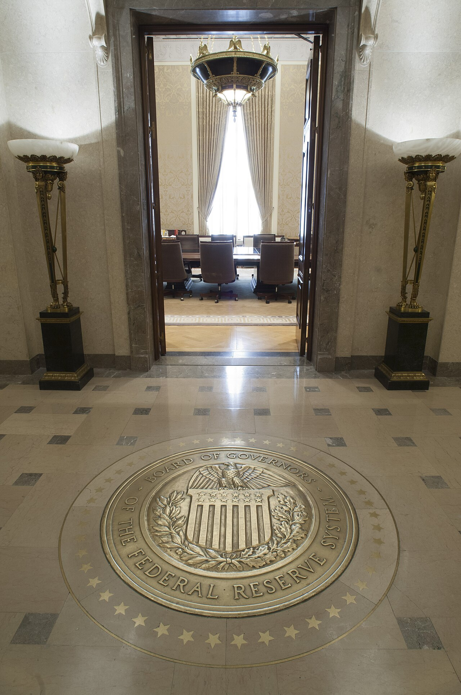
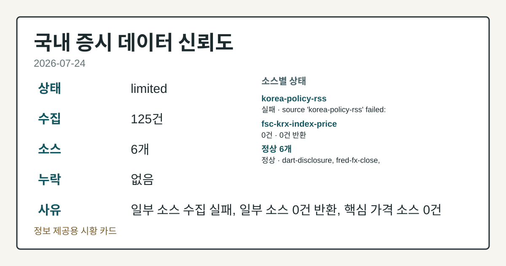
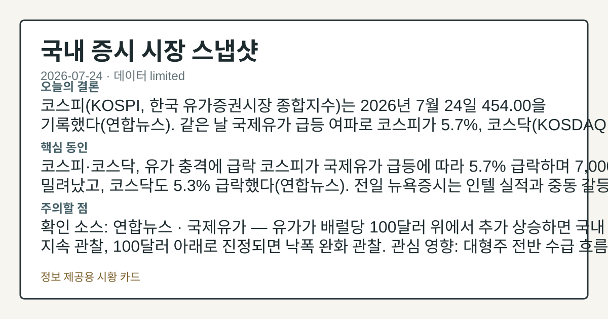
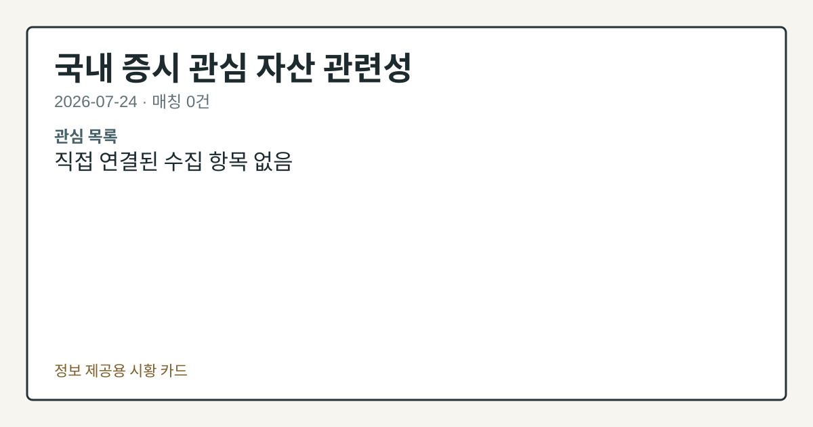

# 2026-07-24 국내 증시 시황
> 정보 제공용 자동 시황이며 매매 권유가 아닙니다.
# 2026-07-24 국내 증시 시황
**기준 시각**: 2026-07-24 KST · 수집창 2026-07-23T15:00Z ~ 2026-07-24T15:00Z (종료 미포함)
| 종목 | 종가 | 변동 | 비고 |
|------|------|------|------|
| KRW=X | 1,489.44 | — | — |
**세그먼트**: [국내 증시](2026-07-24.md) | [미국 증시](../../../us-equity/2026/07/2026-07-24.md) | [크립토](../../../crypto/2026/07/2026-07-24.md)
<!-- investo:block visual:domestic-equity.visual.curated-context-image -->

*이미지: 큐레이션 시황 이미지 · 출처: 외부 라이선스 이미지 · 생성: investo 0.1.0 · 2026-07-26 UTC*
<!-- /investo:block visual:domestic-equity.visual.curated-context-image -->
> **내 관심 자산 영향**: 데이터 수집 부족으로 매칭 판단 보류 — 추가 수집 후 재평가됩니다.
> **용어 가이드**: 이번 시황에서 처음 등장한 용어 — 거래대금(거래총액)
> **오늘의 결론**: 코스피는 2026년 7월 24일 454.00으로 마감했다(연합뉴스). 코스피 관련 정밀 수치는 이번 회차 코어 데이터 미수집으로 확정할 수 없습니다 본문 참고.
> **핵심 동인**: 코스피, 유가발 매도세에 454.00 마감 코스피는 24일 454.00으로 거래를 마쳤다(연합뉴스). 코스피 관련 정밀 수치는 이번 회차 코어 본문 참고.
> **주의할 점**: 확인 소스: FRED · 원/달러 환율이 1,489.44원을 상회해 오르면 원화 약세 압력을 관찰하고, 직전치인 1,478.20원 수준으로 되돌리면 본문 참고.
## 한눈에 보기
코스피(KOSPI, 한국 유가증권시장 종합지수)가 유가 급등 여파로 **-5.7%** 급락하며 7,000선 아래로 밀려났다.
**NAVER**가 **+11.73%** 급등해 220,000원에 마감하며 이날 가장 큰 상승폭을 기록했다.
원/달러 환율이 1,489.44원으로 오르며 환율 부담이 확인된다 — 본문 §④ 참조.
## ⓪ 오늘의 매크로
**FOMC 일정** — 2026-07-29 — FOMC Meeting
**국제 유가** — CFTC WTI crude oil managed_money net +63979 contracts
**미 국채 수익률** — UST curve 2026-07-24: 10Y 4.69%, 2Y10Y +0.36pp
## ⓪-B 채널 기준선
| 기준선 | 값 |
|------|------|
| 코스피 | 미수집 |
| 코스닥 | 미수집 |
| 원/달러 | 1,489.44 (—) |
> **크로스마켓 연결 고리**: 유가/지정학 이슈가 여러 자산군의 변동성 연결 고리로 관찰됩니다. / 금리 이벤트가 할인율/달러 경로의 공통 변수로 남아 있습니다.
> **오늘의 큰 그림:** 금리와 달러 변수가 공통 변수지만, KOSPI·원/달러·외국인 수급를 먼저 확인해야 합니다.
## ① 요약

<!-- investo:block visual:domestic-equity.visual.data-confidence -->

*이미지: 데이터 신뢰도 · 출처: investo 자체 생성 · 생성: investo 0.1.0 · 2026-07-26 UTC*
<!-- /investo:block visual:domestic-equity.visual.data-confidence -->

<!-- investo:block visual:domestic-equity.visual.market-snapshot -->

*이미지: 시장 스냅샷 · 출처: investo 자체 생성 · 생성: investo 0.1.0 · 2026-07-26 UTC*
<!-- /investo:block visual:domestic-equity.visual.market-snapshot -->

코스피는 2026년 7월 24일 454.00으로 마감했다([연합뉴스](https://www.yna.co.kr/view/AKR20260724127200527)). 코스피 관련 정밀 수치는 이번 회차 코어 데이터 미수집으로 확정할 수 없습니다. 코스닥 지수의 정확한 종가 수치는 이번 회차 데이터에 포함되지 않았다. FRED(세인트루이스 연방준비은행 경제데이터) 자료에 따르면 원/달러 환율은 1,489.44원으로 집계돼 직전치 1,478.20원보다 높아졌다([FRED](https://fred.stlouisfed.org/series/DEXKOUS)). 이는 전일 미국 증시의 혼조 마감과 중동발 유가 급등이 국내 시장에도 영향을 미쳤음을 보여준다. 지수는 큰 폭 하락한 반면 삼성전자·SK하이닉스·NAVER·현대차 등 개별 대형주는 상승 마감해 방향성이 엇갈렸다. [혼재]

## ② 전일 핵심 이슈

### 코스피, 유가발 매도세에 454.00 마감

코스피는 24일 454.00으로 거래를 마쳤다([연합뉴스](https://www.yna.co.kr/view/AKR20260724127200527)). 코스피 관련 정밀 수치는 이번 회차 코어 데이터 미수집으로 확정할 수 없습니다. 지난 22일 컨텍스트에서도 중동 갈등에 따른 경계감이 이미 언급된 바 있어, 이번 급락은 해당 리스크가 현실화된 흐름으로 볼 수 있다.

> **그래서 의미는?** 유가 급등에 따른 매도 압력이 지수 전반에 영향을 미쳤는지 확인이 필요합니다.

### 중동발 유가 리스크, 원/달러 환율 경로로 국내 파급

전일 미국 증시는 중동 갈등 등 지정학적 리스크를 소화하며 혼조 마감했다([연합뉴스](https://www.yna.co.kr/view/AKR20260724180100009)). 중동 지역의 지정학적 긴장과 유가 급등은 원/달러 환율 경로를 통해 국내 시장에도 영향을 주는 요인으로, 원/달러 환율은 1,489.44원까지 올라 직전치 1,478.20원보다 높아졌다([FRED](https://fred.stlouisfed.org/series/DEXKOUS)). 이는 국내 수출기업의 원화환산 실적과 외국인 수급에도 연결되는 변수다.

## ③ 섹터/수급 동향

이번 회차 KRX(한국거래소) 투자자별 매매동향에 따르면 코스피에서는 개인이 대규모 순매수를 나타낸 반면 외국인과 기관은 순매도를 나타냈고, 코스닥에서도 개인 순매수와 기관 순매도가 동시에 나타났다([Naver Finance KRX mirror](https://finance.naver.com/sise/investorDealTrendDay.naver?bizdate=20260724&sosok=01)). 같은 날 반도체 대표주인 삼성전자와 SK하이닉스는 각각 상승 마감했다([공공데이터포털](https://www.data.go.kr/data/15094808/openapi.do)).

> **그래서 의미는?** 외국인·기관 매도 속 개인 매수세가 지수 방향에 미치는 영향을 점검할 부분입니다.

### 반도체 섹터: 삼성전자·SK하이닉스 동반 상승

삼성전자 관련 정밀 수치는 이번 회차 코어 데이터 미수집으로 확정할 수 없습니다. SK하이닉스 관련 정밀 수치는 이번 회차 코어 데이터 미수집으로 확정할 수 없습니다. 두 반도체 대형주의 동반 상승은 코스피 급락 국면 속에서도 반도체 업종 자체의 수급은 견조했음을 보여주는 지표로 볼 수 있다.

### 투자자별 수급 동향

| 시장 | 투자자 | 순매수·순매도 | 기준일 |
|---|---|---|---|
| KOSPI | 개인 | +51,782억원 | 2026-07-24 |
| KOSPI | 기관 | -19,514억원 | 2026-07-24 |
| KOSPI | 외국인 | -32,683억원 | 2026-07-24 |
| KOSPI | 기타 | +416억원 | 2026-07-24 |
| KOSDAQ | 개인 | +4,881억원 | 2026-07-24 |
| KOSDAQ | 기관 | -3,580억원 | 2026-07-24 |
| KOSDAQ | 외국인 | -1,315억원 | 2026-07-24 |
| KOSDAQ | 기타 | +14억원 | 2026-07-24 |

(출처: [Naver Finance KRX mirror](https://finance.naver.com/sise/investorDealTrendDay.naver?bizdate=20260724&sosok=01))

코스피에서는 외국인이 -32,683억원 규모로 순매도를 지속했고, 개인이 이를 상당 부분 받아낸 모습이다.

## ④ 지표·이벤트

### 원/달러 환율, 1,489.44원까지 상승

FRED 자료에 따르면 원/달러 환율은 1,489.44원으로 집계됐다. 직전치는 1,478.20원으로, 환율이 이보다 높아진 점이 확인된다([FRED](https://fred.stlouisfed.org/series/DEXKOUS)).

> **그래서 의미는?** 원화 약세와 유가 상승이 겹치면 수입물가·기업 비용 부담으로 이어질 수 있어 확인이 필요합니다.

### 국제유가 급등에 따른 국내 파급: 유가 동결·국고채 금리 상승

정부는 국제유가가 배럴당 100달러를 넘어서자 25일부터 적용되는 8차 석유 최고가격을 동결하기로 했다([연합뉴스](https://www.yna.co.kr/view/AKR20260724136600003)). 같은 날 국고채 금리도 유가 급등 영향으로 일제히 상승해 2년물을 제외한 전 종목이 연고점을 경신했고, 3년물은 연 **3.959%**를 기록했다([연합뉴스](https://www.yna.co.kr/view/AKR20260724144251008), [연합뉴스](https://www.yna.co.kr/view/AKR20260724144200008)).

### 이번 주 예정: ETF 5종목 28일 상장

한국거래소는 마이다스에셋, 삼성액티브, KB, 키움, 하나자산운용의 ETF(상장지수펀드) 총 5종목이 28일 유가증권시장에 상장된다고 밝혔다([연합뉴스](https://www.yna.co.kr/view/AKR20260724150300008)).

## ⑤ 주요 종목

이번 회차 공공데이터포털 시세 및 연합뉴스 기사에서 확인된 주요 종목·이슈를 관전 분류별로 정리했다.

> **그래서 의미는?** NAVER(네이버), 현대차 등 개별 종목 등락이 업종 전반 신호인지 확인이 필요합니다.

### 확인 항목 (가격 변동)

- NAVER[035420] 220,000원 (**+11.73%**, +23,100원) — 고가 220,000원, 저가 203,000원, 거래대금 407,972,313,500원([공공데이터포털](https://www.data.go.kr/data/15094808/openapi.do))
- 셀트리온[068270] 172,200원 (**+1.23%**, +2,100원)(같은 출처)
- 현대차[005380] 432,000원 (같은 출처)

### 실적 발표

- 우리투자증권: 2분기 영업이익이 전년 동기 대비 감소했으나, 상반기 누계 기준으로는 이미 전년 연간 실적을 넘어섰다([연합뉴스](https://www.yna.co.kr/view/AKR20260724132200008)).
- 삼성바이오에피스: 상반기 영업이익 2,306억원을 기록하며 성장세를 이어갔다([연합뉴스](https://www.yna.co.kr/view/AKR20260724126051527)).

### 체크리스트

- 삼천리[004690]: 자회사 성경식품 주식을 500억원에 추가 취득한다고 밝혔다([연합뉴스](https://www.yna.co.kr/view/AKR20260724161600008)).
- 에스에프씨: OLED(유기발광다이오드) 소재업체로, 코스피 상장예비심사를 신청했다([연합뉴스](https://www.yna.co.kr/view/AKR20260724158000008)).
- 코스닥 관련 정밀 수치는 이번 회차 코어 데이터 미수집으로 확정할 수 없습니다.

## ⑥ 오늘의 관전 포인트

<!-- investo:block visual:domestic-equity.visual.watchlist-relevance -->

*이미지: 관심 자산 관련성 · 출처: investo 자체 생성 · 생성: investo 0.1.0 · 2026-07-26 UTC*
<!-- /investo:block visual:domestic-equity.visual.watchlist-relevance -->

> **관전 포인트**: 오늘은 공개 근거가 충분한 관전 신호만 본문에 남겼습니다.

> **데이터 상태**: 제한

수집/품질 진단

> **데이터 상태**: 제한 — 수집 125건 / 소스 6개 / 누락: 없음 · 제한 — 핵심 가격 소스 0건/실패/stale, 본문 결론 신뢰도 낮음
> **소스 카운트**: 수집 대상 8 / 성공 6 / 수집 상세는 진단 섹션에서 확인할 수 있습니다. / 수집 상세는 진단 섹션에서 확인할 수 있습니다. / 수집 상세는 진단 섹션에서 확인할 수 있습니다.
> **소스 등급 분포**: S=3 / A=1 / B=2
> **상세 사유**: 일부 소스 수집 실패, 일부 소스 0건 반환, 핵심 가격 소스 0건
> **소스별 상태**: korea-policy-rss 실패 (수집 불가), fsc-krx-index-price 0건, 정상 6개

## ⑦ 면책조항
본 시황은 일반 정보 제공을 목적으로 자동 생성된 자료이며,
특정 종목·자산에 대한 매매 권유나 투자 자문이 아닙니다.
투자 결정과 그 결과에 대한 책임은 전적으로 본인에게 있으며,
본 시황의 내용에 따라 발생한 손실에 대해 작성자는 일체의 책임을 지지 않습니다.