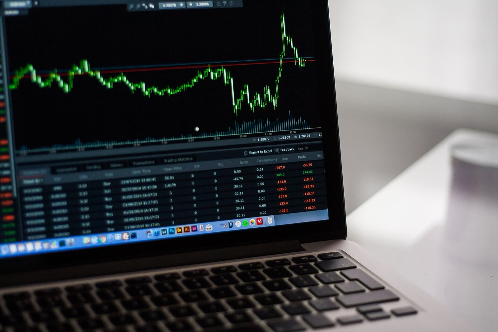
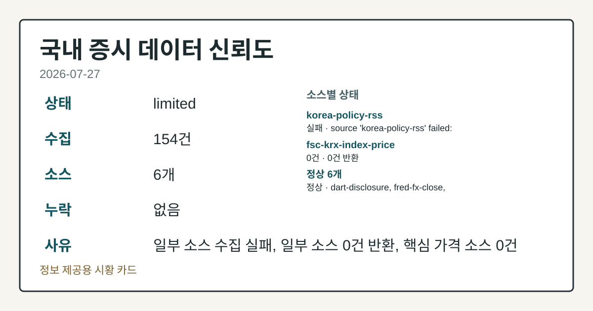
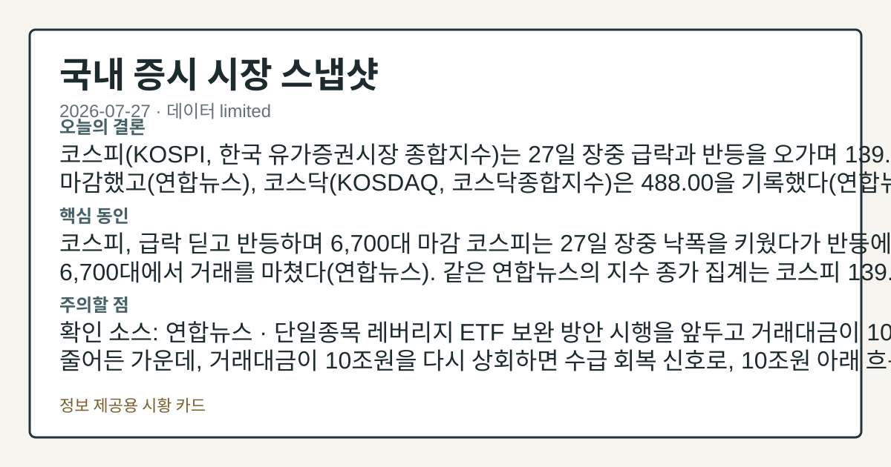
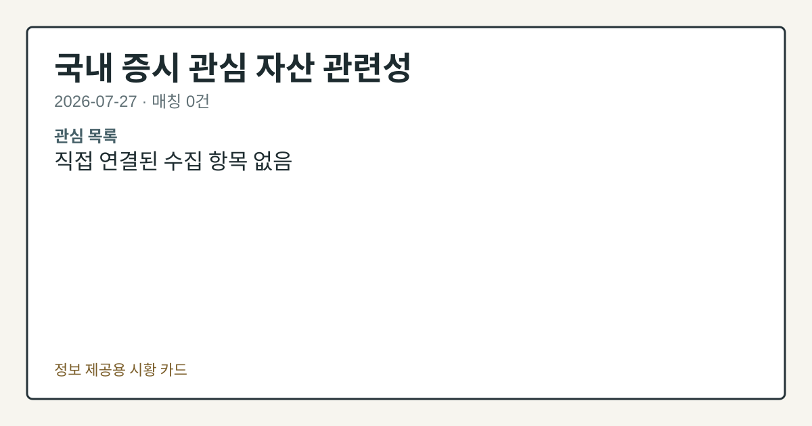

# 2026-07-27 국내 증시 시황
> 정보 제공용 자동 시황이며 매매 권유가 아닙니다.
# 2026-07-27 국내 증시 시황
**기준 시각**: 2026-07-27 KST · 수집창 2026-07-26T15:00Z ~ 2026-07-27T15:00Z (종료 미포함)
| 종목 | 종가 | 변동 | 비고 |
|------|------|------|------|
| ^KOSDAQ | 488.00 | — | — |
| KRW=X | 1,460.76 | — | — |
**세그먼트**: [국내 증시](2026-07-27.md) | [미국 증시](../../../us-equity/2026/07/2026-07-27.md) | [크립토](../../../crypto/2026/07/2026-07-27.md)
<!-- investo:block visual:domestic-equity.visual.curated-context-image -->

*이미지: 큐레이션 시황 이미지 · 출처: 외부 라이선스 이미지 · 생성: investo 0.1.0 · 2026-07-27 UTC*
<!-- /investo:block visual:domestic-equity.visual.curated-context-image -->
> **내 관심 자산 영향**: 데이터 수집 부족으로 매칭 판단 보류 — 추가 수집 후 재평가됩니다.
> **오늘의 결론**: 코스피(KOSPI, 한국 유가증권시장 종합지수)는 27일 장중 급락과 반등을 오가며 139.00으로 마감했고(연합뉴스) 본문 참고.
> **핵심 동인**: 코스피, 급락 딛고 반등하며 6,700대 마감 코스피는 27일 장중 낙폭을 키웠다가 반등에 성공하며 6,700대에서 거래를 마쳤다(연합뉴스). 같은 본문 참고.
> **주의할 점**: 확인 소스: 연합뉴스 · 단일종목 레버리지 ETF 보완 방안 시행을 앞두고 거래대금이 10조원 아래로 줄어든 가운데, 거래대금이 10조원을 다시 본문 참고.
## 한눈에 보기
코스피 관련 정밀 수치는 이번 회차 코어 데이터 미수집으로 확정할 수 없습니다.
코스피 관련 정밀 수치는 이번 회차 코어 데이터 미수집으로 확정할 수 없습니다.
원/달러 환율 1,460.76원, 코스피 외국인 순매도 -28,811억원 — 본문 §③·④ 참조.
## ⓪ 오늘의 매크로
**미 국채 수익률** — UST curve 2026-07-27: 10Y 4.65%, 2Y10Y +0.34pp
## ⓪-B 채널 기준선
| 기준선 | 값 |
|------|------|
| 코스피 | 미수집 |
| 코스닥 | 488.00 (—) |
| 원/달러 | 1,460.76 (—) |
> **크로스마켓 연결 고리**: 금리 이벤트가 할인율/달러 경로의 공통 변수로 남아 있습니다.
> **오늘의 큰 그림:** 금리와 달러 변수가 공통 변수지만, KOSPI·원/달러·외국인 수급를 먼저 확인해야 합니다.
## ① 요약

<!-- investo:block visual:domestic-equity.visual.data-confidence -->

*이미지: 데이터 신뢰도 · 출처: investo 자체 생성 · 생성: investo 0.1.0 · 2026-07-27 UTC*
<!-- /investo:block visual:domestic-equity.visual.data-confidence -->

<!-- investo:block visual:domestic-equity.visual.market-snapshot -->

*이미지: 시장 스냅샷 · 출처: investo 자체 생성 · 생성: investo 0.1.0 · 2026-07-27 UTC*
<!-- /investo:block visual:domestic-equity.visual.market-snapshot -->

코스피는 27일 장중 급락과 반등을 오가며 139.00으로 마감했고([연합뉴스](https://www.yna.co.kr/view/AKR20260727125600527)), 코스닥은 488.00을 기록했다([연합뉴스](https://www.yna.co.kr/view/AKR20260727156000008)). 코스피 관련 정밀 수치는 이번 회차 코어 데이터 미수집으로 확정할 수 없습니다. 원/달러 환율은 1,460.76원으로 전일 1,474.88원 대비 낮아졌다([FRED](https://fred.stlouisfed.org/series/DEXKOUS)). 삼성전자[005930]·SK하이닉스[000660] 등 대형 반도체주가 각각 **-7.59%**, **-8.34%** 급락한 반면 지수는 상승 마감해 대형주 낙폭과 지수 흐름이 엇갈린 하루였다. [변동성 확대]

## ② 전일 핵심 이슈

### 코스피, 급락 딛고 반등하며 6,700대 마감

코스피는 27일 장중 낙폭을 키웠다가 반등에 성공하며 6,700대에서 거래를 마쳤다([연합뉴스](https://www.yna.co.kr/view/AKR20260727121851008)). 같은 연합뉴스의 지수 종가 집계는 코스피 139.00, 코스닥 488.00을 각각 전했다([연합뉴스](https://www.yna.co.kr/view/AKR20260727125600527), [연합뉴스](https://www.yna.co.kr/view/AKR20260727156000008)). 어제 유가발 매도세로 하락 마감했던 흐름과 달리, 오늘은 장중 급락 이후 반등하며 결이 달라졌다. 전일 뉴욕증시가 미국과 이란 간 긴장 완화 소식에 상승 출발했다는 점([연합뉴스](https://www.yna.co.kr/view/AKR20260727166400009))이 이날 국내 개장 심리에 우호적으로 작용한 것으로 관찰된다.

> **그래서 의미는?** 지수는 반등했지만 지정학 리스크가 완전히 해소된 것은 아니라 변동성 점검이 필요합니다.

### 반도체 대형주 급락 속 코스피 상승폭 제한 — CXMT 이슈

[연합뉴스](https://www.yna.co.kr/view/AKR20260727082951008) 보도에 따르면 삼성전자[005930]와 SK하이닉스[000660] 등 국내 주요 반도체 기업이 미국 빅테크와 대규모 협력계획을 발표했음에도, 중국 CXMT의 상장 이슈가 부각되며 코스피 상승폭이 제한됐다. SK하이닉스 관련 정밀 수치는 이번 회차 코어 데이터 미수집으로 확정할 수 없습니다.

### 단일종목 레버리지 ETF(상장지수펀드) 관련 정치권 논의

더불어민주당은 27일 국내 증시 급등락의 원인으로 꼽히는 단일종목 레버리지 ETF에 대해 '몰빵 위험 상품'이라며 용어 사용이 부적절하다는 입장을 밝혔다([연합뉴스](https://www.yna.co.kr/view/AKR20260727141551001), [연합뉴스](https://www.yna.co.kr/view/AKR20260727141500001)). 보완 방안 시행을 앞두고 16개 레버리지 상품의 거래대금이 10조원 아래로 줄었다는 보도도 나왔다([연합뉴스](https://www.yna.co.kr/view/AKR20260727137600008)).

## ③ 섹터/수급 동향

### 코스피·코스닥 투자자별 순매매 동향

| 시장 | 개인 | 기관 | 외국인 | 기타 |
|---|---|---|---|---|
| 코스피 | +19,788억원 | +8,595억원 | -28,811억원 | +427억원 |
| 코스닥 | -1,550억원 | +2,731억원 | -1,422억원 | +241억원 |

([Naver finance KRX mirror](https://finance.naver.com/sise/investorDealTrendDay.naver?bizdate=20260727&sosok=01), [코스닥](https://finance.naver.com/sise/investorDealTrendDay.naver?bizdate=20260727&sosok=02))

> **그래서 의미는?** 외국인은 코스피에서 크게 팔고 개인·기관이 사들이며 수급 주체가 엇갈렸습니다.

### 반도체 대형주 가격 흐름

코스피 관련 정밀 수치는 이번 회차 코어 데이터 미수집으로 확정할 수 없습니다.

## ④ 지표·이벤트

### 원/달러 환율 하락, 국고채 금리도 동반 내림세

원/달러 환율(FRED, 세인트루이스 연은 경제데이터 기준 DEXKOUS)은 1,460.76원으로 전일 1,474.88원 대비 낮아졌다([FRED](https://fred.stlouisfed.org/series/DEXKOUS)). 같은 날 국고채 금리도 미국과 이란 간 긴장 완화 영향으로 일제히 하락해 3년물은 연 **3.865%**를 기록했다([연합뉴스](https://www.yna.co.kr/view/AKR20260727136251008)).

> **그래서 의미는?** 환율과 금리가 동반 하락해 시장의 위험 회피 심리가 다소 완화된 것으로 관찰됩니다.

이억원 금융위원장은 이날 조만간 발표할 부동산 대책과 관련해 가계대출 관리 기조는 유지하되 핀셋지원으로 불편을 해소하겠다는 입장을 밝혔다([연합뉴스](https://www.yna.co.kr/view/AKR20260727153200002)).

## ⑤ 주요 종목

### 관전 분류: 대형 반도체·완성차·플랫폼

삼성전자\[005930\](249,500원, **-7.59%**), SK하이닉스\[000660\](1,759,000원, **-8.34%**), 현대차\[005380\](401,000원, **-7.18%**), NAVER\[035420\](207,500원, **-5.68%**)는 하락했고, 셀트리온\[068270\](177,600원, **+3.14%**)는 상승했다([data.go.kr](https://www.data.go.kr/data/15094808/openapi.do)).

> **그래서 의미는?** 삼성전자(반도체)·현대차(완성차)·NAVER 등 대표주 다수가 하락해 대형주 전반 온도가 낮았습니다.

### 실적 발표 (2분기)

IBK기업은행[024110]은 2분기 순이익 6,895억원(전년 대비 **-0.7%**), 영업이익 9,151억원(**-1.3%**)을 기록했다([연합뉴스](https://www.yna.co.kr/view/AKR20260727134651527), [연합뉴스](https://www.yna.co.kr/view/AKR20260727134600527)). 두산은 2분기 영업이익 4,884억원으로 전년 대비 **+37.8%** 증가했다고 밝혔다([연합뉴스](https://www.yna.co.kr/view/AKR20260727122951527)). 에어부산[298690]은 매출이 늘었음에도 고유가 영향으로 영업손실이 확대됐다([연합뉴스](https://www.yna.co.kr/view/AKR20260727149700051)).

### 확인 항목

위메이드[112040]가 발행한 가상화폐 위믹스(WEMIX)가 해킹 피해를 입어 스테이블코인이 비정상 발행됐다는 보도가 나왔다([연합뉴스](https://www.yna.co.kr/view/AKR20260727148200017)). 에스투더블유\[488280\]([연합뉴스](https://www.yna.co.kr/view/AKR20260727156000008)), 에스앤에스텍\[101490\]([연합뉴스](https://www.yna.co.kr/view/AKR20260727145700008)), 케이씨\[029460\]([연합뉴스](https://www.yna.co.kr/view/AKR20260727138100008))는 애프터마켓에서 10%대 급등을 나타냈다.

## ⑥ 오늘의 관전 포인트

<!-- investo:block visual:domestic-equity.visual.watchlist-relevance -->

*이미지: 관심 자산 관련성 · 출처: investo 자체 생성 · 생성: investo 0.1.0 · 2026-07-27 UTC*
<!-- /investo:block visual:domestic-equity.visual.watchlist-relevance -->

> **관전 포인트**: 오늘은 공개 근거가 충분한 관전 신호만 본문에 남겼습니다.

> **데이터 상태**: 제한

수집/품질 진단

> **데이터 상태**: 제한 — 수집 154건 / 소스 6개 / 누락: 없음 · 제한 — 핵심 가격 소스 0건/실패/stale, 본문 결론 신뢰도 낮음
> **소스 카운트**: 수집 대상 8 / 성공 6 / 수집 상세는 진단 섹션에서 확인할 수 있습니다. / 수집 상세는 진단 섹션에서 확인할 수 있습니다. / 수집 상세는 진단 섹션에서 확인할 수 있습니다.
> **소스 등급 분포**: S=3 / A=1 / B=2
> **상세 사유**: 일부 소스 수집 실패, 일부 소스 0건 반환, 핵심 가격 소스 0건
> **소스별 상태**: korea-policy-rss 실패 (수집 불가), fsc-krx-index-price 0건, 정상 6개

## ⑦ 면책조항
본 시황은 일반 정보 제공을 목적으로 자동 생성된 자료이며,
특정 종목·자산에 대한 매매 권유나 투자 자문이 아닙니다.
투자 결정과 그 결과에 대한 책임은 전적으로 본인에게 있으며,
본 시황의 내용에 따라 발생한 손실에 대해 작성자는 일체의 책임을 지지 않습니다.