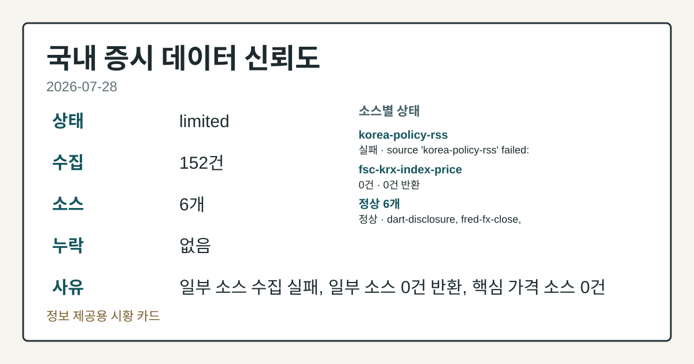
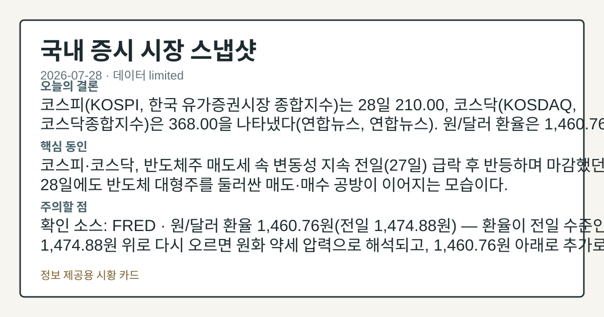
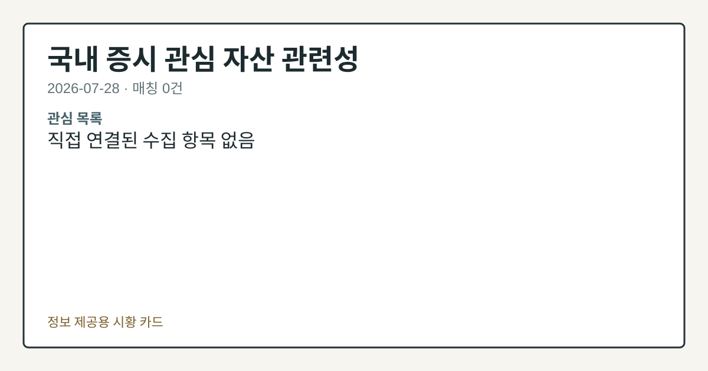

# 2026-07-28 국내 증시 시황
> 정보 제공용 자동 시황이며 매매 권유가 아닙니다.
# 2026-07-28 국내 증시 시황
**기준 시각**: 2026-07-28 KST · 수집창 2026-07-27T15:00Z ~ 2026-07-28T15:00Z (종료 미포함)
| 종목 | 종가 | 변동 | 비고 |
|------|------|------|------|
| ^KOSDAQ | 368.00 | — | — |
| KRW=X | 1,460.76 | — | — |
**세그먼트**: [국내 증시](2026-07-28.md) | [미국 증시](../../../us-equity/2026/07/2026-07-28.md) | [크립토](../../../crypto/2026/07/2026-07-28.md)
<!-- investo:block visual:domestic-equity.visual.curated-context-image -->

*이미지: 큐레이션 시황 이미지 · 출처: 외부 라이선스 이미지 · 생성: investo 0.1.0 · 2026-07-28 UTC*
<!-- /investo:block visual:domestic-equity.visual.curated-context-image -->
> **내 관심 자산 영향**: 데이터 수집 부족으로 매칭 판단 보류 — 추가 수집 후 재평가됩니다.
> **용어 가이드**: 이번 시황에서 처음 등장한 용어 — 시가총액(시장가치)
> **오늘의 결론**: 코스피(KOSPI, 한국 유가증권시장 종합지수)는 28일 210.00, 코스닥(KOSDAQ, 코스닥종합지수)은 368.00을 본문 참고.
> **핵심 동인**: 코스피·코스닥, 반도체주 매도세 속 변동성 지속 전일(27일) 급락 후 반등하며 마감했던 코스피는 28일에도 반도체 대형주를 둘러싼 매도·매수 본문 참고.
> **주의할 점**: 확인 소스: FRED · 원/달러 환율 1,460.76원(전일 1,474.88원) — 환율이 전일 수준인 1,474.88원 위로 다시 오르면 원화 본문 참고.
## 한눈에 보기
코스피 관련 정밀 수치는 이번 회차 코어 데이터 미수집으로 확정할 수 없습니다.
**NAVER**가 이날 **+8.43%**로 225,000원까지 오르며 개별 종목 중 가장 큰 상승폭을 기록했다.
**1,460.76**원/달러 환율과 7월 들어 네 차례 발동된 서킷브레이커 배경 확인 필요 — 본문 §③·§⑥ 참조.
## ⓪ 오늘의 매크로
**FOMC 일정** — 2026-07-29 — FOMC Meeting
**미 국채 수익률** — UST curve 2026-07-28: 10Y 4.61%, 2Y10Y +0.35pp
## ⓪-B 채널 기준선
| 기준선 | 값 |
|------|------|
| 코스피 | 미수집 |
| 코스닥 | 368.00 (—) |
| 원/달러 | 1,460.76 (—) |
> **크로스마켓 연결 고리**: 금리 이벤트가 할인율/달러 경로의 공통 변수로 남아 있습니다.
> **오늘의 큰 그림:** 금리와 달러 변수가 공통 변수지만, KOSPI·원/달러·외국인 수급를 먼저 확인해야 합니다.
## ① 요약

<!-- investo:block visual:domestic-equity.visual.data-confidence -->

*이미지: 데이터 신뢰도 · 출처: investo 자체 생성 · 생성: investo 0.1.0 · 2026-07-28 UTC*
<!-- /investo:block visual:domestic-equity.visual.data-confidence -->

<!-- investo:block visual:domestic-equity.visual.market-snapshot -->

*이미지: 시장 스냅샷 · 출처: investo 자체 생성 · 생성: investo 0.1.0 · 2026-07-28 UTC*
<!-- /investo:block visual:domestic-equity.visual.market-snapshot -->

코스피는 28일 210.00, 코스닥은 368.00을 나타냈다([연합뉴스](https://www.yna.co.kr/view/AKR20260728155400008), [연합뉴스](https://www.yna.co.kr/view/AKR20260728121100008)). 원/달러 환율은 1,460.76원으로 전일 1,474.88원에서 내렸다([FRED](https://fred.stlouisfed.org/series/DEXKOUS)). 코스피 관련 정밀 수치는 이번 회차 코어 데이터 미수집으로 확정할 수 없습니다. 코스피200 변동성지수(VKOSPI)는 급등 후 7거래일 만에 급반등하는 모습을 보였다([연합뉴스](https://www.yna.co.kr/view/AKR20260728065851008)). 삼성전자 관련 정밀 수치는 이번 회차 코어 데이터 미수집으로 확정할 수 없습니다. [변동성 확대]

## ② 전일 핵심 이슈

### 코스피·코스닥, 반도체주 매도세 속 변동성 지속

전일(27일) 급락 후 반등하며 마감했던 코스피는 28일에도 반도체 대형주를 둘러싼 매도·매수 공방이 이어지는 모습이다. 전일 뉴욕증시는 반도체주를 둘러싼 매도 움직임 속에 혼조로 마감했고([연합뉴스](https://www.yna.co.kr/view/AKR20260728174600009)), 일본 언론들도 아시아 반도체 관련주 급락의 배경으로 코스피·닛케이지수의 연동성 강화를 지목했다([연합뉴스](https://www.yna.co.kr/view/AKR20260728172400073)). 삼성전자 관련 정밀 수치는 이번 회차 코어 데이터 미수집으로 확정할 수 없습니다.

> **그래서 의미는?** 미국·일본 반도체주 조정에도 국내 대형 반도체주는 개별 상승, 방향은 엇갈린다.

### 서킷브레이커·변동성 반복

7월 한 달 사이 서킷브레이커가 네 차례 발동되며 국내 증시 변동성이 역대급 수준으로 커졌다는 보도가 나왔다([연합뉴스](https://www.yna.co.kr/view/AKR20260728149200008)). 코스피200 변동성지수도 폭락장 속에 급등했다가 7거래일 만에 급반등했다([연합뉴스](https://www.yna.co.kr/view/AKR20260728065851008)).

## ③ 섹터/수급 동향

코스피에서는 개인이 **+43,152억원** 순매수, 외국인이 **-45,009억원** 순매도, 기관이 **+1,830억원** 순매수를 기록했다([Naver finance KRX mirror](https://finance.naver.com/sise/investorDealTrendDay.naver?bizdate=20260728&sosok=01)). 코스닥에서는 개인 **+480억원**, 기관 **-1,345억원**, 외국인 **+860억원** 순매수·순매도가 각각 나타났다([Naver finance KRX mirror](https://finance.naver.com/sise/investorDealTrendDay.naver?bizdate=20260728&sosok=02)). 삼성전자 관련 정밀 수치는 이번 회차 코어 데이터 미수집으로 확정할 수 없습니다. 같은 날 증권주는 폭락장 속에 줄줄이 하락 마감했다는 특징주 보도가 나왔고([연합뉴스](https://www.yna.co.kr/view/AKR20260728037951008)), 개인이 약 15조원을 순매수한 단일종목 레버리지 상장지수펀드(ETF)는 상장 두 달 만에 상장가 대비 반토막 수준까지 떨어졌다는 보도도 있었다([연합뉴스](https://www.yna.co.kr/view/AKR20260728139700008)).

> **그래서 의미는?** 개인은 코스피를 순매수, 외국인은 대규모 순매도 — 수급 방향이 엇갈린다.

## ④ 지표·이벤트

원/달러 환율은 1,460.76원으로 전일 1,474.88원 대비 내렸다([FRED](https://fred.stlouisfed.org/series/DEXKOUS)). 국고채 금리는 28일 일제히 하락해 3년물이 연 **3.829%**를 기록했다([연합뉴스](https://www.yna.co.kr/view/AKR20260728137151008)). 바이오 기업 인제니아테라퓨틱스는 기업공개(IPO) 공모가를 1만2천원으로 확정했다([연합뉴스](https://www.yna.co.kr/view/AKR20260728135700017)).

> **그래서 의미는?** 환율 하락과 국고채 강세가 겹쳐 안전자산 선호 심리를 확인할 대목이다.

## ⑤ 주요 종목

### 관전 분류 (가격 변동)

- NAVER[035420] 225,000원, **+8.43%**
- SK하이닉스[000660] 1,816,000원, **+3.24%**
- 삼성전자[005930] 254,000원, **+1.80%**
- 셀트리온[068270] 178,700원, **+0.62%**
- 현대차[005380] 403,000원, **+0.50%**

### 실적 발표

- 한미사이언스[008930]는 2분기 영업이익 591억원으로 전년 동기 대비 **70.9%** 증가했다고 공시했다([연합뉴스](https://www.yna.co.kr/view/AKR20260728137700527)).

### 확인 항목 (자본조달·이벤트)

- SK디앤디[210980]는 채무상환자금 등 약 1,400억원 조달을 위한 주주배정 유상증자를 결정했다([연합뉴스](https://www.yna.co.kr/view/AKR20260728155400008)).
- 명인제약[317450]은 애프터마켓에서 10%대 급등 중이라는 보도가 나왔다([연합뉴스](https://www.yna.co.kr/view/AKR20260728142700008)).

> **그래서 의미는?** NAVER(네이버)·SK하이닉스 등 대형주 상승과 한미사이언스(한미사이언스)의 실적 개선이 함께 확인된다.

## ⑥ 오늘의 관전 포인트

<!-- investo:block visual:domestic-equity.visual.watchlist-relevance -->

*이미지: 관심 자산 관련성 · 출처: investo 자체 생성 · 생성: investo 0.1.0 · 2026-07-28 UTC*
<!-- /investo:block visual:domestic-equity.visual.watchlist-relevance -->

> **관전 포인트**: 오늘은 공개 근거가 충분한 관전 신호만 본문에 남겼습니다.

> **데이터 상태**: 제한

수집/품질 진단

> **데이터 상태**: 제한 — 수집 152건 / 소스 6개 / 누락: 없음 · 제한 — 핵심 가격 소스 0건/실패/stale, 본문 결론 신뢰도 낮음
> **소스 카운트**: 수집 대상 8 / 성공 6 / 수집 상세는 진단 섹션에서 확인할 수 있습니다. / 수집 상세는 진단 섹션에서 확인할 수 있습니다. / 수집 상세는 진단 섹션에서 확인할 수 있습니다.
> **소스 등급 분포**: S=3 / A=1 / B=2
> **상세 사유**: 일부 소스 수집 실패, 일부 소스 0건 반환, 핵심 가격 소스 0건
> **소스별 상태**: korea-policy-rss 실패 (일시적 수집 오류), fsc-krx-index-price 0건, 정상 6개

## ⑦ 면책조항
본 시황은 일반 정보 제공을 목적으로 자동 생성된 자료이며,
특정 종목·자산에 대한 매매 권유나 투자 자문이 아닙니다.
투자 결정과 그 결과에 대한 책임은 전적으로 본인에게 있으며,
본 시황의 내용에 따라 발생한 손실에 대해 작성자는 일체의 책임을 지지 않습니다.