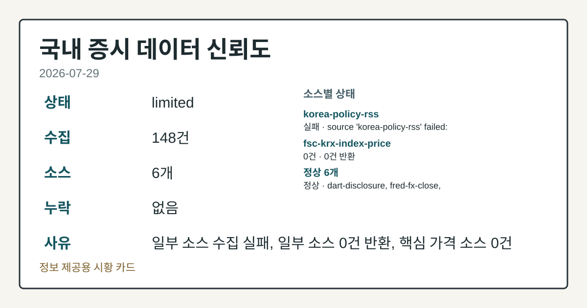
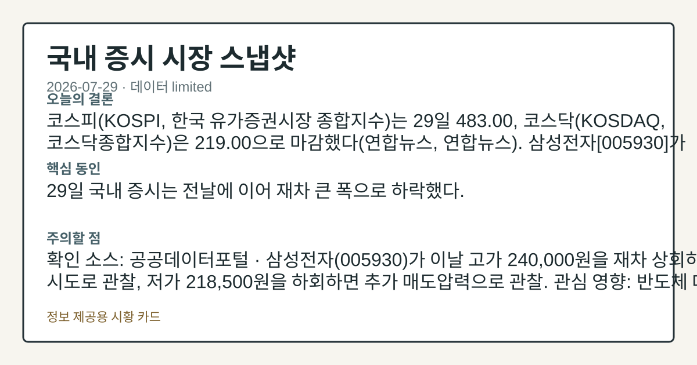
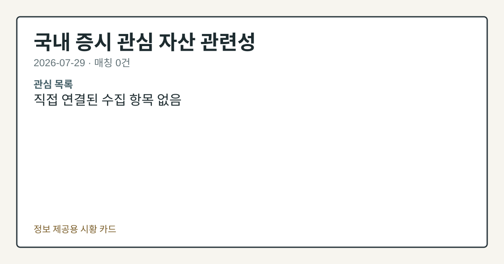

# 2026-07-29 국내 증시 시황
> 정보 제공용 자동 시황이며 매매 권유가 아닙니다.
# 2026-07-29 국내 증시 시황
**기준 시각**: 2026-07-29 KST · 수집창 2026-07-28T15:00Z ~ 2026-07-29T15:00Z (종료 미포함)
| 종목 | 종가 | 변동 | 비고 |
|------|------|------|------|
| KRW=X | 1,460.76 | — | — |
**세그먼트**: [국내 증시](2026-07-29.md) | [미국 증시](../../../us-equity/2026/07/2026-07-29.md) | [크립토](../../../crypto/2026/07/2026-07-29.md)
<!-- investo:block visual:domestic-equity.visual.curated-context-image -->

*이미지: 큐레이션 시황 이미지 · 출처: 외부 라이선스 이미지 · 생성: investo 0.1.0 · 2026-07-29 UTC*
<!-- /investo:block visual:domestic-equity.visual.curated-context-image -->
> **내 관심 자산 영향**: 데이터 수집 부족으로 매칭 판단 보류 — 추가 수집 후 재평가됩니다.
> **오늘의 결론**: 코스피(KOSPI, 한국 유가증권시장 종합지수)는 29일 483.00, 코스닥(KOSDAQ, 코스닥종합지수)은 219.00으로 본문 참고.
> **핵심 동인**: 29일 국내 증시는 전날에 이어 재차 큰 폭으로 하락했다.
> **주의할 점**: 삼성전자 관련 정밀 수치는 이번 회차 코어 데이터 미수집으로 확정할 수 없습니다. 관심 영향: 반도체 대형주 수급 흐름 점검. SK하이닉스 관련 본문 참고.
## 한눈에 보기
코스피 483.00, 코스닥 219.00 마감 — 삼성전자 **-13.39%**, SK하이닉스 **-14.65%**로 반도체 대형주 투매 지속.
**코스피·코스닥**이 사상 최초로 이틀 연속 서킷브레이커가 발동되며 국내 증시 시가총액이 장중 5천조원 아래로 밀렸다.
원/달러 환율 **1,460.76원**(전일 1,474.88원) — 본문 §④ 참조.
## ⓪ 오늘의 매크로
**FOMC 일정** — 2026-07-29 — FOMC Meeting
**미 국채 수익률** — UST curve 2026-07-29: 10Y 4.67%, 2Y10Y +0.45pp
## ⓪-B 채널 기준선
| 기준선 | 값 |
|------|------|
| 코스피 | 미수집 |
| 코스닥 | 미수집 |
| 원/달러 | 1,460.76 (—) |
> **크로스마켓 연결 고리**: 금리 이벤트가 할인율/달러 경로의 공통 변수로 남아 있습니다.
> **오늘의 큰 그림:** 금리와 달러 변수가 공통 변수지만, KOSPI·원/달러·외국인 수급를 먼저 확인해야 합니다.
## ① 요약

<!-- investo:block visual:domestic-equity.visual.data-confidence -->

*이미지: 데이터 신뢰도 · 출처: investo 자체 생성 · 생성: investo 0.1.0 · 2026-07-29 UTC*
<!-- /investo:block visual:domestic-equity.visual.data-confidence -->

<!-- investo:block visual:domestic-equity.visual.market-snapshot -->

*이미지: 시장 스냅샷 · 출처: investo 자체 생성 · 생성: investo 0.1.0 · 2026-07-29 UTC*
<!-- /investo:block visual:domestic-equity.visual.market-snapshot -->

코스피는 29일 483.00, 코스닥은 219.00으로 마감했다([연합뉴스](https://www.yna.co.kr/view/AKR20260729139100008), [연합뉴스](https://www.yna.co.kr/view/AKR20260729153800008)). SK하이닉스 관련 정밀 수치는 이번 회차 코어 데이터 미수집으로 확정할 수 없습니다. 원/달러 환율은 [FRED](https://fred.stlouisfed.org/series/DEXKOUS) 기준 1,460.76원으로 전일치 1,474.88원 대비 낮은 수준을 나타냈다. 전일 미국 증시가 FOMC(연방공개시장위원회) 경계감과 유가 상승 여파로 약세 흐름을 보인 점([연합뉴스](https://www.yna.co.kr/view/AKR20260729185500009))은 이날 국내 반도체주 투매 심리를 더 위축시키는 배경으로 작용했다. [하락 관찰]

## ② 전일 핵심 이슈

29일 국내 증시는 전날에 이어 재차 큰 폭으로 하락했다. 시가총액이 장중 한때 5천조원 아래로 밀렸으며, 코스피·코스닥 양 시장에서 이틀 연속 서킷브레이커가 발동된 것으로 보도됐다([연합뉴스](https://www.yna.co.kr/view/AKR20260729112051008)).

> **그래서 의미는?** 이틀 연속 시장 전체가 급락해 투자심리가 매우 위축된 상태로 확인됩니다.

### 코스피·코스닥, 반도체 투매에 이틀째 급락

코스피는 483.00, 코스닥은 219.00으로 거래를 마쳤다([연합뉴스](https://www.yna.co.kr/view/AKR20260729139100008), [연합뉴스](https://www.yna.co.kr/view/AKR20260729153800008)). 연합뉴스는 SK하이닉스[000660]의 2분기 실적과 컨퍼런스콜 결과에 대한 실망감이 재차 급락의 배경이라고 전했다([연합뉴스](https://www.yna.co.kr/view/AKR20260729100251008)). 아시아 증시 전반에서도 반도체 관련주 투매가 이틀째 이어졌고, 코스피의 연초 이후 상승률이 대만 증시에 역전된 것으로 보도됐다([연합뉴스](https://www.yna.co.kr/view/AKR20260729122651009)).

### 전일 미국 증시 흐름의 국내 영향

전일 미국 증시는 FOMC 경계감과 유가 상승 영향으로 약세 흐름을 보였다([연합뉴스](https://www.yna.co.kr/view/AKR20260729185500009)). 이 같은 대외 불확실성은 환율 경로를 통해 반도체 대형주 위주의 코스피 투매 심리를 심화시킨 요인 중 하나로 관찰된다.

## ③ 섹터/수급 동향

이날 코스피·코스닥 수급은 매매 주체별로 엇갈린 모습을 보였다.

> **그래서 의미는?** 개인은 팔고 기관·외국인 매매는 시장별로 엇갈려 수급 방향이 혼재된 모습입니다.

### 반도체 대형주 흐름

삼성전자[005930]는 220,000원(**-13.39%**, -34,000원)으로 마감했다. 고가 240,000원에서 저가 218,500원까지 낙폭을 키웠다. SK하이닉스[000660]는 1,550,000원으로 마감해 장중 저가와 종가가 같은 수준까지 밀렸다([공공데이터포털](https://www.data.go.kr/data/15094808/openapi.do)). 두 종목 모두 반도체 투매 흐름 속에서 두 자릿수 낙폭을 나타냈다.

### 수급: 개인·기관·외국인·기타

KOSPI에서는 개인이 -19,701억원 순매도, 기관이 +31,769억원 순매수, 기타가 +434억원 순매수, 외국인이 -12,502억원 순매도를 기록했다. KOSDAQ에서는 개인이 -4,579억원 순매도, 기관이 +1,474억원 순매수, 기타가 +23억원 순매수, 외국인이 +3,082억원 순매수를 기록했다([Naver finance KRX mirror](https://finance.naver.com/sise/investorDealTrendDay.naver?bizdate=20260729&sosok=01)). KOSPI에서는 외국인이 순매도, KOSDAQ에서는 외국인이 순매수로 시장별로 엇갈린 흐름을 보였다.

## ④ 지표·이벤트

원/달러 환율과 채권 금리가 이날 주요 지표로 확인됐다.

> **그래서 의미는?** 환율은 전일보다 낮아졌고 국채 금리는 하락해 안전자산 선호가 강해진 모습입니다.

### 원/달러 환율

[FRED](https://fred.stlouisfed.org/series/DEXKOUS)(세인트루이스 연은 경제데이터) 기준 원/달러 환율(DEXKOUS)은 1,460.76원으로, 전일치 1,474.88원 대비 낮은 수준을 나타냈다.

### 채권 시장

증시 급락 속에 국고채가 이틀째 강세(금리 하락)를 이어가며 3년물 금리가 **3.800%**를 기록한 것으로 보도됐다([연합뉴스](https://www.yna.co.kr/view/AKR20260729153651008)).

## ⑤ 주요 종목

이날은 실적 발표와 애프터마켓 급등, 자본거래 공시가 다수 확인됐다.

> **그래서 의미는?** 개별 종목별로 실적·수급 이슈가 갈려 종목 선별 확인이 필요한 구간입니다.

### 가격 변동 확인 종목

- NAVER[035420] 210,000원
- 셀트리온[068270] 177,400원(**-0.73%**, -1,300원)
- 현대차[005380] 364,000원

([공공데이터포털](https://www.data.go.kr/data/15094808/openapi.do))

### 실적 발표

- 크래프톤[259960] — '배틀그라운드', '서브노티카 2' 성과에 힘입어 상반기 기준 역대 최고 실적을 경신했다고 보도됐다([연합뉴스](https://www.yna.co.kr/view/AKR20260729135852527)).
- 한국항공우주산업\[047810\](KAI) — 2분기 영업이익 484억원, 작년 동기 대비 43% 증가([연합뉴스](https://www.yna.co.kr/view/AKR20260729134551527)).
- LG생활건강[051900] — 2분기 영업이익 1천28억원, 작년 동기 대비 **87.6%** 증가([연합뉴스](https://www.yna.co.kr/view/AKR20260729142051527)).
- 주성엔지니어링[036930] — 2분기 영업이익 14억원, 작년 동기 대비 **78.4%** 감소([연합뉴스](https://www.yna.co.kr/view/AKR20260729154000527)).

### 애프터마켓 특이 동향

풀무원[017810], 광주신세계[037710], 금호타이어[073240]가 애프터마켓에서 각각 10%대 급등 중인 것으로 보도됐다([연합뉴스](https://www.yna.co.kr/view/AKR20260729169000008), [연합뉴스](https://www.yna.co.kr/view/AKR20260729156400008), [연합뉴스](https://www.yna.co.kr/view/AKR20260729154500008)).

### 확인 항목

- 풀무원[017810] — 채무상환자금 등 약 400억원 조달을 위한 제3자배정 유상증자 결정 공시([연합뉴스](https://www.yna.co.kr/view/AKR20260729168400008)).
- LG유플러스[032640] — 주주가치 제고를 위해 900억원 규모 자사주 취득 및 배당 결정([연합뉴스](https://www.yna.co.kr/view/AKR20260729165100017)).
- LG, LG유플러스 — 현금·현물배당을 위한 주주명부폐쇄(기준일) 결정 [DART](https://dart.fss.or.kr/dsaf001/main.do?rcpNo=20260729800977)(전자공시시스템) 공시.

## ⑥ 오늘의 관전 포인트

<!-- investo:block visual:domestic-equity.visual.watchlist-relevance -->

*이미지: 관심 자산 관련성 · 출처: investo 자체 생성 · 생성: investo 0.1.0 · 2026-07-29 UTC*
<!-- /investo:block visual:domestic-equity.visual.watchlist-relevance -->

#### 관찰 신호: 연합뉴스 · 국고채 3년물 금리

- 출처: 연합뉴스
- 현재: 연합뉴스
- 확인 조건: 상방 **3.800%**를 상회하면 강세 되돌림 관찰; 하방 국고채 3년물 금리가 **3.800%**를 하회하면 안전자산 선호 강화 관찰
- 신뢰도: 높음
- 관심 영향: 채권-주식 간 자금 이동 점검.

> **데이터 상태**: 제한

수집/품질 진단

> **데이터 상태**: 제한 — 수집 148건 / 소스 6개 / 누락: 없음 · 제한 — 핵심 가격 소스 0건/실패/stale, 본문 결론 신뢰도 낮음
> **소스 카운트**: 수집 대상 8 / 성공 6 / 수집 상세는 진단 섹션에서 확인할 수 있습니다. / 수집 상세는 진단 섹션에서 확인할 수 있습니다. / 수집 상세는 진단 섹션에서 확인할 수 있습니다.
> **소스 등급 분포**: S=3 / A=1 / B=2
> **상세 사유**: 일부 소스 수집 실패, 일부 소스 0건 반환, 핵심 가격 소스 0건
> **소스별 상태**: korea-policy-rss 실패 (수집 불가), fsc-krx-index-price 0건, 정상 6개

## ⑦ 면책조항
본 시황은 일반 정보 제공을 목적으로 자동 생성된 자료이며,
특정 종목·자산에 대한 매매 권유나 투자 자문이 아닙니다.
투자 결정과 그 결과에 대한 책임은 전적으로 본인에게 있으며,
본 시황의 내용에 따라 발생한 손실에 대해 작성자는 일체의 책임을 지지 않습니다.