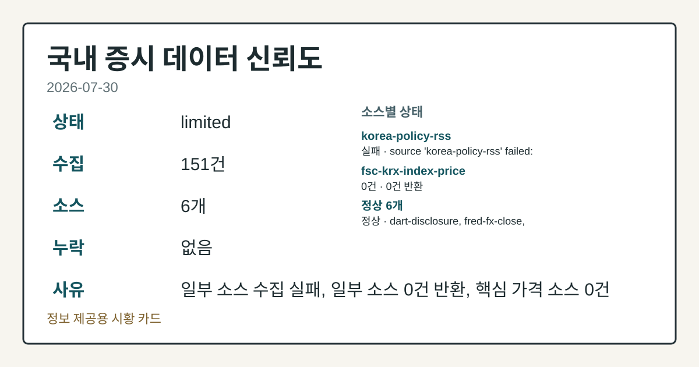
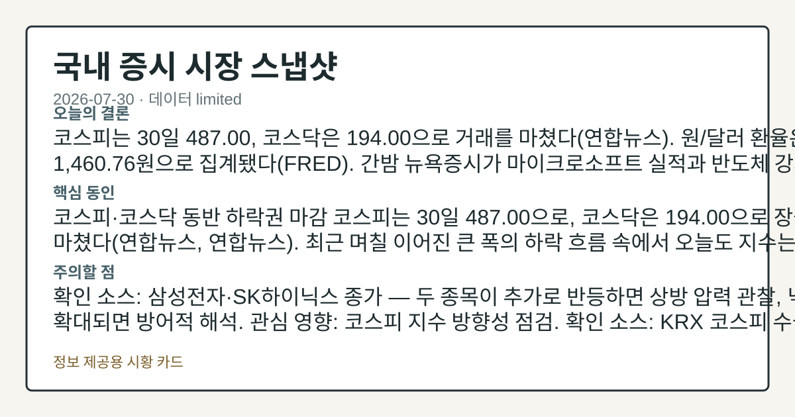
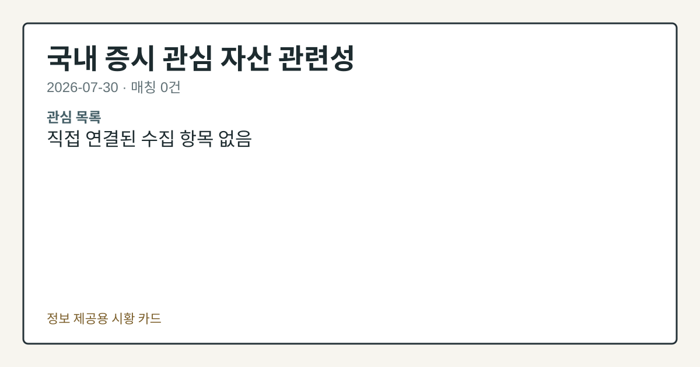

# 2026-07-30 국내 증시 시황
> 정보 제공용 자동 시황이며 매매 권유가 아닙니다.
# 2026-07-30 국내 증시 시황
**기준 시각**: 2026-07-30 KST · 수집창 2026-07-29T15:00Z ~ 2026-07-30T15:00Z (종료 미포함)
| 종목 | 종가 | 변동 | 비고 |
|------|------|------|------|
| KRW=X | 1,460.76 | — | — |
**세그먼트**: [국내 증시](2026-07-30.md) | [미국 증시](../../../us-equity/2026/07/2026-07-30.md) | [크립토](../../../crypto/2026/07/2026-07-30.md)
<!-- investo:block visual:domestic-equity.visual.curated-context-image -->

*이미지: 큐레이션 시황 이미지 · 출처: 외부 라이선스 이미지 · 생성: investo 0.1.0 · 2026-07-30 UTC*
<!-- /investo:block visual:domestic-equity.visual.curated-context-image -->
> **내 관심 자산 영향**: 데이터 수집 부족으로 매칭 판단 보류 — 추가 수집 후 재평가됩니다.
> **오늘의 결론**: 코스피는 30일 487.00, 코스닥은 194.00으로 거래를 마쳤다(연합뉴스). 원/달러 환율은 1,460.76원으로 집계됐다(FRED). 간밤 본문 참고.
> **핵심 동인**: 코스피·코스닥 동반 하락권 마감 코스피는 30일 487.00으로, 코스닥은 194.00으로 장을 마쳤다(연합뉴스, 연합뉴스). 최근 며칠 이어진 큰 본문 참고.
> **주의할 점**: 확인 소스: 삼성전자·SK하이닉스 종가 — 두 종목이 추가로 반등하면 상방 압력 관찰, 낙폭이 재차 확대되면 방어적 해석. 관심 영향: 코스피 지수 본문 참고.
## 한눈에 보기
코스피(KOSPI, 한국 유가증권시장 종합지수) **487.00**·코스닥(KOSDAQ, 코스닥시장 지수) **194.00** 마감, SK하이닉스 본문 참고.
코스피 수급에서 외국인이 +13,280억원 순매수했지만 개인은 -14,309억원 순매도해 수급이 크게 엇갈렸다.
원/달러 환율이 1,460.76원으로 내려서 본문 §④에서 관련 지표를 확인할 수 있다.
## ⓪ 오늘의 매크로
**FOMC 일정** — 2026-08-19 — FOMC Minutes
**미 국채 수익률** — UST curve 2026-07-30: 10Y 4.68%, 2Y10Y +0.45pp
## ⓪-B 채널 기준선
| 기준선 | 값 |
|------|------|
| 코스피 | 미수집 |
| 코스닥 | 미수집 |
| 원/달러 | 1,460.76 (—) |
> **크로스마켓 연결 고리**: 금리 이벤트가 할인율/달러 경로의 공통 변수로 남아 있습니다.
> **오늘의 큰 그림:** 금리와 달러 변수가 공통 변수지만, KOSPI·원/달러·외국인 수급를 먼저 확인해야 합니다.
## ① 요약

<!-- investo:block visual:domestic-equity.visual.data-confidence -->

*이미지: 데이터 신뢰도 · 출처: investo 자체 생성 · 생성: investo 0.1.0 · 2026-07-30 UTC*
<!-- /investo:block visual:domestic-equity.visual.data-confidence -->

<!-- investo:block visual:domestic-equity.visual.market-snapshot -->

*이미지: 시장 스냅샷 · 출처: investo 자체 생성 · 생성: investo 0.1.0 · 2026-07-30 UTC*
<!-- /investo:block visual:domestic-equity.visual.market-snapshot -->

코스피는 30일 **487.00**, 코스닥은 **194.00**으로 거래를 마쳤다([연합뉴스](https://www.yna.co.kr/view/AKR20260730170300527)). 원/달러 환율은 **1,460.76원**으로 집계됐다([FRED](https://fred.stlouisfed.org/series/DEXKOUS)). 삼성전자 관련 정밀 수치는 이번 회차 코어 데이터 미수집으로 확정할 수 없습니다. 코스피에서는 외국인이 +13,280억원 순매수한 반면 개인은 -14,309억원 순매도해 수급이 엇갈렸다. [하락 관찰]

## ② 전일 핵심 이슈

### 코스피·코스닥 동반 하락권 마감

코스피는 30일 **487.00**으로, 코스닥은 **194.00**으로 장을 마쳤다([연합뉴스](https://www.yna.co.kr/view/AKR20260730170300527), [연합뉴스](https://www.yna.co.kr/view/AKR20260730184600008)). 최근 며칠 이어진 큰 폭의 하락 흐름 속에서 오늘도 지수는 해당 수준에서 마감을 확인했다.

> **그래서 의미는?** 지수가 낮아지면 보유 종목 평가액도 함께 줄어들 가능성이 있어 흐름 확인이 필요합니다.

### 뉴욕증시發 훈풍과 반도체주의 엇갈린 반응

간밤 뉴욕증시는 마이크로소프트 실적과 반도체 강세에 힘입어 상승 출발했다([연합뉴스](https://www.yna.co.kr/view/AKR20260730195200009)). 이는 국내 개장 초반 투자심리에 참고 요인으로 작용했으나, 국내 반도체 대형주인 삼성전자[005930]와 SK하이닉스[000660]는 각각 하락 마감해(§③ 참조) 코스피 방향성에는 엇갈린 영향을 남겼다.

### 시민단체, 단일종목 레버리지 정책 비판

경제정의실천시민연합은 코스피가 연이틀 급락한 가운데 정부의 단일종목 레버리지 상장지수펀드(ETF) 관련 정책이 시장 변동성을 키웠다고 비판했다([연합뉴스](https://www.yna.co.kr/view/AKR20260730167000004)).

## ③ 섹터/수급 동향

### 반도체 대형주, 낙폭 확대

삼성전자[005930]는 **208,500원**(**-5.23%**, -11,500원)으로, SK하이닉스[000660]는 **1,401,000원**(**-9.61%**, -149,000원)으로 마감했다([공공데이터포털](https://www.data.go.kr/data/15094808/openapi.do)). 두 대형 반도체주 모두 큰 폭으로 하락해 코스피 하락과 함께 움직인 것으로 확인됐다.

> **그래서 의미는?** 삼성전자·SK하이닉스는 코스피 비중이 커서 두 종목의 하락이 지수 전반에 영향을 줄 수 있습니다.

### 수급: 외국인 순매수, 개인 순매도 엇갈림

한국거래소(KRX) 집계 기준 코스피에서는 외국인이 **+13,280억원** 순매수, 개인이 **-14,309억원** 순매도, 기관이 **+805억원** 순매수, 기타가 **+224억원** 순매수를 각각 기록했다([Naver 금융](https://finance.naver.com/sise/investorDealTrendDay.naver?bizdate=20260730&sosok=01)). 코스닥에서도 외국인이 **+2,483억원** 순매수한 반면 개인은 **-1,108억원**, 기관은 **-1,435억원** 순매도했고 기타는 **+60억원** 순매수했다([Naver 금융](https://finance.naver.com/sise/investorDealTrendDay.naver?bizdate=20260730&sosok=02)).

### 신용거래 관련 신호

'초단기' 미수거래가 다시 증가세로 전환했고 반대매매 규모도 600억원대로 급증한 것으로 전해졌다([연합뉴스](https://www.yna.co.kr/view/AKR20260730166600008)).

## ④ 지표·이벤트

### 원/달러 환율, 하락

원/달러 환율은 **1,460.76원**으로 집계돼 직전 값(1,474.88원) 대비 낮아졌다(출처: [FRED](https://fred.stlouisfed.org/series/DEXKOUS)(세인트루이스 연방준비은행 경제 데이터베이스) DEXKOUS(달러/원 환율 일별 시계열 코드)).

> **그래서 의미는?** 환율 하락은 수입 물가 부담 완화와 외국인 자금 유입 흐름과 함께 살펴볼 지표입니다.

### 금융당국, 레버리지 ETF 추가조치 조기 시행 예고

금융위원회는 지난 29일 발표된 단일종목 레버리지 상장지수펀드(ETF) 추가 보완책을 "최대한 조기에 시행"하겠다고 밝혔다([연합뉴스](https://www.yna.co.kr/view/AKR20260730176300002)).

### 국고채 금리 상승·美 성장률 둔화

국고채 금리는 미국 금리 여파로 일제히 상승해 3년물이 연 **3.831%**를 기록했다([연합뉴스](https://www.yna.co.kr/view/AKR20260730161051008)). 재정경제부는 8월 국고채를 전월 대비 1조원 늘어난 17조원 규모로 발행한다고 밝혔다([연합뉴스](https://www.yna.co.kr/view/AKR20260730179200002)). 미국의 2분기 성장률은 소비와 AI 투자에 힘입어 **1.5%**로 둔화한 것으로 나타났다([연합뉴스](https://www.yna.co.kr/view/AKR20260730190951072)).

## ⑤ 주요 종목

### 실적 발표 종목

LG전자는 2분기 매출과 영업이익 모두 분기 기준 역대 최대치를 기록했으며, 미국 정부 관세 환급 효과가 3천억원 규모로 반영됐다([연합뉴스](https://www.yna.co.kr/view/AKR20260730117753527)). SK이노베이션[096770]은 배터리·윤활유 사업 수익성 개선에 힘입어 2분기 영업이익 3조4,873억원으로 흑자를 확대했다([연합뉴스](https://www.yna.co.kr/view/AKR20260730142802527)). 금호타이어[073240]는 2분기 영업이익이 1,822억원으로 작년 동기 대비 **4%** 증가했고([연합뉴스](https://www.yna.co.kr/view/AKR20260730161751527)), HS효성[487570]은 2분기 영업이익이 358억원으로 작년 동기 대비 **301.7%** 증가했다([연합뉴스](https://www.yna.co.kr/view/AKR20260730170300527)). 대한유화[006650]는 2분기 영업손실이 39억원으로 적자 폭을 줄였다([연합뉴스](https://www.yna.co.kr/view/AKR20260730178900527)).

> **그래서 의미는?** LG전자·SK이노베이션 등 실적 발표는 실제 사업 성과 변화를 보여주는 자료로 참고할 수 있습니다.

### 가격 변동 확인 종목

NAVER[035420]는 **201,500원**(**-4.05%**, -8,500원), 셀트리온[068270]은 **180,000원**(**+1.47%**, +2,600원), 현대차[005380]는 **353,500원**(**-2.88%**, -10,500원)으로 각각 마감했다([공공데이터포털](https://www.data.go.kr/data/15094808/openapi.do)).

### 체크리스트: 수급·상장 관련 항목

최태원 SK그룹 회장은 SK하이닉스 주식 약 48억원어치를 장내매수했다([연합뉴스](https://www.yna.co.kr/view/AKR20260730183051003)). 데브시스터즈[194480], 비츠로넥스텍[488900], 신성에스티[416180]는 애프터마켓에서 10%대 급등을 나타냈고, 네이처셀[007390]은 애프터마켓에서 10%대 급락을 나타냈다([연합뉴스](https://www.yna.co.kr/view/AKR20260730184600008), [연합뉴스](https://www.yna.co.kr/view/AKR20260730176900008), [연합뉴스](https://www.yna.co.kr/view/AKR20260730175900008), [연합뉴스](https://www.yna.co.kr/view/AKR20260730166800008)). 멜콘·래블업·엠비디 등 3개사는 코스닥 상장예비심사를 통과했다([연합뉴스](https://www.yna.co.kr/view/AKR20260730181300008)).

## ⑥ 오늘의 관전 포인트

<!-- investo:block visual:domestic-equity.visual.watchlist-relevance -->

*이미지: 관심 자산 관련성 · 출처: investo 자체 생성 · 생성: investo 0.1.0 · 2026-07-30 UTC*
<!-- /investo:block visual:domestic-equity.visual.watchlist-relevance -->

#### 관찰 신호: SK하이닉스 종

- 출처: 삼성전자
- 현재: 삼성전자·SK하이닉스 종가 — 두 종목이 추가로 반등하면 상방 압력 관찰, 낙폭이 재차 확대되면 방어적 해석. 관심 영향: 코스피 지수 방향성 점검.
- 확인 조건: 상방 SK하이닉스 종가 — 두 종목이 추가로 반등하면 상방 압력 관찰; 하방 낙폭이 재차 확대되면 방어적 해석
- 신뢰도: 보통
- 관심 영향: 코스피 지수 방향성 점검.

> **데이터 상태**: 제한

수집/품질 진단

> **데이터 상태**: 제한 — 수집 151건 / 소스 6개 / 누락: 없음 · 제한 — 핵심 가격 소스 0건/실패/stale, 본문 결론 신뢰도 낮음
> **소스 카운트**: 수집 대상 8 / 성공 6 / 수집 상세는 진단 섹션에서 확인할 수 있습니다. / 수집 상세는 진단 섹션에서 확인할 수 있습니다. / 수집 상세는 진단 섹션에서 확인할 수 있습니다.
> **소스 등급 분포**: S=3 / A=1 / B=2
> **상세 사유**: 일부 소스 수집 실패, 일부 소스 0건 반환, 핵심 가격 소스 0건
> **소스별 상태**: korea-policy-rss 실패 (수집 불가), fsc-krx-index-price 0건, 정상 6개

## ⑦ 면책조항
본 시황은 일반 정보 제공을 목적으로 자동 생성된 자료이며,
특정 종목·자산에 대한 매매 권유나 투자 자문이 아닙니다.
투자 결정과 그 결과에 대한 책임은 전적으로 본인에게 있으며,
본 시황의 내용에 따라 발생한 손실에 대해 작성자는 일체의 책임을 지지 않습니다.