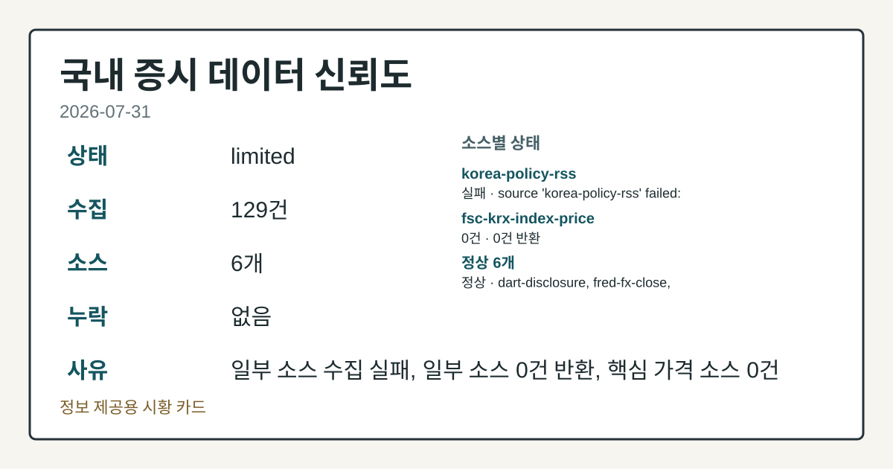
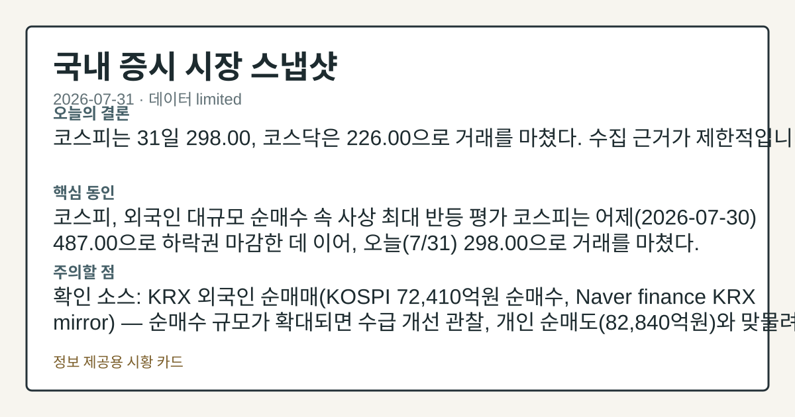
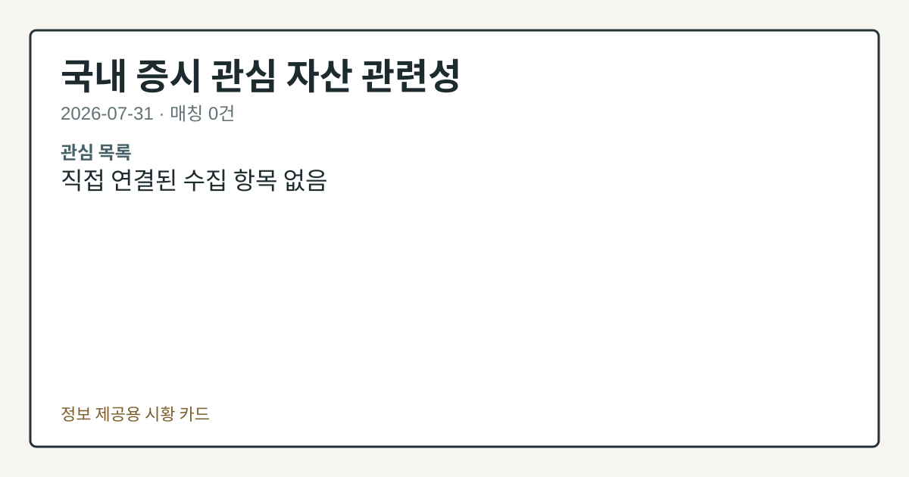

# 2026-07-31 국내 증시 시황
> 정보 제공용 자동 시황이며 매매 권유가 아닙니다.
# 2026-07-31 국내 증시 시황
**기준 시각**: 2026-07-31 KST · 수집창 2026-07-30T15:00Z ~ 2026-07-31T15:00Z (종료 미포함)
| 종목 | 종가 | 변동 | 비고 |
|------|------|------|------|
| KRW=X | 1,460.76 | — | — |
**세그먼트**: [국내 증시](2026-07-31.md) | [미국 증시](../../../us-equity/2026/07/2026-07-31.md) | [크립토](../../../crypto/2026/07/2026-07-31.md)
<!-- investo:block visual:domestic-equity.visual.curated-context-image -->

*이미지: 큐레이션 시황 이미지 · 출처: 외부 라이선스 이미지 · 생성: investo 0.1.0 · 2026-08-01 UTC*
<!-- /investo:block visual:domestic-equity.visual.curated-context-image -->
> **내 관심 자산 영향**: 데이터 수집 부족으로 매칭 판단 보류 — 추가 수집 후 재평가됩니다.
> **용어 가이드**: 이번 시황에서 처음 등장한 용어 — ETF(상장지수펀드)
> **오늘의 결론**: 코스피(KOSPI, 한국 유가증권시장 종합지수)는 31일 298.00으로, 코스닥(KOSDAQ, 중소·벤처기업 중심 시장지수)은 226.00으로 본문 참고.
> **핵심 동인**: 코스피, 외국인 순매수 속 급반등 마감 코스피는 31일 298.00으로 거래를 마쳤다.
> **주의할 점**: 확인 소스: FRED · DEXKOUS 원/달러 환율 — 현재 1,460.76원으로 전일 1,474.88원 대비 하락했으며, 재차 1,474원대로 본문 참고.
## 한눈에 보기
코스피가 298.00, 코스닥이 226.00으로 마감하며 외국인 순매수가 수급을 주도했다.
**코스피**에서 외국인이 +72,410억원 순매수해 하루 기준 최대 규모 매수세를 기록했다.
원/달러 환율이 **1,460.76**원으로 하락 — 본문 §④에서 확인.
## ⓪ 오늘의 매크로
**국제 유가** — CFTC WTI crude oil managed_money net +92943 contracts
**미 국채 수익률** — UST curve 2026-07-31: 10Y 4.75%, 2Y10Y +0.47pp
## ⓪-B 채널 기준선
| 기준선 | 값 |
|------|------|
| 코스피 | 미수집 |
| 코스닥 | 미수집 |
| 원/달러 | 1,460.76 (—) |
> **크로스마켓 연결 고리**: 유가/지정학 이슈가 여러 자산군의 변동성 연결 고리로 관찰됩니다. / 금리 이벤트가 할인율/달러 경로의 공통 변수로 남아 있습니다.
> **오늘의 큰 그림:** 유가와 지정학 변수가 공통 변수지만, 원/달러와 국내 수급를 먼저 확인해야 합니다.
## ① 요약

<!-- investo:block visual:domestic-equity.visual.data-confidence -->

*이미지: 데이터 신뢰도 · 출처: investo 자체 생성 · 생성: investo 0.1.0 · 2026-08-01 UTC*
<!-- /investo:block visual:domestic-equity.visual.data-confidence -->

<!-- investo:block visual:domestic-equity.visual.market-snapshot -->

*이미지: 시장 스냅샷 · 출처: investo 자체 생성 · 생성: investo 0.1.0 · 2026-08-01 UTC*
<!-- /investo:block visual:domestic-equity.visual.market-snapshot -->

코스피는 31일 [298.00](https://www.yna.co.kr/view/AKR20260731140200527)으로, 코스닥은 [226.00](https://www.yna.co.kr/view/AKR20260731158700008)으로 마감했다. 전일 [뉴욕증시가 아마존 실적과 반도체주 강세를 소화하며 혼조 출발](https://www.yna.co.kr/view/AKR20260731174300009)한 흐름이 국내 개장 심리에 우호적으로 작용한 것으로 관찰된다. 원/달러 환율은 1,460.76원으로 전일 1,474.88원 대비 하락했다. [상승 관찰]

## ② 전일 핵심 이슈

### 코스피, 외국인 순매수 속 급반등 마감

코스피는 31일 [298.00](https://www.yna.co.kr/view/AKR20260731140200527)으로 거래를 마쳤다. [연합뉴스는 코스피가 사상 최대 규모로 상승하며 각종 기록이 쏟아졌다고 전했고](https://www.yna.co.kr/view/AKR20260731066151008), [또 다른 기사에서는 최근 국내 증시를 지배했던 급락 이후 18% 가까이 폭등하며 공포 심리가 다소 완화되는 분위기](https://www.yna.co.kr/view/AKR20260731082251008)라고 보도했다. 지난 며칠간 하락 우위였던 흐름(전일까지 연속 하락 마감)에서 뚜렷하게 반전된 하루로, [전일 뉴욕증시가 아마존 실적과 반도체주 강세를 소화하며 혼조 출발](https://www.yna.co.kr/view/AKR20260731174300009)한 점이 국내 개장 심리에 우호적으로 연결된 것으로 관찰된다.

> **그래서 의미는?** 최근 며칠 하락 흐름이 오늘 상승으로 뒤바뀌었고, 미국 시장 분위기도 국내 개장에 우호적으로 작용했습니다.

### JP모간 "디레버리징 막바지" 진단

[JP모간은 6월 중순 이후 한국 증시를 강타한 디레버리징(차입 축소) 과정이 사실상 막바지 국면에 접근했으며 포지션 매력적 국면](https://www.yna.co.kr/view/AKR20260731147800008)이라고 진단했다.

## ③ 섹터/수급 동향

### 코스피·코스닥 수급, 외국인·기관 순매수 주도

KRX(한국거래소) 집계 기준 코스피에서 [외국인이 +72,410억원 순매수](https://finance.naver.com/sise/investorDealTrendDay.naver?bizdate=20260731&sosok=01), [기관이 +11,503억원 순매수](https://finance.naver.com/sise/investorDealTrendDay.naver?bizdate=20260731&sosok=01)한 반면 [개인은 -82,840억원 순매도](https://finance.naver.com/sise/investorDealTrendDay.naver?bizdate=20260731&sosok=01), 기타 투자자는 -1,073억원 순매도를 기록했다. 코스닥에서는 [기관이 +2,985억원 순매수](https://finance.naver.com/sise/investorDealTrendDay.naver?bizdate=20260731&sosok=02), 외국인이 +1,697억원 순매수한 반면 개인은 -4,715억원 순매도했다.

> **그래서 의미는?** 외국인·기관이 사고 개인이 파는 구도가 코스피·코스닥 모두에서 동일하게 나타났습니다.

### 반도체 대형주 동반 약세

삼성전자 관련 정밀 수치는 이번 회차 코어 데이터 미수집으로 확정할 수 없습니다. 코스피 전체 지수는 상승 마감했으나 반도체 대형 양대 종목은 가격 기준 동반 하락한 점이 대비된다.

## ④ 지표·이벤트

### 원/달러 환율 하락, 국고채 금리도 동반 하락

[FRED(세인트루이스 연방준비은행 경제데이터) DEXKOUS(원/달러 환율 시계열) 기준 원/달러 환율은 1,460.76원으로 전일 1,474.88원 대비 하락](https://fred.stlouisfed.org/series/DEXKOUS)했다. 같은 날 [국고채 3년물 금리도 연 **3.758%**로 하락 마감](https://www.yna.co.kr/view/AKR20260731137651008)했다.

> **그래서 의미는?** 원화 가치와 국채 금리가 함께 하락 방향으로 움직인 하루였습니다.

### ETF 신규 상장 및 중복상장 규제 시행 예고

[DB·우리·한화·삼성·NH아문디자산운용이 발행한 ETF(상장지수펀드) 5종목이 내달 4일 유가증권시장에 신규 상장](https://www.yna.co.kr/view/AKR20260731140300008)될 예정이다. 또한 [중복상장 규제가 3%룰 준용을 유지한 채 내달 3일부터 시행](https://www.yna.co.kr/view/AKR20260731153000002)된다.

## ⑤ 주요 종목

### 실적 발표

[효성은 2분기 연결 기준 영업이익 2,316억원으로 전년 대비 **+134%** 증가](https://www.yna.co.kr/view/AKR20260731131051527)했다고 공시했으며, 관련 종목인 [HS효성(487570)은 실적 급증 소식에 10%대 급등 마감](https://www.yna.co.kr/view/AKR20260731049151008)했다. 반면 [SOOP(067160)은 플랫폼·광고 매출 감소와 세무조사 영향으로 2분기 실적이 급감](https://www.yna.co.kr/view/AKR20260731118752527)했다.

> **그래서 의미는?** 효성(효성)·HS효성은 실적 개선, SOOP은 실적 악화로 종목별 명암이 갈렸습니다.

### 확인 항목

[NAVER(035420)는 194,700원으로 **-3.37%** 하락](https://www.data.go.kr/data/15094808/openapi.do)했고, [셀트리온(068270)은 190,000원으로 **+5.56%** 상승](https://www.data.go.kr/data/15094808/openapi.do)했으며, [현대차(005380)는 351,000원으로 **-0.71%** 하락](https://www.data.go.kr/data/15094808/openapi.do)했다. 이 외 [SK㈜는 반도체 웨이퍼 제조사 SK실트론 지분 약 70%를 두산에 2조3천억원에 매각하는 계약을 체결](https://www.yna.co.kr/view/AKR20260731151951003)했고, [노태문 삼성전자 사장은 자사주 7억원어치를 매입](https://www.yna.co.kr/view/AKR20260731149500003)했다고 밝혔다. [DART(전자공시시스템)에는 삼성전자 관련 주식등의대량보유상황보고서(일반)가 접수](https://dart.fss.or.kr/dsaf001/main.do?rcpNo=20260731000779)됐다.

## ⑥ 오늘의 관전 포인트

<!-- investo:block visual:domestic-equity.visual.watchlist-relevance -->

*이미지: 관심 자산 관련성 · 출처: investo 자체 생성 · 생성: investo 0.1.0 · 2026-08-01 UTC*
<!-- /investo:block visual:domestic-equity.visual.watchlist-relevance -->

> **관전 포인트**: 오늘은 공개 근거가 충분한 관전 신호만 본문에 남겼습니다.

> **데이터 상태**: 제한

수집/품질 진단

> **데이터 상태**: 제한 — 수집 157건 / 소스 6개 / 누락: 없음 · 제한 — 핵심 가격 소스 0건/실패/stale, 본문 결론 신뢰도 낮음
> **소스 카운트**: 수집 대상 8 / 성공 6 / 수집 상세는 진단 섹션에서 확인할 수 있습니다. / 수집 상세는 진단 섹션에서 확인할 수 있습니다. / 수집 상세는 진단 섹션에서 확인할 수 있습니다.
> **소스 등급 분포**: S=3 / A=1 / B=2
> **상세 사유**: 일부 소스 수집 실패, 일부 소스 0건 반환, 핵심 가격 소스 0건
> **소스별 상태**: korea-policy-rss 실패 (수집 불가), fsc-krx-index-price 0건, 정상 6개

## ⑦ 면책조항
본 시황은 일반 정보 제공을 목적으로 자동 생성된 자료이며,
특정 종목·자산에 대한 매매 권유나 투자 자문이 아닙니다.
투자 결정과 그 결과에 대한 책임은 전적으로 본인에게 있으며,
본 시황의 내용에 따라 발생한 손실에 대해 작성자는 일체의 책임을 지지 않습니다.