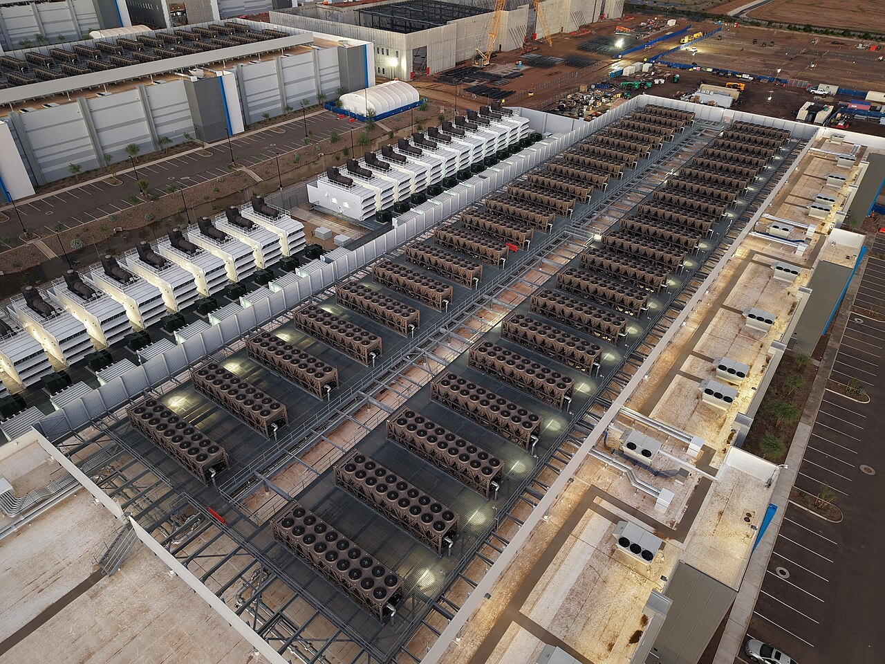

# 2026-08-19 국내 증시 시황
> 정보 제공용 자동 시황이며 매매 권유가 아닙니다.
# 2026-08-19 국내 증시 시황
**기준 시각**: 2026-08-19 KST · 수집창 2026-08-18T15:00Z ~ 2026-08-19T15:00Z (종료 미포함)
| 종목 | 종가 | 변동 | 비고 |
|------|------|------|------|
| ^KOSPI | 6,471.00 | — | — |
| ^KOSDAQ | 824.46 | — | — |
| KRW=X | 1,414.29 | — | — |
**세그먼트**: [국내 증시](2026-08-19.md) | [미국 증시](../../../us-equity/2026/08/2026-08-19.md) | [크립토](../../../crypto/2026/08/2026-08-19.md)
<!-- investo:block visual:domestic-equity.visual.curated-context-image -->

*이미지: 큐레이션 시황 이미지 · 출처: 외부 라이선스 이미지 · 생성: investo 0.1.0 · 2026-08-19 UTC*
<!-- /investo:block visual:domestic-equity.visual.curated-context-image -->
> **내 관심 자산 영향**: 데이터 수집 부족으로 매칭 판단 보류 — 추가 수집 후 재평가됩니다.
> **오늘의 결론**: 코스피(KOSPI, 한국 유가증권시장 종합지수)는 19일 6,471.00으로 마감하며, 글로벌 국채금리 급등과 미국 데이터센터 건설 지연 우려가 본문 참고.
> **핵심 동인**: 코스피 급락과 국채금리발 변동성 확대 — 코스피는 19일 글로벌 국채금리 급등과 미국 데이터센터 건설 지연 우려가 부각되며 **5.8%** 급락해 본문 참고.
> **주의할 점**: 본문 §②·§④ 참조
## 한눈에 보기
코스피가 글로벌 국채금리 급등과 데이터센터 건설 지연 우려로 **5.8%** 급락해 6,471.00에 마감했고, 코스닥도 824.46으로 동반 약세를 보였다.
코스피에서 외국인이 하루 -34,726억원 순매도, 기관도 -13,390억원 순매도해 지수 하락을 이끈 반면 개인은 +46,357억원 순매수로 대응했다.
원/달러 환율 1,414.29원과 국고채 3년물 **3.798%** 흐름이 향후 국내 수급의 변수로 남아있다 — 본문 §③·§④ 참조.
## ⓪ 오늘의 매크로
**FOMC 일정** — 2026-08-19 — FOMC Minutes
**국제 유가** — CFTC WTI crude oil managed_money net +79916 contracts
**미 국채 수익률** — UST curve 2026-08-19: 10Y **4.65%**, 2Y10Y **+0.46pp**
## ⓪-B 채널 기준선
| 기준선 | 값 |
|------|------|
| 코스피 | 6,471.00 (—) |
| 코스닥 | 824.46 (—) |
| 원/달러 | 1,414.29 (—) |
> **크로스마켓 연결 고리**: 유가/지정학 이슈가 여러 자산군의 변동성 연결 고리로 관찰됩니다. / 금리 이벤트가 할인율/달러 경로의 공통 변수로 남아 있습니다.
> **오늘의 큰 그림:** 금리와 달러 변수가 공통 변수지만, KOSPI·원/달러·외국인 수급를 먼저 확인해야 합니다.
## ① 요약

<!-- investo:block visual:domestic-equity.visual.data-confidence -->

*이미지: 데이터 신뢰도 · 출처: investo 자체 생성 · 생성: investo 0.1.0 · 2026-08-19 UTC*
<!-- /investo:block visual:domestic-equity.visual.data-confidence -->

<!-- investo:block visual:domestic-equity.visual.market-snapshot -->

*이미지: 시장 스냅샷 · 출처: investo 자체 생성 · 생성: investo 0.1.0 · 2026-08-19 UTC*
<!-- /investo:block visual:domestic-equity.visual.market-snapshot -->

[코스피는 19일 6,471.00으로 마감](https://www.yna.co.kr/view/AKR20260819127800008)하며, 글로벌 국채금리 급등과 미국 데이터센터 건설 지연 우려가 겹쳐 [**5.8%** 급락](https://www.yna.co.kr/view/AKR20260819127851008)했다. 코스닥(KOSDAQ, 코스닥시장 종합지수)도 [824.46](https://www.yna.co.kr/view/AKR20260819127000008)으로 동반 약세를 나타냈다. 원/달러 환율은 [1,414.29원](https://fred.stlouisfed.org/series/DEXKOUS)으로 전일 1,418.00원 대비 소폭 하락했다. 외국인이 코스피에서 대규모 순매도에 나서며 지수 하락을 주도했다. [하락 관찰]

## ② 전일 핵심 이슈

### 코스피 급락과 국채금리발 변동성 확대

코스피는 19일 글로벌 국채금리 급등과 미국 데이터센터 건설 지연 우려가 부각되며 [**5.8%** 급락](https://www.yna.co.kr/view/AKR20260819127851008)해 6,400대로 밀려났다. 전일(2026-08-18) 6,869.83으로 마감하며 5거래일 연속 상승세가 6거래일 만에 꺾인 데 이어, 오늘 하락폭이 한층 확대된 모습이다. 전일 [뉴욕증시는 미국 재무부의 기습 바이백 소식에 강세로 출발](https://www.yna.co.kr/view/AKR20260819179400009)했으나, 국내 증시는 국채금리발 변동성에 더 민감하게 반응하며 대조적인 하락 흐름을 보였다.

> **그래서 의미는?** 국채금리 급등이 국내 증시 전반의 변동성을 키운 배경으로 확인됩니다.

<!-- investo:block visual:domestic-equity.visual.image-source-card -->
> **📷 오늘의 시장 이미지(원문)**
> 코스피, 글로벌 국채금리·美데이터센터 지연 우려에 **5.8%** 급락\(종합\) — yonhap-market · [원문 보기](https://www.yna.co.kr/view/AKR20260819127851008)
<!-- /investo:block visual:domestic-equity.visual.image-source-card -->

### 국민연금 자산배분 조정 유예와 개인 투심

보건복지부는 국회 업무보고에서 [국민연금의 자산배분 조정 유예가 시장 변동성 때문](https://www.yna.co.kr/view/AKR20260819128451530)이라고 밝혔다. 앞서 지난 18일 코스피가 장중 7천선을 회복했을 당시 [투자자예탁금이 4조원 증가](https://www.yna.co.kr/view/AKR20260819134100008)한 것으로 나타나, 개인 투자자의 매수 여력이 확인된 바 있다.

## ③ 섹터/수급 동향

### 코스피 외국인·기관 순매도, 개인이 매수 우위

KRX(한국거래소) 집계 기준 코스피에서 [외국인은 -34,726억원 순매도](https://finance.naver.com/sise/investorDealTrendDay.naver?bizdate=20260819&sosok=01)를 기록해 지수 하락을 주도했고, [기관도 -13,390억원 순매도](https://finance.naver.com/sise/investorDealTrendDay.naver?bizdate=20260819&sosok=01)했다. 반면 [개인은 +46,357억원 순매수](https://finance.naver.com/sise/investorDealTrendDay.naver?bizdate=20260819&sosok=01)했고, [기타도 +1,759억원 순매수](https://finance.naver.com/sise/investorDealTrendDay.naver?bizdate=20260819&sosok=01)했다.

> **그래서 의미는?** 외국인·기관 매도를 개인이 받아내는 수급 구도가 확인됩니다.

### 코스닥 수급은 기관·외국인 순매수

코스닥에서는 [개인이 -664억원 순매도](https://finance.naver.com/sise/investorDealTrendDay.naver?bizdate=20260819&sosok=02)한 반면, [기관은 +500억원](https://finance.naver.com/sise/investorDealTrendDay.naver?bizdate=20260819&sosok=02), [외국인은 +147억원](https://finance.naver.com/sise/investorDealTrendDay.naver?bizdate=20260819&sosok=02), [기타는 +17억원 순매수](https://finance.naver.com/sise/investorDealTrendDay.naver?bizdate=20260819&sosok=02)해 코스피와 다른 수급 흐름을 보였다.

## ④ 지표·이벤트

### 국고채 금리 하락 전환

주가 급락에 안전자산 선호 심리가 강화되며 [국고채 금리는 일제히 하락](https://www.yna.co.kr/view/AKR20260819145551008)해 [3년물이 연 **3.798%**](https://www.yna.co.kr/view/AKR20260819145500008)를 나타냈다. 최근 급등세를 보이던 금리가 진정되는 흐름이다. 원/달러 환율도 1,414.29원으로 전일 1,418.00원 대비 소폭 하락하며 함께 진정되는 모습을 보였다.

> **그래서 의미는?** 금리 하락은 주식시장 변동성 확대에 따른 안전자산 선호를 보여줍니다.

## ⑤ 주요 종목

### 확인 항목 — 대형주 하락

[NAVER[035420]는 217,000원(**-4.82%**)](https://www.data.go.kr/data/15094808/openapi.do), [셀트리온[068270]은 195,500원(**-2.74%**)](https://www.data.go.kr/data/15094808/openapi.do), [현대차[005380]는 435,000원](https://www.data.go.kr/data/15094808/openapi.do)으로 각각 거래를 마쳐 시장 전반의 하락 흐름과 함께 움직였다.

> **그래서 의미는?** NAVER(네이버)·셀트리온·현대차 등 대형주 약세가 지수 하락에 일부 반영됐습니다.

### 관전 분류 — 애프터마켓 변동

[에이프릴바이오[397030]는 애프터마켓에서 10%대 급락](https://www.yna.co.kr/view/AKR20260819139200008) 중이며, [포스코엠텍[009520]은 애프터마켓에서 11%대 급등](https://www.yna.co.kr/view/AKR20260819137700008) 중인 것으로 나타났다.

### 체크리스트 — 자사주 취득·소각

[SK하이닉스는 40조원 규모 자사주를 취득해 전량 소각](https://www.yna.co.kr/view/AKR20260819129552003)하기로 했다고 밝혀 국내 상장사 중 최대 규모로 확인됐다.

## ⑥ 오늘의 관전 포인트

<!-- investo:block visual:domestic-equity.visual.watchlist-relevance -->

*이미지: 관심 자산 관련성 · 출처: investo 자체 생성 · 생성: investo 0.1.0 · 2026-08-19 UTC*
<!-- /investo:block visual:domestic-equity.visual.watchlist-relevance -->

#### 관찰 신호: NAVER[035420] — 주가

- 출처: 금융위원회 KRX 시세 데이터
- 현재: 금융위원회 KRX 시세 데이터 · NAVER[035420] — 주가가 오늘 저가 214,500원 아래로 이탈하면 추가 하락 압력으로 관찰하고, 오늘 시가 225,500원을 상회 회복하면 낙폭 축소로 해석한다. 관심 영향: 대형 기술주 수급 흐름을 점검한다.
- 확인 조건: 상방 오늘 시가 225,500원을 상회 회복하면 낙폭 축소로 해석한다; 하방 NAVER[035420] — 주가가 오늘 저가 214,500원 아래로 이탈하면 추가 하락 압력으로 관찰하고
- 신뢰도: 높음
- 관심 영향: 대형 기술주 수급 흐름을 점검한다.

> **데이터 상태**: 제한 · 이번 문서는 수집 근거가 제한적입니다. · 수집 상세는 진단 섹션에서 확인할 수 있습니다.

수집/품질 진단

> **데이터 상태**: 제한 — 수집 124건 / 소스 5개 / 누락: 없음 · 제한 — 핵심 가격 소스 0건/실패/stale, 본문 결론 신뢰도 낮음
> **소스 카운트**: 수집 대상 8 / 성공 5 / 0건 1 / 실패 2 / 본문 사용 3
> **소스 등급 분포**: S=2 / A=1 / B=2
> **상세 사유**: 일부 소스 수집 실패, 일부 소스 0건 반환, 핵심 가격 소스 0건
> **소스별 상태**: dart-disclosure 실패 (일시적 수집 오류), korea-policy-rss 실패 (수집 불가), fsc-krx-index-price 0건, 정상 5개

## ⑦ 면책조항
본 시황은 일반 정보 제공을 목적으로 자동 생성된 자료이며,
특정 종목·자산에 대한 매매 권유나 투자 자문이 아닙니다.
투자 결정과 그 결과에 대한 책임은 전적으로 본인에게 있으며,
본 시황의 내용에 따라 발생한 손실에 대해 작성자는 일체의 책임을 지지 않습니다.