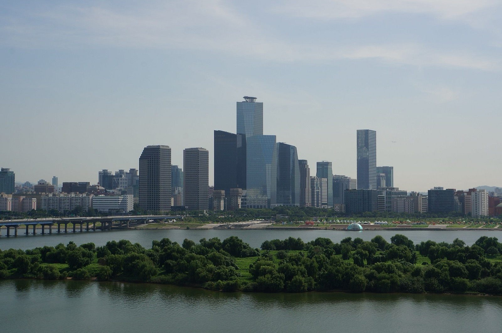

# 2026-08-31 국내 증시 시황
> 정보 제공용 자동 시황이며 매매 권유가 아닙니다.
# 2026-08-31 국내 증시 시황
**기준 시각**: 2026-08-31 KST · 수집창 2026-08-30T15:00Z ~ 2026-08-31T15:00Z (종료 미포함)
| 종목 | 종가 | 변동 | 비고 |
|------|------|------|------|
| ^KOSPI | 6,820.00 | — | — |
| ^KOSDAQ | 834.29 | — | — |
| KRW=X | 1,379.41 | — | — |
**세그먼트**: [국내 증시](2026-08-31.md) | [미국 증시](../../../us-equity/2026/08/2026-08-31.md) | [크립토](../../../crypto/2026/08/2026-08-31.md)
<!-- investo:block visual:domestic-equity.visual.curated-context-image -->

*이미지: 큐레이션 시황 이미지 · 출처: 외부 라이선스 이미지 · 생성: investo 0.1.0 · 2026-09-01 UTC*
<!-- /investo:block visual:domestic-equity.visual.curated-context-image -->
> **내 관심 자산 영향**: 데이터 수집 부족으로 매칭 판단 보류 — 추가 수집 후 재평가됩니다.
> **오늘의 결론**: 코스피는 31일 미국과 이란의 무력공방 재개 소식에 하락 출발했다가 낙폭을 만회하며 반등해 6,820.00으로 마감했고, 코스닥은 834.29를 본문 참고.
> **핵심 동인**: 코스피, 美-이란 무력공방·연준발 불확실성 속 반등 마감 — 간밤 뉴욕증시는 미국과 이란의 무력공방이 재개됐다는 소식에 하락 출발했고(연합뉴스) 본문 참고.
> **주의할 점**: 본문 §②·§④ 참조
## 한눈에 보기
코스피 6,820.00으로 반등 마감, 코스닥 834.29 기록
삼성전자·SK하이닉스, 미국발 변동성 딛고 1%대 상승 마감
외국인이 코스피에서 -6,434억원 순매도 — 수급 흐름은 본문 §③에서 확인 가능
## ⓪ 오늘의 매크로
**FOMC 일정** — 2026-09-16 — FOMC Meeting
**미 국채 수익률** — UST curve 2026-08-31: 10Y **4.75%**, 2Y10Y **+0.41pp**
## ⓪-B 채널 기준선
| 기준선 | 값 |
|------|------|
| 코스피 | 6,820.00 (—) |
| 코스닥 | 834.29 (—) |
| 원/달러 | 1,379.41 (—) |
> **크로스마켓 연결 고리**: 금리 이벤트가 할인율/달러 경로의 공통 변수로 남아 있습니다.
> **오늘의 큰 그림:** 금리와 달러 변수가 공통 변수지만, KOSPI·원/달러·외국인 수급를 먼저 확인해야 합니다.
## ① 요약

<!-- investo:block visual:domestic-equity.visual.data-confidence -->

*이미지: 데이터 신뢰도 · 출처: investo 자체 생성 · 생성: investo 0.1.0 · 2026-09-01 UTC*
<!-- /investo:block visual:domestic-equity.visual.data-confidence -->

<!-- investo:block visual:domestic-equity.visual.market-snapshot -->

*이미지: 시장 스냅샷 · 출처: investo 자체 생성 · 생성: investo 0.1.0 · 2026-09-01 UTC*
<!-- /investo:block visual:domestic-equity.visual.market-snapshot -->

코스피는 31일 미국과 이란의 무력공방 재개 소식에 하락 출발했다가 낙폭을 만회하며 반등해 6,820.00으로 마감했고, 코스닥은 834.29를 기록했다. 원/달러 환율은 1,379.41원으로 전일(1,381.25원) 대비 소폭 하락했다. 연준이 기준금리 인상 가능성을 다시 시사하며 불확실성이 커졌지만 지수는 낙폭을 되돌렸고, 외국인과 기관은 코스피·코스닥 양쪽에서 순매도를 이어갔다. [혼재]

## ② 전일 핵심 이슈

### 코스피, 美-이란 무력공방·연준발 불확실성 속 반등 마감

간밤 뉴욕증시는 미국과 이란의 무력공방이 재개됐다는 소식에 하락 출발했고([연합뉴스](https://www.yna.co.kr/view/AKR20260831183500009)), 이 여파로 31일 국내 증시도 장 초반 하락 출발했다. 그러나 코스피는 낙폭을 만회하며 반등해 **6,820.00**으로 마감했고, 코스닥은 **834.29**로 거래를 마쳤다([연합뉴스](https://www.yna.co.kr/view/AKR20260831083051008)). 미국 연준(Fed, 미국 연방준비제도) 수장이 기준금리 인상 가능성을 다시 시사한 점이 불확실성을 키운 요인으로 지목됐다.

> **그래서 의미는?** 미국발 지정학 리스크와 금리 우려에도 국내 수급이 낙폭을 방어했다는 뜻이다.

<!-- investo:block visual:domestic-equity.visual.image-source-card -->
> **📷 오늘의 시장 이미지(원문)**
> 뉴욕증시, 美-이란 무력공방 재개에 하락 출발 — yonhap-market · [원문 보기](https://www.yna.co.kr/view/AKR20260831183500009)
<!-- /investo:block visual:domestic-equity.visual.image-source-card -->

## ③ 섹터/수급 동향

### 코스피·코스닥 수급, 외국인·기관 순매도 지속

31일 KRX(한국거래소) 집계 기준 코스피에서는 외국인이 -6,434억원, 기관이 -7,891억원 순매도했고 개인도 -1,464억원 순매도했다. 기타 투자자만 +15,790억원 순매수했다([Naver finance](https://finance.naver.com/sise/investorDealTrendDay.naver?bizdate=20260831&sosok=01)). 코스닥에서는 개인이 +2,530억원 순매수한 반면 기관은 -2,005억원, 외국인은 -552억원 순매도했다([Naver finance](https://finance.naver.com/sise/investorDealTrendDay.naver?bizdate=20260831&sosok=02)).

> **그래서 의미는?** 지수는 반등했지만 외국인·기관 자금은 여전히 순유출 상태임을 뜻한다.

### 반도체·2차전지, 미국발 충격 딛고 낙폭 회복

삼성전자 관련 정밀 수치는 이번 회차 코어 데이터 미수집으로 확정할 수 없습니다. 최태원 SK그룹 회장은 일본에 반도체 공장 설립을 검토 중이라고 밝혔으나, SK하이닉스 측은 합작공장 설립설을 부인했다([연합뉴스](https://www.yna.co.kr/view/AKR20260831118651009)). 2차전지 장비주인 코스닥 상장사 필에너지[378340]는 애프터마켓에서 10%대 급등세를 보였다([연합뉴스](https://www.yna.co.kr/view/AKR20260831157800008)).

## ④ 지표·이벤트

### 지수·환율·금리 지표

코스피는 **6,820.00**, 코스닥은 **834.29**로 마감했다([연합뉴스](https://www.yna.co.kr/view/AKR20260831140000008), [연합뉴스](https://www.yna.co.kr/view/AKR20260831133000008)). 원/달러 환율은 FRED(세인트루이스 연방준비은행 경제데이터)·DEXKOUS(원/달러 환율 데이터 시리즈) 기준 **1,379.41**원으로 전일 **1,381.25**원 대비 소폭 하락했다([FRED](https://fred.stlouisfed.org/series/DEXKOUS)). 국고채 금리는 대체로 상승 마감했으며 3년물은 연 **3.838%**를 기록했다([연합뉴스](https://www.yna.co.kr/view/AKR20260831150200008)). 다만 미국 기준금리 인상 가능성이 부각된 오후 들어 국고채 금리 상승폭은 줄었다([연합뉴스](https://www.yna.co.kr/view/AKR20260831150251008)). 코스피 지수선물·옵션 시세표도 함께 발표됐다([연합뉴스](https://www.yna.co.kr/view/AKR20260831147900008)).

> **그래서 의미는?** 환율 하락과 국고채 금리 상승 둔화가 겹쳐, 통화·채권 시장 부담이 다소 완화됐음을 시사한다.

## ⑤ 주요 종목

### 대형주 시세 확인

NAVER(네이버)[035420]는 **220,500원**으로 전일 대비 **+1.85%**(+4,000원) 상승 마감했다. 셀트리온[068270]은 **190,700원**으로 **-0.31%**(-600원) 하락했다. 현대차(현대자동차)[005380]는 **399,500원**으로 **+0.38%**(+1,500원) 상승했다([data.go.kr](https://www.data.go.kr/data/15094808/openapi.do)).

> **그래서 의미는?** NAVER·현대차는 상승, 셀트리온은 소폭 하락해 대형주 간 등락이 엇갈렸음을 보여준다.

### 확인 항목

토스뱅크는 상반기 순이익이 589억원으로 작년 동기 대비 **45.8%** 증가하며 역대 최대치를 기록했다([연합뉴스](https://www.yna.co.kr/view/AKR20260831121100002)). 애프터마켓에서는 디아이[003160]와 모토닉[009680], 휴온스글로벌[084110]이 각각 10%대 급등세를 보였다([연합뉴스](https://www.yna.co.kr/view/AKR20260831161600008), [연합뉴스](https://www.yna.co.kr/view/AKR20260831155400008), [연합뉴스](https://www.yna.co.kr/view/AKR20260831145100008)). SK오션플랜트는 SK그룹에서 자산운용사로 최대주주가 변경되는 매각 절차가 마무리됐다([연합뉴스](https://www.yna.co.kr/view/AKR20260831158351052)).

## ⑥ 오늘의 관전 포인트

<!-- investo:block visual:domestic-equity.visual.watchlist-relevance -->

*이미지: 관심 자산 관련성 · 출처: investo 자체 생성 · 생성: investo 0.1.0 · 2026-09-01 UTC*
<!-- /investo:block visual:domestic-equity.visual.watchlist-relevance -->

#### 관찰 신호: 코스피

- 출처: 연합뉴스 코스피 지수 마감
- 현재: 연합뉴스 코스피 지수 마감 · 코스피가 **6,820.00**을 상회하는 흐름을 유지하면 반등 지속 관찰, 재차 6,800선을 하회하면 되돌림 관찰. 관심 영향: 지수 변동성 확대 여부 점검.
- 확인 조건: 상방 코스피가 **6,820.00**을 상회하는 흐름을 유지하면 반등 지속 관찰; 하방 재차 6,800선을 하회하면 되돌림 관찰
- 신뢰도: 낮음
- 관심 영향: 지수 변동성 확대 여부 점검.

> **데이터 상태**: 제한 · 이번 문서는 수집 근거가 제한적입니다. · 수집 상세는 진단 섹션에서 확인할 수 있습니다.

수집/품질 진단

> **데이터 상태**: 제한 — 수집 110건 / 소스 6개 / 누락: 없음 · 제한 — 핵심 가격 소스 0건/실패/stale, 본문 결론 신뢰도 낮음
> **소스 카운트**: 수집 대상 8 / 성공 6 / 0건 1 / 실패 1 / 본문 사용 3
> **소스 등급 분포**: S=3 / A=1 / B=2
> **상세 사유**: 일부 소스 수집 실패, 일부 소스 0건 반환, 핵심 가격 소스 0건
> **소스별 상태**: korea-policy-rss 실패 (수집 불가), fsc-krx-index-price 0건, 정상 6개

## ⑦ 면책조항
본 시황은 일반 정보 제공을 목적으로 자동 생성된 자료이며,
특정 종목·자산에 대한 매매 권유나 투자 자문이 아닙니다.
투자 결정과 그 결과에 대한 책임은 전적으로 본인에게 있으며,
본 시황의 내용에 따라 발생한 손실에 대해 작성자는 일체의 책임을 지지 않습니다.