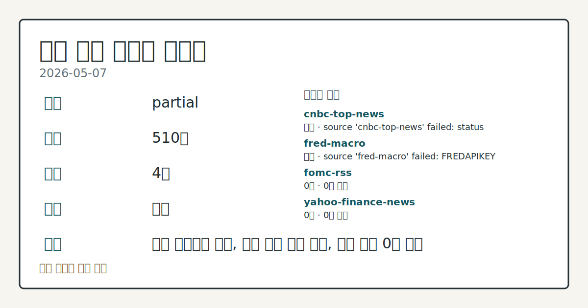
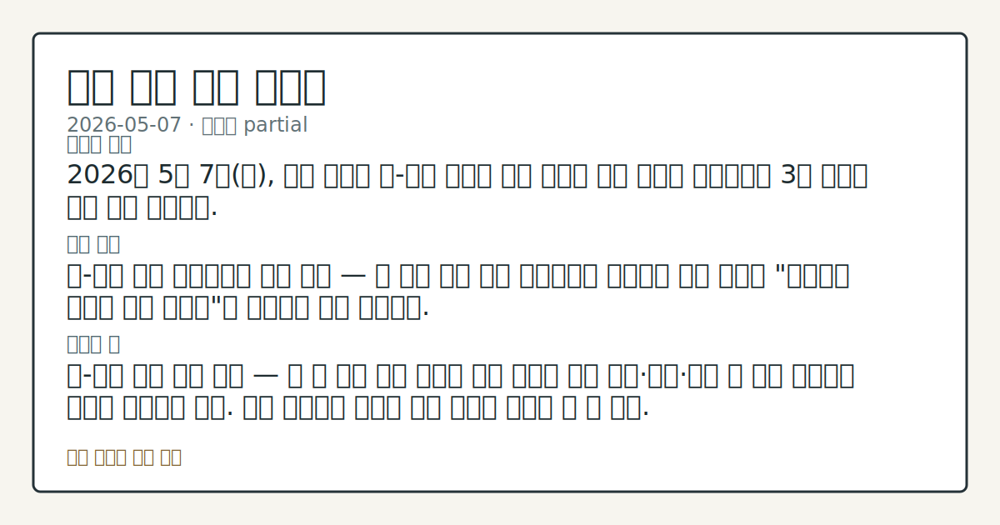
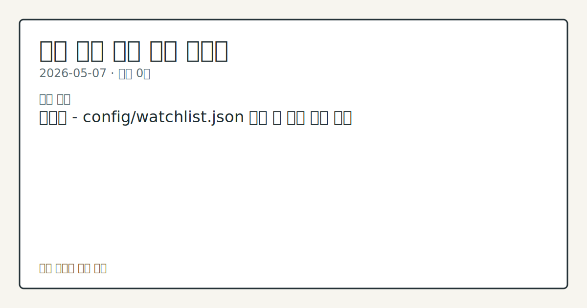

# 2026-05-07 미국 증시 시황

**기준 시각**: 2026-05-07 NY · [2026-05-07T04:00Z, 2026-05-08T04:00Z)

**세그먼트**: [국내 증시](../../../domestic-equity/2026/05/2026-05-07.md) | [미국 증시](2026-05-07.md) | [크립토](../../../crypto/2026/05/2026-05-07.md)

*이미지: 데이터 신뢰도 · 출처: investo 자체 생성 · 생성: investo 0.1.0 · 2026-05-08 UTC*

> **데이터 상태**: 부분 — 수집 510건 / 소스 4개 / 누락: 가격
> **상세 사유**: 가격 카테고리 누락, 일부 소스 수집 실패, 일부 소스 0건 반환
> **소스별 상태**: cnbc-top-news 실패 (source 'cnbc-top-news' failed: status 403 (terminal)), fred-macro 실패 (source 'fred-macro' failed: FRED_API_KEY not set; fred-macro adapter will not run), fomc-rss 0건, yahoo-finance-news 0건, yfinance-price 0건, 정상 3개
> **내 관심 자산 영향**: 관심 목록 미설정 — `config/watchlist.json`을 추가하면 보유 종목 영향이 표시됩니다.
> **오늘의 결론**: 2026년 5월 7일(목), 미국 증시는 미-이란 핵협상 타결 임박에 대한 기대가 후퇴하면서 3대 지수가 모두 하락 마감했다.
> **핵심 동인**: 미-이란 협상 불확실성이 증시 압박 — 장 초반 협상 타결 기대감으로 상승하던 주요 지수는 "평화협정 임박에 대한 의구심"이 퍼지면서 하락 전환했다.
> **주의할 점**: 미-이란 협상 진행 상황 — 장 중 협상 관련 소식이 재차 등장할 경우 유가·달러·주식 간 연동 변동성이 재현될 가능성에 주목. 원유 방향성이 에너지 섹터 전반에 영향을 줄 수 있다.

## ① 요약

*이미지: 시장 스냅샷 · 출처: investo 자체 생성 · 생성: investo 0.1.0 · 2026-05-08 UTC*

2026년 5월 7일(목), 미국 증시는 미-이란 핵협상 타결 임박에 대한 기대가 후퇴하면서 3대 지수가 모두 하락 마감했다. [S&P 500($SPX/SPY)은 -0.38%, 다우존스($DOWI/DIA)는 -0.63%, Nasdaq 100($IUXX/QQQ)은 -0.12%](https://www.nasdaq.com/articles/stocks-fall-doubts-about-imminent-us-iran-peace-deal) 각각 하락했다. 지정학적 불확실성이 재부각되는 가운데 달러는 반등했고, 실적 집중일을 앞두고 시장은 숨 고르기 국면에 진입한 모습이다. 전일(2026-05-06) 시황은 데이터 수집 공백으로 직전 흐름과의 비교가 어려우나, 오늘의 하락은 지정학 이슈라는 구체적인 트리거가 확인된다는 점에서 어제 대비 새로운 국면 진입으로 볼 수 있다.

---

## ② 전일 핵심 이슈

**미-이란 협상 불확실성이 증시 압박** — 장 초반 협상 타결 기대감으로 상승하던 주요 지수는 "[평화협정 임박에 대한 의구심](https://www.nasdaq.com/articles/stocks-fall-doubts-about-imminent-us-iran-peace-deal)"이 퍼지면서 하락 전환했다. June E-mini S&P 선물(ESM26)도 -0.42% 하락하며 현물 약세를 반영했다.

**유가·에너지 시장** — June WTI 원유(CLM26)는 -0.28%, June RBOB 가솔린(RBM26)은 -0.10% 하락 마감했다. 미-이란 협상 낙관론이 [호르무즈 해협 봉쇄 해제 가능성](https://www.nasdaq.com/articles/crude-oil-recovers-us-may-restart-operations-reopen-strait-hormuz)을 선반영하며 원유 공급 우려를 완화시킨 결과다.

**달러 반등** — [달러 인덱스(DXY00)는 +0.14% 상승](https://www.nasdaq.com/articles/dollar-recovers-early-losses-stocks-retreat)했다. 주가 하락에 따른 안전자산 수요 유입과 달러 우호적 지표가 복합 작용했다.

**크립토·규제** — 미 재무부가 [Binance에 대해 제재·자금세탁 관련 모니터링 프로그램 준수](https://www.theblock.co/post/400454/treasury-demands-binance-comply-monitoring-guidelines-1-billion-iran-report)를 요구했다. Binance는 2023년 유죄 인정의 후속 조치로 해당 프로그램 이행 의무를 지닌다.

---

## ③ 섹터/수급 동향

**크립토 ETF 시장 확장** — 21Shares가 [Canton Network를 추종하는 첫 번째 크립토 ETF를 Nasdaq에 상장](https://www.theblock.co/post/400436/crypto-etf-boom-continues-with-debut-of-first-fund-to-track-canton)했다. 크립토 ETF 출시 흐름이 이어지고 있음을 보여 주는 사례다.

**에너지 섹터 혼조** — 원유·가솔린은 지정학 기대감에 소폭 하락한 반면, 천연가스(June NGM26)는 [EIA 주간 재고 증가폭이 예상치를 하회](https://www.nasdaq.com/articles/nat-gas-prices-rebound-smaller-forecast-weekly-storage-build)하면서 +1.43% 반등했다. 공급 타이트 신호에 숏커버링이 유입된 것으로 해석된다.

**농산물 시장** — 금일 집계 대상인 미국 증시 관련 섹터·수급 데이터는 추가적으로 확인되지 않으며, 농산물(소·돼지·옥수수·대두·설탕·코코아·커피·면화) 흐름은 미국 주식 세그먼트 외 영역으로 본 시황에서는 다루지 않는다.

---

## ④ 지표·이벤트

**EIA 천연가스 재고** — 주간 미국 천연가스 재고 증가폭이 시장 예상치를 [하회](https://www.nasdaq.com/articles/nat-gas-prices-rebound-smaller-forecast-weekly-storage-build)한 것으로 EIA가 발표했다. 이 결과가 천연가스 선물의 반등 계기가 됐다.

**호르무즈 해협 관련 동향** — 미국이 호르무즈 해협 재개방 작전을 재개할 수 있다는 보도가 유가 하락의 배경으로 작용했으나, 이란과의 협상 타결 여부는 여전히 불확실한 상태다.

그 밖에 본 세그먼트(미국 증시)에 직접 영향을 준 매크로 지표 발표는 오늘 집계에서 추가로 확인되지 않는다.

---

## ⑤ 주요 종목

**실적 발표 — 장 전(Pre-market)**

| 종목 | 컨센서스 EPS | 전년 동기 EPS |
|------|-------------|-------------|
| [SHEL](https://www.nasdaq.com/market-activity/stocks/shel/earnings) | $1.88 | $1.84 |
| [MCD](https://www.nasdaq.com/market-activity/stocks/mcd/earnings) | $2.74 | $2.67 |
| [HWM](https://www.nasdaq.com/market-activity/stocks/hwm/earnings) | $1.11 | $0.86 |
| [GWW](https://www.nasdaq.com/market-activity/stocks/gww/earnings) | $10.20 | $9.86 |
| [LNG](https://www.nasdaq.com/market-activity/stocks/lng/earnings) | $3.91 | $1.57 |
| [TRGP](https://www.nasdaq.com/market-activity/stocks/trgp/earnings) | $2.55 | $0.91 |
| [VST](https://www.nasdaq.com/market-activity/stocks/vst/earnings) | $2.21 | $0.46 |
| [DDOG](https://www.nasdaq.com/market-activity/stocks/ddog/earnings) | $0.06 | $0.08 |
| [ARGX](https://www.nasdaq.com/market-activity/stocks/argx/earnings) | $5.16 | $2.58 |

**실적 발표 — 장 후(After-hours)**

| 종목 | 컨센서스 EPS | 전년 동기 EPS |
|------|-------------|-------------|
| [GILD](https://www.nasdaq.com/market-activity/stocks/gild/earnings) | $1.89 | $1.81 |
| [MELI](https://www.nasdaq.com/market-activity/stocks/meli/earnings) | $8.78 | $9.74 |
| [MCK](https://www.nasdaq.com/market-activity/stocks/mck/earnings) | $11.56 | $10.12 |
| [NET](https://www.nasdaq.com/market-activity/stocks/net/earnings) | ($0.06) | ($0.11) |
| [ABNB](https://www.nasdaq.com/market-activity/stocks/abnb/earnings) | $0.31 | $0.24 |
| [MNST](https://www.nasdaq.com/market-activity/stocks/mnst/earnings) | $0.53 | $0.47 |
| [CRWV](https://www.nasdaq.com/market-activity/stocks/crwv/earnings) | ($1.17) | ($0.60) |
| [MSI](https://www.nasdaq.com/market-activity/stocks/msi/earnings) | $2.88 | $2.88 |
| [RSG](https://www.nasdaq.com/market-activity/stocks/rsg/earnings) | $1.64 | $1.58 |
| [WPM](https://www.nasdaq.com/market-activity/stocks/wpm/earnings) | $1.15 | $0.55 |
| [MCHP](https://www.nasdaq.com/market-activity/stocks/mchp/earnings) | $0.39 | $0.04 |
| [COIN](https://www.nasdaq.com/market-activity/stocks/coin/earnings) | $0.36 | $1.94 |
| [RKLB](https://www.nasdaq.com/market-activity/stocks/rklb/earnings) | ($0.07) | ($0.12) |

**확인 항목**

- [Rocket Companies(CIK 0001805284)](https://www.sec.gov/Archives/edgar/data/1805284/000180528426000064/0001805284-26-000064-index.htm) — SEC 8-K(Item 2.02) 실적 공시 제출 (2026-05-07)
- [Block(Jack Dorsey)](https://www.theblock.co/post/400500/dorseys-block-raises-full-year-guidance-after-strong-q1-records-173-million-bitcoin-remeasurement-loss) — Q1 실적 발표: 연간 가이던스 상향, Bitcoin 재평가 손실 $173 million 기록. Cash App의 Bitcoin 매출은 전년 대비 -31%

---

## ⑥ 오늘의 관전 포인트

*이미지: 관심 자산 관련성 · 출처: investo 자체 생성 · 생성: investo 0.1.0 · 2026-05-08 UTC*

1. **미-이란 협상 진행 상황** — 장 중 협상 관련 소식이 재차 등장할 경우 유가·달러·주식 간 연동 변동성이 재현될 가능성에 주목. 원유 방향성이 에너지 섹터 전반에 영향을 줄 수 있다.

2. **실적 집중일 결과 해석** — 오늘 장 전·후로 대형주 실적 발표가 집중된다. 특히 LNG·VST·TRGP는 전년 대비 컨센서스가 대폭 높아 기대치 부합 여부가 에너지·유틸리티 섹터 수급에 영향을 줄 수 있다. COIN은 전년($1.94) 대비 컨센서스($0.36)가 크게 낮아져 있어 실제 결과와의 괴리가 관전 포인트다.

3. **크립토 ETF 및 규제 동향** — 21Shares Canton Network ETF의 초기 거래량과 Binance 모니터링 이슈가 크립토 관련 상장주(COIN 포함)의 심리에 미치는 영향을 지켜볼 필요가 있다.

4. **달러 및 안전자산 수요** — DXY00 반등이 지속되는지, 아니면 협상 기대감 복귀로 위험자산 선호가 되살아나는지가 지수 방향성의 단기 분기점이 될 것으로 보인다.

## ⑦ 면책조항
본 시황은 일반 정보 제공을 목적으로 자동 생성된 자료이며,
특정 종목·자산에 대한 매매 권유나 투자 자문이 아닙니다.
투자 결정과 그 결과에 대한 책임은 전적으로 본인에게 있으며,
본 시황의 내용에 따라 발생한 손실에 대해 작성자는 일체의 책임을 지지 않습니다.