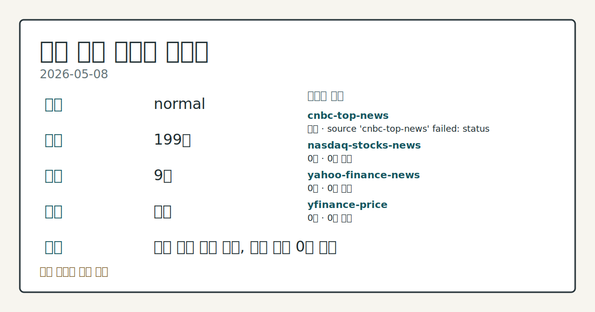
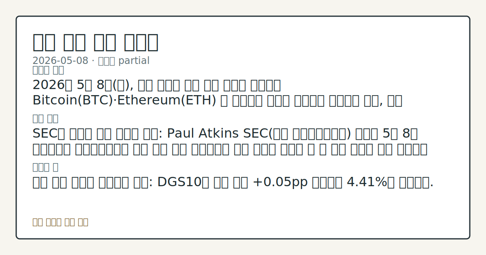
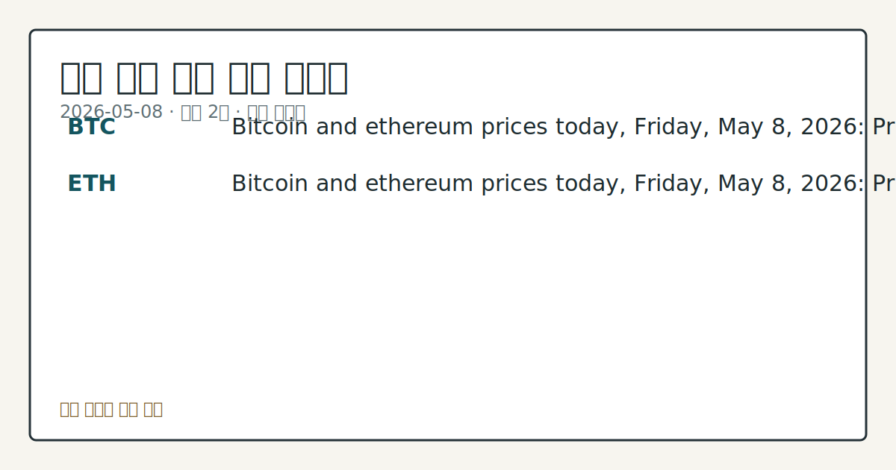

# 2026-05-08 미국 증시 시황

**기준 시각**: 2026-05-08 NY · [2026-05-08T04:00Z, 2026-05-09T04:00Z)

**세그먼트**: [국내 증시](../../../domestic-equity/2026/05/2026-05-08.md) | [미국 증시](2026-05-08.md) | [크립토](../../../crypto/2026/05/2026-05-08.md)

*이미지: 데이터 신뢰도 · 출처: investo 자체 생성 · 생성: investo 0.1.0 · 2026-05-09 UTC*

> **데이터 상태**: 부분 — 수집 154건 / 소스 8개 / 누락: 가격
> **소스 등급 분포**: S=3 / A=4
> **상세 사유**: 가격 카테고리 누락, 일부 소스 수집 실패, 일부 소스 0건 반환
> **소스별 상태**: cnbc-top-news 실패 (source 'cnbc-top-news' failed: status 403 (terminal)), nasdaq-stocks-news 0건, yfinance-price 0건, 정상 7개
> **내 관심 자산 영향**: 2건 확인 (기본 바스켓) — BTC: Bitcoin and ethereum prices today, Friday, May 8, 2026: Prices holding following strong jobs report; ETH: Bitcoin and ethereum prices today, Friday, May 8, 2026: Prices holding following strong jobs report
> **용어 가이드**: 이번 시황에서 처음 등장한 용어 — EPS(주당순이익)
> **오늘의 결론**: 2026년 5월 8일(금), 미국 증시는 강한 고용 지표를 소화하며 Bitcoin(BTC)·Ethereum(ETH) 등 위험자산 가격이 안정세를 유지하는 한편, 국채 10년물 금리(DGS10)가 4.41%로 전일 대비 0.05pp 상승하며 채권 시장에서는 소폭 매도 압력이 나타났다. [데이터부족]
> **핵심 동인**: SEC의 온체인 규제 명확화 추진: Paul Atkins SEC(미국 증권거래위원회) 의장은 5월 8일 소프트웨어 애플리케이션에 대한 기존 규제 프레임워크 적용 방식을 명확히 할 새 규칙 제정을 검토 중이라고 밝혔다.
> **주의할 점**: 금리 상승 압력과 위험자산 내성: DGS10이 전일 대비 +0.05pp 상승하며 4.41%를 기록했다.

## ① 요약

*이미지: 시장 스냅샷 · 출처: investo 자체 생성 · 생성: investo 0.1.0 · 2026-05-09 UTC*

2026년 5월 8일(금), 미국 증시는 강한 고용 지표를 소화하며 Bitcoin(BTC)·Ethereum(ETH) 등 위험자산 가격이 안정세를 유지하는 한편, 국채 10년물 금리(DGS10)가 4.41%로 전일 대비 0.05pp 상승하며 채권 시장에서는 소폭 매도 압력이 나타났다. SEC(미국 증권거래위원회)의 온체인 시장구조 규제 논의와 AI·반도체 종목 실적 집중 속에 개별 종목 변동성은 높은 상태다. 전일(5월 7일) 미-이란 협상 불확실성 압박 이후 고용 호조가 완충 역할을 했으나, 금리 상승과 규제 불확실성이 동시에 부각되는 혼조 흐름이 이어지고 있다. [혼조]

## ② 전일 핵심 이슈

**SEC의 온체인 규제 명확화 추진**: Paul Atkins SEC(미국 증권거래위원회) 의장은 5월 8일 소프트웨어 애플리케이션에 대한 기존 규제 프레임워크 적용 방식을 명확히 할 새 규칙 제정을 검토 중이라고 [밝혔다](https://www.theblock.co/post/400587/sec-weighs-new-rulemaking-for-onchain-market-structures-and-software-applications). 이는 디지털자산과 전통 금융의 경계가 좁아지는 추세를 반영한 조치로, 크립토·핀테크 섹터 전반에 규제 방향성 신호를 제공한다.

**트럼프 행정부 연계 종목의 시장 대비 초과 성과**: [Barron's 보도](https://www.barrons.com/articles/trump-stock-picks-beat-market-intel-88a8bd30?siteid=yhoof2&yptr=yahoo)에 따르면 트럼프 행정부가 선호한 종목군이 전반적으로 시장 대비 초과 수익을 기록 중이며, 그 중 한 종목이 성과 대부분을 견인하고 있다. 정책 기대감과 실적 사이의 간극이 주목된다.

**전일 흐름 연장**: 5월 7일 미-이란 협상 기대 후퇴로 눌렸던 분위기는 강한 고용 지표가 부분적으로 상쇄했으나, 지수 방향성 자체의 결정적 전환 신호는 아직 확인되지 않는다.

## ③ 섹터/수급 동향

**귀금속 — 주간 강세 마감**: [금·은 가격이 긍정적인 고용보고서 발표 이후 주간 기준 상승으로](https://finance.yahoo.com/personal-finance/investing/article/gold-and-silver-prices-today-friday-may-8-prices-headed-for-weekly-gains-following-positive-jobs-report-105332364.html) 마감 중이다. 실물 자산 선호 흐름이 지속되는 가운데 DXY(달러지수) 변동에 따른 귀금속 방향성에 주목할 필요가 있다.

**크립토 — TradFi(전통금융) 통합 가속**: [Consensus 컨퍼런스에서 도출된 7가지 아이디어](https://finance.yahoo.com/markets/crypto/articles/7-ideas-consensus-show-crypto-072000213.html)는 크립토가 전통 금융 구조와 급속히 통합되고 있음을 보여준다. SEC 규제 명확화 움직임과 맞물려 기관 자금의 디지털자산 편입 논의가 확대되는 분위기다.

**에너지 — 심해 개발 프로젝트 재개**: 일본 정부와 백악관의 지원을 받아 멕시코만(Gulf of Mexico) 심해에 대형 원유 수출 허브 건설이 [진행](https://finance.yahoo.com/sectors/energy/articles/oil-developer-sentinel-just-got-070500695.html)되고 있다. 이란 관련 지정학 리스크가 여전히 존재하는 상황에서 에너지 인프라 투자 흐름이 확인된다.

## ④ 지표·이벤트

**국채 금리**: [UST(미국국채) 10년물은 4.38%](https://home.treasury.gov/resource-center/data-chart-center/interest-rates)(2026-05-08 기준), 2Y10Y 스프레드(장단기 금리 역전 해소 폭)는 +0.48pp로 정상화 흐름 지속. FRED(미국연방준비제도경제데이터) 기준 [DGS10은 4.41%](https://fred.stlouisfed.org/series/DGS10)로 전일 4.36% 대비 +0.05pp 상승, [30년물은 4.95%](https://home.treasury.gov/resource-center/data-chart-center/interest-rates).

**정책금리**: [DFF(연방기금 실효금리)](https://fred.stlouisfed.org/series/DFF) 3.63%로 전일 3.64% 대비 소폭 하락. Federal Reserve(미 연방준비제도)의 금리 경로 기대는 크게 변동 없음.

**고용**: [UNRATE(실업률)](https://fred.stlouisfed.org/series/UNRATE) 4.3%로 전월과 동일. 고용시장의 회복력이 확인되며 위험자산에 지지 요인으로 작용.

**환율**: [DEXKOUS(원달러 환율)](https://fred.stlouisfed.org/series/DEXKOUS) 1,477.22원으로 전일 1,477.93원 대비 -0.71원 소폭 절상.

**Federal Reserve 은행 승인**: [Columbia Bank MHC 및 Columbia Financial 관련 신청 승인](https://www.federalreserve.gov/newsevents/pressreleases/orders20260508a.htm)이 이루어졌으나 시장 전반에 미치는 영향은 제한적이다.

**향후 BEA(미국경제분석국) 주요 발표 일정**:
- 2026-05-28: [GDP 2차 속보치 및 기업이익 (2026년 1분기)](https://www.bea.gov/news/schedule)
- 2026-05-28: [개인소득·지출 (2026년 4월)](https://www.bea.gov/news/schedule)
- 2026-06-09: [국제무역수지 (2026년 4월)](https://www.bea.gov/news/schedule)

## ⑤ 주요 종목

**실적 발표 종목 (2026-05-08)**

| 티커 | 회사명 | 발표 시점 | EPS 예상 |
|------|--------|----------|---------|
| ENB | Enbridge Inc | 장전 | $0.69 |
| BAM | Brookfield Asset Management | 장전 | $0.39 |
| AU | AngloGold Ashanti PLC | 장전 | $2.21 |
| FIS | Fidelity National Information Services | 장전 | $1.28 |
| PPL | PPL Corporation | 장전 | $0.61 |
| OSK | Oshkosh Corporation | 장전 | $1.04 |
| FLR | Fluor Corporation | 장전 | $0.66 |
| WULF | TeraWulf Inc. | 장전 | ($0.16) |
| UI | Ubiquiti Inc. | 미정 | $3.15 |
| SATS | EchoStar Corporation | 미정 | ($0.87) |

**관전 분류**

- **크립토/디지털자산**: [BTC 및 ETH 가격은 강한 고용보고서 이후 보합세 유지](https://finance.yahoo.com/personal-finance/investing/article/bitcoin-and-ethereum-prices-today-friday-may-8-2026-prices-holding-following-strong-jobs-report-113214250.html). SEC 온체인 규제 논의가 방향성 변수로 작용.
- **AI·반도체**: [TSMC(대만 반도체 파운드리) 매출 성장이 AI 인프라 수요 지속에도 수개월 내 최저 속도를 기록](https://finance.yahoo.com/sectors/technology/articles/tsmc-sales-grow-slowest-months-064937300.html). [SMCI(Super Micro Computer) 실적에서는 현금 소진(cash burn)이 주목](https://finance.yahoo.com/markets/stocks/articles/super-micro-earnings-put-cash-064700482.html)된다. [ANET(Arista Networks)는 4월 한 달간 41% 상승](https://finance.yahoo.com/markets/stocks/articles/why-arista-networks-stock-rocketed-072200817.html), 네트워킹 장비 수요 호조가 배경.
- **확인 항목**: [PLTR(Palantir)에 대해 두 애널리스트가 '매도' 등급을 제시](https://finance.yahoo.com/markets/stocks/articles/am-shorting-business-model-am-081500529.html)하며 비즈니스 모델과 CEO에 대한 의구심을 공개적으로 표명. [SoftBank는 OpenAI 마진론(마진담보대출) 목표를 축소](https://finance.yahoo.com/markets/stocks/articles/softbank-cuts-target-openai-margin-072833044.html)했다고 Bloomberg가 보도.
- **체크리스트 (SEC 8-K 공시)**: [Capital One Financial](https://www.sec.gov/Archives/edgar/data/927628/000092762826000050/0000927628-26-000050-index.htm)(주주총회 의결 사항), [Live Nation Entertainment](https://www.sec.gov/Archives/edgar/data/1335258/000133525826000023/0001335258-26-000023-index.htm)(중요 계약 체결·재무 의무 발생), [Galaxy Digital](https://www.sec.gov/Archives/edgar/data/1859392/000162828026032991/0001628280-26-032991-index.htm)(중요 계약 체결), [SHOP(Shopify)](https://www.sec.gov/Archives/edgar/data/1594805/000159480526000022/0001594805-26-000022-index.htm)(기타 공시), [Robinhood Markets](https://www.sec.gov/Archives/edgar/data/1783879/000178387926000065/0001783879-26-000065-index.htm)(임원 변동).

## ⑥ 오늘의 관전 포인트

*이미지: 관심 자산 관련성 · 출처: investo 자체 생성 · 생성: investo 0.1.0 · 2026-05-09 UTC*

1. **금리 상승 압력과 위험자산 내성**: DGS10이 전일 대비 +0.05pp 상승하며 4.41%를 기록했다. 고용시장 견조함이 '금리 고점 연장' 우려를 자극할 수 있어, BTC·ETH 등 위험자산과 성장주가 금리 상승을 어떻게 소화하는지가 오늘의 핵심 변수다.

2. **SEC 온체인 규제 발언 파급**: Atkins 의장의 소프트웨어 애플리케이션 규제 명확화 발언이 크립토·핀테크 종목 단기 반응을 이끌 수 있다. Galaxy Digital, Robinhood 등 관련 8-K 공시 기업들의 주가 동향에 주목.

3. **실적 시즌 후반부 집중일**: ENB·BAM·FIS·AU 등 대형주 다수가 장전 실적을 발표한다. 특히 BAM은 Brookfield 자산운용 구조 전반의 운용 현황을, FIS는 금융 인프라 수익성을 가늠하는 지표가 될 수 있다.

4. **TSMC·SMCI 실적 해석의 연장선**: AI 인프라 투자 확대에도 TSMC 성장 속도가 둔화된 배경, SMCI 현금 소진 이슈가 반도체·서버 섹터 전반의 수요 모멘텀 재평가로 이어질지 살펴볼 필요가 있다.

5. **이번 달 주요 일정**: 2026-05-28에 BEA GDP(미국경제분석국 국내총생산) 2차 속보치(2026년 1분기)와 개인소득·지출(4월) 발표가 예정되어 있다. 현 금리 경로 논의에 영향을 줄 수 있는 매크로 이벤트로, 시장의 선행 포지션 변화에 유의할 필요가 있다.

📑 트레이스 + 서명 (Stage 1/2)

- `input_hash`: `d2c4d9b2c5cf`
- `stage1_hash`: `02e85288f87c`
- `stage2_hash`: `e6f664daf361`

| 항목 ID | 소스 | 카테고리 | 섹션 | 제목 |
|---------|------|----------|------|------|
| 0 | fomc-rss | calendar | — | Federal Reserve Board announces approval of related appli… |
| 1 | fred-macro | macro | — | UNRATE 4.3 (+0.0000 from prior) |
| 2 | fred-macro | macro | 4 | DFF 3.63 (-0.0100 from prior) |
| 3 | fred-macro | macro | 4 | DGS10 4.41 (+0.0500 from prior) |
| 4 | fred-macro | macro | 4 | DEXKOUS 1477.22 (-0.7100 from prior) |
| 5 | nasdaq-earnings-calendar | earnings | 4 | ENB earnings — pre-market — EPS forecast $0.69 |
| 6 | nasdaq-earnings-calendar | earnings | 5 | BAM earnings — pre-market — EPS forecast $0.39 |
| 7 | nasdaq-earnings-calendar | earnings | 5 | UI earnings — not-supplied — EPS forecast $3.15 |
| 8 | nasdaq-earnings-calendar | earnings | 5 | AU earnings — pre-market — EPS forecast $2.21 |
| 9 | nasdaq-earnings-calendar | earnings | 5 | SATS earnings — not-supplied — EPS forecast ($0.87) |
| 10 | nasdaq-earnings-calendar | earnings | 5 | PPL earnings — pre-market — EPS forecast $0.61 |
| 11 | nasdaq-earnings-calendar | earnings | 5 | FIS earnings — pre-market — EPS forecast $1.28 |
| 12 | nasdaq-earnings-calendar | earnings | 5 | TU earnings — pre-market — EPS forecast $0.17 |
| 13 | nasdaq-earnings-calendar | earnings | — | PAA earnings — not-supplied — EPS forecast $0.41 |
| 14 | nasdaq-earnings-calendar | earnings | — | EMBJ earnings — pre-market — EPS forecast $0.29 |
| 15 | nasdaq-earnings-calendar | earnings | — | RDY earnings — not-supplied — EPS forecast $0.09 |
| 16 | nasdaq-earnings-calendar | earnings | — | WULF earnings — pre-market — EPS forecast ($0.16) |
| 17 | nasdaq-earnings-calendar | earnings | 5 | OSK earnings — pre-market — EPS forecast $1.04 |
| 18 | nasdaq-earnings-calendar | earnings | 5 | MSGS earnings — pre-market — EPS forecast $0.66 |
| 19 | nasdaq-earnings-calendar | earnings | — | JHG earnings — after-hours — EPS forecast $0.98 |
| 20 | nasdaq-earnings-calendar | earnings | — | ROAD earnings — pre-market — EPS forecast ($0.05) |
| 21 | nasdaq-earnings-calendar | earnings | — | FLR earnings — pre-market — EPS forecast $0.66 |
| 22 | nasdaq-earnings-calendar | earnings | 5 | STWD earnings — pre-market — EPS forecast $0.40 |
| 23 | nasdaq-earnings-calendar | earnings | — | ESNT earnings — pre-market — EPS forecast $1.75 |
| 24 | nasdaq-earnings-calendar | earnings | — | TKC earnings — not-supplied |
| 25 | nasdaq-earnings-calendar | earnings | — | TDS earnings — pre-market — EPS forecast ($0.87) |
| 26 | nasdaq-earnings-calendar | earnings | — | ORLA earnings — after-hours — EPS forecast $0.37 |
| 27 | nasdaq-earnings-calendar | earnings | — | AQN earnings — pre-market — EPS forecast $0.11 |
| 28 | nasdaq-earnings-calendar | earnings | — | PAGP earnings — not-supplied — EPS forecast $0.62 |
| 29 | sec-edgar-8k | news | — | 8-K: AMERICAN REBEL HOLDINGS INC (CIK 0001648087) |
| 30 | sec-edgar-8k | news | — | 8-K: CAPITAL ONE FINANCIAL CORP (CIK 0000927628) |
| 31 | sec-edgar-8k | news | 5 | 8-K: Ouster, Inc. (CIK 0001816581) |
| 32 | sec-edgar-8k | news | — | 8-K: Brookfield Asset Management Ltd. (CIK 0001937926) |
| 33 | sec-edgar-8k | news | 5 | 8-K: AppTech Payments Corp. (CIK 0001070050) |
| 34 | sec-edgar-8k | news | — | 8-K: BCP Investment Corp (CIK 0001372807) |
| 35 | sec-edgar-8k | news | — | 8-K: Digi Power X Inc. (CIK 0001854368) |
| 36 | sec-edgar-8k | news | — | 8-K: Allarity Therapeutics, Inc. (CIK 0001860657) |
| 37 | sec-edgar-8k | news | — | 8-K: SailPoint, Inc. (CIK 0002030781) |
| 38 | sec-edgar-8k | news | — | 8-K: HEALTHSTREAM INC (CIK 0001095565) |
| 39 | sec-edgar-8k | news | — | 8-K: Calidi Biotherapeutics, Inc. (CIK 0001855485) |
| 40 | sec-edgar-8k | news | — | 8-K: Silvaco Group, Inc. (CIK 0001943289) |
| 41 | sec-edgar-8k | news | — | 8-K: LANTRONIX INC (CIK 0001114925) |
| 42 | sec-edgar-8k | news | — | 8-K: CH4 Natural Solutions Corp (CIK 0002044817) |
| 43 | sec-edgar-8k | news | — | 8-K: M-tron Industries, Inc. (CIK 0001902314) |
| 44 | sec-edgar-8k | news | — | 8-K: NEKTAR THERAPEUTICS (CIK 0000906709) |
| 45 | sec-edgar-8k | news | — | 8-K: Robinhood Markets, Inc. (CIK 0001783879) |
| 46 | sec-edgar-8k | news | 5 | 8-K: Ovintiv Inc. (CIK 0001792580) |
| 47 | sec-edgar-8k | news | — | 8-K: ManpowerGroup Inc. (CIK 0000871763) |
| 48 | sec-edgar-8k | news | — | 8-K: Live Nation Entertainment, Inc. (CIK 0001335258) |
| 49 | sec-edgar-8k | news | 5 | 8-K: Galaxy Digital Inc. (CIK 0001859392) |
| 50 | sec-edgar-8k | news | 5 | 8-K: MOLSON COORS BEVERAGE CO (CIK 0000024545) |
| 51 | sec-edgar-8k | news | — | 8-K: SHOPIFY INC. (CIK 0001594805) |
| 52 | sec-edgar-8k | news | 5 | 8-K: ROCKWELL MEDICAL, INC. (CIK 0001041024) |
| 53 | theblock-crypto | news | — | SEC weighs new rulemaking for onchain market structures a… |
| 54 | theblock-crypto | news | 2 | Hyperliquid Strategies posts $165 million net loss for ni… |
| 55 | treasury-rates | macro | — | UST curve 2026-05-08: 10Y 4.38%, 2Y10Y +0.48pp |
| 56 | us-economic-calendar | calendar | 4 | BEA GDP (Second Estimate) and Corporate Profits, 1st Quar… |
| 57 | us-economic-calendar | calendar | 4 | BEA Personal Income and Outlays, April 2026 |
| 58 | us-economic-calendar | calendar | 4 | BEA U.S. International Trade in Goods and Services, April… |
| 59 | us-economic-calendar | calendar | 4 | BEA U.S. International Trade in Goods and Services, Annua… |
| 60 | us-economic-calendar | calendar | 4 | BEA New Foreign Direct Investment in the United States, 2025 |
| 61 | yahoo-finance-news | news | 4 | Warren Buffett sends blunt message on mortgages, home fin… |
| 62 | yahoo-finance-news | news | — | Hidden Retirement Costs You Should Plan For, According to… |
| 63 | yahoo-finance-news | news | — | SoftBank cuts target for OpenAI margin loan, Bloomberg Ne… |
| 64 | yahoo-finance-news | news | 5 | Sony, TSMC plan new Japan joint venture for next-generati… |
| 65 | yahoo-finance-news | news | — | Is $7,000 Per Year Too High for Long-Term Care Insurance? |
| 66 | yahoo-finance-news | news | — | Block leans into its AI future |
| 67 | yahoo-finance-news | news | 5 | 'I am shorting the business model... I am shorting the CE… |
| 68 | yahoo-finance-news | news | 5 | Best CD rates today, May 8, 2026 (up to 4% APY return) |
| 69 | yahoo-finance-news | news | — | Best high-yield savings interest rates today, May 8, 2026… |
| 70 | yahoo-finance-news | news | — | HELOC and home equity loan rates today, May 8, 2026: Rate… |
| 71 | yahoo-finance-news | news | — | Leon boss warns food prices ‘have to go up’ as costs soar |
| 72 | yahoo-finance-news | news | — | Mortgage and refinance interest rates today, May 8, 2026:… |
| 73 | yahoo-finance-news | news | — | Best money market account rates today, May 8, 2026 (up to… |
| 74 | yahoo-finance-news | news | — | Keystone Makes a $8.2 Million Bet on Defense With New IDE… |
| 75 | yahoo-finance-news | news | — | Gold and silver prices today, Friday, May 8: Prices heade… |
| 76 | yahoo-finance-news | news | 3 | Bitcoin and ethereum prices today, Friday, May 8, 2026: P… |
| 77 | yahoo-finance-news | news | 5 | TSMC’s Sales Grow Slowest in Months Even as AI Buildout P… |
| 78 | yahoo-finance-news | news | 5 | Super Micro earnings put cash burn in focus |
| 79 | yahoo-finance-news | news | 5 | A large oil-exporting hub will be built in the deepwater… |
| 80 | yahoo-finance-news | news | 3 | Bold Prediction: NuScale Power Is About to Soar. Here's Why. |
| 81 | yahoo-finance-news | news | 5 | P&G shifts Supply Chain 3.0, other platforms into large-s… |
| 82 | yahoo-finance-news | news | — | 7 ideas from Consensus that show crypto’s shift toward tr… |
| 83 | yahoo-finance-news | news | 3 | The Trump Administration’s Picks Are Beating The Market.… |
| 84 | yahoo-finance-news | news | 2 | Why Arista Networks Stock Rocketed 41% Higher in April an… |

## ⑦ 면책조항
본 시황은 일반 정보 제공을 목적으로 자동 생성된 자료이며,
특정 종목·자산에 대한 매매 권유나 투자 자문이 아닙니다.
투자 결정과 그 결과에 대한 책임은 전적으로 본인에게 있으며,
본 시황의 내용에 따라 발생한 손실에 대해 작성자는 일체의 책임을 지지 않습니다.