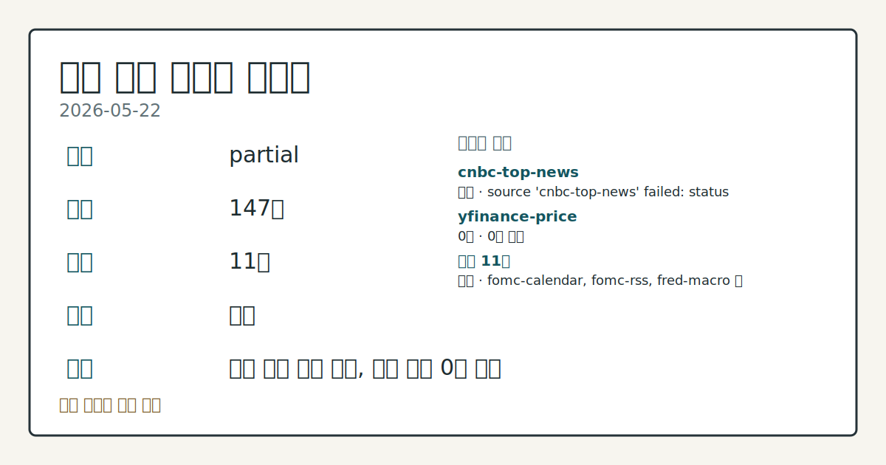
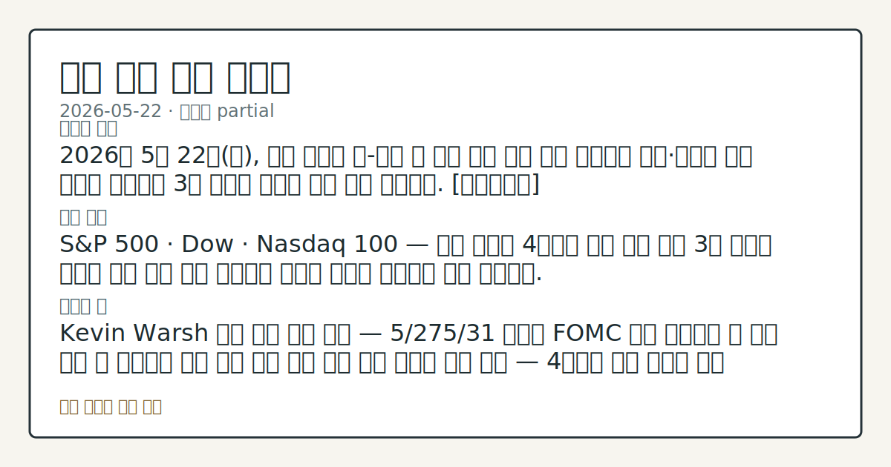

> 정보 제공용 자동 시황이며 매매 권유가 아닙니다.

# 2026-05-22 미국 증시 시황

**기준 시각**: 2026-05-22 NY · [2026-05-22T04:00Z, 2026-05-23T04:00Z)

| 종목 | 종가 | 변동 | 비고 |
|------|------|------|------|
| ^GSPC | 7,473.50 | +0.37% | -0.37% from 52w high · +8.97% YTD |
| ^IXIC | 26,343.97 | +0.19% | -1.09% from 52w high · +13.38% YTD |
| ^DJI | 50,579.70 | +0.58% | ATH 경신 |
| AAPL | 308.82 | +1.26% | ATH 경신 · +13.95% YTD |
| MSFT | 418.57 | -0.12% | +17.32% from 52w low · -11.50% YTD |

**세그먼트**: [국내 증시](../../../domestic-equity/2026/05/2026-05-22.md) | [미국 증시](2026-05-22.md) | [크립토](../../../crypto/2026/05/2026-05-22.md)

*이미지: 데이터 신뢰도 · 출처: investo 자체 생성 · 생성: investo 0.1.0 · 2026-05-25 UTC*

> **내 관심 자산 영향**: 9건 확인 (기본 바스켓) — AAPL: [structured-symbol] AAPL 308.82; AMZN: [structured-symbol] AMZN 266.32; GOOGL: [structured-symbol] GOOGL 382.97; META: [structured-symbol] META 610.26; MSFT: [structured-symbol] MSFT 418.57 외
> **오늘의 결론**: 2026년 5월 22일(금), 미국 증시는 S&P 500이 7,473.50, DJI가 50,579.70으로 소폭 상승 마감했으나 NASDAQ은 26,343.97로 시가 대비 반락하며 지수별 엇갈린 흐름을 보였다. [데이터부족]
> **핵심 동인**: S&P 500 · DJI 소폭 상승 — NASDAQ 시가 대비 반락 S&P 500은 시가 7,468.80에서 고가 7,506.30을 기록한 뒤 7,473.50으로 마감했고, DJI는 시가 50,434.70에서 고가 50,830.20을 기록한 뒤 50,579.70으로 상승 마감했다.
> **주의할 점**: Kevin Warsh 취임 이후 이번 주 예정된 Fed 위원 발언(2026-05-27 Jefferson 부의장 토론, Cook 이사 연설)에서 신임 의장 체제...

> **데이터 상태**: 부분 · 본문 사용 미집계 · 실패 1 · 0건 3

수집/품질 진단

> **데이터 상태**: 부분 — 수집 127건 / 소스 9개 / 누락: 없음 · 부분 — 일부 카테고리 미수집, 본문 일부 결론 보강 필요
> **소스 카운트**: 수집 대상 13 / 성공 9 / 0건 3 / 실패 1 / 본문 사용 미집계
> **소스 등급 분포**: S=4 / A=5
> **상세 사유**: 일부 소스 수집 실패, 일부 소스 0건 반환
> **소스별 상태**: cnbc-top-news 실패 (접근 제한), nasdaq-stocks-news 0건, yahoo-finance-news 0건, yfinance-price 0건, 정상 9개

## 한눈에 보기

- [S&P 500](https://stooq.com/q/?s=%5Espx) **7,473.50**, [DJI](https://stooq.com/q/?s=%5Edji) **50,579.70** 소폭 상승 마감; [NASDAQ](https://stooq.com/q/?s=%5Endq) **26,343.97** 시가 대비 반락하며 3대 지수 혼재 흐름
- Kevin Warsh가 Federal Reserve(연방준비제도) 의장으로 공식 취임 — FOMC(연방공개시장위원회) 만장일치 선출로 통화정책 수장 교체 완료
- 10Y(10년물 국채) 금리 **4.56%** 고점권 유지, CPI(소비자물가지수) · PPI(생산자물가지수) 전월 대비 동반 상승 확인 — 본문 §④ 참조

## ⓪ 오늘의 매크로

- **미 국채 수익률** — UST curve 2026-05-22: 10Y 4.56%, 2Y10Y +0.43pp

## ⓪-B 채널 기준선

| 기준선 | 값 |
|------|------|
| S&P 500 | 7,473.50 (+0.37%) |
| 나스닥 종합 | 26,343.97 (+0.19%) |
| 다우존스 | 50,579.70 (+0.58%) |

> **크로스마켓 연결 고리**: 금리 이벤트가 할인율/달러 경로의 공통 변수로 남아 있습니다.

## ① 요약

*이미지: 시장 스냅샷 · 출처: investo 자체 생성 · 생성: investo 0.1.0 · 2026-05-25 UTC*

2026년 5월 22일, 미국 증시는 S&P 500이 **7,473.50**, DJI가 **50,579.70**으로 소폭 상승 마감했으나 NASDAQ은 **26,343.97**로 시가 대비 반락하며 지수별 엇갈린 흐름을 보였다. 이날 시장의 최대 이벤트는 Kevin Warsh의 Federal Reserve 의장 공식 취임이었으며, 직전 영업일(5/21)부터 이어진 이란 지정학적 긴장 완화 기대가 지수 하단을 지지했다. 반면 10Y 금리 **4.56%** 부담과 NVDA(엔비디아)가 장 중 고가 대비 반락하는 등 대형 성장주 수급 변동이 상단을 제약했다. 5/19 채권금리발 급락 이후 회복 흐름이 이어지고 있으나 추가 돌파 모멘텀은 확인되지 않은 구간이다. [혼재]

## ② 전일 핵심 이슈

### S&P 500 · DJI 소폭 상승 — NASDAQ 시가 대비 반락

[S&P 500](https://stooq.com/q/?s=%5Espx)은 시가 7,468.80에서 고가 7,506.30을 기록한 뒤 **7,473.50**으로 마감했고, [DJI](https://stooq.com/q/?s=%5Edji)는 시가 50,434.70에서 고가 50,830.20을 기록한 뒤 **50,579.70**으로 상승 마감했다. [NASDAQ](https://stooq.com/q/?s=%5Endq)은 시가 26,381.56으로 출발해 고가 26,504.55까지 올랐으나 종가 **26,343.97**로 시가 대비 하락 마감했다. 3대 지수 모두 장 중 고점 대비 반락한 형태로 마감하며, 5월 15일 이후 지속된 고점권 공방이 연장됐음을 확인했다.

> **그래서 의미는?** DJI · S&P 500이 소폭 올랐지만 NASDAQ이 시가 대비 하락한 혼재 마감은 대형 성장주 주도력의 단기 약화를 시사하며, 방향성...

### Kevin Warsh, Federal Reserve 의장 공식 취임

[Federal Reserve 공식 발표](https://www.federalreserve.gov/newsevents/pressreleases/other20260522a.htm)에 따르면, Kevin Warsh가 5월 22일 Federal Reserve 의장 및 이사회(Board of Governors) 위원으로 취임 선서를 마쳤으며, FOMC가 만장일치로 Warsh를 의장으로 선출했다. 이는 fed_policy_event(연준 정책 이벤트)로 분류되는 US equity 직접 영향 사안으로, Warsh 체제 하 통화정책 커뮤니케이션 스타일 변화가 금리 경로 해석에 어떻게 반영될지 추세 확인이 필요하다. 전임 의장 Powell은 5월 31일 보스턴 케네디 용기상 시상식에서 수락 연설을 가질 예정이다.

## ③ 섹터/수급 동향

### 섹터 ETF 흐름

에너지 섹터 XLE(에너지 셀렉트 섹터 ETF)가 [59.49](https://stooq.com/q/?s=xle.us)(시가 58.99, 고가 59.61)로 시가 대비 상승하며 섹터 중 상대적 강세를 나타냈다. 헬스케어 XLV(헬스케어 ETF)는 [149.89](https://stooq.com/q/?s=xlv.us)(시가 149.09, 고가 150.32)로 소폭 상승 마감했다.

기술주 XLK(기술주 ETF)는 [180.39](https://stooq.com/q/?s=xlk.us)(시가 180.03, 고가 181.73)으로 소폭 상승했으며, 반도체 SMH(반도체 ETF)는 [576.32](https://stooq.com/q/?s=smh.us)(시가 574.27, 고가 582.50)으로 장 중 강세 후 고점 대비 반락했다. 소형주 IWM(러셀 2000 ETF)은 [285.12](https://stooq.com/q/?s=iwm.us)(시가 284.10, 고가 286.61)로 소폭 상승했다.

금융 XLF(금융 ETF) [51.94](https://stooq.com/q/?s=xlf.us), 경기소비재 XLY(소비재 ETF) [119.18](https://stooq.com/q/?s=xly.us), 산업재 XLI(산업재 ETF) [171.77](https://stooq.com/q/?s=xli.us)는 각각 시가 대비 소폭 등락에 그쳤다.

> **그래서 의미는?** 에너지·헬스케어의 방어적 섹터가 강세를 보인 반면 반도체 SMH가 고점 대비 반락한 점은, 기술주 중심 공격적 수급이 일시 약화된 구간임을...

## ④ 지표·이벤트

### 국채 금리 및 달러

[미국 국채 커브](https://home.treasury.gov/resource-center/data-chart-center/interest-rates)(2026-05-22 기준): 10Y **4.56%**, 2Y **4.13%**, 30Y **5.07%**, 3M(3개월물) **3.68%**. 장단기 스프레드 2Y10Y(2년-10년 금리 차) **+0.43pp**, 3M10Y **+0.88pp**로 우상향 정상 커브를 유지하고 있다. TLT(미국 장기채 ETF)는 [84.68](https://stooq.com/q/?s=tlt.us)(시가 84.61, 저가 84.14)로 마감했다.

DXY(달러지수) 대용 UUP(달러 ETF)는 [27.77](https://stooq.com/q/?s=uup.us)(시가 27.76, 고가 27.82)으로 소폭 변동에 그쳤다.

### 원자재

WTI 선물 CL=F(서부텍사스중질유 선물)는 [**$91.37**](https://stooq.com/q/?s=cl.f)으로 시가 **$92.52** 대비 하락 마감했다. USO(유가 ETF)는 [140.92](https://stooq.com/q/?s=uso.us)(고가 143.78)로 장 중 고점 대비 반락했다. 금 선물 GC=F(금 선물)는 [**$4,570.17**](https://stooq.com/q/?s=gc.f)(고가 **$4,603.65**)으로 고점권을 유지했으며, GLD(금 ETF)는 [413.82](https://stooq.com/q/?s=gld.us)로 마감했다.

### 주요 매크로 지표

- [DFF(연방기금금리 실효)](https://fred.stlouisfed.org/series/DFF): **3.62%** (직전 동일, 변동 없음) — Warsh 취임 이후에도 기존 금리 수준 그대로 유지됨을 확인
- [CPIAUCSL(소비자물가지수)](https://fred.stlouisfed.org/series/CPIAUCSL): **332.407** (직전 330.293 대비 +**2.114**, 2026년 4월 발표) — 소비자물가 상승이 재차 확인된 점은 성장주 밸류에이션 부담 요인으로 관찰
- [UNRATE(실업률)](https://fred.stlouisfed.org/series/UNRATE): **4.3%** (직전 동일, 2026년 4월 발표) — 고용 경색 없이 물가가 오르는 구조 확인
- [PPIFID(생산자물가지수)](https://fred.stlouisfed.org/series/PPIFID): **156.878** (직전 154.656 대비 +**2.222**, 2026년 4월 발표) — 원가 압박 지속 흐름

### 예정 이벤트

[2026-05-28 GDP(국내총생산) 발표](https://fred.stlouisfed.org/release?rid=53)가 이번 주 내 예정되어 있으며, [2026-06-17 FOMC 회의](https://www.federalreserve.gov/newsevents/calendar.htm) 및 기자회견(오후 2시/2시 30분)이 다음 달로 예정되어 있다.

> **그래서 의미는?** DFF가 동결을 유지하는 가운데 CPI와 PPI가 전월 대비 동반 상승하며, Warsh 신임 의장 체제에서 인플레이션 대응 스탠스 변화를...

## ⑤ 주요 종목

<!-- u50 lightweight-charts-embed: placeholders consumed by site_docs/assets/investo-chart-init.js -->

<noscript><em>인터랙티브 차트는 JavaScript가 활성화된 환경에서 표시됩니다. 위 정적 카드가 동일한 정보를 담고 있습니다.</em></noscript>

### 관찰 항목 — 대형 기술·성장주

| 티커 | 종가 | 시가 | 고가 | 저가 |
|------|------|------|------|------|
| [AAPL](https://stooq.com/q/?s=aapl.us) | 308.82 | 306.12 | 311.40 | 305.84 |
| [MSFT](https://stooq.com/q/?s=msft.us) | 418.57 | 419.54 | 424.40 | 416.33 |
| [GOOGL](https://stooq.com/q/?s=googl.us) | 382.97 | 387.35 | 388.74 | 381.77 |
| [AMZN](https://stooq.com/q/?s=amzn.us) | 266.32 | 268.65 | 269.79 | 266.24 |
| [NVDA](https://stooq.com/q/?s=nvda.us) | 215.33 | 220.90 | 221.01 | 214.80 |
| [META](https://stooq.com/q/?s=meta.us) | 610.26 | 607.88 | 614.81 | 606.95 |
| [TSLA](https://stooq.com/q/?s=tsla.us) | 426.01 | 422.67 | 431.51 | 420.51 |

> **그래서 의미는?** AAPL(애플)·META(메타)·TSLA(테슬라)는 시가 대비 소폭 상승 마감했으나, MSFT(마이크로소프트)·GOOGL(알파벳...

### 실적 발표 확인 항목

- [BJ](https://www.nasdaq.com/market-activity/stocks/bj/earnings)(BJ's Wholesale Club Holdings): 2026년 4월 분기, EPS(주당순이익) 예측 **$1.04**, 추정치 10건
- [BAH](https://www.nasdaq.com/market-activity/stocks/bah/earnings)(Booz Allen Hamilton): 2026년 3월 분기, EPS 예측 **$1.32**, 추정치 6건

## ⑥ 오늘의 관전 포인트

| 관찰 신호 | 현재 | 상방 확인 조건 | 하방 확인 조건 | 신뢰도 | 섹션 내 관심 영향 |
| --- | --- | --- | --- | --- | --- |
| **Kevin Warsh** 취임 이후 이번 주 예정된… | — | 데이터부족 | 데이터부족 | 데이터부족 | — |
| 10Y 금리 **4.56%** 수준이 | — | 데이터부족 | 데이터부족 | 데이터부족 | — |
| CL=F(WTI 선물) 종가 | — | 데이터부족 | 데이터부족 | 데이터부족 | — |
| [2026-05-28 GDP 발표](https://fr… | [2026-05-28 GDP 발표](https://fred.stlouisfed.org/release?rid=53) 결과를 CPIAUCSL **332.407**(전월 대비 +**2.114**)·PPIFID **156.878**(전월 대비 +**2.222**) 인플레이션 데이터와 비교해 stagflation(스태그플레이션, 저성장·고물가) 우려 재부상 여부를 점검; 관심 영향: 국채 금리 방향·DFF 동결 유지 가능성 | 데이터부족 | 데이터부족 | 보통 | 관심 영향: 국채 금리 방향 |
| NVDA의 장 중 고가 | — | 데이터부족 | 데이터부족 | 데이터부족 | — |
| `input_hash`: `80d3ee3325a4` | — | 데이터부족 | 데이터부족 | 데이터부족 | — |

_관전 신호 2건 추가 — 본문 참조._
## ⑦ 면책조항
본 시황은 일반 정보 제공을 목적으로 자동 생성된 자료이며,
특정 종목·자산에 대한 매매 권유나 투자 자문이 아닙니다.
투자 결정과 그 결과에 대한 책임은 전적으로 본인에게 있으며,
본 시황의 내용에 따라 발생한 손실에 대해 작성자는 일체의 책임을 지지 않습니다.