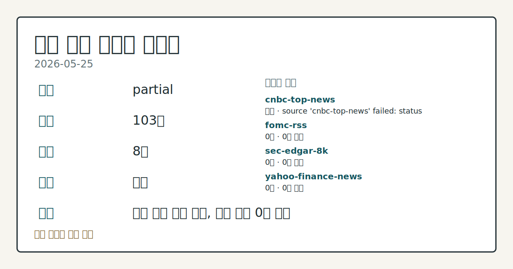
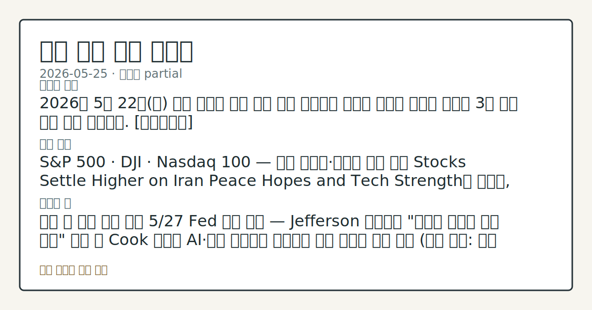

> 정보 제공용 자동 시황이며 매매 권유가 아닙니다.

# 2026-05-25 미국 증시 시황

**기준 시각**: 2026-05-25 NY · [2026-05-25T04:00Z, 2026-05-26T04:00Z)

| 종목 | 종가 | 변동 | 비고 |
|------|------|------|------|
| ^GSPC | 7,473.50 | +0.37% | -0.37% from 52w high · +8.97% YTD |
| ^IXIC | 26,343.97 | +0.19% | -1.09% from 52w high · +13.38% YTD |
| ^DJI | 50,579.70 | +0.58% | ATH 경신 |
| AAPL | 308.82 | +1.26% | ATH 경신 · +13.95% YTD |
| MSFT | 418.57 | -0.12% | +17.32% from 52w low · -11.50% YTD |

**세그먼트**: [국내 증시](../../../domestic-equity/2026/05/2026-05-25.md) | [미국 증시](2026-05-25.md) | [크립토](../../../crypto/2026/05/2026-05-25.md)

*이미지: 데이터 신뢰도 · 출처: investo 자체 생성 · 생성: investo 0.1.0 · 2026-05-25 UTC*

> **내 관심 자산 영향**: 7건 확인 (기본 바스켓) — AAPL: [structured-symbol] AAPL 308.82; AMZN: [structured-symbol] AMZN 266.32; GOOGL: [structured-symbol] GOOGL 382.97; META: [structured-symbol] META 610.26; MSFT: [structured-symbol] MSFT 418.57 외
> **오늘의 결론**: 2026년 5월 22일(금) 미국 증시는 이란 평화 협상 기대감과 빅테크 기술주 강세에 힘입어 3대 지수 모두 상승 마감했다. [데이터부족]
> **핵심 동인**: S&P 500 · DJI · Nasdaq 100 — 이란 기대감·기술주 상승 마감 Stocks Settle Higher on Iran Peace Hopes and Tech Strength에 따르면, S&P 500은 **+0.37%** 상승해 7,473.50에 마감했고, DJI는 **+0.58%** 올라 50,579.70을 기록했으며, Nasdaq 100은 **+0.42%** 상승했다.
> **주의할 점**: 이번 주 핵심 관찰 변수 5/27 Fed 인사 연설 — Jefferson 부의장의 "글로벌 경제와 미국 경제" 발언 및 Cook 이사의 AI·경제 연설에서...

> **데이터 상태**: 부분 · 본문 사용 미집계 · 실패 1 · 0건 4

수집/품질 진단

> **데이터 상태**: 부분 — 수집 103건 / 소스 8개 / 누락: 없음 · 부분 — 일부 카테고리 미수집, 본문 일부 결론 보강 필요
> **소스 카운트**: 수집 대상 13 / 성공 8 / 0건 4 / 실패 1 / 본문 사용 미집계
> **소스 등급 분포**: S=2 / A=6
> **상세 사유**: 일부 소스 수집 실패, 일부 소스 0건 반환
> **소스별 상태**: cnbc-top-news 실패 (접근 제한), fomc-rss 0건, sec-edgar-8k 0건, yahoo-finance-news 0건, yfinance-price 0건, 정상 8개

## 한눈에 보기

- S&P 500 **+0.37%**, DJI **+0.58%**, Nasdaq 100 **+0.42%** 상승 마감(5/22 종가) — 이란 평화 협상 기대감과 기술주 강세가 주요 지수를 견인했다.
- University of Michigan 5월 소비심리지수가 사상 최저 수준으로 하향 수정되며 DXY(달러지수)가 초반 상승분을 반납, 지수 상승 폭이 제한됐다.
- **4.56%** 10Y 국채금리와 5/28 GDP(국내총생산) 발표가 이번 주 핵심 관찰 변수 — 본문 §⑥ 참조.

## ⓪ 오늘의 매크로

- **미 국채 수익률** — UST curve 2026-05-22: 10Y 4.56%, 2Y10Y +0.43pp

## ⓪-B 채널 기준선

| 기준선 | 값 |
|------|------|
| S&P 500 | 7,473.50 (+0.37%) |
| 나스닥 종합 | 26,343.97 (+0.19%) |
| 다우존스 | 50,579.70 (+0.58%) |

> **크로스마켓 연결 고리**: 금리 이벤트가 할인율/달러 경로의 공통 변수로 남아 있습니다.

## ① 요약

*이미지: 시장 스냅샷 · 출처: investo 자체 생성 · 생성: investo 0.1.0 · 2026-05-25 UTC*

2026년 5월 22일 미국 증시는 이란 평화 협상 기대감과 빅테크 기술주 강세에 힘입어 3대 지수 모두 상승 마감했다. S&P 500(스탠더드앤드푸어스 500 지수)은 **+0.37%** 올라 **7,473.50**에, DJI(다우존스 산업평균)는 **+0.58%** 상승해 **50,579.70**에, Nasdaq 100은 **+0.42%** 상승했다. 반면 University of Michigan의 5월 소비심리지수가 사상 최저 수준으로 하향 수정되면서 DXY가 장중 상승분을 반납했고, 지수 상승 폭은 제한됐다. 5/25(월) 미국 증시는 Memorial Day(현충일) 휴장으로 신규 시장 데이터가 없으며, 금일 브리핑은 5/22(금) 종가 기준 연장 관찰이다. 5/26(화) 재개장 이후 5/27~5/31 Fed(연방준비제도) 인사 연설과 5/28 GDP 발표가 이번 주 흐름을 결정할 주요 일정으로 예정돼 있다. [상승 관찰]

## ② 전일 핵심 이슈

### S&P 500 · DJI · Nasdaq 100 — 이란 기대감·기술주 상승 마감

[Stocks Settle Higher on Iran Peace Hopes and Tech Strength](https://www.nasdaq.com/articles/stocks-settle-higher-iran-peace-hopes-and-tech-strength)에 따르면, S&P 500은 **+0.37%** 상승해 **7,473.50**에 마감했고, DJI는 **+0.58%** 올라 **50,579.70**을 기록했으며, Nasdaq 100은 **+0.42%** 상승했다. NASDAQ 종합지수(^IXIC)는 **26,343.97**로 마감됐으며, ESM26(미니 S&P 500 선물)도 **+0.35%** 올랐다. 이란과의 평화 협상 진전 기대감이 지정학적 프리미엄을 일부 해소했고, 빅테크 기술주가 지수 상승을 이끌었다.

> **그래서 의미는?** 이란 리스크 완화가 투자 심리를 회복시켰으나 소비심리 악화와 맞물려 상승 폭이 제한된 관찰 국면이다.

### 소비심리지수 사상 최저 — DXY 상승분 반납

[Dollar Erases Early Gains as US Consumer Sentiment Sinks](https://www.nasdaq.com/articles/dollar-erases-early-gains-us-consumer-sentiment-sinks)에 따르면, University of Michigan의 5월 소비심리지수가 사상 최저 수준으로 하향 수정됐다. DXY는 장중 상승분을 반납하며 거의 보합 마감했다. 소비자 신뢰의 기록적 하락은 향후 내수 둔화 우려를 자극하며 Fed 정책 경로에 대한 재평가 여지를 제공하고 있다.

## ③ 섹터/수급 동향

### 섹터 ETF(상장지수펀드) 종가 현황

5/22 종가 기준 주요 섹터 ETF는 다음과 같다. XLK(기술 섹터)는 **180.39**, XLE(에너지 섹터)는 **59.49**, XLF(금융 섹터)는 **51.94**, XLV(헬스케어 섹터)는 **149.89**, XLY(경기소비재 섹터)는 **119.18**, XLI(산업 섹터)는 **171.77**을 기록했다. SMH(반도체 ETF)는 **576.32**, IWM(소형주 ETF)는 **285.12**였다.

> **그래서 의미는?** 입력 데이터에 전일 대비 등락률이 제공되지 않아 섹터 간 상대 강도보다 종가 수준 확인 항목으로만 봅니다.

### 채권·원자재·달러 관련 ETF

TLT(장기 국채 ETF)는 **84.68**, GLD(금 ETF)는 **413.82**, USO(원유 ETF)는 **140.92**, UUP(달러 ETF)는 **27.77**로 마감됐다. WTI 원유 선물(CL=F)은 **90.96**, 금 선물(GC=F)은 **4,612.60**이었다.

## ④ 지표·이벤트

### 국채 수익률 곡선 (2026-05-22)

[미국 재무부](https://home.treasury.gov/resource-center/data-chart-center/interest-rates) 기준, 10Y(10년물) 국채금리는 **4.56%**, 2Y(2년물)는 **4.13%**, 30Y(30년물)는 **5.07%**, 3M(3개월물)은 **3.68%**였다. 2Y10Y 스프레드(장단기 금리 차)는 **+0.43pp**, 3M10Y 스프레드는 **+0.88pp**로 정상 커브(우상향)를 유지했다.

> **그래서 의미는?** 10년물 **4.56%** 수준은 주식 밸류에이션 부담 논의가 지속되는 구간으로, GDP 발표 이후 방향 확인이 필요하다.

### 핵심 매크로 지표

[DFF(연방기금금리)](https://fred.stlouisfed.org/series/DFF)는 **3.62%**로 직전일 대비 변동 없이 유지됐다. [CPIAUCSL(소비자물가지수)](https://fred.stlouisfed.org/series/CPIAUCSL)는 **332.407**(직전 **330.293** 대비 **+2.114**)을 기록했다. [UNRATE(실업률)](https://fred.stlouisfed.org/series/UNRATE)는 **4.3%**로 직전과 동일했다. [PPIFID(생산자물가지수)](https://fred.stlouisfed.org/series/PPIFID)는 **156.878**(직전 **154.656** 대비 **+2.222**)로 상승했다.

### 예정 이벤트 — 이번 주·이번 달

- **2026-05-27**: Fed 부의장 Jefferson "Global Economic Developments and the U.S. Economy" 발언, Governor Cook AI·경제·금융 시스템 연설
- **2026-05-28**: [GDP 발표](https://fred.stlouisfed.org/release?rid=53)
- **2026-05-29**: 감독 담당 부의장 Bowman 통화정책 연설
- **2026-05-31**: 의장 Powell JFK Profile in Courage Award 수상 연설, 이사 Waller 스테이블코인 패널
- **2026-06-03**: [Beige Book(연준 경기동향 보고서)](https://www.federalreserve.gov/newsevents/calendar.htm) 발표
- **2026-06-17**: [FOMC(연방공개시장위원회) 2일 회의](https://www.federalreserve.gov/newsevents/calendar.htm) 및 기자회견

## ⑤ 주요 종목

<!-- u50 lightweight-charts-embed: placeholders consumed by site_docs/assets/investo-chart-init.js -->

<noscript><em>인터랙티브 차트는 JavaScript가 활성화된 환경에서 표시됩니다. 위 정적 카드가 동일한 정보를 담고 있습니다.</em></noscript>

### 주요 지수 구성 종목 — 종가 확인

| 티커 | 종가 |
|------|------|
| AAPL | **308.82** |
| MSFT | **418.57** |
| GOOGL | **382.97** |
| AMZN | **266.32** |
| NVDA | **215.33** |
| META | **610.26** |
| TSLA | **426.01** |

> **그래서 의미는?** 애플(AAPL), Microsoft(MSFT), Meta(META) 등 빅테크가 기술주 강세 흐름 속에 움직였으나 NVDA(엔비디아)는 장중...

### 실적 발표 관찰

[D-Wave(QBTS)](https://www.nasdaq.com/articles/d-wave-stock-skyrockets-62-after-q1-earnings-time-buy-qbts)는 Q1 실적 발표 후 **+62%** 급등했다. 기록적 수주 잔고와 AI·블록체인 활용 사례 확대가 배경으로 언급됐다. [Block(XYZ)](https://www.nasdaq.com/articles/block-stock-gains-249-past-3-months-will-it-continue-rise)은 최근 3개월 **+24.9%** 상승을 기록했으며 Cash App 성장과 BNPL(선구매후결제) 모멘텀이 주요 요인으로 분석됐다.

### 섹터 흐름 관찰 항목

[Bloom Energy(BE)](https://www.nasdaq.com/articles/be-stock-outpaces-its-industry-past-6-months-how-play)는 최근 6개월 **+199%** 상승이 보고됐으며 AI 데이터센터 수요와 에너지 서버 수주가 배경이다. [Valero Energy(VLO)](https://www.nasdaq.com/articles/valero-energy-gains-favorable-refining-fundamentals)는 유리한 정제 마진 환경이 지속되고 있다는 분석이 제시됐다. Berkshire Hathaway(BRK)는 최근 3개월 업종 대비 상대 약세 흐름이 관찰됐다.

## ⑥ 오늘의 관전 포인트

| 관찰 신호 | 현재 | 상방 확인 조건 | 하방 확인 조건 | 신뢰도 | 섹션 내 관심 영향 |
| --- | --- | --- | --- | --- | --- |
| **5/27 Fed 인사 연설** — Jefferson… | — | 데이터부족 | 데이터부족 | 데이터부족 | — |
| **5/28 [GDP 발표](https://fred.s… | **5/28 [GDP 발표](https://fred.stlouisfed.org/release?rid=53)** — 성장 지표 결과가 University of Michigan 소비심리 사상 최저 하향 수정과 어떻게 연계되는지 점검; 관심 영향: 성장 경로 및 Fed 정책 해석 | 데이터부족 | 데이터부족 | 보통 | 관심 영향: 성장 경로 및 Fed 정책 해석 |
| **10Y 금리 **4.56%** 방향** — [Tre… | **10Y 금리 **4.56%** 방향** — [Treasury 데이터](https://home.treasury.gov/resource-center/data-chart-center/interest-rates) 기준 현재 **4.56%** 수준이 상승 지속되면 XLK 밸류에이션 압박을 관찰하고, 하락 전환 시 성장주 수급 변동 흐름 확인 (입력 임계값 부재 — 방향 확인은 GDP·소비 데이터 발표 후 가능) | 데이터부족 | 데이터부족 | 높음 | — |
| **소비심리 추가 | — | 데이터부족 | 데이터부족 | 데이터부족 | — |
| **이란 평화 협상 진전** — 협상 상황 변화가 | — | 데이터부족 | 데이터부족 | 데이터부족 | — |
| `input_hash`: `9c53bea698f9` | — | 데이터부족 | 데이터부족 | 데이터부족 | — |

_관전 신호 2건 추가 — 본문 참조._
## ⑦ 면책조항
본 시황은 일반 정보 제공을 목적으로 자동 생성된 자료이며,
특정 종목·자산에 대한 매매 권유나 투자 자문이 아닙니다.
투자 결정과 그 결과에 대한 책임은 전적으로 본인에게 있으며,
본 시황의 내용에 따라 발생한 손실에 대해 작성자는 일체의 책임을 지지 않습니다.