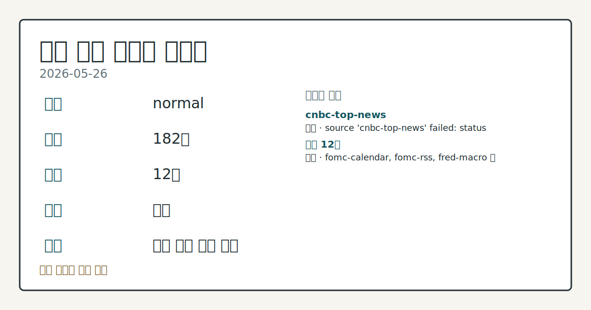
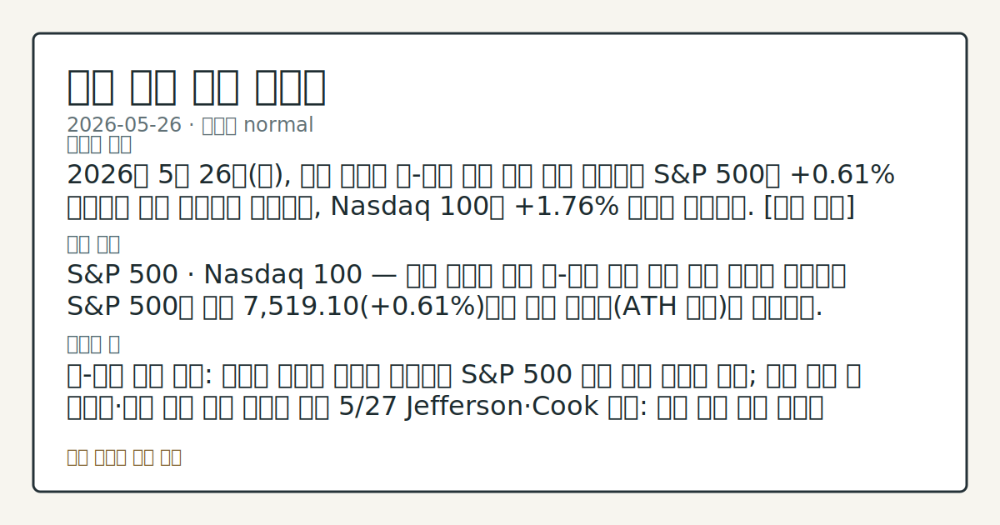
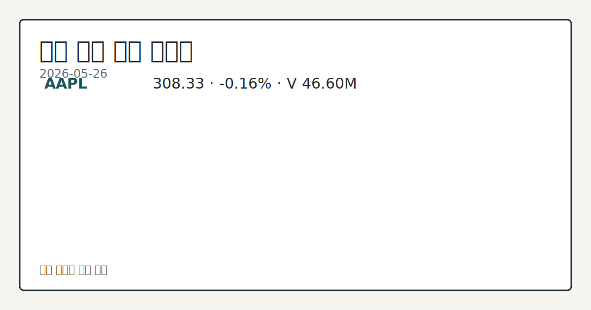

> 정보 제공용 자동 시황이며 매매 권유가 아닙니다.

# 2026-05-26 미국 증시 시황

**기준 시각**: 2026-05-26 NY · [2026-05-26T04:00Z, 2026-05-27T04:00Z)

| 종목 | 종가 | 변동 | 비고 |
|------|------|------|------|
| ^GSPC | 7,519.10 | +0.61% | ATH 경신 · +9.63% YTD |
| ^IXIC | 26,656.18 | +1.19% | ATH 경신 · +14.72% YTD |
| ^DJI | 50,461.70 | -0.23% | -0.23% from 52w high |
| AAPL | 308.33 | -0.16% | -0.16% from 52w high · +13.77% YTD |
| MSFT | 416.03 | -0.61% | +16.61% from 52w low · -12.03% YTD |

**세그먼트**: [국내 증시](../../../domestic-equity/2026/05/2026-05-26.md) | [미국 증시](2026-05-26.md) | [크립토](../../../crypto/2026/05/2026-05-26.md)

*이미지: 데이터 신뢰도 · 출처: investo 자체 생성 · 생성: investo 0.1.0 · 2026-05-27 UTC*

> **내 관심 자산 영향**: 9건 확인 (기본 바스켓) — AAPL: [boundary-term] Apple Stock Hits New Record Highs as AI Doubts Begin to Fade; AAPL: [structured-symbol] AAPL 308.33; AMZN: [structured-symbol] AMZN 265.29; AMZN: [structured-symbol] AMZN 265.29 (**-0.39%**); GOOGL: [structured-symbol] GOOGL 388.88 외
> **오늘의 결론**: 2026년 5월 26일(화), 미국 증시는 미국-이란 평화 협상 진전 소식을 재료로 에너지 가격이 급락하는 가운데 S&P 500이 사상 최고치를 경신했다. [데이터부족]
> **핵심 동인**: S&P 500 · DJI · NASDAQ — 지수별 마감 S&P 500은 종가 7,519.10으로 사상 최고치(ATH)를 갱신했다.
> **주의할 점**: S&P 500 종가 7,519.10 ATH 경신 이후 DJI 소폭 하락과의 지수 간 온도차가 이어지는지 흐름을 점검한다.

> **데이터 상태**: 부분 · 본문 사용 미집계 · 실패 1 · 0건 1

수집/품질 진단

> **데이터 상태**: 부분 — 수집 177건 / 소스 11개 / 누락: 없음 · 부분 — 일부 카테고리 미수집, 본문 일부 결론 보강 필요
> **소스 카운트**: 수집 대상 13 / 성공 11 / 0건 1 / 실패 1 / 본문 사용 미집계
> **소스 등급 분포**: S=4 / A=7
> **상세 사유**: 일부 소스 수집 실패, 일부 소스 0건 반환
> **소스별 상태**: cnbc-top-news 실패 (접근 제한), yahoo-finance-news 0건, 정상 11개

## 한눈에 보기

- S&P 500(스탠더드앤드푸어스 500 지수)이 종가 **7,519.10**으로 사상 최고치를 경신하며 상승 마감; NASDAQ 종합지수도 **26,656.18** 기록
- **AAPL**이 AI 회의론 후퇴 속 신고점 **308.33**을 갱신하며 대형 기술주 강세를 견인
- 이번 주 **2026-05-28** GDP(국내총생산) 발표가 채권금리 변동의 핵심 변수 — 본문 §④ 참조

## ⓪ 오늘의 매크로

- **미 국채 수익률** — UST curve 2026-05-26: 10Y 4.50%, 2Y10Y +0.49pp

## ⓪-B 채널 기준선

| 기준선 | 값 |
|------|------|
| S&P 500 | 7,519.10 (+0.61%) |
| 나스닥 종합 | 26,656.18 (+1.19%) |
| 다우존스 | 50,461.70 (-0.23%) |

> **크로스마켓 연결 고리**: 금리 이벤트가 할인율/달러 경로의 공통 변수로 남아 있습니다.

## ① 요약

*이미지: 시장 스냅샷 · 출처: investo 자체 생성 · 생성: investo 0.1.0 · 2026-05-27 UTC*

2026년 5월 26일, 미국 증시는 미국-이란 평화 협상 진전 소식을 재료로 에너지 가격이 급락하는 가운데 S&P 500이 사상 최고치를 경신했다. DJI(다우존스산업평균지수)는 **50,461.70**으로 시가 대비 소폭 하락 마감했으나, NASDAQ 종합지수는 **26,656.18**로 상승했다. AAPL이 신고점을 갱신하며 기술주가 지수 상승을 이끌었고, 에너지 섹터는 유가 급락에 직격탄을 맞아 약세를 나타냈다. 5월 중순부터 이어져온 이란 기대감 흐름이 S&P 500 ATH(사상 최고치) 경신이라는 형태로 새로운 단계에 접근한 것이 이날의 핵심 관찰 사실이다. [상승 관찰]

## ② 전일 핵심 이슈

### S&P 500 · DJI · NASDAQ — 지수별 마감

[S&P 500](https://stooq.com/q/?s=%5Espx)은 종가 **7,519.10**으로 사상 최고치(ATH)를 갱신했다. [NASDAQ](https://stooq.com/q/?s=%5Endq) 종합지수는 **26,656.18**로 시가(**26,590.50**) 대비 상승 마감했다. [DJI](https://stooq.com/q/?s=%5Edji)는 **50,461.70**으로 시가(**50,686.20**) 대비 소폭 하락하는 등 지수별 온도차가 나타났다. 최근 5 영업일 동안 이란 기대감이 반복적으로 시장을 지지해온 흐름에서, 이날 S&P 500의 실제 ATH 경신으로 그 연속성을 확인할 수 있었다.

> **그래서 의미는?** S&P 500의 사상 최고치 경신은 이란 협상 기대감이 단순 재료를 넘어 지정학적 리스크 프리미엄 해소로 이어지고 있음을 관찰할 수 있는...

### 미국-이란 협상 진전 — 유가 급락과 달러 소폭 약세

[미국-이란 평화 협상 진전](https://www.nasdaq.com/articles/crude-oil-prices-decline-us-iran-peace-plans-progress)으로 CLN26(7월물 WTI 원유선물)이 **-2.71**(**-2.81%**) 하락하며 2.5주 저점을 기록했고, RBN26(7월물 RBOB 가솔린선물)도 **-0.2046**(**-6.10%**) 급락했다. [DXY(달러지수)](https://www.nasdaq.com/articles/dollar-weakens-us-iran-peace-hopes)도 **-0.07%** 하락하며 달러 약세가 소폭 확인되었다. us-equity 관점에서 유가 급락은 에너지 섹터 직접 압박과 동시에 운송·소비 비용 완화를 통한 소비재 섹터 완화 효과도 관찰할 수 있는 지점이다. [DFF(연방기금금리)](https://fred.stlouisfed.org/series/DFF)는 **3.62%**로 2026-05-25 기준 전일 대비 변동 없이 유지되었다.

## ③ 섹터/수급 동향

### 섹터 ETF 흐름 — 기술 강세, 에너지·헬스케어·금융 약세

5개 섹터 ETF — XLK(기술섹터 ETF), XLE(에너지섹터 ETF), XLF(금융섹터 ETF), XLV(헬스케어섹터 ETF), XLY(임의소비재섹터 ETF) — 가운데 XLK만 시가 대비 상승 마감하며 이날의 기술주 집중 흐름을 뒷받침했다.

| 티커 | 종가 | 시가 | 고가 | 저가 |
|------|------|------|------|------|
| [XLK](https://stooq.com/q/?s=xlk.us) | 185.14 | 183.20 | 186.00 | 182.59 |
| [XLE](https://stooq.com/q/?s=xle.us) | 57.85 | 58.87 | 59.57 | 57.84 |
| [XLF](https://stooq.com/q/?s=xlf.us) | 51.85 | 52.00 | 52.23 | 51.72 |
| [XLV](https://stooq.com/q/?s=xlv.us) | 148.51 | 149.95 | 150.30 | 148.44 |
| [XLY](https://stooq.com/q/?s=xly.us) | 119.45 | 119.73 | 120.23 | 118.69 |

> **그래서 의미는?** XLK만 시가 대비 상승 마감하며 이날 상승 동력이 기술주에 집중됐음을 확인할 수 있고, XLE의 약세는 CLN26 유가 급락과 직결된...

### 수급 데이터

이번 세그먼트에서 섹터별 기관·외국인 순매수 집계 데이터는 수집되지 않았습니다.

## ④ 지표·이벤트

### FOMC 의사록 공개 및 연준 인사 일정

[FOMC(연방공개시장위원회) 4월 20일·29일 할인율 회의 의사록](https://www.federalreserve.gov/newsevents/pressreleases/monetary20260526a.htm)이 공개되었다. 오늘(2026-05-27) [Jefferson 부의장은 도쿄 일본은행 컨퍼런스에서 글로벌 경제 동향 토론](https://www.federalreserve.gov/newsevents/calendar.htm)에 참여하고, [Cook 이사는 스탠퍼드 SIEPR 포럼에서 AI·경제·금융 시스템 연설](https://www.federalreserve.gov/newsevents/calendar.htm)을 진행한다.

> **그래서 의미는?** FOMC 의사록 공개와 연준 인사들의 잇따른 발언이 DFF **3.62%** 수준의 금리 경로에 대한 시장 기대를 재조정할 수 있는지 점검할...

### 필수 매크로 실적 — CPI · PPI · 실업률 · 기준금리

[CPIAUCSL(소비자물가지수)](https://fred.stlouisfed.org/series/CPIAUCSL)는 **332.407**(전월 330.293 대비 **+2.1140**, 2026-04-01 발표)이다. [UNRATE(실업률)](https://fred.stlouisfed.org/series/UNRATE)은 **4.3%**로 전월 대비 변동 없다(2026-04-01 발표). [PPIFID(최종수요 생산자물가지수)](https://fred.stlouisfed.org/series/PPIFID)는 **156.878**(전월 154.656 대비 **+2.2220**, 2026-04-01 발표)이다. CPI와 PPI가 모두 전월 대비 상승했으나 실업률과 기준금리는 안정세를 유지하는 복합 국면이다.

## ⑤ 주요 종목

<!-- u50 lightweight-charts-embed: placeholders consumed by site_docs/assets/investo-chart-init.js -->

<noscript><em>인터랙티브 차트는 JavaScript가 활성화된 환경에서 표시됩니다. 위 정적 카드가 동일한 정보를 담고 있습니다.</em></noscript>

*이미지: 가격 스냅샷 · 출처: investo 자체 생성 · 생성: investo 0.1.0 · 2026-05-27 UTC*

### 관전 분류 — 대형 기술주 (Watchlist 매칭 포함)

| 티커 | 종가 | 시가 | 고가 | 저가 | 특이사항 |
|------|------|------|------|------|---------|
| [AAPL](https://stooq.com/q/?s=aapl.us) | 308.33 | 309.56 | 311.82 | 307.67 | [신고점 경신](https://www.nasdaq.com/articles/apple-stock-hits-new-record-highs-ai-doubts-begin-fade) |
| [MSFT](https://stooq.com/q/?s=msft.us) | 416.03 | 416.43 | 419.77 | 413.02 | — |
| [GOOGL](https://stooq.com/q/?s=googl.us) | 388.88 | 384.51 | 389.26 | 382.60 | — |
| [AMZN](https://stooq.com/q/?s=amzn.us) | 265.29 | 267.94 | 269.30 | 262.07 | -0.39% |
| [NVDA](https://stooq.com/q/?s=nvda.us) | 214.86 | 216.54 | 218.18 | 212.00 | — |
| [META](https://stooq.com/q/?s=meta.us) | 612.34 | 608.89 | 614.47 | 605.30 | — |
| [TSLA](https://stooq.com/q/?s=tsla.us) | 433.59 | 430.26 | 435.20 | 426.12 | — |

> **그래서 의미는?** AAPL(애플)의 신고점 갱신이 AI 회의론 완화와 연결됨을 확인할 수 있으며, 여타 대형 기술주의 연속 강세 여부가 관찰 포인트입니다.

### 실적 발표 종목

| 티커 | 발표 시점 | EPS 예상 | 회사명 |
|------|---------|--------|------|
| [AZO](https://www.nasdaq.com/market-activity/stocks/azo/earnings) | 장 전 | $36.09 | AutoZone |
| [ZS](https://www.nasdaq.com/market-activity/stocks/zs/earnings) | 장 후 | ($0.04) | Zscaler |

## ⑥ 오늘의 관전 포인트

| 관찰 신호 | 현재 | 상방 확인 조건 | 하방 확인 조건 | 신뢰도 | 섹션 내 관심 영향 |
| --- | --- | --- | --- | --- | --- |
| S&P 500 종가 | — | 데이터부족 | 데이터부족 | 데이터부족 | — |
| **2026-05-28** GDP 발표 결과가 | — | 데이터부족 | 데이터부족 | 데이터부족 | — |
| CLN26 낙폭 **-2.81%**가 | — | 데이터부족 | 데이터부족 | 데이터부족 | — |
| [AAPL](https://www.nasdaq.com/… | — | 데이터부족 | 데이터부족 | 데이터부족 | — |
| Jefferson 부의장·Cook 이사 발언 및 **2… | — | 데이터부족 | 데이터부족 | 데이터부족 | — |
| [AZO](https://www.nasdaq.com/m… | — | 데이터부족 | 데이터부족 | 데이터부족 | — |

_관전 신호 3건 추가 — 본문 참조._
## ⑦ 면책조항
본 시황은 일반 정보 제공을 목적으로 자동 생성된 자료이며,
특정 종목·자산에 대한 매매 권유나 투자 자문이 아닙니다.
투자 결정과 그 결과에 대한 책임은 전적으로 본인에게 있으며,
본 시황의 내용에 따라 발생한 손실에 대해 작성자는 일체의 책임을 지지 않습니다.