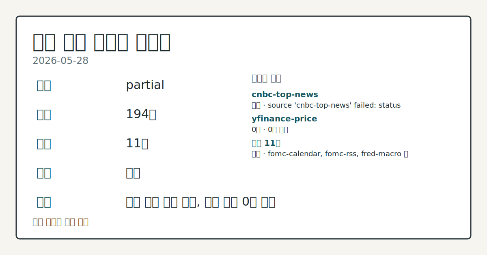
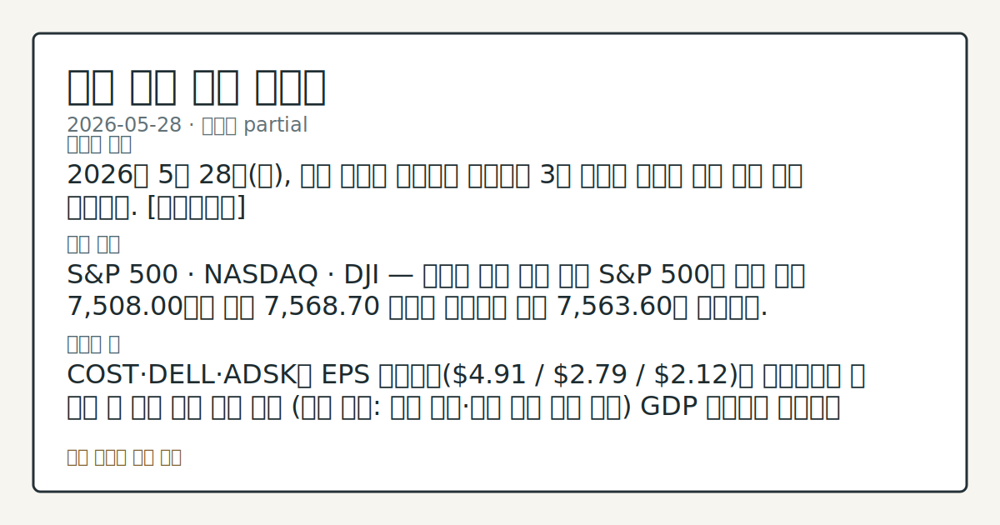

> 정보 제공용 자동 시황이며 매매 권유가 아닙니다.

# 2026-05-28 미국 증시 시황

**기준 시각**: 2026-05-28 NY · [2026-05-28T04:00Z, 2026-05-29T04:00Z)

| 종목 | 종가 | 변동 | 비고 |
|------|------|------|------|
| ^GSPC | 7,563.60 | +0.58% | ATH 경신 · +10.28% YTD |
| ^IXIC | 26,917.47 | +0.91% | ATH 경신 · +15.85% YTD |
| ^DJI | 50,669.00 | +0.05% | ATH 경신 |
| AAPL | 312.51 | +0.53% | ATH 경신 · +15.31% YTD |
| MSFT | 426.99 | +3.47% | +19.68% from 52w low · -9.72% YTD |

**세그먼트**: [국내 증시](../../../domestic-equity/2026/05/2026-05-28.md) | [미국 증시](2026-05-28.md) | 크립토(미발행)

*이미지: 데이터 신뢰도 · 출처: investo 자체 생성 · 생성: investo 0.1.0 · 2026-05-29 UTC*

> **내 관심 자산 영향**: 8건 확인 (기본 바스켓) — AAPL: [structured-symbol] AAPL 312.51; AMZN: [structured-symbol] AMZN 274.00; GOOGL: [structured-symbol] GOOGL 390.13; META: [structured-symbol] META 635.29; MSFT: [structured-symbol] MSFT 426.99 외
> **오늘의 결론**: 2026년 5월 28일(목), 미국 증시는 기술주를 중심으로 3대 지수가 일제히 시가 대비 상승 마감했다. [데이터부족]
> **핵심 동인**: S&P 500 · NASDAQ · DJI — 기술주 주도 상승 마감 S&P 500은 장중 저점 7,508.00에서 고점 7,568.70 구간을 소화하며 종가 7,563.60에 마감했다.
> **주의할 점**: COST·DELL·ADSK가 EPS 컨센서스$4.91 / $2.79 / $2.12를 충족하는지 장 마감 후 발표 결과 추세 확인 관심

> **데이터 상태**: 부분 · 본문 사용 미집계 · 실패 1 · 0건 1

수집/품질 진단

> **데이터 상태**: 부분 — 수집 194건 / 소스 11개 / 누락: 없음 · 부분 — 일부 카테고리 미수집, 본문 일부 결론 보강 필요
> **소스 카운트**: 수집 대상 13 / 성공 11 / 0건 1 / 실패 1 / 본문 사용 미집계
> **소스 등급 분포**: S=4 / A=7
> **상세 사유**: 일부 소스 수집 실패, 일부 소스 0건 반환
> **소스별 상태**: cnbc-top-news 실패 (접근 제한), yfinance-price 0건, 정상 11개

## 한눈에 보기

- S&P 500(스탠더드앤드푸어스 500 지수) **7,563.60**, NASDAQ(나스닥 종합) **26,917.47**, DJI(다우존스산업평균) **50,669.00** — 3대 지수 시가 대비 상승 마감
- MSFT(마이크로소프트)가 시가 **$412.98**에서 종가 **$426.99**로 대형 기술주 중 가장 두드러진 흐름 확인
- DGS10(10년물 국채 금리) **4.48%** 소폭 하락 확인 — 오늘 밤 COST·DELL 실적 및 GDP 발표 일정은 본문 §④·§⑤ 참조

## ⓪ 오늘의 매크로

- **미 국채 수익률** — UST curve 2026-05-28: 10Y 4.45%, 2Y10Y +0.46pp

## ⓪-B 채널 기준선

| 기준선 | 값 |
|------|------|
| S&P 500 | 7,563.60 (+0.58%) |
| 나스닥 종합 | 26,917.47 (+0.91%) |
| 다우존스 | 50,669.00 (+0.05%) |

> **크로스마켓 연결 고리**: 금리 이벤트가 할인율/달러 경로의 공통 변수로 남아 있습니다.

## ① 요약

*이미지: 시장 스냅샷 · 출처: investo 자체 생성 · 생성: investo 0.1.0 · 2026-05-29 UTC*

2026년 5월 28일, 미국 증시는 기술주를 중심으로 3대 지수가 일제히 시가 대비 상승 마감했다. [S&P 500](https://stooq.com/q/?s=%5Espx)은 시가 7,519.80에서 종가 **7,563.60**으로, [NASDAQ](https://stooq.com/q/?s=%5Endq)은 시가 26,686.53에서 종가 **26,917.47**로, [DJI](https://stooq.com/q/?s=%5Edji)는 시가 50,661.00에서 종가 **50,669.00**으로 마감했다. 직전 영업일(5/26) S&P 500 종가 7,519에 이어 오늘도 상승 기조가 연장됐다. MSFT는 시가 **$412.98** 대비 종가 **$426.99**의 강한 흐름을 보였으며, GLD(금 현물 ETF)도 시가 **$406.48**에서 종가 **$412.77**로 상승 마감했다. 반면 USO(원유 ETF)는 시가 **$133.34**에서 종가 **$130.78**로 하락했다. [상승 관찰]

## ② 전일 핵심 이슈

### S&P 500 · NASDAQ · DJI — 기술주 주도 상승 마감

[S&P 500](https://stooq.com/q/?s=%5Espx)은 장중 저점 7,508.00에서 고점 **7,568.70** 구간을 소화하며 종가 **7,563.60**에 마감했다. [NASDAQ](https://stooq.com/q/?s=%5Endq)은 저점 26,588.52에서 고점 **26,934.84**를 거쳐 종가 **26,917.47**을 기록했다. DJI는 저점 50,314.30에서 고점 50,764.00을 경유해 종가 **50,669.00**으로 마감했다. 5/26 S&P 500 종가 7,519 이후 오늘도 상승 흐름이 이어지며 이란 기대감 이후 기술주 중심 추세가 연장되는 모양새다.

> **그래서 의미는?** 3대 지수가 연속으로 시가 대비 상승 마감하며, 최근 수일간의 기술주 주도 상승 기조가 단기적으로 유지되는지 흐름 확인이 필요합니다.

### 매크로 지표 — CPI · PPI · 실업률 · 연방기금금리

[CPIAUCSL(소비자물가지수 계절조정)](https://fred.stlouisfed.org/series/CPIAUCSL)은 최근 발표 기준 **332.407**로 직전 330.293 대비 +2.114 상승했다. [PPIFID(최종수요 생산자물가지수)](https://fred.stlouisfed.org/series/PPIFID)는 **156.878**로 직전 154.656 대비 +2.222 상승했다. [UNRATE(실업률)](https://fred.stlouisfed.org/series/UNRATE)는 **4.3%**로 직전과 동일한 수준을 유지했으며, [DFF(연방기금금리 실효값)](https://fred.stlouisfed.org/series/DFF)는 **3.62%**로 전일 대비 변화 없이 유지됐다. CPI·PPI가 모두 직전 수준을 상회한 가운데 실업률과 정책금리는 각각 동결 상태를 유지해, 미국 주식 시장의 금리 민감도 재점검이 필요한 배경이 형성됐다.

## ③ 섹터/수급 동향

### 기술·헬스케어·금 강세 — 에너지·원유 하락

[XLK(기술 섹터 ETF)](https://stooq.com/q/?s=xlk.us)는 시가 **$184.83**에서 종가 **$186.85**로 마감했다. [SMH(반도체 섹터 ETF)](https://stooq.com/q/?s=smh.us)도 시가 **$595.81** 대비 종가 **$599.83**으로 상승했다. [XLV(헬스케어 ETF)](https://stooq.com/q/?s=xlv.us)는 시가 **$149.15**에서 종가 **$150.88**로, [XLY(소비재 ETF)](https://stooq.com/q/?s=xly.us)는 시가 **$121.10**에서 종가 **$122.06**로 올랐다. [IWM(소형주 ETF)](https://stooq.com/q/?s=iwm.us)는 시가 **$289.64**에서 종가 **$292.03**으로 중소형주도 상승 대열에 합류했다.

> **그래서 의미는?** 기술·반도체·헬스케어·금이 동반 상승하면서 성장주와 안전자산 선호가 공존하는 혼합 흐름이 관찰되고, 에너지만 하락한 점이 섹터 차별화 신호로...

반면 [XLE(에너지 섹터 ETF)](https://stooq.com/q/?s=xle.us)는 시가 **$57.55**에서 종가 **$56.95**로 하락했고, USO도 시가 **$133.34**에서 종가 **$130.78**로 내렸다. GLD는 시가 **$406.48**에서 종가 **$412.77**로 강세 마감했다. [TLT(장기국채 ETF)](https://stooq.com/q/?s=tlt.us)는 시가 **$85.36**에서 종가 **$85.74**로, [XLF(금융 섹터 ETF)](https://stooq.com/q/?s=xlf.us)는 시가 **$51.19**에서 종가 **$51.27**로 소폭 상승했다. [XLI(산업재 ETF)](https://stooq.com/q/?s=xli.us)는 시가 **$173.49**에서 종가 **$173.80**으로 마감했다.

## ④ 지표·이벤트

### 금리 지표 — DGS10 소폭 하락, DFF 동결

[DGS10](https://fred.stlouisfed.org/series/DGS10)은 **4.48%**로 전일 **4.50%** 대비 하락했다. DFF는 **3.62%**로 유지됐다. [GDP(국내총생산) 발표](https://fred.stlouisfed.org/release?rid=53)가 2026-05-28 일정으로 예정됐으나 실측치는 입력에 포함되지 않았다.

> **그래서 의미는?** DGS10 소폭 하락은 채권 시장에서 금리 완화 기대가 부분적으로 반영된 신호로 관찰되며, 이번 주 GDP 실측치 공표 결과와의 비교가 향후...

### Fed 인사 일정 — 이번 주 연설 및 이번 달 FOMC

[2026-05-29 Bowman(보먼) 감독부의장](https://www.federalreserve.gov/newsevents/calendar.htm)이 레이캬비크 경제 컨퍼런스에서 통화정책 연설을 예정하고 있다. [2026-05-31에는 Powell(파월) 의장](https://www.federalreserve.gov/newsevents/calendar.htm)이 보스턴 JFK 프로필 인 커리지 시상식에서 연설하며, [Waller(월러) 이사](https://www.federalreserve.gov/newsevents/calendar.htm)는 두브로브니크 경제 컨퍼런스에서 스테이블코인 패널 토론에 참가한다. [FOMC(연방공개시장위원회)](https://www.federalreserve.gov/newsevents/calendar.htm)는 2026-06-16~17 양일간 회의를 거쳐 6월 17일 오후 2시 결과 발표 및 오후 2시 30분 기자회견이 예정됐다.

## ⑤ 주요 종목

<!-- u50 lightweight-charts-embed: placeholders consumed by site_docs/assets/investo-chart-init.js -->

<noscript><em>인터랙티브 차트는 JavaScript가 활성화된 환경에서 표시됩니다. 위 정적 카드가 동일한 정보를 담고 있습니다.</em></noscript>

### 가격 확인 항목 — 빅테크·대형 성장주

| 티커 | 시가 | 고가 | 저가 | 종가 | 거래량 |
|------|------|------|------|------|--------|
| [MSFT](https://stooq.com/q/?s=msft.us) | $412.98 | $429.49 | $412.67 | $426.99 | 47,250,541 |
| [AAPL](https://stooq.com/q/?s=aapl.us) | $310.68 | $312.80 | $309.57 | $312.51 | 48,220,390 |
| [NVDA](https://stooq.com/q/?s=nvda.us) | $211.28 | $215.52 | $211.22 | $214.25 | 143,996,049 |
| [GOOGL](https://stooq.com/q/?s=googl.us) | $388.00 | $391.87 | $385.16 | $390.13 | 24,357,455 |
| [AMZN](https://stooq.com/q/?s=amzn.us) | $272.27 | $274.50 | $267.44 | $274.00 | 40,630,385 |
| [META](https://stooq.com/q/?s=meta.us) | $639.50 | $643.00 | $629.31 | $635.29 | 16,772,379 |
| [TSLA](https://stooq.com/q/?s=tsla.us) | $437.62 | $443.96 | $436.30 | $442.10 | 32,434,996 |

> **그래서 의미는?** MSFT가 시가 **$412.98** 대비 종가 **$426.99**로 두드러진 흐름을 보인 반면, META(메타 플랫폼스)는 시가...

### 실적 발표 확인 항목 — 오늘 장 마감 후

| 티커 | 회사명 | EPS 컨센서스 | 발표 시점 |
|------|--------|------------|---------|
| [COST](https://www.nasdaq.com/market-activity/stocks/cost/earnings) | Costco Wholesale | $4.91 | 장 마감 후 |
| [DELL](https://www.nasdaq.com/market-activity/stocks/dell/earnings) | Dell Technologies | $2.79 | 장 마감 후 |
| [ADSK](https://www.nasdaq.com/market-activity/stocks/adsk/earnings) | Autodesk | $2.12 | 장 마감 후 |
| [MDB](https://www.nasdaq.com/market-activity/stocks/mdb/earnings) | MongoDB | ($0.30) | 장 마감 후 |
| [OKTA](https://www.nasdaq.com/market-activity/stocks/okta/earnings) | Okta | $0.31 | 장 마감 후 |
| [DLTR](https://www.nasdaq.com/market-activity/stocks/dltr/earnings) | Dollar Tree | $1.53 | 미정 |

## ⑥ 오늘의 관전 포인트

| 관찰 신호 | 현재 | 상방 확인 조건 | 하방 확인 조건 | 신뢰도 | 섹션 내 관심 영향 |
| --- | --- | --- | --- | --- | --- |
| [COST](https://www.nasdaq.com/… | — | 데이터부족 | 데이터부족 | 데이터부족 | — |
| [GDP](https://fred.stlouisfed.… | [GDP](https://fred.stlouisfed.org/release?rid=53) 실측치가 공표되면 S&P 500의 금리 민감도 반응과 연준 정책 재평가 방향을 흐름 점검 | 데이터부족 | 데이터부족 | 보통 | — |
| [DGS10](https://fred.stlouisfe… | [DGS10](https://fred.stlouisfed.org/series/DGS10) **4.48%** 수준이 CPIAUCSL **332.407**·PPIFID **156.878** 물가 압력 배경과 함께 추가 하락 구간으로 이동하는지 금리 경로 데이터 비교 | 데이터부족 | 데이터부족 | 높음 | — |
| [2026-05-29 Bowman 연설](https:/… | — | 데이터부족 | 데이터부족 | 데이터부족 | — |
| GLD **$412.77** 종가와 XLK **$186… | — | 데이터부족 | 데이터부족 | 데이터부족 | — |
| `input_hash`: `70b7e0c72717` | — | 데이터부족 | 데이터부족 | 데이터부족 | — |

_관전 신호 2건 추가 — 본문 참조._
## ⑦ 면책조항
본 시황은 일반 정보 제공을 목적으로 자동 생성된 자료이며,
특정 종목·자산에 대한 매매 권유나 투자 자문이 아닙니다.
투자 결정과 그 결과에 대한 책임은 전적으로 본인에게 있으며,
본 시황의 내용에 따라 발생한 손실에 대해 작성자는 일체의 책임을 지지 않습니다.