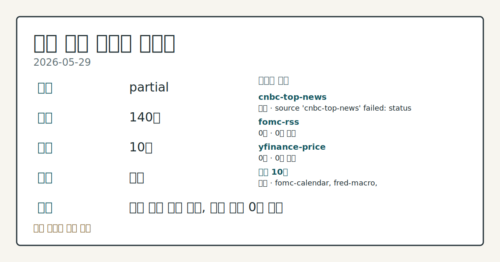
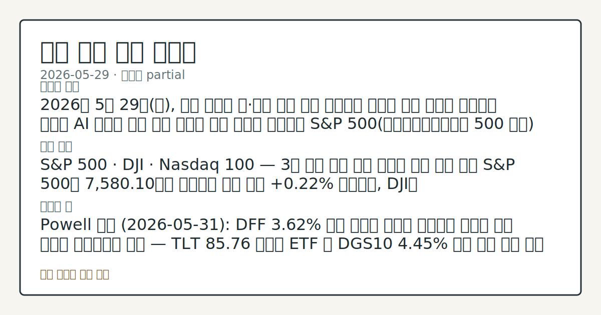
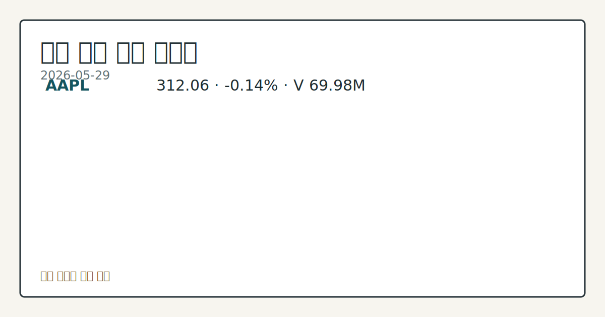

> 정보 제공용 자동 시황이며 매매 권유가 아닙니다.

# 2026-05-29 미국 증시 시황

**기준 시각**: 2026-05-29 NY · [2026-05-29T04:00Z, 2026-05-30T04:00Z)

| 종목 | 종가 | 변동 | 비고 |
|------|------|------|------|
| ^GSPC | 7,580.10 | +0.22% | ATH 경신 · +10.52% YTD |
| ^IXIC | 26,972.62 | +0.20% | ATH 경신 · +16.08% YTD |
| ^DJI | 51,032.50 | +0.72% | ATH 경신 · +5.48% YTD |
| AAPL | 312.06 | -0.14% | -0.14% from 52w high · +15.15% YTD |
| MSFT | 450.24 | +5.45% | -16.94% from 52w high · +8.64% MTD |

**세그먼트**: [국내 증시](../../../domestic-equity/2026/05/2026-05-29.md) | [미국 증시](2026-05-29.md) | [크립토](../../../crypto/2026/05/2026-05-29.md)

*이미지: 데이터 신뢰도 · 출처: investo 자체 생성 · 생성: investo 0.1.0 · 2026-05-31 UTC*

> **내 관심 자산 영향**: 9건 확인 (기본 바스켓) — AAPL: [structured-symbol] AAPL 312.06; AAPL: [structured-symbol] AAPL 312.06 (**-0.14%**); AMZN: [structured-symbol] AMZN 270.64; GOOGL: [structured-symbol] GOOGL 380.34; META: [structured-symbol] META 632.51 외
> **오늘의 결론**: 2026년 5월 29일(금), 미국 증시는 S&P 500(스탠더드앤드푸어스 500 지수) 7,580.10, NASDAQ(나스닥) 종합지수 26,972.62, DJI(다우존스산업평균지수) 51,032.50으로 3대 지수 모두 강보합 마감했다. [데이터부족]
> **핵심 동인**: MSFT 장중 대폭 상승 — 빅테크 내 수급 차별화 MSFT는 시가 **$432.55**에서 고점 **$450.33**, 종가 **$450.24**를 기록했으며 거래량 79,654,376주를 동반하며 강한 수급이 확인됐다.
> **주의할 점**: MSFT가 종가 **$450.24**로 마감한 뒤, 다음 거래일 고점 **$450.33** 돌파 지속 여부와 거래량 흐름 점검 SMH 반도체 ETF가 시가...

> **데이터 상태**: 부분 · 본문 사용 미집계 · 실패 1 · 0건 3

수집/품질 진단

> **데이터 상태**: 부분 — 수집 119건 / 소스 9개 / 누락: 없음 · 부분 — 일부 카테고리 미수집, 본문 일부 결론 보강 필요
> **소스 카운트**: 수집 대상 13 / 성공 9 / 0건 3 / 실패 1 / 본문 사용 미집계
> **소스 등급 분포**: S=3 / A=6
> **상세 사유**: 일부 소스 수집 실패, 일부 소스 0건 반환
> **소스별 상태**: cnbc-top-news 실패 (접근 제한), fomc-rss 0건, nasdaq-stocks-news 0건, yahoo-finance-news 0건, 정상 9개

## 한눈에 보기

- 미국 3대 지수 강보합 마감, DJI가 장중 **51,094.20** 고점을 기록한 뒤 **51,032.50**으로 종료
- **MSFT**(마이크로소프트)가 시가 **$432.55**에서 종가 **$450.24**로 장중 대폭 상승하며 빅테크 내 최대 강세 종목으로 부상
- **4.45%** 10Y 국채 금리가 전일 대비 **-0.03pp** 하락 — 5월 31일 Powell 의장 연설 관련 동향은 §④ 확인

## ⓪ 오늘의 매크로

- **미 국채 수익률** — UST curve 2026-05-29: 10Y 4.45%, 2Y10Y +0.47pp

## ⓪-B 채널 기준선

| 기준선 | 값 |
|------|------|
| S&P 500 | 7,580.10 (+0.22%) |
| 나스닥 종합 | 26,972.62 (+0.20%) |
| 다우존스 | 51,032.50 (+0.72%) |

> **크로스마켓 연결 고리**: 금리 이벤트가 할인율/달러 경로의 공통 변수로 남아 있습니다.

## ① 요약

*이미지: 시장 스냅샷 · 출처: investo 자체 생성 · 생성: investo 0.1.0 · 2026-05-31 UTC*

2026년 5월 29일, 미국 증시는 S&P 500 **7,580.10**, NASDAQ 종합지수 **26,972.62**, DJI **51,032.50**으로 3대 지수 모두 강보합 마감했다. 전일(2026-05-28) 기술주 주도 흐름의 연장선에서 MSFT가 장중 두드러진 상승을 보인 반면, SMH(반도체 업종 ETF)와 NVDA(엔비디아)는 시가를 하회하며 기술 섹터 내 차별화가 뚜렷했다. 10Y(10년물) 국채 금리는 **4.45%**로 소폭 하락했고, Vice Chair Bowman의 통화정책 연설도 금일 진행됐다. 빅테크 간 수급 분리와 반도체 약세가 교차하는 혼재 장세로 마무리됐다. [혼재]

## ② 전일 핵심 이슈

### MSFT 장중 대폭 상승 — 빅테크 내 수급 차별화

[MSFT](https://stooq.com/q/?s=msft.us)는 시가 **$432.55**에서 고점 **$450.33**, 종가 **$450.24**를 기록했으며 거래량 79,654,376주를 동반하며 강한 수급이 확인됐다. 이와 대조적으로 [NVDA](https://stooq.com/q/?s=nvda.us)는 시가 **$214.57**에서 종가 **$211.14**로 하락했고, SMH도 시가 **$606.03**에서 **$598.93**으로 내려앉았다. 전일 기술주 전반 강세에서 이날은 소프트웨어·클라우드(MSFT)와 반도체(NVDA·SMH) 간 수급이 분리되는 흐름이 관찰됐다.

> **그래서 의미는?** MSFT(마이크로소프트)만의 급등과 NVDA(엔비디아)·SMH의 하락이 동시에 나타나, 기술 섹터 내 종목 선별 흐름이 진행 중임을 보여준다.

### American Airlines 계약 체결 및 금융 의무 발생 공시

[American Airlines Group (8-K)](https://www.sec.gov/Archives/edgar/data/6201/000119312526248886/0001193125-26-248886-index.htm) 및 [AMERICAN AIRLINES, INC. (8-K)](https://www.sec.gov/Archives/edgar/data/4515/000119312526248886/0001193125-26-248886-index.htm)가 2026년 5월 29일자로 중요 확정 계약 체결(Item 1.01)과 직접 금융 의무 발생(Item 2.03)을 공시했다. 구체적인 계약 금액은 이번 입력 데이터에 포함되지 않았으나, 항공사 부채 구조 변화를 살피는 데 참고할 공시다.

### Fed 연준 발언 — Bowman 통화정책 연설 및 지표 현황

[Vice Chair for Supervision Michelle W. Bowman](https://www.federalreserve.gov/newsevents/calendar.htm)이 레이캬비크 경제 컨퍼런스에서 통화정책 연설을 진행했다. DFF(연방기금금리 실효금리)는 [**3.62%**](https://fred.stlouisfed.org/series/DFF)로 전일과 동일하게 유지됐으며, UNRATE(실업률)는 [**4.3%**](https://fred.stlouisfed.org/series/UNRATE)로 전기 대비 변동이 없었다. 기준금리와 고용 모두 보합을 나타내며 연준의 정책 전환 시기를 판단하기 어려운 구간임을 시사한다.

## ③ 섹터/수급 동향

### 섹터 ETF 시가 대비 등락 현황

| ETF | 업종 | 시가 | 종가 | 방향 |
|-----|------|------|------|------|
| [XLK](https://stooq.com/q/?s=xlk.us) | 기술주 | 189.33 | 191.02 | ▲ |
| [XLF](https://stooq.com/q/?s=xlf.us) | 금융주 | 51.28 | 51.58 | ▲ |
| [XLE](https://stooq.com/q/?s=xle.us) | 에너지 | 56.68 | 56.29 | ▼ |
| [XLV](https://stooq.com/q/?s=xlv.us) | 헬스케어 | 150.85 | 149.47 | ▼ |
| [XLY](https://stooq.com/q/?s=xly.us) | 임의소비재 | 121.60 | 120.87 | ▼ |
| [XLI](https://stooq.com/q/?s=xli.us) | 산업재 | 173.57 | 173.13 | ▼ |
| [SMH](https://stooq.com/q/?s=smh.us) | 반도체 | 606.03 | 598.93 | ▼ |
| [IWM](https://stooq.com/q/?s=iwm.us) | 소형주(Russell 2000) | 291.38 | 290.43 | ▼ |

> **그래서 의미는?** 기술(XLK)·금융(XLF)만 시가 대비 상승 마감하고, 반도체·에너지·헬스케어 등 대부분 섹터가 하락해 수급이 일부 대형 기술·금융주에...

### 섹터별 세부 흐름

XLK(기술주 ETF)는 **$191.02**로 상승 마감했으나, 반도체 업종 ETF SMH는 시가 **$606.03** 대비 **$598.93**으로 하락하며 반도체 하위 섹터의 차별화된 수급이 두드러졌다. XLF(금융주 ETF)는 **$51.58**로 소폭 강보합을 유지했다. 소형주 추종 IWM(Russell 2000 ETF)이 **$290.43**으로 소폭 하락하며 대형주 위주의 수급 구도가 이어졌다.

## ④ 지표·이벤트

### 국채 금리 및 채권 시장

[미국 재무부 금리 데이터](https://home.treasury.gov/resource-center/data-chart-center/interest-rates) 기준 2026년 5월 29일 UST(미 국채) 커브: 3M **3.69%**, 2Y **3.98%**, 10Y **4.45%**, 30Y **4.99%**. 장단기 스프레드(2Y10Y)는 **+0.47pp**. FRED(미국 연방준비제도 경제데이터베이스)의 DGS10(10년물 국채 수익률)은 전일 **4.48%**에서 [**4.45%**](https://fred.stlouisfed.org/series/DGS10)로 **-0.03pp** 하락했으며, TLT(장기 국채 ETF)는 **$85.76**으로 마감했다.

> **그래서 의미는?** 10Y 금리의 소폭 하락은 채권 수요가 소폭 회복됐음을 나타내며, 성장주 밸류에이션 부담 완화 요인으로 관찰된다.

### 원자재·달러·안전자산

WTI(서부텍사스중질유) 선물 CL=F는 **$89.46**, 금 선물 GC=F는 **$4,569.90**으로 마감했다. GLD(금 ETF)는 장중 **$421.82** 고점에서 후퇴해 종가 **$417.12**를 기록했다. UUP(달러지수 ETF, DXY 추종)는 **$27.66**으로 소폭 약세, USO(원유 ETF)는 **$129.09**로 마감했다.

### 연준 주요 일정

2026년 5월 29일 Bowman 연설(레이캬비크, 통화정책)이 진행됐다. 이번 주 이내 주요 일정으로는 2026년 5월 31일 [Powell 의장 JFK 용기 상 수상 연설](https://www.federalreserve.gov/newsevents/calendar.htm)(오후 8:30) 및 [Waller 이사 스테이블코인 패널](https://www.federalreserve.gov/newsevents/calendar.htm)(두브로브니크 경제회의, 오전 8:30)이 예정됐다. 이달 내 일정으로는 2026년 6월 3일 Beige Book(베이지북, 연준 지역 경기 보고서) 발표와 2026년 6월 17일 [FOMC(연방공개시장위원회) 회의 및 기자회견](https://www.federalreserve.gov/live-broadcast.htm)이 예고돼 있다.

## ⑤ 주요 종목

<!-- u50 lightweight-charts-embed: placeholders consumed by site_docs/assets/investo-chart-init.js -->

<noscript><em>인터랙티브 차트는 JavaScript가 활성화된 환경에서 표시됩니다. 위 정적 카드가 동일한 정보를 담고 있습니다.</em></noscript>

*이미지: 가격 스냅샷 · 출처: investo 자체 생성 · 생성: investo 0.1.0 · 2026-05-31 UTC*

### 확인 항목: 시가 대비 상승 흐름

| 종목 | 시가 | 종가 | 거래량 |
|------|------|------|--------|
| [MSFT](https://stooq.com/q/?s=msft.us) | $432.55 | $450.24 | 79,654,376 |
| [AAPL](https://stooq.com/q/?s=aapl.us) | $311.77 | $312.06 | 70,026,752 |

> **그래서 의미는?** MSFT가 대규모 장중 상승을 보인 가운데 AAPL(애플)은 소폭 강보합(**-0.14%**, 야후 파이낸스 기준)을 유지하며 빅테크 핵심...

### 확인 항목: 시가 대비 하락 흐름

| 종목 | 시가 | 종가 | 거래량 |
|------|------|------|--------|
| [NVDA](https://stooq.com/q/?s=nvda.us) | $214.57 | $211.14 | 289,410,624 |
| [TSLA](https://stooq.com/q/?s=tsla.us) | $439.85 | $435.79 | 45,176,821 |
| [GOOGL](https://stooq.com/q/?s=googl.us) | $385.24 | $380.34 | 44,415,846 |
| [AMZN](https://stooq.com/q/?s=amzn.us) | $271.29 | $270.64 | 54,749,561 |
| [META](https://stooq.com/q/?s=meta.us) | $633.50 | $632.51 | 19,806,536 |

### 체크리스트

- AAL(American Airlines Group): 주요 계약 체결 및 직접 금융 의무 발생 8-K 공시 — 세부 내용 확인 필요
- SBSW: 실적 발표 예정 (세부 데이터 미입력)

## ⑥ 오늘의 관전 포인트

| 관찰 신호 | 현재 | 상방 확인 조건 | 하방 확인 조건 | 신뢰도 | 섹션 내 관심 영향 |
| --- | --- | --- | --- | --- | --- |
| [MSFT](https://stooq.com/q/?s=… | — | 데이터부족 | 데이터부족 | 데이터부족 | — |
| [SMH](https://stooq.com/q/?s=s… | [SMH](https://stooq.com/q/?s=smh.us) 반도체 ETF가 시가 **$606.03** 대비 **$598.93**으로 하락한 흐름에서 NVDA 등 개별 반도체 종목 수급 회복 추세 확인 | [SMH](https://stooq.com/q/?s=smh.us) 반도체 ETF가 시가 **$606.03** 대비 **$598.93**으로 하락한 흐름에서 NVDA 등 개별 반도체 종목 수급 회복 추세 확인 | 데이터부족 | 높음 | — |
| 10Y 금리가 | 10Y 금리가 [**4.45%**](https://fred.stlouisfed.org/series/DGS10) 수준을 유지하는지, 이탈 시 성장주 밸류에이션 재평가 압력 변동 관찰 | 데이터부족 | 10Y 금리가 [**4.45%**](https://fred.stlouisfed.org/series/DGS10) 수준을 유지하는지, 이탈 시 성장주 밸류에이션 재평가 압력 변동 관찰 | 높음 | — |
| **2026-05-31** [Powell 의장 수상 연… | — | 데이터부족 | 데이터부족 | 데이터부족 | — |
| **2026-06-03** [베이지북](https://… | — | 데이터부족 | 데이터부족 | 데이터부족 | — |
| **2026-06-17** [FOMC 회의 및 기자회견… | — | 데이터부족 | 데이터부족 | 데이터부족 | — |

_관전 신호 3건 추가 — 본문 참조._
## ⑦ 면책조항
본 시황은 일반 정보 제공을 목적으로 자동 생성된 자료이며,
특정 종목·자산에 대한 매매 권유나 투자 자문이 아닙니다.
투자 결정과 그 결과에 대한 책임은 전적으로 본인에게 있으며,
본 시황의 내용에 따라 발생한 손실에 대해 작성자는 일체의 책임을 지지 않습니다.