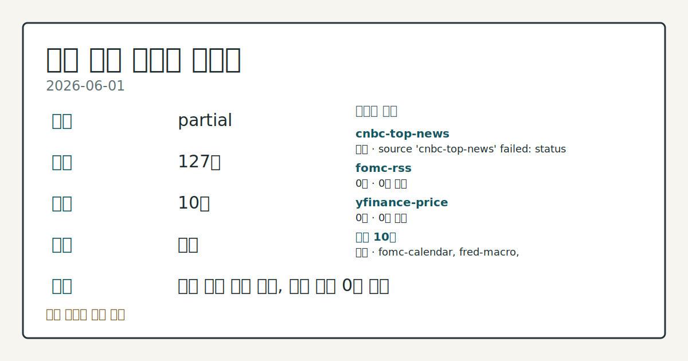
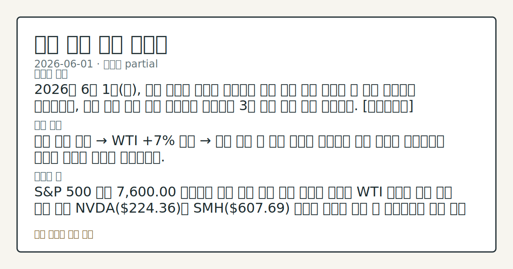

> 정보 제공용 자동 시황이며 매매 권유가 아닙니다.

# 2026-06-01 미국 증시 시황

**기준 시각**: 2026-06-01 NY · [2026-06-01T04:00Z, 2026-06-02T04:00Z)

| 종목 | 종가 | 변동 | 비고 |
|------|------|------|------|
| ^GSPC | 7,600.00 | +0.26% | ATH 경신 · +10.81% YTD |
| ^IXIC | 27,086.81 | +0.42% | ATH 경신 · +16.57% YTD |
| ^DJI | 51,078.90 | +0.09% | ATH 경신 · +5.57% YTD |
| AAPL | 306.31 | -1.84% | -1.98% from 52w high · +13.03% YTD |
| MSFT | 460.49 | +2.28% | -15.04% from 52w high |

**세그먼트**: [국내 증시](../../../domestic-equity/2026/06/2026-06-01.md) | [미국 증시](2026-06-01.md) | [크립토](../../../crypto/2026/06/2026-06-01.md)

*이미지: 데이터 신뢰도 · 출처: investo 자체 생성 · 생성: investo 0.1.0 · 2026-06-02 UTC*

> **내 관심 자산 영향**: 7건 확인 (기본 바스켓) — AAPL: [structured-symbol] AAPL 306.30; AMZN: [structured-symbol] AMZN 261.26; GOOGL: [structured-symbol] GOOGL 376.37; META: [structured-symbol] META 600.37; MSFT: [structured-symbol] MSFT 460.49 외
> **용어 가이드**: 이번 시황에서 처음 등장한 용어 — ETF(상장지수펀드), CPI(소비자물가), EPS(주당순이익)
> **오늘의 결론**: 2026년 6월 1일(월), 미국 증시는 이란의 미국과의 휴전 협상 중단 보도로 장 초반 변동성이 확대됐으나, 오후 들어 협상 재개 가능성이 부각되며 3대 지수 모두 상승 마감했다. [데이터부족]
> **핵심 동인**: 이란 협상 중단 → WTI **+7%** 급등 → 장중 반락 후 회복 이란이 미국과의 휴전 협상을 중단했다는 보도가 유가를 급격히 끌어올렸다.
> **주의할 점**: S&P 500 종가 7,600.00 수준에서 이란 협상 관련 추가 보도가 나오면 WTI 원유와 지수 연동 추세 확인 NVDA(**$224.36**)와...

> **데이터 상태**: 부분 · 본문 사용 미집계 · 실패 1 · 0건 2

수집/품질 진단

> **데이터 상태**: 부분 — 수집 127건 / 소스 10개 / 누락: 없음 · 부분 — 일부 카테고리 미수집, 본문 일부 결론 보강 필요
> **소스 카운트**: 수집 대상 13 / 성공 10 / 0건 2 / 실패 1 / 본문 사용 미집계
> **소스 등급 분포**: S=3 / A=7
> **상세 사유**: 일부 소스 수집 실패, 일부 소스 0건 반환
> **소스별 상태**: cnbc-top-news 실패 (접근 제한), fomc-rss 0건, yfinance-price 0건, 정상 10개

## 한눈에 보기

- S&P 500 **+0.36%**, Nasdaq 100 **+0.66%**, DJI(다우존스 산업평균지수) **+0.14%** — 이란 지정학 충격 속 기술주 주도 소폭 상승 마감
- 이란이 휴전 협상 중단을 선언하면서 WTI 원유가 장중 **+7%** 이상 급등했고, 협상 재개 기대로 지수 낙폭 만회
- **4.47%** 10Y 국채 금리·NVDA 강세·META 급락이 공존하는 수급 분화 — §④·§⑤에서 추세 확인

## ⓪ 오늘의 매크로

- **미 국채 수익률** — UST curve 2026-06-01: 10Y 4.47%, 2Y10Y +0.42pp

## ⓪-B 채널 기준선

| 기준선 | 값 |
|------|------|
| S&P 500 | 7,600.00 (+0.26%) |
| 나스닥 종합 | 27,086.81 (+0.42%) |
| 다우존스 | 51,078.90 (+0.09%) |

> **크로스마켓 연결 고리**: 금리 이벤트가 할인율/달러 경로의 공통 변수로 남아 있습니다.

## ① 요약

*이미지: 시장 스냅샷 · 출처: investo 자체 생성 · 생성: investo 0.1.0 · 2026-06-02 UTC*

2026년 6월 1일, 미국 증시는 이란의 미국과의 휴전 협상 중단 보도로 장 초반 변동성이 확대됐으나, 오후 들어 협상 재개 가능성이 부각되며 3대 지수 모두 상승 마감했다. S&P 500은 **+0.36%**, Nasdaq 100은 **+0.66%**, DJI는 **+0.14%**를 기록했다. 직전 주 이란 평화 협상 기대감으로 이어지던 상승 흐름이 이번 세션에서 지정학 리스크 재부각으로 한 차례 흔들린 뒤 회복한 모양새다. 반도체 ETF SMH(반도체 ETF)와 NVDA가 기술 섹터를 견인했으나, META는 시가 대비 큰 폭으로 하락하며 빅테크 내 수급 분화가 뚜렷했다. [혼재]

## ② 전일 핵심 이슈

### 이란 협상 중단 → WTI **+7%** 급등 → 장중 반락 후 회복

이란이 미국과의 휴전 협상을 중단했다는 보도가 유가를 급격히 끌어올렸다. WTI 원유는 장중 **+7%** 이상 급등했고, DXY(달러지수)도 안전자산 수요로 **+0.42%** 상승했다. 이에 S&P 500은 장중 **-0.08%**, DJI는 최대 **-0.43%**까지 밀렸으나, 오후에 협상이 완전히 결렬되지 않았다는 기대감이 확산되며 S&P 500 **+0.36%**, Nasdaq 100 **+0.66%**, DJI **+0.14%**로 마감했다([Nasdaq.com](https://www.nasdaq.com/articles/stocks-close-higher-hopes-continued-us-iran-ceasefire-negotiations)). 이 지정학 이슈는 `geopolitical_oil_macro` 범주에 해당하며, 미국 증시 관점에서는 원유 급등이 인플레이션 우려를 자극하는 경로로 작용했지만 협상 기대가 기술주 매수 흐름을 지지했다.

> **그래서 의미는?** 이란발 충격이 장 초반 강한 하락 압박을 만들었지만 협상 재개 기대가 빠르게 시장을 안정시켰음을 확인합니다.

### CPI · 실업률 최신 수치 확인

[FRED](https://fred.stlouisfed.org/series/CPIAUCSL) 기준 CPIAUCSL(소비자물가지수) 최근 발표치는 **332.407**(전월 **330.293** 대비 **+2.114** 상승)이며, UNRATE(실업률)는 **4.3%**로 전월과 동일 수준을 유지했다([FRED](https://fred.stlouisfed.org/series/UNRATE)). Federal Reserve(연방준비제도)의 금리 판단 기준에서 인플레이션이 여전히 오름세를 보이는 가운데 고용이 견조한 흐름을 이어가고 있어, 이달 금리 경로 해석에 중요한 변수로 남아 있다.

## ③ 섹터/수급 동향

### 반도체·기술 주도, 경기소비재·헬스케어 이탈

XLK(기술섹터 ETF)는 시가 **$192.32**에서 **$195.76**으로 마감했고, SMH는 **$596.10** 시가 대비 **$607.69**로 두드러진 상승을 기록했다. XLI(산업재 ETF) **$172.40**과 XLF(금융섹터 ETF) **$51.43**도 소폭 강세였다. 반면 XLY(경기소비재 ETF)는 시가 **$119.69**에서 **$118.19**로 하락했고, XLV(헬스케어 ETF)도 시가 **$148.52**에서 **$147.84**로 밀렸다. XLE(에너지섹터 ETF)는 원유 급등에도 시가 **$57.02** 대비 **$57.30**으로 소폭 상승에 그쳤다.

> **그래서 의미는?** 이날 수급은 반도체·기술에 집중되고 소비재·헬스케어는 수요가 이탈한 분화 패턴을 보였습니다.

### IWM · USO 변동 관찰

USO(원유 ETF)는 이란 보도 직후 장중 최고 **$138.87**까지 치솟았다가 **$135.50**으로 되밀렸는데, 오후 협상 재개 기대가 유가 상단을 압박한 결과다. IWM(소형주 ETF)은 시가 **$288.37**에서 **$288.95**로 소폭 상승 마감했다.

## ④ 지표·이벤트

### 금리·원자재·달러 현황

미국 10년물 국채 금리는 [Treasury](https://home.treasury.gov/resource-center/data-chart-center/interest-rates) 기준 **4.47%**, 2년물 **4.05%**, 30년물 **4.99%**, 2Y10Y 스프레드(장단기 금리차)는 **+0.42pp**다. TLT(장기국채 ETF)는 **$85.45**로 소폭 올랐다. GC=F(금선물)는 **$4,513.47**, GLD(금 ETF)는 **$411.26**, CL=F(WTI 원유선물)는 **$92.31**로 마감했다. UUP(달러 ETF)는 **$27.76**이다.

> **그래서 의미는?** **4.47%** 10Y 금리와 높은 원유 가격이 동시에 유지되며 고금리·고유가 환경이 주식 밸류에이션 상단을 제한하는 추세를 확인할 필요가...

### 이번 주·이번 달 주요 Fed 일정

6월 3일 Federal Reserve [Beige Book(경기동향보고서) 발표](https://www.federalreserve.gov/newsevents/calendar.htm)와 Michael S. Barr 이사 발언이 예정되어 있으며, 6월 6일 Barr 이사의 추가 연설도 잡혀 있다. 이달 최대 이벤트는 [6월 17일 FOMC(연방공개시장위원회) 이틀째 회의(6월 16~17일) 및 기자회견](https://www.federalreserve.gov/live-broadcast.htm)이다.

## ⑤ 주요 종목

<!-- u50 lightweight-charts-embed: placeholders consumed by site_docs/assets/investo-chart-init.js -->

<noscript><em>인터랙티브 차트는 JavaScript가 활성화된 환경에서 표시됩니다. 위 정적 카드가 동일한 정보를 담고 있습니다.</em></noscript>

### 관전 분류: 빅테크·주요 종목 종가

| 티커 | 종가 | 시가 | 방향 |
|------|------|------|------|
| AAPL | **$306.30** | $309.62 | 하락 |
| MSFT | **$460.49** | $464.84 | 하락 |
| GOOGL | **$376.37** | $376.52 | 보합 |
| AMZN | **$261.26** | $266.29 | 하락 |
| NVDA | **$224.36** | $215.73 | 상승 |
| META | **$600.37** | $630.40 | 하락 |
| TSLA | **$415.88** | $427.49 | 하락 |

> **그래서 의미는?** NVDA(엔비디아)가 이날 빅테크 중 두드러지게 상승한 반면, META(메타 플랫폼스)는 시가 **$630.40** 대비 **$600...

### 실적 발표

| 티커 | 발표 시점 | EPS 컨센서스 | 전년 동기 EPS |
|------|----------|------------|-------------|
| HPE | 장후(after-hours) | $0.44 | $0.29 |
| CRDO | 장후 | $0.77 | $0.20 |
| SAIC | 장전(pre-market) | $2.26 | $1.92 |

### 체크리스트: 개별 종목 동향

- AAL(아메리칸 에어라인스): **$14.34** (**-2.05%**) — 지수 상승일 역행 하락
- PSX(필립스 66): **$180.24** (**+2.48%**) — 원유 급등 수혜 흐름
- FDX(페덱스): **$338.49** (**-17.79%**) — 시장 대비 이례적 대폭 하락

## ⑥ 오늘의 관전 포인트

| 관찰 신호 | 현재 | 상방 확인 조건 | 하방 확인 조건 | 신뢰도 | 섹션 내 관심 영향 |
| --- | --- | --- | --- | --- | --- |
| S&P 500 종가 | — | 데이터부족 | 데이터부족 | 데이터부족 | — |
| NVDA와 SMH 반도체 강세가 | — | 데이터부족 | 데이터부족 | 데이터부족 | — |
| META 시가 | — | 데이터부족 | 데이터부족 | 데이터부족 | — |
| 10Y 금리 **4.47%** 수준이 | — | 데이터부족 | 데이터부족 | 데이터부족 | — |
| 6월 3일 Federal Reserve Beige Bo… | — | 데이터부족 | 데이터부족 | 데이터부족 | — |
| HPE · CRDO 장후 실적 수치와 EPS 컨센서스(… | — | 데이터부족 | 데이터부족 | 데이터부족 | — |

_관전 신호 3건 추가 — 본문 참조._
## ⑦ 면책조항
본 시황은 일반 정보 제공을 목적으로 자동 생성된 자료이며,
특정 종목·자산에 대한 매매 권유나 투자 자문이 아닙니다.
투자 결정과 그 결과에 대한 책임은 전적으로 본인에게 있으며,
본 시황의 내용에 따라 발생한 손실에 대해 작성자는 일체의 책임을 지지 않습니다.