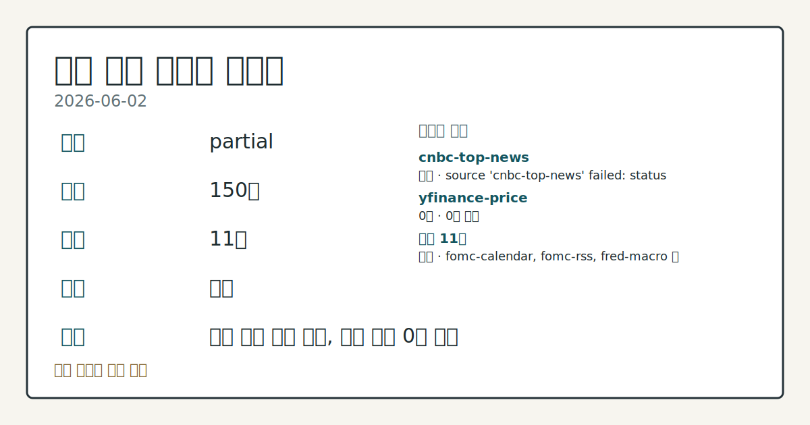
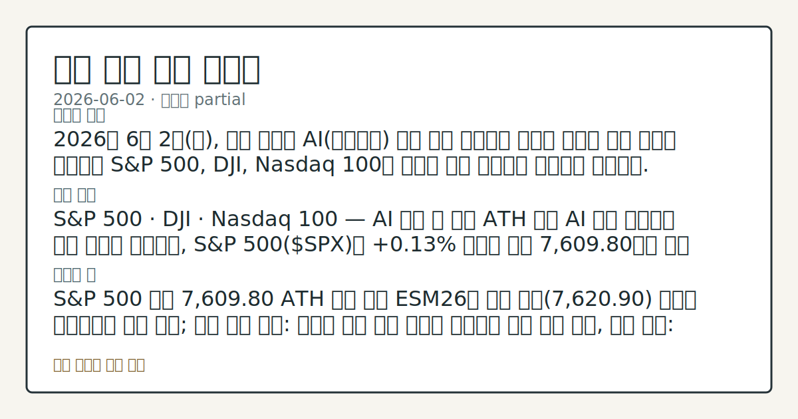

> 정보 제공용 자동 시황이며 매매 권유가 아닙니다.

# 2026-06-02 미국 증시 시황

**기준 시각**: 2026-06-02 NY · [2026-06-02T04:00Z, 2026-06-03T04:00Z)

| 종목 | 종가 | 변동 | 비고 |
|------|------|------|------|
| ^GSPC | 7,609.80 | +0.13% | ATH 경신 · +10.95% YTD |
| ^IXIC | 27,093.90 | +0.03% | ATH 경신 · +16.60% YTD |
| ^DJI | 51,307.80 | +0.45% | ATH 경신 · +6.05% YTD |
| AAPL | 315.20 | +2.90% | ATH 경신 · +16.31% YTD |
| MSFT | 441.30 | -4.17% | -18.59% from 52w high · -6.69% YTD |

**세그먼트**: [국내 증시](../../../domestic-equity/2026/06/2026-06-02.md) | [미국 증시](2026-06-02.md) | [크립토](../../../crypto/2026/06/2026-06-02.md)

*이미지: 데이터 신뢰도 · 출처: investo 자체 생성 · 생성: investo 0.1.0 · 2026-06-03 UTC*

> **내 관심 자산 영향**: 7건 확인 (기본 바스켓) — AAPL: [structured-symbol] AAPL 315.20; AMZN: [structured-symbol] AMZN 256.50; GOOGL: [structured-symbol] GOOGL 361.81; META: [structured-symbol] META 597.64; MSFT: [structured-symbol] MSFT 441.30 외
> **오늘의 결론**: 2026년 6월 2일(화), 미국 증시는 AI(인공지능) 투자 지출 기대감과 예상을 웃도는 고용 지표를 배경으로 S&P 500, DJI, Nasdaq 100이 나란히 사상 최고치를 경신하며 마감했다. [데이터부족]
> **핵심 동인**: S&P 500 · DJI · Nasdaq 100 — AI 열풍 속 동반 ATH 경신 AI 지출 기대감과 고용 강세를 배경으로, S&P 500($SPX)은 **+0.13%** 상승한 종가 7,609.80으로 사상 최고치를 경신했다.
> **주의할 점**: S&P 500 종가 7,609.80 ATH 경신 이후 ESM26이 당일 고가(7,620.90) 부근을 지지하는지 추세 확인; 상방 확인 조건: 선물이 고가 수준...

> **데이터 상태**: 부분 · 본문 사용 미집계 · 실패 1 · 0건 1

수집/품질 진단

> **데이터 상태**: 부분 — 수집 150건 / 소스 11개 / 누락: 없음 · 부분 — 일부 카테고리 미수집, 본문 일부 결론 보강 필요
> **소스 카운트**: 수집 대상 13 / 성공 11 / 0건 1 / 실패 1 / 본문 사용 미집계
> **소스 등급 분포**: S=4 / A=7
> **상세 사유**: 일부 소스 수집 실패, 일부 소스 0건 반환
> **소스별 상태**: cnbc-top-news 실패 (접근 제한), yfinance-price 0건, 정상 11개

## 한눈에 보기

- 미국 3대 지수 동반 신고점: S&P 500 **+0.13%**(종가 **7,609.80**), DJI **+0.45%**, Nasdaq 100 **+0.48%** — AI 테마·고용 강세 주도
- AAPL이 시가 **$307.46**에서 종가 **$315.20**까지 상승하며 당일 빅테크 중 두드러진 흐름 기록
- 오늘(6월 3일) Beige Book(경기종합보고서) 발표 및 JOLTS(구인이직보고서) 23개월 최고치가 6월 17일 FOMC(연방공개시장위원회) 회의 앞두고 Federal Reserve(연방준비제도) 금리 경로 불강한성 변수로 부상 — 본문 §④ 확인

## ⓪ 오늘의 매크로

- **미 국채 수익률** — UST curve 2026-06-02: 10Y 4.46%, 2Y10Y +0.41pp

## ⓪-B 채널 기준선

| 기준선 | 값 |
|------|------|
| S&P 500 | 7,609.80 (+0.13%) |
| 나스닥 종합 | 27,093.90 (+0.03%) |
| 다우존스 | 51,307.80 (+0.45%) |

> **크로스마켓 연결 고리**: 금리 이벤트가 할인율/달러 경로의 공통 변수로 남아 있습니다.

## ① 요약

*이미지: 시장 스냅샷 · 출처: investo 자체 생성 · 생성: investo 0.1.0 · 2026-06-03 UTC*

2026년 6월 2일, 미국 증시는 AI 투자 지출 기대감과 예상을 웃도는 고용 지표를 배경으로 S&P 500, DJI, Nasdaq 100이 나란히 사상 최고치를 경신하며 마감했다. 전일(6월 1일) 이란 협상 중단 우려로 증시가 출렁였던 흐름에서 전환하여, 이번 세션에서는 AI 테마 수급과 고용 강세가 지수를 이끌었다. 빅테크 중 AAPL은 저가 대비 큰 폭으로 회복 마감하며 차별화됐고, SMH(반도체 섹터 ETF)를 중심으로 기술·반도체 섹터가 강세를 나타냈다. 에너지 섹터도 이란 협상 불강한성에 따른 유가 반등에 연동해 동반 상승했다. [상승 관찰]

## ② 전일 핵심 이슈

### S&P 500 · DJI · Nasdaq 100 — AI 열풍 속 동반 ATH 경신

[AI 지출 기대감과 고용 강세](https://www.nasdaq.com/articles/stock-indexes-post-new-record-highs-amid-ai-enthusiasm)를 배경으로, S&P 500은 **+0.13%** 상승한 종가 **7,609.80**으로 사상 최고치를 경신했다. DJI는 **+0.45%** 오른 **51,307.80**, Nasdaq 100($IUXX)은 **+0.48%** 상승한 **27,093.90**에 마감하며 나란히 신고점을 기록했다. ESM26(미니S&P선물)도 **+0.14%** 상승으로 마감했다.

> **그래서 의미는?** 3대 지수 동반 신고점 경신은 AI 수급이 지정학·유가 불안을 흡수하며 시장의 상승 모멘텀이 유지되고 있다는 흐름으로 관찰된다.

### JOLTS 구인 23개월 최고 → DXY(달러지수) 회복 · 매파 신호

4월 JOLTS 구인 건수가 [예상을 웃도는 23개월 만의 최고치](https://www.nasdaq.com/articles/dollar-recovers-us-labor-market-strength)로 확인되면서 DXY는 **+0.02%** 소폭 회복됐다. 이 고용 강세 지표는 Federal Reserve의 정책 경로에 hawkish(매파적) 신호로 해석됐다.

### 유가 반등 — 이란 협상 불강한성 지속

이란 평화 협상 타결 시점 불강한성이 이어지며, [CLN26(WTI 원유 7월물)이 **+1.60** 달러(**+1.74%**) 상승](https://www.nasdaq.com/articles/crude-oil-prices-rally-us-iran-peace-uncertainty)한 채 마감했다. RBN26(RBOB 가솔린 7월물)도 **+0.0596** 달러 올랐다. 전일 협상 중단 보도 이후 유가 상승이 지속되며 에너지 수급 우려가 이어지고 있다.

## ③ 섹터/수급 동향

### 반도체·기술주 주도 — SMH 강세 두드러짐

SMH는 시가 619.69에서 종가 **632.12**(고가 632.57)로 당일 기술 섹터 내 상승 폭이 두드러졌다. XLK(기술주 ETF)도 종가 **198.21**(시가 196.45)로 견조한 흐름을 이어갔다.

> **그래서 의미는?** SMH의 상대적 강세는 AI 인프라 기대감이 반도체 섹터에 집중 유입되고 있다는 수급 신호로 관찰된다.

### 에너지·산업재 강세 · 방어 섹터 상대 약세

XLE(에너지 ETF)는 종가 **57.96**(시가 57.19)으로 유가 상승에 연동해 올랐다. XLI(산업재 ETF)도 **174.19**(시가 172.94)로 고가(174.50)에 근접 마감했다. 반면 XLV(헬스케어 ETF)는 종가 **146.40**(시가 146.75), XLY(임의소비재 ETF)는 **117.59**(시가 117.52)로 각각 시가 대비 소폭 하락 마감하며 방어·소비재 섹터에서 수급 분산이 확인됐다. XLF(금융 ETF)는 **51.46**으로 견조하게 마감했다.

## ④ 지표·이벤트

### 연방기금금리 · 실업률 · 생산자물가

[DFF(연방기금금리)](https://fred.stlouisfed.org/series/DFF)는 **3.62%**(2026-06-01 기준)로 전일 대비 변동 없이 현 수준을 유지하고 있다. [UNRATE(실업률)](https://fred.stlouisfed.org/series/UNRATE)은 **4.3%**(2026-04 기준, 전월 동일)로 고용시장 안정이 확인된다. [PPIFID(생산자물가지수-완제품)](https://fred.stlouisfed.org/series/PPIFID)는 2026-04 기준 **156.878**로 전월 **154.656** 대비 **+2.222** 상승하며 생산 비용 압력이 높아지는 추세를 나타냈다.

> **그래서 의미는?** PPIFID 상승 추세가 소비자물가로 전이될 경우 Federal Reserve의 금리 인하 타이밍이 추가로 지연될 수 있는 변수로 점검한다.

### 연준 일정 — Beige Book · 연준 인사 발언

오늘 [Governor Michael S. Barr의 CDBA 포럼 발언(오전 9시)](https://www.federalreserve.gov/newsevents/calendar.htm)과 [Beige Book 발표(오후 2시)](https://www.federalreserve.gov/newsevents/calendar.htm)가 예정돼 있다. 내일(6월 4일) [Vice Chair for Supervision Michelle W. Bowman의 하원 금융서비스위원회 청문회](https://www.federalreserve.gov/newsevents/calendar.htm) 증언이 있으며, 6월 17일에는 [FOMC 정례회의 및 기자회견](https://www.federalreserve.gov/live-broadcast.htm)이 확정돼 있다.

## ⑤ 주요 종목

<!-- u50 lightweight-charts-embed: placeholders consumed by site_docs/assets/investo-chart-init.js -->

<noscript><em>인터랙티브 차트는 JavaScript가 활성화된 환경에서 표시됩니다. 위 정적 카드가 동일한 정보를 담고 있습니다.</em></noscript>

### 확인 항목 — 주요 빅테크 종가

| 티커 | 종가 | 시가 | 고가 | 저가 |
|------|-----:|-----:|-----:|-----:|
| AAPL | 315.20 | 307.46 | 315.45 | 306.73 |
| MSFT | 441.30 | 446.88 | 453.50 | 440.43 |
| GOOGL | 361.81 | 366.59 | 373.53 | 358.44 |
| AMZN | 256.50 | 257.16 | 261.20 | 254.37 |
| NVDA | 222.80 | 227.18 | 232.28 | 221.35 |
| META | 597.64 | 603.24 | 608.88 | 596.68 |
| TSLA | 423.74 | 418.22 | 424.40 | 413.65 |

> **그래서 의미는?** AAPL(애플)만 시가 대비 종가가 크게 상승한 반면 MSFT(마이크로소프트)·GOOGL(알파벳)·NVDA(엔비디아)·META는 고가 대비...

### 실적 발표 체크리스트

- **PANW**(Palo Alto Networks): 오늘 시간외 발표 예정, EPS 예측 **$0.43** / 전년 동기 **$0.43**
- **DG**(Dollar General Corporation): 오늘 장 전 발표 예정, EPS 예측 **$1.89** / 전년 동기 **$1.78**
- **ULTA**(Ulta Beauty, Inc.): 오늘 시간외 발표 예정, EPS 예측 **$6.90** / 전년 동기 **$6.70**

## ⑥ 오늘의 관전 포인트

| 관찰 신호 | 현재 | 상방 확인 조건 | 하방 확인 조건 | 신뢰도 | 섹션 내 관심 영향 |
| --- | --- | --- | --- | --- | --- |
| S&P 500 종가 | — | 데이터부족 | 데이터부족 | 데이터부족 | — |
| DFF **3.62%** 동결 기조에서 JOLTS 23… | — | 데이터부족 | 데이터부족 | 데이터부족 | — |
| 오늘 오후 2시 Beige Book 발표 내용이 | — | 데이터부족 | 데이터부족 | 데이터부족 | — |
| PANW·ULTA 시간외 실적을 EPS 예측치(각각 *… | — | 데이터부족 | 데이터부족 | 데이터부족 | — |
| PPIFID **156.878** 상승세가 | — | 데이터부족 | 데이터부족 | 데이터부족 | — |
| 내일 Bowman 부의장 청문회 발언에서 건전성 감독 … | — | 데이터부족 | 데이터부족 | 데이터부족 | — |

_관전 신호 3건 추가 — 본문 참조._
## ⑦ 면책조항
본 시황은 일반 정보 제공을 목적으로 자동 생성된 자료이며,
특정 종목·자산에 대한 매매 권유나 투자 자문이 아닙니다.
투자 결정과 그 결과에 대한 책임은 전적으로 본인에게 있으며,
본 시황의 내용에 따라 발생한 손실에 대해 작성자는 일체의 책임을 지지 않습니다.