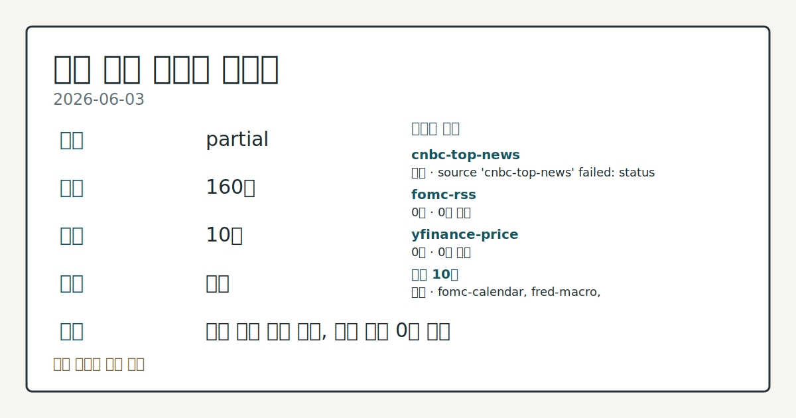
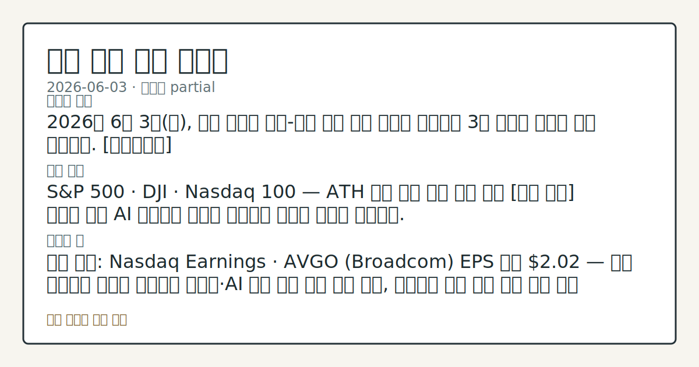

> 정보 제공용 자동 시황이며 매매 권유가 아닙니다.

# 2026-06-03 미국 증시 시황

**기준 시각**: 2026-06-03 NY · [2026-06-03T04:00Z, 2026-06-04T04:00Z)

| 종목 | 종가 | 변동 | 비고 |
|------|------|------|------|
| ^GSPC | 7,553.70 | -0.74% | -0.74% from 52w high · +10.14% YTD |
| ^IXIC | 26,853.98 | -0.89% | -0.89% from 52w high · +15.57% YTD |
| ^DJI | 50,687.10 | -1.21% | -1.21% from 52w high |
| AAPL | 310.28 | -1.57% | -1.57% from 52w high · +14.48% YTD |
| MSFT | 427.61 | -3.17% | +19.78% from 52w low · -9.64% YTD |

**세그먼트**: [국내 증시](../../../domestic-equity/2026/06/2026-06-03.md) | [미국 증시](2026-06-03.md) | [크립토](../../../crypto/2026/06/2026-06-03.md)

*이미지: 데이터 신뢰도 · 출처: investo 자체 생성 · 생성: investo 0.1.0 · 2026-06-04 UTC*

> **내 관심 자산 영향**: 7건 확인 (기본 바스켓) — AAPL: [structured-symbol] AAPL 310.28; AMZN: [structured-symbol] AMZN 250.02; GOOGL: [structured-symbol] GOOGL 358.99; META: [structured-symbol] META 623.01; MSFT: [structured-symbol] MSFT 427.61 외
> **오늘의 결론**: 2026년 6월 3일(수), 미국 증시는 미국-이란 평화 협상 기대가 무너지며 3대 지수가 일제히 하락 마감했다. [데이터부족]
> **핵심 동인**: S&P 500 · DJI · Nasdaq 100 — ATH 랠리 하루 만에 반전 전일 [상승 관찰] 기조를 이끈 AI 기대감이 오늘은 지정학적 충격에 완전히 밀려났다.
> **주의할 점**: 확인 소스: Nasdaq Earnings · AVGO (Broadcom) EPS 전망 **$2.02** — 실제 발표치가 전망을 상회하면 반도체·AI 섹터 수급...

> **데이터 상태**: 부분 · 본문 사용 미집계 · 실패 1 · 0건 2

수집/품질 진단

> **데이터 상태**: 부분 — 수집 160건 / 소스 10개 / 누락: 없음 · 부분 — 일부 카테고리 미수집, 본문 일부 결론 보강 필요
> **소스 카운트**: 수집 대상 13 / 성공 10 / 0건 2 / 실패 1 / 본문 사용 미집계
> **소스 등급 분포**: S=3 / A=7
> **상세 사유**: 일부 소스 수집 실패, 일부 소스 0건 반환
> **소스별 상태**: cnbc-top-news 실패 (접근 제한), fomc-rss 0건, yfinance-price 0건, 정상 10개

## 한눈에 보기

- 미국 3대 지수 일제히 하락, S&P 500 **-0.74%** · DJI **-1.21%** · Nasdaq 100 **-0.29%** — 전일 ATH 랠리에서 하루 만에 반전
- 미국-이란 신규 교전 확인으로 WTI 원유 선물 **+2.41%** 급등, 1.5주 최고치 기록
- 장 마감 후 **AVGO** EPS 전망 **$2.02** · **CRWD** 실적 발표 예정 — 본문 §⑤ 참조

## ⓪ 오늘의 매크로

- **FOMC 일정** — 2026-06-17 — FOMC Meeting
- **미 국채 수익률** — UST curve 2026-06-03: 10Y 4.49%, 2Y10Y +0.41pp

## ⓪-B 채널 기준선

| 기준선 | 값 |
|------|------|
| S&P 500 | 7,553.70 (-0.74%) |
| 나스닥 종합 | 26,853.98 (-0.89%) |
| 다우존스 | 50,687.10 (-1.21%) |

> **크로스마켓 연결 고리**: 금리 이벤트가 할인율/달러 경로의 공통 변수로 남아 있습니다.

## ① 요약

*이미지: 시장 스냅샷 · 출처: investo 자체 생성 · 생성: investo 0.1.0 · 2026-06-04 UTC*

2026년 6월 3일, 미국 증시는 미국-이란 평화 협상 기대가 무너지며 3대 지수가 일제히 하락 마감했다. 전일(2026-06-02) AI(인공지능) 투자 기대감을 재료로 S&P 500(스탠더드앤드푸어스 500 지수) · DJI(다우존스산업평균지수) · Nasdaq 100(나스닥 100 지수)이 동반 사상 최고치(ATH)를 경신했으나, 이란과의 신규 교전 확인이 단 하루 만에 흐름을 뒤집었다. WTI(서부 텍사스산 원유) 선물 급등과 증시 하락이 동시에 나타났으며 에너지·방어 섹터로의 순환매가 관찰됐다. [하락 관찰]

## ② 전일 핵심 이슈

### S&P 500 · DJI · Nasdaq 100 — ATH 랠리 하루 만에 반전

전일 [상승 관찰] 기조를 이끈 AI 기대감이 오늘은 지정학적 충격에 완전히 밀려났다. 미국-이란 신규 교전이 [평화 협상 무산 우려](https://www.nasdaq.com/articles/stocks-retreat-us-iran-peace-hopes-doubt)를 재점화하며 주식 자금 일부가 에너지·방어 섹터로 이동하는 흐름이 섹터 ETF(상장지수펀드) 데이터에서 확인됐다.

> **그래서 의미는?** 협상 기대로 올리고 교전 확인으로 하루 만에 뒤집히는 패턴이 반복되며, 이란 관련 뉴스가 단기 지수 방향의 핵심 촉매임을 다시 확인했습니다.

[S&P 500 (^GSPC)](https://stooq.com/q/?s=%5Espx) **7,553.70** (**-0.74%**), [DJI ](https://stooq.com/q/?s=%5Edji) **50,687.10** (**-1.21%**), [Nasdaq 100 ](https://stooq.com/q/?s=%5Endq) **26,853.97** (**-0.29%**)으로 마감했다. DJI 낙폭이 가장 컸고 Nasdaq 100은 상대적으로 방어됐다.

### WTI 원유 급등 및 연준 주요 지표 확인

[이란 교전 소식](https://www.nasdaq.com/articles/fresh-clashes-between-us-and-iran-boost-crude-oil-prices)으로 July WTI 원유 선물(CLN26)이 **+2.41%** 올라 1.5주 최고치에 올랐고, July RBOB 가솔린(RBN26)은 **-0.40%** 소폭 하락했다.

필수 지표 확인: [DFF(연방기금금리)](https://fred.stlouisfed.org/series/DFF) **3.62%** 전일 대비 동결, [CPIAUCSL(소비자물가지수)](https://fred.stlouisfed.org/series/CPIAUCSL) **332.407**(전월 **330.293** 대비 **+2.114**), [PPIFID(생산자물가지수)](https://fred.stlouisfed.org/series/PPIFID) **156.878**(전월 **154.656** 대비 **+2.222**), [UNRATE(실업률)](https://fred.stlouisfed.org/series/UNRATE) **4.3%** 동결. 소비자·생산자 물가 모두 전월 대비 상승한 점은 연준(Federal Reserve)의 금리 경로에서 신중론을 강화하는 배경이 된다.

연준 베이지북(Beige Book · 지역 경기 동향 보고서)은 오늘 오후 2시 공개됐으며, Governor Michael S. Barr도 오전 9시 CDBA Peer Forum에서 발언했다.

## ③ 섹터/수급 동향

### 지정학 리스크 속 섹터 차별화

> **그래서 의미는?** 에너지가 유가 급등 수혜를, 헬스케어가 방어주로 자금 흡수를 각각 관찰한 반면 기술·금융은 동반 하락해 위험 회피 성격의 순환매가 나타났습니다.

[XLE(에너지 섹터 ETF)](https://stooq.com/q/?s=xle.us) **58.73** (시가 **58.28** → 종가 **58.73**)으로 상승 마감해 유가 급등 수혜를 받았다. [XLV(헬스케어 ETF)](https://stooq.com/q/?s=xlv.us)도 **147.52** (시가 **146.16** → 종가 **147.52**)로 방어주 특성을 보이며 상승했다.

반면 [XLK(기술 섹터 ETF)](https://stooq.com/q/?s=xlk.us) **196.27** (시가 **198.37** → 저가 **194.53** 포함 하락 마감), [XLF(금융 ETF)](https://stooq.com/q/?s=xlf.us) **50.87** (시가 **51.14** → 종가 **50.87**)로 약세였다. [XLY(임의소비재 ETF)](https://stooq.com/q/?s=xly.us) **116.73** (시가 **116.63** → 종가 **116.73**)은 보합권에서 마감했다.

## ④ 지표·이벤트

### 국채금리 소폭 하락 및 연준 일정

> **그래서 의미는?** 금리가 소폭 내렸지만 여전히 높은 수준이어서, 이번 주 고용 지표와 내주 물가 발표가 연준 정책 방향의 핵심 변수로 부각됩니다.

[DGS10(미국 10년물 국채금리)](https://fred.stlouisfed.org/series/DGS10) **4.46%** (전일 **4.47%** 대비 **-**0.01%**p**)로 소폭 하락했다. 내일(2026-06-04) Vice Chair for Supervision Michelle W. Bowman이 [미 하원 금융서비스위원회(U.S. House Financial Services Committee) 청문회](https://www.federalreserve.gov/newsevents/calendar.htm)에서 감독기관 감찰 증언에 나선다.

### 이번 주~이번 달 주요 일정

- **2026-06-05**: [Employment Situation(고용 보고서)](https://fred.stlouisfed.org/release?rid=50) 발표
- **2026-06-10**: [Consumer Price Index(소비자물가지수)](https://fred.stlouisfed.org/release?rid=10) 발표
- **2026-06-11**: [Producer Price Index(생산자물가지수)](https://fred.stlouisfed.org/release?rid=46) 발표
- **2026-06-17**: [FOMC(연방공개시장위원회) 정책 결정 회의 및 기자회견](https://www.federalreserve.gov/live-broadcast.htm)
- **2026-06-25**: [Gross Domestic Product(국내총생산)](https://fred.stlouisfed.org/release?rid=53) 발표

## ⑤ 주요 종목

<!-- u50 lightweight-charts-embed: placeholders consumed by site_docs/assets/investo-chart-init.js -->

<noscript><em>인터랙티브 차트는 JavaScript가 활성화된 환경에서 표시됩니다. 위 정적 카드가 동일한 정보를 담고 있습니다.</em></noscript>

> **그래서 의미는?** AAPL(애플) · MSFT(마이크로소프트) · NVDA(엔비디아) 등 대형 기술주 대부분이 시가 대비 하락한 반면 META(메타)와...

### 시가 대비 하락 확인 항목

| 티커 | 종가 | 시가 | 저가 |
|------|------|------|------|
| [AAPL](https://stooq.com/q/?s=aapl.us) | $310.28 | $314.18 | $308.85 |
| [MSFT](https://stooq.com/q/?s=msft.us) | $427.61 | $438.45 | $424.25 |
| [GOOGL](https://stooq.com/q/?s=googl.us) | $358.99 | $362.03 | $358.08 |
| [AMZN](https://stooq.com/q/?s=amzn.us) | $250.02 | $254.70 | $247.71 |
| [NVDA](https://stooq.com/q/?s=nvda.us) | $214.82 | $221.72 | $214.51 |

### 시가 대비 상승 확인 항목

| 티커 | 종가 | 시가 | 고가 |
|------|------|------|------|
| [META](https://stooq.com/q/?s=meta.us) | $623.01 | $602.31 | $624.15 |
| [TSLA](https://stooq.com/q/?s=tsla.us) | $423.76 | $418.70 | $433.60 |

### 실적 발표 체크리스트 (오늘 장 마감 후)

- [AVGO ](https://www.nasdaq.com/market-activity/stocks/avgo/earnings): EPS 전망 **$2.02** (전년 동기 **$1.33**)
- [CRWD (CrowdStrike Holdings, Inc.)](https://www.nasdaq.com/market-activity/stocks/crwd/earnings): EPS 전망 **$0.13** (전년 동기 **-**$0.2**3**)

## ⑥ 오늘의 관전 포인트

| 관찰 신호 | 현재 | 상방 확인 조건 | 하방 확인 조건 | 신뢰도 | 섹션 내 관심 영향 |
| --- | --- | --- | --- | --- | --- |
| AVGO ](https://www.nasdaq.com/… | 확인 소스: Nasdaq Earnings · AVGO  EPS 전망 **$2.02** — 실제 발표치가 전망을 상회하면 반도체·AI 섹터 수급 회복 흐름 관찰, 하회하면 기술 섹터 추가 조정 추이 데이터 비교. 관심 영향: 내일 빅테크 수급 방향 점검. | AVGO ](https://www.nasdaq.com/market-activity/stocks/avgo/earnings) EPS 전망 **$2.02** — 실제 발표치가 전망을 상회하면 반도체 | AI 섹터 수급 회복 흐름 관찰, 하회하면 기술 섹터 추가 조정 추이 데이터 비교 | 높음 | 관심 영향: 내일 빅테크 수급 방향 점검. |
| CLN26 ](https://www.nasdaq.com… | 확인 소스: Nasdaq News · CLN26  **+2.41%** 기준 — 이란 교전 수위 확대로 WTI 추가 상승 시 XLE 에너지 ETF 상방 흐름 관찰, 협상 재개 신호 등장 시 유가 하방 되돌림 추이 비교. 관심 영향: 인플레이션 경로 및 섹터 순환매 방향 추적. | CLN26 ](https://www.nasdaq.com/articles/fresh-clashes-between-us-and-iran-boost-crude-oil-prices) **+2.41%** 기준 — 이란 교전 수위 확대로 WTI 추가 상승 시 XLE 에너지 ETF 상방 흐름 관찰, 협상 재개 신호 등장 시 유가 하방 되돌림 추이 비교 | CLN26 ](https://www.nasdaq.com/articles/fresh-clashes-between-us-and-iran-boost-crude-oil-prices) **+2.41%** 기준 — 이란 교전 수위 확대로 WTI 추가 상승 시 XLE 에너지 ETF 상방 흐름 관찰, 협상 재개 신호 등장 시 유가 하방 되돌림 추이 비교 | 높음 | 관심 영향: 인플레이션 경로 및 섹터 순환매 방향 추적. |
| DGS10](https://fred.stlouisfed… | 확인 소스: FRED · DGS10 10년물 국채금리 **4.46%** — 고용 보고서(2026-06-05) 발표 후 전일 수준 **4.47%**를 재상회하면 성장주 밸류에이션(valuation · 적정가치) 부담 압력 관찰, **4.46%** 아래로 추가 하락하면 기술 섹터 수급 회복 흐름 확인. 관심 영향: NVDA · MSFT 등 성장주 종가 추이 점검. | DGS10](https://fred.stlouisfed.org/series/DGS10) 10년물 국채금리 **4.46%** — 고용 보고서(2026-06-05) 발표 후 전일 수준 **4.47%**를 재상회하면 성장주 밸류에이션(valuation | 데이터부족 | 높음 | 관심 영향: NVDA |
| Vice Chair Bowman 청문회](https:/… | 확인 소스: Federal Reserve · Vice Chair Bowman 청문회 2026-06-04 예정 — 발언 기조가 매파적(금리 동결 강조)이면 DFF **3.62%** 동결 연장 기대 관찰, 비둘기파적(완화 여지 시사)이면 금리 인하 기대 복원 흐름 추적. 관심 영향: 금리 민감 금융·유틸리티 섹터 수급 방향 비교. | 데이터부족 | 데이터부족 | 높음 | 관심 영향: 금리 민감 금융 |
| Employment Situation](https://… | 확인 소스: FRED · Employment Situation 2026-06-05 예정, UNRATE 현행 **4.3%** 기준 — 발표치가 컨센서스(시장 예상치)를 상회하면 경기 견조 신호와 연준 동결 지속 기대 관찰, 하회하면 경기 둔화 우려 흐름 데이터 비교. 관심 영향: S&P 500 전반 수급 방향 점검. | Employment Situation](https://fred.stlouisfed.org/release?rid=50) 2026-06-05 예정, UNRATE 현행 **4.3%** 기준 — 발표치가 컨센서스(시장 예상치)를 상회하면 경기 견조 신호와 연준 동결 지속 기대 관찰, 하회하면 경기 둔화 우려 흐름 데이터 비교 | Employment Situation](https://fred.stlouisfed.org/release?rid=50) 2026-06-05 예정, UNRATE 현행 **4.3%** 기준 — 발표치가 컨센서스(시장 예상치)를 상회하면 경기 견조 신호와 연준 동결 지속 기대 관찰, 하회하면 경기 둔화 우려 흐름 데이터 비교 | 높음 | 관심 영향: S&P 500 전반 수급 방향 점검. |
## ⑦ 면책조항
본 시황은 일반 정보 제공을 목적으로 자동 생성된 자료이며,
특정 종목·자산에 대한 매매 권유나 투자 자문이 아닙니다.
투자 결정과 그 결과에 대한 책임은 전적으로 본인에게 있으며,
본 시황의 내용에 따라 발생한 손실에 대해 작성자는 일체의 책임을 지지 않습니다.