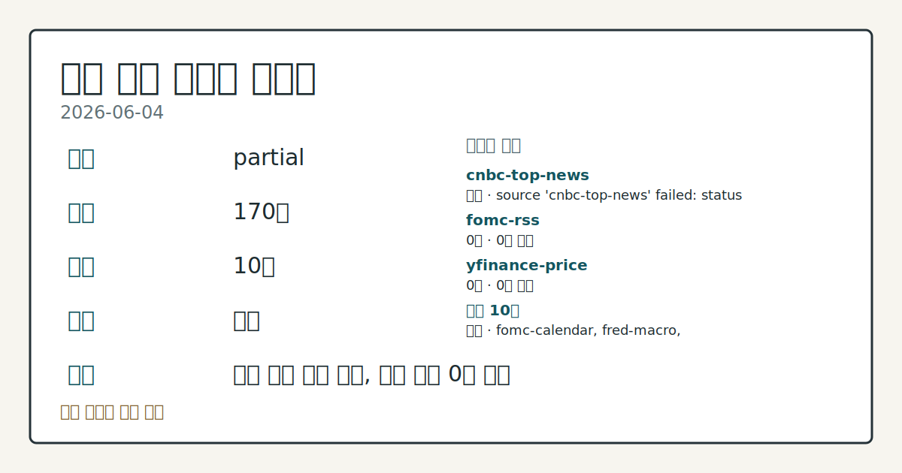
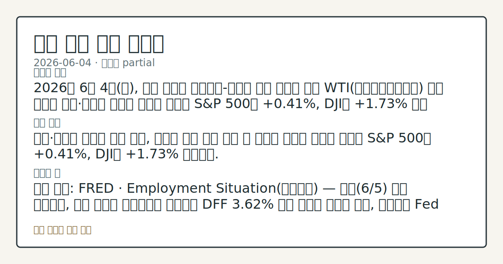

> 정보 제공용 자동 시황이며 매매 권유가 아닙니다.

# 2026-06-04 미국 증시 시황

**기준 시각**: 2026-06-04 NY · [2026-06-04T04:00Z, 2026-06-05T04:00Z)

| 종목 | 종가 | 변동 | 비고 |
|------|------|------|------|
| ^GSPC | 7,584.30 | +0.41% | -0.33% from 52w high · +10.58% YTD |
| ^IXIC | 26,830.96 | -0.09% | -0.97% from 52w high · +15.47% YTD |
| ^DJI | 51,561.90 | +1.73% | ATH 경신 · +6.57% YTD |
| AAPL | 311.21 | +0.31% | -1.26% from 52w high · +14.84% YTD |
| MSFT | 428.05 | +0.17% | +19.98% from 52w low · -9.49% YTD |

**세그먼트**: [국내 증시](../../../domestic-equity/2026/06/2026-06-04.md) | [미국 증시](2026-06-04.md) | [크립토](../../../crypto/2026/06/2026-06-04.md)

*이미지: 데이터 신뢰도 · 출처: investo 자체 생성 · 생성: investo 0.1.0 · 2026-06-05 UTC*

> **내 관심 자산 영향**: 8건 확인 (기본 바스켓) — AAPL: [structured-symbol] AAPL 311.21; AMZN: [structured-symbol] AMZN 253.79; GOOGL: [alias:Alphabet] 8-K: Alphabet Inc. (CIK 0001652044); GOOGL: [structured-symbol] GOOGL 372.35; META: [structured-symbol] META 627.57 외
> **용어 가이드**: 이번 시황에서 처음 등장한 용어 — PPI(생산자물가)
> **오늘의 결론**: 2026년 6월 4일(목), 미국 증시는 이스라엘-레바논 휴전 발표에 따른 WTI(서부텍사스중질유) 유가 급락과 은행·관리형 의료주 강세에 힘입어 S&P 500이 **+0.41%**, DJI가 **+1.73%** 상승 마감했다. [데이터부족]
> **핵심 동인**: 은행·관리형 의료주 주도 반등, 기술주 압박 지속 은행 및 관리형 의료주 강세에 힘입어 S&P 500은 **+0.41%**, DJI는 **+1.73%** 상승했다.
> **주의할 점**: 확인 소스: FRED · Employment Situation고용동향 — 내일6/5 발표 예정이며, 고용 수치가 컨센서스를 상회하면 DFF 3

> **데이터 상태**: 부분 · 본문 사용 미집계 · 실패 1 · 0건 2

수집/품질 진단

> **데이터 상태**: 부분 — 수집 170건 / 소스 10개 / 누락: 없음 · 부분 — 일부 카테고리 미수집, 본문 일부 결론 보강 필요
> **소스 카운트**: 수집 대상 13 / 성공 10 / 0건 2 / 실패 1 / 본문 사용 미집계
> **소스 등급 분포**: S=3 / A=7
> **상세 사유**: 일부 소스 수집 실패, 일부 소스 0건 반환
> **소스별 상태**: cnbc-top-news 실패 (접근 제한), fomc-rss 0건, yfinance-price 0건, 정상 10개

## 한눈에 보기

- S&P 500(스탠더드앤드푸어스 500 지수)과 DJI(다우존스산업평균)가 각각 **+0.41%**, **+1.73%** 상승 마감했으나 Nasdaq 100은 기술주 약세로 **-0.53%** 하락하며 지수 간 방향이 엇갈렸다.
- **GOOGL**(알파벳)이 당일 SEC에 중요 계약 관련 8-K(중요 기업 이벤트 공시)를 제출하며 종가 **$372.35**까지 강세 마감, 기술주 전반 약세 속 이례적 흐름이 관찰됐다.
- 내일 발표 예정인 Employment Situation(고용동향)과 현재 **4.46%**인 DGS10(미국 10년물 금리)이 Fed(연방준비제도) 정책 경로의 단기 분기점으로 부각 중이다 — 본문 §④ 참조.

## ⓪ 오늘의 매크로

- **FOMC 일정** — 2026-06-17 — FOMC Meeting
- **미 국채 수익률** — UST curve 2026-06-04: 10Y 4.47%, 2Y10Y +0.42pp

## ⓪-B 채널 기준선

| 기준선 | 값 |
|------|------|
| S&P 500 | 7,584.30 (+0.41%) |
| 나스닥 종합 | 26,830.96 (-0.09%) |
| 다우존스 | 51,561.90 (+1.73%) |

> **크로스마켓 연결 고리**: 금리 이벤트가 할인율/달러 경로의 공통 변수로 남아 있습니다.

## ① 요약

*이미지: 시장 스냅샷 · 출처: investo 자체 생성 · 생성: investo 0.1.0 · 2026-06-05 UTC*

2026년 6월 4일, 미국 증시는 이스라엘-레바논 휴전 발표에 따른 WTI 유가 급락과 은행·관리형 의료주 강세에 힘입어 S&P 500이 **+0.41%**, DJI가 **+1.73%** 상승 마감했다. 반면 Nasdaq 100은 대형 기술주 매도세로 **-0.53%** 하락하며 전일(6/3) ATH(사상 최고치) 랠리 반전에서의 완전 회복에는 미치지 못했다. DXY(달러지수)는 **-0.26%** 하락했고, 유가 하락이 인플레이션 기대를 끌어내리며 Fed 완화 기대를 자극하는 흐름이 관찰됐다. [혼재]

## ② 전일 핵심 이슈

### 은행·관리형 의료주 주도 반등, 기술주 압박 지속

[은행 및 관리형 의료주 강세에 힘입어](https://www.nasdaq.com/articles/stocks-rebound-strength-banks-and-managed-healthcare) S&P 500은 **+0.41%**, DJI는 **+1.73%** 상승했다. 그러나 [Nasdaq 100은 기술주 매도세로 **-0.53%** 하락](https://www.nasdaq.com/articles/weakness-technology-stocks-pressures-stock-indexes)하며 6/3(수) 이후 이틀 연속 기술주 압박이 이어졌다. 6/3(수)에는 이란 협상 실패가 ATH 랠리를 반전시켰고, 오늘은 금융·헬스케어 섹터가 지수를 지탱하는 업종 간 차별화 장세가 형성됐다.

> **그래서 의미는?** 지수 전체가 반등했음에도 Nasdaq 100이 하락한 것은 빅테크 수급 이탈이 단기 트렌드로 굳어지는 관찰 신호다.

### 이스라엘-레바논 휴전 → WTI 급락 → 인플레이션 기대 완화

[이스라엘-레바논 휴전 발표](https://www.nasdaq.com/articles/dollar-retreats-weakness-crude-oil)로 WTI 유가가 하루 **-3%** 이상 급락하며 에너지발 인플레이션 기대가 낮아졌다. DXY는 **-0.26%** 하락했고, 유가 하락이 인플레이션 기대를 끌어내려 Fed 완화 기대를 자극하는 흐름으로 이어졌다. 6/1(월) 이란 협상 중단으로 WTI가 급등했던 흐름과 대비되는 전환이 확인됐다.

## ③ 섹터/수급 동향

### 금융·헬스케어 강세 vs. 기술·소비재 상대적 약세

금융 섹터 ETF(상장지수펀드) XLF(금융섹터)는 시가 **$51.54**에서 종가 **$52.21**로 상승 마감했고, XLV(헬스케어섹터)는 시가 **$150.38**에서 종가 **$152.08**로 강세를 보였다. 에너지 섹터 XLE(에너지섹터)는 유가 하락 환경 속에서도 **$58.75**로 소폭 상승했다. 반면 XLK(기술섹터)는 장 중 **$189.69**까지 하락했다가 종가 **$193.17**로 회복했으나 기술주 변동성이 확인됐다. XLY(임의소비재섹터)는 시가 **$117.96**에서 종가 **$117.26**으로 소폭 하락 마감했다.

> **그래서 의미는?** 금융·헬스케어 중심 수급 유입과 기술·소비재 이탈이 동시에 관찰돼, 오늘의 반등이 폭넓은 랠리가 아닌 섹터 선택적 흐름임을 확인할 수 있다.

## ④ 지표·이벤트

### Fed 동향 및 주요 매크로 지표

[DFF(연방기금금리)](https://fred.stlouisfed.org/series/DFF)는 **3.62%**로 전일 대비 변동 없이 유지됐다(2026-06-02 기준). [DGS10](https://fred.stlouisfed.org/series/DGS10)은 **4.46%**(**-**0.01%**p**)로 소폭 하락했으며, 유가 하락에 따른 인플레이션 기대 완화가 채권 시장에도 반영됐다.

[CPIAUCSL(소비자물가지수)](https://fred.stlouisfed.org/series/CPIAUCSL) 2026년 4월 기준치는 **332.407**로 전월 330.293 대비 **+2.114** 상승했다. [PPIFID(생산자물가지수)](https://fred.stlouisfed.org/series/PPIFID) 2026년 4월 기준치는 **156.878**로 전월 154.656 대비 **+2.222** 상승했다. [UNRATE(실업률)](https://fred.stlouisfed.org/series/UNRATE)은 **4.3%**로 전월 대비 변동이 없었다(2026년 4월 기준). CPI·PPI가 전월 대비 상승세를 보이는 가운데, 내일 발표될 고용 데이터가 Fed 금리 경로 평가의 핵심 변수로 떠오르고 있다.

오늘(6/4) 오전 10시에는 Fed 감독부의장 Michelle W. Bowman이 [미국 하원 금융서비스위원회(House Financial Services Committee) 청문회](https://www.federalreserve.gov/newsevents/calendar.htm)에 출석해 건전성 규제 감독 관련 증언을 했다.

> **그래서 의미는?** CPI·PPI 상승과 실업률 안정이 공존하는 상황에서, 내일 고용 데이터가 Fed 동결 연장 또는 완화 논의 재점화 여부를 결정하는 관건으로...

### 예정 이벤트

- **2026-06-05**: [Employment Situation](https://fred.stlouisfed.org/release?rid=50) 발표
- **2026-06-06**: Fed 이사 Michael S. Barr [감독 및 규제 관련 연설](https://www.federalreserve.gov/newsevents/calendar.htm) (5th DC Finance Conference)
- **2026-06-10**: [Consumer Price Index(소비자물가지수)](https://fred.stlouisfed.org/release?rid=10) 발표
- **2026-06-11**: [Producer Price Index(생산자물가지수)](https://fred.stlouisfed.org/release?rid=46) 발표
- **2026-06-17**: [FOMC Meeting(연방공개시장위원회 회의) + Press Conference](https://www.federalreserve.gov/newsevents/calendar.htm) (2-day meeting, 6/16~17; 오후 2:00 / 2:30 p.m.)

## ⑤ 주요 종목

<!-- u50 lightweight-charts-embed: placeholders consumed by site_docs/assets/investo-chart-init.js -->

<noscript><em>인터랙티브 차트는 JavaScript가 활성화된 환경에서 표시됩니다. 위 정적 카드가 동일한 정보를 담고 있습니다.</em></noscript>

### 실적 발표

[LULU(룰루레몬)](https://www.nasdaq.com/articles/lululemon-lulu-q1-earnings-and-revenues-surpass-estimates)는 2026년 4월 마감 Q1(1분기)에서 EPS(주당순이익) **+1.26%**, 매출 **+1.59%** 어닝 서프라이즈를 기록했다. [RBRK(루브릭)](https://www.nasdaq.com/articles/rubrik-inc-rbrk-q1-earnings-and-revenues-surpass-estimates)는 EPS 어닝 서프라이즈 **+614.47%**, 매출 **+5.71%**로 예상을 대폭 상회했다. [DOCU(도큐사인)](https://www.nasdaq.com/articles/docusign-docu-q1-earnings-and-revenues-beat-estimates)은 EPS **+9.00%**, 매출 **+0.67%** 서프라이즈를, [IOT(삼사라)](https://www.nasdaq.com/articles/samsara-inc-iot-beats-q1-earnings-and-revenue-estimates)는 EPS **+27.53%**, 매출 **+5.14%** 초과를 각각 기록했다.

> **그래서 의미는?** LULU·DOCU·IOT·RBRK 등 소프트웨어·소비재가 Q1에서 고른 어닝 서프라이즈를 기록하며 이익 하향 우려를 일부 완화하는 데이터로...

### 가격 확인 항목

| 티커 | 종가 | 시가 | 비고 |
|------|------|------|------|
| AAPL | $311.21 | $313.23 | 시가 대비 하락 |
| GOOGL | $372.35 | $358.90 | 강세 마감, 당일 8-K 제출 |
| AMZN | $253.79 | $253.12 | 소폭 상승 |
| META | $627.57 | $623.67 | 소폭 상승 |
| NVDA | $218.69 | $213.91 | 상승 마감 |
| TSLA | $418.45 | $419.84 | 소폭 하락 |

[GOOGL](https://www.sec.gov/Archives/edgar/data/1652044/000119312526257724/0001193125-26-257724-index.htm)은 2026년 6월 4일 SEC에 Item 1.01(중요 계약 체결), Item 7.01(Regulation FD 공시), Item 8.01 포함 8-K를 제출했다. 계약 세부 내용은 아직 공개되지 않았으나 주가는 **$372.35**까지 상승했다. CIEN(시에나코퍼레이션)은 오늘 장 전(pre-market) 실적을 발표했으며 EPS 컨센서스(시장 추정치)는 **$1.20**이었다.

## ⑥ 오늘의 관전 포인트

| 관찰 신호 | 현재 | 상방 확인 조건 | 하방 확인 조건 | 신뢰도 | 섹션 내 관심 영향 |
| --- | --- | --- | --- | --- | --- |
| Employment Situation](https://… | 확인 소스: FRED · Employment Situation — 내일 발표 예정이며, 고용 수치가 컨센서스를 상회하면 DFF **3.62%** 동결 장기화 가능성 관찰, 하회하면 Fed 완화 기대 재부상 흐름 확인. 관심 영향: S&P 500 및 금리 민감 섹터 수급 흐름 비교. | Employment Situation](https://fred.stlouisfed.org/release?rid=50) — 내일 발표 예정이며, 고용 수치가 컨센서스를 상회하면 DFF **3.62%** 동결 장기화 가능성 관찰, 하회하면 Fed 완화 기대 재부상 흐름 확인 | Employment Situation](https://fred.stlouisfed.org/release?rid=50) — 내일 발표 예정이며, 고용 수치가 컨센서스를 상회하면 DFF **3.62%** 동결 장기화 가능성 관찰, 하회하면 Fed 완화 기대 재부상 흐름 확인 | 높음 | 관심 영향: S&P 500 및 금리 민감 섹터 수급 흐름 비교. |
| DGS10](https://fred.stlouisfed… | 확인 소스: FRED · DGS10 — 현재 **4.46%** 수준에서 추가 상승 시 성장주·기술주 변동성 압력 관찰, 하락 반전 시 Nasdaq 100 회복 여지 점검. 관심 영향: XLK(기술섹터) 대형주 수급 흐름 비교. | 기술주 변동성 압력 관찰, 하락 반전 시 Nasdaq 100 회복 여지 점검 | 데이터부족 | 높음 | 관심 영향: XLK(기술섹터) 대형주 수급 흐름 비교. |
| GOOGL 8-K](https://www.sec.gov… | 확인 소스: SEC EDGAR · GOOGL 8-K — Item 1.01 중요 계약 세부 내용이 공개되면 광고·클라우드 핵심 사업 해당 여부를 상방 확인 조건으로 추적, 비핵심 자산 관련이면 중립 해석 점검. 관심 영향: 기술 섹터 수급 균형 변동 확인. | 클라우드 핵심 사업 해당 여부를 상방 확인 조건으로 추적, 비핵심 자산 관련이면 중립 해석 점검 | 데이터부족 | 보통 | 관심 영향: 기술 섹터 수급 균형 변동 확인. |
| FOMC Meeting](https://www.fede… | 확인 소스: FOMC 캘린더 · FOMC Meeting — 6/17 예정이며, 6/5 고용과 6/10 CPI(소비자물가지수) 데이터가 동시에 기대를 상회하면 동결 연장 흐름 관찰, 동시 하회하면 인하 기대 강화 추세 추적. 관심 영향: XLF 및 단기채 수익률 변동 확인. | FOMC Meeting](https://www.federalreserve.gov/newsevents/calendar.htm) — 6/17 예정이며, 6/5 고용과 6/10 CPI(소비자물가지수) 데이터가 동시에 기대를 상회하면 동결 연장 흐름 관찰, 동시 하회하면 인하 기대 강화 추세 추적 | FOMC Meeting](https://www.federalreserve.gov/newsevents/calendar.htm) — 6/17 예정이며, 6/5 고용과 6/10 CPI(소비자물가지수) 데이터가 동시에 기대를 상회하면 동결 연장 흐름 관찰, 동시 하회하면 인하 기대 강화 추세 추적 | 낮음 | 관심 영향: XLF 및 단기채 수익률 변동 확인. |
| 확인 소스: XLK 종 | 확인 소스: XLK 종가 **$193.17** — AAPL **$311.21**이 시가 대비 하락 마감한 흐름이 지속되면 Nasdaq 100 추가 하방 압력 관찰, NVDA **$218.69** 상승분이 확장되면 AI(인공지능) 테마 회복 신호 점검. 관심 영향: Nasdaq 100 내 빅테크 수급 균형 변동 확인. | 확인 소스: XLK 종가 **$193.17** — AAPL **$311.21**이 시가 대비 하락 마감한 흐름이 지속되면 Nasdaq 100 추가 하방 압력 관찰, NVDA **$218.69** 상승분이 확장되면 AI(인공지능) 테마 회복 신호 점검 | 확인 소스: XLK 종가 **$193.17** — AAPL **$311.21**이 시가 대비 하락 마감한 흐름이 지속되면 Nasdaq 100 추가 하방 압력 관찰, NVDA **$218.69** 상승분이 확장되면 AI(인공지능) 테마 회복 신호 점검 | 높음 | 관심 영향: Nasdaq 100 내 빅테크 수급 균형 변동 확인. |
## ⑦ 면책조항
본 시황은 일반 정보 제공을 목적으로 자동 생성된 자료이며,
특정 종목·자산에 대한 매매 권유나 투자 자문이 아닙니다.
투자 결정과 그 결과에 대한 책임은 전적으로 본인에게 있으며,
본 시황의 내용에 따라 발생한 손실에 대해 작성자는 일체의 책임을 지지 않습니다.