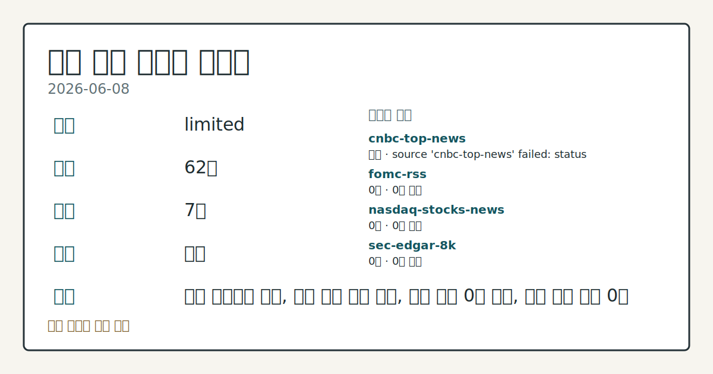
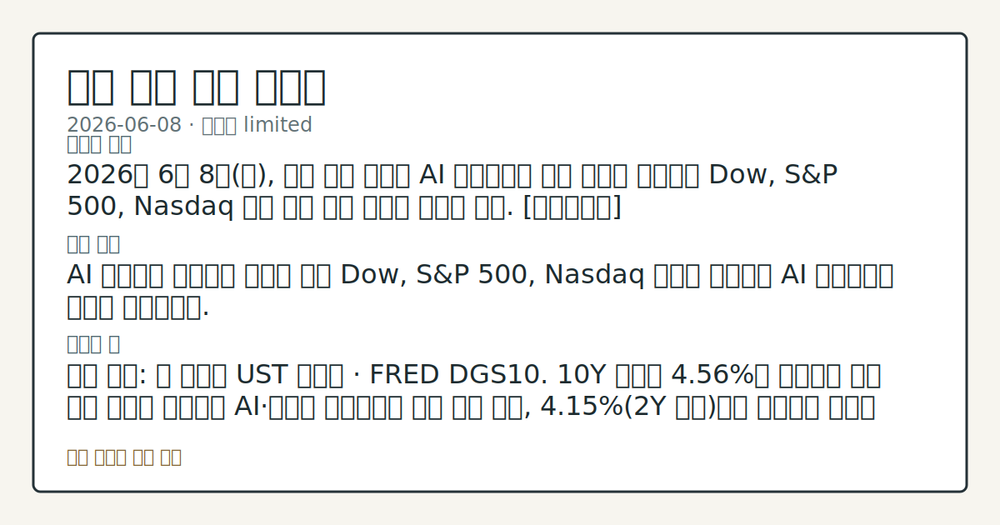

> 정보 제공용 자동 시황이며 매매 권유가 아닙니다.

# 2026-06-08 미국 증시 시황

**기준 시각**: 2026-06-08 NY · [2026-06-08T04:00Z, 2026-06-09T04:00Z)

| 종목 | 종가 | 변동 | 비고 |
|------|------|------|------|
| ^GSPC | 7,405.73 | +0.30% | -2.68% from 52w high · +7.98% YTD |
| ^IXIC | 25,929.66 | +0.86% | -4.30% from 52w high · +11.59% YTD |
| ^DJI | 50,786.01 | -0.16% | -1.50% from 52w high |
| AAPL | 301.54 | -1.89% | -4.33% from 52w high · +11.27% YTD |
| MSFT | 411.74 | -1.18% | +15.41% from 52w low · -12.94% YTD |

**세그먼트**: [국내 증시](../../../domestic-equity/2026/06/2026-06-08.md) | [미국 증시](2026-06-08.md) | [크립토](../../../crypto/2026/06/2026-06-08.md)

*이미지: 데이터 신뢰도 · 출처: investo 자체 생성 · 생성: investo 0.1.0 · 2026-06-09 UTC*

> **내 관심 자산 영향**: 데이터 수집 부족으로 매칭 판단 보류 — 추가 수집 후 재평가됩니다.
> **용어 가이드**: 이번 시황에서 처음 등장한 용어 — 시가총액(시장가치)
> **오늘의 결론**: 2026년 6월 8일(월), 미국 증시 선물은 AI 트레이드가 다시 전면에 나서면서 Dow, S&P 500, Nasdaq 모두 상승 출발 흐름을 보이고 있다. [데이터부족]
> **핵심 동인**: AI 트레이드 재부상과 빅테크 수급 Dow, S&P 500, Nasdaq 선물이 상승하며 AI 트레이드가 전면에 재등장했다.
> **주의할 점**: 확인 소스: 미 재무부 UST 수익률 · FRED DGS10. 10Y 금리가 **4.56%**를 상회하며 추가 상승 추세를 이어가면 AI·성장주 밸류에이션 부담...

> **데이터 상태**: 제한 · 본문 사용 미집계 · 실패 1 · 0건 5

수집/품질 진단

> **데이터 상태**: 제한 — 수집 62건 / 소스 7개 / 누락: 가격 · 제한 — 핵심 가격 소스 0건/실패/stale, 본문 결론 신뢰도 낮음
> **소스 카운트**: 수집 대상 13 / 성공 7 / 0건 5 / 실패 1 / 본문 사용 미집계
> **소스 등급 분포**: S=2 / A=5
> **상세 사유**: 가격 카테고리 누락, 일부 소스 수집 실패, 일부 소스 0건 반환, 핵심 가격 소스 0건
> **소스별 상태**: cnbc-top-news 실패 (접근 제한), fomc-rss 0건, nasdaq-stocks-news 0건, sec-edgar-8k 0건, stooq-price 0건, yfinance-price 0건, 정상 7개

## 한눈에 보기

- Dow, S&P 500(스탠더드앤드푸어스 500 지수), Nasdaq 선물 일제히 상승 출발, AI(인공지능) 트레이드가 시장 전면에 재등장하는 가운데 10Y(10년물 미국 국채 금리) **4.56%** 환경 속 방향성 탐색.
- **OpenAI**가 Anthropic, SpaceX와 함께 IPO(기업공개) 서류를 제출해 AI 비상장 대형사들의 공개 시장 접근 파이프라인 확대 관찰.
- **2026-06-10** CPI(소비자물가지수) · **2026-06-17** FOMC(연방공개시장위원회) 회의가 이번 주~다음 주 핵심 변수 — 본문 §④ 참조.

## ⓪ 오늘의 매크로

- **미 국채 수익률** — UST curve 2026-06-08: 10Y 4.56%, 2Y10Y +0.41pp

## ⓪-B 채널 기준선

| 기준선 | 값 |
|------|------|
| S&P 500 | 7,405.73 (+0.30%) |
| 나스닥 종합 | 25,929.66 (+0.86%) |
| 다우존스 | 50,786.01 (-0.16%) |

> **크로스마켓 연결 고리**: 금리 이벤트가 할인율/달러 경로의 공통 변수로 남아 있습니다.

## ① 요약

*이미지: 시장 스냅샷 · 출처: investo 자체 생성 · 생성: investo 0.1.0 · 2026-06-09 UTC*

2026년 6월 8일, 미국 증시 선물은 AI 트레이드가 다시 전면에 나서면서 [Dow, S&P 500, Nasdaq 모두 상승 출발](https://finance.yahoo.com/news/live/stock-market-today-dow-sp-500-nasdaq-futures-rise-as-ai-trade-takes-center-stage-225640973.html) 흐름을 보이고 있다. 6월 4일 은행·관리형 의료주 중심 순환매에서 기술주·AI 테마로 수급이 복귀하는 구도 전환이 관찰된다. 한편 [미 재무부 수익률 곡선](https://home.treasury.gov/resource-center/data-chart-center/interest-rates) 기준 10Y 금리가 **4.56%**로 오르며 성장주 밸류에이션 부담이 공존하고, AAPL(애플)은 WWDC(세계 개발자 회의) 발표 이후 주가가 하락해 AI 모멘텀과 엇갈린 신호를 만들고 있다. CPI·FOMC라는 굵직한 일정을 앞두고 AI 강세와 금리 부담이 맞서는 구도가 이어질 것으로 관찰된다. [혼재]

## ② 전일 핵심 이슈

### AI 트레이드 재부상과 빅테크 수급

[Dow, S&P 500, Nasdaq 선물이 상승하며 AI 트레이드가 전면에](https://finance.yahoo.com/news/live/stock-market-today-dow-sp-500-nasdaq-futures-rise-as-ai-trade-takes-center-stage-225640973.html) 재등장했다. 6월 2일 AI 주도 ATH(사상 최고치) 랠리 → 6월 3일 지정학적 반전 → 6월 4일 은행·의료주 순환매를 거쳐 AI 테마로 수급이 되돌아오는 흐름이다. [OpenAI·Anthropic·SpaceX의 IPO 서류 제출](https://finance.yahoo.com/sectors/technology/live/tech-stocks-today-openai-joins-anthropic-spacex-in-filing-ipo-paperwork-apple-stock-falls-after-wwdc-12042080…) 소식이 AI 생태계 확장 기대를 더하는 배경으로 작용하고 있다.

> **그래서 의미는?** AI 테마가 단기 섹터 순환을 뚫고 재부상한 흐름으로, 기술주 수급 복귀의 지속성이 오늘 장중 핵심 관찰 포인트.

### 금리·정책금리·고용 지표

[FRED DGS10(미국 10년물 국채 금리)](https://fred.stlouisfed.org/series/DGS10)은 **4.55%**(2026-06-05 기준, 전일 대비 **+0.0800pp**)로 상승했으며, [미 재무부 수익률 곡선](https://home.treasury.gov/resource-center/data-chart-center/interest-rates) 2026-06-08 현재 10Y **4.56%** · 2Y **4.15%** · 30Y **5.03%** · 3M **3.80%**를 기록하고 있다. 2Y10Y(2년-10년 스프레드) **+0.41pp**, 3M10Y(3개월-10년 스프레드) **+0.76pp**로 수익률 곡선은 정상 기울기(우상향)를 유지 중이다.

미국 증시 관점에서 [DFF(연방기금 실효금리)](https://fred.stlouisfed.org/series/DFF) **3.62%**(2026-06-05 기준, 전일 대비 변동 없음)는 Federal Reserve(연방준비제도) 동결 기조를 재확인하며, 6월 17일 FOMC 회의까지 정책 변화 시그널이 부재한 상태를 시사한다. [UNRATE(실업률)](https://fred.stlouisfed.org/series/UNRATE) **4.3%**(2026-05-01 기준, 전월 대비 변동 없음) 또한 고용 시장 안정이 지속되고 있음을 확인해 준다.

## ③ 섹터/수급 동향

2026-06-08 기준 미국 섹터별 ETF(상장지수펀드) 수급 및 업종별 자금 이동 데이터가 이 세그먼트에서 수집되지 않았다.

> **그래서 의미는?** 현재 수집 근거가 부족해 방향보다 확인 필요 항목으로만 봅니다.

## ④ 지표·이벤트

### 미국 국채 수익률 곡선

[미 재무부](https://home.treasury.gov/resource-center/data-chart-center/interest-rates) 기준 2026-06-08 UST(미국 국채) 수익률 구조: 3M **3.80%** · 2Y **4.15%** · 10Y **4.56%** · 30Y **5.03%**. 2Y10Y 스프레드 **+0.41pp**, 3M10Y 스프레드 **+0.76pp**. 곡선 정상화(우상향)가 이어지는 가운데, 10Y **4.56%** · 30Y **5.03%** 수준의 절대치가 AI·성장주 밸류에이션 부담 변수로 작용하고 있다.

> **그래서 의미는?** 장기금리가 높게 유지되는 만큼, 이번 주 CPI·FOMC 결과가 금리 방향을 결정할 분기점으로 추적이 필요하다.

### 이번 주~이번 달 주요 매크로 일정

- **2026-06-10**: [CPI 발표](https://fred.stlouisfed.org/release?rid=10) — 소비자물가지수 확인.
- **2026-06-11**: [PPI(생산자물가지수) 발표](https://fred.stlouisfed.org/release?rid=46) — 공급 측 물가 압력 점검.
- **2026-06-17**: [FOMC 회의(6월 16~17일 이틀 회의) 및 기자회견](https://www.federalreserve.gov/newsevents/calendar.htm) — 금리 결정 및 향후 정책 방향 발표.
- **2026-06-25**: [GDP(국내총생산) 발표](https://fred.stlouisfed.org/release?rid=53) — 경제 성장률 점검.
- **2026-07-02**: [Employment Situation(고용 현황) 발표](https://fred.stlouisfed.org/release?rid=50) — 고용 지표 추가 확인.

## ⑤ 주요 종목

<!-- u50 lightweight-charts-embed: placeholders consumed by site_docs/assets/investo-chart-init.js -->

<noscript><em>인터랙티브 차트는 JavaScript가 활성화된 환경에서 표시됩니다. 위 정적 카드가 동일한 정보를 담고 있습니다.</em></noscript>

### 테크 대형사 IPO 파이프라인 확인 항목

[OpenAI가 Anthropic, SpaceX와 함께 IPO 서류를 제출](https://finance.yahoo.com/sectors/technology/live/tech-stocks-today-openai-joins-anthropic-spacex-in-filing-ipo-paperwork-apple-stock-falls-after-wwdc-12042080…)했다. AI 비상장 대형사들이 공개 시장 접근 준비를 공식화한 것으로, 기존 AI 노출 상장 대형주의 수급 구도 변화 여부를 추적할 포인트가 된다.

### AAPL — WWDC 이후 주가 흐름

AAPL은 WWDC 발표 이후 주가 하락이 관찰됐다. 시장 기대와 실제 발표 내용 간의 간극에 대한 반응으로, AI 관련 소프트웨어·생태계 전략 발표에 대한 시장 평가를 추세 확인으로 점검할 수 있다.

### 실적 발표 예정

| 티커 | 회사명 | 분기 | EPS(주당순이익) 예상 | 시가총액 |
|------|--------|------|---------------------|----------|
| [CPB](https://www.nasdaq.com/market-activity/stocks/cpb/earnings) | The Campbell's Company | Apr/2026 | $0.48 | $6,463,815,860 |
| [MTN](https://www.nasdaq.com/market-activity/stocks/mtn/earnings) | Vail Resorts, Inc. | Apr/2026 | $8.97 | $4,823,646,114 |

> **그래서 의미는?** AAPL의 WWDC 반응 추이와 OpenAI·Anthropic·SpaceX IPO 서류 제출은 AI 테마 내 상장주 수급 재편을 점검하는...

## ⑥ 오늘의 관전 포인트

| 관찰 신호 | 현재 | 상방 확인 조건 | 하방 확인 조건 | 신뢰도 | 섹션 내 관심 영향 |
| --- | --- | --- | --- | --- | --- |
| 확인 소스: 미 재무부 UST 수익률 · FRED DG… | 확인 소스: 미 재무부 UST 수익률 · FRED DGS10. 10Y 금리가 **4.56%**를 상회하며 추가 상승 추세를 이어가면 AI·성장주 밸류에이션 부담 압력 관찰, **4.15%**(2Y 수준)까지 하락하면 기술주 상방 여건 완화 흐름 확인. 관심 영향: S&P 500 내 AI·기술 섹터 수급 방향 추세 점검. | 10Y 금리가 **4.56%**를 상회하며 추가 상승 추세를 이어가면 AI | 데이터부족 | 높음 | 관심 영향: S&P 500 내 AI |
| 확인 소스: Yahoo Finance 선물 동향. Do… | 확인 소스: Yahoo Finance 선물 동향. Dow, S&P 500, Nasdaq 선물 상승이 장 개시 후에도 유지되면 AI 트레이드 복귀 지속 흐름 관찰, 상승폭이 급격히 줄거나 반전하면 6월 4일 섹터 순환매 패턴 재현 여부 비교. 관심 영향: AI 테마 수급 지속성과 빅테크 방향성 확인. | 데이터부족 | 데이터부족 | 보통 | 관심 영향: AI 테마 수급 지속성과 빅테크 방향성 확인. |
| 확인 소스: FRED CPI 일정. **2026-06-… | 확인 소스: FRED CPI 일정. **2026-06-10** CPI 발표가 컨센서스(합의치)를 상회하면 DGS10 상승과 AI·성장주 밸류에이션 압박 강화 추세 관찰, 하회하면 금리 하락 압력과 기술주 상방 여건 흐름 비교. 관심 영향: 10Y 금리 방향과 AI 섹터 수급 연동 점검. | **2026-06-10** CPI 발표가 컨센서스(합의치)를 상회하면 DGS10 상승과 AI | 성장주 밸류에이션 압박 강화 추세 관찰, 하회하면 금리 하락 압력과 기술주 상방 여건 흐름 비교 | 보통 | 관심 영향: 10Y 금리 방향과 AI 섹터 수급 연동 점검. |
| 확인 소스: FOMC 회의 일정. **2026-06-1… | 확인 소스: FOMC 회의 일정. **2026-06-17** FOMC 회의에서 DFF **3.62%** 동결 확인 시 현 금리 경로 유지 흐름 관찰, 점도표(dot plot, 위원별 금리 전망) 또는 Forward guidance(향후 정책 방향) 변화 발표 시 성장주·빅테크 밸류에이션 재조정 흐름 비교. 관심 영향: 금리 경로 변화가 AI 섹터 수급에 미치는 영향 추세 확인. | 데이터부족 | 데이터부족 | 높음 | 관심 영향: 금리 경로 변화가 AI 섹터 수급에 미치는 영향 추세 확인. |
| 확인 소스: Yahoo Finance 테크 IPO 뉴스… | 확인 소스: Yahoo Finance 테크 IPO 뉴스. OpenAI·Anthropic·SpaceX IPO 파이프라인 추가 진전 시 기존 AI 노출 상장 대형주 수급 희석 압력 관찰, AAPL의 WWDC 이후 하락폭이 제한되거나 회복세를 보이면 빅테크 전반 낙폭 과대 회복 흐름 비교. 관심 영향: AI 테마 내 상장주·비상장주 수급 차별화 추세 점검. | SpaceX IPO 파이프라인 추가 진전 시 기존 AI 노출 상장 대형주 수급 희석 압력 관찰, AAPL의 WWDC 이후 하락폭이 제한되거나 회복세를 보이면 빅테크 전반 낙폭 과대 회복 흐름 비교 | 데이터부족 | 보통 | 관심 영향: AI 테마 내 상장주 |
## ⑦ 면책조항
본 시황은 일반 정보 제공을 목적으로 자동 생성된 자료이며,
특정 종목·자산에 대한 매매 권유나 투자 자문이 아닙니다.
투자 결정과 그 결과에 대한 책임은 전적으로 본인에게 있으며,
본 시황의 내용에 따라 발생한 손실에 대해 작성자는 일체의 책임을 지지 않습니다.