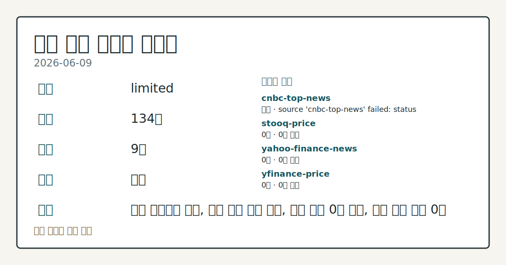
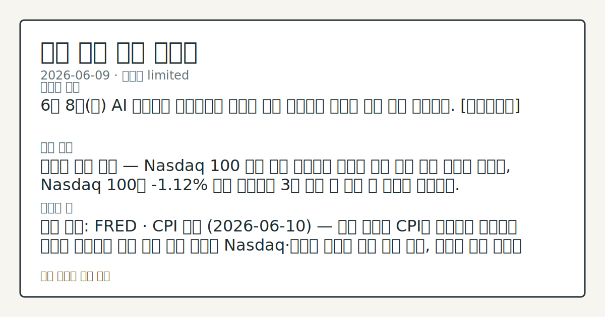

> 정보 제공용 자동 시황이며 매매 권유가 아닙니다.

# 2026-06-09 미국 증시 시황

**기준 시각**: 2026-06-09 NY · [2026-06-09T04:00Z, 2026-06-10T04:00Z)

| 종목 | 종가 | 변동 | 비고 |
|------|------|------|------|
| ^GSPC | 7,386.65 | -0.26% | -2.93% from 52w high · +7.70% YTD |
| ^IXIC | 25,678.82 | -0.97% | -5.22% from 52w high · +10.51% YTD |
| ^DJI | 50,872.11 | +0.17% | -1.34% from 52w high · +5.15% YTD |
| AAPL | 290.55 | -3.64% | -7.82% from 52w high · +7.21% YTD |
| MSFT | 403.41 | -2.02% | +13.07% from 52w low · -14.70% YTD |

**세그먼트**: [국내 증시](../../../domestic-equity/2026/06/2026-06-09.md) | [미국 증시](2026-06-09.md) | 크립토(미발행)

*이미지: 데이터 신뢰도 · 출처: investo 자체 생성 · 생성: investo 0.1.0 · 2026-06-10 UTC*

> **내 관심 자산 영향**: 데이터 수집 부족으로 매칭 판단 보류 — 추가 수집 후 재평가됩니다.
> **오늘의 결론**: 2026년 6월 9일(화), 미국 증시는 반도체주 매도세가 초반 상승분을 모두 지워 3대 지수가 방향성을 달리하며 마감했다. [데이터부족]
> **핵심 동인**: 반도체 주도 기술주 하락 — Nasdaq 100 압박 Nasdaq 시황 보도에 따르면 칩 관련 종목이 일제히 하방 전환하며 Nasdaq 100이 **-1.12%** 로 마감했다.
> **주의할 점**: 확인 소스: FRED · DGS10 · 10Y 금리 현재 **4.56%** 기준 — **4.6%** 를 상회하면 성장주 밸류에이션 부담 확대 압력을 관찰...

> **데이터 상태**: 제한 · 본문 사용 미집계 · 실패 1 · 0건 3

수집/품질 진단

> **데이터 상태**: 제한 — 수집 134건 / 소스 9개 / 누락: 가격 · 제한 — 핵심 가격 소스 0건/실패/stale, 본문 결론 신뢰도 낮음
> **소스 카운트**: 수집 대상 13 / 성공 9 / 0건 3 / 실패 1 / 본문 사용 미집계
> **소스 등급 분포**: S=4 / A=5
> **상세 사유**: 가격 카테고리 누락, 일부 소스 수집 실패, 일부 소스 0건 반환, 핵심 가격 소스 0건
> **소스별 상태**: cnbc-top-news 실패 (접근 제한), stooq-price 0건, yahoo-finance-news 0건, yfinance-price 0건, 정상 9개

## 한눈에 보기

- Nasdaq 100이 **-1.12%** 하락하고 S&P 500도 **-0.26%** 마감, Dow Jones만 **+0.17%** 소폭 상승하며 3대 지수가 엇갈렸다.
- 반도체주 급락이 장 초반 상승분을 전부 반납시키며 전일 AI 트레이드 재부상 흐름을 하루 만에 뒤집은 것으로 확인됐다.
- **4.53%** 수준의 10Y 미국채 금리와 내일(2026-06-10) 예정된 CPI(소비자물가지수) 발표가 당장의 핵심 확인 변수.

## ⓪ 오늘의 매크로

- **미 국채 수익률** — UST curve 2026-06-09: 10Y 4.53%, 2Y10Y +0.40pp

## ⓪-B 채널 기준선

| 기준선 | 값 |
|------|------|
| S&P 500 | 7,386.65 (-0.26%) |
| 나스닥 종합 | 25,678.82 (-0.97%) |
| 다우존스 | 50,872.11 (+0.17%) |

> **크로스마켓 연결 고리**: 금리 이벤트가 할인율/달러 경로의 공통 변수로 남아 있습니다.

## ① 요약

*이미지: 시장 스냅샷 · 출처: investo 자체 생성 · 생성: investo 0.1.0 · 2026-06-10 UTC*

2026년 6월 9일, 미국 증시는 반도체주 매도세가 초반 상승분을 모두 지워 3대 지수가 방향성을 달리하며 마감했다. S&P 500(스탠더드앤드푸어스 500 지수)은 **-0.26%**, Dow Jones 산업평균지수는 **+0.17%** 로 소폭 상승한 반면, Nasdaq 100(나스닥 100 지수)은 **-1.12%** 로 기술주에 선명한 하방 압력이 집중됐다. 전일(6월 8일) AI 트레이드 재부상과 빅테크 수급 강세 흐름에서 하루 만에 이탈하며, 칩주 약세가 지수 상단을 막는 구도로 전환됐다. 내일·모레 CPI와 PPI(생산자물가지수) 발표가 연달아 예정돼 있어 단기 금리 경로 재평가 여부가 시장의 시선을 집중시키는 국면이다. [하락 관찰]

## ② 전일 핵심 이슈

### 반도체 주도 기술주 하락 — Nasdaq 100 압박

[Nasdaq 시황 보도](https://www.nasdaq.com/articles/broader-market-pressured-chip-stocks-sink)에 따르면 칩 관련 종목이 일제히 하방 전환하며 Nasdaq 100이 **-1.12%** 로 마감했다. 장 초반 S&P 500과 Nasdaq 모두 상승 출발했으나, 반도체주가 먼저 꺾이면서 초반 상승분이 전부 소거됐다. ESM26(미니S&P선물)도 **-0.36%** 를 기록해 지수 약세를 반영했다. 전일 AI 트레이드가 되살아났던 흐름이 하루 만에 반전된 것으로, 기술주 내 수급 분화가 재확인된 하루였다.

> **그래서 의미는?** 전일 AI 랠리 흐름이 반도체 집중 매도로 꺾이며, 빅테크와 칩주 간 수급 분화 추세를 재점검할 필요가 있습니다.

### 연준 정책 지표 — DFF · UNRATE 변화 없음

[FRED](https://fred.stlouisfed.org/series/DFF) 기준 DFF(연방기금금리)는 **3.62%** 로 전일 대비 변화가 없었고, [UNRATE(실업률)](https://fred.stlouisfed.org/series/UNRATE)도 **4.3%** 로 전월 발표치와 동일하게 유지됐다. 이날 연준 정책 기조 변화를 시사하는 신규 신호는 없었다.

## ③ 섹터/수급 동향

이번 입력에 섹터별·수급 세부 데이터가 포함되지 않아 순매수·순매도 흐름은 확인할 수 없다.

> **그래서 의미는?** 현재 수집 근거가 부족해 방향보다 확인 필요 항목으로만 봅니다.

## ④ 지표·이벤트

### 미국 국채 금리 — 10Y 상승

[미 재무부](https://home.treasury.gov/resource-center/data-chart-center/interest-rates) 기준 UST(미국국채) 커브(2026-06-09): 10Y **4.53%**, 2Y **4.13%**, 30Y **5.01%**, 3M10Y 스프레드 **+0.74pp**. [FRED DGS10](https://fred.stlouisfed.org/series/DGS10)은 **4.56%** 로 전일 대비 **+0.01pp** 상승했으며, 2Y10Y 스프레드는 **+0.40pp** 로 정상 커브 형태를 유지 중이다.

> **그래서 의미는?** 10Y 금리가 **4.5%** 중반대에 유지되며 성장주 밸류에이션 압박 기조가 지속되는 점을 확인할 수 있습니다.

### 이번 주 주요 경제 발표 일정

[FRED CPI 발표](https://fred.stlouisfed.org/release?rid=10)는 **2026-06-10**(내일), [PPI 발표](https://fred.stlouisfed.org/release?rid=46)는 **2026-06-11**에 예정돼 있다. Federal Reserve(연방준비제도)는 연간 은행 스트레스 테스트 결과를 [2026-06-24 오후 4시 EDT](https://www.federalreserve.gov/newsevents/pressreleases/bcreg20260609a.htm)에 공개할 예정이라고 발표했다. [FOMC 회의](https://www.federalreserve.gov/newsevents/calendar.htm)(6월 16~17일 이틀간)와 기자회견은 **2026-06-17 오후 2시** 에 예정돼 있다.

## ⑤ 주요 종목

<!-- u50 lightweight-charts-embed: placeholders consumed by site_docs/assets/investo-chart-init.js -->

<noscript><em>인터랙티브 차트는 JavaScript가 활성화된 환경에서 표시됩니다. 위 정적 카드가 동일한 정보를 담고 있습니다.</em></noscript>

### 실적 발표

| 종목 | 발표 시점 | EPS 예상치 | 전년 동기 EPS |
|------|-----------|------------|--------------|
| CASY (Casey's General Stores) | 장 마감 후 | $3.36 | $2.63 |
| SJM (J.M. Smucker) | 장 전 | $2.65 | $2.31 |
| SAIL (SailPoint) | 장 전 | $0.04 | $0.01 |

> **그래서 의미는?** CASY·SJM·SAIL의 실적이 오늘 집중되며, 예상치 대비 실제 EPS 비교가 각사의 주가 흐름 관찰 포인트입니다.

### 확인 항목

- **CVNA** (Carvana): 지난달 완료된 [5 대 1 주식 분할](https://www.nasdaq.com/articles/now-time-buy-carvana-stock-after-its-5-1-split) 이후 주가 접근성 확대 및 시장 재부각 흐름 관찰 중.

## ⑥ 오늘의 관전 포인트

| 관찰 신호 | 현재 | 상방 확인 조건 | 하방 확인 조건 | 신뢰도 | 섹션 내 관심 영향 |
| --- | --- | --- | --- | --- | --- |
| DGS10](https://fred.stlouisfed… | 확인 소스: FRED · DGS10 · 10Y 금리 현재 **4.56%** 기준 — **4.6%** 를 상회하면 성장주 밸류에이션 부담 확대 압력을 관찰, **4.13%**(현 2Y 수준) 아래로 이탈하면 장단기 금리 역전 해소 흐름을 점검. 관심 영향: Nasdaq 100 방향성 수급 추세 확인. | 10Y 금리 현재 **4.56%** 기준 — **4.6%** 를 상회하면 성장주 밸류에이션 부담 확대 압력을 관찰, **4.13%**(현 2Y 수준) 아래로 이탈하면 장단기 금리 역전 해소 흐름을 점검 | 10Y 금리 현재 **4.56%** 기준 — **4.6%** 를 상회하면 성장주 밸류에이션 부담 확대 압력을 관찰, **4.13%**(현 2Y 수준) 아래로 이탈하면 장단기 금리 역전 해소 흐름을 점검 | 높음 | 관심 영향: Nasdaq 100 방향성 수급 추세 확인. |
| CPI](https://fred.stlouisfed.o… | 확인 소스: FRED · CPI · 2026-06-10 발표 예정 — 예상치를 상회하면 연준 금리 동결 장기화 기대 압력을 관찰, 예상치를 하회하면 6월 FOMC 금리 경로 재평가 여지 흐름을 점검. 관심 영향: 채권·성장주 수급 분화 비교. | 2026-06-10 발표 예정 — 예상치를 상회하면 연준 금리 동결 장기화 기대 압력을 관찰, 예상치를 하회하면 6월 FOMC 금리 경로 재평가 여지 흐름을 점검 | 2026-06-10 발표 예정 — 예상치를 상회하면 연준 금리 동결 장기화 기대 압력을 관찰, 예상치를 하회하면 6월 FOMC 금리 경로 재평가 여지 흐름을 점검 | 보통 | 관심 영향: 채권 |
| PPI](https://fred.stlouisfed.o… | 확인 소스: FRED · PPI · 2026-06-11 발표 예정 — 예상치 상회 시 인플레이션(물가 압력) 재부각 여부 관찰, 예상치 하회 시 CPI와의 방향 일관성 흐름 확인. 관심 영향: 금리 민감 섹터 수급 변동 추세 점검. | 2026-06-11 발표 예정 — 예상치 상회 시 인플레이션(물가 압력) 재부각 여부 관찰, 예상치 하회 시 CPI와의 방향 일관성 흐름 확인 | 2026-06-11 발표 예정 — 예상치 상회 시 인플레이션(물가 압력) 재부각 여부 관찰, 예상치 하회 시 CPI와의 방향 일관성 흐름 확인 | 보통 | 관심 영향: 금리 민감 섹터 수급 변동 추세 점검. |
| 확인 소스: Nasdaq 실적 발표 · CASY · S… | 확인 소스: Nasdaq 실적 발표 · CASY · SJM — EPS 실제치가 예상치(**$3.36** / **$2.65**)를 상회하면 소비재 섹터 수익성 개선 추세 관찰, 하회하면 방어적 소비재 이익 흐름 변화 확인. 관심 영향: 비임의소비재(staples) 섹터 수급 점검. | SJM — EPS 실제치가 예상치(**$3.36** / **$2.65**)를 상회하면 소비재 섹터 수익성 개선 추세 관찰, 하회하면 방어적 소비재 이익 흐름 변화 확인 | SJM — EPS 실제치가 예상치(**$3.36** / **$2.65**)를 상회하면 소비재 섹터 수익성 개선 추세 관찰, 하회하면 방어적 소비재 이익 흐름 변화 확인 | 높음 | 관심 영향: 비임의소비재(staples) 섹터 수급 점검. |
| 확인 소스: 연준 FOMC 일정 · 2026-06-17… | 확인 소스: 연준 FOMC 일정 · 2026-06-17 회의·기자회견 — CPI·PPI 발표 결과가 동결 기대를 강화하는 방향이면 FOMC 전까지 국채 변동성 안정 여부를 관찰, 물가 서프라이즈 발생 시 성명 톤 변화 가능성 흐름 점검. 관심 영향: 대형 기술주 주간 수급 흐름 비교. | 데이터부족 | 데이터부족 | 보통 | 관심 영향: 대형 기술주 주간 수급 흐름 비교. |
## ⑦ 면책조항
본 시황은 일반 정보 제공을 목적으로 자동 생성된 자료이며,
특정 종목·자산에 대한 매매 권유나 투자 자문이 아닙니다.
투자 결정과 그 결과에 대한 책임은 전적으로 본인에게 있으며,
본 시황의 내용에 따라 발생한 손실에 대해 작성자는 일체의 책임을 지지 않습니다.