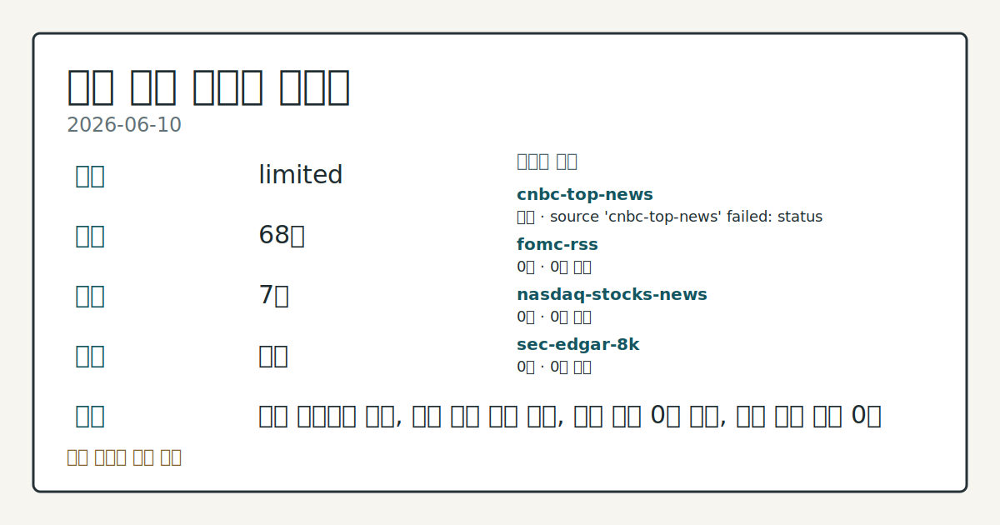
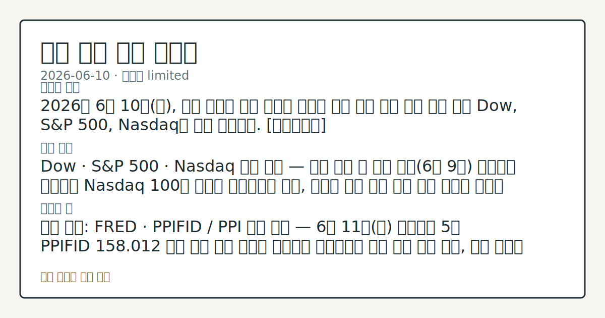

> 정보 제공용 자동 시황이며 매매 권유가 아닙니다.
# 2026-06-10 미국 증시 시황
**기준 시각**: 2026-06-10 NY · 2026-06-10T04:00Z, 2026-06-11T04:00Z)
| 종목 | 종가 | 변동 | 비고 |
|------|------|------|------|
| ^GSPC | 7,364.80 | +1.35% | -3.22% from 52w high · +7.38% YTD |
| ^IXIC | 25,614.12 | +1.77% | -5.46% from 52w high · +10.24% YTD |
| ^DJI | 50,741.78 | +1.65% | -1.59% from 52w high |
| AAPL | 296.00 | +1.52% | -6.09% from 52w high · +9.22% YTD |
| MSFT | 388.35 | -2.27% | +8.85% from 52w low · -17.89% YTD |
**세그먼트**: [국내 증시](../../../domestic-equity/2026/06/2026-06-10.md) | [미국 증시](2026-06-10.md) | [크립토](../../../crypto/2026/06/2026-06-10.md)

*이미지: 데이터 신뢰도 · 출처: investo 자체 생성 · 생성: investo 0.1.0 · 2026-06-11 UTC*
> **내 관심 자산 영향**: 데이터 수집 부족으로 매칭 판단 보류 — 추가 수집 후 재평가됩니다.
> **오늘의 결론**: 2026년 6월 10일(수), 미국 증시는 미국 정부의 이란에 대한 추가 공습 완료 소식 이후 Dow, S&P 500, Nasdaq이 동반 상승했다. [데이터부족]
> **핵심 동인**: Dow · S&P 500 · Nasdaq 동반 상승 — 이란 공습 후 전환 전일(6월 9일) 반도체주 급락으로 Nasdaq 100이 주도한 하락세에서 이탈, 미국의 이란 추가 공습 완료 소식을 계기로 Dow, S&P 500, Nasdaq이 동반 상승했다.
> **주의할 점**: 확인 소스: FRED · PPIFID / PPI 공식 발표 — 6월 11일(목) 발표에서 5월 PPIFID 158.012 수준 대비 추가 상승이 확인되면...
> **데이터 상태**: 제한 · 본문 사용 미집계 · 실패 1 · 0건 5

수집/품질 진단

> **데이터 상태**: 제한 — 수집 68건 / 소스 7개 / 누락: 가격 · 제한 — 핵심 가격 소스 0건/실패/stale, 본문 결론 신뢰도 낮음
> **소스 카운트**: 수집 대상 13 / 성공 7 / 0건 5 / 실패 1 / 본문 사용 미집계
> **소스 등급 분포**: S=2 / A=5
> **상세 사유**: 가격 카테고리 누락, 일부 소스 수집 실패, 일부 소스 0건 반환, 핵심 가격 소스 0건
> **소스별 상태**: cnbc-top-news 실패 (접근 제한), fomc-rss 0건, nasdaq-stocks-news 0건, sec-edgar-8k 0건, stooq-price 0건, yfinance-price 0건, 정상 7개

## 한눈에 보기
Dow, S&P 500(스탠더드앤드푸어스 500), Nasdaq(나스닥) 3대 지수 동반 상승 — 미국의 이란 추가 공습 완료 이후 지정학 긴장 일단 수렴, 10Y(10년물) 국채금리 **4.55%** 에서 관찰
5월 CPI(소비자물가지수) CPIAUCSL **333.979** (전월比 **+1.572** 상승) 발표 — 인플레이션 둔화 확인 여부가 재점검 국면
6월 11일 PPI(생산자물가지수) 공식 발표, 6월 17일 FOMC(연방공개시장위원회) 회의 — 이번 주~다음 주 정책 변수 추이 확인
## ⓪ 오늘의 매크로
**미 국채 수익률** — UST curve 2026-06-10: 10Y 4.55%, 2Y10Y +0.42pp
## ⓪-B 채널 기준선
| 기준선 | 값 |
|------|------|
| S&P 500 | 7,364.80 (+1.35%) |
| 나스닥 종합 | 25,614.12 (+1.77%) |
| 다우존스 | 50,741.78 (+1.65%) |
> **크로스마켓 연결 고리**: 금리 이벤트가 할인율/달러 경로의 공통 변수로 남아 있습니다.
> **오늘의 큰 그림:** 금리와 달러 변수가 미국·가상자산에 동시에 걸리며, 오늘 독자는 금리·달러 민감도을 먼저 확인해야 합니다.
## ① 요약

*이미지: 시장 스냅샷 · 출처: investo 자체 생성 · 생성: investo 0.1.0 · 2026-06-11 UTC*

2026년 6월 10일, 미국 증시는 미국 정부의 이란에 대한 추가 공습 완료 소식 이후 Dow, S&P 500, Nasdaq이 동반 상승했다. 전일(6월 9일) 반도체주 급락 주도의 Nasdaq 100(나스닥 100) 약세 흐름에서 하루 만에 상승 전환이 관찰됐다. 거시지표 측면에서는 5월 CPIAUCSL(소비자물가지수 계절조정)이 전월 대비 상승해 인플레이션 압력이 지속되고 있음이 확인됐으며, 10Y 국채금리는 **4.55%** 수준에서 추이했다. 6월 17일 FOMC 회의와 6월 11일 PPI 발표를 앞두고 지표-정책 경로 점검이 시장의 다음 관건으로 부상하고 있다. [상승 관찰]

## ② 전일 핵심 이슈

### Dow · S&P 500 · Nasdaq 동반 상승 — 이란 공습 후 전환

전일 반도체주 급락으로 Nasdaq 100이 주도한 하락세에서 이탈, [미국의 이란 추가 공습 완료](https://finance.yahoo.com/markets/live/stock-market-today-thursday-june-11-dow-sp-500-nasdaq-222511784.html) 소식을 계기로 Dow, S&P 500, Nasdaq이 동반 상승했다. 지정학 긴장의 새로운 전개 속에서 시장은 공습 완료를 단기 확전 종료 신호로 해석하며 위험자산 선호 자금이 일시 회복하는 흐름이 관찰됐다. 아울러 5월 CPI 공개로 인플레이션 지속 여부가 재확인된 만큼, 6월 17일 FOMC 결정까지 지표와 정책 경로에 대한 관찰이 이어질 전망이다.

> **그래서 의미는?** 지정학 리스크 고조 국면에서도 지수가 상승한 것은 시장이 추가 확전보다 공습 종결 가능성에 무게를 둔 것으로 보이며, 이란 관련 추가 보도를...

## ③ 섹터/수급 동향

이번 입력 데이터에 섹터별 자금 흐름 및 수급 세부 정보가 포함되어 있지 않아, 섹터·수급 동향은 별도 데이터 확인이 필요하다.

> **그래서 의미는?** 현재 수집 근거가 부족해 방향보다 확인 필요 항목으로만 봅니다.

## ④ 지표·이벤트

### 주요 매크로 지표 실적

| 지표 | 최신값 (기준월) | 전기값 | 변화 | 출처 |
|------|----------------|--------|------|------|
| [DFF(연방기금금리)](https://fred.stlouisfed.org/series/DFF) | **3.62%** (2026-06-09) | 3.62% | 0.00 | FRED |
| [CPIAUCSL](https://fred.stlouisfed.org/series/CPIAUCSL) | **333.979** (2026-05) | 332.407 | +1.572 | FRED |
| [PPIFID(최종수요 생산자물가지수)](https://fred.stlouisfed.org/series/PPIFID) | **158.012** (2026-05) | 156.395 | +1.617 | FRED |
| [UNRATE(실업률)](https://fred.stlouisfed.org/series/UNRATE) | **4.3%** (2026-05) | 4.3% | 0.00 | FRED |

> **그래서 의미는?** 고용은 안정적이나 물가 두 지표(CPI·PPI)가 모두 전월 대비 상승해, Federal Reserve의 금리 동결 근거와 인하 경로 판단이...

### UST 수익률 곡선 (2026-06-10)

[미국 재무부 금리 데이터](https://home.treasury.gov/resource-center/data-chart-center/interest-rates) 기준 UST(미국국채) 수익률: 3M **3.79%**, 2Y **4.13%**, 10Y **4.55%**, 30Y **5.03%**. 2Y10Y 스프레드(장단기 금리차) **+0.42pp**, 3M10Y 스프레드 **+0.76pp**. [DGS10(10년물 국채 시장금리)](https://fred.stlouisfed.org/series/DGS10)는 **4.53%** (2026-06-09 기준, 전일 **4.56%** 대비 **-0.03** 하락).

### 주요 일정 (이번 주~이번 달)

- **2026-06-11(목)**: [PPI 공식 발표](https://fred.stlouisfed.org/release?rid=46)
- **2026-06-17(화)**: [FOMC 회의](https://www.federalreserve.gov/newsevents/calendar.htm) 결과 발표 (현지시간 오후 2:00) 및 [기자회견](https://www.federalreserve.gov/live-broadcast.htm) (오후 2:30)
- **2026-06-19(목)**: Federal Reserve 휴장 — Juneteenth National Independence Day
- **2026-06-25(수)**: [GDP(국내총생산) 발표](https://fred.stlouisfed.org/release?rid=53)
- **2026-07-02(목)**: [Employment Situation(고용 상황) 발표](https://fred.stlouisfed.org/release?rid=50)
- **2026-07-08(수)**: 6월 FOMC 회의 [의사록(Minutes) 공개](https://www.federalreserve.gov/newsevents/calendar.htm)

## ⑤ 주요 종목

<!-- u50 lightweight-charts-embed: placeholders consumed by site_docs/assets/investo-chart-init.js -->

<noscript><em>인터랙티브 차트는 JavaScript가 활성화된 환경에서 표시됩니다. 위 정적 카드가 동일한 정보를 담고 있습니다.</em></noscript>

### 실적 발표

[ORCL](https://www.nasdaq.com/market-activity/stocks/orcl/earnings)(Oracle Corporation) — 장 마감 후(after-hours) 실적 발표 예정. EPS(주당순이익) 컨센서스 **$1.58** (2026년 5월 회계분기 기준), 시가총액 **$591,919,027,260**.

> **그래서 의미는?** ORCL(오라클)의 실적이 AI(인공지능) 인프라 및 클라우드 서비스 수요 추세를 확인하는 주요 데이터 포인트가 될 수 있어, 결과와 가이던스...

### 확인 항목

입력 데이터에 포함된 개별 종목 정보가 ORCL 외에는 충분하지 않아 섹터 전반의 수급 흐름은 별도 확인이 필요하다.

## ⑥ 오늘의 관전 포인트

#### 관찰 신호: PPIFID / PPI 공식 발표

- 출처: 확인 소스 미상
- 현재: 확인 소스: FRED · PPIFID / PPI 공식 발표 — 6월 11일 발표에서 5월 PPIFID **158.012** 수준 대비 추가 상승이 확인되면 인플레이션 압력 지속 추세 관찰, 하락 전환이 확인되면 FOMC 금리 동결 기대 강화 흐름 점검. 관심 영향: 10Y 국채금리 **4.55%** 부근 변동 방향 추세 확인.
- 확인 조건: 상방 상방 데이터 부족; 하방 하방 데이터 부족
- 신뢰도: 높음
- 관심 영향: 관심 영향: 10Y 국채금리 **4.55%** 부근 변동 방향 추세 확인.

#### 관찰 신호: 확인 소스: 연방준비제도 FOMC 캘린더 — 6월 17…

- 출처: 확인 소스 미상
- 현재: 확인 소스: 연방준비제도 FOMC 캘린더 — 6월 17일 FOMC 회의에서 DFF **3.62%** 동결 기조 유지 시 금리 안정 추세 관찰, 추가 긴축 의향 시사 확인 시 성장주 하방 압력 흐름 점검. 관심 영향: 기술주·대형 성장주 섹터 수급 추세 확인.
- 확인 조건: 상방 상방 데이터 부족; 하방 확인 소스: 연방준비제도 FOMC 캘린더 — 6월 17일 FOMC 회의에서 DFF **3.62%** 동결 기조 유지 시 금리 안정 추세 관찰, 추가 긴축 의향 시사 확인 시 성장주 하방 압력 흐름 점검
- 신뢰도: 높음
- 관심 영향: 관심 영향: 기술주

#### 관찰 신호: 이란 공습 보도

- 출처: 확인 소스 미상
- 현재: 확인 소스: Yahoo Finance · 이란 공습 보도 — 미국-이란 지정학 동향에서 추가 확전 신호 확인 시 에너지 섹터 변동 및 S&P 500 하방 압력 추세 관찰, 긴장 완화 지속 확인 시 위험자산 선호 회복 흐름 점검. 관심 영향: 3대 지수 단기 변동성 추이 확인.
- 확인 조건: 상방 이란 공습 보도; 하방 이란 공습 보도
- 신뢰도: 보통
- 관심 영향: 관심 영향: 3대 지수 단기 변동성 추이 확인.

#### 관찰 신호: ORCL 실적 발표

- 출처: 확인 소스 미상
- 현재: 확인 소스: NASDAQ · ORCL 실적 발표 — 장 마감 후 EPS 컨센서스 **$1.58** 상회 확인 시 클라우드·AI 인프라 섹터 모멘텀 강화 추세 관찰, 하회 확인 시 기술주 수급 재평가 흐름 점검. 관심 영향: 대형 기술주 섹터 수급 추세 확인.
- 확인 조건: 상방 ORCL 실적 발표; 하방 AI 인프라 섹터 모멘텀 강화 추세 관찰, 하회 확인 시 기술주 수급 재평가 흐름 점검
- 신뢰도: 높음
- 관심 영향: 관심 영향: 대형 기술주 섹터 수급 추세 확인.

#### 관찰 신호: DGS10

- 출처: 확인 소스 미상
- 현재: 확인 소스: FRED · DGS10 / 미국 재무부 금리 데이터 — 10Y 국채금리가 전일 고점 **4.56%** 재돌파 확인 시 성장주 변동성 부담 압력 추세 관찰, **4.53%** 이하 안정 유지 확인 시 금리 압박 완화 흐름 점검. 관심 영향: 기술주·성장주 섹터 전반 수급 추세 확인.
- 확인 조건: 상방 DGS10; 하방 하방 데이터 부족
- 신뢰도: 높음
- 관심 영향: 관심 영향: 기술주
## ⑦ 면책조항
본 시황은 일반 정보 제공을 목적으로 자동 생성된 자료이며,
특정 종목·자산에 대한 매매 권유나 투자 자문이 아닙니다.
투자 결정과 그 결과에 대한 책임은 전적으로 본인에게 있으며,
본 시황의 내용에 따라 발생한 손실에 대해 작성자는 일체의 책임을 지지 않습니다.