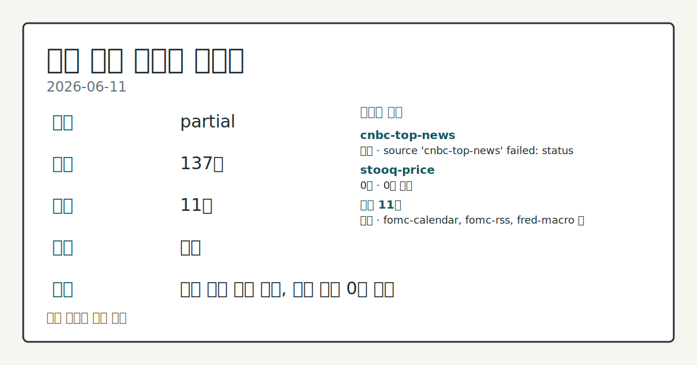
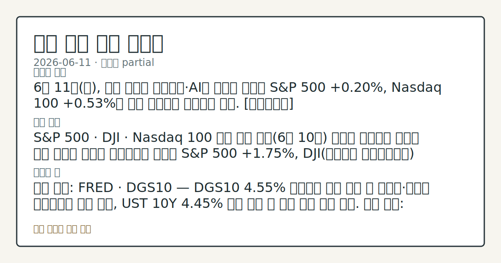
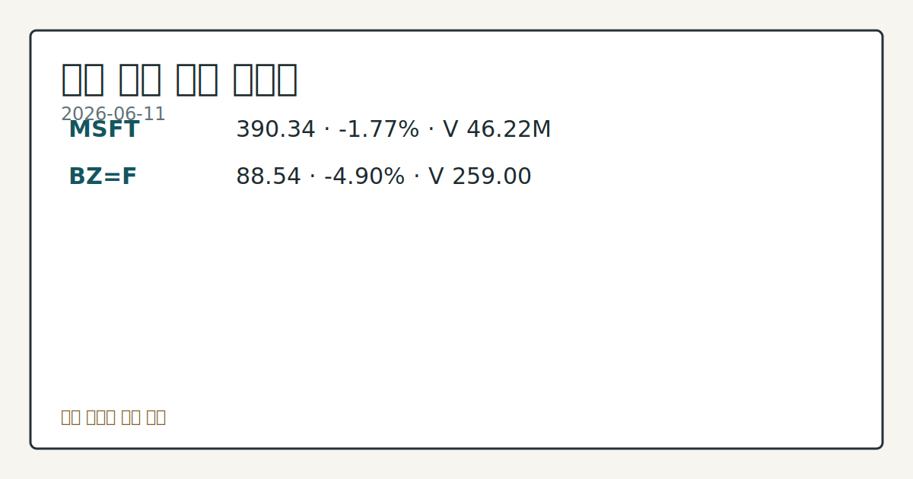

> 정보 제공용 자동 시황이며 매매 권유가 아닙니다.
# 2026-06-11 미국 증시 시황
**기준 시각**: 2026-06-11 NY · 2026-06-11T04:00Z, 2026-06-12T04:00Z)
| 종목 | 종가 | 변동 | 비고 |
|------|------|------|------|
| ^GSPC | 7,394.30 | +1.75% | -2.83% from 52w high · +7.81% YTD |
| ^IXIC | 25,809.66 | +2.54% | -4.74% from 52w high · +11.08% YTD |
| ^DJI | 50,848.75 | +1.86% | -1.38% from 52w high · +5.10% YTD |
| AAPL | 295.63 | +1.39% | -6.21% from 52w high · +9.08% YTD |
| MSFT | 390.34 | -1.77% | +9.41% from 52w low · -17.47% YTD |
**세그먼트**: [국내 증시](../../../domestic-equity/2026/06/2026-06-11.md) | [미국 증시](2026-06-11.md) | [크립토](../../../crypto/2026/06/2026-06-11.md)

*이미지: 데이터 신뢰도 · 출처: investo 자체 생성 · 생성: investo 0.1.0 · 2026-06-12 UTC*
> **내 관심 자산 영향**: 1건 확인 (기본 바스켓) — MSFT: [structured-symbol] MSFT 390.34 (**-1.77%**)
> **용어 가이드**: 이번 시황에서 처음 등장한 용어 — DXY(달러지수)
> **오늘의 결론**: 6월 11일(목), 미국 증시는 칩메이커·AI주 반등에 힘입어 S&P 500 **+0.20%**, Nasdaq 100 **+0.53%**의 소폭 상승세를 이어가고 있다. [데이터부족]
> **핵심 동인**: S&P 500 · DJI · Nasdaq 100 급등 마감 전일(6월 10일) 트럼프 대통령이 이란에 대한 계획된 공습을 철회했다는 소식에 S&P 500 **+1.75%**, DJI(다우존스 산업평균지수) **+1.86%**, Nasdaq 100 **+3.29%**로 급등 마감됐다.
> **주의할 점**: 확인 소스: FRED · DGS10 — DGS10 **4.55%** 수준에서 추가 상승 시 성장주·기술주 밸류에이션 압박 관찰, UST 10Y **4.45%**...
> **데이터 상태**: 부분 · 본문 사용 미집계 · 실패 1 · 0건 1

수집/품질 진단

> **데이터 상태**: 부분 — 수집 137건 / 소스 11개 / 누락: 없음 · 부분 — 일부 카테고리 미수집, 본문 일부 결론 보강 필요
> **소스 카운트**: 수집 대상 13 / 성공 11 / 0건 1 / 실패 1 / 본문 사용 미집계
> **소스 등급 분포**: S=4 / A=7
> **상세 사유**: 일부 소스 수집 실패, 일부 소스 0건 반환
> **소스별 상태**: cnbc-top-news 실패 (접근 제한), stooq-price 0건, 정상 11개

## 한눈에 보기
S&P 500(스탠더드앤드푸어스 500 지수) **+0.20%**, Nasdaq 100 **+0.53%** — 칩메이커·AI주 반등으로 전일 급등 흐름 연장
BZ=F(브렌트유 선물) **-4.90%** 급락, $**88.54** — 트럼프 이란 공습 철회 이후 에너지 지정학 프리미엄 해소
DGS10(10년 국채 금리) **4.55%** 상승, 6월 17일 FOMC(연방공개시장위원회) 회의 예정 — 금리 경로 방향 점검
## ⓪ 오늘의 매크로
**미 국채 수익률** — UST curve 2026-06-11: 10Y 4.45%, 2Y10Y +0.40pp
## ⓪-B 채널 기준선
| 기준선 | 값 |
|------|------|
| S&P 500 | 7,394.30 (+1.75%) |
| 나스닥 종합 | 25,809.66 (+2.54%) |
| 다우존스 | 50,848.75 (+1.86%) |
> **크로스마켓 연결 고리**: 금리 이벤트가 할인율/달러 경로의 공통 변수로 남아 있습니다.
> **오늘의 큰 그림:** 금리와 달러 변수가 미국·가상자산에 동시에 걸리며, 오늘 독자는 금리·달러 민감도을 먼저 확인해야 합니다.
## ① 요약

*이미지: 시장 스냅샷 · 출처: investo 자체 생성 · 생성: investo 0.1.0 · 2026-06-12 UTC*

6월 11일, 미국 증시는 칩메이커·AI주 반등에 힘입어 S&P 500 **+0.20%**, Nasdaq 100 **+0.53%**의 소폭 상승세를 이어가고 있다. 전일 트럼프 대통령의 이란 공습 철회로 촉발된 위험자산 선호 흐름이 이어지며, 에너지 시장에서는 BZ=F가 **-4.90%** 급락해 $**88.54**를 기록했다. 워치리스트 종목 MSFT는 **-1.77%** 하락 중이며, DGS10은 **4.55%**로 전일 대비 소폭 상승해 금리 부담도 일부 잔존한다. 오늘 PPI(생산자물가지수) 발표와 다음 주 6월 17일 FOMC 회의가 핵심 관전 변수로 대기하고 있다. [상승 관찰]

## ② 전일 핵심 이슈

### S&P 500 · DJI · Nasdaq 100 급등 마감

전일(6월 10일) 트럼프 대통령이 이란에 대한 계획된 공습을 철회했다는 소식에 [S&P 500 **+1.75%**, DJI **+1.86%**, Nasdaq 100 **+3.29%**로 급등 마감됐다](https://www.nasdaq.com/articles/stocks-settle-sharply-higher-middle-east-peace-hopes). ESM26(미니 S&P 선물)도 **+1.73%** 상승했다. 이는 6월 9일 반도체 급락 이후 이틀 만의 완전한 반전으로, 6월 3일 이후 재차 상승 기조가 확인됐다.

> **그래서 의미는?** 중동 지정학 완화가 위험자산 전반의 빠른 재반등을 이끄는 핵심 동인임이 재확인됐으며, 오늘도 그 연장 흐름이 관찰 중이다.

### DXY 2개월 고점 후 반락

[DXY](https://www.nasdaq.com/articles/dollar-rallies-and-gold-slumps-hawkish-fed-concerns)는 미국-이란 갈등 고조 우려로 장중 2개월 고점까지 **+0.23%** 상승했다가, 트럼프 공습 철회 발표 이후 [**-0.17%**로 반락](https://www.nasdaq.com/articles/dollar-falls-president-trump-cancels-attacks-iran)해 마감됐다. 안전자산 수요가 하루 만에 위험자산 선호로 전환된 하루였다.

## ③ 섹터/수급 동향

### 칩메이커·AI주 반등 지속

[오늘 장 중](https://www.nasdaq.com/articles/stocks-edge-higher-chipmakers-and-ai-stocks-rebound) Nasdaq 100 **+0.53%**, S&P 500 **+0.20%**, DJI **+0.43%**로 칩메이커·AI주 반등이 지수 상승을 지지하고 있다. ESM26은 **+0.29%** 상승 중이다. 6월 9일 반도체 급락 이후 이틀 연속 회복 흐름이다.

> **그래서 의미는?** 반도체·AI주가 이틀 연속 회복세를 보이며 기술주 수급의 단기 전환 가능성을 시사하나, 추세 지속 여부는 추가 확인이 필요하다.

### 브렌트유 급락 — 에너지 섹터 압박

BZ=F가 $**88.54**(**-4.90%**)를 기록했다. 저가 $**87.54**, 거래량 259. 중동 평화 기대에 따른 공급 위험 프리미엄 해소가 에너지 가격에 반영됐다.

## ④ 지표·이벤트

### 연방기금금리 · 물가 · 고용 — 주요 매크로 지표

[DFF(연방기금금리 실효치)](https://fred.stlouisfed.org/series/DFF)는 **3.62%**로 전일 대비 변동이 없다. [CPIAUCSL(소비자물가지수)](https://fred.stlouisfed.org/series/CPIAUCSL)는 5월 기준 333.979로 4월(332.407) 대비 **+1.572** 상승했다. [PPIFID(생산자물가 - 최종수요)](https://fred.stlouisfed.org/series/PPIFID)는 5월 158.012로 4월(156.395) 대비 **+1.617** 상승했다. [UNRATE(실업률)](https://fred.stlouisfed.org/series/UNRATE)은 **4.3%**로 전월과 동일하다.

> **그래서 의미는?** 소비자·생산자 물가가 모두 상승하는 가운데 실업률은 안정을 유지해, FOMC의 금리 방향 결정에 작용하는 복합 신호가 지속되고 있다.

### 국채 금리 및 수익률 곡선

[DGS10](https://fred.stlouisfed.org/series/DGS10)은 **4.55%**로 전일(**4.53%**) 대비 **+**0.02%**p** 상승했다. [재무부 UST(미국 국채) 커브](https://home.treasury.gov/resource-center/data-chart-center/interest-rates)(6월 11일 기준): 3M **3.78%**, 2Y **4.05%**, 10Y **4.45%**, 30Y **4.95%**, 3M10Y 스프레드 **+**0.67%**p**, 2Y10Y 스프레드 **+**0.40%**p**.

### 오늘·이번 주·이번 달 주요 일정

오늘(6월 11일) [PPI 발표](https://fred.stlouisfed.org/release?rid=46)와 [Z.1(미국 금융계정)](https://www.federalreserve.gov/newsevents/calendar.htm) 보고서(오후 12시, 동부시간)가 예정돼 있다. 연방준비제도는 오늘 [특정 정보 수집 데이터 표준 최종 규칙](https://www.federalreserve.gov/newsevents/pressreleases/bcreg20260611a.htm)을 발표했다. 이번 주: 6월 17일 [FOMC 회의 및 기자회견](https://www.federalreserve.gov/newsevents/calendar.htm)(6월 16~17일 이틀 회의), 6월 19일 Juneteenth 공휴일. 이번 달 이후: 6월 25일 [GDP(국내총생산) 발표](https://fred.stlouisfed.org/release?rid=53), 7월 2일 [Employment Situation(고용 상황) 발표](https://fred.stlouisfed.org/release?rid=50), 7월 8일 [FOMC 의사록 공개](https://www.federalreserve.gov/newsevents/calendar.htm).

## ⑤ 주요 종목

<!-- u50 lightweight-charts-embed: placeholders consumed by site_docs/assets/investo-chart-init.js -->

<noscript><em>인터랙티브 차트는 JavaScript가 활성화된 환경에서 표시됩니다. 위 정적 카드가 동일한 정보를 담고 있습니다.</em></noscript>

*이미지: 가격 스냅샷 · 출처: investo 자체 생성 · 생성: investo 0.1.0 · 2026-06-12 UTC*

### 실적 발표 예정 (장 마감 후)

오늘 장 마감 후 세 기업의 실적 발표가 집중된다.

| 종목 | EPS 전망 | 전년 동기 EPS | 회계분기 |
|------|---------|------------|---------|
| [ADBE](https://www.nasdaq.com/market-activity/stocks/adbe/earnings) (Adobe Inc.) | $**4.74** | $**4.10** | 2026년 5월 |
| [LEN](https://www.nasdaq.com/market-activity/stocks/len/earnings) (Lennar Corporation) | $**1.23** | $**1.90** | 2026년 5월 |
| [RH](https://www.nasdaq.com/market-activity/stocks/rh/earnings) | ($**2.13**) | $**0.13** | 2026년 4월 |

> **그래서 의미는?** ADBE(어도비), LEN(레나), RH 세 기업의 장 마감 후 실적 공개는 내일 개장 방향에 영향을 줄 핵심 변수로 확인이 필요하다.

### 확인 항목

[MSFT](https://finance.yahoo.com/quote/MSFT) $**390.34**(**-1.77%**): 시가 $**395.11**, 고가 $**396.85**, 저가 $**384.00**, 거래량 46,218,962.

### 공시 항목

INTUIT INC.(CIK 0000896878)가 오늘(6월 11일) 8-K 공시를 제출했다. Item 8.01(기타 이벤트) 및 Item 9.01(재무제표 및 첨부) 관련이다.

## ⑥ 오늘의 관전 포인트

#### 관찰 신호: DGS10

- 출처: 확인 소스 미상
- 현재: 확인 소스: FRED · DGS10 — DGS10 **4.55%** 수준에서 추가 상승 시 성장주·기술주 밸류에이션 압박 관찰, UST 10Y **4.45%** 이하 반락 시 금리 완화 흐름 점검. 관심 영향: 칩메이커·AI주 수급 방향 확인.
- 확인 조건: 상방 상방 데이터 부족; 하방 하방 데이터 부족
- 신뢰도: 높음
- 관심 영향: 관심 영향: 칩메이커

#### 관찰 신호: PPI 발표

- 출처: 확인 소스 미상
- 현재: 확인 소스: FRED · PPI 발표 — 오늘 발표되는 PPI가 PPIFID **158.012** 대비 상승 추세 지속 시 인플레이션 압박 관찰, 전망치 하회 시 물가 둔화 신호 점검. 관심 영향: 6월 17일 FOMC 금리 방향 확인.
- 확인 조건: 상방 상방 데이터 부족; 하방 PPI 발표
- 신뢰도: 보통
- 관심 영향: 관심 영향: 6월 17일 FOMC 금리 방향 확인.

#### 관찰 신호: ADBE 실적

- 출처: 확인 소스 미상
- 현재: 확인 소스: Nasdaq · ADBE 실적 — 장 마감 후 ADBE EPS 전망 $**4.74** 상회 시 소프트웨어·SaaS(서비스형 소프트웨어)주 반등 추세 확인, 하회 시 기술주 심리 변화 흐름 점검. 관심 영향: 내일 Nasdaq 100 개장 방향 확인.
- 확인 조건: 상방 ADBE 실적; 하방 SaaS(서비스형 소프트웨어)주 반등 추세 확인, 하회 시 기술주 심리 변화 흐름 점검
- 신뢰도: 보통
- 관심 영향: 관심 영향: 내일 Nasdaq 100 개장 방향 확인.

#### 관찰 신호: MSFT

- 출처: 확인 소스 미상
- 현재: 확인 소스: Yahoo Finance · MSFT — MSFT 저가 $**384.00** 이탈 시 대형 소프트웨어주 하방 압력 관찰, 고가 $**396.85** 회복 시 반등 흐름 점검. 관심 영향: 기술주 전반 수급 변동 관찰.
- 확인 조건: 상방 MSFT; 하방 MSFT
- 신뢰도: 보통
- 관심 영향: 관심 영향: 기술주 전반 수급 변동 관찰.

#### 관찰 신호: 확인 소스: FOMC 캘린더 · 6월 17일 회의 —…

- 출처: 확인 소스 미상
- 현재: 확인 소스: FOMC 캘린더 · 6월 17일 회의 — DFF **3.62%** 기준 발표문 매파 전환 시 금리 민감 성장주 변동 관찰, 비둘기파 신호 확인 시 위험자산 선호 확장 흐름 점검. 관심 영향: 이번 주 시장 전반 방향성 확인.
- 확인 조건: 상방 상방 데이터 부족; 하방 하방 데이터 부족
- 신뢰도: 높음
- 관심 영향: 관심 영향: 이번 주 시장 전반 방향성 확인.
## ⑦ 면책조항
본 시황은 일반 정보 제공을 목적으로 자동 생성된 자료이며,
특정 종목·자산에 대한 매매 권유나 투자 자문이 아닙니다.
투자 결정과 그 결과에 대한 책임은 전적으로 본인에게 있으며,
본 시황의 내용에 따라 발생한 손실에 대해 작성자는 일체의 책임을 지지 않습니다.