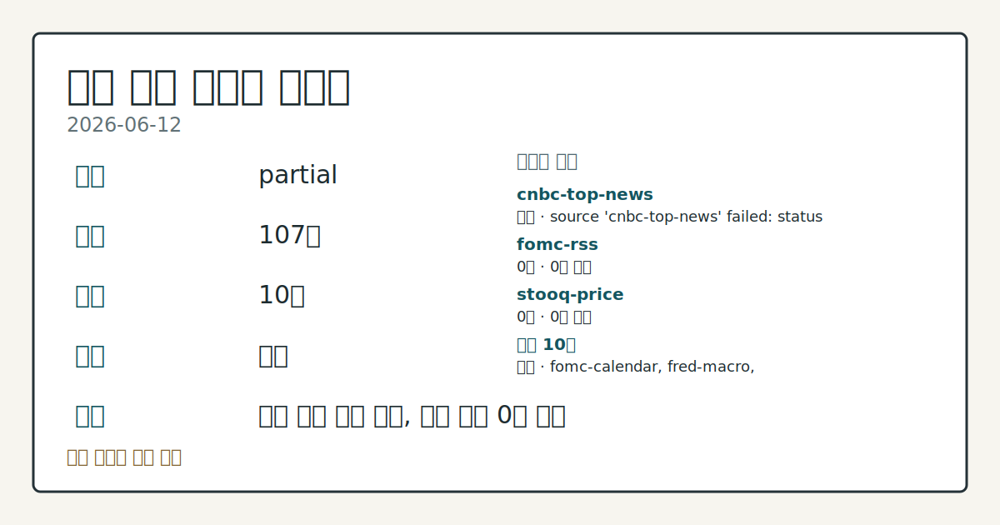
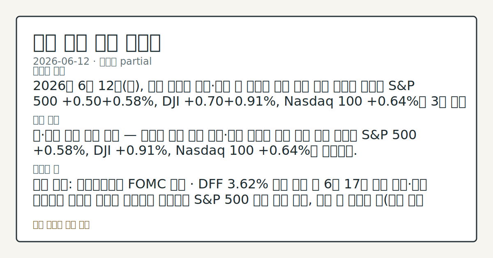
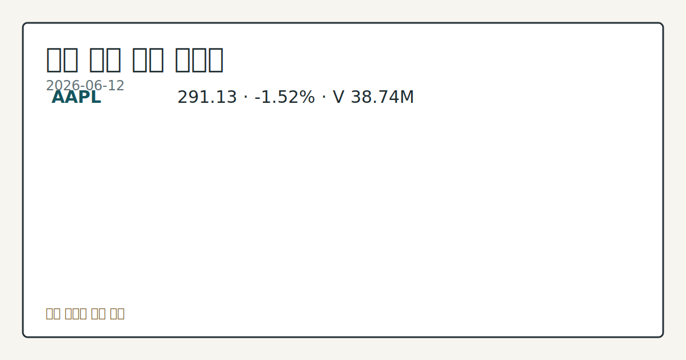

> 정보 제공용 자동 시황이며 매매 권유가 아닙니다.
# 2026-06-12 미국 증시 시황
**기준 시각**: 2026-06-12 NY · 2026-06-12T04:00Z, 2026-06-13T04:00Z)
| 종목 | 종가 | 변동 | 비고 |
|------|------|------|------|
| ^GSPC | 7,431.46 | +0.50% | -2.34% from 52w high · +8.35% YTD |
| ^IXIC | 25,888.84 | +0.31% | -4.45% from 52w high · +11.42% YTD |
| ^DJI | 51,202.26 | +0.70% | -0.70% from 52w high · +5.83% YTD |
| AAPL | 291.13 | -1.52% | -7.64% from 52w high · +7.42% YTD |
| MSFT | 390.74 | +0.10% | +9.52% from 52w low · -17.38% YTD |
**세그먼트**: [국내 증시](../../../domestic-equity/2026/06/2026-06-12.md) | [미국 증시](2026-06-12.md) | 크립토(미발행)

*이미지: 데이터 신뢰도 · 출처: investo 자체 생성 · 생성: investo 0.1.0 · 2026-06-13 UTC*
> **내 관심 자산 영향**: 3건 확인 (기본 바스켓) — AAPL: [structured-symbol] AAPL 291.13 (**-1.52%**); AMZN: [alias:Amazon] 8-K: AMAZON COM INC (CIK 0001018724); SOL: [alias:Solana] Securitize brings tokenized CLO fund to Solana with **$250** million backing from Ethena
> **오늘의 결론**: 2026년 6월 12일(금), 미국 증시는 미국·이란 간 근거리 평화 협정 기대 보도에 힘입어 S&P 500 +0.50**+0.58%**, DJI +0.70**+0.91%**, Nasdaq 100 **+0.64%**로 3대 지수 동반 상승 마감했다. [데이터부족]
> **핵심 동인**: 미·이란 평화 협상 기대 — 지정학 완화 랠리 미국·이란 근거리 평화 협정 기대 보도에 S&P 500 **+0.58%**, DJI **+0.91%**, Nasdaq 100 **+0.64%**로 마감했다.
> **주의할 점**: 확인 소스: 연방준비제도 FOMC 일정 · DFF **3.62%** 동결 기조 속 6월 17일 회의 결과·파월 기자회견 발언이 완화적 방향으로 확인되면 S&P...
> **데이터 상태**: 부분 · 본문 사용 미집계 · 실패 1 · 0건 2

수집/품질 진단

> **데이터 상태**: 부분 — 수집 107건 / 소스 10개 / 누락: 없음 · 부분 — 일부 카테고리 미수집, 본문 일부 결론 보강 필요
> **소스 카운트**: 수집 대상 13 / 성공 10 / 0건 2 / 실패 1 / 본문 사용 미집계
> **소스 등급 분포**: S=3 / A=7
> **상세 사유**: 일부 소스 수집 실패, 일부 소스 0건 반환
> **소스별 상태**: cnbc-top-news 실패 (접근 제한), fomc-rss 0건, stooq-price 0건, 정상 10개

## 한눈에 보기
S&P 500(스탠더드앤드푸어스 500 지수) **+0.50~+0.58%**, DJI(다우존스 산업평균지수) **+0.70~+0.91%**, Nasdaq 100(나스닥 100 지수) **+0.64%** — 미국·이란 근거리 평화 협정 기대에 3대 지수 동반 상승.
DGS10(10년물 미국채 수익률)이 전일 **4.45%**로 **-0.10pp** 하락해 채권 시장이 위험자산 선호 흐름을 지지.
다음 주 **6월 17일** FOMC(연방공개시장위원회) 회의·기자회견 예정 — DFF(연방기금금리) **3.62%** 동결 기조 속 파월 발언 방향이 이번 주 핵심 변수.
## ⓪ 오늘의 매크로
**미 국채 수익률** — UST curve 2026-06-12: 10Y 4.48%, 2Y10Y +0.39pp
## ⓪-B 채널 기준선
| 기준선 | 값 |
|------|------|
| S&P 500 | 7,431.46 (+0.50%) |
| 나스닥 종합 | 25,888.84 (+0.31%) |
| 다우존스 | 51,202.26 (+0.70%) |
> **크로스마켓 연결 고리**: 금리 이벤트가 할인율/달러 경로의 공통 변수로 남아 있습니다.
> **오늘의 큰 그림:** 공통 핵심 신호가 제한적이어서, 오늘은 세그먼트별 데이터 상태를 먼저 확인해야 합니다.
## ① 요약

*이미지: 시장 스냅샷 · 출처: investo 자체 생성 · 생성: investo 0.1.0 · 2026-06-13 UTC*

2026년 6월 12일, 미국 증시는 미국·이란 간 [근거리 평화 협정 기대](https://www.nasdaq.com/articles/stocks-rally-hopes-near-term-us-iran-interim-peace-agreement) 보도에 힘입어 S&P 500 **+0.50~+0.58%**, DJI **+0.70~+0.91%**, Nasdaq 100 **+0.64%**로 3대 지수 동반 상승 마감했다. 전일(6월 11일) 칩메이커·AI주 반등에 이어 지정학 완화 테마가 연속 매수세를 뒷받침한 형국이며, DGS10은 전일 **4.45%**로 **-0.10pp** 내리며 채권 시장도 위험선호를 지지했다. 다음 주 FOMC 회의(6월 16~17일)와 물가 지표 방향이 향후 매크로 분위기를 좌우할 변수로 부각된다. [상승 관찰]

## ② 전일 핵심 이슈

### 미·이란 평화 협상 기대 — 지정학 완화 랠리

[미국·이란 근거리 평화 협정 기대](https://www.nasdaq.com/articles/stocks-see-support-hopes-near-term-us-iran-peace-agreement) 보도에 S&P 500 **+0.58%**, DJI **+0.91%**, Nasdaq 100 **+0.64%**로 마감했다. ESM26(E-mini S&P 500 선물) **+0.70%**, SPY(S&P 500 ETF)·QQQ(Nasdaq 100 ETF)·DIA(DJI ETF)가 모두 동반 상승했다. 6월 10일 이란 공습 완료 이후 이틀 만에 "평화 협정" 언어가 헤드라인에 등장하며 지정학 리스크 프리미엄 추가 완화가 관찰됐다.

> **그래서 의미는?** 지정학 완화 기대가 단기 매수 동력으로 작용했으나, 협상 공식화 여부에 따라 흐름이 달라질 수 있어 추세 확인이 필요하다.

6월 8일~11일 AI 트레이드 재부상·칩메이커 반등과 연이어 지정학 완화까지 더해지며 복수 거래일 상승 흐름이 이어지고 있다. 전주(6월 4일) 이스라엘·레바논 휴전 발표에 이어 또 한 번의 지정학 완화 이벤트가 랠리를 지지한 패턴이다.

## ③ 섹터/수급 동향

### 섹터별 수급 데이터 현황

이번 입력 데이터에 섹터별 ETF(상장지수펀드) 자금 유출입이나 순매수·순매도 세부 수치가 포함되지 않았다. S&P 500·Nasdaq 100·DJI가 일제히 상승했으나 어떤 섹터가 주도했는지는 현재 수집 근거만으로 확인하기 어렵다.

> **그래서 의미는?** 현재 수집 근거가 부족해 방향보다 확인 필요 항목으로만 봅니다.

## ④ 지표·이벤트

### 미국채(UST) 수익률 곡선

[2026-06-12 기준 UST 수익률 곡선](https://home.treasury.gov/resource-center/data-chart-center/interest-rates): 3M **3.78%**, 2Y **4.09%**, 10Y **4.48%**, 30Y **4.97%**, 2Y10Y 스프레드 **+0.39pp**. [DGS10](https://fred.stlouisfed.org/series/DGS10)은 2026-06-11 기준 **4.45%**로 전일(2026-06-10) **4.55%** 대비 **-0.10pp** 하락했다.

> **그래서 의미는?** 장기 금리 하락은 성장주 밸류에이션 부담을 줄이는 방향으로 작용하므로, 이날 지수 상승과 방향이 일치하는 흐름으로 관찰된다.

### 주요 거시 지표

| 지표 | 최근값 | 기준 월 | 전기값 | 변화 |
|------|--------|---------|--------|------|
| [DFF](https://fred.stlouisfed.org/series/DFF) 연방기금금리 | 3.62% | 2026-06-11 | 3.62% | 0.00pp |
| [CPIAUCSL](https://fred.stlouisfed.org/series/CPIAUCSL) 소비자물가지수 | 333.979 | 2026-05 | 332.407 | +1.5720 |
| [PPIFID](https://fred.stlouisfed.org/series/PPIFID) 최종수요 생산자물가지수 | 158.012 | 2026-05 | 156.395 | +1.6170 |
| [UNRATE](https://fred.stlouisfed.org/series/UNRATE) 실업률 | 4.3% | 2026-05 | 4.3% | 0.00pp |

### 주요 일정 (이번 주~이번 달)

- **6월 16~17일**: [FOMC 이틀 회의](https://www.federalreserve.gov/newsevents/calendar.htm) — 6월 17일 오후 2시 결과 발표, [오후 2시 30분 기자회견](https://www.federalreserve.gov/live-broadcast.htm) (파월)
- **6월 25일**: [GDP(국내총생산) 발표](https://fred.stlouisfed.org/release?rid=53)
- **7월 2일**: [고용 상황(Employment Situation) 발표](https://fred.stlouisfed.org/release?rid=50)
- **7월 8일**: [FOMC 의사록 공개](https://www.federalreserve.gov/newsevents/calendar.htm) (6월 16~17일 회의분)

## ⑤ 주요 종목

<!-- u50 lightweight-charts-embed: placeholders consumed by site_docs/assets/investo-chart-init.js -->

<noscript><em>인터랙티브 차트는 JavaScript가 활성화된 환경에서 표시됩니다. 위 정적 카드가 동일한 정보를 담고 있습니다.</em></noscript>

*이미지: 가격 스냅샷 · 출처: investo 자체 생성 · 생성: investo 0.1.0 · 2026-06-13 UTC*

### 관전 분류

AAPL은 시가 **$296.03**에서 출발해 고가 **$297.14**까지 올랐으나 장중 저가 **$289.62**까지 밀린 뒤 **$291.13**(**-1.52%**)으로 마감했다. 거래량 38,742,100주로 3대 지수 상승과 역방향 흐름이 관찰됐다.

> **그래서 의미는?** AAPL(애플)이 시장 전반 상승 속 역방향 약세를 기록한 점은 개별 리스크 요인이 있을 수 있음을 시사하며, 원인 확인이 필요하다.

### 공시 체크리스트

- **SMCI (Super Micro Computer)**: 2026-06-12 [SEC 8-K 공시 제출](https://www.sec.gov/Archives/edgar/data/1375365/000119312526269703/0001193125-26-269703-index.htm) — Item 1.01(중요 계약 체결), Item 7.01(공정공시), Item 9.01(재무제표 및 첨부) 포함. 계약 세부 내용 추가 확인 필요.
- **AMZN (Amazon)**: 2026-06-12 SEC 8-K 공시 제출 확인 (CIK 0001018724). 내용 상세는 현재 입력 데이터에 포함되지 않아 별도 확인 필요.

## ⑥ 오늘의 관전 포인트

#### 관찰 신호: 확인 소스: 연방준비제도 FOMC 일정 · DFF **…

- 출처: 연방준비제도
- 현재: 확인 소스: 연방준비제도 FOMC 일정 · DFF **3.62%** 동결 기조 속 6월 17일 회의 결과·파월 기자회견 발언이 완화적 방향으로 확인되면 S&P 500 상방 흐름 관찰, 예상 외 매파적 톤 확인 시 하방 압력 방향 점검. 관심 영향: 기준금리 경로 및 성장주 밸류에이션 추세 확인.
- 확인 조건: 상방 파월 기자회견 발언이 완화적 방향으로 확인되면 S&P 500 상방 흐름 관찰, 예상 외 매파적 톤 확인 시 하방 압력 방향 점검; 하방 파월 기자회견 발언이 완화적 방향으로 확인되면 S&P 500 상방 흐름 관찰, 예상 외 매파적 톤 확인 시 하방 압력 방향 점검
- 신뢰도: 높음
- 관심 영향: 관심 영향: 기준금리 경로 및 성장주 밸류에이션 추세 확인.

#### 관찰 신호: DGS10 — 10Y 수익률

- 출처: FRED
- 현재: 확인 소스: FRED · DGS10 — 10Y 수익률이 **4.55%**(6월 10일 기준 전고점)를 재돌파하면 기술주 밸류에이션 부담 확대 방향 관찰, **4.45%**(6월 11일 기준) 이하 유지 확인 시 위험자산 선호 지속 흐름 추적. 관심 영향: Nasdaq 100 구성 종목 수급 변동 점검.
- 확인 조건: 상방 DGS10 — 10Y 수익률이 **4.55%**(6월 10일 기준 전고점)를 재돌파하면 기술주 밸류에이션 부담 확대 방향 관찰, **4.45%**(6월 11일 기준) 이하 유지 확인 시 위험자산 선호 지속 흐름 추적; 하방 하방 데이터 부족
- 신뢰도: 높음
- 관심 영향: 관심 영향: Nasdaq 100 구성 종목 수급 변동 점검.

#### 관찰 신호: 미·이란 협상 현황 — 협정 문구

- 출처: Nasdaq 뉴스
- 현재: 확인 소스: Nasdaq 뉴스 · 미·이란 협상 현황 — 협정 문구가 공식 발표 수준으로 구체화되면 지정학 리스크 프리미엄 추가 축소 방향 관찰, 협상 결렬 또는 부정 보도 시 WTI(서부텍사스산 원유) 가격 재반응 및 SPY 조정 흐름 추적. 관심 영향: 에너지 섹터 및 시장 전반 변동성 확인.
- 확인 조건: 상방 상방 데이터 부족; 하방 하방 데이터 부족
- 신뢰도: 보통
- 관심 영향: 관심 영향: 에너지 섹터 및 시장 전반 변동성 확인.

#### 관찰 신호: AAPL 주

- 출처: Yahoo Finance
- 현재: 확인 소스: Yahoo Finance · AAPL 주가 — 종가 **$291.13** 대비 당일 저가 **$289.62** 재이탈 시 추가 하방 압력 방향 관찰, 당일 고가 **$297.14** 회복 확인 시 반등 흐름 추적. 관심 영향: 대형 기술주 센티먼트 및 Nasdaq 100 연동 점검.
- 확인 조건: 상방 AAPL 주가 — 종가 **$291.13** 대비 당일 저가 **$289.62** 재이탈 시 추가 하방 압력 방향 관찰, 당일 고가 **$297.14** 회복 확인 시 반등 흐름 추적; 하방 AAPL 주가 — 종가 **$291.13** 대비 당일 저가 **$289.62** 재이탈 시 추가 하방 압력 방향 관찰, 당일 고가 **$297.14** 회복 확인 시 반등 흐름 추적
- 신뢰도: 높음
- 관심 영향: 관심 영향: 대형 기술주 센티먼트 및 Nasdaq 100 연동 점검.

#### 관찰 신호: GDP 발표 6월 25일 예정 — 수치

- 출처: FRED
- 현재: 확인 소스: FRED · GDP 발표 6월 25일 예정 — 수치가 예상 상단으로 확인되면 경기 회복 내러티브 강화 방향 관찰, 예상 하단 이탈 시 경기 우려 재부상 및 FOMC 이후 금리 경로 재평가 흐름 비교. 관심 영향: 통화 정책 기대와 시장 방향 연동 점검.
- 확인 조건: 상방 GDP 발표 6월 25일 예정 — 수치가 예상 상단으로 확인되면 경기 회복 내러티브 강화 방향 관찰, 예상 하단 이탈 시 경기 우려 재부상 및 FOMC 이후 금리 경로 재평가 흐름 비교; 하방 GDP 발표 6월 25일 예정 — 수치가 예상 상단으로 확인되면 경기 회복 내러티브 강화 방향 관찰, 예상 하단 이탈 시 경기 우려 재부상 및 FOMC 이후 금리 경로 재평가 흐름 비교
- 신뢰도: 보통
- 관심 영향: 관심 영향: 통화 정책 기대와 시장 방향 연동 점검.
## ⑦ 면책조항
본 시황은 일반 정보 제공을 목적으로 자동 생성된 자료이며,
특정 종목·자산에 대한 매매 권유나 투자 자문이 아닙니다.
투자 결정과 그 결과에 대한 책임은 전적으로 본인에게 있으며,
본 시황의 내용에 따라 발생한 손실에 대해 작성자는 일체의 책임을 지지 않습니다.