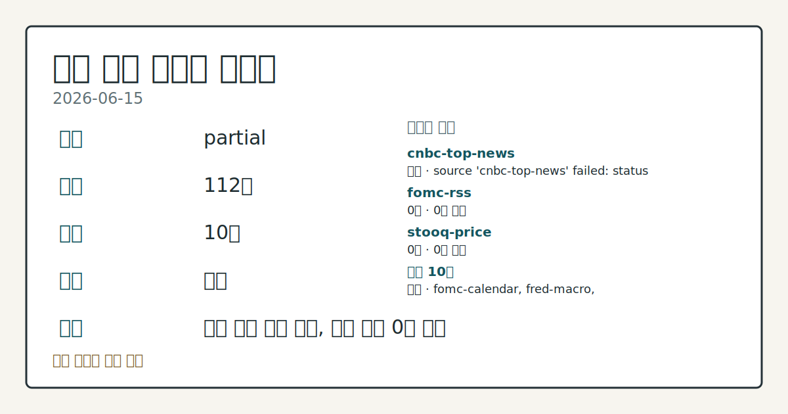
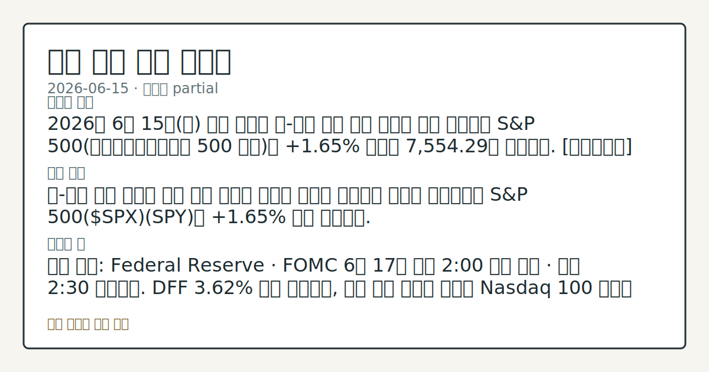
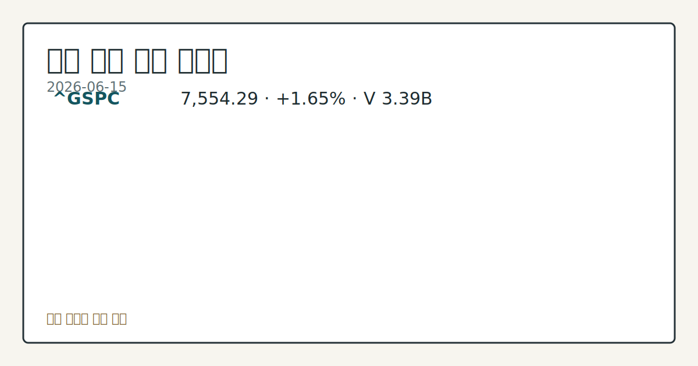

> 정보 제공용 자동 시황이며 매매 권유가 아닙니다.
# 2026-06-15 미국 증시 시황
**기준 시각**: 2026-06-15 NY · 2026-06-15T04:00Z, 2026-06-16T04:00Z)
| 종목 | 종가 | 변동 | 비고 |
|------|------|------|------|
| ^GSPC | 7,554.29 | +1.65% | -0.73% from 52w high · +10.15% YTD |
| ^IXIC | 26,683.94 | +3.07% | -1.51% from 52w high · +14.84% YTD |
| ^DJI | 51,671.03 | +0.92% | ATH 경신 · +6.80% YTD |
| AAPL | 296.42 | +1.82% | -5.96% from 52w high · +9.38% YTD |
| MSFT | 399.76 | +2.31% | +12.05% from 52w low · -15.47% YTD |
**세그먼트**: [국내 증시](../../../domestic-equity/2026/06/2026-06-15.md) | [미국 증시](2026-06-15.md) | [크립토](../../../crypto/2026/06/2026-06-15.md)

*이미지: 데이터 신뢰도 · 출처: investo 자체 생성 · 생성: investo 0.1.0 · 2026-06-16 UTC*
> **내 관심 자산 영향**: 관심 목록 미설정 — `config/watchlist.json`을 추가하면 보유 종목 영향이 표시됩니다.
> **용어 가이드**: 이번 시황에서 처음 등장한 용어 — 시가총액(시장가치)
> **오늘의 결론**: 2026년 6월 15일(월) 미국 증시는 美-이란 종전 합의 발표를 핵심 동인으로 S&P 500(스탠더드앤드푸어스 500 지수)이 **+1.65%** 상승해 7,554.29로 마감했다. [데이터부족]
> **핵심 동인**: 美-이란 종전 합의와 증시 상승 미국과 이란이 전쟁을 종료하는 합의를 발표하면서 S&P 500($SPX)(SPY)이 **+1.65%** 상승 마감했다.
> **주의할 점**: 확인 소스: Federal Reserve · FOMC 6월 17일 오후 2:00 결정 발표 · 오후 2:30 기자회견. DFF **3.62%** 동결 기준으로...
> **데이터 상태**: 부분 · 본문 사용 미집계 · 실패 1 · 0건 2

수집/품질 진단

> **데이터 상태**: 부분 — 수집 112건 / 소스 10개 / 누락: 없음 · 부분 — 일부 카테고리 미수집, 본문 일부 결론 보강 필요
> **소스 카운트**: 수집 대상 13 / 성공 10 / 0건 2 / 실패 1 / 본문 사용 미집계
> **소스 등급 분포**: S=3 / A=7
> **상세 사유**: 일부 소스 수집 실패, 일부 소스 0건 반환
> **소스별 상태**: cnbc-top-news 실패 (접근 제한), fomc-rss 0건, stooq-price 0건, 정상 10개

## 한눈에 보기
2026년 6월 15일 미국 증시는 美-이란 종전 합의 발표를 핵심 동인으로 S&P 500이 **+1.65%** 상승해 7,554.29로 마감했다. [데이터부족]
美-이란 종전 합의와 증시 상승 미국과 이란이 전쟁을 종료하는 합의를 발표하면서 S&P 500(SPY)이 **+1.65%** 상승 마감했다.
확인 소스: Federal Reserve · FOMC 6월 17일 오후 2:00 결정 발표 · 오후 2:30 기자회견. DFF **3.62%** 동결 기준으로, 금리 인상 신호가 나오면 Nasdaq 100 변동성 부담 압력 관찰, 동결 또는 인하 신호가 나오면 기술주 상승 지속 흐름 점검. 관심 영향: 금리 민감 성장주 수급 방향 확인. 확인 소스: FRED · DGS10 10년물 금리 **4.48%** 기준. 금리가 추가 상승하면 고밸류 기술주 부담 확대 관찰, 유가 급락에 따른 인플레이션 기대 완화로 금리가
## ⓪ 오늘의 매크로
**미 국채 수익률** — UST curve 2026-06-15: 10Y 4.47%, 2Y10Y +0.40pp
## ⓪-B 채널 기준선
| 기준선 | 값 |
|------|------|
| S&P 500 | 7,554.29 (+1.65%) |
| 나스닥 종합 | 26,683.94 (+3.07%) |
| 다우존스 | 51,671.03 (+0.92%) |
> **크로스마켓 연결 고리**: 금리 이벤트가 할인율/달러 경로의 공통 변수로 남아 있습니다.
> **오늘의 큰 그림:** 금리와 달러 변수가 국내·미국·가상자산에 동시에 걸리며, 오늘 독자는 금리·달러 민감도을 먼저 확인해야 합니다.
## ① 요약

*이미지: 시장 스냅샷 · 출처: investo 자체 생성 · 생성: investo 0.1.0 · 2026-06-16 UTC*

2026년 6월 15일 미국 증시는 美-이란 종전 합의 발표를 핵심 동인으로 S&P 500이 **+1.65%** 상승해 7,554.29로 마감했다. Nasdaq 100도 **+3.06%** 급등하며 기술주 중심 강세를 주도했으며, Dow Jones Industrial Average는 **+0.92%** 상승했다. 직전 세션까지 이어진 이란 군사 긴장 국면이 종전 합의로 전환되면서 유가는 급락하고 달러는 약세를 보였다. [상승 관찰]

## ② 전일 핵심 이슈

### 美-이란 종전 합의와 증시 상승

미국과 이란이 전쟁을 종료하는 합의를 발표하면서 [S&P 500($SPX)](https://www.nasdaq.com/articles/stocks-settle-sharply-higher-us-iran-peace-deal-spurs-optimism)(SPY)이 **+1.65%** 상승 마감했다. Nasdaq 100($IUXX)(QQQ)은 **+3.06%**, Dow Jones Industrial Average($DOWI)(DIA)는 **+0.92%** 상승했다. June E-mini S&P 선물(ESM26)도 **+1.68%** 올랐다. 직전 거래일인 6월 12일까지 이란 공습 리스크가 증시를 억누르던 흐름에서 종전 합의 발표로 명확히 전환됐다.

> **그래서 의미는?** 지정학 리스크 해소로 증시 전반에 매수세가 유입됐으며, 특히 기술주 중심 반등이 두드러진 흐름입니다.

### 호르무즈 해협 재개통 기대와 유가 급락

종전 합의로 호르무즈 해협(Strait of Hormuz) 재개통 기대가 높아지면서 [WTI(서부텍사스산 원유) 7월물(CLN26)](https://www.nasdaq.com/articles/crude-oil-prices-sink-deal-reopen-strait-hormuz)이 **-4.87%** 급락해 2개월 저점을 기록했다. RBOB(무연 가솔린) 7월물도 **-3.36%** 하락하며 2개월 저점으로 내렸다.

### DXY(달러지수) 약세

[달러지수(DXY00)](https://www.nasdaq.com/articles/dollar-pressured-deal-end-us-iran-war)는 1주일 저점까지 하락해 **-0.09%** 약세로 마감했다. 종전 합의로 안전자산 수요가 줄어들면서 달러 유동성 수요가 감소한 흐름이 확인됐다.

## Watchlist Carryover

| 이벤트 | 발원일 | 기대일 | 상태 |
|--------|--------|--------|------|
| FOMC 기자회견 (오후 2:30) | 2026-06-12 | 2026-06-17 | 이월 |
| Juneteenth(준틴스 독립기념일) — 미국 증시 휴장 | 2026-06-12 | 2026-06-19 | 이월 |
| GDP(국내총생산) 발표 | 2026-06-12 | 2026-06-25 | 이월 |
| Employment Situation(고용보고서) 발표 | 2026-06-12 | 2026-07-02 | 이월 |
| FOMC 의사록(6월 16~17일 회의) 공개 (오후 2:00) | 2026-06-12 | 2026-07-08 | 이월 |

## ③ 섹터/수급 동향

### 에너지 섹터 역행

시장 전반 상승 속에서 에너지주는 유가 급락 여파로 역행했다. FANG(Diamondback Energy)은 종가 **$189.96**으로 **-1.13%** 하락하며 지수 랠리에 참여하지 못했다.

> **그래서 의미는?** 에너지 섹터 역행은 종전 합의가 원유 공급 우려를 해소했다는 시장 해석을 반영하는 흐름입니다.

### 달러 약세 연계 원자재 상승

[달러지수](https://www.nasdaq.com/articles/dollar-weakness-sparks-short-covering-cocoa-futures-2) 약세에 연동해 코코아 선물이 강세를 보였다. July ICE NY 코코아(CCN26)가 **+2.73%**, July ICE London 코코아 #7(CAN26)이 **+2.98%** 상승하며 1.5주 고점으로 올랐다. 달러 약세에 따른 숏커버링(공매도상환)이 주요 동인으로 작용했다.

## ④ 지표·이벤트

### FRED 필수 매크로 지표

[DFF(연방기금 실효금리)](https://fred.stlouisfed.org/series/DFF)는 **3.62%**로 전일 대비 변동 없었다(2026-06-12 기준). [UNRATE(실업률)](https://fred.stlouisfed.org/series/UNRATE)도 **4.3%**로 전월 대비 변동 없이 유지됐다(2026-05 기준).

[CPIAUCSL(소비자물가지수)](https://fred.stlouisfed.org/series/CPIAUCSL)는 333.979로 전월(332.407) 대비 **+1.572** 상승했다(2026-05 기준). [PPIFID(최종수요 생산자물가지수)](https://fred.stlouisfed.org/series/PPIFID)는 158.012로 전월(156.395) 대비 **+1.617** 상승했다.

> **그래서 의미는?** CPI와 PPI가 동시에 전월 대비 상승하는 추세는 FOMC의 인플레이션 평가와 금리 경로 판단에서 관찰할 변수를 제공합니다.

### UST(미국채) 금리 곡선

[미국채 금리](https://home.treasury.gov/resource-center/data-chart-center/interest-rates)(2026-06-15 기준): 10Y **4.47%**, 2Y **4.07%**, 30Y **4.97%**, 3M **3.79%**. 2Y10Y 스프레드(장단기금리차)는 **+0.40pp**로 우상향 기울기를 유지 중이다. [DGS10](https://fred.stlouisfed.org/series/DGS10)(10년물 국채수익률)은 **4.48%**로 전일 대비 **+0.03pp** 상승했다.

### FOMC(연방공개시장위원회) 일정

[FOMC](https://www.federalreserve.gov/newsevents/calendar.htm) 6월 16~17일 양일간 회의가 진행 중이며, 6월 17일 오후 2:00 결정 발표, 오후 2:30 기자회견이 예정돼 있다. 이는 이월 중인 핵심 이벤트로 본 시황 발행 시점 기준 회의 진행 중이다.

### 원/달러 환율

[DEXKOUS(원/달러 환율)](https://fred.stlouisfed.org/series/DEXKOUS)는 1,518.87원으로 전일(1,530.97원) 대비 **-12.10원** 하락했다(2026-06-12 기준). 달러지수 약세와 연동한 흐름으로 확인된다.

## ⑤ 주요 종목

<!-- u50 lightweight-charts-embed: placeholders consumed by site_docs/assets/investo-chart-init.js -->

<noscript><em>인터랙티브 차트는 JavaScript가 활성화된 환경에서 표시됩니다. 위 정적 카드가 동일한 정보를 담고 있습니다.</em></noscript>

*이미지: 가격 스냅샷 · 출처: investo 자체 생성 · 생성: investo 0.1.0 · 2026-06-16 UTC*

### 실적 발표 확인 항목

- **PLAY**(Dave & Buster's Entertainment): 6월 16일(화) 장 마감 후 실적 발표 예정. EPS 전망치 **$0.37**, 전년 동기 실적 **$0.76**. 시가총액 **$449,180,507** 규모. [Nasdaq 실적 캘린더](https://www.nasdaq.com/market-activity/stocks/play/earnings)

### 관전 항목

- **FANG**(Diamondback Energy): 시장 전반 상승 속 종가 **$189.96**으로 **-1.13%** 하락. 유가 급락과 에너지 섹터 역행 흐름 확인 필요.
- **ARK** 계열 / Cathie Wood: [야후파이낸스](https://finance.yahoo.com/markets/stocks/articles/cathie-wood-buys-529-7-133300502.html) 보도 기준 **$529.7 million** 규모 신규 종목 순매수 확인. 구체 종목명은 제공 데이터에 없어 확인 필요.

> **그래서 의미는?** 에너지주 역행과 ARK의 대규모 매수 움직임은 섹터 로테이션 추세를 관찰하는 데 유용한 데이터 포인트입니다.

## ⑥ 오늘의 관전 포인트

#### 관찰 신호: FOMC 6월 17일 오후 2:00 결정 발표 · 오후…

- 출처: Federal Reserve
- 현재: 확인 소스: Federal Reserve · FOMC 6월 17일 오후 2:00 결정 발표 · 오후 2:30 기자회견. DFF **3.62%** 동결 기준으로, 금리 인상 신호가 나오면 Nasdaq 100 변동성 부담 압력 관찰, 동결 또는 인하 신호가 나오면 기술주 상승 지속 흐름 점검. 관심 영향: 금리 민감 성장주 수급 방향 확인.
- 확인 조건: 상방 상방 데이터 부족; 하방 하방 데이터 부족
- 신뢰도: 높음
- 관심 영향: 관심 영향: 금리 민감 성장주 수급 방향 확인.

#### 관찰 신호: DGS10 10년물 금리 **4.48%** 기준. 금리

- 출처: FRED
- 현재: 확인 소스: FRED · DGS10 10년물 금리 **4.48%** 기준. 금리가 추가 상승하면 고밸류 기술주 부담 확대 관찰, 유가 급락에 따른 인플레이션 기대 완화로 금리가 하락하면 S&P 500 반등 지속 흐름 추세 확인. 관심 영향: S&P 500 밸류에이션 환경 비교.
- 확인 조건: 상방 상방 데이터 부족; 하방 하방 데이터 부족
- 신뢰도: 높음
- 관심 영향: 관심 영향: S&P 500 밸류에이션 환경 비교.

#### 관찰 신호: 종전 합의 이후 유

- 출처: CLN26(WTI 7월물)
- 현재: 확인 소스: CLN26(WTI 7월물) · 종전 합의 이후 유가 **-4.87%** 급락 기조 유지 여부. 유가가 추가 하락하면 에너지 섹터 압박 심화 관찰, 지정학 불안 재점화 시 유가 반등 및 에너지주 수급 변화 흐름 점검. 관심 영향: FANG 등 에너지 섹터 수급 변동 관찰.
- 확인 조건: 상방 상방 데이터 부족; 하방 하방 데이터 부족
- 신뢰도: 높음
- 관심 영향: 관심 영향: FANG 등 에너지 섹터 수급 변동 관찰.

#### 관찰 신호: CPIAUCSL **333.979** / PPIFID…

- 출처: FRED
- 현재: 확인 소스: FRED · CPIAUCSL **333.979** / PPIFID **158.012** 전월 대비 동반 상승 기조. FOMC가 인플레이션 재가속 우려를 언급하면 금리 동결 연장 압박 관찰, 일시적 상승으로 해석하면 완화 기대 유지 흐름 추세 확인. 관심 영향: 금리 민감 섹터 전반 수급 점검.
- 확인 조건: 상방 상방 데이터 부족; 하방 하방 데이터 부족
- 신뢰도: 낮음
- 관심 영향: 관심 영향: 금리 민감 섹터 전반 수급 점검.

#### 관찰 신호: PLAY 6월 16일 장 후 실적(EPS 전망 **$0…

- 출처: Nasdaq 실적 캘린더
- 현재: 확인 소스: Nasdaq 실적 캘린더 · PLAY 6월 16일 장 후 실적(EPS 전망 **$0.37** vs 전년 **$0.76**). 전망치 상회 시 소형 소비재주 반응 관찰, 하회 시 전년 대비 이익 감소 지속 여부 흐름 점검. 관심 영향: 소비 경기 민감주 추세 비교.
- 확인 조건: 상방 전망치 상회 시 소형 소비재주 반응 관찰, 하회 시 전년 대비 이익 감소 지속 여부 흐름 점검; 하방 전망치 상회 시 소형 소비재주 반응 관찰, 하회 시 전년 대비 이익 감소 지속 여부 흐름 점검
- 신뢰도: 높음
- 관심 영향: 관심 영향: 소비 경기 민감주 추세 비교.

#### 관찰 신호: 이번 주 일정: 6월 17일(수) FOMC 결정(오후…

- 출처: 확인 소스 미상
- 현재: 이번 주 일정: 6월 17일(수) FOMC 결정(오후 2:00) 및 기자회견(오후 2:30), 6월 19일(목) Juneteenth — 미국 증시 휴장. 이달 말 일정: 6월 25일 GDP(국내총생산) 발표(FRED) 예정. 관심 영향: 경기 모멘텀 방향 데이터 비교.
- 확인 조건: 상방 상방 데이터 부족; 하방 하방 데이터 부족
- 신뢰도: 보통
- 관심 영향: 관심 영향: 경기 모멘텀 방향 데이터 비교.
## ⑦ 면책조항
본 시황은 일반 정보 제공을 목적으로 자동 생성된 자료이며,
특정 종목·자산에 대한 매매 권유나 투자 자문이 아닙니다.
투자 결정과 그 결과에 대한 책임은 전적으로 본인에게 있으며,
본 시황의 내용에 따라 발생한 손실에 대해 작성자는 일체의 책임을 지지 않습니다.