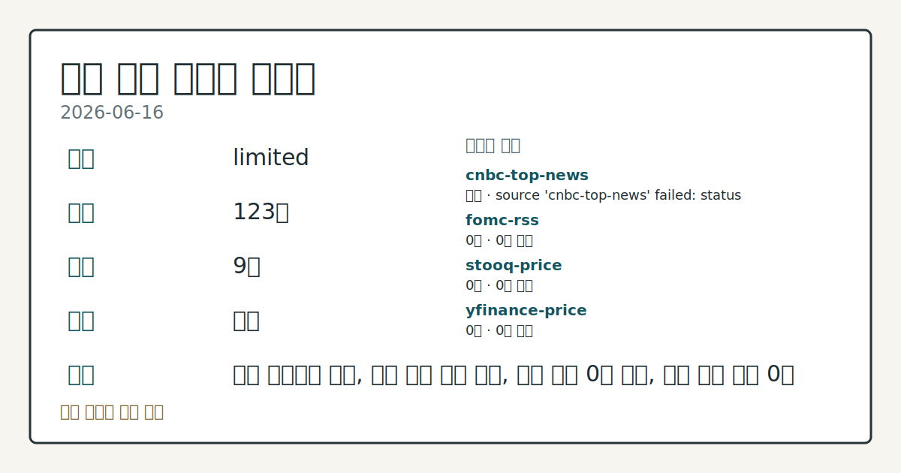
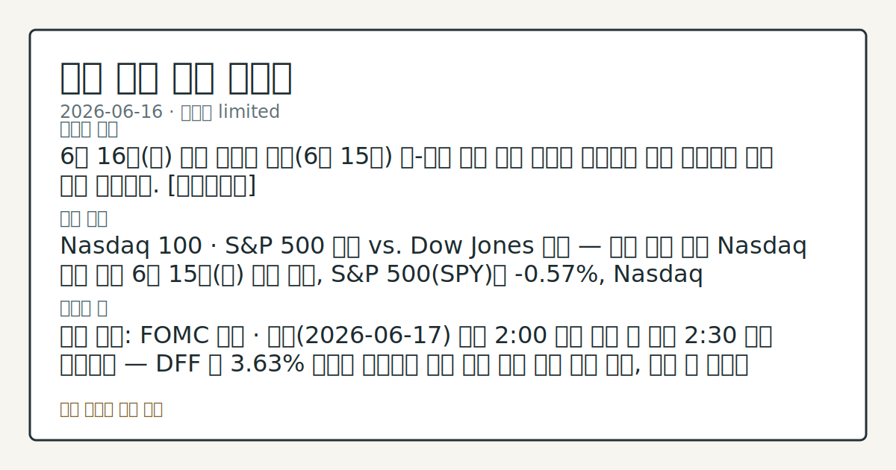

> 정보 제공용 자동 시황이며 매매 권유가 아닙니다.
# 2026-06-16 미국 증시 시황
**기준 시각**: 2026-06-16 NY · 2026-06-16T04:00Z, 2026-06-17T04:00Z)
| 종목 | 종가 | 변동 | 비고 |
|------|------|------|------|
| ^GSPC | 7,511.35 | -0.57% | -1.29% from 52w high · +9.52% YTD |
| ^IXIC | 26,376.34 | -1.15% | -2.65% from 52w high · +13.52% YTD |
| ^DJI | 51,999.67 | +0.64% | ATH 경신 · +7.48% YTD |
| AAPL | 299.24 | +0.95% | -5.06% from 52w high · +10.42% YTD |
| MSFT | 393.83 | -1.48% | +10.39% from 52w low · -16.73% YTD |
**세그먼트**: [국내 증시](../../../domestic-equity/2026/06/2026-06-16.md) | [미국 증시](2026-06-16.md) | [크립토](../../../crypto/2026/06/2026-06-16.md)

*이미지: 데이터 신뢰도 · 출처: investo 자체 생성 · 생성: investo 0.1.0 · 2026-06-17 UTC*
> **내 관심 자산 영향**: 데이터 수집 부족으로 매칭 판단 보류 — 추가 수집 후 재평가됩니다.
> **용어 가이드**: 이번 시황에서 처음 등장한 용어 — EPS(주당순이익)
> **오늘의 결론**: 6월 16일(화) 미국 증시는 어제(6월 15일) 美-이란 종전 합의 발표로 형성됐던 상승 흐름에서 하루 만에 이탈했다. [데이터부족]
> **핵심 동인**: Nasdaq 100 · S&P 500 하락 vs. Dow Jones 상승 — 지수 분화 마감 Nasdaq 기사 기준 6월 15일(화) 마감 결과, S&P 500(SPY)은 **-0.57%**, Nasdaq 100(QQQ)은 **-1.89%** 하락했고 ESM26(미니 S&P 500 선물)도 **-0.60%** 내렸다.
> **주의할 점**: 확인 소스: FOMC 일정 · 내일(2026-06-17) 오후 2:00 금리 결정 및 오후 2:30 파월 기자회견 — DFF 현 **3.63%** 동결이...
> **데이터 상태**: 제한 · 본문 사용 미집계 · 실패 1 · 0건 3

수집/품질 진단

> **데이터 상태**: 제한 — 수집 123건 / 소스 9개 / 누락: 가격 · 제한 — 핵심 가격 소스 0건/실패/stale, 본문 결론 신뢰도 낮음
> **소스 카운트**: 수집 대상 13 / 성공 9 / 0건 3 / 실패 1 / 본문 사용 미집계
> **소스 등급 분포**: S=3 / A=6
> **상세 사유**: 가격 카테고리 누락, 일부 소스 수집 실패, 일부 소스 0건 반환, 핵심 가격 소스 0건
> **소스별 상태**: cnbc-top-news 실패 (접근 제한), fomc-rss 0건, stooq-price 0건, yfinance-price 0건, 정상 9개

## 한눈에 보기
S&P 500 **-0.57%** · Nasdaq 100 **-1.89%** · Dow Jones(다우존스 산업평균지수) **+0.64%** — 칩메이커 후퇴로 지수 방향이 엇갈린 마감
WTI(서부텍사스산 원유) **-5.83%** 급락, 4거래일 연속 하락 끝에 3.5개월 최저치 기록
FOMC(연방공개시장위원회) 회의 오늘(6월 16~17일) 진행 중 — 내일 오후 2:30 파월 기자회견, DFF(실효 연방기금금리) 현 **3.63%** 동결 여부 관찰
## ⓪ 오늘의 매크로
**FOMC 일정** — 2026-06-17 — FOMC Meeting
**미 국채 수익률** — UST curve 2026-06-16: 10Y 4.43%, 2Y10Y +0.38pp
## ⓪-B 채널 기준선
| 기준선 | 값 |
|------|------|
| S&P 500 | 7,511.35 (-0.57%) |
| 나스닥 종합 | 26,376.34 (-1.15%) |
| 다우존스 | 51,999.67 (+0.64%) |
> **크로스마켓 연결 고리**: 금리 이벤트가 할인율/달러 경로의 공통 변수로 남아 있습니다.
> **오늘의 큰 그림:** 금리와 달러 변수가 국내·미국에 동시에 걸리며, 오늘 독자는 금리·달러 민감도을 먼저 확인해야 합니다.
## ① 요약

*이미지: 시장 스냅샷 · 출처: investo 자체 생성 · 생성: investo 0.1.0 · 2026-06-17 UTC*

6월 16일 미국 증시는 어제 美-이란 종전 합의 발표로 형성됐던 상승 흐름에서 하루 만에 이탈했다. 칩메이커·기술주 매도가 Nasdaq 100을 **-1.89%** 끌어내렸고 S&P 500도 **-0.57%** 하락했으나, Dow Jones는 **+0.64%** 올라 방어주 중심 분화 구도가 나타났다. WTI 원유는 글로벌 공급 정상화 기대 속에 **-5.83%** 급락해 3.5개월 최저치를 기록했고, DXY(달러지수)도 주택 지표 부진 여파로 **-0.12%** 소폭 후퇴했다. FOMC 6월 회의가 오늘부터 이틀간 진행되는 가운데 시장은 내일 오후 금리 결정과 파월 의장 기자회견을 주시하는 흐름이다. [혼재]

## ② 전일 핵심 이슈

### Nasdaq 100 · S&P 500 하락 vs. Dow Jones 상승 — 지수 분화 마감

[Nasdaq 기사](https://www.nasdaq.com/articles/stocks-indexes-finish-mostly-lower-chipmakers-retreat) 기준 6월 15일(화) 마감 결과, S&P 500은 **-0.57%**, Nasdaq 100은 **-1.89%** 하락했고 ESM26도 **-0.60%** 내렸다. 반면 Dow Jones(DIA)는 **+0.64%** 상승하며 경기 방어주 중심의 양극화 흐름을 연장했다. 어제 지정학적 완화 재료로 형성된 랠리가 하루 만에 반도체·칩메이커 중심으로 반전된 것이다.

> **그래서 의미는?** 어제 美-이란 종전 합의 랠리가 기술주·반도체 매도로 빠르게 되돌려지면서 수급 취약성 재확인 흐름을 점검할 수 있습니다.

### WTI 원유 4거래일 연속 급락 — 3.5개월 최저

[원유 기사](https://www.nasdaq.com/articles/crude-oil-prices-sink-global-oil-supplies-look-normalize)에 따르면 7월물 WTI(CLN26)가 화요일 **-4.70달러(**-5.83%**)** 하락해 3.5개월 최저치를 기록했고, 7월물 RBOB(RBN26, 가솔린 선물)도 **-0.0667달러(**-2.26%**)** 내렸다. 글로벌 석유 공급 정상화 기대가 4거래일 연속 하락 압력의 배경으로 작용했다.

### 주택 지표 부진 + 원유 약세 → DXY 소폭 후퇴

[달러 기사](https://www.nasdaq.com/articles/dollar-slips-weak-us-housing-news-and-lower-crude-prices)에 따르면 5월 주택착공(Housing Starts)·건축허가(Building Permits)가 예상 대비 부진하게 발표됐고, WTI의 **-5%** 수준 급락이 겹치며 DXY가 **-0.12%** 하락했다.

## Watchlist Carryover

| 이벤트 | 발원일 | 기대일 | 상태 |
|--------|--------|--------|------|
| FOMC 기자회견 (오후 2:30) | 2026-06-12 | 2026-06-17 | 이월 |
| Juneteenth(준틴스 독립기념일) — 미국 증시 휴장 | 2026-06-12 | 2026-06-19 | 이월 |
| GDP(국내총생산) 발표 | 2026-06-12 | 2026-06-25 | 이월 |
| Employment Situation(고용보고서) 발표 | 2026-06-12 | 2026-07-02 | 이월 |
| FOMC 의사록(6월 16~17일 회의) 공개 (오후 2:00) | 2026-06-12 | 2026-07-08 | 이월 |

## ③ 섹터/수급 동향

### 섹터 세부 수급 — 데이터 제한

이번 세그먼트의 섹터별 수급 상세 데이터는 충분히 수집되지 않았다. 이용 가능한 정보 기준으로는 칩메이커·기술주 중심의 Nasdaq 100 약세와 경기 방어주 중심의 Dow Jones 상승이라는 방향 분화 흐름만 확인된다.

> **그래서 의미는?** 현재 수집 근거가 부족해 방향보다 확인 필요 항목으로만 봅니다.

## ④ 지표·이벤트

### FRED 거시 지표 — 물가·고용·정책금리

[FRED DFF](https://fred.stlouisfed.org/series/DFF): 실효 연방기금금리(DFF)는 2026년 6월 15일 기준 **3.63%** (전일 **3.62%** 대비 **+0.01%**p). [FRED CPIAUCSL](https://fred.stlouisfed.org/series/CPIAUCSL): CPI(소비자물가지수)는 2026년 5월 기준 **333.979** (전월 **332.407** 대비 +**1.572**). [FRED PPIFID](https://fred.stlouisfed.org/series/PPIFID): PPI(생산자물가지수, 최종 수요 기준)는 5월 기준 **158.012** (전월 **156.395** 대비 +**1.617**). [FRED UNRATE](https://fred.stlouisfed.org/series/UNRATE): 실업률(UNRATE)은 5월 기준 **4.3%** (전월 대비 보합).

> **그래서 의미는?** CPI·PPI 레벨이 동반 상승 중이고 실업률은 보합이어서, Federal Reserve(연방준비제도)가 단기 금리 인하를 검토하기 어려운...

### UST(미국채) 금리 곡선

[Treasury 금리](https://home.treasury.gov/resource-center/data-chart-center/interest-rates): 2026-06-16 기준 UST 3개월 **3.79%** · 2년 **4.05%** · 10년 **4.43%** · 30년 **4.93%**, 2년-10년 스프레드 +**0.38%**p, 3개월-10년 스프레드 +**0.64%**p. [FRED DGS10](https://fred.stlouisfed.org/series/DGS10): 10년 국채 수익률은 6월 15일 기준 **4.47%** (전일 **4.48%** 대비 **-0.01%**p 소폭 하락).

### FOMC 6월 회의 일정

[Federal Reserve 일정](https://www.federalreserve.gov/newsevents/calendar.htm): FOMC 6월 회의는 6월 16~17일 이틀 일정으로 진행 중이다. 내일 오후 2:00 결정 발표 후 오후 2:30 [파월 의장 기자회견](https://www.federalreserve.gov/live-broadcast.htm)이 예정돼 있으며, 7월 8일 오후 2:00 해당 회의 의사록(Minutes) 공개가 예정돼 있다.

## ⑤ 주요 종목

<!-- u50 lightweight-charts-embed: placeholders consumed by site_docs/assets/investo-chart-init.js -->

<noscript><em>인터랙티브 차트는 JavaScript가 활성화된 환경에서 표시됩니다. 위 정적 카드가 동일한 정보를 담고 있습니다.</em></noscript>

### 관찰 항목

| 티커 | 동향 | 비고 |
|------|------|------|
| CCL | **+2.59%** 상승, 종가 **$30.9** | 지수 약세 속 독립적 상승 확인 |
| TEVA | 상세 미확인 | Yahoo Finance 마켓 업데이트 언급 |
| APD | 상세 미확인 | Yahoo Finance 마켓 업데이트 언급 |
| DG | 상세 미확인 | Yahoo Finance 마켓 업데이트 언급 |

### 실적 발표 예정

| 티커 | 발표 시점 | EPS 컨센서스 |
|------|-----------|-------------|
| WLY | 장전(pre-market) | **$1.65** |
| KEP | 미확인 | **$1.26** |
| CCEP | 미확인 | 미제공 |

> **그래서 의미는?** CCL(카니발 크루즈)이 전반적인 지수 하락 속에서도 **+2.59%** 상승 마감한 점이 눈에 띄며, TEVA·APD·DG 등은 추가 데이터...

## ⑥ 오늘의 관전 포인트

#### 관찰 신호: 확인 소스: FOMC 일정 · 내일 오후 2:00 금리…

- 출처: 확인 소스 미상
- 현재: 확인 소스: FOMC 일정 · 내일 오후 2:00 금리 결정 및 오후 2:30 파월 기자회견 — DFF 현 **3.63%** 동결이 확인되면 기존 통화 경로 유지 흐름 관찰, 예상 외 신호가 나타나면 ESM26 및 Nasdaq 100 수급 변동 추세 점검. 관심 영향: 기술주·성장주 단기 수급 방향 확인.
- 확인 조건: 상방 상방 데이터 부족; 하방 하방 데이터 부족
- 신뢰도: 높음
- 관심 영향: 관심 영향: 기술주

#### 관찰 신호: 확인 소스: Treasury 금리 · UST 10년물…

- 출처: 확인 소스 미상
- 현재: 확인 소스: Treasury 금리 · UST 10년물 **4.43%** 기준 — **4.47%**(FRED DGS10 수준) 이상을 지속 상회하면 성장주 밸류에이션 압박 추세 관찰, **4.05%**(2년물 현 수준) 방향으로 하락하면 위험자산 선호 회복 흐름 점검. 관심 영향: Nasdaq 100 대형 기술주 수급 추세 확인.
- 확인 조건: 상방 UST 10년물 **4.43%** 기준 — **4.47%**(FRED DGS10 수준) 이상을 지속 상회하면 성장주 밸류에이션 압박 추세 관찰, **4.05%**(2년물 현 수준) 방향으로 하락하면 위험자산 선호 회복 흐름 점검; 하방 하방 데이터 부족
- 신뢰도: 높음
- 관심 영향: 관심 영향: Nasdaq 100 대형 기술주 수급 추세 확인.

#### 관찰 신호: 확인 소스: WTI 원유 동향 · CLN26(7월물 W…

- 출처: 확인 소스 미상
- 현재: 확인 소스: WTI 원유 동향 · CLN26(7월물 WTI) 3.5개월 최저 수준 — 추가 하락이 지속되면 글로벌 공급 정상화 해석 유지 흐름 관찰, 반등 전환이 나타나면 공급 불안 재부각 여부 추세 점검. 관심 영향: 에너지 섹터 및 인플레이션 경로 변동 확인.
- 확인 조건: 상방 상방 데이터 부족; 하방 하방 데이터 부족
- 신뢰도: 보통
- 관심 영향: 관심 영향: 에너지 섹터 및 인플레이션 경로 변동 확인.

#### 관찰 신호: 확인 소스: FRED GDP 일정 · 2026-06-2…

- 출처: 확인 소스 미상
- 현재: 확인 소스: FRED GDP 일정 · 2026-06-25 GDP(국내총생산) 발표 예정 — 성장률 레벨이 전 분기 대비 확대 확인되면 경기 견조 흐름 관찰, 축소 신호가 나타나면 경기 둔화 우려 재부각 여부 점검. 관심 영향: 이번 FOMC 이후 Federal Reserve 성장 경로 재평가 추세 확인.
- 확인 조건: 상방 상방 데이터 부족; 하방 하방 데이터 부족
- 신뢰도: 보통
- 관심 영향: 관심 영향: 이번 FOMC 이후 Federal Reserve 성장 경로 재평가 추세 확인.

#### 관찰 신호: 확인 소스: FRED CPI · FRED PPI · 7…

- 출처: 확인 소스 미상
- 현재: 확인 소스: FRED CPI · FRED PPI · 7월 14일 CPI·7월 15일 PPI 발표 예정 — CPIAUCSL **333.979**(5월) · PPIFID **158.012**(5월) 대비 레벨 증가 폭이 확대되면 긴축 장기화 압력 추세 관찰, 둔화 신호가 나타나면 금리 경로 재조정 가능성 점검. 관심 영향: Federal Reserve 하반기 통화정책 환경 변화 추세 확인.
- 확인 조건: 상방 상방 데이터 부족; 하방 하방 데이터 부족
- 신뢰도: 보통
- 관심 영향: 관심 영향: Federal Reserve 하반기 통화정책 환경 변화 추세 확인.
## ⑦ 면책조항
본 시황은 일반 정보 제공을 목적으로 자동 생성된 자료이며,
특정 종목·자산에 대한 매매 권유나 투자 자문이 아닙니다.
투자 결정과 그 결과에 대한 책임은 전적으로 본인에게 있으며,
본 시황의 내용에 따라 발생한 손실에 대해 작성자는 일체의 책임을 지지 않습니다.