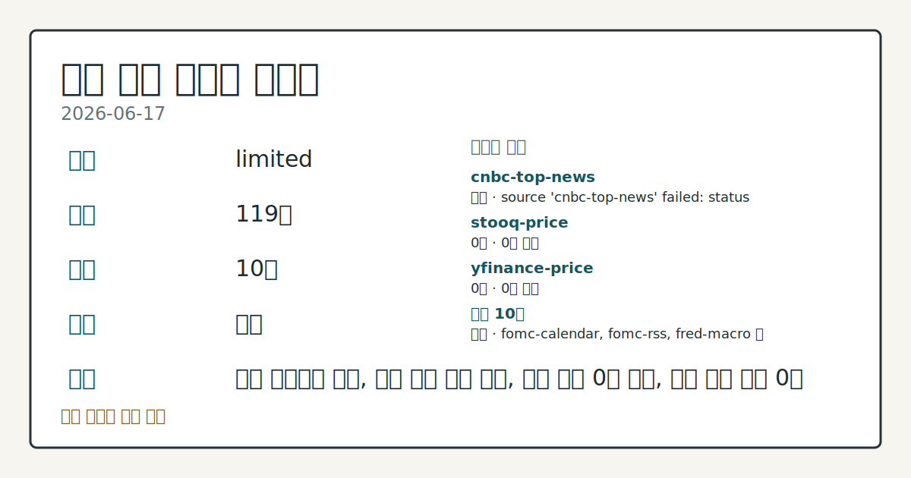
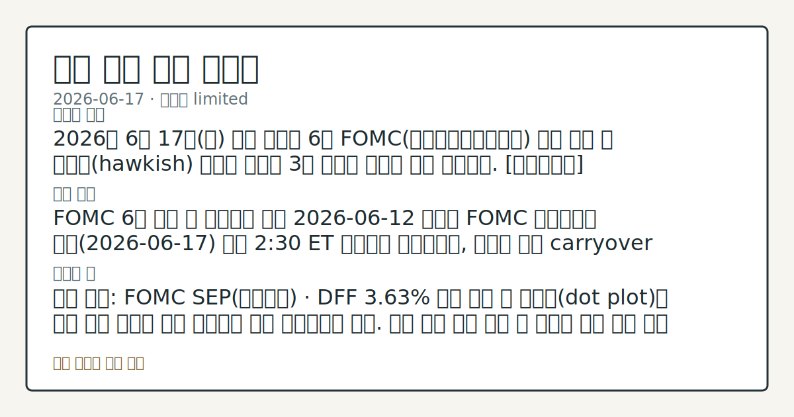

> 정보 제공용 자동 시황이며 매매 권유가 아닙니다.
# 2026-06-17 미국 증시 시황
**기준 시각**: 2026-06-17 NY · 2026-06-17T04:00Z, 2026-06-18T04:00Z)
| 종목 | 종가 | 변동 | 비고 |
|------|------|------|------|
| ^GSPC | 7,420.10 | -1.21% | -2.49% from 52w high · +8.19% YTD |
| ^IXIC | 26,021.66 | -1.34% | -3.96% from 52w high · +11.99% YTD |
| ^DJI | 51,492.55 | -0.98% | -0.98% from 52w high · +6.43% YTD |
| AAPL | 295.95 | -1.10% | -6.11% from 52w high · +9.20% YTD |
| MSFT | 378.91 | -3.79% | +6.21% from 52w low · -19.88% YTD |
**세그먼트**: [국내 증시](../../../domestic-equity/2026/06/2026-06-17.md) | [미국 증시](2026-06-17.md) | [크립토](../../../crypto/2026/06/2026-06-17.md)

*이미지: 데이터 신뢰도 · 출처: investo 자체 생성 · 생성: investo 0.1.0 · 2026-06-18 UTC*
> **내 관심 자산 영향**: 데이터 수집 부족으로 매칭 판단 보류 — 추가 수집 후 재평가됩니다.
> **용어 가이드**: 이번 시황에서 처음 등장한 용어 — ETF(상장지수펀드)
> **오늘의 결론**: 2026년 6월 17일(수) 미국 증시는 6월 FOMC(연방공개시장위원회) 결과 발표 후 매파적(hawkish) 신호에 반응해 3대 지수가 일제히 하락 마감했다. [데이터부족]
> **핵심 동인**: FOMC 6월 성명 및 경제전망 발표 2026-06-12 예고된 FOMC 기자회견이 오늘(2026-06-17) 오후 2:30 ET 예정대로 진행되었고, 이로써 해당 carryover 이벤트가 확인됐다.
> **주의할 점**: 확인 소스: FOMC SEP(경제전망) · DFF **3.63%** 동결 기조 속 점도표(dot plot)가 금년 인하 횟수를 시장 예상보다 축소 제시했는지...
> **데이터 상태**: 제한 · 본문 사용 미집계 · 실패 1 · 0건 2

수집/품질 진단

> **데이터 상태**: 제한 — 수집 119건 / 소스 10개 / 누락: 가격 · 제한 — 핵심 가격 소스 0건/실패/stale, 본문 결론 신뢰도 낮음
> **소스 카운트**: 수집 대상 13 / 성공 10 / 0건 2 / 실패 1 / 본문 사용 미집계
> **소스 등급 분포**: S=4 / A=6
> **상세 사유**: 가격 카테고리 누락, 일부 소스 수집 실패, 일부 소스 0건 반환, 핵심 가격 소스 0건
> **소스별 상태**: cnbc-top-news 실패 (접근 제한), stooq-price 0건, yfinance-price 0건, 정상 10개

## 한눈에 보기
2026년 6월 17일 미국 증시는 6월 FOMC 결과 발표 후 매파적 신호에 반응해 3대 지수가 일제히 하락 마감했다. [데이터부족]
FOMC 6월 성명 및 경제전망 발표 2026-06-12 예고된 FOMC 기자회견이 오늘 오후 2:30 ET 예정대로 진행되었고, 이로써 해당 carryover 이벤트가 확인됐다.
확인 소스: FOMC SEP · DFF **3.63%** 동결 기조 속 점도표가 금년 인하 횟수를 시장 예상보다 축소 제시했는지 점검. 인하 횟수 축소 확인 시 성장주 추가 하락 압력 관찰, 기존 인하 경로 유지 확인 시 낙폭 회복 흐름 비교. 관심 영향: S&P 500 및 Nasdaq 100 단기 방향성 추세 확인. 확인 소스: Treasury 10Y 금리 · 10Y 금리 **4.49%** 레벨이 추가 상승 시 밸류에이션 부담 압력 관찰, DGS10 **4.43%** 아래로 재접근 시 채
## ⓪ 오늘의 매크로
**FOMC 일정** — 2026-06-17 — FOMC Meeting
**미 국채 수익률** — UST curve 2026-06-17: 10Y 4.49%, 2Y10Y +0.29pp
## ⓪-B 채널 기준선
| 기준선 | 값 |
|------|------|
| S&P 500 | 7,420.10 (-1.21%) |
| 나스닥 종합 | 26,021.66 (-1.34%) |
| 다우존스 | 51,492.55 (-0.98%) |
> **크로스마켓 연결 고리**: 금리 이벤트가 할인율/달러 경로의 공통 변수로 남아 있습니다.
> **오늘의 큰 그림:** 금리와 달러 변수가 국내·미국·가상자산에 동시에 걸리며, 오늘 독자는 금리·달러 민감도을 먼저 확인해야 합니다.
## ① 요약

*이미지: 시장 스냅샷 · 출처: investo 자체 생성 · 생성: investo 0.1.0 · 2026-06-18 UTC*

2026년 6월 17일 미국 증시는 6월 FOMC 결과 발표 후 매파적 신호에 반응해 3대 지수가 일제히 하락 마감했다. S&P 500(스탠더드앤드푸어스 500 지수, $SPX)은 **-1.21%**, Dow Jones Industrial Average($DOWI)는 **-0.98%**, Nasdaq 100($IUXX)은 **-0.99%** 하락했다. Federal Reserve(연방준비제도)가 금리를 동결하면서도 향후 경로를 시장 예상보다 높게 시사하자 DXY(달러지수)가 **+0.49%** 상승했고, 지난 이틀(6월 15~16일) 美-이란 종전 합의 수혜로 형성됐던 상승 기조는 이날 FOMC 매파 충격에 밀려 명확히 이탈했다. [하락 관찰]

## ② 전일 핵심 이슈

### FOMC 6월 성명 및 경제전망 발표

2026-06-12 예고된 FOMC 기자회견이 오늘 오후 2:30 ET 예정대로 진행되었고, 이로써 해당 carryover 이벤트가 확인됐다. Federal Reserve는 [6월 16~17일 FOMC 성명](https://www.federalreserve.gov/newsevents/pressreleases/monetary20260617a.htm)과 함께 [경제전망(SEP)](https://www.federalreserve.gov/newsevents/pressreleases/monetary20260617b.htm)을 공개했다. DFF(연방기금금리)는 [**3.63%**](https://fred.stlouisfed.org/series/DFF)로 전일(2026-06-16)과 동일하게 유지됐으나, 향후 금리 경로가 시장 예상보다 매파적으로 해석되며 S&P 500은 **-1.21%**, Dow Jones Industrial Average는 **-0.98%**, Nasdaq 100은 **-0.99%** 하락 마감했다([출처: Nasdaq](https://www.nasdaq.com/articles/stocks-retreat-fed-signals-possible-higher-interest-rates)). ESM26(미니S&P선물)도 **-1.19%** 하락했다.

> **그래서 의미는?** 연준이 금리를 동결했음에도 향후 경로 전망이 매파적으로 해석되며 주식·채권이 동시에 조정받았고, 이는 현재 금리 레벨보다 정책 경로 민감도가...

### 강한 경제 지표와 달러 강세

5월 소매판매(retail sales)와 5월 주택매매계약지수(pending home sales)가 예상을 상회했다. [DXY](https://www.nasdaq.com/articles/dollar-jumps-hawkish-fed)는 **+0.49%** 상승했다. 강한 실물 지표가 연준의 금리 인하 여지를 좁히는 재료로 작용했으며, 이는 직전 이틀간 이어졌던 美-이란 종전 합의 수혜 흐름에서 매크로 압력 지배 흐름으로의 전환을 확인시켜 준다.

## Watchlist Carryover

| 이벤트 | 발원일 | 기대일 | 상태 |
|--------|--------|--------|------|
| FOMC 기자회견 (오후 2:30) | 2026-06-12 | 2026-06-17 | 이월 |
| Juneteenth(준틴스 독립기념일) — 미국 증시 휴장 | 2026-06-12 | 2026-06-19 | 이월 |
| GDP(국내총생산) 발표 | 2026-06-12 | 2026-06-25 | 이월 |
| Employment Situation(고용보고서) 발표 | 2026-06-12 | 2026-07-02 | 이월 |
| FOMC 의사록(6월 16~17일 회의) 공개 (오후 2:00) | 2026-06-12 | 2026-07-08 | 이월 |

## ③ 섹터/수급 동향

### 에너지: 원유 공급 타이트로 소폭 반등

[Nasdaq](https://www.nasdaq.com/articles/tightness-us-crude-supplies-supports-crude-oil-prices)에 따르면 7월물 WTI(서부텍사스원유, CLN26)는 **+0.74달러(**+0.97%**)** 상승 마감했고, 7월물 RBOB(미국기준무연가솔린, RBN26)도 **+1.01%** 올랐다. 원유는 한때 3.5개월 저점 수준에서 회복했으며, 미국 원유 재고 타이트함이 지지 요인으로 작용했다. FOMC 매파 충격 속에서 에너지 섹터는 상대적으로 방어적 흐름을 보였다.

> **그래서 의미는?** 에너지가 지수 하락 국면에서 분리된 강세를 나타냈고, 이는 공급 측 물가 압력이 아직 완전히 해소되지 않았음을 시사해 연준 완화 기대를...

섹터별 기관 순매수·순매도 및 ETF 수급 상세 데이터는 이번 수집에 포함되지 않아 에너지 이외 섹터 동향은 확인 필요 항목으로 봅니다.

## ④ 지표·이벤트

### 국채 금리 및 연준 정책 금리

UST(미국국채) 커브 2026-06-17 기준: 10Y **4.49%**, 2Y **4.20%**, 30Y **4.93%**, 3M **3.83%**, 2Y10Y 스프레드(장단기 금리차) **+0.29pp**([Treasury](https://home.treasury.gov/resource-center/data-chart-center/interest-rates)). DGS10(10년 국채 일별기준)은 **4.43%**로 전일 대비 **-**0.04%**p** 하락했다([FRED](https://fred.stlouisfed.org/series/DGS10)). DFF는 [**3.63%**](https://fred.stlouisfed.org/series/DFF)로 전일과 동일했다.

> **그래서 의미는?** 10년물 금리가 전일 대비 소폭 하락했음에도 주가는 크게 내렸고, 절대 금리 레벨보다 연준의 경로 전망이 시장을 지배하는 국면임을 보여줍니다.

### 물가·고용 지표

[CPIAUCSL(소비자물가지수)](https://fred.stlouisfed.org/series/CPIAUCSL): 2026년 5월 기준 **333.979**(전월 332.407 대비 **+1.572** 상승). [PPIFID(생산자물가지수 최종수요)](https://fred.stlouisfed.org/series/PPIFID): 2026년 5월 기준 **158.012**(전월 156.395 대비 **+1.617** 상승). [UNRATE(실업률)](https://fred.stlouisfed.org/series/UNRATE): 2026년 5월 기준 **4.3%**로 전월과 동일. 이 세 지표는 물가 상승이 지속되고 고용 시장이 안정적인 환경을 반영하며, 연준의 금리 인하를 서두르기 어려운 배경이다.

### 주요 일정

- 2026-06-17: [FOMC 회의](https://www.federalreserve.gov/newsevents/calendar.htm)(오후 2:00) 및 [기자회견](https://www.federalreserve.gov/live-broadcast.htm)(오후 2:30) — 오늘 진행됨
- 2026-06-25: [GDP 발표](https://fred.stlouisfed.org/release?rid=53)

## ⑤ 주요 종목

<!-- u50 lightweight-charts-embed: placeholders consumed by site_docs/assets/investo-chart-init.js -->

<noscript><em>인터랙티브 차트는 JavaScript가 활성화된 환경에서 표시됩니다. 위 정적 카드가 동일한 정보를 담고 있습니다.</em></noscript>

### 실적 발표 확인 항목

- **JBL** (Jabil Inc.): 프리마켓 실적 발표. EPS(주당순이익) 예상 **$2.96**, 전년 동기 **$2.39**. 회계분기: 2026년 5월. 애널리스트 추정치 4건. 시가총액 **$39,617,289,587**([Nasdaq](https://www.nasdaq.com/market-activity/stocks/jbl/earnings))
- **KMX** (CarMax Inc.): 프리마켓 실적 발표. EPS 예상 **$0.94**, 전년 동기 **$1.38**. 회계분기: 2026년 5월. 애널리스트 추정치 6건. 시가총액 **$7,394,883,149**([Nasdaq](https://www.nasdaq.com/market-activity/stocks/kmx/earnings))

> **그래서 의미는?** JBL(재블)과 KMX(카맥스)는 FOMC 매파 충격 당일 실적을 발표했으며, 지수 하락 환경 속 개별 실적이 주가 방향에 어떤 영향을...

### 공시 관찰 항목

- **Rumble Inc.**: SEC 8-K 공시(2026-06-17). 중요 계약 체결(Item 1.01), 자산 취득·처분 완료(Item 2.01), 미등록 증권 발행(Item 3.02), 정관 개정(Item 5.03)([SEC EDGAR](https://www.sec.gov/Archives/edgar/data/1830081/000121390026069733/0001213900-26-069733-index.htm))
- **Sleep Number Corp**: SEC 8-K 공시. 상장 지속 요건 미충족 통지(Item 3.01)([SEC EDGAR](https://www.sec.gov/Archives/edgar/data/827187/000082718726000053/0000827187-26-000053-index.htm))

## ⑥ 오늘의 관전 포인트

#### 관찰 신호: 확인 소스: FOMC SEP · DFF **3.63%*…

- 출처: 확인 소스 미상
- 현재: 확인 소스: FOMC SEP · DFF **3.63%** 동결 기조 속 점도표가 금년 인하 횟수를 시장 예상보다 축소 제시했는지 점검. 인하 횟수 축소 확인 시 성장주 추가 하락 압력 관찰, 기존 인하 경로 유지 확인 시 낙폭 회복 흐름 비교. 관심 영향: S&P 500 및 Nasdaq 100 단기 방향성 추세 확인.
- 확인 조건: 상방 인하 횟수 축소 확인 시 성장주 추가 하락 압력 관찰, 기존 인하 경로 유지 확인 시 낙폭 회복 흐름 비교; 하방 하방 데이터 부족
- 신뢰도: 높음
- 관심 영향: 관심 영향: S&P 500 및 Nasdaq 100 단기 방향성 추세 확인.

#### 관찰 신호: 확인 소스: Treasury 10Y 금리 · 10Y 금…

- 출처: 확인 소스 미상
- 현재: 확인 소스: Treasury 10Y 금리 · 10Y 금리 **4.49%** 레벨이 추가 상승 시 밸류에이션 부담 압력 관찰, DGS10 **4.43%** 아래로 재접근 시 채권 수요 복귀 흐름 점검. 관심 영향: 성장주 대비 가치주 간 상대 수급 변화 확인.
- 확인 조건: 상방 상방 데이터 부족; 하방 하방 데이터 부족
- 신뢰도: 높음
- 관심 영향: 관심 영향: 성장주 대비 가치주 간 상대 수급 변화 확인.

#### 관찰 신호: 확인 소스: FRED CPIAUCSL · PPIFID…

- 출처: 확인 소스 미상
- 현재: 확인 소스: FRED CPIAUCSL · PPIFID · 5월 CPI **333.979**, PPI **158.012** 상승 흐름이 이후에도 지속되는지 2026-07-14 CPI 발표 및 2026-07-15 PPI 발표에서 추세 비교. 상승 지속 확인 시 매파 기조 연장 압력 관찰, 둔화 확인 시 완화 기대 재형성 흐름 점검. 관심 영향: 채권·주식 간 자금 이동 추세 확인.
- 확인 조건: 상방 상방 데이터 부족; 하방 하방 데이터 부족
- 신뢰도: 낮음
- 관심 영향: 관심 영향: 채권

#### 관찰 신호: 확인 소스: Nasdaq JBL 실적 · JBL EPS…

- 출처: 확인 소스 미상
- 현재: 확인 소스: Nasdaq JBL 실적 · JBL EPS(주당순이익) 예상 **$2.96** 대비 실제 발표치 비교. 상회 시 전자제조·부품 섹터 긍정 신호 관찰, 하회 시 공급망 비용 압력 재평가 흐름 점검. 관심 영향: EMS(전자제조서비스) 섹터 수급 추세 확인.
- 확인 조건: 상방 상회 시 전자제조; 하방 부품 섹터 긍정 신호 관찰, 하회 시 공급망 비용 압력 재평가 흐름 점검
- 신뢰도: 높음
- 관심 영향: 관심 영향: EMS(전자제조서비스) 섹터 수급 추세 확인.

#### 관찰 신호: 이번 주 일정: 2026-06-19 Juneteenth…

- 출처: FOMC 캘린더
- 현재: 이번 주 일정: 2026-06-19 Juneteenth(준틴스 독립기념일) 미국 증시 휴장. 확인 소스: FOMC 캘린더 · 휴장 직전(2026-06-18 목요일) 포지션 조정 흐름이 거래량·변동성 데이터에서 확인되면 단기 변동성 확대 관찰, 조정 없이 안정적 거래 확인 시 정상 흐름 점검. 관심 영향: 주간 마감 포지션 구조 변화 관찰.
- 확인 조건: 상방 상방 데이터 부족; 하방 하방 데이터 부족
- 신뢰도: 보통
- 관심 영향: 관심 영향: 주간 마감 포지션 구조 변화 관찰.
## ⑦ 면책조항
본 시황은 일반 정보 제공을 목적으로 자동 생성된 자료이며,
특정 종목·자산에 대한 매매 권유나 투자 자문이 아닙니다.
투자 결정과 그 결과에 대한 책임은 전적으로 본인에게 있으며,
본 시황의 내용에 따라 발생한 손실에 대해 작성자는 일체의 책임을 지지 않습니다.