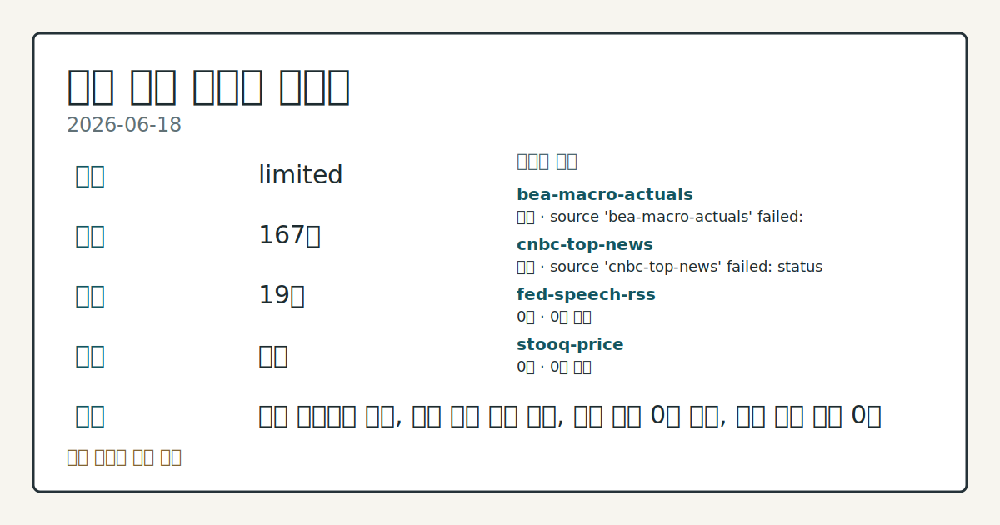
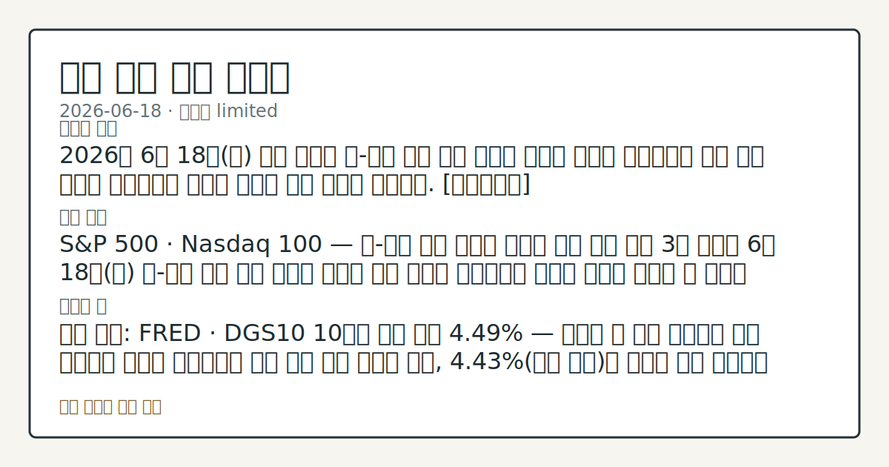

> 정보 제공용 자동 시황이며 매매 권유가 아닙니다.
# 2026-06-18 미국 증시 시황
**기준 시각**: 2026-06-18 NY · 2026-06-18T04:00Z, 2026-06-19T04:00Z)
| 종목 | 종가 | 변동 | 비고 |
|------|------|------|------|
| ^GSPC | 7,500.58 | +1.08% | -1.43% from 52w high · +9.36% YTD |
| ^IXIC | 26,517.93 | +1.91% | -2.13% from 52w high · +14.13% YTD |
| ^DJI | 51,564.70 | +0.14% | -0.84% from 52w high · +6.58% YTD |
| AAPL | 298.01 | +0.70% | -5.45% from 52w high · +9.96% YTD |
| MSFT | 379.40 | +0.13% | +6.34% from 52w low · -19.78% YTD |
**세그먼트**: [국내 증시](../../../domestic-equity/2026/06/2026-06-18.md) | [미국 증시](2026-06-18.md) | [크립토](../../../crypto/2026/06/2026-06-18.md)

*이미지: 데이터 신뢰도 · 출처: investo 자체 생성 · 생성: investo 0.1.0 · 2026-06-19 UTC*
> **내 관심 자산 영향**: 데이터 수집 부족으로 매칭 판단 보류 — 추가 수집 후 재평가됩니다.
> **오늘의 결론**: 2026년 6월 18일(목) 미국 증시는 미-이란 평화 협정 체결이 에너지 가격과 인플레이션 위험 완화 기대를 자극하면서 기술주 중심의 강한 상승을 기록했다. [데이터부족]
> **핵심 동인**: S&P 500 · Nasdaq 100 — 미-이란 협정 효과로 기술주 주도 상승 미국 3대 지수는 6월 18일(목) 미-이란 평화 협정 소식이 에너지 공급 우려와 인플레이션 압박을 동시에 완화할 수 있다는 기대를 바탕으로 S&P 500 **+1.08%**, Nasdaq 100 **+2.48%**, Dow Jones Industrial Average **+0.14%**로 마감했다.
> **주의할 점**: 확인 소스: FRED · DGS10 10년물 국채 금리 **4.49%** — 금리가 현 수준 이상으로 지속 상승하면 성장주 밸류에이션 부담 압력 확대 흐름을...
> **데이터 상태**: 제한 · 본문 사용 미집계 · 실패 2 · 0건 3

수집/품질 진단

> **데이터 상태**: 제한 — 수집 167건 / 소스 19개 / 누락: 가격 · 제한 — 핵심 가격 소스 0건/실패/stale, 본문 결론 신뢰도 낮음
> **소스 카운트**: 수집 대상 24 / 성공 19 / 0건 3 / 실패 2 / 본문 사용 미집계
> **소스 등급 분포**: S=11 / A=8
> **상세 사유**: 가격 카테고리 누락, 일부 소스 수집 실패, 일부 소스 0건 반환, 핵심 가격 소스 0건
> **소스별 상태**: bea-macro-actuals 실패 (설정 미완료(미수집)), cnbc-top-news 실패 (접근 제한), fed-speech-rss 0건, stooq-price 0건, yfinance-price 0건, 정상 19개

## 한눈에 보기
2026년 6월 18일 미국 증시는 미-이란 평화 협정 체결이 에너지 가격과 인플레이션 위험 완화 기대를 자극하면서 기술주 중심의 강한 상승을 기록했다. [데이터부족]
S&P 500 · Nasdaq 100 — 미-이란 협정 효과로 기술주 주도 상승 미국 3대 지수는 6월 18일 미-이란 평화 협정 소식이 에너지 공급 우려와 인플레이션 압박을 동시에 완화할 수 있다는 기대를 바탕으로 S&P 500 **+1.08%**, Nasdaq 100 **+2.48%**, Dow Jones Industrial Average **+0.14%**로 마감했다.
확인 소스: FRED · DGS10 10년물 국채 금리 **4.49%** — 금리가 현 수준 이상으로 지속 상승하면 성장주 밸류에이션 부담 압력 확대 흐름을 관찰, **4.43%**(전일 수준)를 하회해 하락 전환하면 Nasdaq 100 기술주 수급 회복 흐름을 비교. 관심 영향: 대형 기술주 수급 방향 점검. 확인 소스: CFTC COT 보고서 · E-mini S&P 500 레버리지드 머니 순매도 -451,586 계약 — 다음 주 보고에서 순매도 포지션이 축소 전환되면 기관 수급 개선
## ⓪ 오늘의 매크로
**FOMC 일정** — 2026-07-08 — FOMC Minutes
**미 국채 수익률** — UST curve 2026-06-18: 10Y 4.46%, 2Y10Y +0.27pp
## ⓪-B 채널 기준선
| 기준선 | 값 |
|------|------|
| S&P 500 | 7,500.58 (+1.08%) |
| 나스닥 종합 | 26,517.93 (+1.91%) |
| 다우존스 | 51,564.70 (+0.14%) |
| CFTC 포지셔닝 | E-mini S&P 500 순포지션 -451586계약 (-20.50% OI), 2026-06-09 기준/2026-06-12 공개 · Nasdaq-100 mini 순포지션 -34306계약 (-11.23% OI), 2026-06-09 기준/2026-06-12 공개 · VIX futures 순포지션 -35290계약 (-8.60% OI), 2026-06-09 기준/2026-06-12 공개 · 주간 지연 |
> **크로스마켓 연결 고리**: 금리 이벤트가 할인율/달러 경로의 공통 변수로 남아 있습니다.
> **오늘의 큰 그림:** 금리와 달러 변수가 국내·미국에 동시에 걸리며, 오늘 독자는 금리·달러 민감도을 먼저 확인해야 합니다.
## ① 요약

*이미지: 시장 스냅샷 · 출처: investo 자체 생성 · 생성: investo 0.1.0 · 2026-06-19 UTC*

2026년 6월 18일 미국 증시는 미-이란 평화 협정 체결이 에너지 가격과 인플레이션 위험 완화 기대를 자극하면서 기술주 중심의 강한 상승을 기록했다. S&P 500(스탠더드앤드푸어스 500 지수)은 **+1.08%**, Nasdaq 100(나스닥 100 지수)은 **+2.48%**, Dow Jones Industrial Average(다우존스 산업평균지수)는 **+0.14%**로 마감했다. 동시에 FOMC(연방공개시장위원회)의 매파적 금리 전망 여파로 DXY(달러지수)가 13개월 최고치까지 오르고, DGS10(10년물 국채 금리)은 **4.49%**(**+**0.06%**p**)로 상승해 주식 강세와 달러·금리 동반 상승이 공존하는 신호가 형성됐다. 6월 19일(금)은 Juneteenth National Independence Day(준틴스 국경일)로 증시 휴장이 예정돼 있다. [혼재]

## ② 전일 핵심 이슈

### S&P 500 · Nasdaq 100 — 미-이란 협정 효과로 기술주 주도 상승

[미국 3대 지수](https://www.nasdaq.com/articles/stocks-sharply-higher-us-iran-peace-deal-eases-inflation-risks)는 6월 18일(목) 미-이란 평화 협정 소식이 에너지 공급 우려와 인플레이션 압박을 동시에 완화할 수 있다는 기대를 바탕으로 S&P 500 **+1.08%**, Nasdaq 100 **+2.48%**, Dow Jones Industrial Average **+0.14%**로 마감했다. 9월 만기 E-mini S&P 선물(ESU26, E-mini S&P 500 9월물)은 **+1.15%** 상승 마감했다. 어제(6월 17일) FOMC 결과 발표 직후 Nasdaq 100 하락 vs. Dow Jones 상승의 지수 분화 흐름에서 이번 세션에는 기술주가 주도하는 전면 상승으로 전환됐으며, 자금 흐름 세부 데이터는 이번 입력에서 확인되지 않는다.

> **그래서 의미는?** 美-이란 합의가 인플레이션 완화 기대를 높이면서 성장주(Nasdaq 100) 선호 수급이 하루 만에 복귀했는지 추세 확인이 필요합니다.

### 연준(Federal Reserve) 매파 기조 — DXY 13개월 최고 · 금 하락

Kevin Warsh(케빈 워시) [연준 의장](https://www.federalreserve.gov/aboutthefed/bios/board/default.htm)이 이끄는 FOMC가 올해 후반 높은 금리 수준 유지를 시사하는 전망을 발표한 여파가 이어지면서, [DXY는 **+0.80%** 상승해 13개월 최고치](https://www.nasdaq.com/articles/dollar-rallies-and-gold-retreats-hawkish-fed)를 기록했다. 금(Gold)은 달러 강세 압력에 하락했다. 해당 매파 기조는 미국 주식 시장에서는 S&P 500 상승과 공존하고 있으나, 채권 시장에서는 DGS10 **4.49%**(**+**0.06%**p**)로의 상승 압력을 지속시키는 요인으로 작용하고 있다.

## ③ 섹터/수급 동향

### CFTC(상품선물거래위원회) COT(Commitments of Traders, 선물 포지션 보고) — 레버리지드 머니 순매도 우위

[CFTC 주간 보고서](https://www.cftc.gov/MarketReports/CommitmentsofTraders/index.htm)에 따르면 레버리지드 머니(헤지펀드·투기 자금)는 E-mini S&P 500에서 순매도 **-451,586** 계약(미결제약정 대비 **-20.5%**), Nasdaq-100 mini에서 **-34,306** 계약, VIX(변동성지수) 선물에서 **-35,290** 계약을 유지했다. 10년물 국채 선물에서도 레버리지드 머니의 순매도는 **-1,979,511** 계약에 달한다.

반면 Gold 관리형 자금(managed_money)은 순매수 **+105,863** 계약을, WTI 원유에서는 **+94,725** 계약의 순매수를 기록했다. U.S. Dollar Index 레버리지드 머니는 **-13,656** 계약의 순매도로, DXY 현물 13개월 최고치와 포지션 방향이 대조를 이룬다.

> **그래서 의미는?** 레버리지드 머니가 주식·채권 선물 모두에서 대규모 순매도를 유지하는 상황에서 지수가 상승하는 점은, 상승 수급의 원천이 어느 참여자 군에서...

### 변동성 지표 — VVIX · SKEW

[Cboe VVIX(변동성의 변동성 지수)](https://cdn.cboe.com/api/global/us_indices/daily_prices/VVIX_History.csv)는 2026-06-18 기준 **88.43**, [Cboe SKEW(꼬리위험 지수)](https://cdn.cboe.com/api/global/us_indices/daily_prices/SKEW_History.csv)는 2026-06-17 기준 **142.62**를 기록했다. SKEW 140대 수준은 시장 참여자들이 급락 시나리오에 대한 옵션 헤지(downside hedge)를 일정 수준 유지하고 있음을 보여준다.

## ④ 지표·이벤트

### 주요 매크로 — 5월 물가·고용 실적

[FRED DFF(연방기금금리 실효치)](https://fred.stlouisfed.org/series/DFF)는 2026-06-17 기준 **3.63%**로 전일 수준을 유지했다. [CPIAUCSL(소비자물가지수)](https://fred.stlouisfed.org/series/CPIAUCSL) 5월 실적은 **333.979**(전월 332.407 대비 **+1.572** 상승)이며, [PPIFID(생산자물가지수 최종수요)](https://fred.stlouisfed.org/series/PPIFID) 5월 실적은 **158.012**(전월 156.395 대비 **+1.617** 상승)이다. [UNRATE(실업률)](https://fred.stlouisfed.org/series/UNRATE) 5월 실적은 **4.3%**로 전월과 동일했다.

[BLS(노동통계국)](https://www.bls.gov/data/) 기준 5월 총 비농업 고용(Total nonfarm payroll)은 **159,001**천 명(전월 158,829 대비 증가), 평균시급(Average hourly earnings)은 **$37.53**(전월 **$37.41** 대비 상승), 노동력 참가율(Labor Force Participation Rate)은 **61.8%**(전월 동일), 4월 채용공고(Job Openings)는 **7,618**천 건(전월 6,887 대비 증가)이다.

> **그래서 의미는?** CPI·PPI가 나란히 상승한 가운데 실업률이 유지되면서 연준이 금리를 높게 유지할 근거가 재확인됐는지 추세 확인이 필요합니다.

### 일정 — Juneteenth 휴장 · Waller 연설 예정

[6월 19일](https://www.federalreserve.gov/newsevents/calendar.htm)은 Juneteenth National Independence Day 공휴일로 미국 증시 및 연준 정기 통계 발표가 모두 휴장된다. 6월 22일(월)에는 연준 이사 Christopher J. Waller(크리스토퍼 월러)가 [제5차 달러의 국제적 역할 컨퍼런스에서 오전 9시 환영사](https://www.federalreserve.gov/newsevents/calendar.htm)를 예정하고 있다.

## ⑤ 주요 종목

<!-- u50 lightweight-charts-embed: placeholders consumed by site_docs/assets/investo-chart-init.js -->

<noscript><em>인터랙티브 차트는 JavaScript가 활성화된 환경에서 표시됩니다. 위 정적 카드가 동일한 정보를 담고 있습니다.</em></noscript>

### 실적 발표 예정

[ACN(Accenture)](https://www.nasdaq.com/market-activity/stocks/acn/earnings) — 장 시작 전 발표 예정; 2026년 5월 분기 EPS(주당순이익) 예상치 **$3.70**(전년 동기 실적 **$3.49**). [KR(Kroger)](https://www.nasdaq.com/market-activity/stocks/kr/earnings) — 장 시작 전 발표 예정; 2026년 4월 분기 EPS 예상치 **$1.59**(전년 동기 실적 **$1.49**).

> **그래서 의미는?** ACN·KR 실적이 예상치를 상회 또는 하회하는지에 따라 IT 서비스·소매 섹터 수급 방향 변화를 관찰할 수 있습니다.

### 확인 항목

[STLD(Steel Dynamics)](https://www.nasdaq.com/articles/steel-dynamics-stld-stock-sinks-market-gains-what-you-should-know) — 전일 종가 **$249.91**, **-7.49%** 하락. 3대 지수가 일제히 상승한 가운데 STLD만 큰 폭 하락해 철강 섹터 내 개별 요인을 별도로 점검할 필요를 시사한다.

## ⑥ 오늘의 관전 포인트

#### 관찰 신호: DGS10

- 출처: 확인 소스 미상
- 현재: 확인 소스: FRED · DGS10 10년물 국채 금리 **4.49%** — 금리가 현 수준 이상으로 지속 상승하면 성장주 밸류에이션 부담 압력 확대 흐름을 관찰, **4.43%**(전일 수준)를 하회해 하락 전환하면 Nasdaq 100 기술주 수급 회복 흐름을 비교. 관심 영향: 대형 기술주 수급 방향 점검.
- 확인 조건: 상방 DGS10)를 하회해 하락 전환하면 Nasdaq 100 기술주 수급 회복 흐름을 비교; 하방 DGS10)를 하회해 하락 전환하면 Nasdaq 100 기술주 수급 회복 흐름을 비교
- 신뢰도: 높음
- 관심 영향: 관심 영향: 대형 기술주 수급 방향 점검.

#### 관찰 신호: 확인 소스: CFTC COT 보고서 · E-mini S…

- 출처: 확인 소스 미상
- 현재: 확인 소스: CFTC COT 보고서 · E-mini S&P 500 레버리지드 머니 순매도 **-451,586** 계약 — 다음 주 보고에서 순매도 포지션이 축소 전환되면 기관 수급 개선 신호를 관찰, 심화되면 상승 탄력 둔화 흐름을 비교. 관심 영향: 주식 선물 수급 방향 변동 확인.
- 확인 조건: 상방 상방 데이터 부족; 하방 하방 데이터 부족
- 신뢰도: 보통
- 관심 영향: 관심 영향: 주식 선물 수급 방향 변동 확인.

#### 관찰 신호: 확인 소스: 연준 일정 · 6월 22일 Waller…

- 출처: 확인 소스 미상
- 현재: 확인 소스: 연준 일정 · 6월 22일 Waller 이사 연설 — 연설 내용이 FOMC 매파 기조를 재확인하면 DXY·금리 강세 지속 흐름을 추적, 완화적 뉘앙스가 포함되면 채권·달러 시장 반응 변화를 비교. 관심 영향: 달러·금리 방향 변동 관찰.
- 확인 조건: 상방 상방 데이터 부족; 하방 하방 데이터 부족
- 신뢰도: 보통
- 관심 영향: 관심 영향: 달러

#### 관찰 신호: 확인 소스: Nasdaq 실적 캘린더 · ACN·KR…

- 출처: 확인 소스 미상
- 현재: 확인 소스: Nasdaq 실적 캘린더 · ACN·KR 장 전 실적 — ACN EPS가 예상치 **$3.70** 이상이면 IT 서비스 섹터 수급 강화 흐름을 확인, 하회하면 해당 섹터 약세 흐름을 비교. KR EPS 역시 예상치 **$1.59** 대비 실적을 동일 방식으로 점검. 관심 영향: IT 서비스·소매 섹터 실적 흐름 확인.
- 확인 조건: 상방 상방 데이터 부족; 하방 KR 장 전 실적 — ACN EPS가 예상치 **$3.70** 이상이면 IT 서비스 섹터 수급 강화 흐름을 확인, 하회하면 해당 섹터 약세 흐름을 비교
- 신뢰도: 높음
- 관심 영향: 관심 영향: IT 서비스

#### 관찰 신호: 확인 소스: Cboe SKEW **142.62** ·…

- 출처: Cboe
- 현재: 확인 소스: Cboe SKEW **142.62** · VVIX **88.43** — SKEW가 현재 수준(**142.62**) 이상으로 지속 상승하면 꼬리위험 헤지 수요 확대 신호를 관찰, VVIX가 현 수준 이하로 하락하면 변동성 압력 완화 흐름을 비교. 관심 영향: 옵션 시장 투자심리 방향 확인.
- 확인 조건: 상방 상방 데이터 부족; 하방 하방 데이터 부족
- 신뢰도: 보통
- 관심 영향: 관심 영향: 옵션 시장 투자심리 방향 확인.
## ⑦ 면책조항
본 시황은 일반 정보 제공을 목적으로 자동 생성된 자료이며,
특정 종목·자산에 대한 매매 권유나 투자 자문이 아닙니다.
투자 결정과 그 결과에 대한 책임은 전적으로 본인에게 있으며,
본 시황의 내용에 따라 발생한 손실에 대해 작성자는 일체의 책임을 지지 않습니다.