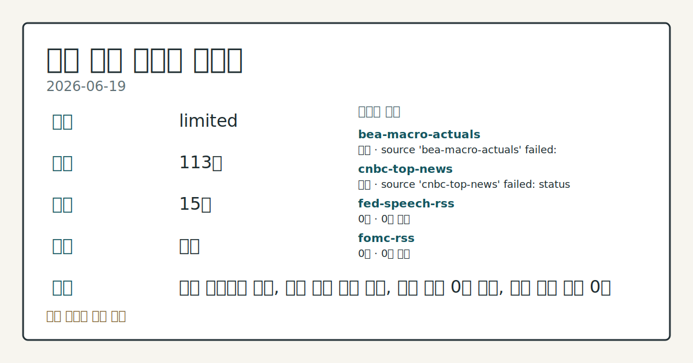
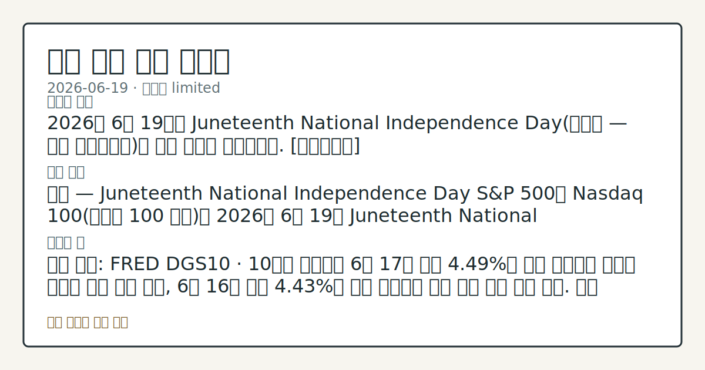

> 정보 제공용 자동 시황이며 매매 권유가 아닙니다.
# 2026-06-19 미국 증시 시황
**기준 시각**: 2026-06-19 NY · 2026-06-19T04:00Z, 2026-06-20T04:00Z)
| 종목 | 종가 | 변동 | 비고 |
|------|------|------|------|
| ^GSPC | 7,420.10 | -1.21% | -2.49% from 52w high · +8.19% YTD |
| ^IXIC | 26,021.66 | -1.34% | -3.96% from 52w high · +11.99% YTD |
| ^DJI | 51,492.55 | -0.98% | -0.98% from 52w high · +6.43% YTD |
| AAPL | 298.01 | +0.70% | -5.45% from 52w high · +9.96% YTD |
| MSFT | 379.40 | +0.13% | +6.34% from 52w low · -19.78% YTD |
**세그먼트**: [국내 증시](../../../domestic-equity/2026/06/2026-06-19.md) | [미국 증시](2026-06-19.md) | [크립토](../../../crypto/2026/06/2026-06-19.md)

*이미지: 데이터 신뢰도 · 출처: investo 자체 생성 · 생성: investo 0.1.0 · 2026-06-20 UTC*
> **내 관심 자산 영향**: 데이터 수집 부족으로 매칭 판단 보류 — 추가 수집 후 재평가됩니다.
> **용어 가이드**: 이번 시황에서 처음 등장한 용어 — JOLTS(구인보고서), 숏커버링(공매도상환), 공매도(차입매도)
> **오늘의 결론**: 6월 18일(목) 미국 증시는 미-이란 평화 협정 체결에 따른 에너지 가격 하락 기대가 인플레이션 리스크를 완화한다는 시장 내러티브를 반영하며 기술주 중심으로 강세를 보였다. [데이터부족]
> **핵심 동인**: 미-이란 평화 협정 — Nasdaq 100 기술주 주도 상승 Nasdaq 보도에 따르면 미-이란 평화 협정 체결이 에너지 가격 하락 기대를 형성하며 인플레이션 위험 완화 해석을 촉발했다.
> **주의할 점**: 확인 소스: FRED DGS10 · 10년 국채 금리가 현 **4.49%** 수준을 상회하면 성장주 밸류에이션 할인율 부담 압력 관찰, 전일 **4.43%**...
> **데이터 상태**: 제한 · 본문 사용 미집계 · 실패 2 · 0건 6

수집/품질 진단

> **데이터 상태**: 제한 — 수집 123건 / 소스 16개 / 누락: 가격 · 제한 — 핵심 가격 소스 0건/실패/stale, 본문 결론 신뢰도 낮음
> **소스 카운트**: 수집 대상 24 / 성공 16 / 0건 6 / 실패 2 / 본문 사용 미집계
> **소스 등급 분포**: S=8 / A=8
> **상세 사유**: 가격 카테고리 누락, 일부 소스 수집 실패, 일부 소스 0건 반환, 핵심 가격 소스 0건
> **소스별 상태**: bea-macro-actuals 실패 (설정 미완료(미수집)), cnbc-top-news 실패 (접근 제한), fed-speech-rss 0건, fomc-rss 0건, sec-edgar-8k 0건, sec-newsroom-rss 0건, stooq-price 0건, yfinance-price 0건, 정상 16개

## 한눈에 보기
6월 18일 미국 증시 S&P 500(스탠더드앤드푸어스 500 지수) **+1.08%**, Nasdaq 100(나스닥 100 지수) **+2.48%**, Dow Jones Industrial Average(다우존스 산업평균지수) **+0.14%** 상승 마감 — 미-이란 평화 협정이 에너지 인플레 리스크를 완화하며 기술주 강세 견인. 6월 19일(금)은 Juneteenth 휴장.
CFTC(상품선물거래위원회) COT(선물 포지션 보고서) 기준 레버리지 머니의 E-mini S&P 500 순포지션 **-451,586**계약 — 현물 주가 상승에도 구조적 순매도 기조 잔존.
**4.49%** DGS10(10년 국채 금리)이 전일 **4.43%** 대비 **+**0.06%**p** 상승 — 성장주 밸류에이션 할인율 임계 수준 점검(§④ 참조).
## ⓪ 오늘의 매크로
**FOMC 일정** — 2026-07-08 — FOMC Minutes
**미 국채 수익률** — UST curve 2026-06-18: 10Y 4.46%, 2Y10Y +0.27pp
## ⓪-B 채널 기준선
| 기준선 | 값 |
|------|------|
| S&P 500 | 7,420.10 (-1.21%) |
| 나스닥 종합 | 26,021.66 (-1.34%) |
| 다우존스 | 51,492.55 (-0.98%) |
| CFTC 포지셔닝 | E-mini S&P 500 순포지션 -451586계약 (-20.50% OI), 2026-06-09 기준/2026-06-12 공개 · Nasdaq-100 mini 순포지션 -34306계약 (-11.23% OI), 2026-06-09 기준/2026-06-12 공개 · VIX futures 순포지션 -35290계약 (-8.60% OI), 2026-06-09 기준/2026-06-12 공개 · 주간 지연 |
> **크로스마켓 연결 고리**: 금리 이벤트가 할인율/달러 경로의 공통 변수로 남아 있습니다.
> **오늘의 큰 그림:** 금리와 달러 변수가 국내·미국에 동시에 걸리며, 오늘 독자는 금리·달러 민감도을 먼저 확인해야 합니다.
## ① 요약

*이미지: 시장 스냅샷 · 출처: investo 자체 생성 · 생성: investo 0.1.0 · 2026-06-20 UTC*

6월 18일 미국 증시는 미-이란 평화 협정 체결에 따른 에너지 가격 하락 기대가 인플레이션 리스크를 완화한다는 시장 내러티브를 반영하며 기술주 중심으로 강세를 보였다. S&P 500이 **+1.08%**, Nasdaq 100이 **+2.48%** 상승한 반면 Dow Jones는 **+0.14%** 소폭 상승에 그쳐 섹터별 온도차가 나타났다. 6월 19일은 Juneteenth National Independence Day(준틴스 독립기념일) 휴장으로 신규 가격 형성이 없으며, 이번 브리핑은 전일(6월 18일) 마감 데이터를 기반으로 한다.

CFTC COT 보고서에서 레버리지 머니가 E-mini S&P 500에 **-451,586**계약(-**20.5%** of OI(미결제약정)) 순매도를 유지하고 있고, DGS10이 **4.49%**로 전일 대비 상승 추세를 보이는 점은 현물 주가 상승과의 혼재 신호로 관찰된다. [혼재]

## ② 전일 핵심 이슈

### 미-이란 평화 협정 — Nasdaq 100 기술주 주도 상승

[Nasdaq 보도](https://www.nasdaq.com/articles/stocks-sharply-higher-us-iran-peace-deal-eases-inflation-risks)에 따르면 미-이란 평화 협정 체결이 에너지 가격 하락 기대를 형성하며 인플레이션 위험 완화 해석을 촉발했다. S&P 500은 **+1.08%**, Nasdaq 100은 **+2.48%**, Dow Jones는 **+0.14%** 상승 마감했으며, September E-mini S&P 선물(ESU26·미니 S&P 500 선물)은 **+1.15%** 상승했다. 지수 간 상승폭 격차는 에너지 비용 완화 기대가 마진 민감도가 상대적으로 낮은 기술주 섹터에 집중 반영된 결과로 확인된다.

> **그래서 의미는?** 이번 주(6월 15일~18일) 미-이란 관련 재료가 기술주 섹터에 반복적으로 정방향으로 작용하며 Nasdaq 100이 Dow Jones를 큰...

### 이번 주 연속성 확인

최근 컨텍스트에 따르면 6월 15일(월) 美-이란 종전 합의 초기 발표 이후 6월 16일(화) 단기 조정, 6월 17일(수) FOMC(연방공개시장위원회) 결과 발표 이후 방향 탐색, 6월 18일 협정 효과 재확인으로 상승 흐름이 연장된 구조다. 어제(6월 18일) 흐름은 전환보다 주간 추세의 연속선상에 있다.

## ③ 섹터/수급 동향

### CFTC 포지셔닝 — 레버리지 머니 순매도 기조 유지

[CFTC COT](https://www.cftc.gov/MarketReports/CommitmentsofTraders/index.htm) 주간 보고서 기준 레버리지 머니 순포지션:

| 상품 | 순포지션 (계약) | OI 비율 |
|------|--------------|---------|
| E-mini S&P 500 | **-451,586** | **-20.5%** |
| Nasdaq-100 mini | **-34,306** | **-11.2%** |
| 10Y Treasury note | **-1,979,511** | **-37.7%** |
| U.S. Dollar Index | **-13,656** | **-27.2%** |
| VIX 선물 | **-35,290** | **-8.6%** |

managed_money 기준 순매수 포지션: Gold(금) **+105,863**계약(**+31.8%** of OI), WTI crude oil **+94,725**계약.

> **그래서 의미는?** 주식·국채·달러 선물 모두 레버리지 머니 순매도가 유지되는 반면 금·WTI는 순매수 기조 — 현물 주가 상승과의 수급 괴리가 지속되고 있어...

### 변동성 지표

[Cboe SKEW(꼬리위험지수)](https://cdn.cboe.com/api/global/us_indices/daily_prices/SKEW_History.csv)는 2026-06-18 기준 **146.72**로 꼬리 위험 인식이 높은 수준을 유지하고 있다. [Cboe VVIX(변동성의 변동성 지수)](https://cdn.cboe.com/api/global/us_indices/daily_prices/VVIX_History.csv)는 **88.43**으로 상대적으로 안정적인 구간이다.

## ④ 지표·이벤트

### 연준 정책금리 및 물가 지표

[FRED DFF](https://fred.stlouisfed.org/series/DFF) 기준 연방기금금리 실효치(DFF)는 **3.63%**(2026-06-17 기준)로 전일 대비 변동 없이 유지되었다.

소비자물가지수(CPI): [FRED CPIAUCSL](https://fred.stlouisfed.org/series/CPIAUCSL) 기준 2026년 5월 **333.979**(전월 332.407 대비 **+1.572** 상승). [BLS](https://www.bls.gov/data/) Core CPI(근원 소비자물가지수)는 **336.121**(전월 335.423 대비 상승).

생산자물가지수(PPI): [FRED PPIFID](https://fred.stlouisfed.org/series/PPIFID) 기준 2026년 5월 **158.012**(전월 156.395 대비 **+1.617** 상승). [BLS PPI Final Demand](https://www.bls.gov/data/)는 **157.659**(전월 156.011 대비 상승).

> **그래서 의미는?** 정책금리는 동결 상태이지만 CPI·PPI 모두 전월 대비 상승해 인플레이션 재가속 여부와 연준 통화정책 방향에 대한 점검이 필요하다.

### 고용·노동 지표

[FRED UNRATE](https://fred.stlouisfed.org/series/UNRATE) 기준 실업률(UNRATE)은 **4.3%**(2026년 5월, 전월 동일). [BLS](https://www.bls.gov/data/) 데이터: 비농업 고용자 수 **159,001**천 명(전월 158,829천 명), 평균 시간당 임금 **$37.53**(전월 **$37.41** 대비 상승), 노동참가율(LFPR·경제활동참가율) **61.8%**(전월 동일), 구인건수(JOLTS·구인이직조사) **7,618**천 건(2026년 4월 기준, 전월 6,887천 건 대비 상승).

### 10년 국채 금리

[FRED DGS10](https://fred.stlouisfed.org/series/DGS10) 기준 DGS10은 **4.49%**(2026-06-17), 전일 **4.43%** 대비 **+**0.06%**p** 상승. 성장주 밸류에이션 할인율에 직접 영향을 미치는 수준으로 추세 관찰이 필요하다.

### 에너지 재고 현황

[EIA(에너지정보청)](https://www.eia.gov/petroleum/supply/weekly/) 주간 재고(2026-06-12 기준): 상업용 원유 재고(SPR(전략석유비축) 제외) **418,222**MBBL, 전체 휘발유 재고 **214,235**MBBL, 증류유(경유·등유 포함) 재고 **103,052**MBBL. 미국 원유 현장 생산량 **13,806**MBBL/D, 상업용 원유 수입량 **5,134**MBBL/D, 정제설비 가동률 **96.7%**.

## ⑤ 주요 종목

<!-- u50 lightweight-charts-embed: placeholders consumed by site_docs/assets/investo-chart-init.js -->

<noscript><em>인터랙티브 차트는 JavaScript가 활성화된 환경에서 표시됩니다. 위 정적 카드가 동일한 정보를 담고 있습니다.</em></noscript>

### 배당·자본환원 확인 항목

| 티커 | 확인 내용 |
|------|---------|
| DAL | 분기 배당 **15%** 인상, 주당 **21.5센트**로 상향 — 항공사 현금흐름 강도 확인 항목 |
| KMI | 2026년 주주 환원 **$2.7B** 계획 유지, 계약형 현금흐름 기반 성장 투자 병행 중 |

> **그래서 의미는?** DAL(델타 항공)·KMI(킨더 모건)의 주주 환원 확대는 각 섹터(항공·에너지 인프라)의 현금흐름 안정성 신호로 관찰된다.

### 섹터 관전 분류

| 티커 | 관찰 포인트 |
|------|-----------|
| SNDK | AI(인공지능) 수요 기반 메모리 가격 강세 — MU(마이크론) 대비 수익 모멘텀 추이 비교 |
| MU | SNDK와 AI 메모리 수요 대비 상대 흐름 확인 |
| QURE | FDA(미국식품의약국) AMT-130(헌팅턴병 치료 후보 물질) 임상 I/II상 데이터로 신속 승인 신청 지지 결정 — 바이오섹터 규제 이벤트 관찰 |
| KOS | 적도기니 자산 Panoro Energy 매각 완료(**$127M** 수령) — 부채 감축 및 포트폴리오 집중화 진행 확인 |

## ⑥ 오늘의 관전 포인트

#### 관찰 신호: 10년 국채 금리

- 출처: FRED DGS10
- 현재: 확인 소스: FRED DGS10 · 10년 국채 금리가 현 **4.49%** 수준을 상회하면 성장주 밸류에이션 할인율 부담 압력 관찰, 전일 **4.43%** 이하로 하락 전환 시 기술주 반응 완화 흐름 점검. 관심 영향: Nasdaq 100 수급 변동 추세 확인.
- 확인 조건: 상방 10년 국채 금리가 현 **4.49%** 수준을 상회하면 성장주 밸류에이션 할인율 부담 압력 관찰, 전일 **4.43%** 이하로 하락 전환 시 기술주 반응 완화 흐름 점검; 하방 하방 데이터 부족
- 신뢰도: 높음
- 관심 영향: 관심 영향: Nasdaq 100 수급 변동 추세 확인.

#### 관찰 신호: 레버리지 머니 순포지션

- 출처: CFTC COT E-mini S&P 500
- 현재: 확인 소스: CFTC COT E-mini S&P 500 · 레버리지 머니 순포지션이 현 **-451,586**계약 대비 추가 순매도 확대 시 헤지 압력 증가 관찰, 순포지션 축소 전환 시 현물 상승 모멘텀과의 정합성 흐름 점검. 관심 영향: S&P 500 수급 방향성 비교.
- 확인 조건: 상방 상방 데이터 부족; 하방 하방 데이터 부족
- 신뢰도: 보통
- 관심 영향: 관심 영향: S&P 500 수급 방향성 비교.

#### 관찰 신호: PPIFID · CPI **333.979**(전월 33…

- 출처: FRED CPIAUCSL
- 현재: 확인 소스: FRED CPIAUCSL·PPIFID · CPI **333.979**(전월 332.407 대비 상승) 및 PPI **158.012**(전월 156.395 대비 상승) 기준 6월 데이터가 재차 상승세를 보이면 연준 긴축 기조 재강화 관찰, 상승세 둔화 또는 하락 전환 시 완화 기대 복귀 흐름 점검. 관심 영향: 금리 민감 섹터 수급 추세 확인.
- 확인 조건: 상방 상방 데이터 부족; 하방 하방 데이터 부족
- 신뢰도: 보통
- 관심 영향: 관심 영향: 금리 민감 섹터 수급 추세 확인.

#### 관찰 신호: 2026-06-22 Waller 이사 연설

- 출처: FOMC 일정
- 현재: 확인 소스: FOMC 일정 · 2026-06-22 Waller 이사 연설이 긴축 기조를 포함하면 금리 상승 압력 재확인 관찰, 완화적 톤이 확인되면 DFF **3.63%** 동결 기조 지속 여부 흐름 점검. 관심 영향: 채권·주식 상대 흐름 데이터 비교.
- 확인 조건: 상방 상방 데이터 부족; 하방 하방 데이터 부족
- 신뢰도: 높음
- 관심 영향: 관심 영향: 채권

#### 관찰 신호: 꼬리위험지수

- 출처: Cboe SKEW
- 현재: 확인 소스: Cboe SKEW · 꼬리위험지수가 현 **146.72** 수준을 유지하거나 상승 시 꼬리 위험 헤지 수요 지속 관찰, 급락 시 옵션 시장 위험 인식 완화 흐름 VVIX **88.43** 연동 추세 비교. 관심 영향: 변동성 환경 변동 흐름 점검.
- 확인 조건: 상방 상방 데이터 부족; 하방 하방 데이터 부족
- 신뢰도: 낮음
- 관심 영향: 관심 영향: 변동성 환경 변동 흐름 점검.
## ⑦ 면책조항
본 시황은 일반 정보 제공을 목적으로 자동 생성된 자료이며,
특정 종목·자산에 대한 매매 권유나 투자 자문이 아닙니다.
투자 결정과 그 결과에 대한 책임은 전적으로 본인에게 있으며,
본 시황의 내용에 따라 발생한 손실에 대해 작성자는 일체의 책임을 지지 않습니다.