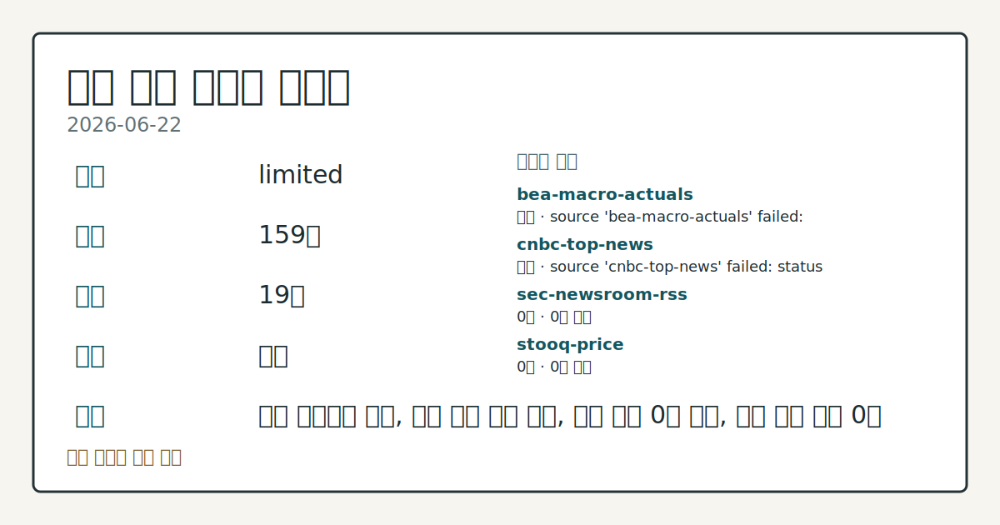
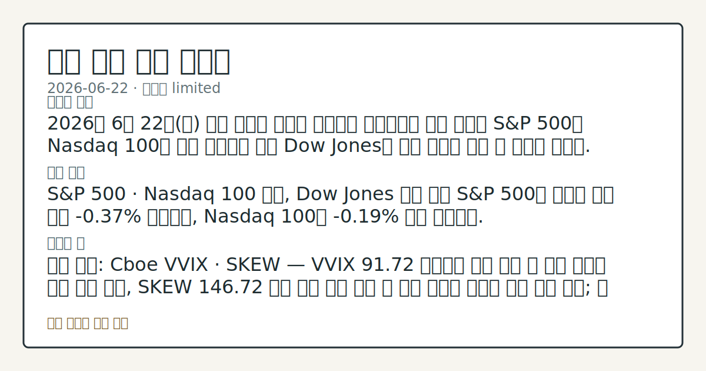

> 정보 제공용 자동 시황이며 매매 권유가 아닙니다.
# 2026-06-22 미국 증시 시황
**기준 시각**: 2026-06-22 NY · 2026-06-22T04:00Z, 2026-06-23T04:00Z)
| 종목 | 종가 | 변동 | 비고 |
|------|------|------|------|
| ^GSPC | 7,472.79 | -0.37% | -1.80% from 52w high · +8.96% YTD |
| ^IXIC | 26,166.60 | -1.32% | -3.42% from 52w high · +12.61% YTD |
| ^DJI | 51,712.71 | +0.29% | -0.55% from 52w high · +6.88% YTD |
| AAPL | 297.01 | -0.34% | -5.77% from 52w high · +9.59% YTD |
| MSFT | 367.34 | -3.18% | +2.96% from 52w low · -22.33% YTD |
**세그먼트**: [국내 증시](../../../domestic-equity/2026/06/2026-06-22.md) | [미국 증시](2026-06-22.md) | [크립토](../../../crypto/2026/06/2026-06-22.md)

*이미지: 데이터 신뢰도 · 출처: investo 자체 생성 · 생성: investo 0.1.0 · 2026-06-23 UTC*
> **내 관심 자산 영향**: 데이터 수집 부족으로 매칭 판단 보류 — 추가 수집 후 재평가됩니다.
> **용어 가이드**: 이번 시황에서 처음 등장한 용어 — PPI(생산자물가)
> **오늘의 결론**: 2026년 6월 22일(월) 미국 증시는 메가캡 기술주와 소프트웨어 섹터 약세로 S&P 500과 Nasdaq 100이 소폭 하락하는 한편 Dow Jones는 소폭 상승해 지수 간 분화를 보였다. [데이터부족]
> **핵심 동인**: S&P 500 · Nasdaq 100 하락, Dow Jones 소폭 반등 S&P 500은 월요일 종가 기준 **-0.37%** 하락했고, Nasdaq 100은 **-0.19%** 하락 마감했다.
> **주의할 점**: 확인 소스: Cboe VVIX · SKEW — VVIX 91.72 기준에서 추가 상승 시 단기 변동성 확대 압력 관찰, SKEW 146.72 기준 유지 또는...
> **데이터 상태**: 제한 · 본문 사용 미집계 · 실패 2 · 0건 3

수집/품질 진단

> **데이터 상태**: 제한 — 수집 159건 / 소스 19개 / 누락: 가격 · 제한 — 핵심 가격 소스 0건/실패/stale, 본문 결론 신뢰도 낮음
> **소스 카운트**: 수집 대상 24 / 성공 19 / 0건 3 / 실패 2 / 본문 사용 미집계
> **소스 등급 분포**: S=11 / A=8
> **상세 사유**: 가격 카테고리 누락, 일부 소스 수집 실패, 일부 소스 0건 반환, 핵심 가격 소스 0건
> **소스별 상태**: bea-macro-actuals 실패 (설정 미완료(미수집)), cnbc-top-news 실패 (접근 제한), sec-newsroom-rss 0건, stooq-price 0건, yfinance-price 0건, 정상 19개

## 한눈에 보기
S&P 500(스탠더드앤드푸어스 500 지수) **-0.37%**, Nasdaq 100(나스닥 100 지수) **-0.19%**, Dow Jones Industrial Average(다우존스 산업평균지수) **+0.29%** — 메가캡 기술주 약세 속 지수 혼조 마감
연준), 앨런 그린스펀(Alan Greenspan) 전 의장 별세 공식 애도 발표
CFTC(상품선물거래위원회) E-mini S&P 500 레버리지 머니 순매도 **-515,520** 계약(OI 대비 **-20.0%**) — 구조적 숏포지션 지속, §③ 수급 동향 참조
## ⓪ 오늘의 매크로
**FOMC 일정** — 2026-07-08 — FOMC Minutes
**국제 유가** — CFTC WTI crude oil managed_money net +96228 contracts
**미 국채 수익률** — UST curve 2026-06-22: 10Y 4.51%, 2Y10Y +0.27pp
## ⓪-B 채널 기준선
| 기준선 | 값 |
|------|------|
| S&P 500 | 7,472.79 (-0.37%) |
| 나스닥 종합 | 26,166.60 (-1.32%) |
| 다우존스 | 51,712.71 (+0.29%) |
| CFTC 포지셔닝 | E-mini S&P 500 순포지션 -515520계약 (-19.98% OI), 2026-06-16 기준/2026-06-22 공개 · Nasdaq-100 mini 순포지션 -28154계약 (-8.17% OI), 2026-06-16 기준/2026-06-22 공개 · VIX futures 순포지션 -13295계약 (-3.26% OI), 2026-06-16 기준/2026-06-22 공개 · 주간 지연 |
> **크로스마켓 연결 고리**: 유가/지정학 이슈가 여러 자산군의 변동성 연결 고리로 관찰됩니다. / 금리 이벤트가 할인율/달러 경로의 공통 변수로 남아 있습니다.
> **오늘의 큰 그림:** 금리와 달러 변수가 국내·미국·가상자산에 동시에 걸리며, 오늘 독자는 금리·달러 민감도을 먼저 확인해야 합니다.
## ① 요약

*이미지: 시장 스냅샷 · 출처: investo 자체 생성 · 생성: investo 0.1.0 · 2026-06-23 UTC*

2026년 6월 22일 미국 증시는 메가캡 기술주와 소프트웨어 섹터 약세로 S&P 500과 Nasdaq 100이 소폭 하락하는 한편 Dow Jones는 소폭 상승해 지수 간 분화를 보였다. 연준은 전 의장 앨런 그린스펀 별세 소식을 공식 발표했으며, 장중 칩메이커·AI 인프라 종목이 상대적 강세를 나타내며 낙폭을 일부 제한했다. WTI 원유(서부텍사스산 중질유)는 글로벌 공급 우려 완화로 **-2.32%** 하락했다. 지난 6월 18일 미-이란 협정 이후 이어지던 기술주 주도 상승 흐름에서 이탈하는 추세가 관찰되며, 섹터 간 분화가 진행 중이다. [혼재]

## ② 전일 핵심 이슈

### S&P 500 · Nasdaq 100 하락, Dow Jones 소폭 반등

[S&P 500](https://www.nasdaq.com/articles/stocks-mostly-lower-weakness-megacap-tech-and-software-stocks)은 월요일 종가 기준 **-0.37%** 하락했고, Nasdaq 100은 **-0.19%** 하락 마감했다. Dow Jones Industrial Average만 **+0.29%** 상승해 지수 분화를 보였다. 9월 인도분 E-mini S&P 선물(ESU26, 미니 S&P 500 선물)은 **-0.34%** 하락했으며, 메가캡 기술주와 소프트웨어 종목 약세가 주요 하방 압력으로 작용했다. 장중에는 칩메이커·AI 인프라 종목이 지수를 [지지하는](https://www.nasdaq.com/articles/stocks-supported-strength-chipmakers-and-ai-infrastructure-stocks) 흐름도 확인됐다. 미-이란 협정 발표 이후 기술주가 주도했던 상승 흐름에서 이번 주 들어 이탈 추세가 관찰된다.

> **그래서 의미는?** 대형 기술주 부담이 지수 전체를 끌어내리는 가운데 반도체·AI 인프라와 경기민감주(Dow 구성 종목)가 상대 강세를 보이며 섹터 순환 흐름이...

### 연준, 앨런 그린스펀 전 의장 별세 애도

[연준](https://www.federalreserve.gov/newsevents/pressreleases/other20260622a.htm)은 6월 22일 앨런 그린스펀(Alan Greenspan) 전 의장의 별세 소식을 공식 발표하며 깊은 애도를 표했다. 그린스펀은 연준 역사에서 상징적인 인물로, 케빈 워시(Kevin Warsh) 현 의장 체제의 정책 방향에 직접적 영향은 없으나 기관 내부 분위기 측면에서 주목할 사건이다.

### WTI 원유 하락 — 지정학 프리미엄 완화

글로벌 공급 우려 완화로 WTI 원유 7월물(CLN26)은 [전일 대비](https://www.nasdaq.com/articles/crude-oil-prices-retreat-global-supply-fears-recede) **-2.32%** 하락 마감했으며, 7월 RBOB 가솔린(RBN26, 미국 가솔린 선물)도 **-0.26%** 하락했다. 미-이란 협정 이후 지속되던 지정학적 리스크 프리미엄 축소 흐름의 연장선으로, 에너지 섹터 전반에 하방 압력이 작용했다.

## ③ 섹터/수급 동향

### CFTC COT(투자자 포지션 보고서): E-mini S&P 500 · 10Y 국채 대규모 순매도

[CFTC 주간 COT 보고서](https://www.cftc.gov/MarketReports/CommitmentsofTraders/index.htm)에 따르면 E-mini S&P 500 레버리지 머니(leveraged money, 헤지펀드 등 투기적 자금) 순포지션은 **-515,520** 계약(OI(미결제 약정) 대비 **-20.0%**)으로 대규모 순매도 상태다. 10Y 국채 선물(10Y Treasury note) 레버리지 머니도 **-2,082,236** 계약으로 채권에 대한 강한 숏 베팅이 지속되고 있다. Nasdaq-100 미니 선물 레버리지 머니 순포지션도 **-28,154** 계약으로 순매도 상태다.

> **그래서 의미는?** 레버리지 머니가 주식·채권 모두에 대규모 숏을 보유 중이어서, 반등 시 숏커버링(공매도상환)에 의한 단기 변동성 확대 구조를 관찰합니다.

### 금(Gold) · WTI 원유: 관리형 머니(Managed Money) 순매수

[금](https://www.cftc.gov/MarketReports/CommitmentsofTraders/index.htm) 관리형 머니 순포지션은 **+113,721** 계약으로 안전자산 선호가 유지되고 있다. WTI 원유 관리형 머니는 **+96,228** 계약으로 순매수 상태이나, 현물 가격 하락과의 괴리가 관찰된다. 달러 인덱스(DXY, 달러지수) 레버리지 머니 순포지션은 **-1,870** 계약으로 소폭 달러 약세 베팅이 유지되고 있다.

### VIX 선물 및 변동성 지표

VIX(변동성지수, 공포지수) 선물 레버리지 머니 순포지션은 **-13,295** 계약으로 변동성 완화 방향의 베팅이 관찰된다. Cboe VVIX(변동성의 변동성 지수)는 [**91.72**](https://cdn.cboe.com/api/global/us_indices/daily_prices/VVIX_History.csv)를 기록했으며, Cboe SKEW(꼬리 위험 지수, 극단적 하락 가능성 측정)는 2026-06-18 기준 [**146.72**](https://cdn.cboe.com/api/global/us_indices/daily_prices/SKEW_History.csv)로 테일 리스크에 대한 시장 경계심이 높은 수준에서 지속되고 있다.

## ④ 지표·이벤트

### 연준 정책 금리 및 인플레이션 지표

[DFF(연방기금 실효금리)](https://fred.stlouisfed.org/series/DFF)는 2026-06-19 기준 **3.63%**로 전일 대비 변동 없이 유지됐다. [CPIAUCSL(소비자물가지수)](https://fred.stlouisfed.org/series/CPIAUCSL) 2026년 5월 기준치는 **333.979**로 직전월(332.407) 대비 **+1.5720** 상승했으며, [PPIFID(생산자물가지수 최종수요)](https://fred.stlouisfed.org/series/PPIFID) 5월 기준치도 **158.012**로 직전월 대비 **+1.6170** 올랐다.

> **그래서 의미는?** CPI와 PPI 모두 전월 대비 상승하면서 인플레이션이 완전히 안정되지 않았음을 확인할 수 있어, 연준의 금리 인하 시점 기대를 재점검하는...

### 고용 지표

[UNRATE(실업률)](https://fred.stlouisfed.org/series/UNRATE) 2026년 5월 기준치는 **4.3%**로 전월과 동일하다. [BLS(미국 노동통계국)](https://www.bls.gov/data/) 데이터 기준 총 비농업 취업자 수는 **159,001** 천 명(2026-05, 전월 158,829), 시간당 평균 임금은 **$37.53**(전월 **$37.41**), 구인 건수(Job Openings)는 **7,618**(2026-04, 전월 6,887 대비 증가), 노동력 참여율(Labor Force Participation Rate)은 **61.8%**(2026-05, 전월과 동일), 핵심 소비자물가지수(Core CPI)는 **336.121**(2026-05, 전월 335.423)이다.

### Governor Waller 연준 이사 연설 (오늘)

[Christopher J. Waller 연준 이사](https://www.federalreserve.gov/newsevents/calendar.htm)는 오늘(2026-06-22) 오전 9시(미 동부시간) 워싱턴 D.C. '달러의 국제적 역할(International Roles of the U.S. Dollar)' 제5차 컨퍼런스에서 환영사를 진행한다. 통화정책 직접 신호보다 달러 국제화 관련 발언이 중심이나, 연준 이사의 공개 발언으로서 톤 변화 여부를 관찰할 수 있다.

## ⑤ 주요 종목

<!-- u50 lightweight-charts-embed: placeholders consumed by site_docs/assets/investo-chart-init.js -->

<noscript><em>인터랙티브 차트는 JavaScript가 활성화된 환경에서 표시됩니다. 위 정적 카드가 동일한 정보를 담고 있습니다.</em></noscript>

### 하락 관찰 종목

| 티커 | 종가 | 등락률 |
|------|------|--------|
| ONON (On Holding) | $36.21 | **-6.87%** |
| DECK (Deckers) | $105.57 | **-3.24%** |
| OC (Owens Corning) | $124.62 | **-2.75%** |
| MSTR (Strategy) | $109.46 | **-2.73%** |
| NET (Cloudflare) | $218.38 | **-2.54%** |
| PG (Procter & Gamble) | $147.68 | **-1.8%** |
| MNDY (Monday.com) | $70.36 | **-1.64%** |

> **그래서 의미는?** 소비재·스포츠웨어 ONON(온 홀딩)·DECK부터 클라우드 소프트웨어 NET(클라우드플레어)까지 광범위한 섹터에서 시장 평균 이상의 하락이...

### 확인 항목: 장중 강세 섹터

칩메이커 및 AI 인프라 관련 종목은 장중 지수를 지지하는 흐름이 보고됐으나, 개별 종목의 구체적 종가 데이터가 수집되지 않아 수치 확인 부족 상태다.

## ⑥ 오늘의 관전 포인트

#### 관찰 신호: SKEW — VVIX **91.72** 기준에서 추

- 출처: Cboe VVIX
- 현재: 확인 소스: Cboe VVIX · SKEW — VVIX **91.72** 기준에서 추가 상승 시 단기 변동성 확대 압력 관찰, SKEW **146.72** 기준 유지 또는 상승 시 테일 리스크 경계심 강화 흐름 점검; 두 지표 모두 현 수준 이하로 하락 전환 시 변동성 완화 신호로 비교. 관심 영향: E-mini S&P 500 대규모 숏포지션과 변동성 지표 방향의 수급 비교.
- 확인 조건: 상방 상방 데이터 부족; 하방 하방 데이터 부족
- 신뢰도: 보통
- 관심 영향: 관심 영향: E-mini S&P 500 대규모 숏포지션과 변동성 지표 방향의 수급 비교.

#### 관찰 신호: E-mini S&P 500 레버리지 머니 — 순매도 *…

- 출처: CFTC COT
- 현재: 확인 소스: CFTC COT · E-mini S&P 500 레버리지 머니 — 순매도 **-515,520** 계약 구간에서 숏커버링 유입으로 순매도 축소 전환 시 상방 반등 압력 관찰, 순매도 추가 확대 시 하방 흐름 추세 점검. 관심 영향: 단기 지수 방향성과 수급 신호 비교.
- 확인 조건: 상방 E-mini S&P 500 레버리지 머니 — 순매도 **-515,520** 계약 구간에서 숏커버링 유입으로 순매도 축소 전환 시 상방 반등 압력 관찰, 순매도 추가 확대 시 하방 흐름 추세 점검; 하방 E-mini S&P 500 레버리지 머니 — 순매도 **-515,520** 계약 구간에서 숏커버링 유입으로 순매도 축소 전환 시 상방 반등 압력 관찰, 순매도 추가 확대 시 하방 흐름 추세 점검
- 신뢰도: 보통
- 관심 영향: 관심 영향: 단기 지수 방향성과 수급 신호 비교.

#### 관찰 신호: CPIAUCSL **333.979** / PPIFID…

- 출처: FRED
- 현재: 확인 소스: FRED · CPIAUCSL **333.979** / PPIFID **158.012** — CPI·PPI 상승 추세 지속 확인 시 DFF **3.63%** 금리 동결 기간 연장 압력 관찰, 향후 CPI 하락 전환 시 금리 인하 기대 재형성 흐름 추세 비교. 관심 영향: 금리 민감 성장주·기술주 수급 변화 관찰.
- 확인 조건: 상방 상방 데이터 부족; 하방 하방 데이터 부족
- 신뢰도: 높음
- 관심 영향: 관심 영향: 금리 민감 성장주

#### 관찰 신호: 2026-06-25 SCOOS(딜러 파이낸싱 조건 고위…

- 출처: 연준 캘린더
- 현재: 확인 소스: 연준 캘린더 · 2026-06-25 SCOOS(딜러 파이낸싱 조건 고위 신용 담당자 의견 조사) — 신용 여건 완화 신호 확인 시 위험자산 수급 상방 흐름 관찰, 긴축 신호 확인 시 레버리지 머니 순매도 지속 여부 추세 점검. 관심 영향: 크레딧 시장과 주식 수급 연계 비교.
- 확인 조건: 상방 2026-06-25 SCOOS(딜러 파이낸싱 조건 고위 신용 담당자 의견 조사) — 신용 여건 완화 신호 확인 시 위험자산 수급 상방 흐름 관찰, 긴축 신호 확인 시 레버리지 머니 순매도 지속 여부 추세 점검; 하방 하방 데이터 부족
- 신뢰도: 보통
- 관심 영향: 관심 영향: 크레딧 시장과 주식 수급 연계 비교.

#### 관찰 신호: 2026-07-08 FOMC Minutes(연방공개시장…

- 출처: 연준 캘린더
- 현재: 확인 소스: 연준 캘린더 · 2026-07-08 FOMC Minutes(연방공개시장위원회 의사록) — 6월 FOMC 내 완화 논의 확인 시 금리 방향 상방 재조정 신호 관찰, 긴축 유지 논의 확인 시 현 DFF **3.63%** 고착 추세 점검. 관심 영향: 채권 금리 및 기술주 밸류에이션 방향 비교.
- 확인 조건: 상방 2026-07-08 FOMC Minutes(연방공개시장위원회 의사록) — 6월 FOMC 내 완화 논의 확인 시 금리 방향 상방 재조정 신호 관찰, 긴축 유지 논의 확인 시 현 DFF **3.63%** 고착 추세 점검; 하방 하방 데이터 부족
- 신뢰도: 높음
- 관심 영향: 관심 영향: 채권 금리 및 기술주 밸류에이션 방향 비교.
## ⑦ 면책조항
본 시황은 일반 정보 제공을 목적으로 자동 생성된 자료이며,
특정 종목·자산에 대한 매매 권유나 투자 자문이 아닙니다.
투자 결정과 그 결과에 대한 책임은 전적으로 본인에게 있으며,
본 시황의 내용에 따라 발생한 손실에 대해 작성자는 일체의 책임을 지지 않습니다.