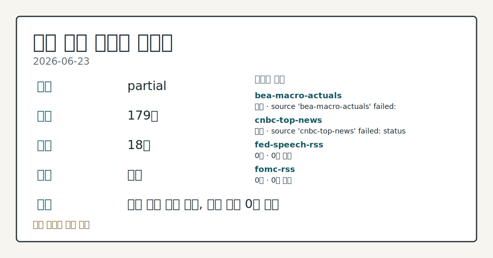
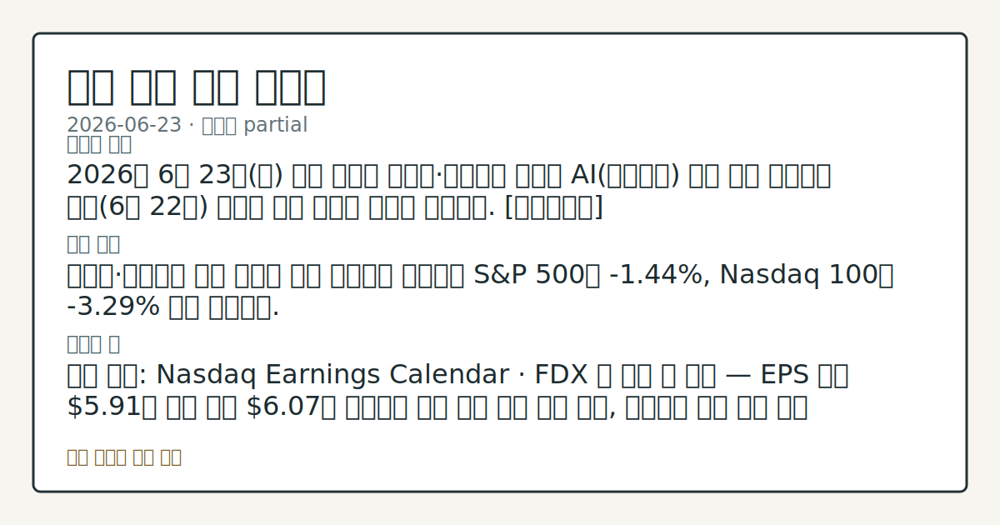
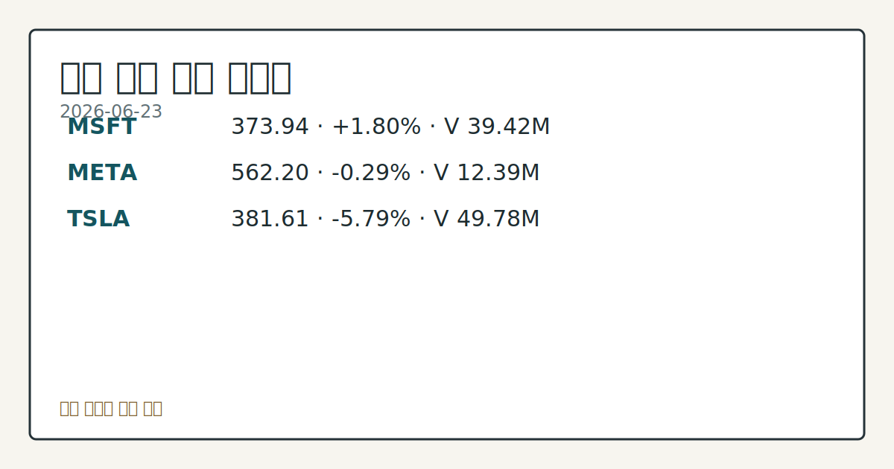

> 정보 제공용 자동 시황이며 매매 권유가 아닙니다.
# 2026-06-23 미국 증시 시황
**기준 시각**: 2026-06-23 NY · 2026-06-23T04:00Z, 2026-06-24T04:00Z)
| 종목 | 종가 | 변동 | 비고 |
|------|------|------|------|
| ^GSPC | 7,365.46 | -1.44% | -3.21% from 52w high · +7.39% YTD |
| ^IXIC | 25,587.04 | -2.21% | -5.56% from 52w high · +10.12% YTD |
| ^DJI | 51,666.84 | -0.09% | -0.64% from 52w high · +6.79% YTD |
| AAPL | 294.30 | -0.91% | -6.63% from 52w high · +8.59% YTD |
| MSFT | 373.94 | +1.80% | +4.81% from 52w low · -20.93% YTD |
**세그먼트**: [국내 증시](../../../domestic-equity/2026/06/2026-06-23.md) | [미국 증시](2026-06-23.md) | [크립토](../../../crypto/2026/06/2026-06-23.md)

*이미지: 데이터 신뢰도 · 출처: investo 자체 생성 · 생성: investo 0.1.0 · 2026-06-23 UTC*
> **내 관심 자산 영향**: 17건 확인 (기본 바스켓) — AAPL: [structured-symbol] AAPL listing metadata: Apple Inc. - Common Stock; AAPL: [structured-symbol] AAPL SEC company facts: Apple Inc.; AMZN: [structured-symbol] AMZN listing metadata: Amazon.com, Inc. - Common Stock; AMZN: [structured-symbol] AMZN SEC company facts: AMAZON COM INC; GOOGL: [structured-symbol] GOOGL listing metadata: Alphabet Inc. - Class A Common Stock 외
> **용어 가이드**: 이번 시황에서 처음 등장한 용어 — JOLTS(구인보고서)
> **오늘의 결론**: 2026년 6월 23일(화) 미국 증시는 반도체·칩메이커 급락과 AI(인공지능) 테마 열기 냉각으로 전일(6월 22일) 기술주 약세 흐름이 이틀째 이어졌다. [데이터부족]
> **핵심 동인**: 반도체·칩메이커 주도 기술주 급락 칩메이커 급락으로 S&P 500이 **-1.44%**, Nasdaq 100이 **-3.29%** 하락 마감했다.
> **주의할 점**: 확인 소스: Nasdaq Earnings Calendar · FDX 장 마감 후 실적 — EPS 예측 **$5.91**이 전년 동기 **$6.07**을 상회하면...
> **데이터 상태**: 부분 · 본문 사용 미집계 · 실패 2 · 0건 4

수집/품질 진단

> **데이터 상태**: 부분 — 수집 179건 / 소스 18개 / 누락: 없음 · 부분 — 일부 카테고리 미수집, 본문 일부 결론 보강 필요
> **소스 카운트**: 수집 대상 24 / 성공 18 / 0건 4 / 실패 2 / 본문 사용 미집계
> **소스 등급 분포**: S=9 / A=9
> **상세 사유**: 일부 소스 수집 실패, 일부 소스 0건 반환
> **소스별 상태**: bea-macro-actuals 실패 (설정 미완료(미수집)), cnbc-top-news 실패 (접근 제한), fed-speech-rss 0건, fomc-rss 0건, sec-newsroom-rss 0건, stooq-price 0건, 정상 18개

## 한눈에 보기
2026년 6월 23일 미국 증시는 반도체·칩메이커 급락과 AI 테마 열기 냉각으로 전일 기술주 약세 흐름이 이틀째 이어졌다. [데이터부족]
반도체·칩메이커 주도 기술주 급락 칩메이커 급락으로 S&P 500이 **-1.44%**, Nasdaq 100이 **-3.29%** 하락 마감했다.
확인 소스: Nasdaq Earnings Calendar · FDX 장 마감 후 실적 — EPS 예측 **$5.91**이 전년 동기 **$6.07**을 상회하면 물류 경기 회복 신호 관찰, 하회하면 경기 둔화 흐름 재점검. 관심 영향: 광범위 소비·물류 경기 지표 비교. 확인 소스: Cboe SKEW 141.85 · VVIX 99.50 — SKEW가 현 수준 이상을 유지하면 꼬리위험 지속 관찰, 하락 전환하면 시장 안도 흐름 추세 확인. 관심 영향: 시장 변동성 방향성 점검. 확인 소스: CFTC COT E-m
## ⓪ 오늘의 매크로
**FOMC 일정** — 2026-07-08 — FOMC Minutes
**미 국채 수익률** — UST curve 2026-06-23: 10Y 4.50%, 2Y10Y +0.34pp
## ⓪-B 채널 기준선
| 기준선 | 값 |
|------|------|
| S&P 500 | 7,365.46 (-1.44%) |
| 나스닥 종합 | 25,587.04 (-2.21%) |
| 다우존스 | 51,666.84 (-0.09%) |
| CFTC 포지셔닝 | E-mini S&P 500 순포지션 -515520계약 (-19.98% OI), 2026-06-16 기준/2026-06-22 공개 · Nasdaq-100 mini 순포지션 -28154계약 (-8.17% OI), 2026-06-16 기준/2026-06-22 공개 · VIX futures 순포지션 -13295계약 (-3.26% OI), 2026-06-16 기준/2026-06-22 공개 · 주간 지연 |
> **크로스마켓 연결 고리**: 금리 이벤트가 할인율/달러 경로의 공통 변수로 남아 있습니다.
> **오늘의 큰 그림:** 금리와 달러 변수가 국내·미국에 동시에 걸리며, 오늘 독자는 금리·달러 민감도을 먼저 확인해야 합니다.
## ① 요약

*이미지: 시장 스냅샷 · 출처: investo 자체 생성 · 생성: investo 0.1.0 · 2026-06-23 UTC*

2026년 6월 23일 미국 증시는 반도체·칩메이커 급락과 AI 테마 열기 냉각으로 전일 기술주 약세 흐름이 이틀째 이어졌다. [S&P 500(스탠더드앤드푸어스 500 지수)](https://www.nasdaq.com/articles/plunge-chipmakers-drags-stock-indexes-sharply-lower)이 **-1.44%** 하락하고 Nasdaq 100(나스닥 100 지수)은 **-3.29%** 급락한 반면 Dow Jones(다우존스 산업평균지수)는 **-0.09%** 소폭 내리는 데 그쳤다. CFTC(미국상품선물거래위원회) COT(Commitment of Traders, 트레이더별 포지션 보고서)에서 레버리지 자금의 주식 선물 순매도 포지션이 대규모로 누적된 상태이며, 변동성 지표도 높은 수준을 유지하고 있다. 오늘 장 마감 후 FDX(FedEx Corporation) 실적 발표가 경기 흐름을 확인하는 분기점으로 주목된다. [하락 관찰]

## ② 전일 핵심 이슈

### 반도체·칩메이커 주도 기술주 급락

[칩메이커 급락으로 S&P 500이 **-1.44%**, Nasdaq 100이 **-3.29%** 하락 마감](https://www.nasdaq.com/articles/plunge-chipmakers-drags-stock-indexes-sharply-lower)했다. Dow Jones는 **-0.09%**로 낙폭이 제한됐으며, September E-mini S&P futures(ESU26, 9월물 미니 S&P 선물)도 **-1.41%** 하락했다.

> **그래서 의미는?** 반도체·AI 밸류에이션 재평가 논의가 기술 섹터 전반의 매도 흐름으로 이어지는 국면을 이틀째 추적 중입니다.

전일(6월 22일) 메가캡 기술주·소프트웨어 약세에 이어, 오늘도 [AI 열기 냉각 서사](https://www.nasdaq.com/articles/stocks-slide-artificial-intelligence-frenzy-eases)가 Nasdaq 100을 **-3.29%** 끌어내렸다. 자금 흐름은 대형 기술주에서 이탈하는 방향으로 관찰됐으며, 지수 분화(Dow Jones 방어 vs. Nasdaq 급락) 패턴이 지속됐다.

### 필수 매크로 지표 확인

미국 증시 금리·물가 환경 점검 차원에서 [DFF(연방기금금리 실효치)](https://fred.stlouisfed.org/series/DFF)는 2026년 6월 22일 기준 **3.63%**로 전일 대비 변화 없이 유지됐다. [CPIAUCSL(소비자물가지수)](https://fred.stlouisfed.org/series/CPIAUCSL) 2026년 5월 기준치는 **333.979**로 전월 332.407 대비 상승했으며, [PPIFID(생산자물가지수 최종수요)](https://fred.stlouisfed.org/series/PPIFID)는 **158.012**로 전월 156.395 대비 올랐다. [UNRATE(실업률)](https://fred.stlouisfed.org/series/UNRATE) 2026년 5월치는 **4.3%**로 전월과 동일하게 유지됐다.

### 원유 하락

[August WTI crude oil(CLQ26, 8월물 WTI 원유 선물)은 **-0.88%** 하락](https://www.nasdaq.com/articles/crude-oil-prices-settle-lower-supply-concerns-subside)해 3.5개월 저점을 기록했으며, August RBOB gasoline(RBQ26, 8월물 휘발유 선물)도 **-0.73%** 내렸다. 공급 우려 완화가 하락 압력으로 작용했다.

## ③ 섹터/수급 동향

### CFTC COT 주간 포지셔닝

[CFTC 주간 COT 보고서](https://www.cftc.gov/MarketReports/CommitmentsofTraders/index.htm) 기준 레버리지 머니(leveraged money, 투기 헤지펀드) 및 managed money(운용 자금) 순포지션:

| 상품 | 순포지션 | OI(미결제약정) 비율 |
|------|---------|----------------|
| E-mini S&P 500 | -515,520 계약 | -20.0% |
| 10Y Treasury note | -2,082,236 계약 | -39.1% |
| Nasdaq-100 mini | -28,154 계약 | -8.2% |
| U.S. Dollar Index | -1,870 계약 | -3.8% |
| VIX 선물 | -13,295 계약 | -3.3% |
| Gold 선물 | +113,721 계약 | +33.5% |
| WTI crude oil | +96,228 계약 | +4.8% |

> **그래서 의미는?** 레버리지 자금의 주식·국채 선물 순매도 규모가 크게 누적된 반면 금·원유 순매수는 유지돼, 안전자산 선호 흐름이 병행되고 있음을 확인할 수...

### 변동성 지표

[Cboe VVIX(변동성의 변동성 지수)](https://cdn.cboe.com/api/global/us_indices/daily_prices/VVIX_History.csv) 2026-06-23 기준 **99.50**, [Cboe SKEW(꼬리위험 지수)](https://cdn.cboe.com/api/global/us_indices/daily_prices/SKEW_History.csv) 2026-06-22 기준 **141.85**를 기록했다. SKEW가 높은 수준을 유지하는 가운데 VVIX도 시장 불확실성이 확대된 상태를 나타낸다. 숏커버링(공매도상환)이 발생할 경우 단기 변동성 확대 가능성을 배제할 수 없는 포지셔닝 구도다.

## ④ 지표·이벤트

### 오늘 FOMC 일정 및 이번 주 연준 발언

오늘(2026-06-23) 연준(Federal Reserve)은 H.6(통화량 통계, Money Stock Measures) 보고서를 오후 1시에 발표한다. 현 연준 의장은 [케빈 워시(Kevin Warsh)](https://www.federalreserve.gov/aboutthefed/bios/board/default.htm)이며, 이번 주 예정된 발언으로 6월 24일(수) 이사 Lisa D. Cook 연설, 6월 25일(목) 감독 담당 부의장(Vice Chair for Supervision) Michelle W. Bowman 발언이 있다.

> **그래서 의미는?** 연준 위원들의 발언 톤이 기술주 반등 여지 또는 추가 압박 방향을 가늠하는 단서로 기능할 수 있어 점검이 필요합니다.

### BLS 최신 고용·물가 지표

[BLS(미국노동통계국)](https://www.bls.gov/data/) 2026년 5월 기준 주요 실측치:

| 지표 | 2026-05 실측 | 전월 |
|------|-----------|------|
| 실업률 | 4.3% | 4.3% |
| 비농업 고용 | 159,001천 명 | 158,829천 명 |
| 시간당 평균임금 | $37.53 | $37.41 |
| 노동력 참가율 | 61.8% | 61.8% |
| CPI | 333.979 | 332.407 |
| 핵심 CPI | 336.121 | 335.423 |
| PPI 최종수요 | 157.659 | 156.011 |
| 구인건수(JOLTS) | 7,618천 | 6,887천 |

고용·물가 지표는 완만한 상승세를 보이며 연준의 금리 정책 판단 재료로 계속 추적된다.

## ⑤ 주요 종목

<!-- u50 lightweight-charts-embed: placeholders consumed by site_docs/assets/investo-chart-init.js -->

<noscript><em>인터랙티브 차트는 JavaScript가 활성화된 환경에서 표시됩니다. 위 정적 카드가 동일한 정보를 담고 있습니다.</em></noscript>

*이미지: 가격 스냅샷 · 출처: investo 자체 생성 · 생성: investo 0.1.0 · 2026-06-23 UTC*

### 실적 발표 확인 항목

| 종목 | 기업명 | 발표 시점 | EPS 예측 | 전년 동기 EPS |
|------|-------|---------|---------|------------|
| [FDX](https://www.nasdaq.com/market-activity/stocks/fdx/earnings) | FedEx Corporation | 장 마감 후 | $5.91 | $6.07 |
| [CCL](https://www.nasdaq.com/market-activity/stocks/ccl/earnings) | Carnival Corporation | 장 전 | $0.34 | $0.35 |
| [CBRS](https://www.nasdaq.com/market-activity/stocks/cbrs/earnings) | Cerebras Systems | 장 마감 후 | ($0.14) | — |
| [KBH](https://www.nasdaq.com/market-activity/stocks/kbh/earnings) | KB Home | 장 마감 후 | $0.43 | $1.50 |
| [ICLR](https://www.nasdaq.com/market-activity/stocks/iclr/earnings) | ICON plc | 장 마감 후 | $2.18 | $3.07 |
| [KFY](https://www.nasdaq.com/market-activity/stocks/kfy/earnings) | Korn Ferry | 장 전 | $1.37 | $1.32 |
| [WOR](https://www.nasdaq.com/market-activity/stocks/wor/earnings) | Worthington Enterprises | 장 마감 후 | $1.04 | $1.06 |

> **그래서 의미는?** FDX(FedEx Corporation)와 CCL(Carnival Corporation)은 각각 물류·여행 소비 경기 온도계 역할을 하며...

### 체크리스트 항목

- [GEV](https://www.nasdaq.com/articles/ge-vernova-gev-falls-more-steeply-broader-market-what-investors-need-know) (GE Vernova): 최근 세션 **-8.21%** 하락 — 에너지 섹터 내 변동 흐름 관찰
- [CDNS](https://www.nasdaq.com/articles/heres-why-cadence-design-systems-cdns-fell-more-broader-market-0) (Cadence Design Systems): 종가 **$379.06**, **-2.57%** 하락 — EDA(전자설계자동화) 소프트웨어 섹터 칩 설계 수요 흐름 점검

## ⑥ 오늘의 관전 포인트

#### 관찰 신호: FDX 장 마감 후 실적

- 출처: 확인 소스 미상
- 현재: 확인 소스: Nasdaq Earnings Calendar · FDX 장 마감 후 실적 — EPS 예측 **$5.91**이 전년 동기 **$6.07**을 상회하면 물류 경기 회복 신호 관찰, 하회하면 경기 둔화 흐름 재점검. 관심 영향: 광범위 소비·물류 경기 지표 비교.
- 확인 조건: 상방 FDX 장 마감 후 실적; 하방 FDX 장 마감 후 실적
- 신뢰도: 높음
- 관심 영향: 관심 영향: 광범위 소비

#### 관찰 신호: 확인 소스: Cboe SKEW 141.85 · VVIX…

- 출처: 확인 소스 미상
- 현재: 확인 소스: Cboe SKEW 141.85 · VVIX **99.50** — SKEW가 현 수준 이상을 유지하면 꼬리위험 지속 관찰, 하락 전환하면 시장 안도 흐름 추세 확인. 관심 영향: 시장 변동성 방향성 점검.
- 확인 조건: 상방 상방 데이터 부족; 하방 하방 데이터 부족
- 신뢰도: 낮음
- 관심 영향: 관심 영향: 시장 변동성 방향성 점검.

#### 관찰 신호: 확인 소스: CFTC COT E-mini S&P 레버리…

- 출처: 확인 소스 미상
- 현재: 확인 소스: CFTC COT E-mini S&P 레버리지 순매도 포지션 — 순매도 -515,520 계약(**-20.0%** OI) 수준에서 지수 반등 시 숏커버링 강도 관찰, 추가 하락 시 순매도 확대 여부 비교. 관심 영향: 기관 포지션 전환 흐름 확인.
- 확인 조건: 상방 상방 데이터 부족; 하방 하방 데이터 부족
- 신뢰도: 높음
- 관심 영향: 관심 영향: 기관 포지션 전환 흐름 확인.

#### 관찰 신호: 확인 소스: 연준 위원 발언 일정 · 6월 24일 Li…

- 출처: 확인 소스 미상
- 현재: 확인 소스: 연준 위원 발언 일정 · 6월 24일 Lisa D. Cook 이사 연설, 6월 25일 Michelle W. Bowman 부의장 발언 — 매파적(금리 인상 선호) 발언이 나오면 금리 상방 압력 관찰, 비둘기파적(금리 인하 선호) 신호가 나오면 기술주 반등 여지 추세 확인. 관심 영향: 연준 금리 경로 재평가 흐름 점검.
- 확인 조건: 상방 Bowman 부의장 발언 — 매파적(금리 인상 선호) 발언이 나오면 금리 상방 압력 관찰, 비둘기파적(금리 인하 선호) 신호가 나오면 기술주 반등 여지 추세 확인; 하방 하방 데이터 부족
- 신뢰도: 보통
- 관심 영향: 관심 영향: 연준 금리 경로 재평가 흐름 점검.

#### 관찰 신호: 확인 소스: KBH 장 마감 후 실적 · EPS 예측…

- 출처: 확인 소스 미상
- 현재: 확인 소스: KBH 장 마감 후 실적 · EPS 예측 **$0.43** (전년 **$1.50**) — 실적이 예측을 상회하면 주택 섹터 수요 회복 신호 관찰, 하회하면 금리 민감 섹터 둔화 추세 확인. 관심 영향: 주택 경기 지표 비교.
- 확인 조건: 상방 EPS 예측 **$0.43** (전년 **$1.50**) — 실적이 예측을 상회하면 주택 섹터 수요 회복 신호 관찰, 하회하면 금리 민감 섹터 둔화 추세 확인; 하방 EPS 예측 **$0.43** (전년 **$1.50**) — 실적이 예측을 상회하면 주택 섹터 수요 회복 신호 관찰, 하회하면 금리 민감 섹터 둔화 추세 확인
- 신뢰도: 높음
- 관심 영향: 관심 영향: 주택 경기 지표 비교.
## ⑦ 면책조항
본 시황은 일반 정보 제공을 목적으로 자동 생성된 자료이며,
특정 종목·자산에 대한 매매 권유나 투자 자문이 아닙니다.
투자 결정과 그 결과에 대한 책임은 전적으로 본인에게 있으며,
본 시황의 내용에 따라 발생한 손실에 대해 작성자는 일체의 책임을 지지 않습니다.