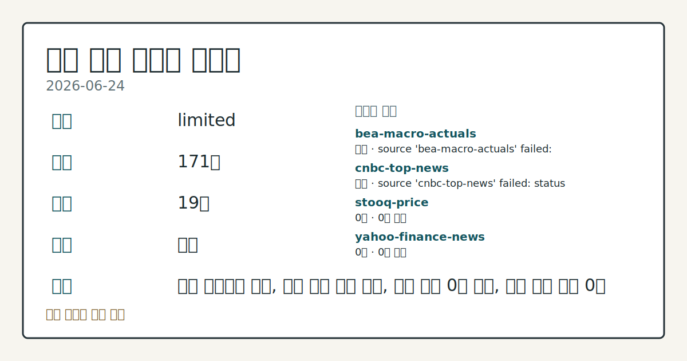
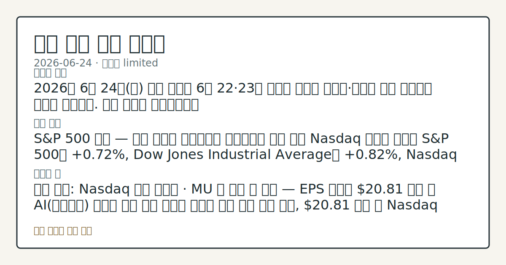

> 정보 제공용 자동 시황이며 매매 권유가 아닙니다.
# 2026-06-24 미국 증시 시황
**기준 시각**: 2026-06-24 NY · 2026-06-24T04:00Z, 2026-06-25T04:00Z)
| 종목 | 종가 | 변동 | 비고 |
|------|------|------|------|
| ^GSPC | 7,358.22 | -0.10% | -3.31% from 52w high · +7.29% YTD |
| ^IXIC | 25,476.63 | -0.43% | -5.97% from 52w high · +9.64% YTD |
| ^DJI | 51,848.90 | +0.35% | -0.29% from 52w high · +7.16% YTD |
| AAPL | 293.08 | -0.41% | -7.02% from 52w high · +8.14% YTD |
| MSFT | 365.46 | -2.27% | +2.44% from 52w low · -22.73% YTD |
**세그먼트**: [국내 증시](../../../domestic-equity/2026/06/2026-06-24.md) | [미국 증시](2026-06-24.md) | [크립토](../../../crypto/2026/06/2026-06-24.md)

*이미지: 데이터 신뢰도 · 출처: investo 자체 생성 · 생성: investo 0.1.0 · 2026-06-25 UTC*
> **내 관심 자산 영향**: 데이터 수집 부족으로 매칭 판단 보류 — 추가 수집 후 재평가됩니다.
> **오늘의 결론**: 2026년 6월 24일(수) 미국 증시는 6월 22·23일 이틀간 이어진 기술주·반도체 주도 하락에서 벗어나 반등했다. 수집 근거가 제한적입니다
> **핵심 동인**: S&P 500 반등 — 원유 하락이 국채금리를 끌어내리며 수급 전환 Nasdaq 기사에 따르면 S&P 500은 **+0.72%**, Dow Jones Industrial Average는 **+0.82%**, Nasdaq 100은 **+0.50%** 상승했고, September ESU26(미니S&P선물)도 **+0.56%** 올랐다.
> **주의할 점**: 확인 소스: Nasdaq 실적 캘린더 · MU 장 마감 후 실적 — EPS 예상치 **$20.81** 상회 시 AI(인공지능) 메모리 수요 회복 본문 참고.
## 한눈에 보기
S&P 500 **+0.72%**, Dow Jones **+0.82%**, Nasdaq 100 **+0.50%** — 원유 가격 하락이 국채금리를 끌어내리며 직전 이틀 하락세에서 반등
연준(Federal Reserve) 연간 대형은행 스트레스 테스트 결과, 주요 대형 은행 모두 심각한 경기침체에서도 대출 지속 가능 공식 확인
MU(Micron Technology) 장 마감 후 실적 발표 예정 — EPS(주당순이익) 예상치 **$20.81**, 기술주 단기 방향성의 핵심 분기점으로 본문 §⑤ 참조
## ⓪ 오늘의 매크로
**미 국채 수익률** — UST curve 2026-06-24: 10Y 4.41%, 2Y10Y +0.30pp
## ⓪-B 채널 기준선
| 기준선 | 값 |
|------|------|
| S&P 500 | 7,358.22 (-0.10%) |
| 나스닥 종합 | 25,476.63 (-0.43%) |
| 다우존스 | 51,848.90 (+0.35%) |
| CFTC 포지셔닝 | E-mini S&P 500 순포지션 -515520계약 (-19.98% OI), 2026-06-16 기준/2026-06-22 공개 · Nasdaq-100 mini 순포지션 -28154계약 (-8.17% OI), 2026-06-16 기준/2026-06-22 공개 · VIX futures 순포지션 -13295계약 (-3.26% OI), 2026-06-16 기준/2026-06-22 공개 · 주간 지연 |
> **크로스마켓 연결 고리**: 금리 이벤트가 할인율/달러 경로의 공통 변수로 남아 있습니다.
> **오늘의 큰 그림:** 금리와 달러 변수가 미국·가상자산에 동시에 걸리며, 오늘 독자는 금리·달러 민감도를 먼저 확인해야 합니다.
## ① 요약

*이미지: 시장 스냅샷 · 출처: investo 자체 생성 · 생성: investo 0.1.0 · 2026-06-25 UTC*

2026년 6월 24일 미국 증시는 6월 22·23일 이틀간 이어진 기술주·반도체 주도 하락에서 벗어나 반등했다. S&P 500(스탠더드앤드푸어스 500 지수)은 **+0.72%**, Dow Jones Industrial Average(다우존스 산업평균지수)는 **+0.82%**, Nasdaq 100(나스닥 100 지수)은 **+0.50%** 상승하며 방향을 전환했다. 원유 가격 하락이 국채금리를 끌어내리고, 연준의 대형은행 스트레스 테스트가 금융 시스템 건전성을 공식 확인한 것이 반등의 배경으로 관찰된다. 이날 장 마감 후 MU 실적 발표가 기술주 수급의 추가 방향성을 결정할 변수로 남아 있다. [상승 관찰]

## ② 전일 핵심 이슈

### S&P 500 반등 — 원유 하락이 국채금리를 끌어내리며 수급 전환

[Nasdaq 기사](https://www.nasdaq.com/articles/stocks-rally-falling-crude-prices-knock-bond-yields-lower)에 따르면 S&P 500은 **+0.72%**, Dow Jones Industrial Average는 **+0.82%**, Nasdaq 100은 **+0.50%** 상승했고, September ESU26도 **+0.56%** 올랐다. 원유 시장의 하락 압력이 채권시장으로 흘러들어 금리를 끌어내렸고, 이것이 성장주로의 자금 유입을 지지한 흐름으로 해석된다. 이전 세션에서 S&P 500이 **-0.10%**, Nasdaq 100이 **-0.43%**로 [혼재 마감](https://www.nasdaq.com/articles/stocks-settle-mixed-tech-weakness-weighs-broader-market)했던 것과 대비된다.

> **그래서 의미는?** 유가·금리 연동 반등이지만 Nasdaq 100의 상승 폭이 Dow 대비 제한적이어서, 기술주 모멘텀 회복 강도는 MU 실적 결과 확인이...

### 연준 연간 대형은행 스트레스 테스트 — 심각한 경기침체 시나리오에서도 대출 능력 유지 확인

[연준 공식 발표](https://www.federalreserve.gov/newsevents/pressreleases/bcreg20260624a.htm)에 따르면 2026년 연간 대형은행 스트레스 테스트(Annual Bank Stress Test) 결과, 주요 대형 은행들이 심각한 경기침체 시나리오 아래에서도 가계·기업에 대한 대출을 지속할 수 있는 충분한 자본 완충력을 갖추고 있음이 확인되었다.

## ③ 섹터/수급 동향

### CFTC(상품선물거래위원회) 주간 포지셔닝 — 레버리지 머니(차입 운용 펀드), 미국 주식·국채 대규모 순매도 유지

[CFTC COT(대규모 트레이더 포지션) 보고서](https://www.cftc.gov/MarketReports/CommitmentsofTraders/index.htm) (주간 집계):

| 자산 | 레버리지/관리 머니 순포지션 | OI(미결제약정) 대비 비중 |
|------|--------------------------|----------------------|
| E-mini S&P 500 | **-515,520** 계약 | **-20.0%** |
| Nasdaq-100 mini | **-28,154** 계약 | **-8.2%** |
| 10Y Treasury note(10년물 국채선물) | **-2,082,236** 계약 | **-39.1%** |
| U.S. Dollar Index(달러지수) | **-1,870** 계약 | **-3.8%** |
| VIX futures(변동성지수선물) | **-13,295** 계약 | **-3.3%** |
| Gold(금) | **+113,721** 계약 | **+33.5%** |
| WTI crude oil(서부텍사스산원유) | **+96,228** 계약 | **+4.8%** |

> **그래서 의미는?** 레버리지 머니가 주식과 채권 양방향 모두에 대규모 순매도를 유지 중으로, 오늘 반등이 쇼트커버링(공매도상환) 성격을 포함했는지 추세 점검이...

### Cboe 변동성 지표 — SKEW·VVIX 동반 관찰

[Cboe SKEW](https://cdn.cboe.com/api/global/us_indices/daily_prices/SKEW_History.csv)(꼬리위험지수) 2026년 6월 24일 종가 **145.30**, [Cboe VVIX](https://cdn.cboe.com/api/global/us_indices/daily_prices/VVIX_History.csv)(변동성의변동성지수) **95.58**을 기록했다. SKEW가 145를 상회하는 수준은 시장 참여자들의 좌측 꼬리(급락) 헤지 수요가 상대적으로 높다는 신호로 해석된다.

## ④ 지표·이벤트

### 정책금리 및 단기자금시장

[NY Fed EFFR(실효연방기금금리)](https://markets.newyorkfed.org/api/rates/unsecured/effr) 6월 23일 기준 **3.63%** (거래량 **$109B**), [SOFR(담보부익일물금리)](https://markets.newyorkfed.org/api/rates/secured/sofr) **3.62%** (거래량 **$3,105B**). [FRED DFF(연방기금금리)](https://fred.stlouisfed.org/series/DFF) 6월 23일 기준 **3.63%**로 직전 대비 변화 없이 유지되고 있다.

> **그래서 의미는?** 정책금리가 안정적으로 유지되어, 금리 충격보다 인플레이션과 기업 실적 변수가 단기 방향성을 결정하는 구도가 지속됩니다.

### 인플레이션 지표 (2026년 5월 기준)

[FRED CPIAUCSL(소비자물가지수)](https://fred.stlouisfed.org/series/CPIAUCSL) 2026년 5월 **333.979** (직전 2026년 4월 332.407). [FRED PPIFID(최종수요 생산자물가지수)](https://fred.stlouisfed.org/series/PPIFID) 2026년 5월 **158.012** (직전 156.395). [BLS](https://www.bls.gov/data/) 기준 Core CPI(근원소비자물가지수) 5월 **336.121** (직전 335.423), PPI Final Demand(최종수요 PPI) **157.659** (직전 156.011), 평균시급(Average hourly earnings) **$37.53** (직전 **$37.41**).

### 고용 지표 (2026년 5월 기준)

[FRED UNRATE(실업률)](https://fred.stlouisfed.org/series/UNRATE) 5월 **4.3%** (직전 **4.3%** — 변화 없음), [BLS 비농업 취업자수(Total nonfarm payroll employment)](https://www.bls.gov/data/) 5월 **159,001**천 명 (직전 158,829천 명), 노동참여율(Labor Force Participation Rate) **61.8%** (전월 동일), [구인건수(Job Openings)](https://www.bls.gov/data/) 4월 기준 **7,618** (직전 6,887).

### EIA(에너지정보청) 주간 석유 재고 (2026-06-19 기준)

[EIA 주간 석유 공급 보고서](https://www.eia.gov/petroleum/supply/weekly/): 상업용 원유 재고(SPR(전략비축유) 제외) **412,134 MBBL(백만 배럴)**, 가솔린 재고 **216,299 MBBL**, 증류유(Distillate fuel oil) 재고 **106,116 MBBL**, 원유 현장 생산량 **13,819 MBBL/D(백만 배럴/일)**, 원유 수입량 **5,570 MBBL/D**, 정제설비 가동률(Refinery utilization) **96.1%**.

## ⑤ 주요 종목

<!-- u50 lightweight-charts-embed: placeholders consumed by site_docs/assets/investo-chart-init.js -->

<noscript><em>인터랙티브 차트는 JavaScript가 활성화된 환경에서 표시됩니다. 위 정적 카드가 동일한 정보를 담고 있습니다.</em></noscript>

> **그래서 의미는?** MU, PAYX(Paychex·페이첵스), TCOM(Trip.com·트립닷컴)의 실적 결과가 관련 섹터 단기 수급 흐름에 영향을 줄 수 있어...

### 실적 발표 예정 (2026-06-24)

| 종목 | 발표 시점 | EPS 예상 | 전년 동기 EPS |
|------|---------|---------|-------------|
| [MU](https://www.nasdaq.com/market-activity/stocks/mu/earnings) | 장 마감 후 | **$20.81** | $1.73 |
| [PAYX](https://www.nasdaq.com/market-activity/stocks/payx/earnings) | 장 시작 전 | **$1.31** | $1.19 |

### 실적 발표 완료 (확인 항목)

- [**TCOM**](https://www.nasdaq.com/articles/tripcom-tcom-lags-q1-earnings-estimates): 2026년 1분기 EPS **-2.35%** 서프라이즈(예상 하회), 매출 서프라이즈 **+0.99%**(예상 소폭 상회) 기록.

## ⑥ 오늘의 관전 포인트

#### 관찰 신호: MU 장 마감 후 실적 — EPS 예상치 **$20.8…

- 출처: Nasdaq 실적 캘린더
- 현재: Nasdaq 실적 캘린더 · MU 장 마감 후 실적 — EPS 예상치 **$20.81** 상회 시 AI 메모리 수요 회복 신호로 반도체 섹터 상방 흐름 관찰, **$20.81** 하회 시 Nasdaq 100 기술주 수급 부담 재개 흐름 점검. 관심 영향: 기술주 단기 방향성 확인.
- 확인 조건: 상방 MU 장 마감 후 실적 — EPS 예상치 **$20.81** 상회 시 AI 메모리 수요 회복 신호로 반도체 섹터 상방 흐름 관찰; 하방 **$20.81** 하회 시 Nasdaq 100 기술주 수급 부담 재개 흐름 점검
- 신뢰도: 높음
- 관심 영향: 기술주 단기 방향성 확인.

#### 관찰 신호: E-mini S&P 500 레버리지 머니 순포지션 **…

- 출처: CFTC COT 보고서
- 현재: 순매도 유지
- 확인 조건: 상방 E-mini S&P 500 레버리지 머니 순포지션 **-515,520** 계약(**-20.0%** OI) — 순매도 규모 축소 전환 시 쇼트커버링 성격의 상방 압력 관찰; 하방 심화 시 지수 추가 하방 하중 흐름 점검
- 신뢰도: 높음
- 관심 영향: 주간 수급 방향성 비교.

#### 관찰 신호: 오늘(2026-06-24) Cook 이사(Governo…

- 출처: FOMC 일정
- 현재: FOMC 일정 · 오늘(2026-06-24) Cook 이사(Governor) 연설 및 내일(2026-06-25) Bowman 감독담당 부의장(Vice Chair for Supervision) 토론 예정 — 발언 내용이 금리 동결 기조를 확인하면 단기금리 안정 기대 상방 관찰, 추가 긴축 시그널 감지 시 금리 민감 섹터 수급 하방 흐름 점검. 관심 영향: 연준 정책 방향성 데이터 비교.
- 확인 조건: 상방 오늘(2026-06-24) Cook 이사(Governor) 연설 및 내일(2026-06-25) Bowman 감독담당 부의장(Vice Chair for Supervision) 토론 예정 — 발언 내용이 금리 동결 기조를 확인하면 단기금리 안정 기대 상방 관찰; 하방 추가 긴축 시그널 감지 시 금리 민감 섹터 수급 하방 흐름 점검
- 신뢰도: 보통
- 관심 영향: 연준 정책 방향성 데이터 비교.

> **데이터 상태**: 제한

수집/품질 진단

> **데이터 상태**: 제한 — 수집 171건 / 소스 19개 / 누락: 가격 · 제한 — 핵심 가격 소스 0건/실패/stale, 본문 결론 신뢰도 낮음
> **소스 카운트**: 수집 대상 24 / 성공 19 / 수집 상세는 진단 섹션에서 확인할 수 있습니다. / 수집 상세는 진단 섹션에서 확인할 수 있습니다. / 수집 상세는 진단 섹션에서 확인할 수 있습니다.
> **소스 등급 분포**: S=12 / A=7
> **상세 사유**: 가격 카테고리 누락, 일부 소스 수집 실패, 일부 소스 0건 반환, 핵심 가격 소스 0건
> **소스별 상태**: bea-macro-actuals 실패 (설정 미완료(미수집)), cnbc-top-news 실패 (접근 제한), stooq-price 0건, yahoo-finance-news 0건, yfinance-price 0건, 정상 19개

## ⑦ 면책조항
본 시황은 일반 정보 제공을 목적으로 자동 생성된 자료이며,
특정 종목·자산에 대한 매매 권유나 투자 자문이 아닙니다.
투자 결정과 그 결과에 대한 책임은 전적으로 본인에게 있으며,
본 시황의 내용에 따라 발생한 손실에 대해 작성자는 일체의 책임을 지지 않습니다.