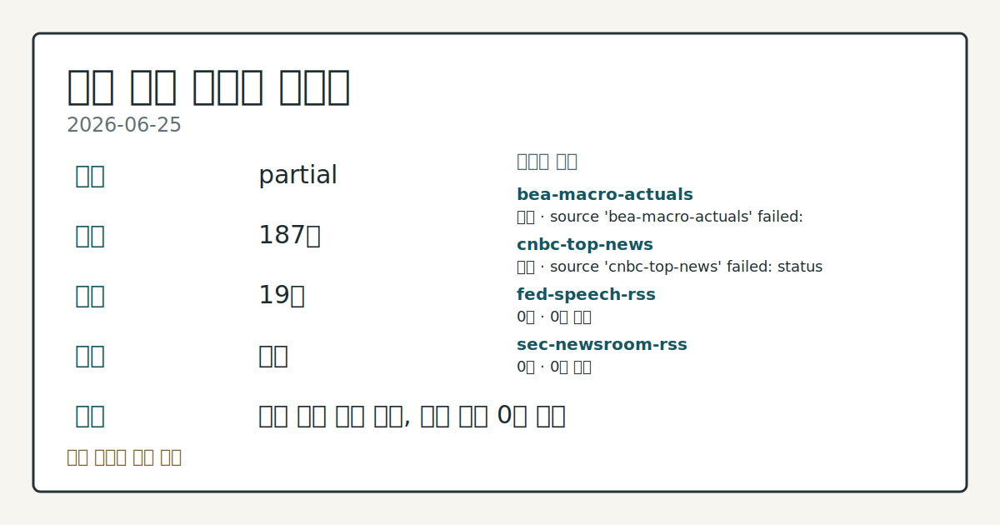
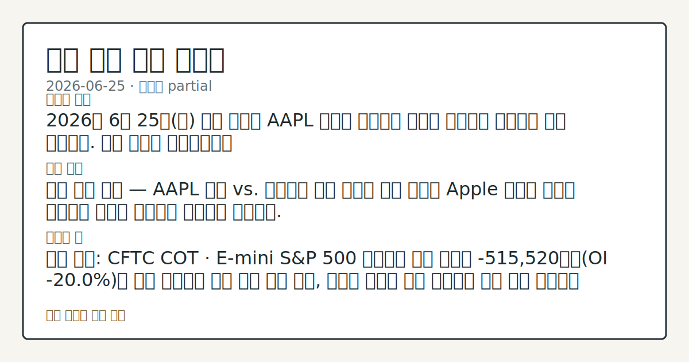
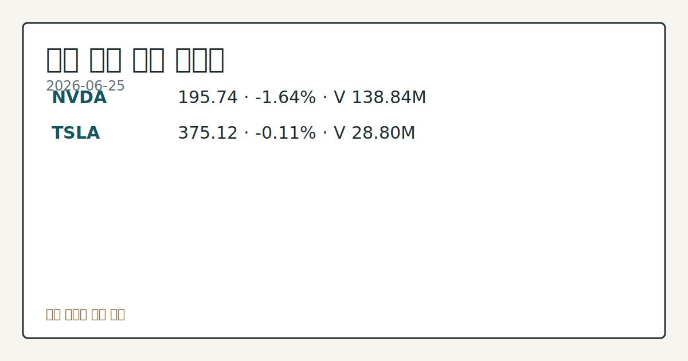

> 정보 제공용 자동 시황이며 매매 권유가 아닙니다.
# 2026-06-25 미국 증시 시황
**기준 시각**: 2026-06-25 NY · 2026-06-25T04:00Z, 2026-06-26T04:00Z)
| 종목 | 종가 | 변동 | 비고 |
|------|------|------|------|
| ^GSPC | 7,357.49 | -0.01% | -3.32% from 52w high · +7.28% YTD |
| ^IXIC | 25,358.60 | -0.46% | -6.40% from 52w high · +9.14% YTD |
| ^DJI | 51,920.62 | +0.14% | -0.15% from 52w high · +7.31% YTD |
| AAPL | 275.15 | -6.12% | -12.71% from 52w high · -10.17% MTD |
| MSFT | 352.83 | -3.46% | 0.00% from 52w low · -25.40% YTD |
**세그먼트**: [국내 증시](../../../domestic-equity/2026/06/2026-06-25.md) | [미국 증시](2026-06-25.md) | [크립토](../../../crypto/2026/06/2026-06-25.md)

*이미지: 데이터 신뢰도 · 출처: investo 자체 생성 · 생성: investo 0.1.0 · 2026-06-26 UTC*
> **내 관심 자산 영향**: 17건 확인 (기본 바스켓) — AAPL: 직접 관련 · [nasdaq-stocks-news] Stocks Settle Mixed on Apple Weakness and Chipmaker Strength; AAPL: 직접 관련 · [nasdaq-symbol-directory] AAPL listing metadata: Apple Inc. - Common Stock; AAPL: 직접 관련 · [sec-company-facts] AAPL SEC company facts: Apple Inc.; AMZN: 직접 관련 · [nasdaq-symbol-directory] AMZN listing metadata: Amazon.com, Inc. - Common Stock; AMZN: 직접 관련 · [sec-company-facts] AMZN SEC company facts: AMAZON COM INC 외
> **용어 가이드**: 이번 시황에서 처음 등장한 용어 — E-mini S&P 500(미니 S&P 500 선물), FOMC(연준회의)
> **오늘의 결론**: 2026년 6월 25일(목) 미국 증시는 AAPL 약세와 칩메이커 강세가 교차하며 지수별로 혼재 마감했다. 수집 근거가 제한적입니다
> **핵심 동인**: 지수 혼재 마감 — AAPL 약세 vs. 칩메이커 강세 목요일 미국 증시는 Apple 약세와 반도체 칩메이커 강세가 맞물리며 지수별로 엇갈렸다.
> **주의할 점**: 확인 소스: CFTC COT · E-mini S&P 500 레버리지 머니 순매도 -515,520계약(OI **-20.0%**)이 추가 확대되면 상방 본문 참고.
## 한눈에 보기
2026년 6월 25일 미국 증시는 AAPL 약세와 칩메이커 강세가 교차하며 지수별로 혼재 마감했다. 수집 근거가 제한적입니다
지수 혼재 마감 — AAPL 약세 vs. 칩메이커 강세 목요일 미국 증시는 Apple 약세와 반도체 칩메이커 강세가 맞물리며 지수별로 엇갈렸다.
확인 소스: CFTC COT · E-mini S&P 500 레버리지 머니 순매도 -515,520계약이 추가 확대되면 상방 저항 압력 관찰, 순매도 규모가 축소 전환하면 수급 개선 흐름으로 비교. 관심 영향: Nasdaq 100 섹터 내 수급 추세 확인. 확인 소스: Cboe SKEW · SKEW 145.30 추가 상승 시 꼬리 위험 경계 심화 관찰, 하락 전환 시 변동성 압력 완화 흐름으로 비교. 관심 영향: VVIX 91.19 대비 복합 변동성 동시 추세 확인. 확인 소스:
## ⓪ 오늘의 매크로
**국제 유가** — CFTC WTI crude oil managed_money net +96228 contracts
**미 국채 수익률** — UST curve 2026-06-25: 10Y 4.40%, 2Y10Y +0.31pp
## ⓪-B 채널 기준선
| 기준선 | 값 |
|------|------|
| S&P 500 | 7,357.49 (-0.01%) |
| 나스닥 종합 | 25,358.60 (-0.46%) |
| 다우존스 | 51,920.62 (+0.14%) |
| CFTC 포지셔닝 | E-mini S&P 500 순포지션 -515520계약 (-19.98% OI), 2026-06-16 기준/2026-06-22 공개 · Nasdaq-100 mini 순포지션 -28154계약 (-8.17% OI), 2026-06-16 기준/2026-06-22 공개 · VIX futures 순포지션 -13295계약 (-3.26% OI), 2026-06-16 기준/2026-06-22 공개 · 주간 지연 |
> **크로스마켓 연결 고리**: 유가/지정학 이슈가 여러 자산군의 변동성 연결 고리로 관찰됩니다. / 금리 이벤트가 할인율/달러 경로의 공통 변수로 남아 있습니다.
> **오늘의 큰 그림:** 유가와 지정학 변수가 공통 변수지만, 섹터·실적 변동성를 먼저 확인해야 합니다.
## ① 요약

*이미지: 시장 스냅샷 · 출처: investo 자체 생성 · 생성: investo 0.1.0 · 2026-06-26 UTC*

2026년 6월 25일 미국 증시는 AAPL 약세와 칩메이커 강세가 교차하며 지수별로 혼재 마감했다. [S&P 500](https://www.nasdaq.com/articles/stocks-settle-mixed-apple-weakness-and-chipmaker-strength)($SPX)은 **-0.01%** 사실상 보합, Dow Jones Industrial Average($DOWI) **+0.14%**, Nasdaq 100 Index($IUXX) **+0.75%**로 마감했다. DXY(달러지수)는 **-0.19%** 하락했고, [FRED](https://fred.stlouisfed.org/series/CPIAUCSL) 기준 2026년 5월 CPIAUCSL(소비자물가지수) 333.979, [PPIFID(생산자물가지수 최종수요)](https://fred.stlouisfed.org/series/PPIFID) 158.012, [UNRATE(실업률)](https://fred.stlouisfed.org/series/UNRATE) **4.3%**로 완만한 인플레이션 흐름이 확인됐다. CFTC(상품선물거래위원회) 주간 포지셔닝에서 레버리지 머니의 E-mini S&P 500 순매도가 -515,520계약으로 지속되고 있어 방향성 확인이 필요하다. [혼재]

## ② 전일 핵심 이슈

### 지수 혼재 마감 — AAPL 약세 vs. 칩메이커 강세

[목요일 미국 증시](https://www.nasdaq.com/articles/stocks-settle-mixed-apple-weakness-and-chipmaker-strength)는 Apple 약세와 반도체 칩메이커 강세가 맞물리며 지수별로 엇갈렸다. S&P 500 **-0.01%**, Dow Jones Industrial Average **+0.14%**, Nasdaq 100 **+0.75%** 마감, September E-mini S&P futures(ESU26, 미니 S&P 500 선물) **+0.01%** 상승. 6월 22~23일 반도체 급락, 24일 반등에 이어 오늘은 혼재 흐름으로 전환됐다.

> **그래서 의미는?** 이틀 반등 뒤 혼재 전환으로, 기술주 내 종목 차별화가 심화되는 흐름을 관찰.

### 달러 약세 + 인플레이션 둔화 확인

[달러](https://www.nasdaq.com/articles/dollar-weakens-strength-stocks-and-lower-bond-yields)는 주가 상승에 따른 유동성 수요 감소와 인플레이션 완화 신호로 DXY **-0.19%** 하락했다. FRED 기준 CPIAUCSL 333.979(전월 332.407), PPIFID 158.012(전월 156.395), UNRATE **4.3%**(전월 동일)로 연준(Federal Reserve) 추가 긴축 부담이 완화되는 배경이 형성됐다.

## ③ 섹터/수급 동향

### CFTC 주간 포지셔닝 — 레버리지 머니 순매도 유지

[CFTC 주간 COT(Commitments of Traders) 보고서](https://www.cftc.gov/MarketReports/CommitmentsofTraders/index.htm) 기준, 레버리지 머니 E-mini S&P 500 순매도 -515,520계약(OI(미결제약정)의 **-20.0%**), Nasdaq-100 mini 순매도 -28,154계약(OI의 **-8.2%**). Gold(금) 관리 머니 순매수 +113,721계약(OI의 **+33.5%**), WTI crude oil(서부텍사스유) 관리 머니 순매수 +96,228계약(OI의 **+4.8%**). U.S. Dollar Index 레버리지 머니 순매도 -1,870계약(OI의 **-3.8%**).

> **그래서 의미는?** 지수 소폭 상승에도 레버리지 자금이 S&P 500·Nasdaq을 순매도로 유지 중이며, 금·원유 매수 포지션과의 대비를 확인.

### CBOE 변동성 지표

[Cboe VVIX(변동성의 변동성 지수)](https://cdn.cboe.com/api/global/us_indices/daily_prices/VVIX_History.csv) 91.19(2026-06-25), [SKEW(꼬리 위험 지수)](https://cdn.cboe.com/api/global/us_indices/daily_prices/SKEW_History.csv) 145.30(2026-06-24). VIX futures(변동성 지수 선물) 레버리지 머니 순매도 -13,295계약(OI의 **-3.3%**).

## ④ 지표·이벤트

### 연준 정책 금리 및 단기 자금시장

[FRED DFF(연방기금금리)](https://fred.stlouisfed.org/series/DFF) **3.63%**(2026-06-24, 전일 동일). [NY Fed EFFR(유효 연방기금금리)](https://markets.newyorkfed.org/api/rates/unsecured/effr) **3.63%**(**$113B** 거래량), BGCR(브로드 일반담보 레포금리) **3.61%**(**$1,284B** 거래량).

> **그래서 의미는?** 단기 금리 **3.63%** 유지로 연준의 즉각적인 정책 변화 신호는 미확인 상태.

### 5월 노동·물가 지표 (BLS)

[BLS(노동통계국)](https://www.bls.gov/data/) 2026년 5월 데이터: 비농업 고용 159,001천 명(전월 158,829천), 실업률 **4.3%**(전월 동일), 노동참가율 **61.8%**(전월 동일), 시간당 평균임금 **$37.53**(전월 **$37.41**), Job Openings(구인 건수) 7,618(전월 6,887), PPI Final Demand(생산자물가지수 최종수요) 157.659(전월 156.011), Core CPI(근원 소비자물가지수) 336.121(전월 335.423).

### EIA 석유 주간 재고 (2026-06-19)

[EIA(에너지정보청)](https://www.eia.gov/petroleum/supply/weekly/): 상업용 원유 재고(SPR(전략비축유) 제외) 412,134 MBBL, 휘발유 재고 216,299 MBBL, 정제유 재고 106,116 MBBL, 원유 국내 생산 13,819 MBBL/D, 원유 수입 5,570 MBBL/D, 정유 가동률 **96.1%**.

## ⑤ 주요 종목

<!-- u50 lightweight-charts-embed: placeholders consumed by site_docs/assets/investo-chart-init.js -->

<noscript><em>인터랙티브 차트는 JavaScript가 활성화된 환경에서 표시됩니다. 위 정적 카드가 동일한 정보를 담고 있습니다.</em></noscript>

*이미지: 가격 스냅샷 · 출처: investo 자체 생성 · 생성: investo 0.1.0 · 2026-06-26 UTC*

오늘(2026-06-25) DRI, MKC, SNX 장 개시 전, FDXF 장 마감 후 실적 발표가 집중된 날이다.

> **그래서 의미는?** DRI(Darden Restaurants), MKC(McCormick), SNX(TD SYNNEX), FDXF(FedEx Freight...

### 실적 발표

| 티커 | 발표 시점 | EPS 전망 | 전년 동기 EPS |
|------|----------|----------|---------------|
| [DRI](https://www.nasdaq.com/market-activity/stocks/dri/earnings) | 장 개시 전 | $3.63 | $2.98 |
| [MKC](https://www.nasdaq.com/market-activity/stocks/mkc/earnings) | 장 개시 전 | $0.69 | $0.69 |
| [SNX](https://www.nasdaq.com/market-activity/stocks/snx/earnings) | 장 개시 전 | $3.92 | $2.88 |
| [FDXF](https://www.nasdaq.com/market-activity/stocks/fdxf/earnings) | 장 마감 후 | $1.48 | — |

### 관전 종목

- **AAPL**: [전일 Apple 약세](https://www.nasdaq.com/articles/stocks-settle-mixed-apple-weakness-and-chipmaker-strength)가 S&P 500 하방 요인으로 작용. 기술주 내 차별화 흐름 추세 확인.
- **AMZN**: SEC 공시 등재 종목. 개별 가격 정보 부재로 모멘텀 동향 점검.

## ⑥ 오늘의 관전 포인트

#### 관찰 신호: NASDAQ 실적 캘린더 · DRI EPS…

- 출처: NASDAQ 실적 캘린더
- 현재: NASDAQ 실적 캘린더
- 확인 조건: 상방 SNX 전망 **$3.92**(전년 **$2.88**) — 전망 상회 시 소비; 하방 하회 시 경기 우려 흐름으로 비교
- 신뢰도: 높음
- 관심 영향: 섹터 실적 추세 확인.

> **데이터 상태**: 부분

수집/품질 진단

> **데이터 상태**: 부분 — 수집 187건 / 소스 19개 / 누락: 없음 · 부분 — 일부 카테고리 미수집, 본문 일부 결론 보강 필요
> **소스 카운트**: 수집 대상 25 / 성공 20 / 수집 상세는 진단 섹션에서 확인할 수 있습니다. / 수집 상세는 진단 섹션에서 확인할 수 있습니다. / 수집 상세는 진단 섹션에서 확인할 수 있습니다.
> **소스 등급 분포**: S=11 / A=9
> **상세 사유**: 일부 소스 수집 실패, 일부 소스 0건 반환
> **소스별 상태**: bea-macro-actuals 실패 (설정 미완료(미수집)), cnbc-top-news 실패 (접근 제한), fed-speech-rss 0건, sec-newsroom-rss 0건, stooq-price 0건, 정상 20개

## ⑦ 면책조항
본 시황은 일반 정보 제공을 목적으로 자동 생성된 자료이며,
특정 종목·자산에 대한 매매 권유나 투자 자문이 아닙니다.
투자 결정과 그 결과에 대한 책임은 전적으로 본인에게 있으며,
본 시황의 내용에 따라 발생한 손실에 대해 작성자는 일체의 책임을 지지 않습니다.