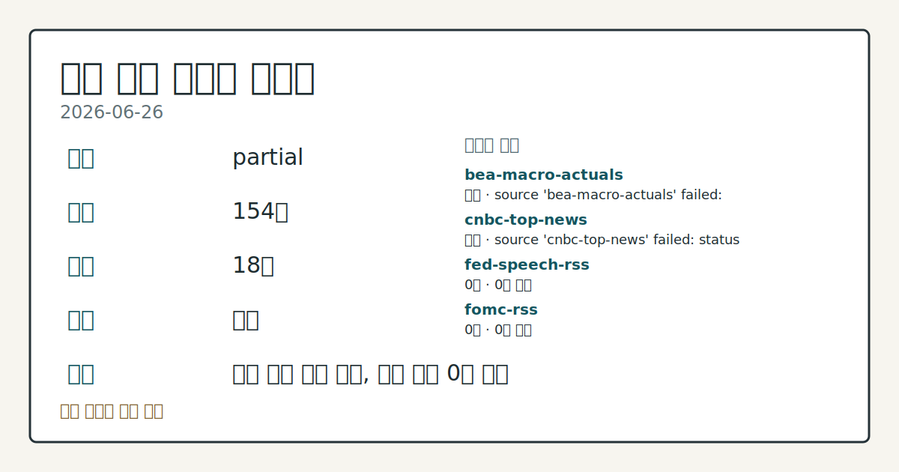
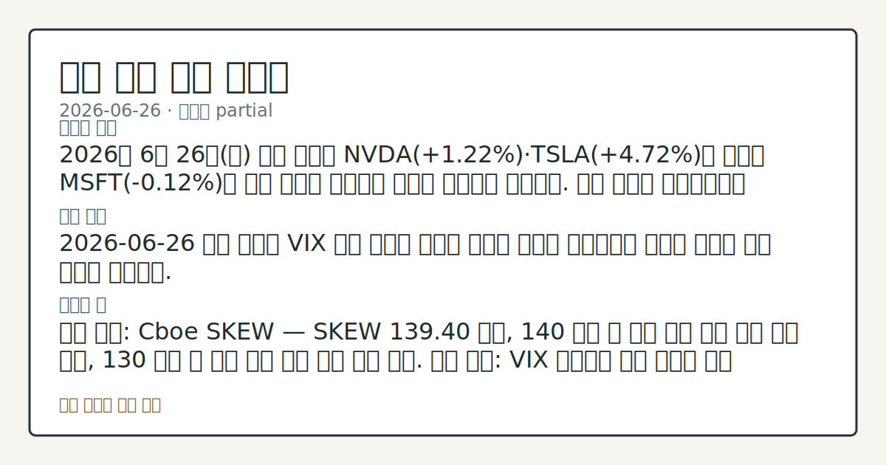
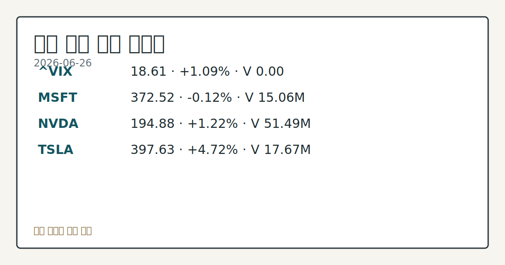

> 정보 제공용 자동 시황이며 매매 권유가 아닙니다.
# 2026-06-26 미국 증시 시황
**기준 시각**: 2026-06-26 NY · 2026-06-26T04:00Z, 2026-06-27T04:00Z)
| 종목 | 종가 | 변동 | 비고 |
|------|------|------|------|
| ^GSPC | 7,354.02 | -0.05% | -3.36% from 52w high · +7.23% YTD |
| ^IXIC | 25,297.62 | -0.24% | -6.63% from 52w high · +8.87% YTD |
| ^DJI | 51,876.11 | -0.09% | -0.24% from 52w high · +7.22% YTD |
| AAPL | 283.78 | +3.14% | -9.97% from 52w high · -7.36% MTD |
| MSFT | 372.97 | +5.71% | +5.71% from 52w low · -21.14% YTD |
**세그먼트**: 국내 증시(미발행) | [미국 증시](2026-06-26.md) | [크립토](../../../crypto/2026/06/2026-06-26.md)

*이미지: 데이터 신뢰도 · 출처: investo 자체 생성 · 생성: investo 0.1.0 · 2026-06-29 UTC*
> **내 관심 자산 영향**: 14건 확인 (기본 바스켓) — AAPL: 직접 관련 · [nasdaq-symbol-directory] AAPL listing metadata: Apple Inc. - Common Stock; AAPL: 직접 관련 · [sec-company-facts] AAPL SEC company facts: Apple Inc.; AMZN: 직접 관련 · [nasdaq-symbol-directory] AMZN listing metadata: Amazon.com, Inc. - Common Stock; AMZN: 직접 관련 · [sec-company-facts] AMZN SEC company facts: AMAZON COM INC; GOOGL: 직접 관련 · [nasdaq-symbol-directory] GOOGL listing metadata: Alphabet Inc. - Class A Common Stock 외
> **용어 가이드**: 이번 시황에서 처음 등장한 용어 — 공매도(차입매도), 풋옵션(매도권리), PPI(생산자물가)
> **오늘의 결론**: 2026년 6월 26일(금) 미국 증시 세그먼트는 당일 주가 마감 데이터가 부재한 가운데, CFTC 주간 포지션 리포트와 주요 매크로 지표 업데이트 중심으로 시황을 구성한다. 수집 근거가 제한적입니다
> **핵심 동인**: E-mini S&P 500 선물 레버리지 머니 순매도 유지 CFTC 주간 보고서에 따르면 레버리지 머니의 E-mini S&P 500 포지션은 롱 185,058계약·숏 558,526계약으로 순매도 -373,468 계약(**-18.9%** of OI)이다.
> **주의할 점**: 확인 소스: CFTC E-mini S&P 500 포지션 — 레버리지 머니 순매도 -373,468 계약 기준으로 추가 확대되면 선물 하방 압력 심화 본문 참고.
## 한눈에 보기
CFTC(상품선물거래위원회) 주간 보고서 기준 레버리지 머니의 E-mini S&P 500(미니 S&P 500 선물) 순매도 포지션 **-373,468** 계약(**-18.9%** of OI(미결약정)) — 주가지수 선물 전반 공매도 기조 관찰
CBOE(시카고옵션거래소) SKEW(꼬리 위험 지수) **139.40** — 옵션 시장에서 단기 극단적 하락 이벤트에 대한 헤지 수요가 높은 수준에서 확인
2026년 5월 UNRATE(실업률) **4.3%** 유지 · CPI(소비자물가지수) **333.979** (전월 대비 **+1.572**) — 연준 금리 경로 핵심 변수 점검 (§④ 참조)
## ⓪ 오늘의 매크로
**미 국채 수익률** — UST curve 2026-06-26: 10Y 4.38%, 2Y10Y +0.31pp
## ⓪-B 채널 기준선
| 기준선 | 값 |
|------|------|
| S&P 500 | 7,354.02 (-0.05%) |
| 나스닥 종합 | 25,297.62 (-0.24%) |
| 다우존스 | 51,876.11 (-0.09%) |
| CFTC 포지셔닝 | E-mini S&P 500 순포지션 -373468계약 (-18.86% OI), 2026-06-23 기준/2026-06-26 공개 · Nasdaq-100 mini 순포지션 -51062계약 (-19.26% OI), 2026-06-23 기준/2026-06-26 공개 · VIX futures 순포지션 -18863계약 (-5.34% OI), 2026-06-23 기준/2026-06-26 공개 · 주간 지연 |
> **크로스마켓 연결 고리**: 금리 이벤트가 할인율/달러 경로의 공통 변수로 남아 있습니다.
> **오늘의 큰 그림:** 금리와 달러 변수가 공통 변수지만, Nasdaq·Dow 섹터 변동성를 먼저 확인해야 합니다.
## ① 요약

*이미지: 시장 스냅샷 · 출처: investo 자체 생성 · 생성: investo 0.1.0 · 2026-06-29 UTC*

2026년 6월 26일 미국 증시 세그먼트는 당일 주가 마감 데이터가 부재한 가운데, CFTC 주간 포지션 리포트와 주요 매크로 지표 업데이트 중심으로 시황을 구성한다. 레버리지 머니는 E-mini S&P 500에 **-373,468** 계약(**-18.9%** of OI), Nasdaq-100 mini(나스닥100 미니 선물)에 **-51,062** 계약 규모의 순매도를 유지해 주가지수 선물 전반에 걸쳐 헤지 성향이 뚜렷하다. 반면 Gold 관리 펀드(managed money)는 **+115,395** 계약 순매수를 유지해 안전자산 선호 구도가 공존한다. CBOE SKEW **139.40**과 VVIX(변동성의 변동성 지수) **89.02**의 동반 수준은 옵션 시장에서 극단적 하락 이벤트 헤지 수요가 높음을 반영한다. 직전 주(6월 22~25일) 미국 증시는 반도체 급락, AAPL 약세와 칩메이커 강세 교차 등 혼재 흐름이 이어졌으며, 이번 주 마지막 거래일에도 포지션 데이터는 단일 방향을 결정짓지 않는다. [혼재]

## ② 전일 핵심 이슈

### E-mini S&P 500 선물 레버리지 머니 순매도 유지

[CFTC](https://www.cftc.gov/MarketReports/CommitmentsofTraders/index.htm) 주간 보고서에 따르면 레버리지 머니의 E-mini S&P 500 포지션은 롱 185,058계약·숏 558,526계약으로 순매도 **-373,468** 계약이다. Nasdaq-100 mini도 롱 42,052계약·숏 93,114계약으로 순매도 **-51,062** 계약을 유지하며, 대형 기술주 선물에서도 공매도 우세 구조가 지속된다. 직전 주 혼재 흐름 이후에도 포지션 정리 신호는 현재 확인되지 않는다.

> **그래서 의미는?** 레버리지 머니의 대규모 주가지수 선물 순매도는 헤지펀드 등 투기 대형 참여자이 단기 하방 가능성을 방어 중인 구조로 관찰되며, 미국 대형주 수급...

### 연준 이사회 현황 및 ECB 포럼 일정

[Federal Reserve(연준) 이사회](https://www.federalreserve.gov/aboutthefed/bios/board/default.htm) 공식 페이지를 통해 이사회 구성이 확인 가능하며, 2026-07-01(현지 오전 9시) 포르투갈 신트라 ECB(유럽중앙은행) 포럼에서 연준 의장의 정책 패널 토론이 예정돼 있다. 이 발언은 미국 금리 경로에 대한 최신 신호를 제공할 수 있어 대형 기술주 수급 방향과의 연결 고리가 관찰된다.

## ③ 섹터/수급 동향

### CBOE SKEW·VVIX — 꼬리 위험 헤지 수요

[CBOE SKEW](https://cdn.cboe.com/api/global/us_indices/daily_prices/SKEW_History.csv) 2026-06-26 공식 종가는 **139.40**, [VVIX](https://cdn.cboe.com/api/global/us_indices/daily_prices/VVIX_History.csv)는 **89.02**다. SKEW **139.40**은 OTM(외가격) 풋옵션 프리미엄 상승을 통해 투자자들이 극단적 하락 시나리오 헤지 비용을 높이 평가하고 있음을 나타낸다.

> **그래서 의미는?** SKEW와 VVIX 동반 상승은 단기 예상치 못한 충격에 대한 방어 수요가 높아진 상태를 옵션 시장 데이터로 관찰할 수 있다.

### CFTC 주간 포지션 — 달러·국채 공매도, 금·원유 순매수

[CFTC](https://www.cftc.gov/MarketReports/CommitmentsofTraders/index.htm) 주간 데이터 기준 주요 포지션:

- U.S. Dollar Index(달러지수): 레버리지 머니 순매도 **-5,352** 계약
- 10Y Treasury note(미국 10년물 국채 선물): 레버리지 머니 순매도 **-1,938,747** 계약
- Gold(금): 관리 펀드 순매수 **+115,395** 계약
- WTI crude oil(서부텍사스산 원유): 관리 펀드 순매수 **+82,872** 계약
- VIX(변동성 지수) 선물: 레버리지 머니 순매도 **-18,863** 계약

달러·국채 공매도와 금·원유 순매수가 동반되는 구도는 인플레이션 헤지 또는 재정 부담 우려가 포지션에 반영된 패턴으로 관찰된다.

## ④ 지표·이벤트

### FRED 핵심 매크로 지표 — DFF·CPI·UNRATE·PPIFID

[DFF(연방기금금리)](https://fred.stlouisfed.org/series/DFF): 2026-06-25 기준 **3.63%** (전일 대비 변동 없음). [CPIAUCSL(소비자물가지수)](https://fred.stlouisfed.org/series/CPIAUCSL): 2026년 5월 **333.979** (전월 332.407 대비 **+1.572** 상승). [PPIFID(생산자물가지수 최종수요)](https://fred.stlouisfed.org/series/PPIFID): 2026년 5월 **158.012** (전월 156.395 대비 **+1.617** 상승). [UNRATE(실업률)](https://fred.stlouisfed.org/series/UNRATE): 2026년 5월 **4.3%** (전월 동일).

> **그래서 의미는?** CPI와 PPI 동반 상승, 실업률 안정 조합은 인플레이션 압력 지속과 고용 견조가 공존하는 매크로 환경으로 관찰되며 연준 정책 경로에...

### BLS 고용·물가 세부 지표

[BLS(노동통계국)](https://www.bls.gov/data/) 2026년 5월 기준: 평균 시간당 임금(Average hourly earnings) **$37.53** (전월 **$37.41**), 비농업 부문 취업자수(Total nonfarm payroll employment) **159,001** 천 명(전월 158,829 천 명), 노동시장 참가율(Labor Force Participation Rate) **61.8%** (전월 동일), Core CPI(근원 소비자물가지수) **336.121** (전월 335.423). 2026년 4월 구인 건수(Job Openings) **7,618** (전월 6,887).

### 연준 주요 일정 (이번 주~7월)

[연준 공식 일정](https://www.federalreserve.gov/newsevents/calendar.htm) 기준 이번 주 및 7월 초 주요 일정:

- 2026-06-30: G.20 Finance Companies 데이터 발표
- 2026-07-01: ECB 포럼 정책 패널 토론 (신트라, 현지 오전 9시)
- 2026-07-03: 독립기념일(Independence Day) 휴장
- 2026-07-08: FOMC(연방공개시장위원회) 6월 16~17일 의사록 공개 (오후 2시)
- 2026-07-15: Beige Book(베이지북) 발표

## ⑤ 주요 종목

<!-- u50 lightweight-charts-embed: placeholders consumed by site_docs/assets/investo-chart-init.js -->

<noscript><em>인터랙티브 차트는 JavaScript가 활성화된 환경에서 표시됩니다. 위 정적 카드가 동일한 정보를 담고 있습니다.</em></noscript>

*이미지: 가격 스냅샷 · 출처: investo 자체 생성 · 생성: investo 0.1.0 · 2026-06-29 UTC*

### SEC 공시 기반 대형 기술주 재무 현황

당일 주가 마감 데이터가 제공되지 않아 SEC(미국 증권거래위원회) EDGAR 최신 공시 기반 재무지표로 현황을 확인한다.

> **그래서 의미는?** AAPL(애플), MSFT(마이크로소프트), NVDA(엔비디아), GOOGL(알파벳), AMZN(아마존닷컴), META(메타 플랫폼스...

### 실적 확인 항목
| 종목 | 사명 | 최근 순이익 (기간) | 희석 EPS(주당순이익) | 최근 공시 |
|------|------|----------------|------------|---------|
| [AAPL](https://data.sec.gov/submissions/CIK0000320193.json) | Apple Inc. | $61,110M (2025-03-29) | $4.05 | 2026-06-17 Form 4 |
| [MSFT](https://data.sec.gov/submissions/CIK0000789019.json) | Microsoft Corp | $74,599M (2025-03-31) | $9.99 | 2026-06-25 11-K |
| [NVDA](https://data.sec.gov/submissions/CIK0001045810.json) | Nvidia Corp | $18,775M (2025-04-27) | $0.76 | 2026-06-23 Form 4 |
| [GOOGL](https://data.sec.gov/submissions/CIK0001652044.json) | Alphabet Inc. | $34,540M (2025-03-31) | $2.81 | 2026-06-26 Form 144 |
| [AMZN](https://data.sec.gov/submissions/CIK0001018724.json) | Amazon.com Inc. | $65,944M (2025-03-31) | $1.59 | 2026-06-12 8-K |
| [META](https://data.sec.gov/submissions/CIK0001326801.json) | Meta Platforms | $16,644M (2025-03-31) | $6.43 | 2026-06-17 Form 4 |
| [TSLA](https://data.sec.gov/submissions/CIK0001318605.json) | Tesla Inc. | $409M (2025-03-31) | $0.12 | 2026-06-17 Form 4 |

### 체크리스트
- [GOOGL](https://data.sec.gov/submissions/CIK0001652044.json): 2026-06-26 Form 144 제출 — 내부자 주식 처분 신고 내용 확인
- [GameStop Corp.](https://www.sec.gov/Archives/edgar/data/1326380/000132638026000035/0001326380-26-000035-index.htm): 8-K (2026-06-26 제출, Item 7.01 Regulation FD Disclosure) — 공시 내용 확인
- [Outlook Therapeutics](https://www.sec.gov/Archives/edgar/data/1649989/000110465926078337/0001104659-26-078337-index.htm): 8-K (2026-06-26 제출, Item 3.01 상장 요건 미충족·상장폐지 통보) — 해당 종목 현황 확인

## ⑥ 오늘의 관전 포인트

> **관전 포인트**: 구조화 가능한 관찰 신호가 부족합니다 — 본문 §②·§④ 참조

> **데이터 상태**: 부분

수집/품질 진단

> **데이터 상태**: 부분 — 수집 154건 / 소스 18개 / 누락: 없음 · 부분 — 일부 카테고리 미수집, 본문 일부 결론 보강 필요
> **소스 카운트**: 수집 대상 25 / 성공 18 / 수집 상세는 진단 섹션에서 확인할 수 있습니다. / 수집 상세는 진단 섹션에서 확인할 수 있습니다. / 수집 상세는 진단 섹션에서 확인할 수 있습니다.
> **소스 등급 분포**: S=11 / A=7
> **상세 사유**: 일부 소스 수집 실패, 일부 소스 0건 반환
> **소스별 상태**: bea-macro-actuals 실패 (설정 미완료(미수집)), cnbc-top-news 실패 (접근 제한), fed-speech-rss 0건, fomc-rss 0건, nasdaq-stocks-news 0건, stooq-price 0건, yahoo-finance-news 0건, 정상 18개

## ⑦ 면책조항
본 시황은 일반 정보 제공을 목적으로 자동 생성된 자료이며,
특정 종목·자산에 대한 매매 권유나 투자 자문이 아닙니다.
투자 결정과 그 결과에 대한 책임은 전적으로 본인에게 있으며,
본 시황의 내용에 따라 발생한 손실에 대해 작성자는 일체의 책임을 지지 않습니다.