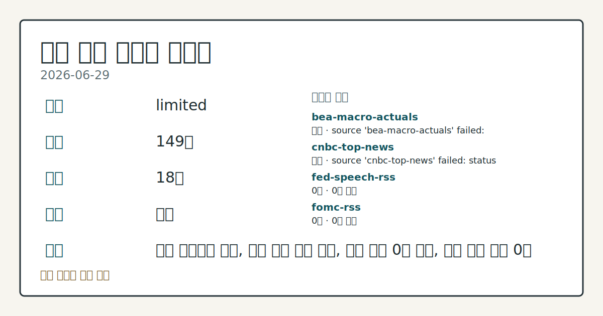
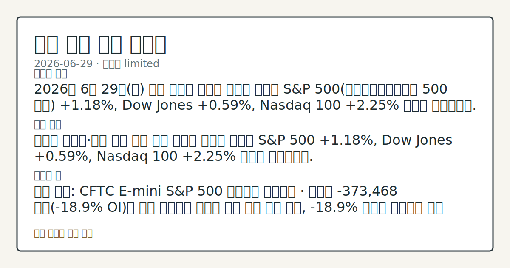

> 정보 제공용 자동 시황이며 매매 권유가 아닙니다.
# 2026-06-29 미국 증시 시황
**기준 시각**: 2026-06-29 NY · 2026-06-29T04:00Z, 2026-06-30T04:00Z)
| 종목 | 종가 | 변동 | 비고 |
|------|------|------|------|
| ^GSPC | 7,440.43 | +1.18% | -2.23% from 52w high · +8.49% YTD |
| ^IXIC | 25,820.14 | +2.07% | -4.70% from 52w high · +11.12% YTD |
| ^DJI | 52,182.74 | +0.59% | ATH 경신 · +7.85% YTD |
| AAPL | 281.74 | -0.72% | -10.62% from 52w high · -8.02% MTD |
| MSFT | 368.57 | -1.18% | +4.46% from 52w low · -22.07% YTD |
**세그먼트**: [국내 증시](../../../domestic-equity/2026/06/2026-06-29.md) | [미국 증시](2026-06-29.md) | [크립토](../../../crypto/2026/06/2026-06-29.md)

*이미지: 데이터 신뢰도 · 출처: investo 자체 생성 · 생성: investo 0.1.0 · 2026-06-29 UTC*
> **내 관심 자산 영향**: 데이터 수집 부족으로 매칭 판단 보류 — 추가 수집 후 재평가됩니다.
> **오늘의 결론**: 2026년 6월 29일(월) 미국 증시는 메가캡 기술주 주도로 S&P 500(스탠더드앤드푸어스 500 지수) **+1.18%**, Dow Jones **+0.59%**, Nasdaq 100 **+2.25%** 마감이 보고되었다. 수집 근거가 제한적입니다
> **핵심 동인**: 메가캡 기술주·선물 시장 동반 상승 나스닥 기사에 따르면 S&P 500 **+1.18%**, Dow Jones **+0.59%**, Nasdaq 100 **+2.25%** 마감이 확인되었다.
> **주의할 점**: 확인 소스: CFTC E-mini S&P 500 레버리지 포지셔닝 · 순매도 -373,468 계약(**-18.9%** OI)이 추가 확대되면 구조적 본문 참고.
## 한눈에 보기
S&P 500 **+1.18%**, Nasdaq 100 **+2.25%**, Dow Jones **+0.59%** — 메가캡 기술주 주도로 6월 마지막 주 미국 증시 강세 출발.
CFTC(상품선물거래위원회) 주간 보고서 기준 레버리지 펀드의 E-mini S&P 500 순매도 포지션 **-373,468** 계약(OI(미결제약정) 대비 **-18.9%**) 유지 — 지수 상승과 구조적 헤지 병존 확인.
**3.63%** DFF(연방기금금리 실효) 동결 속 Kevin Warsh 연준 의장의 ECB(유럽중앙은행) 포럼 발언(7월 1일)이 이번 주 금리 경로 점검의 핵심 변수로 부상.
## ⓪ 오늘의 매크로
**FOMC 일정** — 2026-07-08 — FOMC Minutes
**미 국채 수익률** — UST curve 2026-06-29: 10Y 4.38%, 2Y10Y +0.28pp
## ⓪-B 채널 기준선
| 기준선 | 값 |
|------|------|
| S&P 500 | 7,440.43 (+1.18%) |
| 나스닥 종합 | 25,820.14 (+2.07%) |
| 다우존스 | 52,182.74 (+0.59%) |
| CFTC 포지셔닝 | E-mini S&P 500 순포지션 -373468계약 (-18.86% OI), 2026-06-23 기준/2026-06-26 공개 · Nasdaq-100 mini 순포지션 -51062계약 (-19.26% OI), 2026-06-23 기준/2026-06-26 공개 · VIX futures 순포지션 -18863계약 (-5.34% OI), 2026-06-23 기준/2026-06-26 공개 · 주간 지연 |
> **크로스마켓 연결 고리**: 금리 이벤트가 할인율/달러 경로의 공통 변수로 남아 있습니다.
> **오늘의 큰 그림:** 금리와 달러 변수가 공통 변수지만, Nasdaq·Dow 섹터 변동성를 먼저 확인해야 합니다.
## ① 요약

*이미지: 시장 스냅샷 · 출처: investo 자체 생성 · 생성: investo 0.1.0 · 2026-06-29 UTC*

2026년 6월 29일 미국 증시는 메가캡 기술주 주도로 [S&P 500(스탠더드앤드푸어스 500 지수) **+1.18%**, Dow Jones **+0.59%**, Nasdaq 100 **+2.25%**](https://www.nasdaq.com/articles/stock-indexes-finish-sharply-higher-tech-soars) 마감이 보고되었다. 지난주 금요일(6월 26일) NVDA·TSLA 등 기술주 중심 강세 흐름이 이번 주 월요일에도 이어진 모습이다. DXY(달러지수)는 **-0.26%** 하락하며 주가 상승과 달러 약세가 맞물리는 리스크 온(risk-on) 흐름이 관찰되었다. 단, CFTC 주간 보고서상 레버리지 펀드의 E-mini S&P 500 선물 순매도 포지션이 여전히 OI 대비 **-18.9%** 수준을 유지해, 지수 상승과 기관 헤지 기조 사이의 괴리가 지속되는 점은 점검 항목이다. [상승 관찰]

## ② 전일 핵심 이슈

### 메가캡 기술주·선물 시장 동반 상승

[나스닥 기사](https://www.nasdaq.com/articles/stock-indexes-finish-sharply-higher-tech-soars)에 따르면 S&P 500 **+1.18%**, Dow Jones **+0.59%**, Nasdaq 100 **+2.25%** 마감이 확인되었다. September ESU26(9월물 미니 S&P 500 선물)도 **+1.20%** 상승하며 현물과 방향을 같이했다. 추가 [나스닥 기사](https://www.nasdaq.com/articles/stock-indexes-push-higher-megacap-tech-stocks-rally)는 장중에도 S&P 500 **+0.73%**, Nasdaq 100 **+1.08%** 수준에서 상승이 지속되었음을 보고해, 기술주 주도 상승이 장 전반에 걸쳐 이어졌음을 시사한다.

> **그래서 의미는?** 6월 22~26일 혼재 흐름 이후 월요일 일제 상승이 확인되며, 메가캡 기술주로의 수급 재집중 흐름이 관찰됩니다.

### 달러 약세 + WTI 상승의 교차 흐름

[달러 관련 기사](https://www.nasdaq.com/articles/dollar-retreats-stocks-rally)에 따르면 DXY가 **-0.26%** 하락했으나, WTI(서부텍사스산 원유)의 **+2%** 상승이 인플레이션 기대를 자극해 달러 약세 폭을 제한했다. 원유 상승은 연준의 금리 판단과 연동될 수 있어, §④ 매크로 지표와 함께 해석이 필요한 복합 신호다.

## ③ 섹터/수급 동향

### CFTC 주간 포지셔닝 — 지수 선물 구조적 순매도 지속

[CFTC 주간 보고서](https://www.cftc.gov/MarketReports/CommitmentsofTraders/index.htm) 기준 레버리지 펀드 및 매니지드머니의 주요 자산 포지션은 다음과 같다.

| 자산 | 순포지션 | OI 비율 |
|------|---------|---------|
| E-mini S&P 500 | -373,468 계약 | -18.9% |
| Nasdaq-100 mini | -51,062 계약 | -19.3% |
| 10Y 국채 선물 | -1,938,747 계약 | -36.8% |
| VIX(변동성지수) 선물 | -18,863 계약 | -5.3% |
| Gold(금) | +115,395 계약 | +32.8% |
| WTI 원유 | +82,872 계약 | +4.3% |
| US Dollar Index | -5,352 계약 | -9.7% |

> **그래서 의미는?** 레버리지 펀드가 지수 선물을 구조적으로 순매도하며 금·원유를 순매수하는 패턴은, 현물 지수 상승이 패시브·소매 수요 중심일 가능성을 시사하는...

### Cboe 변동성 지표 — SKEW 꼬리 리스크 경계 유지

[Cboe(시카고옵션거래소) VVIX(변동성의 변동성 지수)](https://cdn.cboe.com/api/global/us_indices/daily_prices/VVIX_History.csv) **88.71**, [SKEW(꼬리 리스크 지수)](https://cdn.cboe.com/api/global/us_indices/daily_prices/SKEW_History.csv) **139.40** 확인. SKEW **139.40**은 옵션 시장에서 하방 꼬리 리스크 헤지 수요가 평균 이상 수준임을 나타내며, 지수 상승에도 시장의 하락 방어가 지속되는 구도다.

## ④ 지표·이벤트

### 연준 기준금리 및 주요 고용·물가 지표

[FRED(세인트루이스 연방준비은행) 기준 DFF **3.63%**](https://fred.stlouisfed.org/series/DFF) — 전일(2026-06-26) 대비 변동 없이 동결. [BLS(미국 노동통계국)](https://www.bls.gov/data/) 발표 기준 2026년 5월 주요 지표:

| 지표 | 최신값 | 전월 |
|------|-------|------|
| [CPIAUCSL(소비자물가지수)](https://fred.stlouisfed.org/series/CPIAUCSL) | 333.979 (2026-05) | 332.407 |
| [PPIFID(생산자물가지수 최종수요)](https://fred.stlouisfed.org/series/PPIFID) | 158.012 (2026-05) | 156.395 |
| [UNRATE(실업률)](https://fred.stlouisfed.org/series/UNRATE) | **4.3%** (2026-05) | 4.3% |
| 시간당 평균임금 | $37.53 (2026-05) | $37.41 |
| 비농업 고용(천 명) | 159,001 (2026-05) | 158,829 |
| 구인 건수(천 건) | 7,618 (2026-04) | 6,887 |
| 노동참가율 | **61.8%** (2026-05) | 61.8% |

> **그래서 의미는?** 실업률·노동참가율 동결 속 구인 건수가 전월(6,887) 대비 7,618로 급증한 점은 노동 수요 강세 신호로, 연준의 DFF **3...

### 연준 주요 일정

[연준 공식 캘린더](https://www.federalreserve.gov/newsevents/calendar.htm) 기준:

- **2026-07-01**: Kevin Warsh(케빈 워시) 연준 의장, 포르투갈 신트라 ECB 포럼 패널 발언 — 동부 시간 오전 9시.
- **2026-07-08**: FOMC(연방공개시장위원회) 6월 16~17일 회의 의사록 공개 — 동부 시간 오후 2시.

## ⑤ 주요 종목

<!-- u50 lightweight-charts-embed: placeholders consumed by site_docs/assets/investo-chart-init.js -->

<noscript><em>인터랙티브 차트는 JavaScript가 활성화된 환경에서 표시됩니다. 위 정적 카드가 동일한 정보를 담고 있습니다.</em></noscript>

### 실적 발표

- **AVAV**(에어로바이런먼트): [Q4 EPS 추정치 **+20.10%**, 매출 추정치 **+13.94%** 상회](https://www.nasdaq.com/articles/aerovironment-avav-q4-earnings-and-revenues-surpass-estimates) — 2026년 4월 마감 분기.
- **CNXC**(콘센트릭스): [Q2 EPS **-0.19%**, 매출 **-0.43%** 미달](https://www.nasdaq.com/articles/concentrix-corporation-cnxc-misses-q2-earnings-and-revenue-estimates) — 2026년 5월 마감 분기.

> **그래서 의미는?** AVAV(에어로바이런먼트)의 실적 서프라이즈와 CNXC(콘센트릭스)의 미달 대비는 방산·IT서비스 섹터 내 개별 모멘텀 차별화를 확인하는 관찰...

### 확인 항목

- **MLM**(마틴 마리에타 머티리얼스): [SEC 8-K 공시](https://www.sec.gov/Archives/edgar/data/916076/000095015726000770/0000950157-26-000770-index.htm) — 중요 계약 체결(Item 1.01), 비등록 증권 발행(Item 3.02) 포함.
- **DLR**(디지털 리얼티 트러스트): [SEC 8-K 공시](https://www.sec.gov/Archives/edgar/data/1494877/000119312526288761/0001193125-26-288761-index.htm) — Regulation FD 공시(Item 7.01) 포함.
- **CAG**(코나그라 브랜드): [배당수익률이 연환산 **$1.4** 기준 10%를 상회](https://www.nasdaq.com/articles/conagra-brands-cag-shares-cross-10-yield-mark) — 주가 **$13** 수준 형성.

## ⑥ 오늘의 관전 포인트

> **관전 포인트**: 구조화 가능한 관찰 신호가 부족합니다 — 본문 §②·§④ 참조

> **데이터 상태**: 제한

수집/품질 진단

> **데이터 상태**: 제한 — 수집 149건 / 소스 18개 / 누락: 가격 · 제한 — 핵심 가격 소스 0건/실패/stale, 본문 결론 신뢰도 낮음
> **소스 카운트**: 수집 대상 25 / 성공 18 / 수집 상세는 진단 섹션에서 확인할 수 있습니다. / 수집 상세는 진단 섹션에서 확인할 수 있습니다. / 수집 상세는 진단 섹션에서 확인할 수 있습니다.
> **소스 등급 분포**: S=10 / A=8
> **상세 사유**: 가격 카테고리 누락, 일부 소스 수집 실패, 일부 소스 0건 반환, 핵심 가격 소스 0건
> **소스별 상태**: bea-macro-actuals 실패 (설정 미완료(미수집)), cnbc-top-news 실패 (접근 제한), fed-speech-rss 0건, fomc-rss 0건, sec-newsroom-rss 0건, stooq-price 0건, yfinance-price 0건, 정상 18개

## ⑦ 면책조항
본 시황은 일반 정보 제공을 목적으로 자동 생성된 자료이며,
특정 종목·자산에 대한 매매 권유나 투자 자문이 아닙니다.
투자 결정과 그 결과에 대한 책임은 전적으로 본인에게 있으며,
본 시황의 내용에 따라 발생한 손실에 대해 작성자는 일체의 책임을 지지 않습니다.