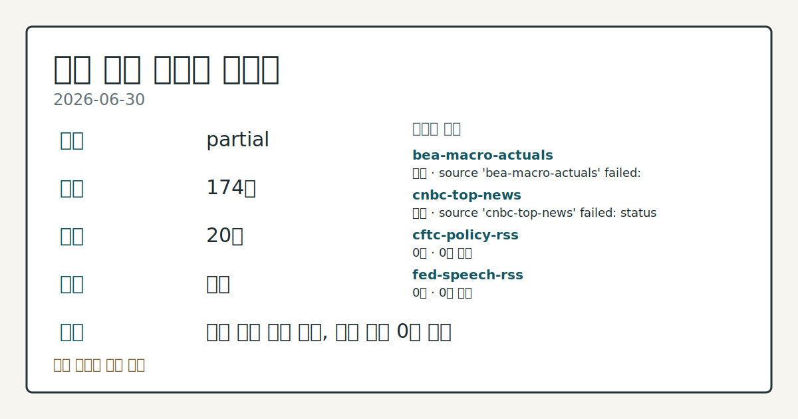
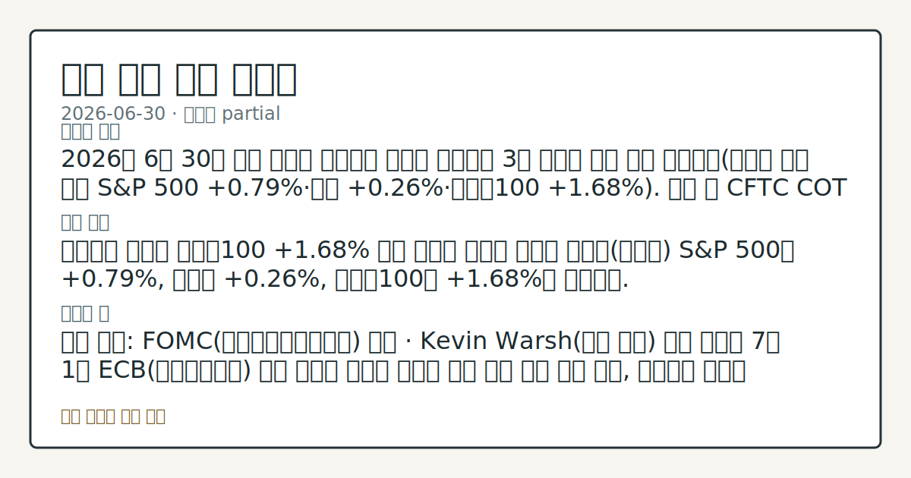
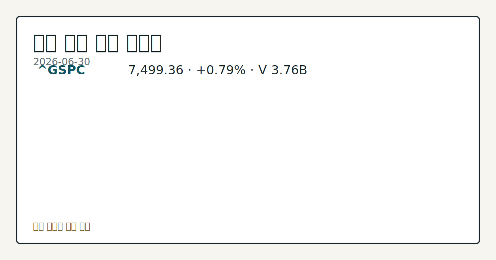

> 정보 제공용 자동 시황이며 매매 권유가 아닙니다.
# 2026-06-30 미국 증시 시황
**기준 시각**: 2026-06-30 NY · 2026-06-30T04:00Z, 2026-07-01T04:00Z)
| 종목 | 종가 | 변동 | 비고 |
|------|------|------|------|
| ^GSPC | 7,499.36 | +0.79% | -1.45% from 52w high · +9.34% YTD |
| ^IXIC | 26,213.72 | +1.52% | -3.25% from 52w high · +12.82% YTD |
| ^DJI | 52,319.20 | +0.26% | ATH 경신 · +8.14% YTD |
| AAPL | 289.36 | +2.70% | -8.20% from 52w high · +6.77% YTD |
| MSFT | 373.02 | +1.21% | +5.72% from 52w low · -21.13% YTD |
**세그먼트**: [국내 증시](../../../domestic-equity/2026/06/2026-06-30.md) | [미국 증시](2026-06-30.md) | 크립토(미발행)

*이미지: 데이터 신뢰도 · 출처: investo 자체 생성 · 생성: investo 0.1.0 · 2026-06-30 UTC*
> **내 관심 자산 영향**: 14건 확인 (기본 바스켓) — AAPL: 직접 관련 · [nasdaq-symbol-directory] AAPL listing metadata: Apple Inc. - Common Stock; AAPL: 직접 관련 · [sec-company-facts] AAPL SEC company facts: Apple Inc.; AMZN: 직접 관련 · [nasdaq-symbol-directory] AMZN listing metadata: Amazon.com, Inc. - Common Stock; AMZN: 직접 관련 · [sec-company-facts] AMZN SEC company facts: AMAZON COM INC; GOOGL: 직접 관련 · [nasdaq-symbol-directory] GOOGL listing metadata: Alphabet Inc. - Class A Common Stock 외
> **용어 가이드**: 이번 시황에서 처음 등장한 용어 — EPS(주당순이익), 시가총액(시장가치), 숏커버링(공매도상환)
> **오늘의 결론**: 2026년 6월 30일 미국 증시는 칩메이커 강세를 중심으로 3대 지수가 동반 상승 마감했다(나스닥 기사 기준 S&P 500 **+0.79%**·다우 **+0.26%**·나스닥100 **+1.68%**). 같은 날 CFTC COT 자료는 10Y 국채·E-mini S&P 500·나스닥100 미니 선물 모두에서 레버리지드머니의 순매도 포지션이 두드러져, 가격 상승과 기관 포지셔닝 사이의 괴리가 관찰된다. 수집 근거가 제한적입니다
> **핵심 동인**: 칩메이커 강세에 나스닥100 **+1.68%** 마감 나스닥 기사에 따르면 화요일(목표일) S&P 500은 **+0.79%**, 다우는 **+0.26%**, 나스닥100은 **+1.68%**로 마감했다.
> **주의할 점**: 확인 소스: FOMC(연방공개시장위원회) 일정 · Kevin Warsh(케빈 워시) 연준 의장의 7월 1일 ECB(유럽중앙은행) 포럼 발언이 매파적 본문 참고.
## 한눈에 보기
미국 3대 지수 동반 상승 마감 — S&P 500(스탠더드앤드푸어스 500지수) **+0.79%**, 다우존스산업평균지수(다우) **+0.26%**, 나스닥100(나스닥 100대 기술주 지수) **+1.68%**로 칩메이커 강세가 지수를 견인.
CFTC(미국 상품선물거래위원회) COT(투자자별 포지션 보고서) 기준 10Y 국채 레버리지드머니(차입 기반 투자자) 순포지션이 -1,938,747계약(미결제약정(OI) 대비 **-36.8%**)으로 약세 쏠림이 심화.
DFF(연방기금실효금리) **3.63%**·VVIX(VIX 변동성지수의 변동성 지표) 86.87 — 본문 §④ 참조.
## ⓪ 오늘의 매크로
**미 국채 수익률** — UST curve 2026-06-30: 10Y 4.44%, 2Y10Y +0.30pp
## ⓪-B 채널 기준선
| 기준선 | 값 |
|------|------|
| S&P 500 | 7,499.36 (+0.79%) |
| 나스닥 종합 | 26,213.72 (+1.52%) |
| 다우존스 | 52,319.20 (+0.26%) |
| CFTC 포지셔닝 | E-mini S&P 500 순포지션 -373468계약 (-18.86% OI), 2026-06-23 기준/2026-06-26 공개 · Nasdaq-100 mini 순포지션 -51062계약 (-19.26% OI), 2026-06-23 기준/2026-06-26 공개 · VIX futures 순포지션 -18863계약 (-5.34% OI), 2026-06-23 기준/2026-06-26 공개 · 주간 지연 |
> **크로스마켓 연결 고리**: 금리 이벤트가 할인율/달러 경로의 공통 변수로 남아 있습니다.
> **오늘의 큰 그림:** 이 세그먼트의 공통 신호는 제한적입니다. 본문 수급·지표 항목을 먼저 확인하세요.
## ① 요약

*이미지: 시장 스냅샷 · 출처: investo 자체 생성 · 생성: investo 0.1.0 · 2026-06-30 UTC*

2026년 6월 30일 미국 증시는 칩메이커 강세를 중심으로 3대 지수가 동반 상승 마감했다(나스닥 기사 기준 S&P 500 **+0.79%**·다우 **+0.26%**·나스닥100 **+1.68%**). 같은 날 CFTC COT 자료는 10Y 국채·E-mini S&P 500·나스닥100 미니 선물 모두에서 레버리지드머니의 순매도 포지션이 두드러져, 가격 상승과 기관 포지셔닝 사이의 괴리가 관찰된다. 5월 CPI(소비자물가지수)는 전월 대비 상승했고 실업률은 **4.3%**로 보합을 유지했다. 어제(2026-06-29) 메가캡 기술주 주도의 상승 흐름이 오늘은 칩메이커 중심으로 이어졌으나, 선물시장 포지셔닝은 여전히 방어적이다. [혼재]

## ② 전일 핵심 이슈

### 칩메이커 강세에 나스닥100 **+1.68%** 마감

[나스닥 기사](https://www.nasdaq.com/articles/stocks-settle-higher-chipmakers-rally)에 따르면 화요일(목표일) S&P 500은 **+0.79%**, 다우는 **+0.26%**, 나스닥100은 **+1.68%**로 마감했다. 9월물 E-mini S&P 선물(ESU26, 미니 S&P 500 선물)도 **+0.63%** 상승해 마감 후에도 매수 우위가 이어졌다. 어제 메가캡 기술주가 주도한 상승이 오늘은 칩메이커 중심으로 연장된 흐름이다.

> **그래서 의미는?** 어제 기술주 강세가 오늘은 반도체 업종으로 옮겨가며 상승 흐름이 이어졌습니다.

### 월말·분기말 수요 속 달러 강세

[달러 상승 기사](https://www.nasdaq.com/articles/dollar-rises-month-and-quarter-end-demand)는 화요일 DXY(달러지수)가 **+0.07%** 올랐다고 전했고, 이후 [갱신 기사](https://www.nasdaq.com/articles/dollar-climbs-month-and-quarter-end-demand)는 같은 날 상승폭이 **+0.21%**까지 확대됐다고 전했다. 두 기사 모두 분기 마지막 거래일 수급과 엔화의 39년 만의 저점이 달러 강세 요인이라고 설명했다.

## ③ 섹터/수급 동향

[CFTC COT 보고서](https://www.cftc.gov/MarketReports/CommitmentsofTraders/index.htm)에 따르면 10Y 국채 레버리지드머니 순포지션은 -1,938,747계약(롱 328,812·숏 2,267,559, OI 대비 **-36.8%**)으로 가장 큰 약세 쏠림을 보였다. E-mini S&P 500은 순포지션 -373,468계약(OI 대비 **-18.9%**), 나스닥100 미니는 -51,062계약(OI 대비 **-19.3%**)으로 모두 순매도였다. 같은 보고서에서 달러인덱스 선물은 -5,352계약(OI 대비 **-9.7%**), VIX(변동성지수) 선물은 -18,863계약(OI 대비 **-5.3%**)으로 집계됐다. 해당 수치는 주간 단위 보고서로 일중 흐름이 아니라는 점에 유의해야 한다.

> **그래서 의미는?** 지수 가격은 올랐지만 기관 선물 포지션은 여전히 순매도 쪽에 쏠려 있습니다.

## ④ 지표·이벤트

### 5월 물가지표 추가 상승, 고용은 보합

[FRED(세인트루이스 연은 경제데이터)](https://fred.stlouisfed.org/series/CPIAUCSL)에 따르면 CPIAUCSL(소비자물가지수)은 333.979로 전월(332.407) 대비 상승했고, [PPIFID(생산자물가지수, 최종수요 기준)](https://fred.stlouisfed.org/series/PPIFID)는 158.012로 전월(156.395) 대비 상승했다. [UNRATE(실업률)](https://fred.stlouisfed.org/series/UNRATE)는 **4.3%**로 전월과 동일했고, [DFF](https://fred.stlouisfed.org/series/DFF)는 **3.63%**로 변동이 없었다. BLS(미국 노동통계국) 발표 기준으로는 핵심 CPI 336.121(전월 335.423), PPI 최종수요지수 157.659(전월 156.011, FRED PPIFID와는 별도 계열), 구인건수(Job Openings) 7,594천 건(전월 7,585천 건), 경제활동참가율 **61.8%**(전월 동일), 시간당평균임금 **$37.53**(전월 **$37.41**), 비농업부문 고용 159,001천 명(전월 158,829천 명)으로 집계됐다.

> **그래서 의미는?** 물가는 더 올랐고 고용 지표는 큰 변화 없이 안정적인 흐름을 유지했습니다.

### VVIX 86.87 마감

[Cboe](https://cdn.cboe.com/api/global/us_indices/daily_prices/VVIX_History.csv) 기준 VVIX(VIX 변동성지수의 변동성 지표)는 86.87로 마감했다. 이는 일중 스냅샷이 아닌 공식 종가 기준 수치다.

## ⑤ 주요 종목

<!-- u50 lightweight-charts-embed: placeholders consumed by site_docs/assets/investo-chart-init.js -->

<noscript><em>인터랙티브 차트는 JavaScript가 활성화된 환경에서 표시됩니다. 위 정적 카드가 동일한 정보를 담고 있습니다.</em></noscript>

*이미지: 가격 스냅샷 · 출처: investo 자체 생성 · 생성: investo 0.1.0 · 2026-06-30 UTC*

### 워치리스트 매치 — 가격 데이터 미제공

[나스닥 상장 디렉터리](https://www.nasdaqtrader.com/dynamic/SymDir/nasdaqlisted.txt)에서 AAPL(애플)·AMZN(아마존)·GOOGL(알파벳)이 워치리스트와 매치됐으며, SEC(미국 증권거래위원회) 기업 공시 자료에서도 AAPL·AMZN 항목이 확인됐다. 같은 디렉터리에서 META(메타 플랫폼스)·MSFT(마이크로소프트)·NVDA(엔비디아)·TSLA(테슬라)도 상장 정보가 갱신됐으나, 이번 라우팅에는 해당 종목들의 가격·등락률 데이터는 포함되지 않았다.

> **그래서 의미는?** AAPL·AMZN·GOOGL 등 주요 기술주는 상장 정보만 확인됐고 오늘 가격 변동은 별도 확인이 필요합니다.

### 실적 발표 체크리스트

[NKE(나이키)](https://www.nasdaq.com/market-activity/stocks/nke/earnings)는 장 마감 후 실적 발표 예정으로 EPS 전망치는 **$0.11**(전년 동기 **$0.14**), 시가총액은 **$61,427,194,129**다. [STZ(컨스텔레이션 브랜즈)](https://www.nasdaq.com/market-activity/stocks/stz/earnings)도 장 마감 후 발표 예정이며 EPS 전망치 **$3.22**(전년 동기 **$3.22**), 시가총액 **$24,049,237,901**다.

### 시장 대비 종목별 등락 체크리스트

[CGC(캐노피 그로스)](https://www.nasdaq.com/articles/canopy-growth-corporation-cgc-stock-sinks-market-gains-heres-why)는 **$0.95**로 마감해 전일 대비 **-4.45%**, [D(도미니언 에너지)](https://www.nasdaq.com/articles/dominion-energy-d-stock-sinks-market-gains-what-you-should-know)는 **$68.29**로 **-1.29%**를 기록했다. 반면 [RTX](https://www.nasdaq.com/articles/rtx-rtx-outperforms-broader-market-what-you-need-know)는 **$189.73**로 **+1.28%**, [Star Bulk Carriers(SBLK)](https://www.nasdaq.com/articles/star-bulk-carriers-sblk-rises-higher-market-key-facts-0)는 **$24.97**로 **+1.34%**였다. [Arch Capital Group(ACGL)](https://www.nasdaq.com/articles/arch-capital-group-acgl-stock-drops-despite-market-gains-important-facts-note)은 **$97.06**로 **-1.02%**를 나타냈다.

## ⑥ 오늘의 관전 포인트

> **관전 포인트**: 구조화 가능한 관찰 신호가 부족합니다 — 본문 §②·§④ 참조

> **데이터 상태**: 부분

수집/품질 진단

> **데이터 상태**: 부분 — 수집 174건 / 소스 20개 / 누락: 없음 · 부분 — 일부 카테고리 미수집, 본문 일부 결론 보강 필요
> **소스 카운트**: 수집 대상 25 / 성공 20 / 수집 상세는 진단 섹션에서 확인할 수 있습니다. / 수집 상세는 진단 섹션에서 확인할 수 있습니다. / 수집 상세는 진단 섹션에서 확인할 수 있습니다.
> **소스 등급 분포**: S=11 / A=9
> **상세 사유**: 일부 소스 수집 실패, 일부 소스 0건 반환
> **소스별 상태**: bea-macro-actuals 실패 (설정 미완료(미수집)), cnbc-top-news 실패 (접근 제한), cftc-policy-rss 0건, fed-speech-rss 0건, stooq-price 0건, 정상 20개

## ⑦ 면책조항
본 시황은 일반 정보 제공을 목적으로 자동 생성된 자료이며,
특정 종목·자산에 대한 매매 권유나 투자 자문이 아닙니다.
투자 결정과 그 결과에 대한 책임은 전적으로 본인에게 있으며,
본 시황의 내용에 따라 발생한 손실에 대해 작성자는 일체의 책임을 지지 않습니다.