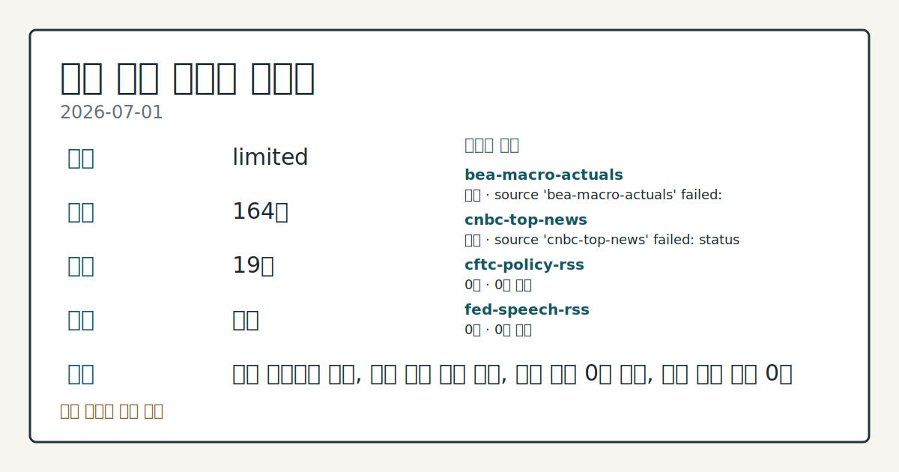
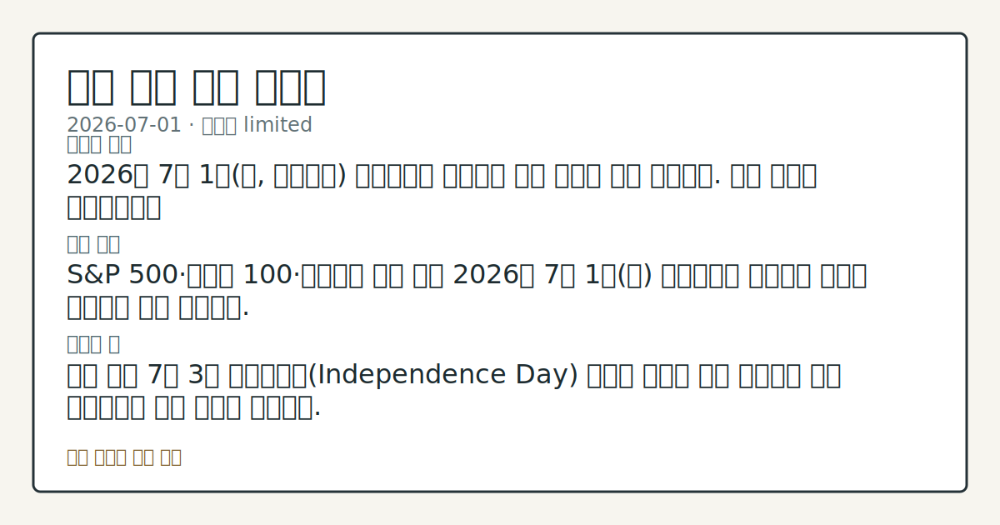

> 정보 제공용 자동 시황이며 매매 권유가 아닙니다.
# 2026-07-01 미국 증시 시황
**기준 시각**: 2026-07-01 NY · 2026-07-01T04:00Z, 2026-07-02T04:00Z)
| 종목 | 종가 | 변동 | 비고 |
|------|------|------|------|
| ^GSPC | 7,483.23 | -0.22% | -1.66% from 52w high · +9.11% YTD |
| ^IXIC | 26,040.03 | -0.66% | -3.89% from 52w high · +12.07% YTD |
| ^DJI | 52,305.24 | -0.03% | -0.03% from 52w high · +8.11% YTD |
| AAPL | 294.38 | +1.73% | -6.61% from 52w high · +8.62% YTD |
| MSFT | 384.28 | +3.02% | +8.91% from 52w low · -18.75% YTD |
**세그먼트**: [국내 증시](../../../domestic-equity/2026/07/2026-07-01.md) | [미국 증시](2026-07-01.md) | [크립토](../../../crypto/2026/07/2026-07-01.md)

*이미지: 데이터 신뢰도 · 출처: investo 자체 생성 · 생성: investo 0.1.0 · 2026-07-02 UTC*
> **내 관심 자산 영향**: 데이터 수집 부족으로 매칭 판단 보류 — 추가 수집 후 재평가됩니다.
> **오늘의 결론**: 2026년 7월 1일(수, 현지시간) 뉴욕증시는 칩메이커 약세 여파로 혼조 마감했다. 수집 근거가 제한적입니다
> **핵심 동인**: S&P 500·나스닥 100·다우존스 혼조 마감 2026년 7월 1일(수) 뉴욕증시는 칩메이커 약세를 중심으로 혼조 마감했다.
> **주의할 점**: 이번 주는 7월 3일 독립기념일(Independence Day) 휴장이 예정돼 있어 거래일이 하루 단축된다는 점도 참고할 부분이다.
## 한눈에 보기
미국 3대 지수 혼조 마감, 나스닥 100(IUXX)이 **-1.54%**로 낙폭을 주도했고 다우존스는 **-0.03%**로 보합권에 머물렀다.
5월 CPI(소비자물가지수)는 333.979로 전월(332.407) 대비 상승 흐름이 이어졌고, 근원 CPI도 336.121을 기록했다.
CFTC 나스닥100 미니 레버리지드머니(레버리지 활용 투기적 자금) 순매도가 미결제약정 대비 **-19.3%**로 집계 — 본문 §③·§⑥ 참조.
## ⓪ 오늘의 매크로
**미 국채 수익률** — UST curve 2026-07-01: 10Y 4.48%, 2Y10Y +0.31pp
## ⓪-B 채널 기준선
| 기준선 | 값 |
|------|------|
| S&P 500 | 7,483.23 (-0.22%) |
| 나스닥 종합 | 26,040.03 (-0.66%) |
| 다우존스 | 52,305.24 (-0.03%) |
| CFTC 포지셔닝 | E-mini S&P 500 순포지션 -373468계약 (-18.86% OI), 2026-06-23 기준/2026-06-26 공개 · Nasdaq-100 mini 순포지션 -51062계약 (-19.26% OI), 2026-06-23 기준/2026-06-26 공개 · VIX futures 순포지션 -18863계약 (-5.34% OI), 2026-06-23 기준/2026-06-26 공개 · 주간 지연 |
> **크로스마켓 연결 고리**: 금리 이벤트가 할인율/달러 경로의 공통 변수로 남아 있습니다.
> **오늘의 큰 그림:** 금리와 달러 변수가 공통 변수지만, Nasdaq·Dow 섹터 변동성를 먼저 확인해야 합니다.
## ① 요약

*이미지: 시장 스냅샷 · 출처: investo 자체 생성 · 생성: investo 0.1.0 · 2026-07-02 UTC*

2026년 7월 1일 뉴욕증시는 칩메이커 약세 여파로 혼조 마감했다. S&P 500(스탠더드앤드푸어스 500 지수)은 **-0.22%**, 다우존스 산업평균은 **-0.03%**로 사실상 보합, 나스닥 100은 **-1.54%**로 낙폭이 두드러졌다([Nasdaq](https://www.nasdaq.com/articles/weakness-chipmakers-drags-stock-indexes-lower)). 같은 날 EIA(에너지정보청)·CFTC(상품선물거래위원회) 주간 데이터와 5월 CPI·PPI 등 물가·고용 지표가 함께 확인되며 장중 방향이 여러 차례 뒤바뀌는 모습을 보였다. [변동성 확대]

## ② 전일 핵심 이슈

### S&P 500·나스닥 100·다우존스 혼조 마감

2026년 7월 1일 뉴욕증시는 칩메이커 약세를 중심으로 혼조 마감했다. S&P 500은 **-0.22%**, 다우존스 산업평균은 **-0.03%**로 사실상 보합, 나스닥 100은 **-1.54%**로 낙폭이 두드러졌다([Nasdaq](https://www.nasdaq.com/articles/weakness-chipmakers-drags-stock-indexes-lower)). 장중에는 방향이 여러 차례 바뀌었는데, 이른 시점 집계에서는 S&P 500 **-0.08%**·다우존스 **+0.24%**·나스닥 100 **-0.97%**로 다우존스가 상승권이었다가([Nasdaq](https://www.nasdaq.com/articles/stocks-mixed-chipmaker-weakness-and-easing-us-price-pressures)), 이후 갱신된 기사에서는 S&P 500 **-0.47%**·다우존스 **-0.22%**·나스닥 100 **-1.09%**로 낙폭이 확대되는 흐름을 보였다([Nasdaq](https://www.nasdaq.com/articles/stocks-fall-weakness-chipmakers-and-ai-stocks)). 어제(2026-06-30)는 칩메이커 강세를 동력으로 3대 지수가 동반 상승 마감했던 것과 달리, 오늘은 같은 칩메이커 섹터가 약세로 전환되며 지수 흐름이 반대 방향으로 갈렸다 — CFTC COT(투자자별 포지션 보고서) 상 나스닥100 미니 레버리지드머니 포지션이 순매도 **-19.3%**(미결제약정 대비)를 유지 중이라는 수급 배경도 함께 확인된다. September E-mini S&P futures(ESU26, 미니 S&P 500 9월물 선물)는 **-0.21%**로 다음 세션에 대한 조심스러운 톤을 시사했다.

> **그래서 의미는?** 어제의 상승 동력이던 칩메이커가 하루 만에 약세로 돌아서며 기술주 중심 변동성이 커졌다는 뜻입니다.

## ③ 섹터/수급 동향

### EIA(에너지정보청) 주간 원유·정제 동향

EIA 주간 석유 현황 보고서(2026-06-26 기준, 당일 실시간 데이터 아님)에 따르면 미국의 SPR(전략비축유) 제외 상업원유 수입은 5279 MBBL/D(1일당 천 배럴), 상업원유 재고는 408359 MBBL, 증류연료유 재고는 108599 MBBL, 정제가동률은 **96.6%**, 원유 현장생산량은 13810 MBBL/D, 총 휘발유 재고는 213966 MBBL로 각각 집계됐다([EIA](https://www.eia.gov/petroleum/supply/weekly/)).

> **그래서 의미는?** 정제가동률이 높은 수준을 유지하고 있어 여름철 에너지 공급 여력을 가늠하는 참고 지표로 볼 수 있습니다.

### CFTC COT 동향

CFTC 주간 COT 보고서 기준(주간 집계로 당일 실시간 흐름과는 다름) 레버리지드머니는 10Y 국채선물에서 순매도 -1,938,747계약(OI(미결제약정) 대비 **-36.8%**), E-mini(소형 지수선물) S&P 500에서 순매도 -373,468계약(**-18.9%**), 나스닥100 미니에서 순매도 -51,062계약(**-19.3%**), 달러인덱스 선물에서 순매도 -5,352계약(**-9.7%**), VIX(변동성지수) 선물에서 순매도 -18,863계약(**-5.3%**)을 각각 기록했다. 반면 매니지드머니(자산운용사 계열 자금)는 금 선물에서 순매수 +115,395계약(**+32.8%**), WTI(서부텍사스산원유) 선물에서 순매수 +82,872계약(**+4.3%**)을 기록했다([CFTC](https://www.cftc.gov/MarketReports/CommitmentsofTraders/index.htm)).

## ④ 지표·이벤트

### 물가·고용 지표 (FRED · BLS)

FRED(세인트루이스 연은 경제데이터) 기준 DFF(연방기금금리)는 **3.63%**로 전일 대비 보합을 유지했다([FRED DFF](https://fred.stlouisfed.org/series/DFF)). CPIAUCSL(소비자물가지수·전체도시, 5월 기준)은 333.979로 전월 332.407 대비 상승했으며([FRED CPIAUCSL](https://fred.stlouisfed.org/series/CPIAUCSL)), BLS(미국 노동통계국) 소비자물가지수 실측치도 동일하게 333.979(전월 332.407)로 확인됐다([BLS](https://www.bls.gov/data/)). 근원 CPI는 336.121로 전월 335.423에서 상승했다. UNRATE(실업률)는 **4.3%**로 전월과 동일했고([FRED UNRATE](https://fred.stlouisfed.org/series/UNRATE)), BLS 실업률 실측치 역시 **4.3%**로 일치했다. PPIFID(생산자물가지수·최종수요, FRED 시리즈)는 158.012로 전월 156.395 대비 상승했으며([FRED PPIFID](https://fred.stlouisfed.org/series/PPIFID)), BLS의 생산자물가지수(최종수요) 별도 실측치는 157.659(전월 156.011)로 집계됐다([BLS](https://www.bls.gov/data/)). 이 외 BLS 지표로 평균시간당임금은 **$37.53**(전월 **$37.41**), 구인건수는 7594천 건, 노동참가율은 **61.8%**, 비농업 고용은 159001천 명으로 각각 집계됐다.

> **그래서 의미는?** 물가·고용 지표가 동시에 소폭 상승해 금리 인하 기대와 물가 부담이 팽팽히 맞서는 국면임을 시사합니다.

### 변동성 지표 (Cboe)

Cboe(시카고옵션거래소) 기준 SKEW(테일리스크지수)는 154.82, VVIX(변동성의 변동성지수)는 **89.04**로 각각 발표됐다([SKEW](https://cdn.cboe.com/api/global/us_indices/daily_prices/SKEW_History.csv), [VVIX](https://cdn.cboe.com/api/global/us_indices/daily_prices/VVIX_History.csv)).

## ⑤ 주요 종목

<!-- u50 lightweight-charts-embed: placeholders consumed by site_docs/assets/investo-chart-init.js -->

<noscript><em>인터랙티브 차트는 JavaScript가 활성화된 환경에서 표시됩니다. 위 정적 카드가 동일한 정보를 담고 있습니다.</em></noscript>

### 실적 발표 예정

- FDS(FactSet Research Systems Inc.) — 장 시작 전 실적 발표 예정, EPS 전망치 **$4.44**([Nasdaq](https://www.nasdaq.com/market-activity/stocks/fds/earnings))
- FER(Ferrovial N.V.) — 발표 시점 미기재([Nasdaq](https://www.nasdaq.com/market-activity/stocks/fer/earnings))
- FIZZ(National Beverage Corp.) — 발표 시점 미기재([Nasdaq](https://www.nasdaq.com/market-activity/stocks/fizz/earnings))
- GBX(Greenbrier Companies, Inc.) — 장 마감 후 실적 발표 예정, EPS 전망치 **$0.57**([Nasdaq](https://www.nasdaq.com/market-activity/stocks/gbx/earnings))
- GIS(General Mills, Inc.) — 장 시작 전 실적 발표 예정, EPS 전망치 **$0.82**([Nasdaq](https://www.nasdaq.com/market-activity/stocks/gis/earnings))
- LOT(Lotus Technology Inc.) — 발표 시점 미기재, EPS 전망치 (**$0.18**) 손실 전망([Nasdaq](https://www.nasdaq.com/market-activity/stocks/lot/earnings))
- MSM(MSC Industrial Direct Company, Inc.) — 장 시작 전 실적 발표 예정, EPS 전망치 **$1.28**([Nasdaq](https://www.nasdaq.com/market-activity/stocks/msm/earnings))
- UNF(Unifirst Corporation) — 장 시작 전 실적 발표 예정, EPS 전망치 **$1.93**([Nasdaq](https://www.nasdaq.com/market-activity/stocks/unf/earnings))

> **그래서 의미는?** 실적 발표가 몰린 종목들의 시장 반응이 이번 주 업종별 온도차를 가늠하는 참고가 됩니다.

### 확인 항목

- ATI — 직전 세션 종가 **$192.17**, **2.5%** 낙폭 기록([Nasdaq](https://www.nasdaq.com/articles/ati-ati-registers-bigger-fall-market-important-facts-note))
- AMT(American Tower) — 직전 세션 종가 **$166.08**, **+1.53%**([Nasdaq](https://www.nasdaq.com/articles/american-tower-amt-ascends-while-market-falls-some-facts-note))
- SHEL(Shell) — 직전 세션 종가 **$76.57**, **-1.25%**([Nasdaq](https://www.nasdaq.com/articles/heres-why-shell-shel-fell-more-broader-market))
- TROW(T. Rowe Price) — 직전 세션 종가 **$116.11**, **+2.13%**([Nasdaq](https://www.nasdaq.com/articles/t-rowe-price-trow-ascends-while-market-falls-some-facts-note))

## ⑥ 오늘의 관전 포인트

#### 관찰 신호: 베이지북(07-15)·FOMC 기자회견(07-29) 일…

- 출처: FOMC(연방공개시장위원회) 캘린더 — FOMC 의사록(07-08)
- 현재: 베이지북(07-15)
- 확인 조건: 상방 FOMC 기자회견(07-29) 일정(Fed 캘린더) — 구체적 상방; 하방 임계치는 수집 근거 제한으로 판단 보류
- 신뢰도: 보통
- 관심 영향: 향후 정책 커뮤니케이션 일정 점검.

#### 관찰 신호: SKEW(테일리스크지수) 154.82·VVIX **89…

- 출처: Cboe
- 현재: SKEW(테일리스크지수) 154.82
- 확인 조건: 상방 VVIX가 추가로 상승하면 테일리스크 확대 관찰; 하방 되돌림이 나오면 변동성 완화로 해석
- 신뢰도: 보통
- 관심 영향: 변동성 확대 여부 점검.

> **데이터 상태**: 제한

수집/품질 진단

> **데이터 상태**: 제한 — 수집 164건 / 소스 19개 / 누락: 가격 · 제한 — 핵심 가격 소스 0건/실패/stale, 본문 결론 신뢰도 낮음
> **소스 카운트**: 수집 대상 25 / 성공 19 / 수집 상세는 진단 섹션에서 확인할 수 있습니다. / 수집 상세는 진단 섹션에서 확인할 수 있습니다. / 수집 상세는 진단 섹션에서 확인할 수 있습니다.
> **소스 등급 분포**: S=11 / A=8
> **상세 사유**: 가격 카테고리 누락, 일부 소스 수집 실패, 일부 소스 0건 반환, 핵심 가격 소스 0건
> **소스별 상태**: bea-macro-actuals 실패 (설정 미완료(미수집)), cnbc-top-news 실패 (접근 제한), cftc-policy-rss 0건, fed-speech-rss 0건, stooq-price 0건, yfinance-price 0건, 정상 19개

## ⑦ 면책조항
본 시황은 일반 정보 제공을 목적으로 자동 생성된 자료이며,
특정 종목·자산에 대한 매매 권유나 투자 자문이 아닙니다.
투자 결정과 그 결과에 대한 책임은 전적으로 본인에게 있으며,
본 시황의 내용에 따라 발생한 손실에 대해 작성자는 일체의 책임을 지지 않습니다.