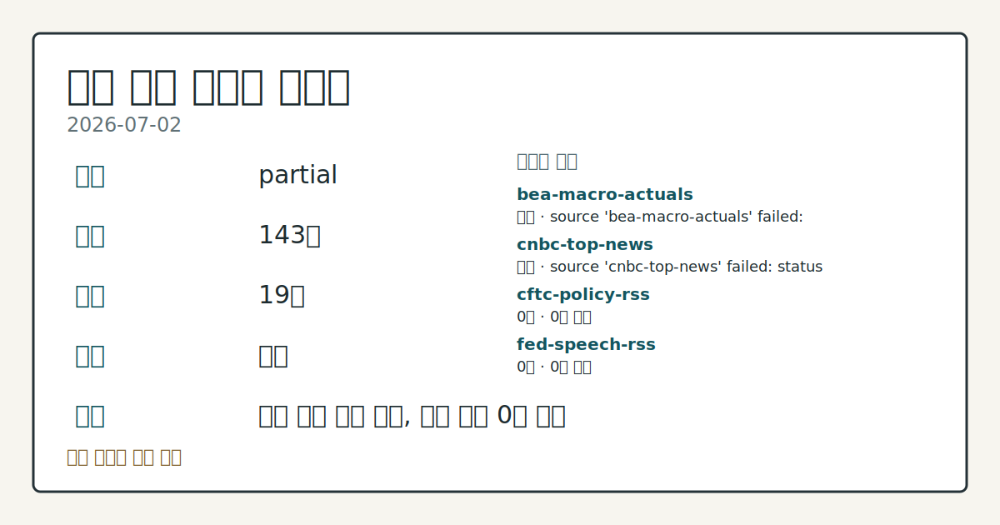
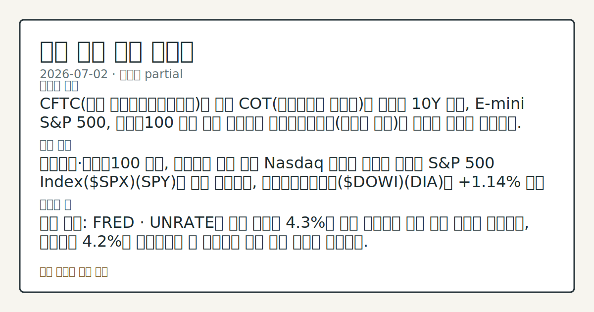
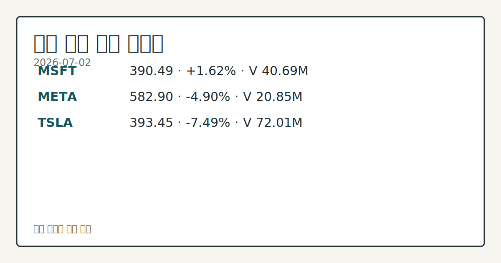

> 정보 제공용 자동 시황이며 매매 권유가 아닙니다.
# 2026-07-02 미국 증시 시황
**기준 시각**: 2026-07-02 NY · 2026-07-02T04:00Z, 2026-07-03T04:00Z)
| 종목 | 종가 | 변동 | 비고 |
|------|------|------|------|
| ^GSPC | 7,483.24 | 0.00% | -1.66% from 52w high · +9.11% YTD |
| ^IXIC | 25,832.67 | -0.80% | -4.66% from 52w high · +11.18% YTD |
| ^DJI | 52,900.07 | +1.14% | ATH 경신 · +9.34% YTD |
| AAPL | 308.63 | +4.84% | -2.08% from 52w high · +13.88% YTD |
| MSFT | 390.49 | +1.62% | +10.67% from 52w low · -17.43% YTD |
**세그먼트**: [국내 증시](../../../domestic-equity/2026/07/2026-07-02.md) | [미국 증시](2026-07-02.md) | [크립토](../../../crypto/2026/07/2026-07-02.md)

*이미지: 데이터 신뢰도 · 출처: investo 자체 생성 · 생성: investo 0.1.0 · 2026-07-02 UTC*
> **내 관심 자산 영향**: 17건 확인 (기본 바스켓) — AAPL: 직접 관련 · [nasdaq-symbol-directory] AAPL listing metadata: Apple Inc. - Common Stock; AAPL: 직접 관련 · [sec-company-facts] AAPL SEC company facts: Apple Inc.; AMZN: 직접 관련 · [nasdaq-symbol-directory] AMZN listing metadata: Amazon.com, Inc. - Common Stock; AMZN: 직접 관련 · [sec-company-facts] AMZN SEC company facts: AMAZON COM INC; GOOGL: 직접 관련 · [nasdaq-symbol-directory] GOOGL listing metadata: Alphabet Inc. - Class A Common Stock 외
> **용어 가이드**: 이번 시황에서 처음 등장한 용어 — E-mini S&P 500(미니 S&P 500 선물), PPI(생산자물가)
> **오늘의 결론**: CFTC(미국 상품선물거래위원회)의 최신 COT(선물포지션 보고서)에 따르면 10Y 국채, E-mini S&P 500, 나스닥100 미니 선물 모두에서 레버리지드머니(투기적 자금)의 순매도 우위가 확인됐다. 수집 근거가 제한적입니다
> **핵심 동인**: 다우존스·나스닥100 혼조, 칩메이커 약세 여파 Nasdaq 기사에 따르면 목요일 S&P 500 Index($SPX)(SPY)는 보합 마감했고, 다우존스산업평균($DOWI)(DIA)은 **+1.14%** 상승 마감했으며, 나스닥100 지수($IUXX)(QQQ)는 **-1.61%** 하락 마감했다.
> **주의할 점**: 확인 소스: FRED · UNRATE가 전월 수치인 **4.3%**를 다시 상회하면 고용 둔화 우려가 부각되고, 현재치인 **4.2%**를 본문 참고.
## 한눈에 보기
미국 3대 지수 혼조 마감 — 다우존스 **+1.14%** 상승, 나스닥100 **-1.61%** 하락, S&P 500은 보합.
달러인덱스(DXY, 달러지수)가 6월 고용지표 부진 여파로 2주 최저치까지 **-0.52%** 하락.
9월물 E-mini S&P 500 선물(ESU26, 미니 S&P 500 선물)이 **-0.25%** 밀리며 변동성 확대 여부를 본문 §③에서 점검.
## ⓪ 오늘의 매크로
**국제 유가** — CFTC WTI crude oil managed_money net +82872 contracts
**미 국채 수익률** — UST curve 2026-07-02: 10Y 4.49%, 2Y10Y +0.35pp
## ⓪-B 채널 기준선
| 기준선 | 값 |
|------|------|
| S&P 500 | 7,483.24 (0.00%) |
| 나스닥 종합 | 25,832.67 (-0.80%) |
| 다우존스 | 52,900.07 (+1.14%) |
| CFTC 포지셔닝 | E-mini S&P 500 순포지션 -373468계약 (-18.86% OI), 2026-06-23 기준/2026-06-26 공개 · Nasdaq-100 mini 순포지션 -51062계약 (-19.26% OI), 2026-06-23 기준/2026-06-26 공개 · VIX futures 순포지션 -18863계약 (-5.34% OI), 2026-06-23 기준/2026-06-26 공개 · 주간 지연 |
> **크로스마켓 연결 고리**: 유가/지정학 이슈가 여러 자산군의 변동성 연결 고리로 관찰됩니다. / 금리 이벤트가 할인율/달러 경로의 공통 변수로 남아 있습니다.
> **오늘의 큰 그림:** 유가와 지정학 변수가 공통 변수지만, 섹터·실적 변동성를 먼저 확인해야 합니다.
## ① 요약

*이미지: 시장 스냅샷 · 출처: investo 자체 생성 · 생성: investo 0.1.0 · 2026-07-02 UTC*

CFTC의 최신 COT에 따르면 10Y 국채, E-mini S&P 500, 나스닥100 미니 선물 모두에서 레버리지드머니의 순매도 우위가 확인됐다. 같은 날 FRED(세인트루이스 연은 경제데이터) 기준으로 UNRATE(실업률)는 **4.2%**로 전월보다 낮아졌지만, CPIAUCSL(소비자물가지수)과 PPIFID(생산자물가지수 확정수요)는 각각 전월 대비 상승하며 물가 지표는 반대 방향을 가리켰다. 이런 가운데 다우존스는 **+1.14%** 상승, 나스닥100은 **-1.61%** 하락으로 지수는 혼조 마감했으며, 이는 전일(7월 1일) 브리핑에서 확인된 혼조 흐름의 연장이다. [혼재]

## ② 전일 핵심 이슈

### 다우존스·나스닥100 혼조, 칩메이커 약세 여파

[Nasdaq 기사](https://www.nasdaq.com/articles/stock-indexes-settle-mixed-chipmakers-retreat)에 따르면 목요일 S&P 500 Index(SPY)는 보합 마감했고, 다우존스산업평균(DIA)은 **+1.14%** 상승 마감했으며, 나스닥100 지수(QQQ)는 **-1.61%** 하락 마감했다. 9월물 E-mini S&P 500 선물은 **-0.25%** 밀렸다. 칩메이커 약세가 나스닥100 하락을 이끌며 지수별 온도차가 뚜렷했으며, 이는 전일 브리핑에서 이미 확인된 혼조 흐름이 그대로 이어진 모습이다.

> **그래서 의미는?** 대형 기술주·반도체 중심의 나스닥100만 유독 약세를 보여 업종별 수급 차별화가 진행 중임을 시사합니다.

### 달러 약세, 6월 고용지표 여파

[Nasdaq 기사](https://www.nasdaq.com/articles/dollar-drops-us-job-weakness)에 따르면 달러인덱스(DXY00)는 목요일 2주 최저치로 떨어지며 **-0.52%** 하락 마감했다. 예상치를 밑돈 6월 고용지표 발표 이후 Federal Reserve의 긴축 재개 기대가 약화된 영향으로 풀이된다.

## ③ 섹터/수급 동향

### CFTC 포지셔닝 — 국채·주가지수 선물 순매도 우위

[CFTC COT 최신 보고서](https://www.cftc.gov/MarketReports/CommitmentsofTraders/index.htm)에 따르면 10Y 국채 선물 레버리지드머니 순포지션은 -1,938,747계약(미결제약정 대비 **-36.8%**)으로 집계됐다. E-mini S&P 500 레버리지드머니 순포지션도 -373,468계약(**-18.9%**)으로 순매도 우위였고, 나스닥100 미니 선물 역시 -51,062계약(**-19.3%**) 순매도였다. 반면 금(Gold) 매니지드머니(자산운용사 자금) 순포지션은 +115,395계약(**+32.8%**)으로 순매수 우위를 보였다. 이는 주간 단위 집계로 일중 흐름과는 다르다는 점에 유의해야 한다.

> **그래서 의미는?** 선물시장 큰손들이 채권·주가지수 선물에서는 순매도, 금에서는 순매수로 엇갈린 베팅을 이어가고 있다는 신호입니다.

### 국제유가, 달러 약세에 반등

[Nasdaq 기사](https://www.nasdaq.com/articles/crude-oil-prices-recover-dollar-weakens)에 따르면 WTI(서부텍사스산원유) 원유 선물인 CLQ26(8월물 인도분)은 목요일 **+0.16%** 상승 마감했고, RBOB 가솔린 선물인 RBQ26(8월물 인도분)은 **-0.95%** 하락했다. WTI는 4.25개월 최저치에서 반등하며 낙폭을 일부 되돌렸다. CFTC 자료 기준 WTI 원유 매니지드머니 순포지션은 +82,872계약(**+4.3%**)으로 순매수 우위를 유지했다.

### 달러·VIX 선물 포지셔닝

CFTC COT 기준 미국 달러 인덱스 레버리지드머니 순포지션은 -5,352계약(**-9.7%**), VIX(변동성지수) 선물 레버리지드머니 순포지션은 -18,863계약(**-5.3%**)으로 모두 소폭 순매도 우위였다.

## ④ 지표·이벤트

### 6월 고용·물가 지표

[BLS(미국 노동통계국) 발표](https://www.bls.gov/data/)에 따르면 2026년 6월 실업률은 **4.2%**로 전월 **4.3%**에서 하락했으며, FRED 기준 [UNRATE](https://fred.stlouisfed.org/series/UNRATE) 역시 동일하게 **4.2**(전월 대비 -0.1000)로 집계됐다. 같은 발표에서 6월 비농업 고용은 158,984천 명, 시간당 평균임금은 **$37.64**로 나타났다. 5월 소비자물가지수(CPI)는 [CPIAUCSL](https://fred.stlouisfed.org/series/CPIAUCSL) 기준 333.979(전월 대비 +1.5720)로 집계됐고, 근원 CPI는 336.121을 기록했다. 5월 생산자물가지수(PPI) 확정수요 기준은 157.659였으며, FRED [PPIFID](https://fred.stlouisfed.org/series/PPIFID) 기준은 158.012(전월 대비 +1.6170)로 집계됐다. [DFF](https://fred.stlouisfed.org/series/DFF)(연방기금 실효금리)는 **3.63**으로 전일과 동일했다.

> **그래서 의미는?** 고용은 소폭 둔화됐지만 물가 지표는 여전히 오름세를 보여, 연준의 금리 판단에 엇갈린 신호를 주는 조합입니다.

### 변동성·연준 일정

[Cboe(시카고옵션거래소) 자료](https://cdn.cboe.com/api/global/us_indices/daily_prices/VVIX_History.csv)에 따르면 VVIX(변동성지수의 변동성)는 **88.80**으로 집계됐다. [연방준비제도 캘린더](https://www.federalreserve.gov/newsevents/calendar.htm)에는 2026-07-02 H.4.1(지준금 변동요인 보고서)과 H.8(상업은행 자산부채 통계) 발표가 예정돼 있다. 노동참가율은 **61.5%**로 전월 **61.8%**에서 하락했고, 구인건수는 7,594천 건으로 전월 7,585천 건 대비 소폭 늘었다.

## ⑤ 주요 종목

<!-- u50 lightweight-charts-embed: placeholders consumed by site_docs/assets/investo-chart-init.js -->

<noscript><em>인터랙티브 차트는 JavaScript가 활성화된 환경에서 표시됩니다. 위 정적 카드가 동일한 정보를 담고 있습니다.</em></noscript>

*이미지: 가격 스냅샷 · 출처: investo 자체 생성 · 생성: investo 0.1.0 · 2026-07-02 UTC*

### 관전 분류 — 워치리스트 매칭 종목

AAPL, AMZN, GOOGL이 이번 라우팅에서 워치리스트 매칭 종목으로 우선 확인됐다. [SEC(미국 증권거래위원회) 기업 공시](https://data.sec.gov/submissions/CIK0000320193.json) 기준 AAPL의 순이익은 **$61,110,000,000**, 희석 EPS(주당순이익)는 **$4.05**로 나타났다(2025-03-29 기준). AMZN은 순이익 **$65,944,000,000**, 희석 EPS **$1.59**(2025-03-31 기준, [출처](https://data.sec.gov/submissions/CIK0001018724.json)), GOOGL은 매출 **$90,234,000,000**, 순이익 **$34,540,000,000**, 희석 EPS **$2.81**(2025-03-31 기준, [출처](https://data.sec.gov/submissions/CIK0001652044.json))로 공시됐다.

> **그래서 의미는?** AAPL(애플)·AMZN(아마존)·GOOGL(알파벳) 모두 SEC 공시 기준 이익 지표가 확인되는 대형 기술주로, 지수 방향성에 영향력이 큰...

### 확인 항목 — 기타 SEC 공시 대형주

META는 순이익 **$16,644,000,000**·희석 EPS **$6.43**(2025-03-31 기준, [출처](https://data.sec.gov/submissions/CIK0001326801.json)), MSFT는 순이익 **$74,599,000,000**·희석 EPS **$9.99**(2025-03-31 기준, [출처](https://data.sec.gov/submissions/CIK0000789019.json)), NVDA는 매출 **$44,062,000,000**·희석 EPS **$0.76**(2025-04-27 기준, [출처](https://data.sec.gov/submissions/CIK0001045810.json)), TSLA는 매출 **$19,335,000,000**·희석 EPS **$0.12**(2025-03-31 기준, [출처](https://data.sec.gov/submissions/CIK0001318605.json))로 각각 공시됐다.

### 실적 발표 — 이번 주 확인 대상

[CRMT 실적 캘린더](https://www.nasdaq.com/market-activity/stocks/crmt/earnings)에 따르면 America's Car-Mart는 2026년 4월 회계분기 실적을 앞두고 있으며 시가총액은 **$23,163,836**, 전년 동기 EPS는 **$1.26**이다. [LNN 실적 캘린더](https://www.nasdaq.com/market-activity/stocks/lnn/earnings)에 따르면 Lindsay Corporation은 개장 전(pre-market) 실적 발표가 예정돼 있으며 EPS 예상치는 **$1.41**, 2026년 5월 회계분기 기준, 시가총액은 **$1,258,601,951**이다.

### 체크리스트 — 개별 종목 변동

Nasdaq 기사에 따르면 TPC(Tutor Perini)는 최근 거래일 **$76.75**로 마감하며 전일 대비 **-3.47%** 변동했다([출처](https://www.nasdaq.com/articles/tutor-perini-tpc-stock-moves-347-what-you-should-know)). UAL(United Airlines)은 **$133.32**로 마감, **-1.34%** 변동했다([출처](https://www.nasdaq.com/articles/united-airlines-ual-stock-moves-134-what-you-should-know)). UPST(Upstart Holdings)는 **$34.78**로 마감, **-2.69%** 변동했다([출처](https://www.nasdaq.com/articles/upstart-holdings-inc-upst-stock-moves-269-what-you-should-know)). WING(Wingstop)은 **$177.99**로 마감하며 **+1.73%** 상승했다([출처](https://www.nasdaq.com/articles/wingstop-wing-stock-moves-173-what-you-should-know)). SONY(Sony Group)는 **$20.79**로 마감, **+2.87%** 상승했다([출처](https://www.nasdaq.com/articles/sony-sony-stock-moves-287-what-you-should-know)).

## ⑥ 오늘의 관전 포인트

> **관전 포인트**: 구조화 가능한 관찰 신호가 부족합니다 — 본문 §②·§④ 참조

> **데이터 상태**: 부분

수집/품질 진단

> **데이터 상태**: 부분 — 수집 143건 / 소스 19개 / 누락: 없음 · 부분 — 일부 카테고리 미수집, 본문 일부 결론 보강 필요
> **소스 카운트**: 수집 대상 25 / 성공 19 / 수집 상세는 진단 섹션에서 확인할 수 있습니다. / 수집 상세는 진단 섹션에서 확인할 수 있습니다. / 수집 상세는 진단 섹션에서 확인할 수 있습니다.
> **소스 등급 분포**: S=10 / A=9
> **상세 사유**: 일부 소스 수집 실패, 일부 소스 0건 반환
> **소스별 상태**: bea-macro-actuals 실패 (설정 미완료(미수집)), cnbc-top-news 실패 (접근 제한), cftc-policy-rss 0건, fed-speech-rss 0건, sec-newsroom-rss 0건, stooq-price 0건, 정상 19개

## ⑦ 면책조항
본 시황은 일반 정보 제공을 목적으로 자동 생성된 자료이며,
특정 종목·자산에 대한 매매 권유나 투자 자문이 아닙니다.
투자 결정과 그 결과에 대한 책임은 전적으로 본인에게 있으며,
본 시황의 내용에 따라 발생한 손실에 대해 작성자는 일체의 책임을 지지 않습니다.