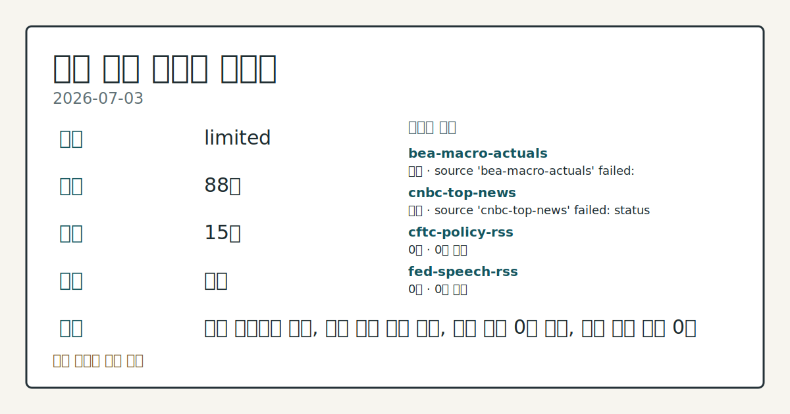
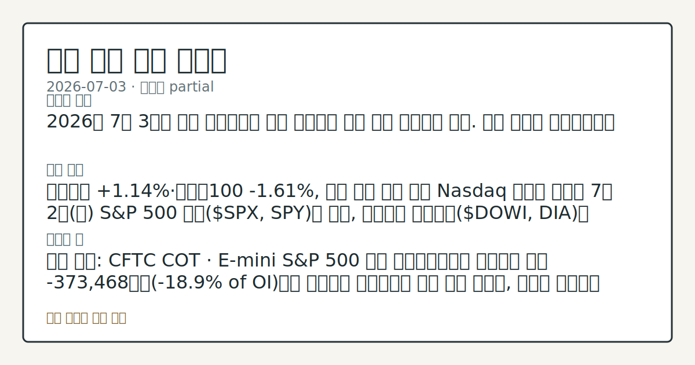

> 정보 제공용 자동 시황이며 매매 권유가 아닙니다.
# 2026-07-03 미국 증시 시황
**기준 시각**: 2026-07-03 NY · 2026-07-03T04:00Z, 2026-07-04T04:00Z)
| 종목 | 종가 | 변동 | 비고 |
|------|------|------|------|
| ^GSPC | 7,483.24 | 0.00% | -1.66% from 52w high · +9.11% YTD |
| ^IXIC | 25,832.67 | -0.80% | -4.66% from 52w high · +11.18% YTD |
| ^DJI | 52,900.07 | +1.14% | ATH 경신 · +9.34% YTD |
| AAPL | 308.63 | +4.84% | -2.08% from 52w high · +13.88% YTD |
| MSFT | 390.49 | +1.62% | +10.67% from 52w low · -17.43% YTD |
**세그먼트**: [국내 증시](../../../domestic-equity/2026/07/2026-07-03.md) | [미국 증시](2026-07-03.md) | [크립토](../../../crypto/2026/07/2026-07-03.md)

*이미지: 데이터 신뢰도 · 출처: investo 자체 생성 · 생성: investo 0.1.0 · 2026-07-05 UTC*
> **내 관심 자산 영향**: 데이터 수집 부족으로 매칭 판단 보류 — 추가 수집 후 재평가됩니다.
> **오늘의 결론**: 미국 증시는 독립기념일 대체 휴장으로 SPX(S&P 500 지수)·NDX(나스닥100 지수)·DJI(다우존스 산업평균지수) 모두 신규 종가가 없었다. 수집 근거가 제한적입니다
> **핵심 동인**: 2026년 7월 3일(금)은 독립기념일 대체 휴장으로 개별 종목·지수 마감 이슈가 이 세그먼트 라우팅 결과에 포함되지 않았다.
> **주의할 점**: 이번 주(7/67/8)에는 Waller 이사 토론·H.10 외환 통계·FOMC 의사록·G.19 소비자신용 발표가, 이번 달에는 7/14 CPI 본문 참고.
## 한눈에 보기
미국 증시는 독립기념일 대체 휴장으로 거래가 없었던 가운데, CFTC E-mini S&P 500 레버리지드머니 순매도가 **-373,468**계약으로 집계돼 지수선물 수급이 방어적으로 나타났다.
6월 UNRATE(실업률)가 **4.2%**로 전월(**4.3%**) 대비 하락한 반면 CPIAUCSL(소비자물가지수)은 **333.979**로 전월 대비 올라 물가 압력이 이어졌다.
Cboe VVIX가 **88.80**, SKEW가 **150.02**로 집계돼 잠재 변동성 지표는 여전히 높은 수준 — 본문 §③ 참조.
## ⓪ 오늘의 매크로
**미 국채 수익률** — UST curve 2026-07-02: 10Y 4.49%, 2Y10Y +0.35pp
## ⓪-B 채널 기준선
| 기준선 | 값 |
|------|------|
| S&P 500 | 7,483.24 (0.00%) |
| 나스닥 종합 | 25,832.67 (-0.80%) |
| 다우존스 | 52,900.07 (+1.14%) |
| CFTC 포지셔닝 | E-mini S&P 500 순포지션 -373468계약 (-18.86% OI), 2026-06-23 기준/2026-06-26 공개 · Nasdaq-100 mini 순포지션 -51062계약 (-19.26% OI), 2026-06-23 기준/2026-06-26 공개 · VIX futures 순포지션 -18863계약 (-5.34% OI), 2026-06-23 기준/2026-06-26 공개 · 주간 지연 |
> **크로스마켓 연결 고리**: 금리 이벤트가 할인율/달러 경로의 공통 변수로 남아 있습니다.
> **오늘의 큰 그림:** 금리와 달러 변수가 공통 변수지만, Nasdaq·Dow 섹터 변동성를 먼저 확인해야 합니다.
## ① 요약

*이미지: 시장 스냅샷 · 출처: investo 자체 생성 · 생성: investo 0.1.0 · 2026-07-05 UTC*

미국 증시는 [독립기념일 대체 휴장](https://www.federalreserve.gov/newsevents/calendar.htm)으로 SPX(S&P 500 지수)·NDX·DJI 모두 신규 종가가 없었다. 대신 CFTC(미국 상품선물거래위원회)의 최신 COT(선물포지션 보고서)에서 E-mini S&P 500(미니 S&P 500 선물) 레버리지드머니가 순매도 **-373,468**계약(OI(미결제약정)의 **-18.9%**)으로 나타나 지수선물 수급이 방어적 포지셔닝을 보였고, 10Y 국채선물 레버리지드머니 순매도도 -1,938,747계약으로 확대됐다. 노동시장 지표는 UNRATE(실업률)가 **4.2%**로 전월 대비 하락했지만, CPIAUCSL(소비자물가지수)은 **333.979**로 전월 대비 상승해 물가 압력이 지속되는 모습이다. Cboe VVIX(변동성의 변동성 지수)는 **88.80**, SKEW(테일리스크 지수)는 **150.02**로 집계돼 잠재 변동성 경계가 유지되고 있다. 거래가 없는 하루였음에도 고용·물가·포지셔닝 지표가 서로 다른 방향을 가리키는 하루였다. [혼재]

## ② 전일 핵심 이슈

2026년 7월 3일은 독립기념일 대체 휴장으로 개별 종목·지수 마감 이슈가 이 세그먼트 라우팅 결과에 포함되지 않았다. 다만 전일(2026-07-02) 컨텍스트에서 핵심 동인으로 언급됐던 CFTC COT 흐름은 오늘 데이터에서도 이어지며, E-mini S&P 500 등 주요 선물의 레버리지드머니 순매도 포지션 확대가 §③에서 확인된다.

> **그래서 의미는?** 휴장으로 새 이슈보다 어제부터 이어진 선물 포지셔닝 흐름의 연장 여부 확인이 중요합니다.

## ③ 섹터/수급 동향

### 변동성 지표

Cboe SKEW(테일리스크 지수)는 2026-07-02 기준 **150.02**([출처](https://cdn.cboe.com/api/global/us_indices/daily_prices/SKEW_History.csv)), VVIX(변동성의 변동성 지수)는 같은 날 **88.80**([출처](https://cdn.cboe.com/api/global/us_indices/daily_prices/VVIX_History.csv))으로 집계됐다. 두 지표 모두 공식 일일 종가 기준이며 장중 스냅샷이 아니다.

> **그래서 의미는?** 테일리스크·변동성 지표가 높게 유지돼 시장이 급변 가능성을 여전히 경계하고 있음을 보여줍니다.

### 선물 포지셔닝 (CFTC COT)

[CFTC COT(선물포지션 보고서)](https://www.cftc.gov/MarketReports/CommitmentsofTraders/index.htm)에 따르면 E-mini S&P 500 레버리지드머니는 롱 185,058 / 숏 558,526으로 순매도 **-373,468**계약(OI의 **-18.9%**)을 기록했다. Nasdaq-100 mini(미니 나스닥100 선물)도 롱 42,052 / 숏 93,114로 순매도 -51,062계약(**-19.3%**), VIX 선물은 롱 71,314 / 숏 90,177로 순매도 -18,863계약(**-5.3%**)을 나타냈다. 세 지표 모두 주간 CFTC 보고서 기준으로 장중 실시간 흐름과는 다르다.

## ④ 지표·이벤트

### 주요 매크로 지표 (FRED·BLS 발표)

[FRED](https://fred.stlouisfed.org/) 기준 DFF(연방기금금리)는 **3.63%**(전일 대비 변동 없음, [출처](https://fred.stlouisfed.org/series/DFF)), UNRATE(실업률)는 **4.2%**로 전월 대비 하락([출처](https://fred.stlouisfed.org/series/UNRATE)), CPIAUCSL은 **333.979**로 전월 대비 상승([출처](https://fred.stlouisfed.org/series/CPIAUCSL)), PPIFID(생산자물가지수 최종수요)는 **158.012**로 전월 대비 상승([출처](https://fred.stlouisfed.org/series/PPIFID))했다.

> **그래서 의미는?** 실업률 하락과 물가 상승이 동시에 나타나 연준 정책 판단에 엇갈린 근거를 제공합니다.

### 고용·물가 세부 지표 (BLS)

| 지표 | 값 | 기준월 | 전월 | 출처 |
|---|---|---|---|---|
| Average hourly earnings | 37.64 | 2026-06 | 37.51 | [BLS](https://www.bls.gov/data/) |
| Consumer Price Index | 333.979 | 2026-05 | 332.407 | [BLS](https://www.bls.gov/data/) |
| Core Consumer Price Index | 336.121 | 2026-05 | 335.423 | [BLS](https://www.bls.gov/data/) |
| Job Openings | 7594 | 2026-05 | 7585 | [BLS](https://www.bls.gov/data/) |
| Labor Force Participation Rate | 61.5 | 2026-06 | 61.8 | [BLS](https://www.bls.gov/data/) |
| Producer Price Index Final Demand | 157.659 | 2026-05 | 156.011 | [BLS](https://www.bls.gov/data/) |
| Total nonfarm payroll employment | 158984 | 2026-06 | 158927 | [BLS](https://www.bls.gov/data/) |
| Unemployment Rate | 4.2 | 2026-06 | 4.3 | [BLS](https://www.bls.gov/data/) |

### 연준 일정

[FOMC(연방공개시장위원회) 캘린더](https://www.federalreserve.gov/newsevents/calendar.htm)에 따르면 7월 6일 Christopher J. Waller 이사가 로마에서 열리는 유럽중앙은행제도 리서치네트워크 정책 패널(정책 전달 관련 토론)에 참여하며, 같은 날 H.10 - Foreign Exchange Rates(외환 환율 통계)가 오후 4시 15분에 발표될 예정이다.

## ⑤ 주요 종목

<!-- u50 lightweight-charts-embed: placeholders consumed by site_docs/assets/investo-chart-init.js -->

<noscript><em>인터랙티브 차트는 JavaScript가 활성화된 환경에서 표시됩니다. 위 정적 카드가 동일한 정보를 담고 있습니다.</em></noscript>

### 실적·재무 공시 확인

| 티커 | 기업명 | 최근 공시 | 순이익 (기준일) | 희석 EPS (기준일) | 출처 |
|---|---|---|---|---|---|
| AAPL | Apple Inc. | Form 4, 2026-06-17 | $61,110,000,000 (2025-03-29) | $4.05 (2025-03-29) | [SEC](https://data.sec.gov/submissions/CIK0000320193.json) |
| AMZN | Amazon.com, Inc. | Form 4, 2026-07-02 | $65,944,000,000  | $1.59 (2025-03-31) | [SEC](https://data.sec.gov/submissions/CIK0001018724.json) |
| GOOGL | Alphabet Inc. | Form 4, 2026-07-01 | $34,540,000,000  | $2.81 (2025-03-31) | [SEC](https://data.sec.gov/submissions/CIK0001652044.json) |
| META | Meta Platforms, Inc. | Form 144, 2026-07-01 | $16,644,000,000  | $6.43 (2025-03-31) | [SEC](https://data.sec.gov/submissions/CIK0001326801.json) |
| MSFT | Microsoft Corp | Form PX14A6G, 2026-07-02 | $74,599,000,000  | $9.99 (2025-03-31) | [SEC](https://data.sec.gov/submissions/CIK0000789019.json) |
| NVDA | NVIDIA Corp | Form 8-K, 2026-07-02 | $18,775,000,000  | $0.76 (2025-04-27) | [SEC](https://data.sec.gov/submissions/CIK0001045810.json) |
| TSLA | Tesla, Inc. | Form 8-K, 2026-07-02 | $409,000,000  | $0.12 (2025-03-31) | [SEC](https://data.sec.gov/submissions/CIK0001318605.json) |

> **그래서 의미는?** AAPL(애플)·AMZN(아마존)·GOOGL(알파벳)·META(메타)·MSFT(마이크로소프트)·NVDA(엔비디아)·TSLA(테슬라) 모두 최근...

### 관심 종목 체크리스트

나스닥 매체 기사는 MU, CRDO, SNX를 순이익 비율과 이익 성장 전망이 견조한 종목으로 스크리닝해 소개했다([출처](https://www.nasdaq.com/articles/micron-2-profitable-stocks-buy-july-explosive-upside)). 해당 스크리닝은 매체 자체 기준이며 별도 검증 지표는 입력에 포함되어 있지 않다.

## ⑥ 오늘의 관전 포인트

#### 관찰 신호: 10Y 국채선물 레버리지드머니 순매도

- 출처: CFTC COT
- 현재: CFTC COT · 10Y 국채선물 레버리지드머니 순매도가 -1,938,747계약에서 축소되면 금리 하방 기대 완화로 관찰하고, 추가로 확대되면 금리 상방 압력 지속으로 관찰한다. 관심 영향: 국채금리와 성장주 밸류에이션 상관관계의 추세를 확인한다.
- 확인 조건: 상방 추가로 확대되면 금리 상방 압력 지속으로 관찰한다; 하방 10Y 국채선물 레버리지드머니 순매도가 -1,938,747계약에서 축소되면 금리 하방 기대 완화로 관찰하고
- 신뢰도: 보통
- 관심 영향: 국채금리와 성장주 밸류에이션 상관관계의 추세를 확인한다.

> **데이터 상태**: 제한

수집/품질 진단

> **데이터 상태**: 제한 — 수집 88건 / 소스 15개 / 누락: 가격 · 제한 — 핵심 가격 소스 0건/실패/stale, 본문 결론 신뢰도 낮음
> **소스 카운트**: 수집 대상 25 / 성공 15 / 수집 상세는 진단 섹션에서 확인할 수 있습니다. / 수집 상세는 진단 섹션에서 확인할 수 있습니다. / 수집 상세는 진단 섹션에서 확인할 수 있습니다.
> **소스 등급 분포**: S=8 / A=7
> **상세 사유**: 가격 카테고리 누락, 일부 소스 수집 실패, 일부 소스 0건 반환, 핵심 가격 소스 0건
> **소스별 상태**: bea-macro-actuals 실패 (설정 미완료(미수집)), cnbc-top-news 실패 (접근 제한), cftc-policy-rss 0건, fed-speech-rss 0건, fomc-rss 0건, sec-edgar-8k 0건, sec-newsroom-rss 0건, stooq-price 0건, yahoo-finance-news 0건, yfinance-price 0건, 정상 15개

## ⑦ 면책조항
본 시황은 일반 정보 제공을 목적으로 자동 생성된 자료이며,
특정 종목·자산에 대한 매매 권유나 투자 자문이 아닙니다.
투자 결정과 그 결과에 대한 책임은 전적으로 본인에게 있으며,
본 시황의 내용에 따라 발생한 손실에 대해 작성자는 일체의 책임을 지지 않습니다.