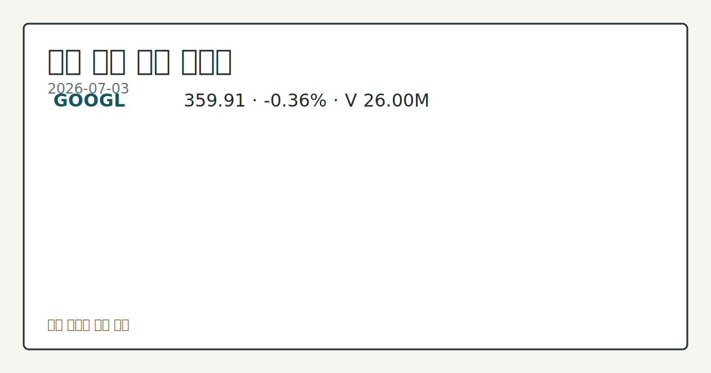

> 정보 제공용 자동 시황이며 매매 권유가 아닙니다.
# 2026-07-03 미국 증시 시황
**기준 시각**: 2026-07-03 NY · 2026-07-03T04:00Z, 2026-07-04T04:00Z)
| 종목 | 종가 | 변동 | 비고 |
|------|------|------|------|
| ^GSPC | 7,483.24 | 0.00% | -1.66% from 52w high · +9.11% YTD |
| ^IXIC | 25,832.67 | -0.80% | -4.66% from 52w high · +11.18% YTD |
| ^DJI | 52,900.07 | +1.14% | ATH 경신 · +9.34% YTD |
| AAPL | 308.63 | +4.84% | -2.08% from 52w high · +13.88% YTD |
| MSFT | 390.49 | +1.62% | +10.67% from 52w low · -17.43% YTD |
**세그먼트**: [국내 증시](../../../domestic-equity/2026/07/2026-07-03.md) | [미국 증시](2026-07-03.md) | [크립토](../../../crypto/2026/07/2026-07-03.md)

*이미지: 데이터 신뢰도 · 출처: investo 자체 생성 · 생성: investo 0.1.0 · 2026-07-04 UTC*
> **내 관심 자산 영향**: 15건 확인 (기본 바스켓) — AAPL: 직접 관련 · [nasdaq-symbol-directory] AAPL listing metadata: Apple Inc. - Common Stock; AAPL: 직접 관련 · [sec-company-facts] AAPL SEC company facts: Apple Inc.; AMZN: 직접 관련 · [nasdaq-symbol-directory] AMZN listing metadata: Amazon.com, Inc. - Common Stock; AMZN: 직접 관련 · [sec-company-facts] AMZN SEC company facts: AMAZON COM INC; GOOGL: 직접 관련 · [nasdaq-symbol-directory] GOOGL listing metadata: Alphabet Inc. - Class A Common Stock 외
> **용어 가이드**: 이번 시황에서 처음 등장한 용어 — ESU26(미니 S&P 500 선물)
> **오늘의 결론**: 2026년 7월 3일은 미국 독립기념일 대체 휴장일로 신규 체결 데이터가 없다. 수집 근거가 제한적입니다
> **핵심 동인**: 다우존스 **+1.14%**·나스닥100 **-1.61%**, 혼조 마감 흐름 연장 Nasdaq 기사에 따르면 7월 2일(목) S&P 500 지수($SPX, SPY)는 보합, 다우존스 산업평균($DOWI, DIA)은 **+1.14%**, 나스닥100 지수($IUXX, QQQ)는 **-1.61%**로 칩메이커 약세 여파에 혼조 마감했다.
> **주의할 점**: 확인 소스: CFTC COT · E-mini S&P 500 선물 레버리지드머니 순매도가 현재 -373,468계약(**-18.9%** of OI)에서 본문 참고.
## 한눈에 보기
미국 3대 지수는 목요일(7/2) **혼조 마감** — 다우존스 **+1.14%**, 나스닥100(QQQ) **-1.61%**, S&P 500은 보합 마감.
CFTC(미국 상품선물거래위원회) 최신 COT(선물포지션보고서)에서 E-mini S&P 500 레버리지드머니 순매도가 **-373,468**계약(전체 미결제약정의 **-18.9%**)로 집계됐다.
**4.2%**로 낮아진 실업률(UNRATE)과 CPI **333.979** 등 노동·물가 지표가 §④에 정리 — 7/8 FOMC(연방공개시장위원회) 의사록 공개를 앞둔 핵심 변수.
## ⓪ 오늘의 매크로
**FOMC 일정** — 2026-07-08 — FOMC Minutes
**국제 유가** — CFTC WTI crude oil managed_money net +82872 contracts
**미 국채 수익률** — UST curve 2026-07-02: 10Y 4.49%, 2Y10Y +0.35pp
## ⓪-B 채널 기준선
| 기준선 | 값 |
|------|------|
| S&P 500 | 7,483.24 (0.00%) |
| 나스닥 종합 | 25,832.67 (-0.80%) |
| 다우존스 | 52,900.07 (+1.14%) |
| CFTC 포지셔닝 | E-mini S&P 500 순포지션 -373468계약 (-18.86% OI), 2026-06-23 기준/2026-06-26 공개 · Nasdaq-100 mini 순포지션 -51062계약 (-19.26% OI), 2026-06-23 기준/2026-06-26 공개 · VIX futures 순포지션 -18863계약 (-5.34% OI), 2026-06-23 기준/2026-06-26 공개 · 주간 지연 |
> **크로스마켓 연결 고리**: 유가/지정학 이슈가 여러 자산군의 변동성 연결 고리로 관찰됩니다. / 금리 이벤트가 할인율/달러 경로의 공통 변수로 남아 있습니다.
> **오늘의 큰 그림:** 금리와 달러 변수가 공통 변수지만, Nasdaq·Dow 섹터 변동성를 먼저 확인해야 합니다.
## ① 요약

*이미지: 시장 스냅샷 · 출처: investo 자체 생성 · 생성: investo 0.1.0 · 2026-07-04 UTC*

2026년 7월 3일은 미국 독립기념일 대체 휴장일로 신규 체결 데이터가 없다. 직전 거래일인 7월 2일(목) 미국 증시는 칩메이커 약세 여파로 다우존스 **+1.14%**, 나스닥100 **-1.61%**, S&P 500은 보합 마감했으며, CFTC COT 자료상 국채·주가지수·달러·VIX 선물의 레버리지드머니 포지션은 대부분 순매도, 금·WTI 원자재는 순매수로 자산군별로 방향이 엇갈렸다. [혼재]

## ② 전일 핵심 이슈

### 다우존스 **+1.14%**·나스닥100 **-1.61%**, 혼조 마감 흐름 연장

[Nasdaq 기사](https://www.nasdaq.com/articles/stock-indexes-settle-mixed-chipmakers-retreat)에 따르면 7월 2일(목) S&P 500 지수는 보합, 다우존스 산업평균은 **+1.14%**, 나스닥100 지수는 **-1.61%**로 칩메이커 약세 여파에 혼조 마감했다. 9월물 미니 S&P 500 선물(ESU26)도 **-0.25%** 하락했다. 최근 컨텍스트(7/1·7/2 결론)에서도 같은 칩메이커 약세發 혼조 흐름이 반복적으로 언급된 만큼, 오늘은 새로운 방향 전환 신호 없이 기존 흐름이 연장된 상태다.

> **그래서 의미는?** 며칠째 이어진 혼조 마감이 방향을 못 잡고 있다는 뜻입니다.

### 독립기념일 휴장과 연준 일정

[연준 캘린더](https://www.federalreserve.gov/newsevents/calendar.htm)에 따르면 오늘(7/3)은 Independence Day 대체 휴장일로, 일간·주간 통계 발표는 다음 영업일인 7월 6일(월)로 이월된다. 이번 주 안에는 7/6 월러(Waller) 이사 토론, 7/8 FOMC 의사록 공개가 예정돼 있다.

## ③ 섹터/수급 동향

### 선물시장 전반, 레버리지드머니 순매도 우세

[CFTC COT](https://www.cftc.gov/MarketReports/CommitmentsofTraders/index.htm) 최신 주간 보고서(주간 집계, 실시간 체결 아님)에 따르면 10Y Treasury note 레버리지드머니는 순매도 **-1,938,747**계약(**-36.8%** of OI(미결제약정)), E-mini S&P 500은 순매도 **-373,468**계약, Nasdaq-100 mini는 순매도 **-51,062**계약, U.S. Dollar Index는 순매도 **-5,352**계약, VIX 선물은 순매도 **-18,863**계약으로 국채·주가지수·달러·변동성 선물 전반에서 레버리지드머니의 순매도 포지셔닝이 관측됐다.

> **그래서 의미는?** 기관 자금이 국채·지수·달러 선물에서 방어적으로 기울어 있다는 뜻입니다.

### 원자재는 반대 흐름 — 금·WTI 순매수

같은 CFTC 자료에서 Gold는 managed_money 순매수 **+115,395**계약, WTI(서부텍사스산원유) crude oil은 managed_money 순매수 **+82,872**계약으로 금융선물과 반대 방향을 보였다. 이 외 [Nasdaq 기사](https://www.nasdaq.com/articles/2-stocks-could-benefit-trumps-quantum-executive-orders)는 트럼프 행정부의 양자컴퓨팅 관련 행정명령이 정책 배경으로 거론된다고 전했다.

## ④ 지표·이벤트

### 필수 매크로 지표

[FRED(세인트루이스 연방준비은행 경제데이터)](https://fred.stlouisfed.org/series/DFF)에 따르면 DFF(연방기금 실효금리)는 **3.63**으로 전일 대비 변화 없음, [UNRATE](https://fred.stlouisfed.org/series/UNRATE) 실업률은 **4.2**로 직전 **4.3** 대비 하락, [CPIAUCSL](https://fred.stlouisfed.org/series/CPIAUCSL) 소비자물가지수는 **333.979**로 직전 **332.407** 대비 상승, [PPIFID](https://fred.stlouisfed.org/series/PPIFID) 생산자물가지수는 **158.012**로 직전 **156.395** 대비 상승했다.

> **그래서 의미는?** 실업률은 낮아지고 물가지표는 오른, 엇갈린 신호라는 뜻입니다.

### BLS 6월 고용·물가 지표

[BLS(미국 노동통계국)](https://www.bls.gov/data/) 발표에 따르면 평균 시간당 임금은 **37.64**달러(직전 **37.51**), 소비자물가지수(CPI)는 **333.979**(직전 **332.407**), 근원 CPI는 **336.121**(직전 **335.423**), 구인건수는 **7594**천 건(직전 **7585**), 경제활동참가율은 **61.5%**(직전 **61.8%**), 생산자물가지수(PPI Final Demand)는 **157.659**(직전 **156.011**), 비농업 고용은 **158984**천 명(직전 **158927**), 실업률은 **4.2%**(직전 **4.3%**)로 각각 발표됐다.

### 연준 캘린더 — 이번 주 이후 일정

[연준 캘린더](https://www.federalreserve.gov/newsevents/calendar.htm)에 따르면 7/6 월러 이사가 로마에서 열리는 유럽중앙은행 리서치 네트워크 정책 패널에 참석하며, 7/8에는 6월 16~17일 회의에 대한 FOMC 의사록이 공개된다.

## ⑤ 주요 종목

<!-- u50 lightweight-charts-embed: placeholders consumed by site_docs/assets/investo-chart-init.js -->

<noscript><em>인터랙티브 차트는 JavaScript가 활성화된 환경에서 표시됩니다. 위 정적 카드가 동일한 정보를 담고 있습니다.</em></noscript>

*이미지: 가격 스냅샷 · 출처: investo 자체 생성 · 생성: investo 0.1.0 · 2026-07-04 UTC*

### 워치리스트 매칭 — AAPL·AMZN·GOOGL

[나스닥 상장 디렉터리](https://www.nasdaqtrader.com/dynamic/SymDir/nasdaqlisted.txt)와 [SEC(증권거래위원회) 공시](https://data.sec.gov/submissions/CIK0000320193.json)에 따르면 AAPL(애플)은 나스닥 상장, 순이익 **61,110,000,000**달러, 희석 EPS **4.05**(2025-03-29 기준)를 기록했다. [AMZN(아마존)](https://data.sec.gov/submissions/CIK0001018724.json)은 순이익 **65,944,000,000**달러, 희석 EPS **1.59**(2025-03-31 기준), 발행주식수 **10,757,109,436**주(2026-04-22 기준)다. [GOOGL(알파벳)](https://data.sec.gov/submissions/CIK0001652044.json)은 매출 **90,234,000,000**달러, 순이익 **34,540,000,000**달러, 희석 EPS **2.81**(2025-03-31 기준)이며, [야후 파이낸스](https://finance.yahoo.com/quote/GOOGL) 시세로 GOOGL은 **359.91**달러(**-0.36%**, 장중 고가 **364.21**·저가 **353.42**)를 기록했다.

> **그래서 의미는?** AAPL(애플)·AMZN·GOOGL 최신 공시·시세를 확인용으로 정리했다는 뜻입니다.

### 실적·모멘텀 확인 항목

[Nasdaq 기사](https://www.nasdaq.com/articles/micron-2-profitable-stocks-buy-july-explosive-upside)는 MU, CRDO, SNX를 순이익 비율과 실적 성장 전망 기준으로 소개했다. [LEVI 관련 기사](https://www.nasdaq.com/articles/levi-strauss-q2-earnings-upcoming-whats-ahead-stock)는 옴니채널·브랜드 모멘텀을 2분기 실적 변수로 짚었고, [WST 관련 기사](https://www.nasdaq.com/articles/wst-stock-nearly-33-ytd-will-uptrend-continue-rest-2026)는 올해 들어 **33%** 가까이 상승했다고 전했다.

### 배경 확인 항목

[Roche 관련 기사](https://www.nasdaq.com/articles/roche-reports-positive-results-head-head-study-nsclc-drug)는 RHHBY의 비소세포폐암 신약 임상 3상 결과를, [Ensign 관련 기사](https://www.nasdaq.com/articles/ensign-expands-texas-footprint-two-skilled-nursing-acquisitions)는 ENSG의 텍사스 요양시설 인수(병상 250개 추가)를 background로 전했다.

## ⑥ 오늘의 관전 포인트

#### 관찰 신호: E-mini S&P 500 선물 레버리지드머니 순매도

- 출처: CFTC COT
- 현재: CFTC COT · E-mini S&P 500 선물 레버리지드머니 순매도가 현재 **-373,468**계약에서 축소되면 숏커버링에 따른 상방 압력을, 반대로 순매도가 더 확대되면 방어적 포지셔닝 심화를 관찰한다. 관심 영향: 7/8 FOMC 의사록을 앞둔 기관 수급 점검.
- 확인 조건: 상방 E-mini S&P 500 선물 레버리지드머니 순매도가 현재 **-373,468**계약에서 축소되면 숏커버링에 따른 상방 압력을; 하방 반대로 순매도가 더 확대되면 방어적 포지셔닝 심화를 관찰한다
- 신뢰도: 보통
- 관심 영향: 7/8 FOMC 의사록을 앞둔 기관 수급 점검.

#### 관찰 신호: GOOGL

- 출처: 야후 파이낸스
- 현재: AMZN
- 확인 조건: 상방 GOOGL이 장중 고점 **$364.21**를 재차 상회하면 상방 모멘텀 회복을; 하방 장중 저점 **$353.42**를 하회하면 조정 압력 심화를 관찰한다
- 신뢰도: 높음
- 관심 영향: AAPL

> **데이터 상태**: 부분

수집/품질 진단

> **데이터 상태**: 부분 — 수집 95건 / 소스 16개 / 누락: 없음 · 부분 — 일부 카테고리 미수집, 본문 일부 결론 보강 필요
> **소스 카운트**: 수집 대상 25 / 성공 16 / 수집 상세는 진단 섹션에서 확인할 수 있습니다. / 수집 상세는 진단 섹션에서 확인할 수 있습니다. / 수집 상세는 진단 섹션에서 확인할 수 있습니다.
> **소스 등급 분포**: S=8 / A=8
> **상세 사유**: 일부 소스 수집 실패, 일부 소스 0건 반환
> **소스별 상태**: bea-macro-actuals 실패 (설정 미완료(미수집)), cnbc-top-news 실패 (접근 제한), cftc-policy-rss 0건, fed-speech-rss 0건, fomc-rss 0건, sec-edgar-8k 0건, sec-newsroom-rss 0건, stooq-price 0건, yahoo-finance-news 0건, 정상 16개

## ⑦ 면책조항
본 시황은 일반 정보 제공을 목적으로 자동 생성된 자료이며,
특정 종목·자산에 대한 매매 권유나 투자 자문이 아닙니다.
투자 결정과 그 결과에 대한 책임은 전적으로 본인에게 있으며,
본 시황의 내용에 따라 발생한 손실에 대해 작성자는 일체의 책임을 지지 않습니다.