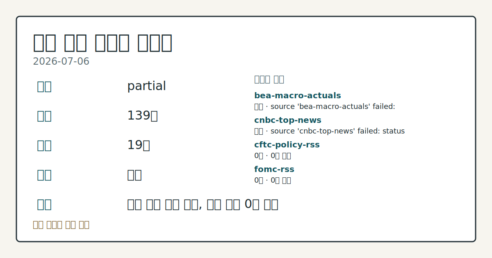
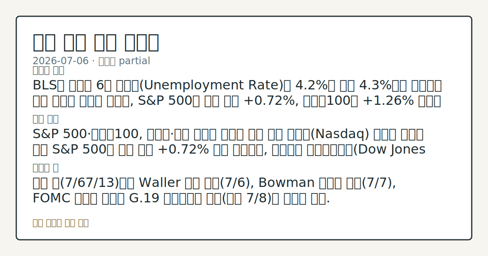
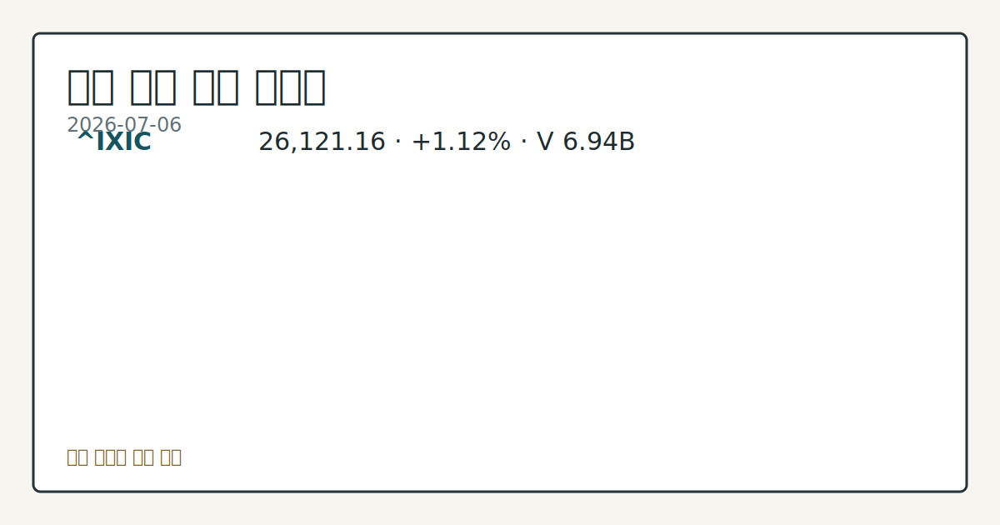

> 정보 제공용 자동 시황이며 매매 권유가 아닙니다.
# 2026-07-06 미국 증시 시황
**기준 시각**: 2026-07-06 NY · 2026-07-06T04:00Z, 2026-07-07T04:00Z)
| 종목 | 종가 | 변동 | 비고 |
|------|------|------|------|
| ^GSPC | 7,537.43 | +0.72% | -0.95% from 52w high · +9.90% YTD |
| ^IXIC | 26,121.16 | +1.12% | -3.59% from 52w high · +12.42% YTD |
| ^DJI | 53,055.91 | +0.29% | ATH 경신 · +9.66% YTD |
| AAPL | 312.66 | +1.31% | -0.81% from 52w high · +15.37% YTD |
| MSFT | 386.74 | -0.96% | +9.61% from 52w low · -18.23% YTD |
**세그먼트**: [국내 증시](../../../domestic-equity/2026/07/2026-07-06.md) | [미국 증시](2026-07-06.md) | [크립토](../../../crypto/2026/07/2026-07-06.md)

*이미지: 데이터 신뢰도 · 출처: investo 자체 생성 · 생성: investo 0.1.0 · 2026-07-06 UTC*
> **내 관심 자산 영향**: 16건 확인 (기본 바스켓) — AAPL: 직접 관련 · [nasdaq-symbol-directory] AAPL listing metadata: Apple Inc. - Common Stock; AAPL: 직접 관련 · [sec-company-facts] AAPL SEC company facts: Apple Inc.; AAPL: 직접 관련 · [yahoo-finance-news] Best Buy and Apple flag a price shock for shoppers; AMZN: 직접 관련 · [nasdaq-symbol-directory] AMZN listing metadata: Amazon.com, Inc. - Common Stock; AMZN: 직접 관련 · [sec-company-facts] AMZN SEC company facts: AMAZON COM INC 외
> **용어 가이드**: 이번 시황에서 처음 등장한 용어 — ESU26(미니 S&P 500 선물)
> **오늘의 결론**: BLS가 발표한 6월 실업률(Unemployment Rate)이 **4.2%**로 전월 **4.3%**에서 하락하며 고용 지표가 개선된 가운데, S&P 500은 전장 대비 **+0.72%**, 나스닥100은 **+1.26%** 오르며 반도체·대형 기술주 강세가 지수 상승을 이끌었다. 수집 근거가 제한적입니다
> **핵심 동인**: S&P 500·나스닥100, 반도체·대형 기술주 강세로 상승 마감 나스닥(Nasdaq) 기사에 따르면 이날 S&P 500은 전장 대비 **+0.72%** 상승 마감했고, 다우존스 산업평균지수(Dow Jones Industrial Average)는 **+0.29%**, 나스닥100은 **+1.26%** 올랐다.
> **주의할 점**: 이번 주(7/67/13)에는 Waller 이사 토론(7/6), Bowman 부의장 연설(7/7), FOMC 의사록 공개와 G.19 소비자신용 본문 참고.
## 한눈에 보기
미국 3대 지수 동반 상승, S&P 500(스탠더드앤드푸어스 500 지수) **+0.72%**·나스닥100(Nasdaq 100 Index) **+1.26%** 마감.
CFTC(미국 상품선물거래위원회) COT(투자자별 선물포지션 보고서) 기준 E-mini S&P 500 레버리지드머니 순포지션 **-360,469**계약으로 매도 우위 확인.
BLS(미국 노동통계국) 6월 실업률 **4.2**%로 전월 **4.3**%에서 하락 — 본문 §④ 참조.
## ⓪ 오늘의 매크로
**미 국채 수익률** — UST curve 2026-07-06: 10Y 4.48%, 2Y10Y +0.35pp
## ⓪-B 채널 기준선
| 기준선 | 값 |
|------|------|
| S&P 500 | 7,537.43 (+0.72%) |
| 나스닥 종합 | 26,121.16 (+1.12%) |
| 다우존스 | 53,055.91 (+0.29%) |
| CFTC 포지셔닝 | E-mini S&P 500 순포지션 -360469계약 (-18.32% OI), 2026-06-30 기준/2026-07-06 공개 · Nasdaq-100 mini 순포지션 -68617계약 (-24.63% OI), 2026-06-30 기준/2026-07-06 공개 · VIX futures 순포지션 -2017계약 (-0.57% OI), 2026-06-30 기준/2026-07-06 공개 · 주간 지연 |
> **크로스마켓 연결 고리**: 금리 이벤트가 할인율/달러 경로의 공통 변수로 남아 있습니다.
> **오늘의 큰 그림:** 금리와 달러 변수가 공통 변수지만, Nasdaq·Dow 섹터 변동성를 먼저 확인해야 합니다.
## ① 요약

*이미지: 시장 스냅샷 · 출처: investo 자체 생성 · 생성: investo 0.1.0 · 2026-07-06 UTC*

BLS가 발표한 6월 실업률이 **4.2**%로 전월 **4.3**%에서 하락하며 고용 지표가 개선된 가운데, S&P 500은 전장 대비 **+0.72%**, 나스닥100은 **+1.26%** 오르며 반도체·대형 기술주 강세가 지수 상승을 이끌었다. 다만 CFTC COT에서는 E-mini S&P 500·10Y 국채선물 등 주요 선물의 레버리지드머니 순포지션이 일제히 매도 우위를 나타냈고, SKEW(꼬리위험지수)도 **150.02**로 집계돼 지수 상승과 포지셔닝·꼬리위험 지표 사이에 온도차가 감지된다. [혼재]

## ② 전일 핵심 이슈

### S&P 500·나스닥100, 반도체·대형 기술주 강세로 상승 마감

나스닥(Nasdaq) 기사에 따르면 이날 S&P 500은 전장 대비 **+0.72%** 상승 마감했고, 다우존스 산업평균지수는 **+0.29%**, 나스닥100은 **+1.26%** 올랐다. 9월 만기 E-mini S&P 500 선물(ESU26, 미니 S&P 500 선물)도 **+0.82%** 상승해 지수 강세를 뒷받침했다. ([출처](https://www.nasdaq.com/articles/stock-indexes-settle-higher-big-tech-and-chip-stocks-rally))

> **그래서 의미는?** 반도체·대형 기술주가 지수 상승을 이끌며 최근 랠리 흐름이 이어졌습니다.

지난 7월 3일은 독립기념일 대체 휴장으로 거래가 없었고, 직전 랠리는 6월 30일 칩메이커 강세가 나스닥100을 끌어올렸던 흐름으로 거슬러 올라간다. 오늘 흐름은 그 반도체 주도 강세 테마의 연장으로 볼 수 있다.

## ③ 섹터/수급 동향

### 옵션·변동성 지표: VVIX·SKEW

Cboe(시카고옵션거래소) 기준 VVIX(변동성지수의 변동성)는 2026-07-06 종가 **87.09**를 기록했고([출처](https://cdn.cboe.com/api/global/us_indices/daily_prices/VVIX_History.csv)), SKEW는 직전 공표일인 2026-07-02 종가 기준 **150.02**로 집계됐다([출처](https://cdn.cboe.com/api/global/us_indices/daily_prices/SKEW_History.csv)).

> **그래서 의미는?** 지수는 상승했지만 꼬리위험 지표가 낮지 않아 급변동 가능성도 함께 점검할 필요가 있습니다.

### CFTC COT 포지셔닝

CFTC COT(주간 발표)에 따르면 레버리지드머니(leveraged money) 그룹의 순포지션은 10Y 국채선물이 **-1,969,851**계약(미결제약정의 **-37.5%**), E-mini S&P 500이 **-360,469**계약, 나스닥100 미니(Nasdaq-100 mini)가 **-68,617**계약, 미국 달러지수(U.S. Dollar Index)가 **-5,580**계약, VIX 선물이 **-2,017**계약으로 모두 순매도 우위를 나타냈다. 반면 매니지드머니(managed money) 그룹은 금(Gold)에서 **+120,091**계약, WTI(서부텍사스산원유)에서 **+81,282**계약 순매수를 기록했다(모두 [CFTC 공식 리포트](https://www.cftc.gov/MarketReports/CommitmentsofTraders/index.htm) 기준, 주간 집계로 일중 흐름과는 다름).

나스닥 기사들은 이날 반도체·AI 관련주 강세가 지수 전반을 지지했다고 전했다 — 한 기사는 S&P 500 **+0.43%**, 다우존스 **-0.04%**, 나스닥100 **+1.17%**를, 다른 기사는 S&P 500 **+0.60%**, 다우존스 **-0.08%**, 나스닥100 **+1.52%**를 각각 보도했다([출처1](https://www.nasdaq.com/articles/stock-indexes-supported-strength-chipmakers-and-ai-stocks), [출처2](https://www.nasdaq.com/articles/chip-stock-rally-boosts-broader-market)) — 시점별 스냅샷 차이로 다우존스 등락 부호가 엇갈렸다.

## ④ 지표·이벤트

### 기준금리·고용 지표

FRED(세인트루이스 연은 경제데이터) 기준 DFF(연방기금 실효금리)는 2026-07-03 기준 **3.63**%로 전일(2026-07-02) **3.63**%에서 변동이 없었다([출처](https://fred.stlouisfed.org/series/DFF)). UNRATE(실업률 지표)는 2026-06-01 기준 **4.2**%로 직전(2026-05-01) **4.3**%에서 하락했다([출처](https://fred.stlouisfed.org/series/UNRATE)).

> **그래서 의미는?** 금리는 그대로지만 실업률 지표는 소폭 개선된 모습입니다.

### BLS 6월 고용·물가 지표

BLS 발표에 따르면 2026년 6월 비농업 고용(Total nonfarm payroll employment)은 **158984**천 명으로 전월 **158927**천 명 대비 늘었고, 실업률(Unemployment Rate)은 **4.2**%로 전월 **4.3**%에서 하락했다. 평균 시간당 임금(Average hourly earnings)은 **37.64**달러(전월 **37.51**달러), 노동참가율(Labor Force Participation Rate)은 **61.5**%(전월 **61.8**%)였다. 5월 기준 CPI(소비자물가지수)는 **333.979**(전월 **332.407**), 근원 CPI(Core Consumer Price Index)는 **336.121**(전월 **335.423**), PPI(생산자물가지수, Producer Price Index Final Demand)는 **157.659**(전월 **156.011**), 구인건수(Job Openings)는 **7594**천 건(전월 **7585**천 건)으로 집계됐다(모두 [BLS](https://www.bls.gov/data/) 기준).

### 연준 일정

연방준비제도(Federal Reserve) 캘린더에 따르면 오늘(7/6) Christopher J. Waller 이사가 로마에서 정책 패널 토론에, 7/7 Michelle W. Bowman 부의장(감독 담당)이 금융안정위원회(FSB) 화상 행사에서 개회사를 예정하고 있다. 7/8에는 6월 16~17일 FOMC(연방공개시장위원회) 회의록(Minutes)이 공개되며, 같은 날 G.19(소비자신용 통계) 보고서도 발표된다(모두 [연준 캘린더](https://www.federalreserve.gov/newsevents/calendar.htm) 기준).

## ⑤ 주요 종목

<!-- u50 lightweight-charts-embed: placeholders consumed by site_docs/assets/investo-chart-init.js -->

<noscript><em>인터랙티브 차트는 JavaScript가 활성화된 환경에서 표시됩니다. 위 정적 카드가 동일한 정보를 담고 있습니다.</em></noscript>

*이미지: 가격 스냅샷 · 출처: investo 자체 생성 · 생성: investo 0.1.0 · 2026-07-06 UTC*

### 관심 워치리스트: AAPL·AMZN

SEC(미국 증권거래위원회) 공시 기준 AAPL(애플)은 거래소 Nasdaq, 최근 공시일 2026-06-17이며, 순이익 **61,110,000,000**달러, 희석 EPS(주당순이익) **4.05**달러, 자산총계 **359,241,000,000**달러를 기록했다([출처](https://data.sec.gov/submissions/CIK0000320193.json)). Yahoo Finance는 Best Buy와 Apple의 가격 관련 이슈를 다룬 기사를 게재했다(출처: yahoo-finance-news).

AMZN(아마존)은 최근 공시일 2026-07-02, 순이익 **65,944,000,000**달러, 희석 EPS **1.59**달러, 자산총계 **818,042,000,000**달러, 발행주식수 **10,757,109,436**주(2026-04-22 기준)로 나타났다([출처](https://data.sec.gov/submissions/CIK0001018724.json)).

> **그래서 의미는?** AAPL(애플)·AMZN 모두 최근 분기 공시가 확인되며 개별 수익성 지표 변화가 관찰됩니다.

### 실적 지표 확인 (기타 대형 기술주)

- GOOGL(알파벳): 매출 **90,234,000,000**달러, 순이익 **34,540,000,000**달러, 희석 EPS **2.81**달러([출처](https://data.sec.gov/submissions/CIK0001652044.json))
- META(메타 플랫폼스): 순이익 **16,644,000,000**달러, 희석 EPS **6.43**달러([출처](https://data.sec.gov/submissions/CIK0001326801.json))
- MSFT(마이크로소프트): 순이익 **74,599,000,000**달러, 희석 EPS **9.99**달러([출처](https://data.sec.gov/submissions/CIK0000789019.json))
- NVDA(엔비디아): 매출 **44,062,000,000**달러, 순이익 **18,775,000,000**달러, 희석 EPS **0.76**달러([출처](https://data.sec.gov/submissions/CIK0001045810.json))
- TSLA(테슬라): 매출 **19,335,000,000**달러, 순이익 **409,000,000**달러, 희석 EPS **0.12**달러([출처](https://data.sec.gov/submissions/CIK0001318605.json))

### 개별 종목 확인 항목

- NTNX(뉴타닉스) **$52.42**, **+2.22%**([출처](https://www.nasdaq.com/articles/nutanix-ntnx-surpasses-market-returns-some-facts-worth-knowing))
- NOW(서비스나우) **$107.93**, **+1.51%**([출처](https://www.nasdaq.com/articles/servicenow-now-outperforms-broader-market-what-you-need-know))
- MRVL(마벨 테크놀로지) **$249.3**, **+1.63%**([출처](https://www.nasdaq.com/articles/marvell-technology-mrvl-exceeds-market-returns-some-facts-consider))
- MA(마스터카드) **$533.1**, 하락하며 **1.17%** 변동폭([출처](https://www.nasdaq.com/articles/mastercard-ma-stock-dips-while-market-gains-key-facts))
- MRK(머크) **$126.78**, **-2.15%**([출처](https://www.nasdaq.com/articles/merck-mrk-stock-slides-market-rises-facts-know-you-trade))
- MRNA(모더나) **$81.76**, **+2.51%**([출처](https://www.nasdaq.com/articles/moderna-mrna-outpaces-stock-market-gains-what-you-should-know-0))
- KO(코카콜라) **$82.96**, **-1.4%**([출처](https://www.nasdaq.com/articles/coca-cola-ko-stock-sinks-market-gains-heres-why))

## ⑥ 오늘의 관전 포인트

> **관전 포인트**: 구조화 가능한 관찰 신호가 부족합니다 — 본문 §②·§④ 참조

> **데이터 상태**: 부분

수집/품질 진단

> **데이터 상태**: 부분 — 수집 139건 / 소스 19개 / 누락: 없음 · 부분 — 일부 카테고리 미수집, 본문 일부 결론 보강 필요
> **소스 카운트**: 수집 대상 25 / 성공 19 / 수집 상세는 진단 섹션에서 확인할 수 있습니다. / 수집 상세는 진단 섹션에서 확인할 수 있습니다. / 수집 상세는 진단 섹션에서 확인할 수 있습니다.
> **소스 등급 분포**: S=11 / A=8
> **상세 사유**: 일부 소스 수집 실패, 일부 소스 0건 반환
> **소스별 상태**: bea-macro-actuals 실패 (설정 미완료(미수집)), cnbc-top-news 실패 (접근 제한), cftc-policy-rss 0건, fomc-rss 0건, nasdaq-earnings-calendar 0건, stooq-price 0건, 정상 19개

## ⑦ 면책조항
본 시황은 일반 정보 제공을 목적으로 자동 생성된 자료이며,
특정 종목·자산에 대한 매매 권유나 투자 자문이 아닙니다.
투자 결정과 그 결과에 대한 책임은 전적으로 본인에게 있으며,
본 시황의 내용에 따라 발생한 손실에 대해 작성자는 일체의 책임을 지지 않습니다.