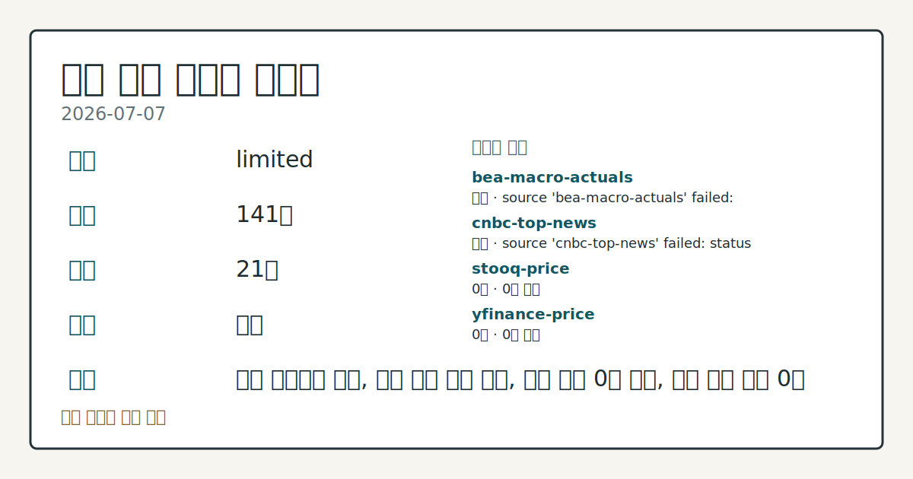
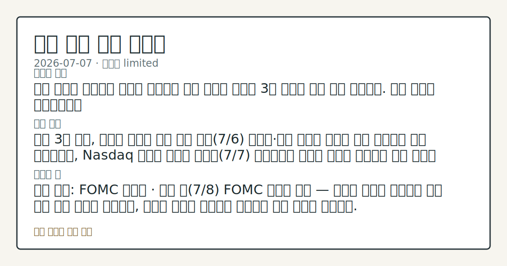

> 정보 제공용 자동 시황이며 매매 권유가 아닙니다.
# 2026-07-07 미국 증시 시황
**기준 시각**: 2026-07-07 NY · 2026-07-07T04:00Z, 2026-07-08T04:00Z)
| 종목 | 종가 | 변동 | 비고 |
|------|------|------|------|
| ^GSPC | 7,503.85 | -0.45% | -1.39% from 52w high · +9.41% YTD |
| ^IXIC | 25,818.69 | -1.16% | -4.71% from 52w high · +11.12% YTD |
| ^DJI | 52,925.15 | -0.25% | -0.25% from 52w high · +9.39% YTD |
| AAPL | 310.66 | -0.64% | -1.44% from 52w high · +14.63% YTD |
| MSFT | 388.84 | +0.54% | +10.21% from 52w low · -17.78% YTD |
**세그먼트**: [국내 증시](../../../domestic-equity/2026/07/2026-07-07.md) | [미국 증시](2026-07-07.md) | 크립토(미발행)

*이미지: 데이터 신뢰도 · 출처: investo 자체 생성 · 생성: investo 0.1.0 · 2026-07-07 UTC*
> **내 관심 자산 영향**: 데이터 수집 부족으로 매칭 판단 보류 — 추가 수집 후 재평가됩니다.
> **용어 가이드**: 이번 시황에서 처음 등장한 용어 — DXY(달러지수), EIA(에너지정보청), 시가총액(시장가치)
> **오늘의 결론**: 미국 증시는 반도체주 약세와 국제유가 상승 부담이 겹치며 3대 지수가 동반 하락 마감했다. 수집 근거가 제한적입니다
> **핵심 동인**: 미국 3대 지수, 반도체 약세에 하락 마감 전일(7/6) 반도체·대형 기술주 강세로 상승 마감했던 것과 대조적으로, Nasdaq 기사에 따르면 화요일(7/7) 뉴욕증시는 칩스톡 약세와 국제유가 상승 부담이 겹치며 S&P 500($SPX)이 **-0.45%**, 다우존스산업평균($DOWI)이 **-0.25%**, 나스닥100($IUXX)이 **-1.77%**로 각각 하락 마감했다.
> **주의할 점**: 확인 소스: FOMC 캘린더 · 이번 주(7/8) FOMC 의사록 공개 — 매파적 문구가 부각되면 금리 인하 기대 후퇴로 해석하고, 완화적 문구가 본문 참고.
## 한눈에 보기
미국 3대 지수, 반도체주 약세와 유가 상승 부담에 동반 하락 마감 — S&P 500 **-0.45%**, 다우존스산업평균 **-0.25%**, 나스닥100 **-1.77%**.
BLS(노동통계국) 발표 UNRATE(실업률)가 전월 대비 **-0.1%p** 개선된 **4.2%**로 집계.
CFTC COT 기준 **10Y** 국채선물 레버리지드머니 순포지션이 OI 대비 **-37.5%**로 숏 쏠림 — 본문 §③ 참조.
## ⓪ 오늘의 매크로
**미 국채 수익률** — UST curve 2026-07-07: 10Y 4.55%, 2Y10Y +0.36pp
## ⓪-B 채널 기준선
| 기준선 | 값 |
|------|------|
| S&P 500 | 7,503.85 (-0.45%) |
| 나스닥 종합 | 25,818.69 (-1.16%) |
| 다우존스 | 52,925.15 (-0.25%) |
| CFTC 포지셔닝 | E-mini S&P 500 순포지션 -360469계약 (-18.32% OI), 2026-06-30 기준/2026-07-06 공개 · Nasdaq-100 mini 순포지션 -68617계약 (-24.63% OI), 2026-06-30 기준/2026-07-06 공개 · VIX futures 순포지션 -2017계약 (-0.57% OI), 2026-06-30 기준/2026-07-06 공개 · 주간 지연 |
> **크로스마켓 연결 고리**: 금리 이벤트가 할인율/달러 경로의 공통 변수로 남아 있습니다.
> **오늘의 큰 그림:** 이 세그먼트의 공통 신호는 제한적입니다. 본문 수급·지표 항목을 먼저 확인하세요.
## ① 요약

*이미지: 시장 스냅샷 · 출처: investo 자체 생성 · 생성: investo 0.1.0 · 2026-07-07 UTC*

미국 증시는 반도체주 약세와 국제유가 상승 부담이 겹치며 3대 지수가 동반 하락 마감했다. S&P 500은 **-0.45%**, 다우존스산업평균은 **-0.25%**, 나스닥100은 **-1.77%**로 마감했으며, Cboe VVIX(변동성지수의 변동성지수)는 87.90으로 집계돼 변동성 경계가 이어졌다. BLS는 UNRATE(실업률)가 전월 대비 **-0.1%p** 개선된 **4.2%**로 집계됐다고 발표했다. 채권·주가지수 선물의 투기적 포지션은 최신 주간 선물포지션 보고서 기준 숏 쏠림이 뚜렷했던 반면 금·원유는 롱 우위를 보여 안전자산 선호가 동시에 관찰됐다. [하락 관찰]

## ② 전일 핵심 이슈

### 미국 3대 지수, 반도체 약세에 하락 마감

전일(7/6) 반도체·대형 기술주 강세로 상승 마감했던 것과 대조적으로, [Nasdaq 기사](https://www.nasdaq.com/articles/stock-indexes-fall-chip-stocks-sink-and-crude-soars)에 따르면 화요일(7/7) 뉴욕증시는 칩스톡 약세와 국제유가 상승 부담이 겹치며 S&P 500이 **-0.45%**, 다우존스산업평균이 **-0.25%**, 나스닥100이 **-1.77%**로 각각 하락 마감했다. 9월물 미니 S&P 500 선물(ESU26, 9월물 미니 S&P 500 선물)도 **-0.52%** 밀리며 약세 분위기를 반영했다.

> **그래서 의미는?** 반도체 약세가 지수 전반을 끌어내려 어제의 상승 흐름이 하루 만에 반전됐다.

### 달러 강세·유가 상승 동반

[Dollar Firms 기사](https://www.nasdaq.com/articles/dollar-firms-stock-weakness-and-hawkish-williams)는 증시 약세 속 안전자산 수요로 달러인덱스(DXY, 달러지수)가 오늘 **+0.13%** 올랐고, 뉴욕 연은 존 윌리엄스 총재의 매파적 발언도 달러를 지지했다고 전했다. 같은 흐름을 다룬 [Dollar Edges Up 기사](https://www.nasdaq.com/articles/dollar-edges-weak-stocks-and-crude-oil-strength)는 화요일 DXY 상승폭을 **+0.24%**로 별도 보도했으며, 국제유가 상승이 인플레이션 기대를 자극해 연준이 긴축 기조를 유지할 명분이 될 수 있다고 지적했다. [Stock Indexes Fall as Chip Stocks Sink and Crude Soars 기사](https://www.nasdaq.com/articles/stock-indexes-fall-chip-stocks-sink-and-crude-soars) 역시 유가 급등을 지수 하락 배경 중 하나로 꼽았다.

## ③ 섹터/수급 동향

### CFTC 주간 포지셔닝(COT)

[CFTC(상품선물거래위원회) COT(투자자별 선물포지션 보고서)](https://www.cftc.gov/MarketReports/CommitmentsofTraders/index.htm)에 따르면 10Y 국채선물의 레버리지드머니(leveraged money, 투기적 포지션)는 롱 354,091계약·숏 2,323,942계약으로 순 -1,969,851계약(OI(미결제약정) 대비 **-37.5%**) 숏 우위를 나타냈다. E-mini S&P 500 선물도 레버리지드머니 순 -360,469계약(OI 대비 **-18.3%**)으로 숏 우위였고, 나스닥100 미니 선물 역시 순 -68,617계약(OI 대비 **-24.6%**)으로 집계됐다. 반면 금(Gold)은 매니지드머니(managed money, 자산운용사 포지션) 순 +120,091계약(OI 대비 **+32.5%**) 롱 우위, WTI 원유도 매니지드머니 순 +81,282계약(OI 대비 **+4.2%**) 롱 우위를 보였다. 달러인덱스 선물은 레버리지드머니 순 -5,580계약(OI 대비 **-10.3%**), VIX 선물은 순 -2,017계약(OI 대비 **-0.6%**)으로 상대적으로 균형에 가까웠다.

> **그래서 의미는?** 채권·주가지수는 숏 쏠림, 금·원유는 롱 쏠림으로 안전자산 선호가 감지된다.

### 변동성 지표

[Cboe VVIX](https://cdn.cboe.com/api/global/us_indices/daily_prices/VVIX_History.csv)는 2026-07-07 기준 87.90, [Cboe SKEW(꼬리위험지수)](https://cdn.cboe.com/api/global/us_indices/daily_prices/SKEW_History.csv)는 2026-07-06 기준 145.38로 각각 공식 종가 집계됐다.

### EIA 주간 석유 재고

[EIA 주간 석유현황보고서(WPSR, 주간 석유현황보고서)](https://www.eia.gov/petroleum/supply/weekly/) 2026-06-26 집계 기준, SPR(전략비축유) 제외 상업용 원유 수입은 **5279** MBBL/D(하루 천배럴), 상업용 원유 재고는 408,359천배럴, 정제유(distillate) 재고는 108,599천배럴, 정유 가동률은 **96.6%**, 총 휘발유 재고는 213,966천배럴로 집계됐다.

## ④ 지표·이벤트

### 고용·물가 지표

[FRED](https://fred.stlouisfed.org/series/DFF) 기준 연방기금금리 DFF(연방기금금리)는 **3.63%**로 전일 대비 변동이 없었다(prior 3.63). [FRED UNRATE(실업률)](https://fred.stlouisfed.org/series/UNRATE)는 **4.2%**로 전월(**4.3%**) 대비 **-0.1%p** 하락했다(2026-06-01 기준 발표). 이는 최근 컨텍스트의 6월 고용지표 흐름과 같은 방향으로, 오늘 데이터는 새로운 방향 전환 신호 없이 어제 흐름을 연장했다.

[BLS](https://www.bls.gov/data/) 데이터에 따르면 2026년 6월 비농업부문 고용은 158,984천 명(전월 158,927천 명), 실업률은 **4.2%**(전월 **4.3%**), 노동참가율은 **61.5%**(전월 **61.8%**)로 집계됐다. 시간당 평균임금은 37.64달러(전월 37.51달러)였다. 2026년 5월 CPI(소비자물가지수)는 333.979(전월 332.407), 근원 CPI는 336.121(전월 335.423), PPI(생산자물가지수) 최종수요는 157.659(전월 156.011)로 각각 발표됐다. 5월 구인건수(Job Openings)는 7,594천 건(전월 7,585천 건)이었다.

> **그래서 의미는?** 고용지표는 개선됐지만 다음 주 FOMC 의사록 톤이 추가 확인 변수다.

### FOMC 일정

[FOMC(연방공개시장위원회) 캘린더](https://www.federalreserve.gov/newsevents/calendar.htm)에 따르면 **2026-07-08**에 FOMC 의사록(Minutes, 6월 16~17일 회의분) 공개와 소비자신용(G.19) 발표가 예정돼 있고, **2026-07-15**에는 베이지북(Beige Book, 지역경제동향보고서) 공개, **2026-07-17**에는 산업생산·가동률(G.17) 발표가 예정됐다.

## ⑤ 주요 종목

<!-- u50 lightweight-charts-embed: placeholders consumed by site_docs/assets/investo-chart-init.js -->

<noscript><em>인터랙티브 차트는 JavaScript가 활성화된 환경에서 표시됩니다. 위 정적 카드가 동일한 정보를 담고 있습니다.</em></noscript>

### 실적 발표 예정

| 티커 | 발표시점 | EPS(주당순이익) 예상 | 전년 EPS | 시가총액 |
|---|---|---|---|---|
| [EPAC](https://www.nasdaq.com/market-activity/stocks/epac/earnings) | 장마감 후 | $0.49 | $0.51 | $1,814,834,980 |
| [KRUS](https://www.nasdaq.com/market-activity/stocks/krus/earnings) | 장마감 후 | -$0.05 | $0.05 | $681,617,659 |
| [PENG](https://www.nasdaq.com/market-activity/stocks/peng/earnings) | 장마감 후 | $0.49 | $0.28 | $3,436,113,767 |
| [SAR](https://www.nasdaq.com/market-activity/stocks/sar/earnings) | 장마감 후 | $0.54 | $0.66 | $348,455,162 |

> **그래서 의미는?** 실적·재무 데이터는 개별 종목 확인용이며 지수 방향과는 별개로 봐야 한다.

### SEC(증권거래위원회) 재무 데이터 확인 (대형 기술주)

| 티커 | 최근 공시 | 순이익(기준일) | 희석 EPS(기준일) |
|---|---|---|---|
| [AAPL](https://data.sec.gov/submissions/CIK0000320193.json)(애플) | Form 4(임원·주요주주 지분변동 보고), 2026-06-17 | $61,110,000,000 (2025-03-29) | 4.05 |
| [AMZN](https://data.sec.gov/submissions/CIK0001018724.json)(아마존) | FWP(자유기술서), 2026-07-07 | $65,944,000,000  | 1.59 |
| [GOOGL](https://data.sec.gov/submissions/CIK0001652044.json)(알파벳) | Form 4, 2026-07-06 | $34,540,000,000  | 2.81 |
| [META](https://data.sec.gov/submissions/CIK0001326801.json)(메타) | Form 4, 2026-07-06 | $16,644,000,000  | 6.43 |
| [MSFT](https://data.sec.gov/submissions/CIK0000789019.json)(마이크로소프트) | PX14A6G(위임장 관련 서신), 2026-07-02 | $74,599,000,000  | 9.99 |
| [NVDA](https://data.sec.gov/submissions/CIK0001045810.json)(엔비디아) | Form 4, 2026-07-06 | $18,775,000,000  | 0.76 |
| [TSLA](https://data.sec.gov/submissions/CIK0001318605.json)(테슬라) | 8-K(수시공시), 2026-07-02 | $409,000,000  | 0.12 |

### 시장 대비 등락 확인

- [OSPN](https://www.nasdaq.com/articles/onespan-ospn-registers-bigger-fall-market-important-facts-note)(원스팬): **$14.82**, **-1.79%**
- [SKYT](https://www.nasdaq.com/articles/skywater-technology-inc-skyt-suffers-larger-drop-general-market-key-insights-0)(스카이워터 테크놀로지): **$33.38**, **-2.08%**
- [SPOT](https://www.nasdaq.com/articles/spotify-spot-gains-market-dips-what-you-should-know)(스포티파이): **$493.95**, **+2.26%**

## ⑥ 오늘의 관전 포인트

> **관전 포인트**: 구조화 가능한 관찰 신호가 부족합니다 — 본문 §②·§④ 참조

> **데이터 상태**: 제한

수집/품질 진단

> **데이터 상태**: 제한 — 수집 141건 / 소스 21개 / 누락: 가격 · 제한 — 핵심 가격 소스 0건/실패/stale, 본문 결론 신뢰도 낮음
> **소스 카운트**: 수집 대상 25 / 성공 21 / 수집 상세는 진단 섹션에서 확인할 수 있습니다. / 수집 상세는 진단 섹션에서 확인할 수 있습니다. / 수집 상세는 진단 섹션에서 확인할 수 있습니다.
> **소스 등급 분포**: S=13 / A=8
> **상세 사유**: 가격 카테고리 누락, 일부 소스 수집 실패, 일부 소스 0건 반환, 핵심 가격 소스 0건
> **소스별 상태**: bea-macro-actuals 실패 (설정 미완료(미수집)), cnbc-top-news 실패 (접근 제한), stooq-price 0건, yfinance-price 0건, 정상 21개

## ⑦ 면책조항
본 시황은 일반 정보 제공을 목적으로 자동 생성된 자료이며,
특정 종목·자산에 대한 매매 권유나 투자 자문이 아닙니다.
투자 결정과 그 결과에 대한 책임은 전적으로 본인에게 있으며,
본 시황의 내용에 따라 발생한 손실에 대해 작성자는 일체의 책임을 지지 않습니다.