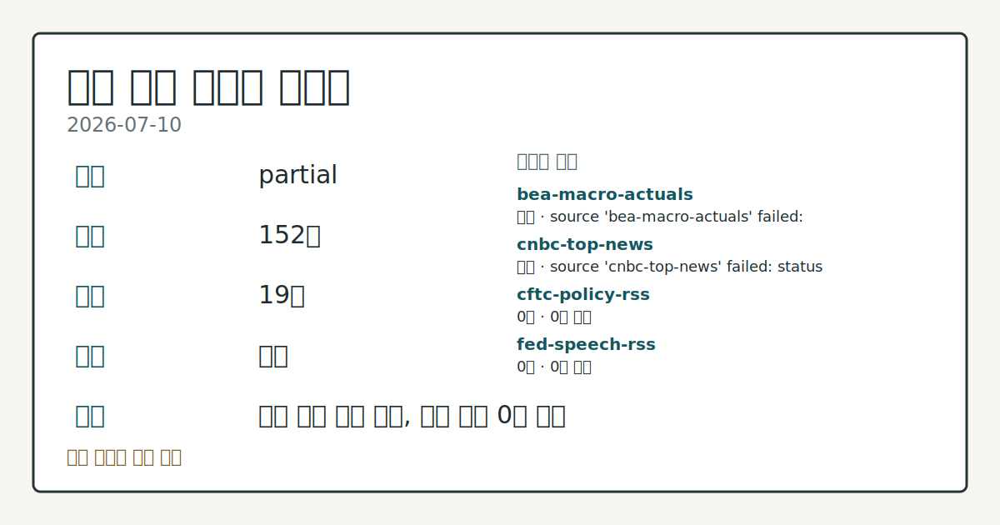
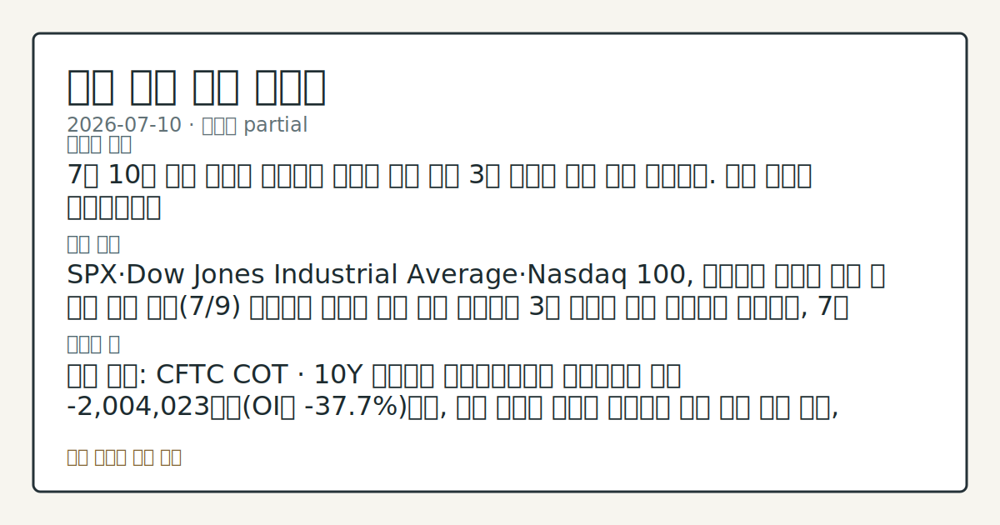
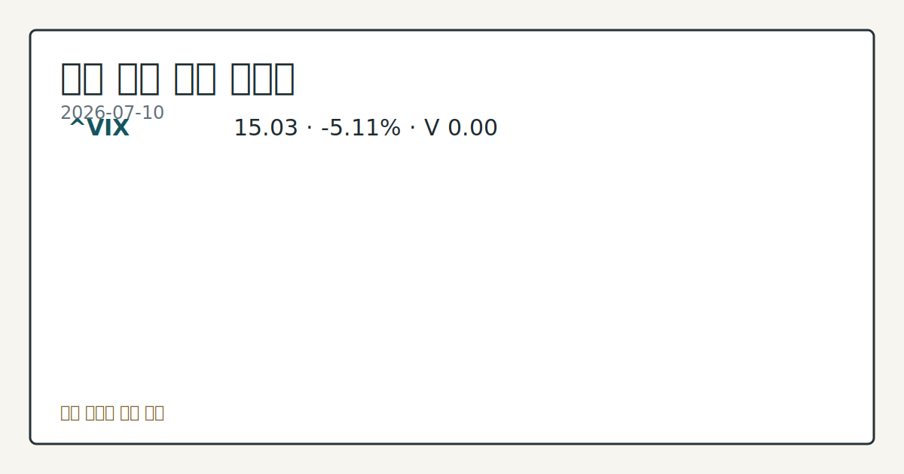

> 정보 제공용 자동 시황이며 매매 권유가 아닙니다.
# 2026-07-10 미국 증시 시황
**기준 시각**: 2026-07-10 NY · 2026-07-10T04:00Z, 2026-07-11T04:00Z)
| 종목 | 종가 | 변동 | 비고 |
|------|------|------|------|
| ^GSPC | 7,575.39 | +0.42% | -0.45% from 52w high · +10.45% YTD |
| ^IXIC | 26,281.61 | +0.29% | -3.00% from 52w high · +13.11% YTD |
| ^DJI | 52,637.01 | +0.29% | -0.79% from 52w high · +8.79% YTD |
| AAPL | 315.32 | -0.28% | -0.28% from 52w high · +16.35% YTD |
| MSFT | 385.10 | +0.19% | +9.15% from 52w low · -18.57% YTD |
**세그먼트**: [국내 증시](../../../domestic-equity/2026/07/2026-07-10.md) | [미국 증시](2026-07-10.md) | 크립토(미발행)

*이미지: 데이터 신뢰도 · 출처: investo 자체 생성 · 생성: investo 0.1.0 · 2026-07-11 UTC*
> **내 관심 자산 영향**: 14건 확인 (기본 바스켓) — AAPL: 직접 관련 · [nasdaq-symbol-directory] AAPL listing metadata: Apple Inc. - Common Stock; AAPL: 직접 관련 · [sec-company-facts] AAPL SEC company facts: Apple Inc.; AMZN: 직접 관련 · [nasdaq-symbol-directory] AMZN listing metadata: Amazon.com, Inc. - Common Stock; AMZN: 직접 관련 · [sec-company-facts] AMZN SEC company facts: AMAZON COM INC; GOOGL: 직접 관련 · [nasdaq-symbol-directory] GOOGL listing metadata: Alphabet Inc. - Class A Common Stock 외
> **오늘의 결론**: 7월 10일 미국 증시는 지정학적 리스크 완화 속에 3대 지수가 동반 상승 마감했다. 수집 근거가 제한적입니다
> **핵심 동인**: SPX·Dow Jones Industrial Average·Nasdaq 100, 지정학적 리스크 완화 속 동반 상승 전일(7/9) 반도체주 약세와 유가 상승 부담으로 3대 지수가 동반 하락했던 흐름에서, 7월 10일에는 지정학적 리스크가 완화되며 흐름이 전환됐다.
> **주의할 점**: 확인 소스: CFTC COT · 10Y 국채선물 레버리지드머니 순포지션은 현재 -2,004,023계약(OI의 **-37.7%**)으로, 순숏 규모가 본문 참고.
## 한눈에 보기
미국 3대 지수가 **+0.42%**(S&P 500) · **+0.29%**(Dow Jones Industrial Average) · **+0.33%**(Nasdaq 100) 상승 마감, 지정학적 리스크 완화가 배경.
CFTC(상품선물거래위원회) COT(선물포지션 보고서) 기준 10Y 국채선물 레버리지드머니 순포지션이 미결제약정(OI) 대비 **-37.7%**로 순숏 우위, E-mini S&P 500도 **-18.4%** 순숏.
이번 주 **7월 13일** FOMC(연방공개시장위원회) 인사 연설과 **7월 14~15일** CPI(소비자물가지수)·PPI(생산자물가지수) 발표가 변동성 변수 — 본문 §④/§⑥ 참조.
## ⓪ 오늘의 매크로
**국제 유가** — CFTC WTI crude oil managed_money net +64041 contracts
**미 국채 수익률** — UST curve 2026-07-10: 10Y 4.56%, 2Y10Y +0.35pp
## ⓪-B 채널 기준선
| 기준선 | 값 |
|------|------|
| S&P 500 | 7,575.39 (+0.42%) |
| 나스닥 종합 | 26,281.61 (+0.29%) |
| 다우존스 | 52,637.01 (+0.29%) |
| CFTC 포지셔닝 | E-mini S&P 500 순포지션 -361875계약 (-18.37% OI), 2026-07-07 기준/2026-07-10 공개 · Nasdaq-100 mini 순포지션 -55013계약 (-19.30% OI), 2026-07-07 기준/2026-07-10 공개 · VIX futures 순포지션 5112계약 (1.37% OI), 2026-07-07 기준/2026-07-10 공개 · 주간 지연 |
> **크로스마켓 연결 고리**: 유가/지정학 이슈가 여러 자산군의 변동성 연결 고리로 관찰됩니다. / 금리 이벤트가 할인율/달러 경로의 공통 변수로 남아 있습니다.
> **오늘의 큰 그림:** 유가와 지정학 변수가 공통 변수지만, 섹터·실적 변동성를 먼저 확인해야 합니다.
## ① 요약

*이미지: 시장 스냅샷 · 출처: investo 자체 생성 · 생성: investo 0.1.0 · 2026-07-11 UTC*

7월 10일 미국 증시는 지정학적 리스크 완화 속에 3대 지수가 동반 상승 마감했다. S&P 500(스탠더드앤드푸어스 500 지수)은 **+0.42%**, Dow Jones Industrial Average는 **+0.29%**, Nasdaq 100 Index는 **+0.33%** 각각 상승했다([Nasdaq](https://www.nasdaq.com/articles/stock-indexes-settle-higher-geopolitical-risks-ease)). CFTC COT 기준으로는 E-mini S&P 500·10Y 국채선물 모두 레버리지드머니 순숏이 유지돼 수급은 여전히 방어적이다([CFTC](https://www.cftc.gov/MarketReports/CommitmentsofTraders/index.htm)). FRED(세인트루이스 연은 경제데이터) 기준 DFF(연방기금금리)는 **3.62%**로 동결, UNRATE(실업률)는 **4.2%**로 전월 대비 하락했다([FRED](https://fred.stlouisfed.org/series/UNRATE)). 이번 주는 FOMC 인사 발언과 물가지표 발표가 예정돼 변동성 변수로 남아 있다. [상승 관찰]

## ② 전일 핵심 이슈

### SPX·Dow Jones Industrial Average·Nasdaq 100, 지정학적 리스크 완화 속 동반 상승

전일(7/9) 반도체주 약세와 유가 상승 부담으로 3대 지수가 동반 하락했던 흐름에서, 7월 10일에는 지정학적 리스크가 완화되며 흐름이 전환됐다. CFTC COT 상 레버리지드머니의 E-mini S&P 500 순숏 포지션이 여전히 -361,875계약(OI의 **-18.4%**)에 머무르는 등 수급상 보수적 태도가 이어지는 가운데도 매수세가 유입된 점이 특징적이다. Nasdaq 기사에 따르면 S&P 500은 **+0.42%**, Dow Jones Industrial Average는 **+0.29%**, Nasdaq 100 Index는 **+0.33%** 상승했으며, September E-mini S&P futures(ESU26, 9월물 미니 S&P 500 선물)도 **+0.43%** 올랐다([Nasdaq](https://www.nasdaq.com/articles/stock-indexes-settle-higher-geopolitical-risks-ease)).

> **그래서 의미는?** 지정학적 긴장 완화가 위험자산 선호를 되살려 전일 하락분을 되돌렸습니다.

## ③ 섹터/수급 동향

### 레버리지드머니 선물 포지션, 대형지수·국채 순숏 우위 지속

CFTC 최신 COT에 따르면, 레버리지드머니는 10Y 국채선물에서 순숏 -2,004,023계약, E-mini S&P 500에서 순숏 -361,875계약, Nasdaq-100 mini에서 순숏 -55,013계약(**-19.3%**), U.S. Dollar Index에서 순숏 -4,454계약(**-8.3%**)을 각각 기록했다([CFTC](https://www.cftc.gov/MarketReports/CommitmentsofTraders/index.htm)). 반면 VIX(변동성지수) 선물은 순매수 +5,112계약(**+1.4%**)으로 소폭 우위를 보여, 변동성 헤지 수요가 미세하게 남아 있음을 시사한다.

> **그래서 의미는?** 대형지수·국채 선물에서 기관 자금이 여전히 방어적 포지션을 유지하고 있다는 신호입니다.

### 유가 하락이 위험자산 심리 지지

Nasdaq 기사에 따르면 이날 장중 S&P 500은 **+0.19%**, Dow Jones Industrial Average는 **+0.11%**, Nasdaq 100 Index는 **+0.03%** 상승했으며, 지정학적 리스크 완화에 따른 유가 하락이 위험자산 심리를 지지했다([Nasdaq](https://www.nasdaq.com/articles/stocks-supported-lower-crude-prices-geopolitical-risks-ease)). September E-mini S&P futures도 **+0.19%** 상승해 선물시장에서도 유사한 흐름이 확인된다.

## ④ 지표·이벤트

### DFF(연방기금금리)·UNRATE, 정책금리·고용 지표 확인

FRED 기준 DFF는 **3.62%**로 전일(7/8) 대비 변화가 없었다([FRED DFF](https://fred.stlouisfed.org/series/DFF)). UNRATE는 **4.2%**로 전월(5월) **4.3%**에서 하락했다([FRED UNRATE](https://fred.stlouisfed.org/series/UNRATE)).

> **그래서 의미는?** 금리는 동결 유지, 실업률은 소폭 개선되며 노동시장이 안정적임을 시사합니다.

### BLS(노동통계국) 6월 고용·물가 지표

BLS 발표에 따르면 6월 시간당 평균 임금(Average hourly earnings)은 **$37.64**(전월 **$37.51**), 6월 비농업 고용(Total nonfarm payroll employment)은 158,984천 명(전월 158,927천 명), 6월 실업률(Unemployment Rate)은 **4.2%**(전월 **4.3%**), 6월 노동참가율(Labor Force Participation Rate)은 **61.5%**(전월 **61.8%**)로 각각 집계됐다. 5월 CPI는 333.979(전월 332.407), Core CPI(근원 소비자물가지수)는 336.121(전월 335.423), PPI는 157.659(전월 156.011), 5월 구인건수(Job Openings)는 7,594(전월 7,585)로 나타났다([BLS](https://www.bls.gov/data/)).

### Cboe 변동성 지표 확인

Cboe SKEW(테일리스크지수)는 144.27, VVIX(변동성의 변동성지수)는 87.28로 각각 발표됐다(공식 일간 종가 기준)([SKEW](https://cdn.cboe.com/api/global/us_indices/daily_prices/SKEW_History.csv), [VVIX](https://cdn.cboe.com/api/global/us_indices/daily_prices/VVIX_History.csv)).

### FOMC 인사 연설 일정

7월 13일 Christopher J. Waller 이사가 뉴욕에서 "A Conversation with Governor Waller" 연설(경제전망 주제, 오후 12:30)을, Michelle W. Bowman 부의장이 Bank Policy Institute 라운드테이블에서 금융규제 현대화 관련 화상 연설(오전 5:25)을 각각 예정하고 있다([Fed 캘린더](https://www.federalreserve.gov/newsevents/calendar.htm)).

## ⑤ 주요 종목

<!-- u50 lightweight-charts-embed: placeholders consumed by site_docs/assets/investo-chart-init.js -->

<noscript><em>인터랙티브 차트는 JavaScript가 활성화된 환경에서 표시됩니다. 위 정적 카드가 동일한 정보를 담고 있습니다.</em></noscript>

*이미지: 가격 스냅샷 · 출처: investo 자체 생성 · 생성: investo 0.1.0 · 2026-07-11 UTC*

### 관심종목 확인: AAPL·AMZN·GOOGL 상장정보 매칭

Watchlist에 매칭된 AAPL(애플), AMZN(아마존), GOOGL(알파벳)은 Nasdaq 상장 종목으로 확인됐다(listing_type=nasdaq, exchange=NASDAQ)([Nasdaq Symbol Directory](https://www.nasdaqtrader.com/dynamic/SymDir/nasdaqlisted.txt)). SEC(증권거래위원회) 공시 기준으로도 세 종목 데이터가 확인된다: AAPL은 최근 Form 4가 2026-06-17 제출됐고 순이익 **$61,110,000,000**(2025-03-29 기준), 희석 주당순이익(EPS, 주당순이익) **$4.05**가 보고됐다([SEC](https://data.sec.gov/submissions/CIK0000320193.json)). AMZN은 8-K(수시공시 서식)가 2026-07-09 제출됐고 순이익 **$65,944,000,000**(2025-03-31), 희석 EPS **$1.59**, 발행주식수(shares outstanding) 10,757,109,436주(2026-04-22)가 확인된다([SEC](https://data.sec.gov/submissions/CIK0001018724.json)). GOOGL은 Form 144가 2026-07-09 제출됐고 매출 **$90,234,000,000**(2025-03-31), 순이익 **$34,540,000,000**, 희석 EPS **$2.81**이 보고됐다([SEC](https://data.sec.gov/submissions/CIK0001652044.json)).

> **그래서 의미는?** AAPL(애플)·AMZN·GOOGL 모두 상장·공시 데이터가 정상적으로 확인되는 관심종목입니다.

### 실적·공시 확인 항목

DAL(델타항공)은 개장 전 실적 발표가 예정돼 있으며 EPS 컨센서스는 **$1.51**, 시가총액은 **$58,472,496,260**, 전년 동기 EPS는 **$2.10**였다([Nasdaq](https://www.nasdaq.com/market-activity/stocks/dal/earnings)). META·MSFT·NVDA·TSLA도 SEC 공시 데이터가 확인된다: META는 순이익 **$16,644,000,000**·희석 EPS **$6.43**(2025-03-31)([SEC](https://data.sec.gov/submissions/CIK0001326801.json)), MSFT는 순이익 **$74,599,000,000**·희석 EPS **$9.99**(2025-03-31)([SEC](https://data.sec.gov/submissions/CIK0000789019.json)), NVDA는 순이익 **$18,775,000,000**·희석 EPS **$0.76**(2025-04-27)([SEC](https://data.sec.gov/submissions/CIK0001045810.json)), TSLA는 순이익 **$409,000,000**·희석 EPS **$0.12**(2025-03-31)([SEC](https://data.sec.gov/submissions/CIK0001318605.json))로 각각 보고됐다. Cognizant Technology Solutions는 2026-07-10 Regulation FD 공시 및 재무제표/exhibit 관련 8-K를 제출했다([SEC EDGAR](https://www.sec.gov/Archives/edgar/data/1058290/000105829026000025/0001058290-26-000025-index.htm)).

## ⑥ 오늘의 관전 포인트

> **관전 포인트**: 구조화 가능한 관찰 신호가 부족합니다 — 본문 §②·§④ 참조

> **데이터 상태**: 부분

수집/품질 진단

> **데이터 상태**: 부분 — 수집 152건 / 소스 19개 / 누락: 없음 · 부분 — 일부 카테고리 미수집, 본문 일부 결론 보강 필요
> **소스 카운트**: 수집 대상 25 / 성공 19 / 수집 상세는 진단 섹션에서 확인할 수 있습니다. / 수집 상세는 진단 섹션에서 확인할 수 있습니다. / 수집 상세는 진단 섹션에서 확인할 수 있습니다.
> **소스 등급 분포**: S=10 / A=9
> **상세 사유**: 일부 소스 수집 실패, 일부 소스 0건 반환
> **소스별 상태**: bea-macro-actuals 실패 (설정 미완료(미수집)), cnbc-top-news 실패 (접근 제한), cftc-policy-rss 0건, fed-speech-rss 0건, fomc-rss 0건, stooq-price 0건, 정상 19개

## ⑦ 면책조항
본 시황은 일반 정보 제공을 목적으로 자동 생성된 자료이며,
특정 종목·자산에 대한 매매 권유나 투자 자문이 아닙니다.
투자 결정과 그 결과에 대한 책임은 전적으로 본인에게 있으며,
본 시황의 내용에 따라 발생한 손실에 대해 작성자는 일체의 책임을 지지 않습니다.