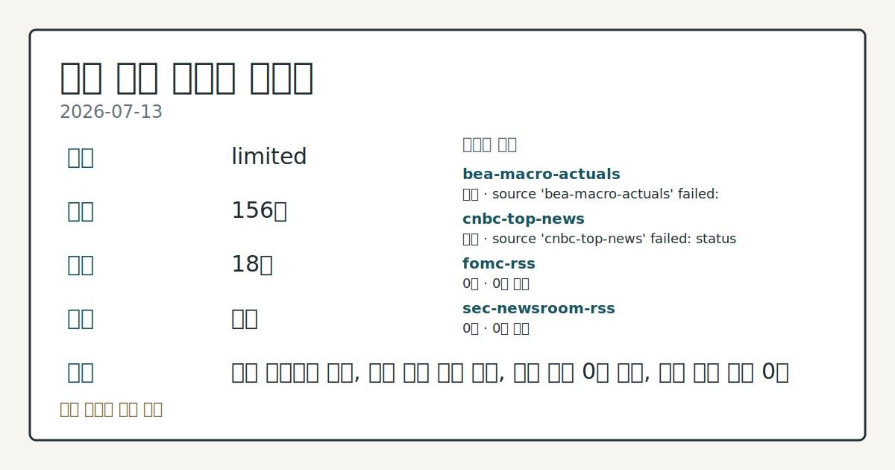
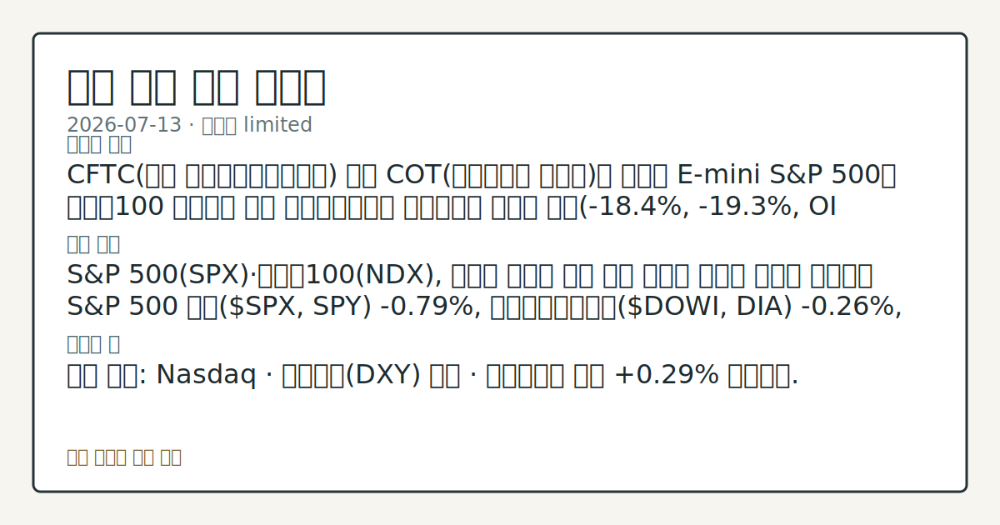

> 정보 제공용 자동 시황이며 매매 권유가 아닙니다.
# 2026-07-13 미국 증시 시황
**기준 시각**: 2026-07-13 NY · 2026-07-13T04:00Z, 2026-07-14T04:00Z)
| 종목 | 종가 | 변동 | 비고 |
|------|------|------|------|
| ^GSPC | 7,515.34 | -0.79% | -1.24% from 52w high · +9.58% YTD |
| ^IXIC | 25,873.18 | -1.55% | -4.51% from 52w high · +11.35% YTD |
| ^DJI | 52,498.64 | -0.26% | -1.05% from 52w high · +8.51% YTD |
| AAPL | 317.31 | +0.63% | ATH 경신 · +17.08% YTD |
| MSFT | 390.99 | +1.53% | +10.82% from 52w low · -17.33% YTD |
**세그먼트**: [국내 증시](../../../domestic-equity/2026/07/2026-07-13.md) | [미국 증시](2026-07-13.md) | [크립토](../../../crypto/2026/07/2026-07-13.md)

*이미지: 데이터 신뢰도 · 출처: investo 자체 생성 · 생성: investo 0.1.0 · 2026-07-13 UTC*
> **내 관심 자산 영향**: 데이터 수집 부족으로 매칭 판단 보류 — 추가 수집 후 재평가됩니다.
> **용어 가이드**: 이번 시황에서 처음 등장한 용어 — E-mini S&P 500(미니 S&P 500 선물)
> **오늘의 결론**: CFTC(미국 상품선물거래위원회) 최신 COT(선물포지션 보고서)에 따르면 E-mini S&P 500과 나스닥100 미니선물 모두 레버리지드머니 순포지션이 순매도 우위(**-18.4%**, **-19.3%**, OI 대비)를 나타내 위험자산 선호가 위축된 모습이다. 수집 근거가 제한적입니다
> **핵심 동인**: S&P 500(SPX)·나스닥100(NDX), 반도체 약세로 하락 관련 기사에 따르면 월요일 정규장은 S&P 500 지수($SPX, SPY) **-0.79%**, 다우존스산업평균($DOWI, DIA) **-0.26%**, 나스닥100 지수($IUXX, QQQ) **-1.88%**로 하락 마감한 것으로 보도됐다.
> **주의할 점**: 확인 소스: Nasdaq · 달러지수(DXY) 기사 · 달러지수가 이날 **+0.29%** 상승했다.
Now composing the briefing.
## 한눈에 보기
S&P 500·다우존스·나스닥100 3대 지수가 각각 **-0.79%**, **-0.26%**, **-1.88%** 하락 마감(보도 기준), 반도체주 약세가 낙폭을 키웠다.
**INTC**(인텔)가 **-6.12%**, **NVDA**(엔비디아)가 **-3.52%** 하락하며 시장 평균보다 큰 폭의 조정을 기록했다.
CFTC 선물포지션(COT)상 나스닥100·S&P500 선물 레버리지드머니가 순매도 우위 — 본문 §③·§⑥ 참조.
## ⓪ 오늘의 매크로
**국제 유가** — CFTC WTI crude oil managed_money net +64041 contracts
**미 국채 수익률** — UST curve 2026-07-13: 10Y 4.62%, 2Y10Y +0.36pp
## ⓪-B 채널 기준선
| 기준선 | 값 |
|------|------|
| S&P 500 | 7,515.34 (-0.79%) |
| 나스닥 종합 | 25,873.18 (-1.55%) |
| 다우존스 | 52,498.64 (-0.26%) |
| CFTC 포지셔닝 | E-mini S&P 500 순포지션 -361875계약 (-18.37% OI), 2026-07-07 기준/2026-07-10 공개 · Nasdaq-100 mini 순포지션 -55013계약 (-19.30% OI), 2026-07-07 기준/2026-07-10 공개 · VIX futures 순포지션 5112계약 (1.37% OI), 2026-07-07 기준/2026-07-10 공개 · 주간 지연 |
> **크로스마켓 연결 고리**: 유가/지정학 이슈가 여러 자산군의 변동성 연결 고리로 관찰됩니다. / 금리 이벤트가 할인율/달러 경로의 공통 변수로 남아 있습니다.
> **오늘의 큰 그림:** 유가와 지정학 변수가 공통 변수지만, 섹터·실적 변동성를 먼저 확인해야 합니다.
## ① 요약

*이미지: 시장 스냅샷 · 출처: investo 자체 생성 · 생성: investo 0.1.0 · 2026-07-13 UTC*

CFTC 최신 COT에 따르면 [E-mini S&P 500](https://www.cftc.gov/MarketReports/CommitmentsofTraders/index.htm)과 나스닥100 미니선물 모두 레버리지드머니 순포지션이 순매도 우위를 나타내 위험자산 선호가 위축된 모습이다. 여기에 [반도체주 약세와 미국-이란 지정학 긴장](https://www.nasdaq.com/articles/stocks-settle-lower-chipmakers-routed-and-us-iran-tensions-escalate)이 겹치며 S&P 500·다우존스·나스닥100 3대 지수가 나란히 하락한 것으로 보도됐고, 안전자산 선호를 반영해 [달러지수도 상승](https://www.nasdaq.com/articles/dollar-rises-crude-prices-and-bond-yields)했다. BLS(노동통계국) 6월 고용지표는 실업률 **4.2%**로 전월(**4.3%**) 대비 낮아지는 등 혼재된 신호도 함께 확인된다. [하락 관찰]

## ② 전일 핵심 이슈

### S&P 500·나스닥100, 반도체 약세로 하락

[관련 기사](https://www.nasdaq.com/articles/stocks-settle-lower-chipmakers-routed-and-us-iran-tensions-escalate)에 따르면 월요일 정규장은 S&P 500 지수 **-0.79%**, 다우존스산업평균 **-0.26%**, 나스닥100 지수 **-1.88%**로 하락 마감한 것으로 보도됐다. 같은 이슈를 다룬 [후속 기사](https://www.nasdaq.com/articles/stocks-retreat-chipmaker-weakness-and-us-iran-standoff)는 같은 지수들의 낙폭을 각각 **-0.33%**, **-0.16%**, **-1.12%**로 다소 완화된 수준으로 전해 시점에 따른 편차가 있었다. 9월 E-mini S&P 선물(ESU26, 미니 S&P 500 선물)도 동반 약세를 나타냈다. 이는 7월 7일 관찰됐던 반도체 약세·유가 부담 흐름이 이어지는 모습이며, 7월 6일의 반도체 강세 흐름에서는 이탈한 상태다.

> **그래서 의미는?** 반도체 대형주 조정이 지수 전반의 하락폭을 키운 하루로 확인된다.

### 미국-이란 지정학 긴장과 달러 강세

[관련 기사](https://www.nasdaq.com/articles/dollar-rises-crude-prices-and-bond-yields)에 따르면 달러지수(DXY00, DXY)는 월요일 **+0.29%** 상승했다. 미국과 이란이 주말 동안 공격을 주고받으며 지정학 긴장이 고조된 데 따른 안전자산 수요가 배경으로 지목됐다. 미국 증시 세그먼트 관점에서는 이 지정학 리스크가 유가·에너지 관련 종목의 변동성과 반도체·기술주의 위험 프리미엄으로 연결되는 모습이다.

## ③ 섹터/수급 동향

### 선물시장 포지셔닝: 지수·국채 순매도 우위

[CFTC COT(선물포지션 보고서)](https://www.cftc.gov/MarketReports/CommitmentsofTraders/index.htm)에 따르면 10Y 국채선물 레버리지드머니 순포지션은 -2,004,023계약(OI 대비 **-37.7%**), E-mini S&P 500은 -361,875계약(**-18.4%**), 나스닥100 미니는 -55,013계약(**-19.3%**)으로 모두 순매도 우위였다. 반면 금(Gold) 매니지드머니는 +116,161계약(**+31.2%**) 순매수, WTI 원유 매니지드머니는 +64,041계약(**+3.4%**) 순매수, VIX 선물 레버리지드머니는 +5,112계약(**+1.4%**) 순매수로 나타났다. 달러인덱스 선물은 -4,454계약(**-8.3%**)으로 소폭 순매도 우위였다.

> **그래서 의미는?** 위험자산 선물에서는 순매도, 금·원유·변동성 선물에서는 순매수 우위로 방어적 포지셔닝이 관찰된다.

### 에너지 재고: EIA 주간 지표

[EIA(에너지정보청) 주간석유현황보고서(WPSR)](https://www.eia.gov/petroleum/supply/weekly/)(2026-07-03 기준)에 따르면 미국 상업 원유 수입은 5,629 MBBL/D(천 배럴/일), 상업 원유 재고는 411,357 MBBL, 정제유(distillate) 재고는 103,619 MBBL, 총 휘발유 재고는 212,062 MBBL, 원유 생산량은 13,860 MBBL/D, 정유가동률은 **95.8%**로 집계됐다.

참고로 CFTC는 최근 [비정리 스와프 증거금 규정 개정 최종안](https://www.cftc.gov/PressRoom/PressReleases/9266-26)을 승인했다고 공지했다.

## ④ 지표·이벤트

### 고용·물가 지표(BLS)

[BLS](https://www.bls.gov/data/) 발표에 따르면 6월 실업률(Unemployment Rate)은 **4.2%**로 전월 **4.3%**에서 낮아졌고, 6월 비농업 고용(Total nonfarm payroll employment)은 158,984천 명(전월 158,927천 명)이었다. 6월 노동참가율(Labor Force Participation Rate)은 **61.5%**(전월 **61.8%**)로 낮아졌고, 5월 구인건수(Job Openings)는 7,594천 건(전월 7,585천 건)이었다. 5월 소비자물가지수(CPI, Consumer Price Index)는 333.979(전월 332.407), 근원 CPI(Core CPI)는 336.121(전월 335.423), 5월 생산자물가지수(PPI, Producer Price Index Final Demand)는 157.659(전월 156.011), 6월 시간당 평균임금(Average hourly earnings)은 37.64달러(전월 37.51달러)로 집계됐다.

> **그래서 의미는?** 실업률은 낮아졌지만 노동참가율도 함께 낮아져 고용 시장 신호가 엇갈린다.

### 연방기금금리(DFF)·연준 일정(FOMC)

[FRED](https://fred.stlouisfed.org/series/DFF) 기준 DFF(연방기금금리)는 **3.62%**로 전일 대비 변동이 없었다. [FRED](https://fred.stlouisfed.org/series/UNRATE) UNRATE(실업률) 계열도 최신치 **4.2%**(전월 **4.3%**)로 위 BLS 수치와 일치한다. 연준(Fed) 일정으로는 오늘(7/13) [Christopher J. Waller](https://www.federalreserve.gov/newsevents/calendar.htm) 이사의 경제 전망 연설(뉴욕, 오후 12:30)과 [Michelle W. Bowman](https://www.federalreserve.gov/newsevents/calendar.htm) 부의장의 금융규제 현대화 관련 발언(오전 5:25)이 예정돼 있고, 내일(7/14)은 [Lisa D. Cook](https://www.federalreserve.gov/conferences/next-gen-financial-inclusion.htm) 이사의 AI·금융포용 관련 토론이 예정돼 있다. 현재 연준(Fed) 의장은 케빈 워시(Kevin Warsh)로 확인된다.

### 변동성 지수(VVIX)

[Cboe VVIX](https://cdn.cboe.com/api/global/us_indices/daily_prices/VVIX_History.csv)(변동성지수의 변동성)는 7월 13일 종가 기준 95.28을 기록했다.

## ⑤ 주요 종목

<!-- u50 lightweight-charts-embed: placeholders consumed by site_docs/assets/investo-chart-init.js -->

<noscript><em>인터랙티브 차트는 JavaScript가 활성화된 환경에서 표시됩니다. 위 정적 카드가 동일한 정보를 담고 있습니다.</em></noscript>

### 하락 관찰

[INTC](https://www.nasdaq.com/articles/intel-intc-declines-more-market-some-information-investors)(인텔)는 **$103.12**로 전일 대비 **-6.12%**, [NVDA](https://www.nasdaq.com/articles/nvidia-nvda-registers-bigger-fall-market-important-facts-note-0)(엔비디아)는 **$203.53**로 **-3.52%**, [VRT](https://www.nasdaq.com/articles/vertiv-holdings-co-vrt-falls-more-steeply-broader-market-what-investors-need-know)(버티브 홀딩스)는 **$305.87**로 **-4.07%**, [GOOGL](https://www.nasdaq.com/articles/alphabet-googl-sees-more-significant-dip-broader-market-some-facts-know-0)(알파벳)은 **$352.51**로 **-1.31%**, [COIN](https://www.nasdaq.com/articles/coinbase-global-inc-coin-suffers-larger-drop-general-market-key-insights-0)(코인베이스)은 **$157.37**로 **-1.07%**, [UUUU](https://www.nasdaq.com/articles/energy-fuels-uuuu-dips-more-broader-market-what-you-should-know-0)(에너지퓨얼스)는 **$13.05**로 **-3.9%**, [META](https://www.nasdaq.com/articles/meta-platforms-meta-registers-bigger-fall-market-important-facts-note)(메타 플랫폼스)는 **$656.73**로 **-1.86%** 하락 마감했다.

### 상승 관찰

[PANW](https://www.nasdaq.com/articles/palo-alto-networks-panw-gains-market-dips-what-you-should-know)(팔로알토네트웍스)는 **$330.3**로 **+1.35%**, [PFE](https://www.nasdaq.com/articles/pfizer-pfe-advances-while-market-declines-some-information-investors)(화이자)는 **$24.48**로 **+1.28%**, [GCT](https://www.nasdaq.com/articles/gigacloud-technology-inc-gct-rises-market-takes-dip-key-facts)(기가클라우드 테크놀로지)는 **$35.4**로 **+2.88%** 상승했다.

> **그래서 의미는?** INTC·NVDA 등 반도체 종목이 시장 평균보다 크게 하락한 반면 PANW·PFE 등 일부 종목은 반대로 상승해 종목별 온도차가 확인된다.

## ⑥ 오늘의 관전 포인트

> **관전 포인트**: 구조화 가능한 관찰 신호가 부족합니다 — 본문 §②·§④ 참조

> **데이터 상태**: 제한

수집/품질 진단

> **데이터 상태**: 제한 — 수집 156건 / 소스 18개 / 누락: 가격 · 제한 — 핵심 가격 소스 0건/실패/stale, 본문 결론 신뢰도 낮음
> **소스 카운트**: 수집 대상 25 / 성공 18 / 수집 상세는 진단 섹션에서 확인할 수 있습니다. / 수집 상세는 진단 섹션에서 확인할 수 있습니다. / 수집 상세는 진단 섹션에서 확인할 수 있습니다.
> **소스 등급 분포**: S=11 / A=7
> **상세 사유**: 가격 카테고리 누락, 일부 소스 수집 실패, 일부 소스 0건 반환, 핵심 가격 소스 0건
> **소스별 상태**: bea-macro-actuals 실패 (설정 미완료(미수집)), cnbc-top-news 실패 (접근 제한), fomc-rss 0건, sec-newsroom-rss 0건, stooq-price 0건, yahoo-finance-news 0건, yfinance-price 0건, 정상 18개

## ⑦ 면책조항
본 시황은 일반 정보 제공을 목적으로 자동 생성된 자료이며,
특정 종목·자산에 대한 매매 권유나 투자 자문이 아닙니다.
투자 결정과 그 결과에 대한 책임은 전적으로 본인에게 있으며,
본 시황의 내용에 따라 발생한 손실에 대해 작성자는 일체의 책임을 지지 않습니다.