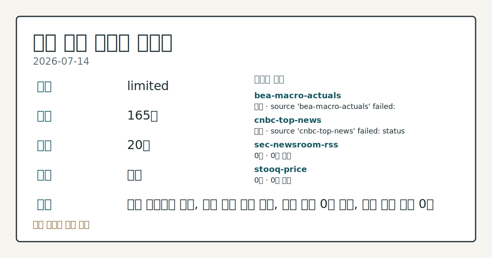
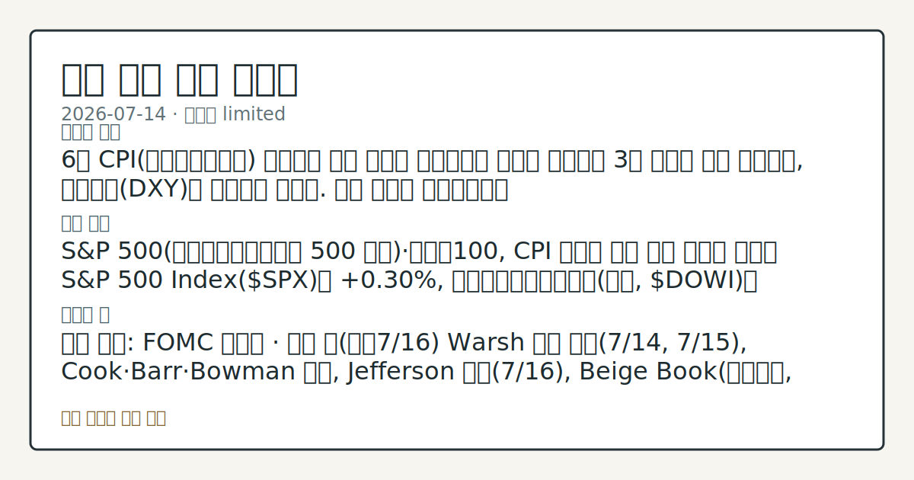

> 정보 제공용 자동 시황이며 매매 권유가 아닙니다.
# 2026-07-14 미국 증시 시황
**기준 시각**: 2026-07-14 NY · 2026-07-14T04:00Z, 2026-07-15T04:00Z)
| 종목 | 종가 | 변동 | 비고 |
|------|------|------|------|
| ^GSPC | 7,543.59 | +0.38% | -0.87% from 52w high · +9.99% YTD |
| ^IXIC | 26,107.01 | +0.90% | -3.64% from 52w high · +12.36% YTD |
| ^DJI | 52,508.27 | +0.02% | -1.03% from 52w high · +8.53% YTD |
| AAPL | 314.86 | -0.77% | -0.77% from 52w high · +16.18% YTD |
| MSFT | 384.93 | -1.55% | +9.10% from 52w low · -18.61% YTD |
**세그먼트**: [국내 증시](../../../domestic-equity/2026/07/2026-07-14.md) | [미국 증시](2026-07-14.md) | [크립토](../../../crypto/2026/07/2026-07-14.md)

*이미지: 데이터 신뢰도 · 출처: investo 자체 생성 · 생성: investo 0.1.0 · 2026-07-14 UTC*
> **내 관심 자산 영향**: 데이터 수집 부족으로 매칭 판단 보류 — 추가 수집 후 재평가됩니다.
> **용어 가이드**: 이번 시황에서 처음 등장한 용어 — ESU26(미니 S&P 500 선물)
> **오늘의 결론**: 6월 CPI(소비자물가지수) 상승률이 시장 예상을 하회했다는 소식에 뉴욕증시 3대 지수가 동반 상승했고, 달러지수(DXY)는 되돌림을 보였다. 수집 근거가 제한적입니다
> **핵심 동인**: S&P 500(스탠더드앤드푸어스 500 지수)·나스닥100, CPI 둔화에 상승 관련 기사에 따르면 S&P 500 Index($SPX)는 **+0.30%**, 다우존스산업평균지수(다우, $DOWI)는 **+0.60%**, 나스닥100(대형 기술주 100종목 지수, $IUXX)은 **+0.97%** 상승했고, 9월물 미니 S&P 선물(ESU26, 미니 S&P 500 9월물 선물)도 **+0.28%** 올랐다.
> **주의할 점**: 확인 소스: FOMC 캘린더 · 이번 주(오늘7/16) Warsh 의장 증언(7/14, 7/15), Cook·Barr·Bowman 발언 본문 참고.
## 한눈에 보기
미국 3대 지수가 6월 소비자물가 지표 둔화 소식에 동반 상승했다 — **관련 기사** 기준 S&P 500 **+0.30%**~**+0.38%**, 다우존스 **+0.60%**, 나스닥100 **+0.97%**~**+1.10%** 구간.
CFTC(미국 상품선물거래위원회) COT(선물포지션 보고서)에 따르면 E-mini S&P 500 레버리지드머니 순포지션이 -361,875계약(전체 미결제약정의 **-18.4%**)으로 순매도 우위를 유지했다.
연방기금실효금리(DFF)는 **3.62%**로 전일 대비 변동이 없었다 — 이번 주 예정된 Fed 인사 발언 톤은 §④·§⑥ 참조.
## ⓪ 오늘의 매크로
**FOMC 일정** — 2026-07-29 — FOMC Meeting
**국제 유가** — CFTC WTI crude oil managed_money net +64041 contracts
**미 국채 수익률** — UST curve 2026-07-14: 10Y 4.58%, 2Y10Y +0.40pp
## ⓪-B 채널 기준선
| 기준선 | 값 |
|------|------|
| S&P 500 | 7,543.59 (+0.38%) |
| 나스닥 종합 | 26,107.01 (+0.90%) |
| 다우존스 | 52,508.27 (+0.02%) |
| CFTC 포지셔닝 | E-mini S&P 500 순포지션 -361875계약 (-18.37% OI), 2026-07-07 기준/2026-07-10 공개 · Nasdaq-100 mini 순포지션 -55013계약 (-19.30% OI), 2026-07-07 기준/2026-07-10 공개 · VIX futures 순포지션 5112계약 (1.37% OI), 2026-07-07 기준/2026-07-10 공개 · 주간 지연 |
> **크로스마켓 연결 고리**: 유가/지정학 이슈가 여러 자산군의 변동성 연결 고리로 관찰됩니다. / 금리 이벤트가 할인율/달러 경로의 공통 변수로 남아 있습니다.
> **오늘의 큰 그림:** 금리와 달러 변수가 공통 변수지만, Nasdaq·Dow 섹터 변동성를 먼저 확인해야 합니다.
## ① 요약

*이미지: 시장 스냅샷 · 출처: investo 자체 생성 · 생성: investo 0.1.0 · 2026-07-14 UTC*

6월 CPI 상승률이 시장 예상을 하회했다는 소식에 뉴욕증시 3대 지수가 동반 상승했고, 달러지수는 되돌림을 보였다. 다만 CFTC(미국 상품선물거래위원회) COT는 E-mini S&P 500과 10Y 국채선물 모두에서 레버리지드머니 순매도 우위가 유지되고 있음을 보여줘, 지수 상승과 파생 포지셔닝 사이에는 온도차가 존재한다. 어제(2026-07-13)까지의 서술이 COT 포지셔닝 중심이었다면, 오늘은 물가 지표가 지수 상승의 직접 동인으로 부각됐다는 점에서 흐름이 일부 전환됐다. JPM·GS 등 대형 금융주 실적 발표를 앞두고 어닝시즌 초입 관심도 함께 높아지고 있다. [상승 관찰]

## ② 전일 핵심 이슈

### S&P 500·나스닥100, CPI 둔화에 상승

[관련 기사](https://www.nasdaq.com/articles/stocks-rally-fed-friendly-cpi-report)에 따르면 S&P 500 Index는 **+0.30%**, 다우존스산업평균지수는 **+0.60%**, 나스닥100은 **+0.97%** 상승했고, 9월물 미니 S&P 선물도 **+0.28%** 올랐다. 별도 [기사](https://www.nasdaq.com/articles/stocks-settle-higher-tame-inflation-news)는 같은 흐름 속에 S&P 500이 **+0.38%**, 나스닥100이 **+1.10%** 마감했다고 전했고, [또 다른 기사](https://www.nasdaq.com/articles/stocks-supported-bond-yields-slide-weak-cpi-report)는 국채 금리 하락이 증시를 지지했다고 덧붙였다. 6월 CPI 지표 자체의 세부 수치는 §④에서 확인할 수 있다.

> **그래서 의미는?** 물가 둔화 소식이 금리 인하 기대를 자극하며 지수 상승의 배경이 됐습니다.

### 달러(DXY), CPI 발표 후 되돌림

[기사](https://www.nasdaq.com/articles/dollar-falls-and-gold-rallies-us-cpi-trails-estimates)에 따르면 달러지수(DXY00, 달러지수)는 **-0.55%** 하락했고, [다른 기사](https://www.nasdaq.com/articles/dollar-declines-benign-us-cpi-report)는 같은 맥락에서 달러지수가 **-0.32%** 내렸다고 전했다. 두 기사 모두 완화적(dovish) CPI 결과가 Fed(연방준비제도) 금리 인상 가능성을 낮췄다는 점을 이유로 들었다. 어제까지 강조되던 COT(선물포지션 보고서) 중심 서술과 달리, 오늘은 물가 지표가 달러·증시 흐름의 직접 동인으로 부각됐다는 점에서 지난 며칠간의 반도체주 중심 서술과도 결이 다르다.

## ③ 섹터/수급 동향

CFTC COT 최신 자료 기준 주요 자산군의 레버리지드머니/매니지드머니 순포지션은 다음과 같다.

| 자산 | 포지션 유형 | 순포지션(계약) | 미결제약정(OI, 미결제약정) 대비 |
|------|------------|----------------|------|
| 10Y 국채선물 | 레버리지드머니 | -2,004,023 | -37.7% |
| E-mini S&P 500 | 레버리지드머니 | -361,875 | -18.4% |
| 금(Gold) | 매니지드머니 | +116,161 | +31.2% |
| 나스닥100 미니 | 레버리지드머니 | -55,013 | -19.3% |
| 달러인덱스 | 레버리지드머니 | -4,454 | -8.3% |
| VIX 선물 | 레버리지드머니 | +5,112 | +1.4% |
| WTI 원유 | 매니지드머니 | +64,041 | +3.4% |

> **그래서 의미는?** 지수·국채선물 모두 순매도 우위로, 오늘 지수 상승과 파생 포지셔닝 방향이 엇갈립니다.

10Y 국채선물과 E-mini S&P 500 모두에서 순매도 규모가 미결제약정의 **-37.7%**, **-18.4%**로 큰 비중을 차지하는 반면, 금(Gold)은 **+31.2%**, WTI 원유는 **+3.4%** 순매수 우위를 보여 자산군 간 포지셔닝 방향이 엇갈리고 있다. 모든 수치는 [CFTC 공식 COT 보고서](https://www.cftc.gov/MarketReports/CommitmentsofTraders/index.htm) 기준이며 인트라데이 흐름이 아닌 주간 스냅샷이다.

## ④ 지표·이벤트

### 6월 물가·고용 지표

BLS(미 노동통계국)와 FRED(세인트루이스 연은 경제데이터) 기준 6월(일부 5월) 지표는 다음과 같다.

| 지표 | 실적 | 전월(비교) |
|------|------|------|
| CPI(소비자물가지수, CPIAUCSL) | 332.568 | 333.979 |
| Core CPI(근원 소비자물가지수) | 336.065 | 336.121 |
| PPI(생산자물가지수) Final Demand | 157.659 | 156.011 |
| 실업률(UNRATE) | 4.2% | 4.3% |
| 평균 시간당 임금 | $37.64 | $37.51 |
| 노동참가율 | 61.5% | 61.8% |
| 비농업 고용 | 158,984천명 | 158,927천명 |
| 구인건수(Job Openings) | 7,594 | 7,585 |

CPIAUCSL은 **332.568**로 전월 333.979 대비 하락했고([FRED](https://fred.stlouisfed.org/series/CPIAUCSL)), 실업률은 전월 **4.3%**에서 **4.2%**로 낮아졌다([FRED](https://fred.stlouisfed.org/series/UNRATE)). 같은 수치는 [BLS](https://www.bls.gov/data/)에서도 확인된다.

> **그래서 의미는?** 물가는 둔화하고 실업률은 낮아져, 인플레이션과 고용 지표가 상반된 신호를 주고 있습니다.

### 연준(Fed) 정책 프레임 및 일정

연방기금실효금리는 **3.62%**로 전일과 동일하게 유지됐다([FRED](https://fred.stlouisfed.org/series/DFF)). FOMC(연방공개시장위원회) 산하 연준 이사회는 6월 8일·17일 논의된 재할인율 회의록을 오늘(2026-07-14) 공개했다([연준](https://www.federalreserve.gov/newsevents/pressreleases/monetary20260714a.htm)). 검증된 현재 팩트에 따르면 현재 연준 의장은 Kevin Warsh(케빈 워시)이며, 오늘 Warsh 의장의 의회 증언(Testimony)이 예정돼 있다. 같은 날 Governor Lisa D. Cook의 토론([연준](https://www.federalreserve.gov/conferences/next-gen-financial-inclusion.htm))과 Governor Michael S. Barr의 대담([연준](https://www.federalreserve.gov/conferences/next-gen-financial-inclusion.htm))이 연준 금융포용 컨퍼런스에서 진행된다. VVIX(변동성지수의 변동성)는 **93.53**으로 [Cboe](https://cdn.cboe.com/api/global/us_indices/daily_prices/VVIX_History.csv) 공식 종가 기준이다.

## ⑤ 주요 종목

<!-- u50 lightweight-charts-embed: placeholders consumed by site_docs/assets/investo-chart-init.js -->

<noscript><em>인터랙티브 차트는 JavaScript가 활성화된 환경에서 표시됩니다. 위 정적 카드가 동일한 정보를 담고 있습니다.</em></noscript>

### 실적 발표 예정

| 티커(기업) | 발표 시점 | EPS(주당순이익) 예상 | 전년 EPS |
|------|------|------|------|
| JPM(JP모건체이스) | 장전 | $5.59 | $4.96 |
| GS(골드만삭스) | 장전 | $14.47 | $10.91 |
| BAC(뱅크오브아메리카) | 장전 | $1.13 | $0.89 |
| WFC(웰스파고) | 장전 | $1.73 | $1.54 |
| C(시티그룹) | 장전 | $2.72 | $1.96 |
| FAST(패스널) | 장전 | $0.33 | $0.29 |
| ERIC(에릭슨) | 장전 | $0.13 | $0.14 |

> **그래서 의미는?** JPM·GS 등 대형 금융주 실적이 이번 어닝시즌 초반 분위기를 가늠할 재료입니다.

### 개별 종목 확인 항목

[MCD(맥도날드)](https://www.nasdaq.com/articles/mcdonalds-mcd-stock-slides-market-rises-facts-know-you-trade)는 **$268.94**로 **-1.35%**, [INTU(인튜이트)](https://www.nasdaq.com/articles/intuit-intu-stock-sinks-market-gains-what-you-should-know)는 **$282.43**로 **-2.53%**, [LMT(록히드마틴)](https://www.nasdaq.com/articles/lockheed-martin-lmt-stock-sinks-market-gains-what-you-should-know)는 **$514.99**로 **-1.09%** 변동했다. 반면 [NU(누홀딩스)](https://www.nasdaq.com/articles/nu-holdings-ltd-nu-outpaces-stock-market-gains-what-you-should-know)는 **$13.99**로 **+2.34%**, [DXPE(DXP엔터프라이지스)](https://www.nasdaq.com/articles/dxp-enterprises-dxpe-surpasses-market-returns-some-facts-worth-knowing)는 **$163.52**로 **+2.07%**, [ENB(엔브리지)](https://www.nasdaq.com/articles/enbridge-enb-beats-stock-market-upswing-what-investors-need-know)는 **$55.89**로 **+1.49%**, [M(메이시스)](https://www.nasdaq.com/articles/macys-m-laps-stock-market-heres-why)는 **$23.21**로 **+1.89%** 마감했다.

## ⑥ 오늘의 관전 포인트

#### 관찰 신호: 10Y 국채선물 레버리지드머니 순포지션 -2,004,0…

- 출처: CFTC COT
- 현재: CFTC COT · 10Y 국채선물 레버리지드머니 순포지션 -2,004,023계약(OI 대비 **-37.7%**) — 순매도가 축소되면 금리 하방 안정으로 관찰하고, 심화되면 금리 변동성 확대로 해석한다. 관심 영향: 국채금리 경로가 성장주 밸류에이션에 미치는 영향을 점검한다.
- 확인 조건: 상방 심화되면 금리 변동성 확대로 해석한다; 하방 10Y 국채선물 레버리지드머니 순포지션 -2,004,023계약(OI 대비 **-37.7%**) — 순매도가 축소되면 금리 하방 안정으로 관찰하고
- 신뢰도: 높음
- 관심 영향: 국채금리 경로가 성장주 밸류에이션에 미치는 영향을 점검한다.

#### 관찰 신호: JPM EPS 예상 **$5.59**(전년 **$4.9…

- 출처: 나스닥 실적 캘린더
- 현재: JPM EPS 예상 **$5.59**(전년 **$4.96**)
- 확인 조건: 상방 GS EPS 예상 **$14.47**(전년 **$10.91**) — 예상치를 상회하면 금융섹터 심리 개선으로 관찰하고; 하방 하회하면 방어적 해석으로 본다
- 신뢰도: 높음
- 관심 영향: 어닝시즌 초반 금융주 수급을 점검한다.

> **데이터 상태**: 제한

수집/품질 진단

> **데이터 상태**: 제한 — 수집 165건 / 소스 20개 / 누락: 가격 · 제한 — 핵심 가격 소스 0건/실패/stale, 본문 결론 신뢰도 낮음
> **소스 카운트**: 수집 대상 25 / 성공 20 / 수집 상세는 진단 섹션에서 확인할 수 있습니다. / 수집 상세는 진단 섹션에서 확인할 수 있습니다. / 수집 상세는 진단 섹션에서 확인할 수 있습니다.
> **소스 등급 분포**: S=12 / A=8
> **상세 사유**: 가격 카테고리 누락, 일부 소스 수집 실패, 일부 소스 0건 반환, 핵심 가격 소스 0건
> **소스별 상태**: bea-macro-actuals 실패 (설정 미완료(미수집)), cnbc-top-news 실패 (접근 제한), sec-newsroom-rss 0건, stooq-price 0건, yfinance-price 0건, 정상 20개

## ⑦ 면책조항
본 시황은 일반 정보 제공을 목적으로 자동 생성된 자료이며,
특정 종목·자산에 대한 매매 권유나 투자 자문이 아닙니다.
투자 결정과 그 결과에 대한 책임은 전적으로 본인에게 있으며,
본 시황의 내용에 따라 발생한 손실에 대해 작성자는 일체의 책임을 지지 않습니다.